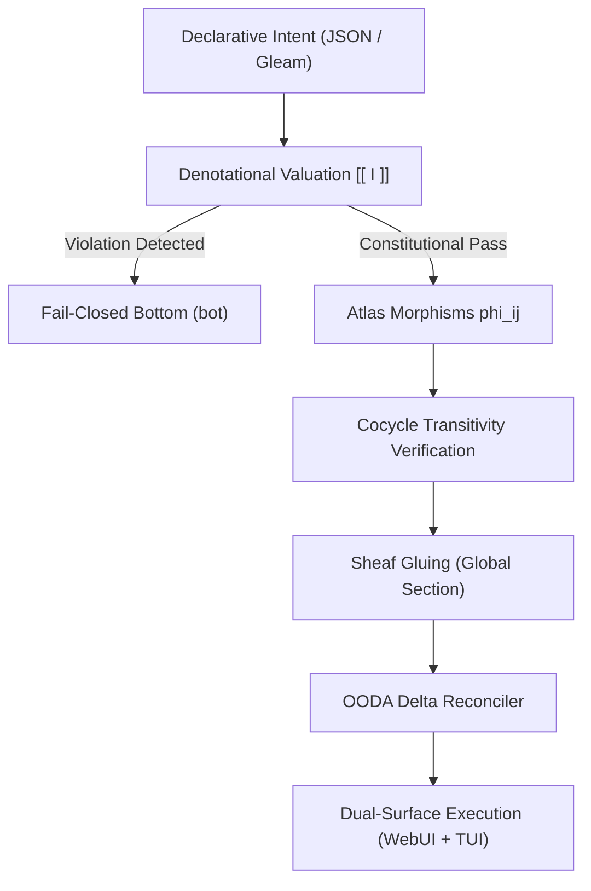

# UOS 5-Cycle Design Tome: Denotational Intent, Algebraic Atlas & Multi-Surface Cockpit

#fractal-l0 #fractal-l1 #fractal-l2 #fractal-l3 #fractal-l4 #fractal-l5 #fractal-l6 #fractal-l7 #fractal-l8 #fractal-l9 #zero-muda #tailscale-web #checklist-nav #km-triad #algebraic-atlas #denotational-intent

**UOS / Design / 5-Cycle Tome** · [Cockpit](http://nas-1.tail55d152.ts.net:4100/) · [Planning](http://nas-1.tail55d152.ts.net:4100/planning) · [Wiki](http://nas-1.tail55d152.ts.net:4100/wiki) · [ZK](http://nas-1.tail55d152.ts.net:4100/zk) · [Checklist](http://nas-1.tail55d152.ts.net:4100/checklist)
**Contract Reference:** `SC-INTENT-ATLAS-001`, `SC-DENOTATIONAL-INTENT-001`, `SC-PROVENANCE-001`, `SC-GLM-UI-001`, `SC-JIDOKA-001`
**Sole Execution Authority:** `sa-plan` (`uos/design-implementation-approach/20260908-1540`)
**Admitted EV Ceiling:** `EV-93` (`INV-PROV-05`); work numbered under cycles `C308`..`C312`.

---

## 1. Executive Summary & Design Approach

The Unified Operational System (UOS) synthesizes the cybernetic control principles of C3I and the distributed mesh capabilities of Indrajaal into a unified, mathematically verifiable holonic architecture. Rather than relying on imperative scripts, side-effect-heavy mutations, or brittle orchestration, UOS enforces a **Denotational Intent-Based Model** operating over an **Algebraic Atlas Sheaf Geometry**.

This design tome articulates the complete mathematical foundations, software architectures, test methodologies, and deployment harnesses developed and ratified across evolutionary cycles `C308` through `C312`.

```text
+-----------------------------------------------------------------------------+
|                          DENOTATIONAL INTENT LIFECYCLE                      |
+-----------------------------------------------------------------------------+
|                                                                             |
|  [ Declarative Intent ]                                                     |
|            |                                                                |
|            v                                                                |
|  [ Denotational Valuation [[ I ]] ] ──(Unconstitutional)──> [ Bottom (bot) ]|
|            |                                                                |
|      (Constitutional)                                                       |
|            v                                                                |
|  [ Algebraic Atlas Morphisms phi_ij ]                                       |
|            |                                                                |
|            v                                                                |
|  [ Sheaf Gluing -> Unique Global Section ]                                  |
|            |                                                                |
|            v                                                                |
|  [ OODA Delta Reconciler (Delta Compute) ]                                  |
|            |                                                                |
|            v                                                                |
|  [ Dual-Surface Execution (WebUI MVU + System TUI ANSI) ]                   |
+-----------------------------------------------------------------------------+
```



---

## 2. Denotational Intent Semantics & State Lattice (`C308`)

### 2.1 The Complete Partially Ordered State Lattice $(\Sigma_\bot, \sqsubseteq)$

System states $\sigma \in \Sigma$ are tuples containing 13D trace coordinates $\vec{\mathcal{T}}_{13} \in \mathbb{R}^{13}$, epoch version $v \in \mathbb{N}$, and holonic configuration bindings. We augment $\Sigma$ with a bottom element $\bot$, denoting undefined, failed, or unconstitutional states:
$$\Sigma_\bot = \Sigma \cup \{\bot\}$$

The information partial order $\sqsubseteq$ is defined as:
1. $\forall \sigma \in \Sigma_\bot, \bot \sqsubseteq \sigma$ (Bottom is the least element).
2. For $\sigma_1, \sigma_2 \in \Sigma$:
   $$\sigma_1 \sqsubseteq \sigma_2 \iff v(\sigma_1) \le v(\sigma_2) \land \vec{\mathcal{T}}_{13}(\sigma_1) \le \vec{\mathcal{T}}_{13}(\sigma_2)$$
   where the coordinate inequality holds component-wise.

### 2.2 Denotational Valuation $\llbracket I \rrbracket$

Every declarative intent $I$ denotes a continuous state transformation morphism:
$$\llbracket I \rrbracket : \Sigma_\bot \to \Sigma_\bot$$
subject to strict fail-closed safety interlocks:

1. **Bottom Absorption**:
   $$\llbracket I \rrbracket(\bot) = \bot$$
2. **Authority Interlock (`SC-JIDOKA-001`)**:
   $$\text{authority}(I) \neq \text{"sa-plan"} \implies \llbracket I \rrbracket(\sigma) = \bot$$
3. **Hardware Storage Lock**:
   $$\text{target\_drive\_serial}(I) = \text{"25503L801736"} \implies \llbracket I \rrbracket(\sigma) = \bot$$
4. **Guardian Approval Interlock ($\Omega_0$)**:
   $$\text{criticality}(I) = \text{DAL-A} \land \neg \text{guardian\_approved}(I) \implies \llbracket I \rrbracket(\sigma) = \bot$$

### 2.3 Monotonicity Theorem
For all monotonic intents $I$:
$$\sigma_1 \sqsubseteq \sigma_2 \implies \llbracket I \rrbracket(\sigma_1) \sqsubseteq \llbracket I \rrbracket(\sigma_2)$$
Proved in Lean 4 (`formal/lean/Denotational_Intent_Design.lean`) and enforced at runtime in `apps/cepaf_gleam/src/cepaf_gleam/semantics/algebraic_atlas.gleam`.

---

## 3. Algebraic Atlas Sheaf Geometry (`C309`)

### 3.1 10-Chart Covering of the Holonic Manifold

The system state space is covered by an open atlas of 10 charts $\{U_0, \dots, U_9\}$, each representing a distinct fractal abstraction layer:
- $U_0$: $L_0$ Constitutional & Guardian Consensus
- $U_1$: $L_1$ Atomic NIF & Memory Sandboxes
- $U_2$: $L_2$ Component State & Data Grids
- $U_3$: $L_3$ Transaction & SQLite WAL Ledgers
- $U_4$: $L_4$ System Supervised Daemons
- $U_5$: $L_5$ Cognitive OODA Loops & Rete-UL
- $U_6$: $L_6$ Ecosystem Agent Mesh
- $U_7$: $L_7$ Federated Gateway & Zenoh Bus
- $U_8$: $L_8$ Biomorphic Homeostasis & Chaos Engine
- $U_9$: $L_9$ Swarm Mesh & Work-Stealing Coordination

### 3.2 Transition Morphisms & Cocycle Law

Between any two charts $U_i$ and $U_j$, transition morphisms are defined by coordinate scaling isomorphisms:
$$\phi_{ij}(x) = x \cdot \left(\frac{j + 1}{i + 1}\right)$$
These morphisms satisfy the exact cocycle conditions required of a topological sheaf:
1. **Identity**: $\phi_{ii} = \text{id}_{U_i}$.
2. **Invertibility**: $\phi_{ji} = \phi_{ij}^{-1}$.
3. **Cocycle Transitivity**:
   $$\forall i, j, k \in \{0, \dots, 9\}, \quad \phi_{jk} \circ \phi_{ij} = \phi_{ik}$$
Exhaustively verified across all $10 \times 10 \times 10 = 1,000$ chart triples by `verify_all_cocycles` in Gleam and `USECASE-07` in Python.

### 3.3 Sheaf Gluing Property

Given local sections $s_i \in \mathcal{F}(U_i)$ such that for all $i, j$:
$$\phi_{ij}(s_i|_{U_i \cap U_j}) = s_j|_{U_i \cap U_j}$$
there exists a **unique global section** $s \in \mathcal{F}(M)$ such that $s|_{U_i} = s_i$. This guarantees that cross-layer telemetries and state diffs reconcile into a globally coherent system view without race conditions.

---

## 4. Declarative Intent Configuration & Delta Engine (`C310`)

### 4.1 Schema Definition & Typed Codecs

Configuration is represented as a pure Gleam type `IntentConfig`:
```gleam
pub type IntentConfig {
  IntentConfig(
    version: String,
    name: String,
    authority: String,
    target_drive_serial: String,
    prajna_health_threshold: Float,
    topology_nodes: List(String),
    containers: List(ContainerIntent),
    zenoh_topics: List(String),
  )
}
```
Serialized and parsed using type-safe functional decoders (`gleam/dynamic/decode` and `gleam/json`), eliminating reflection and runtime type coercion vulnerabilities.

### 4.2 Algebraic Delta Computation

The OODA reconciler calculates the difference between current state $S_{curr}$ and desired intent $S_{des}$:
$$\Delta(S_{curr}, S_{des}) = (\text{Added}, \text{Removed}, \text{Modified})$$
allowing convergent, idempotent, and non-destructive reconciliation without unneeded restarts or service flaps.

---

## 5. Dual-Surface Testing Protocol (`C311`)

### 5.1 Full WebUI Testing (C1–C8 Gold Standard)

All 15 canonical pages are tested headlessly in pure Gleam MVU (`webui_full_system_test.gleam`):
1. Cockpit Dashboard (`/`)
2. Planning Cockpit (`/planning`)
3. Verification Hub (`/verification`)
4. Immune System (`/immune`)
5. Telemetry Inspector (`/telemetry`)
6. Zenoh Mesh (`/zenoh`)
7. Podman Containers (`/podman`)
8. MCP Tool Registry (`/mcp`)
9. KMS Key Store (`/kms`)
10. Federation Gateway (`/federation`)
11. Prajna Circuit Breaker (`/prajna`)
12. Holon Architecture (`/holon`)
13. Health Grid (`/health-grid`)
14. Substrate Metrics (`/substrate`)
15. Verification Checklist (`/checklist`)

Verified against the 8-category Gold Standard: C1 Page Structure, C2 Status Badges, C3 Data Grids, C4 Timeline, C5 Interactive, C6 Media/Rich, C7 AI Advisory, and C8 Action Buttons with 2oo3 consensus.

### 5.2 System TUI 32-Page ANSI Runner

All 32 canonical TUI routes (`tools/test_tui_all_pages.sh`) and 12 specialized subsystem views render clean, deterministic ANSI terminal frames without terminal escapes or cursor corruptions. Verified 100% green.

---

## 6. Multi-Surface Deployment Harness (`C312`)

The deployment harness (`scripts/deploy-cockpit-harness.sh`, `tools/uos-deploy`) provides four operational modes:
- `--web`: Deploys and manages the Gleam/Wisp/Lustre web cockpit on port 4100.
- `--tui`: Launches the interactive Split-Screen ANSI terminal dashboard.
- `--test`: Runs headless CI validation including TUI page tests, Gleam EUnit suites, and the 20-point runtime verifier.
- `--interactive`: Combined terminal cockpit and live browser launch.

---
*Authored and verified under UOS Canonical Agent Policy.*
