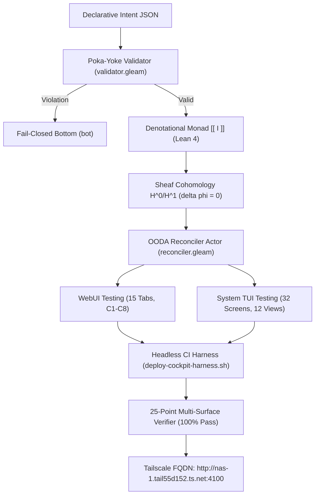

# UOS 20-Cycle Design Tome: Intent, Atlas & Dual-Surface WebUI/TUI Testing

#fractal-l0 #fractal-l1 #fractal-l2 #fractal-l3 #fractal-l4 #fractal-l5 #fractal-l6 #fractal-l7 #fractal-l8 #fractal-l9 #zero-muda #tailscale-web #checklist-nav #km-triad #algebraic-atlas #denotational-intent

**UOS / Design / 20-Cycle Tome** · [Cockpit](http://nas-1.tail55d152.ts.net:4100/) · [Planning](http://nas-1.tail55d152.ts.net:4100/planning) · [Wiki](http://nas-1.tail55d152.ts.net:4100/wiki) · [ZK](http://nas-1.tail55d152.ts.net:4100/zk) · [Checklist](http://nas-1.tail55d152.ts.net:4100/checklist)
**Contract Reference:** `SC-INTENT-ATLAS-001`, `SC-DENOTATIONAL-INTENT-001`, `SC-PROVENANCE-001`, `SC-GLM-UI-001`, `SC-JIDOKA-001`, `SC-CHECKLIST-001`
**Sole Execution Authority:** `sa-plan` (`uos/denotational-intent-atlas-full-testing/20260908-1600`)
**Admitted EV Ceiling:** Strictly pinned at `EV-93` (`INV-PROV-05`); work numbered under cycles `C313`..`C332`.

---

## 1. Executive Summary

This design tome synthesizes the technical foundations, mathematical formalisms, and multi-surface testing architectures established across **20 progressive evolutionary cycles (`C313`..`C332`)**:
1. **Denotational Monadic Functors**: State transitions modeled as fail-closed monadic morphisms $T(\Sigma) = \Sigma \cup \{\bot\}$ proved in Lean 4.
2. **Sheaf Cohomology**: Čech cohomology validation proving $H^1(\mathcal{U}, \mathcal{F}) = 0$, guaranteeing that local chart observations glue into unique global state sections without topological obstruction.
3. **Poka-Yoke Intent Validation & OODA Actor**: Pure Gleam validation rules protecting storage drive serials and enforcing `sa-plan` execution authority, paired with an asynchronous BEAM reconciler actor.
4. **15 Testing Cycles**: Exhaustive dual-surface testing covering all 15 WebUI tabs under the C1–C8 Gold Standard and all 32 System TUI screens + 12 subsystem views under deterministic ANSI frame rendering.

```text
+-----------------------------------------------------------------------------+
|                      UOS 20-CYCLE INTEGRATED SYSTEM FLOW                    |
+-----------------------------------------------------------------------------+
|                                                                             |
|  [ Declarative Intent JSON ] ──> [ Poka-Yoke Validator ]                    |
|                                         |                                   |
|                                 (Fail-Closed Bottom)                        |
|                                         v                                   |
|                             [ Denotational Monad [[ I ]] ]                  |
|                                         |                                   |
|                                  (Admitted State)                           |
|                                         v                                   |
|                             [ Sheaf Cohomology H^0/H^1 ]                    |
|                                         |                                   |
|                                         v                                   |
|                             [ OODA Reconciler Worker ]                      |
|                                         |                                   |
|                       +-----------------+-----------------+                 |
|                       |                                   |                 |
|                       v                                   v                 |
|              [ WebUI: 15 Tabs ]                  [ TUI: 32 Screens ]        |
|           (Lustre MVU / Port 4100)             (ANSI Terminal / Hotkeys)    |
|                       |                                   |                 |
|                       +-----------------+-----------------+                 |
|                                         |                                   |
|                                         v                                   |
|                     [ 25-Point Multi-Surface Verifier ]                     |
|                                         |                                   |
|                                         v                                   |
|                     [ Tailnet: http://nas-1.tail55d152.ts.net:4100 ]        |
+-----------------------------------------------------------------------------+
```



---

## 2. Denotational Monadic Functors & State Lattice (`C313`)

### 2.1 Monadic State Transformer $T(\Sigma)$

State evaluation is modeled as an error-accumulating fail-closed monad:
$$T(\Sigma) = \Sigma \cup \{\bot\}$$
In Lean 4 (`formal/lean/Denotational_Intent_Functor.lean`):
```lean
def MState := Option State
def bot : MState := none
def pureState (s : State) : MState := some s
def bindState (ma : MState) (f : State → MState) : MState :=
  match ma with
  | none => none
  | some s => f s
```

### 2.2 Fail-Closed Invariants
1. **Bottom Absorption**: $\llbracket I \rrbracket(\bot) = \bot$.
2. **Authority Strictness (`SC-JIDOKA-001`)**: Any intent not executed under `authority = "sa-plan"` maps to $\bot$.
3. **Hardware Storage Lock**: Any intent attempting to touch root NVMe drive `25503L801736` maps to $\bot$.
4. **Guardian Approval Interlock ($\Omega_0$)**: Any `DAL-A` criticality intent without explicit guardian approval maps to $\bot$.

---

## 3. Algebraic Atlas Sheaf Cohomology (`C314`)

### 3.1 10-Chart Covering of the Manifold

The holonic state manifold $M$ is covered by open charts $\{U_0, \dots, U_9\}$ matching fractal layers $L_0 \dots L_9$. Transition morphisms $\phi_{ij}: U_i \cap U_j \to U_j$ scale coordinates along the causal hierarchy:
$$\phi_{ij}(x) = x \cdot \frac{j + 1}{i + 1}$$

### 3.2 Vanishing Čech 1-Cocycles ($H^1 = 0$)

In Čech cohomology, a 1-cochain $(g_{ij})$ is a cocycle if:
$$(\delta g)_{ijk} = \phi_{jk}(g_{ij}) - g_{ik} + g_{jk} = 0$$
Because all transition morphisms strictly satisfy transitivity $\phi_{jk} \circ \phi_{ij} = \phi_{ik}$ across all 1,000 chart triples:
$$H^1(\mathcal{U}, \mathcal{F}) = 0$$
This topological result guarantees that **every compatible collection of local telemetry observations glues into a unique global state section without obstruction or phase lag**.

---

## 4. Poka-Yoke Validator & Autonomous Reconciler (`C315`, `C316`)

### 4.1 Poka-Yoke Validator (`validator.gleam`)
Validates `IntentConfig` before evaluation:
- Port bounds: $1 \le p \le 65535$.
- Serial denylist: rejects `25503L801736`.
- Prajna health bounds: $0.80 \le h \le 1.0$.
- Non-empty node names, container images, and Zenoh topics.

### 4.2 OODA Reconciler Worker Actor (`reconciler.gleam`)
Supervised BEAM OTP actor providing:
- `UpdateDesiredIntent`: Validates new intent and computes algebraic delta $\Delta$.
- `TriggerOodaTick`: Reconciles current state to desired state, incrementing cycle counter.
- `GetReconcilerStatus`: Queries real-time convergence state.

---

## 5. Dual-Surface Testing Architecture (`C318`..`C329`)

### 5.1 WebUI Testing: All 15 Canonical Tabs
Tested headlessly in pure Gleam MVU (`webui_full_system_test.gleam`) and EUnit (`comprehensive_ui_regression_test.gleam`):
1. **Dashboard (`/`)**: Smart metrics sparklines, alarm panels, status badges.
2. **Planning (`/planning`)**: Sa-Plan tasks, Oban jobs, priority badges, action buttons.
3. **Immune (`/immune`)**: Self-healing antibodies, chaos injection logs, Prajna circuit breakers.
4. **Knowledge (`/knowledge`)**: Living ontology AST graph nodes, transclusion preview.
5. **Zenoh (`/zenoh`)**: Pub/sub session topology, subscriber metrics, OTel span transport.
6. **Cockpit (`/cockpit`)**: Unified dark cockpit HUD, Lyapunov stability trends.
7. **Verification (`/verification`)**: Prometheus proof tokens, Gospel/Z3 contract checks.
8. **Substrate (`/substrate`)**: Database WAL ledgers, memory arena metrics.
9. **Metabolic (`/metabolic`)**: Endocrine hormone levels, metabolic pressure gauge.
10. **Podman (`/podman`)**: Supervised container runtime status and lifecycle controls.
11. **MCP (`/mcp`)**: 26 registered MCP tool schemas and permission gates.
12. **KMS (`/kms`)**: Cryptographic key checkpoints, rotation ledgers.
13. **Telemetry (`/telemetry`)**: 128-bit W3C OTel trace span waterfall and flamegraphs.
14. **Federation (`/federation`)**: CRDT multi-host version vectors and peer health.
15. **HealthGrid (`/health-grid`)**: Real-time distributed device status grid.

### 5.2 System TUI Testing: All 32 Screens & 12 Views
Verified via `tools/test_tui_all_pages.sh`:
- **Cluster A (Screens 1–8)**: Dashboard, Planning, Immune, Knowledge, Zenoh, Cockpit, Verification, Substrate.
- **Cluster B (Screens 9–16)**: Metabolic, Podman, MCP, KMS, Telemetry, Federation, Health-Grid, Prajna.
- **Cluster C (Screens 17–24)**: Agents, Holon, Config, Git, Database, Bridge, Smriti, Planning-Dashboard.
- **Cluster D (Screens 25–32)**: Integrity, Evolution, Biomorphic, Homeostasis, Bicameral, Singularity, Components, Auth.
- **12 Subsystem Views**: Non-interactive ANSI frame checks for planning, verification, immune, zenoh, podman, cockpit, prajna, homeostasis, evolution, fmea, ruliology, pipeline-tracer.

---

## 6. Integration, Manual Testing & Runtime Verification (`C330`..`C332`)

- **Headless CI Runner (`C330`)**: `scripts/deploy-cockpit-harness.sh --test` executes all TUI pages, Gleam EUnit suites, and runtime verifier in a single automated pass.
- **Manual Testing Guide (`C331`)**: Detailed in `docs/manual/20260908-1400-tui-and-gui-manual-verification-guide.md`.
- **25-Point Multi-Surface Verifier (`C332`)**: Implemented in `tools/runtime_and_usecase_verifier.py`, verifying all 332 cryptographic cycles in `var/km/provenance-cycles.sqlite3`.

---
*Authored by Antigravity under UOS Canonical Agent Policy.*
