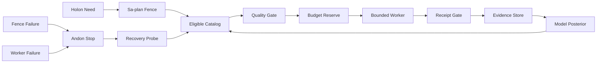

# 20260909-0314 — OpenRouter ecology engine: code review and recommended design

#fractal-l0 #fractal-l2 #fractal-l4 #fractal-l5 #fractal-l6 #fractal-l8 #zk-adr #zero-muda

[UOS](http://nas-1.tail55d152.ts.net:4100/) · [Live ecology](http://nas-1.tail55d152.ts.net:4110/ecology) · [Planning](http://nas-1.tail55d152.ts.net:4100/planning) · [Wiki](http://nas-1.tail55d152.ts.net:4100/wiki) · [ZK](http://nas-1.tail55d152.ts.net:4100/zk)

Observed host UTC at review intake: 2026-09-09T03:10:14Z. Sa-plan: `uos/ecology/20260909-0146`, task `ECOLOGY`, attempt 2. Work is numbered within Sa-plan; no EV or ADR number is created. Status: source/runtime review and recommended architecture; an adaptive paid engine is not yet claimed operational.

## Recommendation

Extend the **pure selection core** within `uos_swarm/route.gleam` into **one shared Gleam/OTP OpenRouter engine**. Preserve its operation classes, authority filtering and per-model/class Bayesian evidence. The same file also contains a legacy JSONL budget API; that API must not supply paid authority. Add durable reservations, authenticated verification receipts, observed endpoint health, bounded dispatch and shared HTTP/TUI projections. Reuse the C3I and Indrajaal separation between agent needs, model selection, execution and observation. Their static rosters and heuristic scores are not measurements to import as learned intelligence.

The objective is USD and elapsed time **per independently verified outcome**, subject to task authority, privacy, quality and a $10/day aggregate limit. Token price alone does not establish the best coding model.

## What the review established

| Finding | Code or observation | Consequence |
|---|---|---|
| Existing canonical router is a useful pure core | `apps/uos_swarm/src/uos_swarm/route.gleam`: operation classes, authority checks, minimum trials, Beta posterior and cheapest eligible selection | Extend this policy; avoid a competing optimizer with different authority rules |
| Selected model was not bound to dispatch in the reviewed routed worker | `openrouter_worker.run_routed` discarded the selected tier and called `run` with the original request model | Repaired in source: selected model now controls POST and non-OpenRouter selection refuses. Root independently observed55 focused tests pass, including outgoing-body, UTF-8 and strict paid-receipt regressions |
| A Budget record is not a durable reservation | `route.Budget` is caller-supplied immutable data; `run_routed` does not atomically debit it | Concurrent actors could reuse one snapshot. The $10 cap must live behind one atomic durable ledger |
| A second legacy budget writer remains | `route.gleam` contains `init_budget`/`charge`, used by `uos_route_cli`: resettable JSONL, read/check/append without atomic reservation, negative amounts not rejected | Retire this path from paid authority. Keep historical evidence and migrate readers to the single canonical ledger; two alternative budget APIs cannot enforce one aggregate limit |
| A declared route-level free-only flag was not consulted | `route.Policy.free_only_remote` did not gate paid eligibility when paid_enabled was true | Repaired and tested: the narrower free-only restriction now vetoes paid OpenRouter eligibility. Worker free-only refusal remains a separate boundary |
| Evidence references are not authenticated verification | `route.update` accepts any nonempty reference plus a Boolean; it does not resolve, bind or deduplicate the receipt | Put a candidate-bound, task-bound, single-consumption receipt gate before posterior updates |
| Another canonical router is only a catalog projection | `cepaf_gleam/ai/intelligence_router.gleam`: first-match strategies, `or_first` fallback; daily fields are not enforced by its routing branches | Do not promote its labels or daily limit field to execution authority |
| Existing inference dashboard starts with declared values | `ui/lustre/inference_tier.gleam` hardcodes tier/model/latency/circuit defaults; `load_from_nif` supplies a count, not per-model observations | Render the engine's observed records rather than treating initial green circuits as availability |
| Indrajaal already separates needs and model constraints | External VM-1 `cortex/model_selector.ex` and `cortex/synapse/model_selector.ex` use tier/latency/quality/cost heuristics | Reuse the decomposition. Static quality scores, old model IDs and free/smart aliases need replacement with measured data |
| VM-1 has partial real Jidoka code | ZigVM `harness/vsched.ml` stops verification tasks with failed dependencies; the named stratum-isolator script is an explicit stub | Verification-DAG gating does not establish whole-daemon Fractal TPS/Jidoka |
| Live VM-1 does not prove current-checkout parity | Active harness points to a deleted executable; its C3I/Sa-plan services run separately; port4100 belongs to C3I OTP28 | Preserve source and runtime observations separately; do not ingest or deploy the moving external tree |
| Free OpenRouter now works in UOS | Strict Fin free request and encrypted-credential ecology startup both returned nonempty final answers with reported cost zero | Earlier 404 and reasoning-only responses are retained as failure evidence, not a current blanket outage claim |

The earlier design `docs/design/20260907-0925-uos-global-intelligence-routing-design.md` is valuable lineage. Its quoted model prices and free-account outage are historical. The timestamped routing-rule path cited from `route.gleam` was not found in this checkout; this review does not silently invent that authority.

VM-1's current Codex configuration defines OpenRouter's base URL, environment-key name and Responses protocol, but the observed root model is Codex and no root OpenRouter provider selection was returned. Historical Fin/Kimi/Nemotron route receipts alone do not prove a current default. The September4 note also later withdrew its free roster under an EU-only constraint; current UOS instructions authorize the model families and $10/day without changing account privacy settings. See [VM-1 comparison](http://nas-1.tail55d152.ts.net:4100/files/governance/sources/20260909-0241-ecology-vm1-comparison-receipt.json).

## Initial needs and model roster

Exact IDs and public metadata were observed on 2026-09-09. These are benchmark candidates, not a measured universal ranking.

| Agent need | Candidate | Observed API catalog quote USD/M input/output | Accepted provider ceiling USD/M input/output |
|---|---|---:|---:|
| Coding flagship, GLM family | `z-ai/glm-5.3` | 1.40 / 4.40 | 1.40 / 4.40 |
| Coding flagship, Kimi family | `moonshotai/kimi-k3` | 3.00 / 15.00 | 3.00 / 15.00 |
| Coding flagship, DeepSeek family | `deepseek/deepseek-v4-pro-0813` | 0.57948 / 1.73844 | 1.32 / 3.96 |
| Efficient coding challenger | `deepseek/deepseek-v4-flash-0731` | 0.065 / 0.18 | 0.065 / 0.18 |
| Decision support, dense Gemma4 | `google/gemma-4-31b-it` | 0.09 / 0.34 | 0.09 / 0.34 |
| Zero-cost advisory baseline | `inclusionai/ling-3.0-flash-fin:free` | 0 / 0 | 0 / 0 |

DeepSeek Pro's public catalog minimum had no current ZDR endpoint at that price; an explicitly higher provider ceiling admits ZDR routes. Catalog minimum, allowed provider price, estimated call cost, reserved liability and actual reported spend must be different fields. GLM5.3 requires reasoning; use its supported low effort with a sufficient bounded token allowance. Disabling optional reasoning is appropriate for short Fin and Gemma responses, but must not be applied blindly to mandatory-reasoning models.

The table binds the API observation, not a promise of the lowest current provider offer. Public model cards can show discounted endpoint minima that differ from that catalog quote. Endpoint capabilities also differ: the observed Kimi card's shown endpoint did not accept `tools`, despite the model's general agentic-coding description. A coding agent requiring tools must pass an endpoint-level capability filter. See the [durable profile receipt](http://nas-1.tail55d152.ts.net:4100/files/governance/sources/20260909-0308-ecology-model-profiles-receipt.json) and [independent review](http://nas-1.tail55d152.ts.net:4100/docs/journal/20260909-0338-ecology-router-independent-review.md).

The operator's evaluation extension covers Gleam, OCaml, Mojo, Lean, Quint, STM, Bayesian inference, Rete UL, STPA and FMEA. Use synthetic repair and decision cases with deterministic validators and actual installed language/formal tools where available. Preserve invalid output, unavailable tools and failed counterexamples. Results qualify only the bounded case family tested; they do not certify whole-repository coding ability or authorize an effect.

The first recommendation is DeepSeek Flash for bounded, inexpensive coding trials, with GLM/Kimi/DeepSeek Pro compared on the same tests; Gemma31B is the initial decision-support candidate. Select a champion only after verified UOS tasks establish the required adequacy. A successful API response is transport/format evidence, not coding or decision quality.

Keep declared priors, verified trial counts and posterior estimates separate. The existing public Posterior record and nonempty-reference update function do not authenticate qualification. A minimum of three trials does not establish90–95% reliability. Initially unproven models need a bounded calibration queue; use a conservative quality bound and a documented prior before promotion, with a small explicit exploration allocation inside the same daily budget. Component tests of the router itself cannot become model-quality trials.

## Engine contract and state

`Need` contains agent/holon identity, fractal layer, canonical task reference and attempt, operation class, language/tool/schema requirements, privacy class, context/output bounds, deadline and quality objective. An engine request cannot manufacture task authority. Independent actor activation masks select which services may be requested; paid routing is an explicit profile and cannot replace a free request silently.

The engine owns a versioned model/endpoint catalog, source timestamp, actual invocation receipts, per-(model, task class) adequacy observations, latency distribution, reserved liability, reported costs and Andon state. Keep the process owner, lease epoch, candidate/source digest, catalog version and request ID in every transition.

```text
Holon Need -> Sa-plan Fence -> Eligible Catalog -> Quality Gate
Quality Gate -> Budget Reserve -> Bounded Worker -> Receipt Gate
Receipt Gate -> Evidence Store -> Model Posterior -> Eligible Catalog
Fence Failure -> Andon Stop
Worker Failure -> Andon Stop
Andon Stop -> Recovery Probe -> Eligible Catalog
```



The two diagram sources describe the same nodes, labels and directed edges. They are editable design sources, not evidence that these links are all active.

Denotation: `route(need,evidence,policy)` returns `Refused(reason)` or a selected exact model and bounded request. `reserve(call_id)` returns a fresh reservation or refuses; reusing a call ID never grants a second dispatch. `dispatch` requires both current Sa-plan authority and that fresh reservation. `verify(receipt)` yields accepted/rejected evidence; only accepted evidence can update a posterior. `Ready -> Stopped -> Recovering -> Ready` requires a real recovery receipt.

Algebraic laws: masking performs no backend call; free requests cannot become paid; unknown prices/quality cannot become zero/pass; selected model equals dispatched model; one request ID grants at most one dispatch; reservation totals are monotone within a UTC day and never exceed10USD; a stop cannot be cleared by a timer alone; inference output never grants implementation, deployment or admission authority.

The architecture atlas should link each law to its Gleam state machine, OCaml ledger transition, Lean/Quint finite model, positive/negative runtime receipts and the owning Sa-plan task. Existing capability twins remain reusable bounded analyses; they do not prove the entire OpenRouter engine.

## Fractal TPS and Jidoka

Apply the same typed envelope and stop semantics at L0..L9 while preserving separate authority scopes:

- **Poka-yoke:** exact model/profile IDs, schema/token/body/price bounds, no key or private-source leakage, candidate/task/attempt fencing before dispatch.
- **Heijunka and pull:** one bounded in-flight inference initially, bounded queues partitioned by agent need and eligible task priority; do not make every heartbeat request a model.
- **Jidoka:** failed dependencies, missing credential, expired task authority, malformed receipt, provider-policy refusal or exhausted budget stop the affected dispatch. Escalation consumes another explicit reservation and has a fixed attempt limit.
- **Standard work:** every invocation has its needs, selection reason, alternatives, limits, result and verification outcome in a shared receipt.
- **Waste control:** deterministic checks first, cache only under matching context/model/policy/candidate, optimize cost per verified outcome, retain failures without retry storms.
- **Recovery:** recheck authority, budget, live price and backend with one bounded probe; distinguish local caller rejection from shared backend failure.

Root supervision isolates engine/catalog, budget/evidence storage and request workers. A stopped provider need not stop local ETS/Bayesian/homeostasis observation; a missing task fence stops effectful work regardless of which model is healthy.

## Verification and implementation order

1. Preserve the running free/MAX ecology baseline, exact package and actual browser/restart evidence.
2. Correct selected-model dispatch and add curated paid profiles. Verify GLM mandatory reasoning and direct Gemma31B responses with strict output/cost receipts.
3. Add one canonical append-only ledger and remove legacy JSONL budget writes from paid authority. Reserve0.25USD before each paid request, conservatively limiting the initial version to40 requests/day. Reservations are liability, not actual spend; no refund follows timeout or unknown outcomes. Derive actual UTF-8/body lengths in the dispatch owner and bind model, token bound, body digest and task identity to the reservation. A caller-supplied length or alternate scratch database cannot grant global budget authority. Validate concurrent processes, duplicate IDs, midnight/rollback, corruption and restart persistence.
4. Integrate the ledger with a single OTP dispatch owner and current Sa-plan fence. A component ledger or pure Budget value is insufficient until this path is observed.
5. Run bounded calibration tasks: coding outputs through language/build/tests and decision outputs through explicit decision rubrics/reference cases. Persist, authenticate and deduplicate verification receipts; do not seed success from model self-report.
6. Add shared UI/TUI/API views from the same observed engine state, then controlled continuous optimization. Claude/Codex implementation remains bounded Sa-plan work with source review and independent verification.

Human acceptance, full external UCon binding, continuous learned-model selection, global provider-spend reconciliation, systemwide TPS enforcement and full admission remain separate obligations.

## Seventeen-aspect review

| Aspect | Review disposition |
|---|---|
| Hardware/storage safety | No drive mutation; inference resource bounds required |
| Standalone JJ/provenance | No Git or new EV number; candidate-bound integration required |
| Zero-Muda | Reuse existing pure Gleam/OTP, OCaml and installed tools |
| OTP control | Shared owner, bounded worker, restart budgets; runtime baseline observed |
| ZigVM/VFS | Read-only VM-1 comparison; no unvetted external ingestion |
| Hermes analysis | Durable SQLite evidence and bounded OCaml helpers |
| Formal mathematics | Specify reservation/authority/receipt laws; engine proofs not yet claimed |
| Authority separation | Sa-plan owns tasks; scores/model advice do not authorize effects |
| MAX/Mojo | Actual CPU graph baseline; no training or pretrained intelligence claim |
| Zenoh | Export normalized evidence later; end-to-end engine export unverified |
| AG-UI | Shared observed state; full event-protocol integration pending |
| UI components | Actual ecology Chrome check passed; static song-title clipping recorded |
| Accessibility/UCon | Human acceptance and external UCon process binding outstanding |
| Tailnet | Actual ecology listener4110; legacy4100 is a different running source |
| Checklist | All18 checkpoints listed below, no blanket compliance badge |
| KM triad | Grouped journals, source receipts, wiki/ZK/KM links retained |
| Sa-plan/workflows | Task and runtime ownership checked separately; paid dispatcher integration is a gate |

<details><summary>Verification checklist — five domains,18 checkpoints</summary>

| Domain | Checkpoints | Scope |
|---|---|---|
| Metadata/navigation | CHK-01-TIME,CHK-02-TAIL,CHK-03-FRACT,CHK-04-KM | Observed UTC, tags and full Tailnet links |
| Purity/storage | CHK-05-MUDA,CHK-06-GRAPH,CHK-07-DRIVE | No device operations or new inference packages |
| Verification | CHK-08-C1C8,CHK-09-MATH,CHK-10-9MOD,CHK-11-REGR | Scoped source/runtime tests; new-engine proofs/admission pending |
| Runtime/observability | CHK-12-GLEAM,CHK-13-HERMES,CHK-14-ZIGVM,CHK-15-MAX,CHK-16-OTEL | Observed ecology and read-only VM-1 comparison; full mesh evidence unrun |
| Governance/JJ | CHK-17-SOV,CHK-18-JJ | Canonical tasks, source boundaries, no new EV numbering |

Provenance domain: EV ceiling93 remains unchanged. Source/readiness labels are not admission.
</details>

**Previous:** [Ecology wiki](http://nas-1.tail55d152.ts.net:4100/docs/wiki/20260909-0249-agentic-ecology.md) · **Next:** [Browser journal](http://nas-1.tail55d152.ts.net:4100/docs/journal/20260909-0328-ecology-browser-journal.md)

**UOS footer:** Recommendation and scoped implementation evidence. Canonical workspace documents are not claimed published merely because they carry required navigation links.
