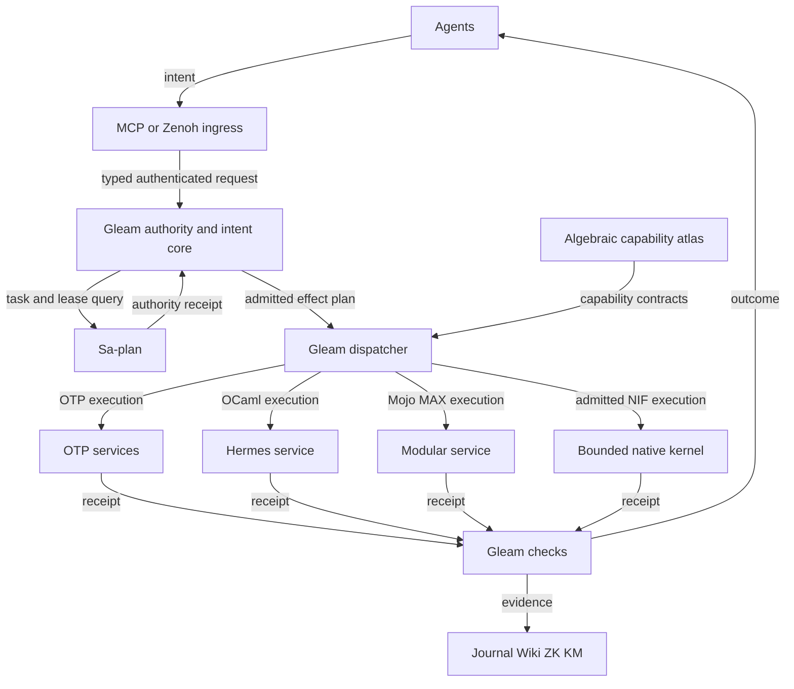
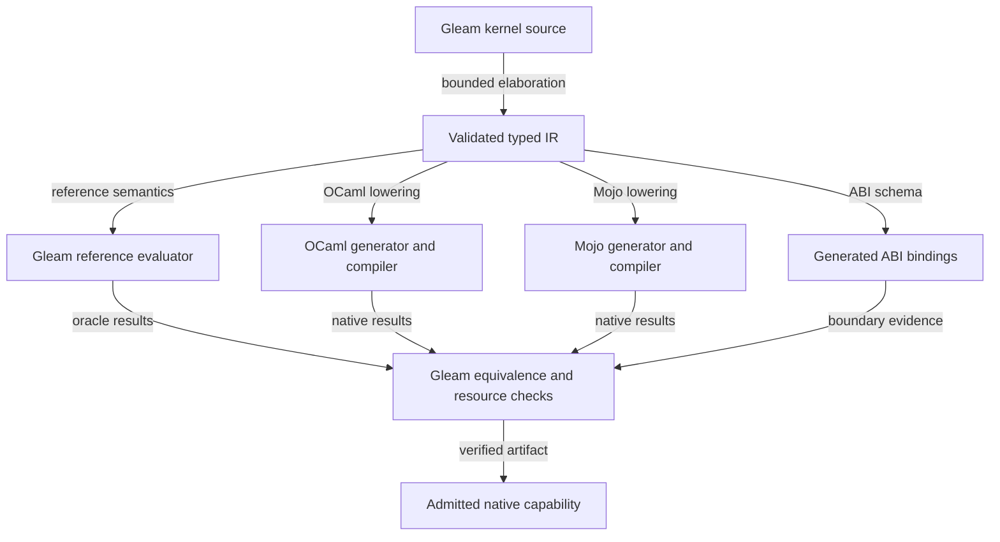
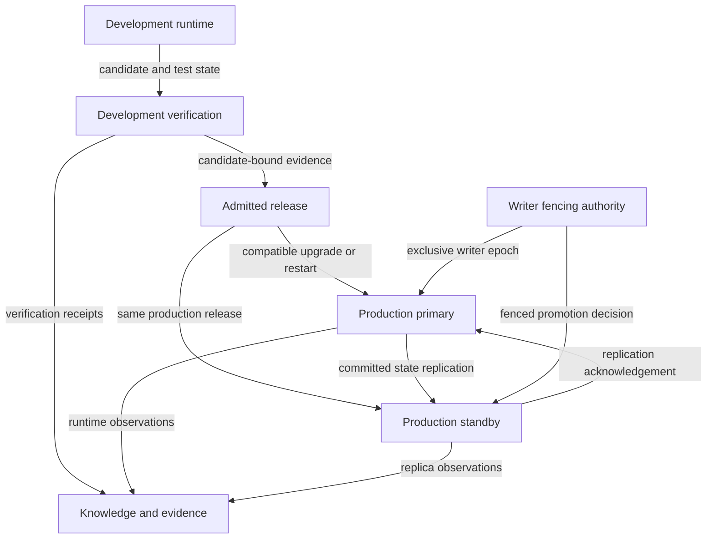

# Gleam Harness Symbiosis: Formal Specification and Fractal Impact

Document: 20260909-0412-gleam-harness-symbiosis-formal-spec.md
Status: SPECIFIED / PARTIAL_DEVELOPMENT_IMPLEMENTATION / NOT_ADMITTED
Authority: operator instructions in this conversation, including MCP and Zenoh transport, development/production isolation, replication and controlled dynamic code loading.
Timestamp basis: host observation 2026-09-09T04:45:12Z under the operator-approved development bootstrap. Chrony offset 0.000330409 seconds; uncertainty 0.0187911345 seconds; synchronized active-check receipt observed. Prefix uses UTC hour and seconds. Subsequent Gleam MCP clock observations are recorded in development receipts; persistent supervised service admission remains an implementation requirement.
Sa-plan scope: uos/ecology/20260909-0146 / HARNESSBOOT, worker codex-01a083d2-harness, attempt 1. The parent ECOLOGY task remains available after canonical expiry recovery. Effect-time authority must be re-observed.
Tags: #fractal-l0 #fractal-l1 #fractal-l2 #fractal-l3 #fractal-l4 #fractal-l5 #fractal-l6 #fractal-l7 #fractal-l8 #fractal-l9 #zk-adr #zero-muda #km-triad
Navigation: [Cockpit](http://nas-1.tail55d152.ts.net:4100/) · [Planning](http://nas-1.tail55d152.ts.net:4100/planning) · [Wiki](http://nas-1.tail55d152.ts.net:4100/wiki) · [ZK](http://nas-1.tail55d152.ts.net:4100/zk)
Intended document URL after publication: http://nas-1.tail55d152.ts.net:4100/files/docs/design/20260909-0412-gleam-harness-symbiosis-formal-spec.md
This URL is an intended locator, not evidence that publication has occurred.
Bootstrap exception: the operator explicitly approved a one-time development bootstrap to save this specification and repair/add harness services, then authorized whatever is required. This exception does not grant system admission.

## 1. Mandate and interpretation

MUST, MUST NOT and SHALL are normative requirements. A requirement is not an implementation or admission claim.

All Claude, Codex, AGY, OpenRouter agents, internal agents and agentic holons SHALL submit operational intents through the Gleam/OTP harness using MCP or Zenoh to obtain execution authority. Both transports SHALL terminate at the same typed intent, authority, scheduling and receipt semantics. An unavailable harness SHALL cause an explicit hold; client-side SessionStart and preflight hooks SHALL advise agents to halt rather than execute host tools.

Because client-side hook compliance is ADVISORY, this invariant SHALL be enforced server-side instead: no state change, effect receipt, verification certificate or Sa-plan task completion derived from direct host-tool execution SHALL be admitted or registered. Work performed via host tools during a harness hold is unverified diagnostic observation, carries zero authority, and CANNOT satisfy any milestone gate.

> **Narrowed 2026-09-09 (finding R2-6).** The previous wording read "agents SHALL NOT silently fall back to host tools". No mechanism enforced it, and none can: a `SessionStart` hook appends text to a model's context, and a model cannot be constrained by its own context window. The proof is in this review's own record -- the delegated Fable reviewer was refused by the harness with `development_bootstrap_grant_mismatch` and then completed its entire review on `cat`, `grep`, `wc`, `diff` and `python3`. Every finding it produced was host-tool work performed during exactly the hold this sentence claimed to forbid.
>
> Keeping the old wording and pointing at wired hooks as evidence would have installed a textbook coarse observable: the observable is "the hook fired", the property is "the agent cannot use host tools", and the first can pass while the second is false. The hooks were repaired on 2026-09-09 and are genuinely wired -- validated against the installed client -- but wiring is not enforcement, and this specification no longer claims otherwise. The guarantee moved to the place that can actually hold it: the admission boundary, which sees receipts rather than intentions.

The Gleam harness is the operational holon and compute entry point for each agent. Gleam SHALL own agent state, supervision, policy, check verdicts, time validation, task dispatch, model selection, capability activation and release decisions. The harness SHALL select Gleam, Hermes OCaml, Modular MAX/Mojo, ZigVM or a bounded native kernel according to admitted capability contracts. Native compilers, formal provers and OS observations remain tools behind the harness. They SHALL NOT become independent control authorities.

The complete installed OTP capability inventory SHALL be discoverable. Availability, activation, authorization, implementation, execution, verification and admission SHALL be distinct states. Discoverability SHALL NOT imply that every service is active or that every agent may invoke every effect.

## 2. Denotational core

Let S be typed system state, I an intent, A an authenticated authority context, C the capability atlas and E an evidence set.

denote(I, S, A, C) = Reject(reason) | Hold(required_evidence) | Transition(S_next, effects, obligations).

This function SHALL be pure. It SHALL NOT execute effects, query external services, sample a clock or create task authority. An admitted interpreter SHALL realize the effects only after effect-time authorization and the required evidence checks.

A request envelope SHALL include a schema version, stable intent ID, trace ID, authenticated agent binding, holon ID, task reference, task attempt, authority epoch, intended environment, resource ceiling, deadline, capability version and payload. Identity claims supplied in payload SHALL NOT authenticate the caller.

A receipt SHALL bind intent ID, task attempt, authority epoch, selected backend, source/candidate identity, input digest for non-secret inputs, observed start/end clock evidence, outcome, resource use, evidence references, replication position and any remaining uncertainty. Secret values SHALL NOT be copied into prompts, receipts or hashes.

Effectful intents SHALL be durable before dispatch. Retries across MCP and Zenoh SHALL deduplicate on a stable logical effect ID independent of task attempts. A reclaimed task SHALL reconcile the prior effect and retained liability before dispatch; incrementing an authority attempt SHALL NOT reset deduplication. Transport acknowledgement SHALL NOT be interpreted as successful execution. H05/H07/H11 SHALL exercise reply loss after commit or POST, task reclamation and replay through the other transport without automatic repetition.

## 3. Algebraic atlas

| Structure | Required law | Operational meaning |
|---|---|---|
| Intent composition | identity and associativity | Grouping a declared sequence cannot change its meaning. |
| Independent operations | commute only with proven disjoint effects and compatible budgets | Parallel execution requires evidence of independence. |
| Capability refinement | implementations preserve the declared input/output relation | Backend substitution cannot weaken semantics. |
| Authority constraints | intersection; denial dominates | Combining permissions cannot manufacture authority. |
| Evidence refinement | UNKNOWN never becomes PASS without new applicable evidence | Counts, names, leases and model confidence are not proofs. |
| State projection | each projection preserves declared invariants | UI, wiki and telemetry views do not become writers. |
| Replication | replay of a committed prefix yields equivalent recoverable state | Primary and standby must agree at a declared log position. |
| Release migration | candidate-bound relation between old and new state schemas | Hot loading requires an explicit compatible state transition. |
| Resource accounting | nonnegative conserved reservations; serialized admission | Concurrent requests cannot independently spend the same allowance. |

The atlas SHALL map every agent surface and service to its intent type, fractal layer, state ownership, effect class, authority predicate, backend contract, clock requirements, resource limits, failure semantics, independent oracle and evidence status.

The accompanying JSON now specifies a 16-field-group per-capability schema and 30 initial rows, including activation, supervision, role, state replication/restore, clock, backend, transport, budget and evidence contracts. These are specification entries, not a complete admitted runtime registry. Missing implementations, ABI/toolchain observations and restore evidence remain explicit UNKNOWN/UNRUN obligations. A structural JSON/schema check does not establish semantic refinement or runtime availability.

## 4. Operational and control surface mapping

| Surface or operation | Harness responsibility |
|---|---|
| Chat clients and IDE agents | Authenticate, bind a holon, accept declarative intents, return receipts. |
| Files, search and repository inspection | Bounded reads, path policy, explicit source provenance and secret exclusions. |
| Source and document changes | Development-only, task-fenced, revision-aware edits with narrow write scopes. |
| Build, format, lint and evaluation | Development-only bounded services; Gleam accepts or rejects actual tool receipts. |
| Jujutsu | Canonical standalone JJ operations, workspace ownership and serialized integration. |
| Planning, jobs and workflows | Canonical Sa-plan operations and current attempt/lease checks. |
| Clock and freshness | Separate UTC, monotonic duration, synchronization uncertainty and evidence age. |
| Agent dispatch and supervision | Per-agent budgets, restart intensity, cancellation, bounded concurrency and Andon containment. |
| OpenRouter | Endpoint eligibility, verified task quality, cost/latency evidence and centralized budget reservation. |
| MAX/Mojo and native analysis | Isolated or bounded backend execution under explicit ABI/protocol contracts. |
| Lean, Quint, Gospel, SMT and domain oracles | Bound actual invocations to candidates; missing/timeout/unsupported evidence fails closed. |
| ETS, STM, Bayesian and the fail-closed rule gate | Typed state contracts, independent semantics checks, activation and resource policy. **Corrected 2026-09-09 (R2-5):** this row previously read "Rete-UL". No Rete-UL network exists. What exists is a naive forward-chaining matcher (`engines/hermes/modules/hermes_harness/hermes_rete.ml`, whose own header states it has no alpha/beta network, no token memories and no unlinking) and a salience-ordered list evaluator in Gleam. The load-bearing property is the zero-trust gate discipline -- an Error action rejects the run, fail closed -- not the matching algorithm. Building a real Rete network for a dozen safety rules would be Muda; the claim is retracted rather than the code inflated. |
| Ruliad and digital twins | Bounded alternative exploration and modeled-state projections without effect authority. |
| Runtime and infrastructure | Typed admitted operations, target fencing and actual health observations. |
| Release, upgrade and failover | Production admission, state migration, replication checks and single-writer authority. |
| Wiki, ZK, KM, journal and UI | Consistent projections with timestamp, provenance and candidate-bound evidence. |
| Hooks, plugins and agent settings | Enforce the same boundary for Claude, Codex, AGY and internal actors. |

Raw shell evaluation or arbitrary backend selection SHALL NOT be exposed as an unrestricted substitute for typed intents. A backend may use necessary platform mechanisms internally under a bounded service contract.

## 5. OTP service coverage

The atlas SHALL enumerate the actual OTP/ERTS installation, including installed applications, versions, loaded modules and service bindings. Missing optional applications SHALL be reported as unavailable, not silently installed.

Required service families include:
- Processes, monitors, links, supervisors, applications, actor servers, state machines, process groups, system messages and timer services.
- ETS, DETS, Mnesia where selected, disk logs, durable event storage, cache ownership and bounded persistent metadata.
- Distribution, node monitoring, remote calls, membership, replication, partition detection and fenced leadership.
- Logger, SASL, runtime diagnostics, resource observation, tracing, profiling, coverage and crash/restart evidence.
- Crypto, public-key and TLS services; admitted network, SSH and protocol adapters where needed.
- Compiler and analysis services, EUnit/Common Test and other installed toolchain applications, invoked through development capabilities.
- Code loading, application configuration, release handling, upgrade instructions and schema migration.

Availability of an OTP primitive does not authorize unconstrained access to it. Atom creation, dynamic evaluation, tracing, persistent-term updates, distribution and NIF loading SHALL have explicit bounds and capability controls.

## 6. Fractal impact, L0–L9

| Layer | Change | Required invariant and evidence |
|---|---|---|
| L0 Constitutional | MCP/Zenoh-only authority, budget and admission boundaries | No direct agent effect path; no forged admission; no new EV number. |
| L1 Atomic | Typed time, identity, paths, receipts and bounded native calls | Explicit absence/error states; no unsafe conversion or secret leakage. |
| L2 Component | Every service becomes a supervised capability with truthful status | Real runtime binding, restart budget and independent component checks. |
| L3 Transaction | Tasks, effects, reservations and replication positions are fenced | Durable intent before effect; attempt/epoch binding; duplicate suppression. |
| L4 System | Unified harness control and dev/production separation | Production rejects editing, building and development test execution. |
| L5 Cognitive | Model routing, Bayesian learning, fail-closed rule-gate evaluation and agent reasoning | Advice never grants effects; quality claims require held-out observed outcomes. |
| L6 Ecosystem | All agentic holons discover shared services and choose activation | Shared capability access does not transfer sovereign or runtime authority. |
| L7 Federation | MCP/Zenoh parity, Tailnet identity and replicated state | Authenticated messages, correlated replies and no transport-driven split brain. |
| L8 Evolution | Development experiments, twins, formal models and candidate evaluation | Resource-bounded experiments; no development candidate auto-promotes. |
| L9 Verification | Candidate-bound release and recovery evidence | Actual behavior plus applicable formal evidence; unknown/stale blocks admission. |

## 7. Seventeen system aspects

| Aspect | Required change or preservation |
|---|---|
| 1 Substrate and hardware safety | Preserve host storage interlocks; harness cannot override denied devices. |
| 2 Version control | Preserve standalone JJ, source ownership and candidate identification. |
| 3 Purity and provenance | Preserve excluded dependencies and read-only external source discipline. |
| 4 Supervision | Gleam/OTP owns the agent and service supervision hierarchy. |
| 5 Deterministic runtime | ZigVM remains a contracted deterministic backend where admitted. |
| 6 Evidence and analysis | Hermes tools remain bounded evidence services under Gleam control. |
| 7 Mathematical authority | Actual Lean/Quint/solver evidence remains invocation-specific. |
| 8 Feedback and homeostasis | Separate observation, decision, authority and effect. |
| 9 Inference | MAX/Mojo isolation and centrally controlled OpenRouter requests. |
| 10 Mesh and observability | MCP/Zenoh adapters share identity, correlation and tracing. |
| 11 Agent events | Lifecycle, reasoning, tool, state and result events reflect actual transitions. |
| 12 Declarative UI | Components project typed harness state and uncertainty. |
| 13 Interfaces | Web, API, TUI, IDE and agent clients share the same authority semantics. |
| 14 Navigation | Preserve full clickable Tailnet FQDN links and actual service identity. |
| 15 Verification checklist | Every check reports its actual scope, freshness and result. |
| 16 Knowledge triad | Group journals and synchronize wiki/ZK/KM evidence without rewriting history. |
| 17 Durable execution | Sa-plan remains the canonical task/job/workflow authority. |

This table specifies impact; it does not assert that all seventeen aspects are active.

## 8. Complete recoverable state

The system state inventory SHALL include:
1. Policies, capability schemas, release identities and backend contracts.
2. Agent and holon identities, activation selections, goals and durable conversation/work context.
3. Sa-plan plans, tasks, dependencies, attempts, leases, workflows and jobs.
4. Accepted intents, effect outboxes, deduplication records and uncertain in-flight operations.
5. Model catalogue snapshots, endpoint capabilities, evaluation results, quality estimates and routing decisions.
6. Budget reservations, known costs, unknown liabilities and accounting-day state.
7. Canonical application state, actor checkpoints, rule facts, Bayesian sufficient statistics and STM versions.
8. Evidence, provenance, journals, knowledge links and formal invocation receipts.
9. Replication log positions, checkpoints, writer epochs, membership and failover records.
10. Clock observations, synchronization receipts, resource observations and health state.

Every state item SHALL declare its writer, durability class, schema version, replication policy, restoration procedure, sensitivity, retention and recovery test.

Full replication means complete recoverability of this declared state. OS handles, sockets, PIDs, mailboxes and foreign process memory are not automatically replicated by OTP. Relevant in-flight work SHALL be represented durably; ephemeral resources SHALL be reconstructed. External effects and uncertain model charges SHALL be reconciled conservatively. Secret references may replicate; secret material SHALL remain under its existing approved credential authority.

## 9. Development, production and backup

Development/production are execution roles. Primary/standby are availability roles. They SHALL be represented independently.

The proposed two-host arrangement has a production primary and a backup host carrying an isolated development runtime plus a separate standby for the pinned production release. These are separate BEAM nodes and state roots. This is a design proposal, not a provisioned deployment.

If only two BEAM instances are available, the development instance SHALL stop development work before becoming production standby, load the verified production release and restore its replicated state. It SHALL NOT simultaneously execute experimental code and serve as a ready production backup.

Only development accepts edits, builds, experiments, failure injection and release rehearsals. Production accepts normal authorized operations, health observation and admitted release/failover intents.

Replication SHALL use explicit supervised services with ordered durable events and verified checkpoints. Critical authorization and spend state SHALL meet the declared durability requirement before effects. A standby SHALL reject promotion if its state is stale, its release mismatches or writer authority is ambiguous.

Two nodes alone cannot safely promise continued writes during every partition. Without an independent witness or valid exclusive fencing mechanism, ambiguous leadership SHALL stop writes. A failed or stale primary SHALL be fenced before takeover.

## 10. Dynamic code loading and release policy

Compatible updates SHOULD use OTP release mechanisms where rehearsed evidence supports them. Arbitrary module loading SHALL NOT be the production deployment interface.

Admission requires:
- Exact candidate, dependency and toolchain identities and successful development checks.
- A compatible upgrade relation for state, messages, ETS tables, protocols and backend ABI.
- A rehearsed upgrade and recovery procedure on a representative development state.
- No incompatible in-flight calls or unresolved authority/replication condition.
- Production runtime ownership and current task/epoch fencing.

The harness SHALL quiesce affected effects, checkpoint, apply the admitted migration/upgrade, verify actual runtime identity and health, then resume. It SHALL retain conservative accounting for interrupted effects.

A restart or rolling replacement SHALL be used when safe hot loading is not demonstrated, including incompatible runtime, NIF, ABI or state changes. Rollback SHALL not be advertised unless its state and external-effect consequences have been tested. An old binary alone is not a rollback plan.

## 11. OpenRouter and adaptive evaluation

The operator budget is USD 10 per UTC day. Every chargeable path admitted to the ecology SHALL use the same authoritative accounting service. The boundary SHALL include calibration and retries. Calls outside that service are outside its accounting guarantee and SHALL be blocked by the intended agent interface.

Paid coding candidates are GLM, Kimi and DeepSeek; decision candidates include Gemma 4. No model SHALL be labeled best without applicable environment measurements. Provider-level tool support, privacy, context, price and availability SHALL be checked for each selected endpoint.

The evaluator SHALL cover Gleam, OCaml, Mojo, Lean, Quint, STM, Bayesian updates, rule-gate semantics, STPA and FMEA. Rule-gate semantic tests SHALL NOT be mislabeled as validation of a Rete-UL implementation, and no document SHALL assert that one exists: it does not. This sentence was already present and already correct; R2-5's repair is that sections 4 and 6 now agree with it. Formal tool absence, timeout, unsupported syntax and unapproved axioms SHALL remain explicit non-passing outcomes.

Adaptive routing SHALL optimize verified useful outcomes under cost, latency, task capability and safety constraints. It SHALL retain uncertainty, avoid training/evaluation leakage and preserve raw observations. Model output SHALL never directly grant effects.

## 12. STPA and FMEA

The STPA control structure is agent intent -> harness admission -> supervised executor -> environment, with execution receipts and observed state returning to the harness.

All four UCA classes SHALL be recorded:
- Required control not provided: missing stop, stale-budget containment or failed recovery.
- Unsafe control provided: unauthorized edit, duplicate paid call or dual writer.
- Wrong timing/order: effect before reservation, upgrade before replication or promotion before fencing.
- Wrong duration: expired lease retained, tracing left active or drain never released.

FMEA records SHALL preserve raw severity, occurrence and detectability scales, uncertainty, evidence age, dependency readiness, acceptance tests and residual risks. Unsupported numerical scores SHALL not be invented. Authority and safety constraints precede prioritization scores.

Initial hazards include MCP file-read crashes, audit-only anonymous access, shell-joined task arguments, uncorrelated Zenoh replies, unverified service catalogs, shared dev/production state, duplicate charges and unsafe hot migrations. These are observations or design hazards with separate evidence statuses; none is a certification claim.

## 13. Acceptance suite

| ID | Required observed result |
|---|---|
| H01 | An agent can complete a real authorized task using only MCP or Zenoh harness requests. |
| H02 | Invalid UTF-8, absent files, bounded large inputs and backend failure return typed errors without crashing the harness. |
| H03 | Anonymous, stale, replayed, wrong-attempt and wrong-environment effects are refused. |
| H04 | Arguments containing shell metacharacters remain literal data through the Sa-plan adapter. |
| H05 | MCP and Zenoh deliver equivalent outcomes; duplicate and late replies cannot duplicate effects. |
| H06 | Time checks distinguish UTC, monotonic duration, evidence age and synchronization uncertainty; rollback fails closed. |
| H07 | Concurrent model requests, lost receipts and retries respect the shared USD 10/day ceiling. |
| H08 | Native tool failures cannot become passing Gleam check receipts. |
| H09 | Actor crashes, overload and restart storms remain inside the declared supervision and resource budgets. |
| H10 | Development cannot mutate production state or silently promote a candidate. |
| H11 | Primary loss, standby lag and network partitions preserve writer exclusivity and recorded liabilities. |
| H12 | Compatible hot upgrades preserve declared state; incompatible updates are refused or use tested restart recovery. |
| H13 | Every installed OTP capability and agent surface has an atlas entry with truthful availability and authorization. |
| H14 | Journal, wiki, ZK and KM artifacts reconcile with exact candidate and runtime evidence. |
| H15 | Actual formal invocations support the relevant invariants; missing or stale proof evidence blocks admission. |
| H16 | Direct agent host-tool routes are disabled or reliably intercepted in every admitted agent client. |

Checks SHALL run through the development harness. Production read-only health observation is distinct from development failure injection and test execution. Harness checks SHALL not substitute mocks for evidence of actual provider, compiler, replica or runtime behavior.

## 14. Implementation and admission sequence

All executable tasks SHALL be registered in Sa-plan; the sequence below is a dependency specification, not a separate task authority.

A. Repair development harness transport, bounded UTF-8 file reading, actual exit/error propagation and safe canonical Sa-plan argument passing.
B. Expose authenticated, task-fenced development document/edit/build/test/clock capabilities and truthful service discovery.
C. Install the MCP/Zenoh-only policy across agent clients, hooks and operational surfaces; verify bypass refusal.
D. Implement the atlas, Gleam check controller, backend contracts, model accounting and evaluation bindings.
E. Implement declared-state durability, replication, fencing, standby recovery and failover checks.
F. Rehearse release migration and compatible hot upgrades in development.
G. Admit and operate production from verified artifacts, retaining grouped cycle evidence and explicit residual gaps.

No new EV identifier is minted by this specification. Existing admission/provenance restrictions remain in force.

## 15. Present evidence and limitations

Observed in this session through a packaged Gleam server:
- MCP initialize succeeded; server identified c3i-planning-mcp version 1.0.0.
- tools/list returned a catalog and reported a missing c3i_nif backend.
- read_file read public source but crashed while interpreting a binary as Result. Recovered source identifies an identity FFI incorrectly declared as Result(String, Nil).
- sa_plan_status returned a report-only receipt. That does not prove effect-time authorization or complete environment binding.
- The reviewed Sa-plan bridge joins arguments into a shell command.
- The reviewed MoZ client explicitly leaves asynchronous response correlation to its caller.
- The observed catalog exposes no development edit/build/test service.

No repair, complete symbiosis deployment, replicated primary/backup pair or production hot upgrade is claimed by this document.

## 16. Verification checklist

All eighteen checkpoints remain OPEN for this specification's new system-wide requirements until applicable evidence is produced.

| Domain | Checkpoints |
|---|---|
| Metadata, timestamp and navigation | 1 document identity; 2 synchronized time receipt; 3 Tailnet publication/navigation |
| Purity and storage safety | 4 excluded-dependency gate; 5 storage interlocks; 6 sanitized provenance |
| Testing and mathematical evidence | 7 semantic tests; 8 adversarial/integration tests; 9 independent oracles; 10 formal gates |
| Cross-language control and observability | 11 Gleam authority; 12 bounded backends; 13 tracing/receipts; 14 replication/recovery |
| Governance and standalone JJ | 15 Sa-plan/task fences; 16 candidate/JJ identity; 17 peer verification; 18 admission boundary |

Provenance extension: admitted EV ceiling remains 93; claims above it are not admission evidence. Historical documents and external trees remain unchanged.

## 17. Gleam-authored code and native generation

All new UOS agent, control, policy, check and application source SHALL be authored in Gleam. Generated Erlang, OCaml, Mojo and ABI bindings SHALL be reproducible build artifacts with source maps and candidate identities. Existing pinned runtimes and compiler implementations are dependencies; their implementation languages do not turn them into agent control authorities.

The standard Gleam compiler supports Erlang and JavaScript targets. Its external annotations do not verify the implementation's return representation. Native OCaml/Mojo generation therefore requires a new admitted compiler layer; it is not an existing Gleam compiler target. [Gleam project configuration](https://gleam.run/documentation/gleam-toml-reference/), [Gleam externals](https://gleam.run/documentation/externals/).

The first native-generation scope SHALL be a bounded kernel language expressed with typed Gleam constructors. It SHALL lower to a typed intermediate representation, an independent Gleam reference evaluator, generated OCaml or Mojo source, generated ABI bindings and pinned native build artifacts. General Gleam programs containing actors, arbitrary effects or unbounded recursion SHALL remain on OTP until an applicable translation contract exists. Unsupported constructs SHALL be rejected explicitly.

A kernel IR SHALL declare fixed-width numeric types or explicit arbitrary-precision requirements, overflow behavior, floating-point tolerances, tensor shapes, memory layouts, ownership, maximum work, maximum allocation and allowed errors. Policy, authority and accounting calculations SHALL not use approximate numeric transformations.

For every admitted backend b and admissible input x:
decode_b(execute_b(compile_b(kernel), encode_b(x))) ~ interpret_gleam(kernel, x).
The relation ~ SHALL be exact for discrete values and errors; numeric approximation is allowed only under an explicitly declared tolerance relation. The relation covers failures and resource bounds as well as successful values.

### 17.1 Language and library mapping

| OCaml-style need | Gleam authoring approach | Native boundary and status |
|---|---|---|
| Algebraic data types and pattern matching | Custom types, exhaustive cases, opaque public types | Explicit versioned codecs; never cast BEAM terms into OCaml values. |
| Parametric modules and functors | Generic functions and records of operations | Proposed explicit dictionary/module elaboration; no claim of OCaml functor equivalence. |
| GADTs and richer type witnesses | Opaque smart constructors plus validated IR witnesses | A proposed checked representation; do not silently erase proof obligations. |
| Result/Option and typed errors | Standard Result and Option types | Generated tagged error/value ABI; native exceptions never cross unchecked. |
| Collections | Standard immutable list/dict/set abstractions and bounded buffers | Preserve ordering/equality semantics; profile copying and batching. |
| Integers and floats | Explicit semantic numeric layer for kernels | Declare range/overflow/NaN/rounding; platform integer widths are not interchangeable. |
| Strings and bytes | Checked UTF-8 and separate binary buffers | Validate representation at every boundary; preserve byte/grapheme distinctions. |
| Effects and concurrency | Declarative intents, Gleam actors and supervised service calls | Effects remain under OTP rather than lowering arbitrary effectful code into a NIF. |
| Interfaces and contracts | Opaque modules, typed capability records and schema contracts | Generate projections for Hermes/formal tools; check each actual invocation. |
| Scientific arrays and tensors | Proposed typed tensor/shape/layout facade and kernel IR | Generate admitted Mojo/MAX operations with explicit device and lifetime contracts. |
| OS and runtime libraries | Existing Gleam/Erlang libraries plus narrow generated wrappers | Inventory installed support; bind missing services individually. |

The core library starting points are the project-pinned Gleam standard library, gleam_erlang and gleam_otp. Their documented process/actor interfaces are useful foundations; the full OTP surface still needs an explicit wrapper and capability inventory. Project pins, not the newest online version, govern builds. [gleam_otp](https://hexdocs.pm/gleam_otp/), [gleam_erlang](https://hexdocs.pm/gleam_erlang/).

All names for new tensor, contract, native-generation and effect facades in this specification are proposed UOS modules, not claims that published packages already implement them.

### 17.2 OCaml execution and NIF admission

OCaml runtime initialization, domain locking, callbacks, GC roots, exceptions and foreign-thread registration require an explicit adapter contract. Runtime-managed or unpredictable work SHALL default to a supervised process. A direct OCaml-backed NIF is admissible only after bounded execution and runtime integration are demonstrated for that exact kernel. [OCaml C interface](https://ocaml.org/manual/5.3/intfc.html).

NIFs execute inside the VM and can crash it. Dirty scheduling does not supply process isolation or guaranteed cancellation. Consequently, the harness SHALL choose the native fast path only for an admitted bounded implementation; otherwise it uses the compatible service path or reports unavailability. [OTP NIF API](https://www.erlang.org/doc/apps/erts/erl_nif.html).

### 17.3 Modular execution and generated bindings

Mojo supports native shared-library output and C-ABI exports; MAX supports custom operations implemented with Mojo kernels. These mechanisms are backend building blocks, not a Gleam-to-Modular compiler. Exact syntax, runtime dependencies and target compatibility SHALL be verified against the pinned toolchain before generation. [Mojo compilation](https://mojolang.org/docs/tools/compilation/), [MAX custom operations](https://docs.modular.com/max/develop/custom-ops).

GPU execution, model loading, tensor allocation and graph compilation SHALL remain inside the supervised Modular service unless a separate bounded native capability is proven suitable. A shared library is not automatically an OTP NIF: the generated adapter must satisfy both ABIs and resource lifetimes.

Development SHALL generate, compile, evaluate and package native artifacts. Production SHALL load admitted artifacts. If the selected toolchain requires runtime compilation, that requirement SHALL be declared explicitly and held until the production policy permits it; a hidden compiler invocation is not an admitted hot upgrade.

Transparent use means a stable typed Gleam interface with the chosen backend disclosed in the receipt. Performance mode is a constrained harness decision, not an agent-controlled bypass. Benchmark acceptance SHALL measure end-to-end latency, throughput, marshaling, CPU/GPU memory, scheduler responsiveness, tails and failure behavior. No speedup is presumed.

## 18. Traceable requirements

| Requirement | Normative obligation | Verification |
|---|---|---|
| R01 Agent boundary | All admitted agent effects enter through MCP or Zenoh. | H01,H16 |
| R02 Gleam control | Agent lifecycle, policy, routing and check verdicts are Gleam-owned. | H01,H08,H13 |
| R03 Canonical intent | Both transports carry the same typed intent semantics. | H03,H05 |
| R04 Authority | Identity, task attempt, lease, epoch and environment are checked at effect time. | H03,H10 |
| R05 Truthful services | Discovery separates declaration, binding, activation and verified availability. | H13 |
| R06 Safe inputs | Paths, payloads, encodings, argument vectors and outputs are bounded and validated. | H02,H04 |
| R07 Sa-plan | Plans, tasks, jobs and workflows use the canonical authority. | H01,H03,H04 |
| R08 Time | UTC, monotonic duration, synchronization and freshness are distinct. | H06 |
| R09 Resources | Concurrency, memory, deadlines and cost are explicitly bounded. | H07,H09 |
| R10 OpenRouter | Paid/free routing and every retry obey the shared budget and endpoint capability constraints. | H07,H08 |
| R11 Evaluation | Environment-specific semantic and native evidence drives model selection. | H08,H15 |
| R12 Holon ecology | Every agentic holon discovers shared capabilities and selects authorized activation. | H13 |
| R13 OTP breadth | Every installed OTP service is mapped, with activation and effect controls. | H09,H13 |
| R14 Native semantics | Generated backends refine the Gleam kernel interpretation. | N01–N06 |
| R15 Native safety | ABI, lifetime, resource and scheduler contracts gate NIF use. | N03–N06 |
| R16 Dev isolation | Editing, building, testing and failure injection run in development. | H10 |
| R17 Production admission | Only verified candidate artifacts and authorized release actions enter production. | H12,H15 |
| R18 Replication | All declared recoverable state has explicit replication and restoration coverage. | H11 |
| R19 Leadership | Only the current fenced writer may commit effects. | H03,H11 |
| R20 Upgrade | Hot loading requires candidate-bound migration and recovery evidence. | H12,N06 |
| R21 Formal semantics | Denotations and algebraic laws have invocation-specific evidence. | H15,N01 |
| R22 Observability | Each accepted intent produces durable correlated state/evidence. | H05,H14 |
| R23 Symbiosis | Client policies, hooks, skills and service contracts stay consistent. | H16 |
| R24 Knowledge | Journal/wiki/ZK/KM projections preserve provenance and uncertainty. | H14 |
| R25 Source discipline | External trees remain read-only until governed ingestion and admission. | H14,H15 |
| R26 Lifecycle | SDLC, SRE, verification and retirement use the same harness authority. | H01–H16 |

## 19. Scenarios and use cases

| Scenario | Actor and preconditions | Intent and expected result | Failure/alternate path | Trace |
|---|---|---|---|---|
| S01 Agent onboarding | Claude/Codex/AGY with an authenticated client | Bind a holon; discover usable capabilities and budgets. | Unknown identity or missing binding is refused. | R01–R05,R12,H01,H13 |
| S02 Formal document | Agent with development task authority | Read evidence, author specification, validate links/diagrams and publish a receipt. | Missing clock/write/check capability produces a visible hold. | R06–R08,R24,H02,H14 |
| S03 Feature implementation | Coding agent with isolated development workspace | Submit intent; harness selects measured eligible coding model; apply reviewed task-scoped changes. | Budget, authority or source drift prevents effects. | R07,R10,R16,H03,H07,H10 |
| S04 Multi-agent work | Several holons with distinct claims | Claim ready tasks; exchange intent/evidence references; serialize integration. | Duplicate or expired claims cannot write. | R03,R04,R07,H03,H05 |
| S05 OCaml kernel | Bounded Gleam kernel and pinned OCaml toolchain | Generate native artifact and compare it with the reference semantics. | Unsupported construct or unsafe runtime behavior keeps service/reference execution. | R14,R15,N01–N05 |
| S06 Modular kernel | Typed tensor kernel and observed device capability | Generate Mojo/MAX artifact; verify shape, values, memory and performance. | Missing device or incompatible artifact refuses the requested acceleration. | R14,R15,N01–N05 |
| S07 Clock anomaly | A host time correction or stale synchronization receipt | Re-evaluate freshness and budget-day eligibility. | Ambiguous UTC or rollback blocks affected effects without inventing a passing clock. | R08,R09,H06,H07 |
| S08 Exhausted budget | Concurrent requests at the daily boundary | Admit only liabilities within the shared allowance. | Unknown or lost charge receipts retain liability; no automatic refund. | R09,R10,H07 |
| S09 Transport replay | Same intent delivered over MCP and Zenoh | Return correlated durable status without duplicating the effect. | Wrong attempt, stale epoch or late reply is rejected/quarantined. | R03,R04,R22,H03,H05 |
| S10 Backend crash | A service or bounded kernel fails in development tests | Capture typed failure and supervision/recovery evidence. | A VM-threatening implementation is excluded from the NIF path. | R13,R15,H09,N04 |
| S11 Production upgrade | Verified candidate, migrated dev state and release ownership | Quiesce affected work; admit compatible OTP upgrade; verify runtime; resume. | Incompatible migration uses tested restart/replacement or remains held. | R17,R20,H12,N06 |
| S12 Primary loss | Replicated committed prefix and exclusive writer fencing | Restore eligible standby and reconcile in-flight liabilities. | Stale replica or ambiguous leadership stops writes. | R18,R19,H11 |
| S13 Partition | Primary/standby cannot establish valid writer authority | Preserve durable state and refuse ambiguous promotion. | Recovery resumes only with a valid fence and reconciled prefix. | R18,R19,H11 |
| S14 Rollback request | Known release/state history | Apply the tested recovery relation and verify restored semantics. | Irreversible external effects or incompatible state require reconciliation/forward repair. | R20,H12,N06 |
| S15 Evolution cycle | An admitted bounded task with evidence dependencies | Observe, propose, evaluate in dev and record grouped knowledge artifacts. | No model result or loop iteration admits a system change. | R11,R21,R24,H08,H14,H15 |
| S16 Direct-tool attempt | Agent invokes an operational surface outside the harness | Reject/intercept and record an Andon event. | A client that cannot enforce the boundary remains unadmitted. | R01,R23,H16 |

Native verification adds:
- N01: exact discrete-result/error parity against the independent Gleam interpreter.
- N02: declared numeric tolerance, shape and overflow properties, including adversarial inputs.
- N03: generated ABI encode/decode, ownership, lifetime and malformed-buffer checks.
- N04: bounded resource/scheduler behavior and isolated crash/timeout tests.
- N05: measured performance including marshaling, tail latency and CPU/GPU memory.
- N06: native artifact compatibility, resource migration, upgrade and recovery tests.

## 20. Complete SDLC coverage

| SDLC stage | Harness-controlled activity | Required artifact and exit condition |
|---|---|---|
| Intake | Normalize operator intent, scope, constraints and resource authorization. | Traceable requirements and canonical Sa-plan registration. |
| Requirements | Elicit missing semantics without inventing authority. | Requirement/scenario/invariant mappings and explicit unknowns. |
| Architecture | Denotational model, atlas, state ownership and hazard analysis. | Compatible language/backend contracts and dependency readiness. |
| Planning | Risk/dependency-aware task graph and bounded work claims. | Current task attempt, scope and acceptance criteria. |
| Implementation | Gleam source and reproducible generated artifacts in development. | Scoped changes preserving concurrent work and source provenance. |
| Review | Independent semantic, authority, native and operational review. | Recorded findings, repairs and residual limitations. |
| Verification | Gleam-controlled unit, property, integration, differential and formal checks. | Actual candidate-bound tool receipts; meaningful negative controls. |
| Validation | Representative user workflows and complete effect paths in development. | Scenarios demonstrate intended outcomes and failure behavior. |
| Packaging | Pin dependency/toolchain/runtime identities and artifact contents. | Reproducible manifest and sanitized deployable release. |
| Release | Admit upgrade/restart plan and production ownership. | Two-key evidence, tested migration/recovery and valid fences. |
| Operation | Monitor service levels, liabilities, replication and knowledge state. | Actual telemetry and automated bounded responses. |
| Evolution | Propose improvements and re-enter development gates. | Grouped journal/wiki/ZK/KM artifacts; no invented EV admissions. |
| Retirement | Drain work, reconcile effects, archive state and revoke capabilities. | No orphaned task, liability, credential authority or runtime writer. |

## 21. SRE and verification policy

Each capability SHALL define availability and latency objectives, saturation bounds, error budget, restart policy, durability class and recovery objectives before production admission. Numeric targets SHALL be based on observed baseline and operator constraints, rather than made-up service-level claims.

The SRE surface SHALL cover capacity, queue leveling, backpressure, resource attribution, overload, dependency loss, node/process death, credential expiry, model/provider errors, clock anomalies, stale replicas, partitions, incompatible releases and corrupted evidence. Incident actions SHALL use Sa-plan authority and Fractal Jidoka containment.

Recovery evidence SHALL include checkpoint restoration, log replay, task/lease fencing, unresolved effect reconciliation, failed-upgrade recovery, native resource cleanup and resumption without duplicate charges. Recovery time and loss bounds SHALL be measured and reported; they are UNKNOWN until tested.

Verification SHALL exercise the public MCP/Zenoh interface as well as the pure core. It SHALL distinguish source checks, compiler checks, simulated models, real service execution, production read-only observations and admission. Formal evidence supports specified properties within a stated model; it does not replace runtime observations.

OTP release handling uses release metadata and upgrade instructions with actual per-node execution. A Gleam callback or actor loop SHALL not be assumed hot-upgrade compatible merely because it runs on BEAM; the release mechanism and state migration must be demonstrated. [OTP release handling](https://www.erlang.org/doc/system/release_handling.html).

## 22. Editable diagrams

These diagrams are design proposals. Each ASCII and Mermaid pair is generated from the same declared nodes, edges and labels.

### Agent intent and harness execution

ASCII source:

```text
A = Agents
I = MCP or Zenoh ingress
G = Gleam authority and intent core
P = Sa-plan
C = Algebraic capability atlas
D = Gleam dispatcher
O = OTP services
H = Hermes service
M = Modular service
N = Bounded native kernel
V = Gleam checks
K = Journal Wiki ZK KM

A --[intent]--> I
I --[typed authenticated request]--> G
G --[task and lease query]--> P
P --[authority receipt]--> G
G --[admitted effect plan]--> D
C --[capability contracts]--> D
D --[OTP execution]--> O
D --[OCaml execution]--> H
D --[Mojo MAX execution]--> M
D --[admitted NIF execution]--> N
O --[receipt]--> V
H --[receipt]--> V
M --[receipt]--> V
N --[receipt]--> V
V --[outcome]--> A
V --[evidence]--> K
```

Mermaid source:



### Gleam-authored native generation

ASCII source:

```text
G = Gleam kernel source
I = Validated typed IR
R = Gleam reference evaluator
C = OCaml generator and compiler
M = Mojo generator and compiler
B = Generated ABI bindings
V = Gleam equivalence and resource checks
A = Admitted native capability

G --[bounded elaboration]--> I
I --[reference semantics]--> R
I --[OCaml lowering]--> C
I --[Mojo lowering]--> M
I --[ABI schema]--> B
R --[oracle results]--> V
C --[native results]--> V
M --[native results]--> V
B --[boundary evidence]--> V
V --[verified artifact]--> A
```

Mermaid source:



### Development, production and standby

ASCII source:

```text
D = Development runtime
T = Development verification
R = Admitted release
P = Production primary
S = Production standby
L = Writer fencing authority
K = Knowledge and evidence

D --[candidate and test state]--> T
T --[candidate-bound evidence]--> R
R --[compatible upgrade or restart]--> P
R --[same production release]--> S
P --[committed state replication]--> S
S --[replication acknowledgement]--> P
L --[exclusive writer epoch]--> P
L --[fenced promotion decision]--> S
T --[verification receipts]--> K
P --[runtime observations]--> K
S --[replica observations]--> K
```

Mermaid source:




## 23. Development bootstrap evidence and closure

The operator-approved bootstrap produced Gleam modules for bounded file operations, clock validation, finite development dispatch, typed JSON, MCP framing and actual peer review transport. Legacy UTF-8 conversion, literal Sa-plan arguments, completion attempts and exit propagation were repaired; legacy mutators without transport-bound authority are refused.

Observed before final review: an actual initialized MCP client read a scoped file, obtained a clock observation, renewed its cooperative coordinator lease, refreshed source-bound risk evidence and invoked a fixed Gleam test manifest (28 checks passed at 2026-09-09T05:14:09Z). Later review repairs require fresh final receipts. A separate partial-frame probe exited with frame_deadline after its fixed deadline. These observations do not certify production, all clients, all capabilities or Zenoh parity.

The development trust boundary is the explicitly authorized local launcher and cooperative repository ownership. It is not cryptographic workload IAM or kernel-enforced workspace isolation. Final-target descriptor identity and bounded reads do not eliminate every parent-directory rename race. The production path still requires the descriptor-relative VFS and independently verified effect enforcement.

BootstrapReady SHALL require actual initialized MCP read/write/build/test/clock receipts, fresh finite source identity, task/worker/attempt/lease/epoch checks, role/input/deadline refusals, failed/corrupt/unknown replay controls and recoverable completion. The requested independent Claude/Fable and AGY reviews SHALL be reconciled. The gate is confined to the declared development subset; full atlas completion is not a reason to leave the temporary direct-tool exception open indefinitely. Once the finite gate is met, record its end receipt and perform subsequent operations through MCP or admitted Zenoh. Closing a task must preserve terminal evidence readback and an explicit successor/re-entry path.

Zenoh remains unavailable to this bootstrap until addressed request delivery, correlation, bounded pending requests, replay and single-recipient execution are verified. The existing client and bridge use different topic prefixes. A two-bridge falsifier must prove only the intended fenced owner executes.

## 24. Comprehensive independent decision review

The operator requires review of every harness evolution decision by the actual Claude/Fable and AGY sessions. The [review packet](http://nas-1.tail55d152.ts.net:4100/files/docs/design/20260909-0412-harness-evolution-review-packet.md) defines D01–D28 and requires all 17 aspects. Herdr delivery receipts record before/after session observations; they are not peer ACKs, model identity proof, review approval or atomic session fences. Reviews must identify source/candidate identity and distinguish source observations from actual runtime tests.

Review outcomes SHALL be reconciled into a decision matrix with ACCEPT_WITHIN_SCOPE, REVISE, REJECT or UNKNOWN, exact evidence, falsifiers, fixes and residual risks. Blocking authority/safety defects require repair and renewed candidate-bound review. System admission remains withheld while full replication, production upgrades, client bypass enforcement, general native generation, UCon binding or requested peer evidence is incomplete.


## 25. Canonical feature and progress tracking

Every operator-requested capability, dashboard surface and completion gate SHALL have an explicitly mapped canonical Sa-plan task in its SQLite store. Job and workflow records SHALL reference the same feature/task identity; neither a second task database nor an in-memory catalog is execution authority. A local workflow history SHALL not be labeled as a running Temporal service without actual server/worker evidence. A queued job SHALL not be labeled executed until its worker receipt is observed.

Each feature projection SHALL report the requirement/decision mapping, source identity, implementation stage, task state, dependencies, owner/attempt, acceptance criteria, runtime and formal evidence, dashboard surface and freshness, review findings, blocker and next action. Progress counts SHALL be computed from those recorded states; catalog membership and model responses never imply completion. Missing/stale/contradictory evidence is visible UNKNOWN or HOLD. Completion requires the relevant candidate-bound gates and reconciliation of all requested peer findings.
