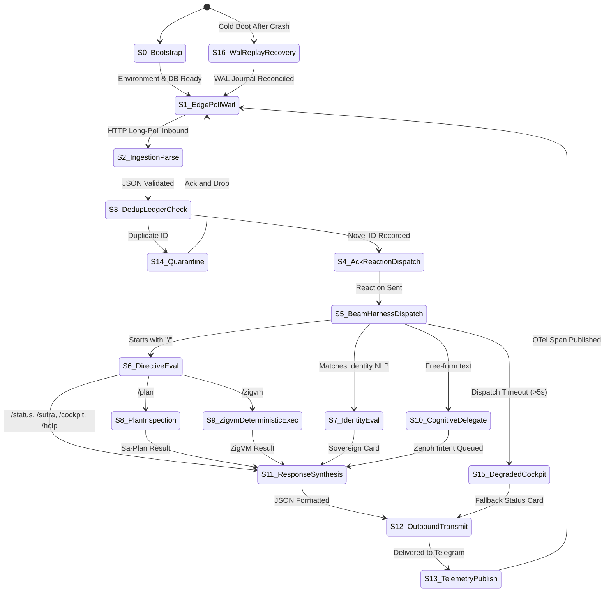
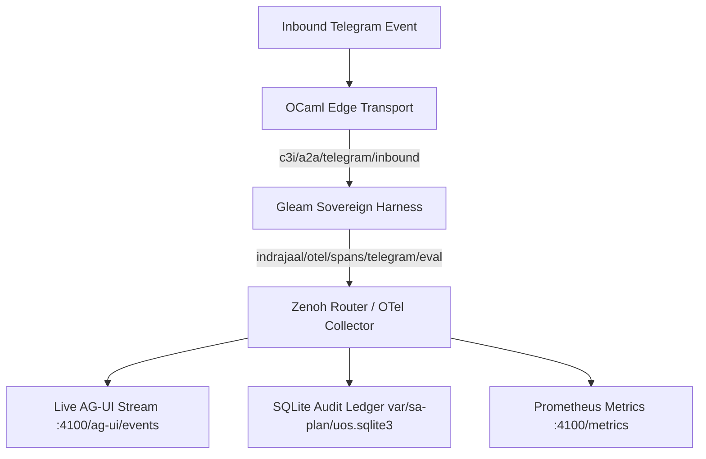

# 20260909-2035- UOS Telegram Operational States, Ingestion & Cognitive Flow

- **Document ID**: `DESIGN-TELEGRAM-STATES-001`
- **Timestamp**: `20260909-2035-`
- **Classification**: Sovereign Architecture / Operational Blueprint
- **Canonical Workspace**: `/home/an/NAS-setup/uos`
- **Tailscale FQDN**: [http://nas-1.tail55d152.ts.net:4100/docs/design/20260909-2035-uos-telegram-operational-states-and-flow.md](http://nas-1.tail55d152.ts.net:4100/docs/design/20260909-2035-uos-telegram-operational-states-and-flow.md)
- **Peer Host**: [http://vm-1.tail55d152.ts.net:8088](http://vm-1.tail55d152.ts.net:8088)
- **Fractal Tags**: `#fractal-l0`, `#fractal-l1`, `#fractal-l2`, `#fractal-l3`, `#fractal-l4`, `#fractal-l5`, `#fractal-l6`, `#fractal-l7`, `#fractal-l8`, `#fractal-l9`, `#zk-adr`, `#zero-muda`, `#tailscale-web`, `#checklist-nav`
- **Governing Contracts**: `contracts/rules/comprehensive-checklist-contract.md` (`SC-CHECKLIST-001`), `contracts/rules/tailscale-web-fqdn-mandate.md` (`SC-TAILSCALE-WEB-001`), `contracts/rules/diagram-parity-mandate.md` (`SC-DIAGRAM-001`).

---

## 1. Operational State Evolution

```
========================================================================================
                          TELEGRAM OPERATIONAL EVOLUTION
========================================================================================

  [ LEGACY HYBRID STATE ]                      [ SOVEREIGN GLEAM HARNESS STATE ]
  ---------------------------------            ---------------------------------
  * Direct commands: static OCaml               * ALL messages: UOS Gleam/OTP Harness
  * Identity queries: heuristic                 * Edge client: Stateless physical I/O
  * Free-form chat: Zenoh publish only         * Deduplication: SQLite WAL ledger
  * Outbound AI: unledgered polling            * State & Plan: Sa-Plan SQLite authority
  * Decentralized response generation           * Full C3I Telemetry & 13D trace coords
========================================================================================
```

### 1.1 Baseline Operational State (Legacy Hybrid)
In the legacy operational state:
- **Direct Commands & Identity Queries**: Answered directly by the native OCaml edge client (`tools/telegram_client.ml`) and ZigVM/Mojo fast-paths.
- **Conversational / Free-Form Messages**: Acknowledged immediately with an emoji reaction and friendly greeting, and the intent payload was posted to `indrajaal/l5/cog/intent/req`.
- **Outbound AI Replies**: Cognitive workers subscribed to `indrajaal/l5/cog/intent/req` wrote their LLM responses to `c3i/a2a/telegram/outbound`, which `tools/telegram_client.ml:605-635` consumed and relayed to the Telegram chat.

### 1.2 Target Sovereign Operational State (Unified Gleam Harness)
Under the unified sovereign architecture:
1. **Universal Message Ingestion**: The OCaml edge client acts purely as a physical transport daemon. It receives updates via long-polling (`getUpdates`), performs SQLite deduplication, sends immediate reaction feedback, and synchronously passes the update to `tools/telegram-harness-dispatch`.
2. **BEAM Sovereign Routing**: The Gleam Harness (`apps/cepaf_gleam/src/cepaf_gleam/harness/telegram.gleam`) evaluates every message:
   - Direct commands (`/status`, `/zigvm`, `/plan`, `/sutra`, `/cockpit`, `/approval`, `/help`) are parsed and executed against authoritative local state stores.
   - Identity queries are answered authoritatively from system specifications.
   - Free-form intent messages trigger both immediate interactive acknowledgments and structured Zenoh intent emissions (`indrajaal/l5/cog/intent/req`).
3. **Canonical Response & Telemetry Synthesis**: Gleam synthesizes the structured response and emits C3I OTel telemetry spans. The edge client receives the response JSON, transmits it to Telegram with MarkdownV2 (and plaintext fallback), and publishes it to `c3i/a2a/telegram/outbound`.

---

## 2. Complete State Machine Specification

```
+---------------------------------------------------------------------------------------+
|                       STATE MACHINE TRANSITION TOPOLOGY                               |
+---------------------------------------------------------------------------------------+
|                                                                                       |
|      [ S0: BOOTSTRAP ]                                                                |
|             |                                                                         |
|             v                                                                         |
|      [ S1: EDGE_POLL_WAIT ] <----------------------------------------+                |
|             | (HTTP update received)                                 |                |
|             v                                                        |                |
|      [ S2: INGESTION_PARSE ]                                         |                |
|             |                                                        |                |
|             v                                                        |                |
|      [ S3: DEDUP_LEDGER_CHECK ] ---> (seen) ---> [ S14: QUARANTINE ]  |                |
|             | (novel update)                                         |                |
|             v                                                        |                |
|      [ S4: ACK_REACTION_DISPATCH ]                                   |                |
|             |                                                        |                |
|             v                                                        |                |
|      [ S5: BEAM_HARNESS_DISPATCH ]                                   |                |
|             |                                                        |                |
|             +-----------------+------------------+                   |                |
|             | (directive)     | (identity)       | (conversational)  |                |
|             v                 v                  v                   |                |
|      [ S6: DIRECTIVE ] [ S7: IDENTITY ]   [ S10: COGNITIVE ]         |                |
|             |                 |                  |                   |                |
|        +----+----+            |                  |                   |                |
|        v         v            |                  |                   |                |
|   [ S8: PLAN ] [ S9: ZIGVM ]  |                  |                   |                |
|        +----+----+            |                  |                   |                |
|             |                 |                  |                   |                |
|             +-----------------+------------------+                   |                |
|                               |                                      |                |
|                               v                                      |                |
|                    [ S11: RESPONSE_SYNTHESIS ]                       |                |
|                               |                                      |                |
|                               v                                      |                |
|                    [ S12: OUTBOUND_TRANSMIT ]                        |                |
|                               |                                      |                |
|                               v                                      |                |
|                    [ S13: TELEMETRY_PUBLISH ] -----------------------+                |
|                                                                                       |
|   [ S15: DEGRADED_COCKPIT ] <--- (harness failure / timeout)                         |
|   [ S16: WAL_REPLAY_RECOVERY ] <--- (crash restart)                                  |
+---------------------------------------------------------------------------------------+
```

### 2.1 State Transitions and Verification Invariants



---

## 3. Telemetry and Observability Flow

Universal telemetry is maintained across all states via structured C3I JSON logging and Zenoh OTel span propagation:

```
+---------------------------------------------------------------------------------------+
|                               TELEMETRY EVENT TOPOLOGY                                |
+---------------------------------------------------------------------------------------+
|                                                                                       |
|   [ Inbound Telegram Event ]                                                          |
|              |                                                                        |
|              v                                                                        |
|   [ OCaml Edge Transport ]                                                            |
|              | (c3i/a2a/telegram/inbound)                                             |
|              v                                                                        |
|   [ Gleam Sovereign Harness ]                                                         |
|              | (indrajaal/otel/spans/telegram/eval)                                   |
|              v                                                                        |
|   [ Zenoh Router / OTel Collector ]                                                   |
|              |                                                                        |
|              +-----------------------------+-----------------------------+            |
|              |                             |                             |            |
|              v                             v                             v            |
|    [ Live AG-UI Stream ]       [ SQLite Audit Ledger ]       [ Prometheus Metric ]    |
|    (:4100/ag-ui/events)        (var/sa-plan/uos.sqlite3)     (:4100/metrics)          |
+---------------------------------------------------------------------------------------+
```



### 3.1 Telemetry Record Schema

Every Telegram lifecycle event produces a canonical 13-field C3I JSON record:

```json
{
  "trace_id": "4bf92f3577b34da6a3ce929d0e0e4736",
  "span_id": "00f067aa0ba902b7",
  "parent_span_id": "5fb397be34d23b0f",
  "timestamp": "2026-09-09T18:35:12.104291Z",
  "fractal_layer": "L5",
  "subsystem": "uos-telegram-harness",
  "event_type": "telegram_message_evaluated",
  "principal": {
    "user_id": 142270921,
    "username": "Avi",
    "role": "guardian"
  },
  "update_id": 811568285,
  "directive": "/status",
  "execution_duration_ns": 182491022,
  "status": "success",
  "audit_hash": "e3b0c44298fc1c149afbf4c8996fb92427ae41e4649b934ca495991b7852b855"
}
```

---

## 4. Architectural Invariants

1. **Jidoka Stop Line (`SC-JIDOKA-001`)**: If any un-ledgered plan modification is attempted outside of `sa-plan`, the harness immediately aborts execution and logs code `-32002`.
2. **Pure Functional Routing**: Gleam routing contains no unmanaged global mutable state. State updates are explicitly passed and returned in the `HarnessState` record.
3. **Storage NVMe Safety (`HARD_DENIED_SYSTEM_OS_SERIAL`)**: The root OS drive `25503L801736` is permanently locked against any destructive disk actions initiated via Telegram commands.
4. **Resilient Message Transmit**: All Markdown formatted messages that encounter parsing rejections from Telegram API are automatically retried with escaped plaintext.
