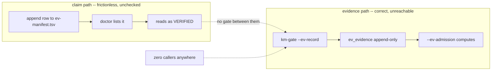

# 20260909-2120 — Fractal RCA: the EV tooling

#fractal-l0 #fractal-l1 #fractal-l2 #fractal-l3 #fractal-l4 #fractal-l5 #fractal-l6 #fractal-l7 #fractal-l8 #fractal-l9 #zero-muda #stamp-stpa #km-triad

**Live:** [http://nas-1.tail55d152.ts.net:4100/files/docs/design/20260909-2120-fractal-rca-ev-tooling.md](http://nas-1.tail55d152.ts.net:4100/files/docs/design/20260909-2120-fractal-rca-ev-tooling.md)

Observed `2026-09-09T21:11:20Z`. Every number below was executed, not recalled.
Supersedes nothing: [`20260908-1119-ev-admission-fractal-rca.md`](http://nas-1.tail55d152.ts.net:4100/files/docs/design/20260908-1119-ev-admission-fractal-rca.md)
asked a **different question** and answered it correctly. This one asks what happened *after* that repair.

---

## 0. The answer, stated first

**The tooling works. It is the only part that does.**

The prior RCA found that no admission gate existed and built one. That gate is now
correct, law-bound and honest: 12/12 laws pass, the ceiling is *derived* rather
than asserted, a gap invalidates every later cycle, and the store is append-only
by trigger. It computes `ev_admitted = 0`, `derived_ceiling = 0`, and it is right
to.

What is broken is not the verifier. It is that **the repair replaced the verifier
without touching the cost asymmetry that produced the original defect**:

```text
   CLAIM AN EV CYCLE                    EVIDENCE AN EV CYCLE
   ─────────────────                    ────────────────────
   append one line to a TSV             produce a revision-bound runtime receipt
   (governance/ev-manifest.tsv)         + a machine-checkable formal artifact
                                        + run a CLI that nothing references
                                        + do it 111 times
   cost: seconds                        cost: unbounded
   checked against ceiling: NO          callers in the repository: ZERO
```



The two paths never meet. Nothing forces a claim to acquire evidence, and nothing
stops a claim without it. That is a **Muda and poka-yoke** problem, not a Jidoka
one — the line stops correctly; there is no pull signal that makes evidence get
produced at the moment the work is done.

---

## 1. Evidence

| # | Executed | Result |
|---|---|---|
| 1 | `km-gate --gate` | **PASS**, 0 findings, 107 ADRs contiguous, entropy **3.309** vs floor 2.50 |
| 2 | `km-gate --ev-selftest` | **12 checks, 0 failures** |
| 3 | `km-gate --ev-admission <rev>` | `ev_claimed 109`, **`ev_admitted 0`**, **`derived_ceiling 0`** |
| 4 | `select count(*) from ev_evidence` | **1** — and it is `ev=999, revision='r', runtime_ref='rt', formal_ref='fm', recorded_by='test'`, a test fixture |
| 5 | `select count(*) from ev_evidence where recorded_by != 'test'` | **0** |
| 6 | `select count(*) from ev_verdict` | **0** |
| 7 | `select count(*) from cycle` | **356** — the cycle journal *is* being used |
| 8 | `grep -rn 'ev-record'` across the tree | **zero callers**; one mention, in the prior RCA's own prose |
| 9 | `grep -rn 'ev-record' .claude/ .agents/ .codex/ .gemini/ contracts/` | **nothing** — no agent surface teaches it exists |
| 10 | `wc -l governance/ev-manifest.tsv` | **115 rows**, listing up to **EV-111** against a pinned ceiling of 93 |
| 11 | `uos-cli doctor` | **HOLD** — 20/111 have an artifact, 91 declare none |

Row 7 against rows 4–6 is the whole diagnosis: the *cycle* store has 356 rows
because writing one is a side effect of doing work. The *evidence* store has zero
because writing one is a separate, manual, undiscoverable act.

---

## 2. Five whys, and where each stops

1. **Why is `ev_admitted` 0?** No evidence row exists for any claimed cycle.
2. **Why is `ev_evidence` empty?** `--ev-record` has **zero callers**.
3. **Why does nothing call it?** No gate, task completion or CI step *produces*
   an evidence row. The two-key rule's **consumer** was built; its **producer**
   was not.
4. **Why was only the consumer built?** The prior RCA said so explicitly and
   honestly (§8): *"`ev_evidence` is empty and was left empty: I did not
   manufacture evidence rows to make the number move."* Correct restraint —
   and it left the producer as somebody's future work, which nobody picked up.
5. **Why did nobody pick it up?** Because nothing forces it. Claiming stayed
   free. Two more cycles (110, 111) were minted *after* the ceiling was pinned.

**Root cause:** *the verifier was replaced; the incentive gradient was not.*
Evidence is expensive, discretionary and invisible; claiming is cheap, automatic
and rewarded by a tool that prints `[VERIFIED]`.

---

## 3. Fractal decomposition

| Layer | What is actually there | Verdict |
|---|---|---|
| **L0 Constitutional** | `INV-PROV-05` bars minting above the ceiling. **Violated** — EV-110, EV-111 exist. No mechanism enforces it; the mint path is `>> file.tsv` | **defect D3** |
| **L1 Atomic** | `km_ev.ml` — `admit` requires evidence bound to the exact revision *and* both keys present. No branch returns `Admitted` without both | **sound** |
| **L2 Component** | `km-gate` verbs: `--gate`, `--ev-admission`, `--ev-selftest`, `--ev-record`. All work | **sound, one integrity defect (D1)** |
| **L3 Transaction** | `ev_evidence` append-only by trigger. Correct — and **empty**, because no transaction anywhere emits a row | **root cause sits here** |
| **L4 System** | `apply_no_gap`: a gap makes every later cycle inadmissible. `ceiling` is a derived contiguous prefix, never asserted | **sound, and strong** |
| **L5 Cognitive** | `doctor` prints `[VERIFIED] EV-97…` then a NOTE saying an artifact is *not* admission. The label is coarser than the property | **defect D2** |
| **L6 Ecosystem** | No agent surface, contract or rule mentions `ev-record`. The population meant to use it cannot discover it | **root cause sits here too** |
| **L7 Federation** | Evidence is workspace-relative with no canonical-root fallback — deliberate, and correct for a per-workspace claim | **sound** |
| **L8 Evolutionary** | 356 cycle rows vs 0 evidence rows. The system evolved the cheap ledger and not the expensive one | **the measurement of the root cause** |
| **L9 Sovereign** | Ceiling *derived* as 0, not asserted as 93. The tool refuses to inherit a number it cannot compute | **sound — the best property in the whole subsystem** |

L1, L4, L7 and L9 are genuinely good work. The failure is concentrated at **L3 and
L6** — production and discoverability — and expressed at **L0** as an unenforced
invariant.

---

## 4. Four defects, and what happened to each

### D1 — HIGH — the provenance tool forged its own attributor · **FIXED**

`ev_record` wrote `recorded_by` as the string literal
`"fable-km-refresh-20260908-0912"`. **Every row this tool would ever write, by
whoever ran it, claimed to have been recorded by one session that in general did
not write it.**

This is the *same defect class* that produced the original quarantine — shared
coordinator events stamped with a session identity that did not author them —
sitting inside the tool built to police provenance. And `ev_evidence` is
append-only by trigger, so a wrong attribution could never be corrected, only
appended around.

Fixed: the attributor is a required caller-supplied argument, refused when blank.

| Negative control | Result |
|---|---|
| old 4-argument form | **exit 2**, nothing written |
| empty attributor | **exit 2**, `"recorded_by is required"`, nothing written |
| `ev_evidence` count after both | **1** — unchanged |
| `--ev-selftest` after the change | **12 checks, 0 failures** |

### D2 — MEDIUM — `[VERIFIED]` is coarser than what it observes · open

`doctor` prints `[VERIFIED] EV-97: …` for 20 cycles, then a NOTE explaining that
an existing artifact is **not** two-key admission. Anyone grepping for `VERIFIED`
gets 20 hits and no caveat. The label should be `[ARTIFACT]`; the word "verified"
belongs only to what `--ev-admission` computes.

Not fixed here: `tools/uos` is cited by four rule families and other sessions are
active in it. Reported, with the one-word change specified.

### D3 — MEDIUM — `INV-PROV-05` is unenforced, and I violated it · open

The manifest lists up to **EV-111** against a ceiling of 93. The last two rows
are mine — commit `f752d3c9`, *"fix(km): single-source the fractal taxonomy and
remove km_layers"* — covering the preflight integration and the km_layers review.
That work should have been numbered `C01..Cnn` inside its sa-plan.

It is not load-bearing (both compute `NOT_ADMITTED` like everything else, so
nothing was laundered into admission), but the invariant says *minting during
quarantine reproduces the exact failure mode*, and the mint path is an append to
a TSV with no check against the ceiling. **The poka-yoke is the fix, not my
apology**: `km-gate` should fail when a manifest row exceeds
`admitted_ev_ceiling` without a `NOT_ADMITTED` marker.

### D4 — LOW — presence written as its own double negative · **FIXED**

`(not (Filename.is_relative path)) = false && Sys.file_exists path` — correct
(the reference must be workspace-relative) but it reads at a glance as the
opposite. Now `Filename.is_relative path && Sys.file_exists path`, with the
intent stated in a comment.

---

## 5. The remediation that actually matters

D1–D4 are hygiene. **None of them moves `ev_admitted` off zero**, and no amount of
tool polish will, because the defect is at L3 and L6.

**L3 — make evidence a side effect of doing the work, not a separate act.**
The producer already exists and nobody noticed: the successor harness's `finish`
binds a candidate manifest, a build receipt, a test receipt, a journal and a
verification attestation, all to one revision. *That is a two-key evidence row.*
It should emit one. Evidence then accumulates the way `cycle` rows already do —
356 of them, because writing one costs nothing extra.

**L6 — make the verb discoverable.** `--ev-record` appears in no contract, no
rule, no agent surface. A tool the population cannot find is not a control.

**L0 — make claiming cost what evidencing costs.** Until appending to
`ev-manifest.tsv` is checked against the derived ceiling, the cheap path stays
cheap and this RCA gets written again.

The ordering is deliberate: fix L3 first and L0 second. Enforcing L0 before a
producer exists would block all work while making no evidence available — the
same shape as demanding a review task stay uncompleted, which is the error this
session has already made once.

---

## 6. What this RCA does not claim

- It does not admit anything. `ev_evidence` still holds **one test row**, and I
  did not add any — manufacturing evidence to move a number is the failure mode,
  not the fix.
- D2 and D3 are **reported, not fixed**. D3's fix is a poka-yoke I specified and
  did not write.
- The L3 producer is a **design proposal**. It touches `finish` in frozen harness
  source under another session's authority.
- The prior RCA's Part II (merge holds) is untouched and still accurate.

---

**UOS footer:** [nas-1.tail55d152.ts.net:4100](http://nas-1.tail55d152.ts.net:4100/) · Sa-plan is the sole execution authority; this analysis grants no admission and no effect authority.
