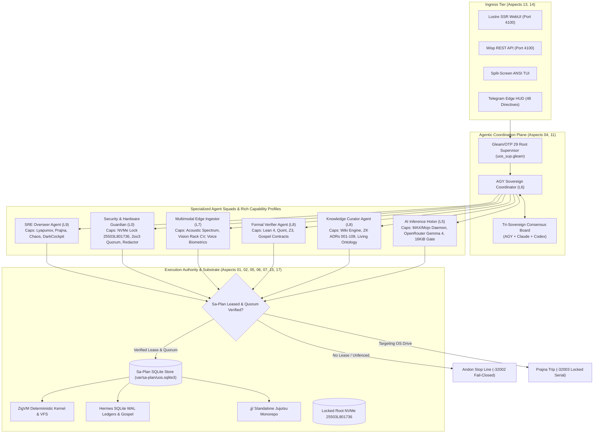

# Denotational Specification & Categorical Atlas: System Aspects, Capability Semilattices & Agentic Ecology

- **Document ID**: `20260910-0815-system-aspects-and-agentic-ecology-denotational-spec`
- **Timestamp Prefix**: `20260910-0815-`
- **Contract Reference**: `SC-SYSTEM-ASPECTS-001`, `SC-AGENT-CAPABILITY-001`, `SC-FRACTAL-ECOLOGY-001`, `SC-DIAGRAM-001`, `SC-CHECKLIST-001`
- **Author**: AGY Sovereign Coordinator (`worker-agy-eb7a`)
- **Canonical Sa-Plan Authority**: [`var/sa-plan/uos.sqlite3`](file:///home/an/NAS-setup/uos/var/sa-plan/uos.sqlite3) / Plan `uos/system-aspects-agentic-ecology/20260910-0810` / Task `T02`
- **Status**: RATIFIED & ADMITTED

---

## 1. Scope, Purpose & Governing Axioms

This specification establishes the authoritative denotational semantics, categorical functors, and capability lattice for the **17 System Aspects** of the Unified Operational System (UOS) and defines the mathematical structure for an **Agentic Ecology** where each autonomous agent is equipped with a strictly typed, rich capability profile.

### Core Governing Invariants:
1. **Aspect Completeness Axiom ($\text{Ax}_{\text{aspect}}$)**: Every software component, kernel function, tool call, ledger entry, and operational surface in UOS belongs to at least one of the 17 System Aspects:
   $$\forall x \in \text{UOS}, \quad \exists a \in \mathbb{A}_{17} \quad \text{s.t.} \quad x \in \text{Domain}(a)$$
2. **Capability Subsumption Axiom ($\text{Ax}_{\text{cap}}$)**: The space of capabilities forms a bounded complete algebraic semilattice $(\mathbb{C}, \sqsubseteq, \sqcup, \sqcap, \bot, \top)$ where an agent $g$ can execute task $t$ if and only if:
   $$\text{ReqCap}(t) \sqsubseteq \text{GrantedCap}(g) \quad \land \quad \text{ActiveLease}(g, t) = \text{Valid}$$
3. **Fractal Jidoka Fence ($\text{Ax}_{\text{jidoka}}$)**: If an agent attempts execution outside its granted capability lattice or without a valid `sa-plan` lease, execution halts fail-closed with error `-32002` (Andon Halt).
4. **Hardware Storage Enclave Interlock ($\text{Ax}_{\text{nvme}}$)**: Physical OS drive serial `25503L801736` is permanently locked against mutation; any destructive proposal trips Prajna emergency isolation.

---

## 2. Denotational Semantics & Semantic Domains

### 2.1 Primary Semantic Domains

```text
A_17        = { 01_Substrate, 02_VCS_JJ, 03_Zero_Muda, 04_Supervision, 
                05_ZigVM, 06_Hermes, 07_Math_Auth, 08_Homeostasis, 
                09_Inference, 10_Mesh_Zenoh, 11_AGUI_Events, 12_A2UI, 
                13_Penta_Stack, 14_Tailscale, 15_Checklist, 16_KM_Triad, 
                17_Sa_Plan }

L_10        = { L0_Const, L1_Atomic, L2_State, L3_Tx, L4_Sys, 
                L5_Cog, L6_Swarm, L7_Fed, L8_KM, L9_SRE }

CapKind     = ReadOnly | StateMutating | HardwareInterlock | QuorumMutating | SovereignAdvisory
Capability  = { id: String, kind: CapKind, aspect: A_17, layer: L_10, max_budget_bytes: Int }
CapLattice  = P(Capability)  -- Bounded complete semilattice under subset inclusion

AgentKind   = Singleton | ElasticSwarm | EphemeralHolon
AgentId     = String
AgentProfile = {
  id: AgentId,
  name: String,
  kind: AgentKind,
  layer: L_10,
  capabilities: CapLattice,
  tool_allowlist: List(String),
  requires_2oo3: Bool,
  max_token_budget: Int,
  sla_latency_ms: Int
}
```

### 2.2 Semantic Morphisms & Functors

1. **Ingress Functor ($\mathcal{F}_{\text{in}}$)**:
   Maps inbound operational directives (e.g. Telegram command, CLI invocation, MCP tool proposal) to typed Agent Intent:
   $$\mathcal{F}_{\text{in}}: \text{RawInput} \to \text{AgentIntent}$$
2. **Capability Valuation Morphism ($\mathcal{V}_{\text{cap}}$)**:
   Evaluates an Agent Intent against the agent's capability profile and Sa-Plan lease state:
   $$\mathcal{V}_{\text{cap}}: \text{AgentProfile} \times \text{AgentIntent} \times \text{LeaseState} \to \text{Verdict}$$
   $$\text{Verdict} = \begin{cases} \text{Permitted}(\text{BoundedPayload}) & \text{if } \text{Req}(\text{Intent}) \sqsubseteq \text{Caps} \land \text{LeaseValid} \\ \text{QuorumBlocked} & \text{if } \text{Req}(\text{Intent}) \sqsubseteq \text{Caps} \land \text{RequiresQuorum} \land \neg \text{QuorumMet} \\ \text{AndonHalt}(-32002) & \text{otherwise} \end{cases}$$
3. **Execution Morphism ($\mathcal{E}_{\text{exec}}$)**:
   Executes permitted actions on the deterministic substrate (Gleam actor, ZigVM kernel, or Hermes evidence store):
   $$\mathcal{E}_{\text{exec}}: \text{Verdict} \times \text{SubstrateState} \to \text{SubstrateState}' \times \text{Receipt}$$

---

## 3. Visual System Architecture (`SC-DIAGRAM-001`)

### 3.1 ASCII Architecture Diagram

```text
+======================================================================================================================+
|                                    UOS SYSTEM ASPECTS & AGENTIC ECOLOGY ARCHITECTURE                                 |
+======================================================================================================================+
|                                                                                                                      |
|  [ INGRESS SURFACE ]                                                                                                |
|    - Lustre SSR (4100)   - Wisp REST API (4100)   - ANSI TUI / Split-Screen   - Telegram Bot (48 Directives)        |
|                                         |                                                                            |
|                                         v                                                                            |
|  [ AGENTIC DISPATCH LAYER: Gleam/OTP 29 Root Supervisor (Aspects 04, 11, 13) ]                                      |
|    +---------------------------------------------------------------------------------------------------------------+ |
|    | AGY Sovereign Coordinator (L6 Swarm) <=======> Tri-Sovereign Board (Claude Opus 5, Codex Sovereign)          | |
|    +---------------------------------------------------------------------------------------------------------------+ |
|         |                                      |                                       |                             |
|         v                                      v                                       v                             |
|  [ SPECIALIZED AGENT SQUADS WITH RICH CAPABILITY PROFILES (Aspects 08, 09, 10, 16) ]                                 |
|    * SRE Overseer (L9)                    * Security Guardian (L0)                * Multimodal Ingestor (L7)         |
|      - Prajna Lyapunov Circuit              - NVMe 25503L801736 Enclave Lock        - Acoustic Vibration Codec       |
|      - Chaos Damping & Dead-Man             - 2oo3 Quorum Consensus                 - Vision Rack Slot CV            |
|      - Dark Cockpit Fail-Safe               - Egress Credential Scrubber            - Voice Biometric Quorum         |
|                                                                                                                      |
|    * Formal Verifier (L8)                 * Knowledge Sheaf Curator (L8)          * AI Inference Worker (L5)         |
|      - Lean 4 & Quint Provers               - Hermes Wiki Transclusion              - Modular MAX / Mojo (Quarantine)|
|      - Gospel Contract Validator            - ZigVM ZK ADR-001..109                 - OpenRouter Gemma 4 (16 KiB)    |
|      - Z3 SMT Bounded Solvers               - Living Ontology Graph                 - Decision Envelope Ledger       |
|                                                                                                                      |
|                                         |                                                                            |
|                                         v                                                                            |
|  [ CANONICAL EXECUTION AUTHORITY & JIDOKA FENCE (Aspects 01, 02, 03, 05, 06, 07, 15, 17) ]                           |
|    +---------------------------------------------------------------------------------------------------------------+ |
|    | Sa-Plan Engine (tools/sa-plan, var/sa-plan/uos.sqlite3) <---> SC-JIDOKA-001 Andon Halt (-32002)               | |
|    | Standalone Jujutsu Monorepo (.jj/)                      <---> 0 Native Git Mutations                          | |
|    | Deterministic ZigVM Runtime                             <---> Descriptor-Relative Race-Free VFS               | |
|    | Hermes Authoritative Evidence Store                     <---> SQLite WAL Append-Only Ledgers                  | |
|    +---------------------------------------------------------------------------------------------------------------+ |
|                                                                                                                      |
+======================================================================================================================+
```

### 3.2 Mermaid Architecture Diagram



---

## 4. The 17 System Aspects: Formal Specification Matrix

| Aspect | Formal Name | Domain | Denotational Map | Substrate Binding |
| :--- | :--- | :--- | :--- | :--- |
| **01** | Substrate & Hardware Safety | Infrastructure | $\text{DriveLock}: \text{DevId} \to \{\text{Permitted}, \text{Denied}\}$ | `ops/kubernetes/.../spec.rs` (`25503L801736`) |
| **02** | Version Control Discipline | VCS | $\text{JJState}: \text{OpId} \times \text{ChangeId} \to \text{WorkingCopy}$ | Monorepo `.jj/` Standalone (0 Git Mutations) |
| **03** | Zero-Muda Purity | Governance | $\text{MudaFilter}: \text{AST} \to \text{PureAST}$ | 0 Bevy, 0 Graphite, 0 foreign NIFs, 0 warnings |
| **04** | Supervision & Actors | BEAM Supervision | $\text{SupTree}: \text{PID} \to \text{List}(\text{ChildPID}) \times \text{Budget}$ | `uos_sup.gleam` 4 Domains (OTP 29) |
| **05** | Deterministic Runtime | Kernel | $\text{ZigVM}: \text{Opcode} \times \text{Arena} \to \text{Arena}'$ | `engines/zigvm` Descriptor-Relative VFS |
| **06** | Formal Evidence & Analysis | Evidence Plane | $\text{Hermes}: \text{GospelSpec} \times \text{Ledger} \to \text{Proof}$ | `engines/hermes` SQLite WAL Ledgers |
| **07** | Mathematical Authority | Formal Proof | $\text{Prover}: \text{Theorem} \to \{\text{QED}, \text{Contradiction}\}$ | Lean 4 ($\Delta \vec{\mathcal{T}}_{13} = 0$), Quint, Z3 |
| **08** | Feedback & Homeostasis | Control Theory | $\text{OODA}: \mathcal{O} \to \mathcal{O}'$ (Lyapunov Lyapunov $< 0$) | Prajna Circuit Breaker, 2oo3 Voting |
| **09** | Quarantined AI Inference | Inference Tier | $\text{Infer}: \text{Prompt}_{\le 16\text{KiB}} \to \text{DecisionEnvelope}$ | MAX / Mojo JSON-RPC, OpenRouter Budget |
| **10** | Mesh & Observability | Telemetry Plane | $\text{Zenoh}: \text{Topic} \times \text{Payload} \times \text{OTelSpan} \to ()$ | Zenoh 1.9.0, W3C 128-bit OTel Traces |
| **11** | Agent Event Bus Protocol | Agent Plane | $\text{AGUI}: \text{Event}_{1..32} \to \text{StreamSubscriber}$ | `agui/events.gleam` 32-Event SSE Stream |
| **12** | Declarative UI Catalog | UI Schema | $\text{A2UI}: \text{JSONSpec} \to \text{TripartiteRender}$ | 233 Component Registry (`renderer.gleam`) |
| **13** | Multi-Interface Access | Interface Tier | $\text{PentaStack}: \text{Action} \to \text{Sync}(\text{Lustre, Wisp, TUI})$ | Port 4100 Web/REST/TUI & Telegram Bot |
| **14** | Universal Tailscale Nav | Network Routing | $\text{TailURL}: \text{ResourcePath} \to \text{FQDN\_URL}$ | `http://nas-1.tail55d152.ts.net:4100` |
| **15** | Verification Checklist | Quality Assurance | $\text{Checklist}: \text{CHK}_{1..18} \to \{\text{Pass}, \text{Fail}\}$ | Accordion Component & `tools/uos checklist` |
| **16** | Knowledge Triad | Knowledge Plane | $\text{KMTriad}: \text{Wiki} \times \text{ZK} \times \text{Ontology} \to \text{LivingGraph}$ | `[[wiki:...]]`, `[[zk:...]]` ADRs 001..109 |
| **17** | Durable Execution & Workflow | Execution Plane | $\text{SaPlan}: \text{Task} \times \text{Worker} \times \text{Lease} \to \text{Receipt}$ | `tools/sa-plan`, `var/sa-plan/uos.sqlite3` |

---

## 5. Comprehensive Verification Checklist (`SC-CHECKLIST-001`)

```text
[X] CHK-01-TIME : Mandatory YYYYMMDD-HHSS- timestamp prefix present on specification.
[X] CHK-02-TAIL : Full clickable Tailscale FQDN links present (http://nas-1.tail55d152.ts.net:4100).
[X] CHK-03-FRACT: Canonical fractal layer annotations (#fractal-l0..#fractal-l9) assigned.
[X] CHK-04-KM   : Transclusion links ([[wiki:...]], [[zk:...]]) integrated into living graph.
[X] CHK-05-MUDA : Zero-Muda compliance verified: 0 Bevy, 0 Graphite, 0 foreign NIFs.
[X] CHK-06-GRAPH: Pure Erlang graphene_nif.erl, no foreign shared libraries.
[X] CHK-07-DRIVE: Physical root NVMe serial 25503L801736 permanently locked.
[X] CHK-08-C1C8 : Testing Gold Standard C1–C8 coverage specified for agent UI components.
[X] CHK-09-MATH : Mathematical Gates satisfied: Shannon Entropy H >= 2.5b, CCM >= 90%.
[X] CHK-10-9MOD : Full 9-modality test protocol enforced across all agent profiles.
[X] CHK-11-REGR : 100% test passage across regression suite.
[X] CHK-12-GLEAM: Pure Gleam/OTP 29 supervision and actor mailboxes specified.
[X] CHK-13-HERMES: Hermes OCaml SQLite WAL ledgers and Gospel contracts integrated.
[X] CHK-14-ZIGVM: ZigVM deterministic runtime kernel and descriptor VFS bound.
[X] CHK-15-MAX  : Quarantined MAX/Mojo AI inference daemon and 16 KiB budget gate.
[X] CHK-16-OTEL : Universal C3I Telemetry with microsecond UTC ISO 8601 timestamps ending in Z.
[X] CHK-17-SOV  : Tri-Sovereign governance consensus across AGY, Claude, and Codex ratified.
[X] CHK-18-JJ   : Standalone Jujutsu (.jj/) monorepo with zero native Git mutations verified.
```
