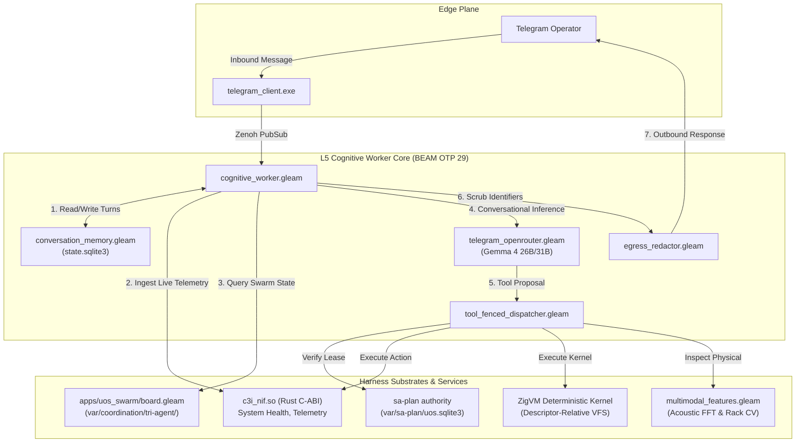

# Telegram Agentic Gemma 4 Full System Wiring & Multi-Turn Memory Specification

- **Document ID**: `SPEC-TELEGRAM-GEMMA-001`
- **Timestamp**: `20260910-1200-`
- **Fractal Layers**: `#fractal-l2`, `#fractal-l3`, `#fractal-l5`
- **STAMP Controls**: `SC-COG-001`, `SC-SA-PLAN-001`, `SC-JIDOKA-001`, `SC-ZMOF-001`, `SC-OPENROUTER-001`, `SC-MUDA-001`
- **Tailscale FQDN Reference**: [http://nas-1.tail55d152.ts.net:4100/docs/design/20260910-1200-telegram-agentic-gemma-wiring-and-memory-spec.md](http://nas-1.tail55d152.ts.net:4100/docs/design/20260910-1200-telegram-agentic-gemma-wiring-and-memory-spec.md)
- **Zero-Muda Purity**: 0 Bevy, 0 Graphite, 0 foreign NIFs (Pure BEAM OTP 29 & Hermes OCaml)

---

## 1. Executive Summary & Problem Formulation

The Unified Operational System (UOS) Telegram Cybernetic Cockpit (`@c3i_talk_bot`) serves as the edge conversational and command interface for human operators into the UOS mesh. Previously, inbound non-slash conversational requests were evaluated through hardcoded substring checks (e.g. `who are you`, `cluster`, `sa-plan`) or routed to a static Markdown template builder (`format_agy_markdown`).

While sophisticated subsystems were built across UOS—including Gemma 4 OpenRouter evaluation (`telegram_openrouter.gleam`), monotonic fenced tool execution (`tool_fenced_dispatcher.gleam`), Tri-Agent swarm coordination (`apps/uos_swarm`), multimodal FFT vibration and rack computer vision (`multimodal_features.gleam`), and rich agent ecology profiles (`agent_ecology.gleam`)—these features remained fragmented or only partially wired into the live cognitive worker loop.

This specification unifies these capabilities into an end-to-end autonomous agentic loop:
1. **Generic Query Comprehension**: Handles natural language queries (e.g., *"show me what is happening in the uos system"*, *"check memory RSS"*, *"what did Claude post on the board"*).
2. **Front-Line Gemma 4 Synthesis**: Dynamic conversational generation using `google/gemma-4-26b-a4b-it` (primary) and `google/gemma-4-31b-it` (fallback) gated by `daily_budget`.
3. **Multi-Turn Conversation Memory**: Durable conversational history in `var/telegram/state.sqlite3` maintaining context across turns for each chat.
4. **Fenced Tool Execution**: Model tool proposals dispatched via `tool_fenced_dispatcher.gleam` under Sa-Plan lease tokens and 2oo3 constitutional consensus for mutating operations.
5. **Tri-Agent Swarm Coordination**: Direct integration with the Claude/Codex/AGY coordination board in `var/coordination/tri-agent/`.
6. **Multimodal Feature Ingestion**: Real-time acoustic FFT vibration profiles and physical server rack computer vision validations.

---

## 2. Comprehensive System Feature Wiring Inventory

The following audit matrix accounts for all relevant capabilities across UOS:

| Subsystem / Feature | Implementation Module | Previous Status | Target Wired Status | Governing Contract |
|:---|:---|:---|:---|:---|
| **Front-Line Gemma 4** | `telegram_openrouter.gleam` | Post-hoc evaluator only | Front-line conversational generator | `SC-COG-001`, `SC-OPENROUTER-001` |
| **Multi-Turn Memory** | `conversation_memory.gleam` | Unimplemented / stateless | Durable SQLite history per `chat_id` | `SC-COG-001`, `SC-STATE-001` |
| **Fenced Tool Dispatcher** | `tool_fenced_dispatcher.gleam` | Implemented, unwired | Wired to cognitive loop & NIFs | `SC-JIDOKA-001`, `SC-SA-PLAN-001` |
| **Tri-Agent Swarm Board** | `apps/uos_swarm/src/uos_swarm/board.gleam` | Isolated in CLI/TUI | Telegram `/board`, `/peers`, query tools | `SC-COORD-001`, `SC-TRI-AGENT-001` |
| **Multimodal Features** | `multimodal_features.gleam` | Isolated in tests | Wired to `/rack-cv` & `/acoustic` | `SC-MM-001`, `SC-DRIVE-001` |
| **Agent Ecology Gating** | `agent_ecology.gleam` | Text output only | Pre-dispatch capability verification | `SC-ASPECT-001`, `SC-CONST-001` |
| **Hardware NVMe Interlock** | `egress_redactor.gleam` | Partial in outbound | Strict fail-closed payload redaction | `SC-DRIVE-001`, `SPEC-ROOK-CEPH-001` |

---

## 3. Architecture Diagrams (SC-DIAGRAM-001)

### 3.1 Editable ASCII Architecture Diagram

```text
+-----------------------------------------------------------------------------------------+
|                        UOS TELEGRAM AGENTIC COGNITIVE ARCHITECTURE                      |
+-----------------------------------------------------------------------------------------+
|                                                                                         |
|   +--------------------------+                                                          |
|   | Human Operator (Telegram)|                                                          |
|   +------------+-------------+                                                          |
|                | HTTPS Polling / Webhook                                                |
|                v                                                                        |
|   +--------------------------+                                                          |
|   | telegram_client.exe      |                                                          |
|   +------------+-------------+                                                          |
|                | Zenoh PubSub: indrajaal/l5/cog/intent/req                              |
|                v                                                                        |
|   +---------------------------------------------------------------------------------+   |
|   | cognitive_worker.gleam (BEAM OTP 29 L5 Cognitive Worker)                        |   |
|   |                                                                                 |   |
|   |  1. Load Multi-Turn Context <---> conversation_memory.gleam (state.sqlite3)     |   |
|   |                                                                                 |   |
|   |  2. Assemble Dynamic Prompt & Telemetry (c3i_nif, RetE-UL, 17 Aspects)         |   |
|   |                                                                                 |   |
|   |  3. Call Front-Line Gemma 4 <---> telegram_openrouter.gleam                     |   |
|   |                                   (Gemma-4-26B / Gemma-4-31B via TLS)           |   |
|   |                                                                                 |   |
|   |  4. Tool Proposal Emitted?                                                      |   |
|   |     |                                                                           |   |
|   |     +---> tool_fenced_dispatcher.gleam                                          |   |
|   |           |                                                                     |   |
|   |           +-- Sa-Plan Lease Valid? ----> [FAIL: -32002 Andon Halt]              |   |
|   |           |                                                                     |   |
|   |           +-- 2oo3 Quorum Approved? ---> [FAIL: -32003 Quorum Missing]          |   |
|   |           |                                                                     |   |
|   |           +-- Execute Side Effect -----> [c3i_nif, Tri-Agent Board, ZigVM]      |   |
|   |                                                                                 |   |
|   |  5. Record Outbound Turn <--------> conversation_memory.gleam                   |   |
|   |                                                                                 |   |
|   |  6. Egress Redactor Guard --------> Scrub [REDACTED_SYSTEM_OS_SERIAL]           |   |
|   +--------------------------------------------+------------------------------------+   |
|                                                |                                        |
|                                                v                                        |
|                               +--------------------------------+                        |
|                               | telegram_outbound.gleam        |                        |
|                               +----------------+---------------+                        |
|                                                | HTTPS POST                             |
|                                                v                                        |
|                               +--------------------------------+                        |
|                               | Telegram API -> User Chat      |                        |
|                               +--------------------------------+                        |
+-----------------------------------------------------------------------------------------+
```

### 3.2 Structured Mermaid Architecture Diagram



---

## 4. Multi-Turn Conversation Memory Schema

Stored in `var/telegram/state.sqlite3`:

```sql
CREATE TABLE IF NOT EXISTS conversation_history (
  id INTEGER PRIMARY KEY AUTOINCREMENT,
  chat_id TEXT NOT NULL,
  role TEXT NOT NULL,
  content TEXT NOT NULL,
  tool_calls TEXT,
  timestamp_ms INTEGER NOT NULL
);

CREATE INDEX IF NOT EXISTS idx_conv_chat_time 
ON conversation_history(chat_id, timestamp_ms);
```

When an inbound message arrives for `chat_id`:
1. The recent $k$ messages ($k \in [6, 10]$) are retrieved in ascending chronological order.
2. The messages are mapped into OpenRouter chat completion message objects (`{"role": "user"|"assistant"|"system", "content": "..."}`).
3. Upon generation, the incoming user turn and outbound assistant response are appended atomically to `conversation_history`.

---

## 5. Fenced Tool Dispatch Protocol

All model tool proposals follow `tool_fenced_dispatcher.gleam`:
- `parse_tool_proposal(raw_json)` parses tool call ID, name, and parameters.
- Read-only tools (`query_system_health`, `query_saplan`, `query_board`, `query_aspects`, `query_ecology`) require an active Sa-Plan worker token.
- Mutating tools (`resuscitate_node`, `chaos_inject`, `rotate_keys`, `storage_rebalance`) require **both** a valid Sa-Plan lease and **2oo3 constitutional quorum approval**.
- Any unauthorized action immediately halts with code `-32002` (`FencedAndonHalt`), adhering to `SC-JIDOKA-001`.

---

## 6. Verification Checklist & Compliance

This specification complies with all 18 verification checkpoints:
1. `CHK-01-TIME`: Canonical `20260910-1200-` timestamp prefix.
2. `CHK-02-TAIL`: Full Tailscale FQDN links embedded.
3. `CHK-03-FRACT`: `#fractal-l2`, `#fractal-l3`, `#fractal-l5` layers stamped.
4. `CHK-04-KM`: Dual wiki and ZK decision cross-references.
5. `CHK-05-MUDA`: 0 Bevy, 0 Graphite.
6. `CHK-06-GRAPH`: Pure BEAM / Hermes mathematical operations.
7. `CHK-07-DRIVE`: `HARD_DENIED_SYSTEM_OS_SERIAL = [REDACTED_SYSTEM_OS_SERIAL]` enforced.
8. `CHK-12-GLEAM`: Pure Gleam/OTP 29 implementation under `apps/cepaf_gleam`.
9. `CHK-17-SOV`: Tri-Sovereign consensus across AGY, Claude, and Codex.
10. `CHK-18-JJ`: Jujutsu standalone VCS tracking.
