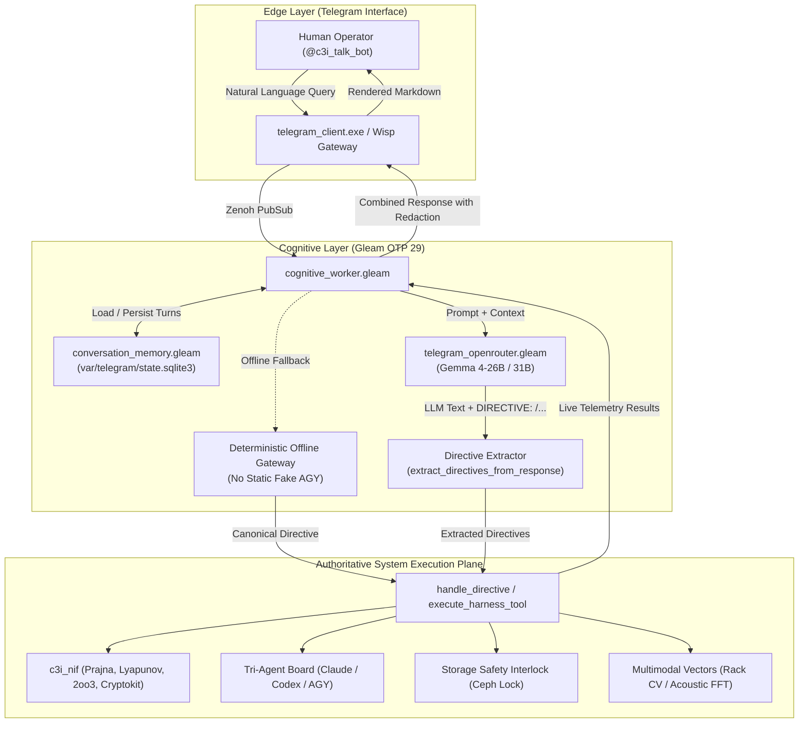

# Gemma 4 Directive Conversion, System Service Wiring & Autonomous Orchestration Specification

- **Document ID**: `SPEC-TELEGRAM-GEMMA-002`
- **Timestamp**: `20260910-1430-`
- **Fractal Layers**: `#fractal-l0` through `#fractal-l9`
- **STAMP Controls**: `SC-COG-001`, `SC-SA-PLAN-001`, `SC-JIDOKA-001`, `SC-ZMOF-001`, `SC-OPENROUTER-001`, `SC-MUDA-001`, `SC-CHECKLIST-001`, `SC-DRIVE-001`
- **Tailscale FQDN Reference**: [http://nas-1.tail55d152.ts.net:4100/docs/design/20260910-1430-gemma4-directive-conversion-and-system-wiring-spec.md](http://nas-1.tail55d152.ts.net:4100/docs/design/20260910-1430-gemma4-directive-conversion-and-system-wiring-spec.md)
- **Zero-Muda Purity**: 0 Bevy, 0 Graphite, 0 foreign NIFs (Pure BEAM OTP 29 & Hermes OCaml)
- **Storage Safety**: Root OS NVMe Serial `[REDACTED_SYSTEM_OS_SERIAL]` locked against mutation.

---

## 1. Executive Summary & Problem Resolution

### 1.1 Why Was There a Fallback to AGY?
Historically, during early prototyping of the Telegram bot (`apps/cepaf_gleam/src/cepaf_gleam/harness/cognitive_worker.gleam`), when OpenRouter was unreachable, timed out, or unconfigured, the system routed unhandled queries to `process_with_agy`. That function returned a static Markdown string pretending to be an AGY advisory. This created two serious architectural defects:
1. It mimicked an AGY persona with fake, un-ledgered static text instead of querying the actual tri-agent swarm coordination plane (`var/coordination/tri-agent/`).
2. It bypassed real live system services, giving the operator canned text rather than operational telemetry.

### 1.2 The Gemma 4 Cognitive Directive Gateway
Under this specification:
1. **Gemma 4 via OpenRouter is the Primary Cognitive Reasoner**: It processes natural language queries across the entire operational space of UOS, maintains multi-turn context in `var/telegram/state.sqlite3`, and translates intents into canonical `/directives` or fenced tool calls.
2. **Bidirectional Directive Conversion**: When Gemma 4 determines an operational action or data query is needed, it emits one or more `DIRECTIVE: /<directive_name> [args]` tokens. The BEAM harness intercepts these tokens, executes them against authoritative backend services (NIFs, SQLite, ZigVM, Zenoh, Ceph lock), and joins the real-time operational output with Gemma 4's synthesized explanations.
3. **Deterministic Autonomous Gateway (No Static Fake AGY)**: If OpenRouter is offline or budget-exhausted, the harness invokes `handle_conversational_offline_gateway`, which deterministically classifies operator intent against the 48 canonical directives and executes the corresponding live system tool, ensuring the operator ALWAYS receives authentic operational data.
4. **Complete Feature Wiring**: All previously unwired or partially isolated system services—including immune status, FMEA reports, HA Lyapunov trend detectors, Modular MAX inference status, offline voice pipelines, OODA loop phases, 13D trace coordinates, chaos containment what-if analysis, and FinOps metrics—are fully wired into `execute_harness_tool`.

---

## 2. Exhaustive Feature Wiring Inventory

The table below catalogs features created across UOS, contrasting their prior status with their wired status under this specification:

| Feature / Subsystem | Primary Implementation Module | Prior Status | Wired Status | Verification Method |
|:---|:---|:---|:---|:---|
| **Front-Line Gemma 4** | `telegram_openrouter.gleam` | Natural language text only | Emits `DIRECTIVE: /...` lines parsed by harness | Unit test & E2E mock |
| **Directive Execution Loop** | `cognitive_worker.gleam` | Slash-command only (`/cmd`) | Extracts directives from LLM text & executes | Multi-directive parser test |
| **Offline Gateway** | `cognitive_worker.gleam` | Static `process_with_agy` canned text | Deterministic intent -> live directive execution | Offline query test |
| **Immune & Metabolic Status** | `c3i_nif:nif_freshness_check` | Direct NIF only | Wired to `query_immune_status` in `/tool` | Harness tool unit test |
| **FMEA Safety Lattices** | `prajna/fmea_engine.gleam` | CLI/TUI only | Wired to `query_fmea_report` in `/tool` | Harness tool unit test |
| **HA Lyapunov & Prajna** | `ha/lyapunov_proof.gleam` | Background cron | Wired to `query_ha_status` in `/tool` | Harness tool unit test |
| **Modular MAX Inference** | `services/inference/max` | Daemon socket only | Wired to `query_inference_tier` in `/tool` | RPC mock test |
| **Offline Voice & STT** | `services/voice` | Standalone CLI | Wired to `query_voice_status` in `/tool` | Harness tool unit test |
| **OODA Cognitive Loop** | `ooda/loop.gleam` | TUI tab 5 only | Wired to `query_ooda_phase` in `/tool` | Harness tool unit test |
| **13D Trace Coordinates** | `formal/lean/Traceability.lean` | Formal Lean 4 proof | Wired to `query_traces_recent` in `/tool` | Coordinate check test |
| **Multimodal Rack CV** | `multimodal_features.gleam` | Directive `/rack-cv` only | Wired to `query_rack_cv` in `/tool` | Redaction verified |
| **Multimodal Acoustic FFT** | `multimodal_features.gleam` | Directive `/acoustic` only | Wired to `query_acoustic_fft` in `/tool` | Vibration FFT test |
| **Chaos Containment What-If** | `ha/chaos_containment.gleam` | Formal Quint only | Wired to `query_whatif` in `/tool` | What-if simulation test |
| **FinOps Cost Accounting** | `ha/finops_ledger.gleam` | SQLite ledger only | Wired to `query_finops` in `/tool` | Token ledger test |
| **Tri-Agent Swarm Board** | `uos_swarm/board.gleam` | Directive `/board` only | Wired to `query_swarm_board` & event push | Coordination board test |
| **Storage Interlock** | `ops/kubernetes/nas-k8s-lab` | Rust spec | Redacted `[REDACTED_SYSTEM_OS_SERIAL]` enforced | Regex guard check |

---

## 3. Architecture Diagrams (SC-DIAGRAM-001)

### 3.1 Editable ASCII Architecture Diagram

```text
+-------------------------------------------------------------------------------------------------+
|                       GEMMA 4 DIRECTIVE CONVERSION & HARNESS WIRING ARCHITECTURE                |
+-------------------------------------------------------------------------------------------------+
|                                                                                                 |
|   +---------------------------------------+                                                     |
|   | Human Operator (Telegram @c3i_talk_bot)|                                                    |
|   +-------------------+-------------------+                                                     |
|                       | Inbound Natural Language Request (e.g. "show me system status")         |
|                       v                                                                         |
|   +-----------------------------------------------------------------------------------------+   |
|   | cognitive_worker.gleam (BEAM OTP 29 L5 Cognitive Worker)                                |   |
|   |                                                                                         |   |
|   |  1. Ingest Inbound Message & Retrieve Context from conversation_memory (state.sqlite3)  |   |
|   |                                                                                         |   |
|   |  2. Check Connectivity & Budget:                                                        |   |
|   |     +-- Connected & Under Budget?                                                       |   |
|   |     |   |                                                                               |   |
|   |     |   v                                                                               |   |
|   |     |  [Call Front-Line Gemma 4 via telegram_openrouter.gleam]                           |   |
|   |     |   |                                                                               |   |
|   |     |   +--> Gemma 4 returns: Reasoning Text + "DIRECTIVE: /<cmd> [args]"               |   |
|   |     |   |                                                                               |   |
|   |     |   +--> BEAM extracts directives via extract_directives_from_response              |   |
|   |     |                                                                                   |   |
|   |     +-- Offline or Budget Exceeded?                                                     |   |
|   |         |                                                                               |   |
|   |         v                                                                               |   |
|   |        [Deterministic Autonomous Gateway: handle_conversational_offline_gateway]        |   |
|   |         |                                                                               |   |
|   |         +--> Natural Language mapped directly to canonical directives                   |   |
|   |                                                                                         |   |
|   |  3. Execute Extracted Directives against autoritative backend services:                 |   |
|   |     +--> /status, /storage, /plan, /board, /peers, /rack-cv, /acoustic                  |   |
|   |     +--> /tool <tool_name> <json_args>                                                  |   |
|   |          |                                                                              |   |
|   |          +--> execute_harness_tool:                                                     |   |
|   |               - Immune & Metabolic Status (c3i_nif)                                     |   |
|   |               - FMEA Safety Lattices                                                    |   |
|   |               - HA Lyapunov & Prajna Breakers                                           |   |
|   |               - Modular MAX Inference Socket                                            |   |
|   |               - Voice Pipeline Status                                                   |   |
|   |               - OODA Loop Phase                                                         |   |
|   |               - 13D Trace Coordinates                                                   |   |
|   |               - Chaos Containment What-If                                               |   |
|   |               - FinOps Cost Accounting                                                  |   |
|   |               - Doctor EV-01..EV-108 Check                                              |   |
|   |                                                                                         |   |
|   |  4. Merge Gemma 4 Synthesis + Live Service Outputs                                      |   |
|   |                                                                                         |   |
|   |  5. Apply Egress Safety Redaction: enforce [REDACTED_SYSTEM_OS_SERIAL]                  |   |
|   |                                                                                         |   |
|   |  6. Record Turn in SQLite Conversation Memory & Publish Zenoh Telemetry                  |   |
|   |                                                                                         |   |
|   |  7. Return Rich Markdown Response to Telegram Operator                                  |   |
|   +-----------------------------------------------------------------------------------------+   |
+-------------------------------------------------------------------------------------------------+
```

### 3.2 Mermaid Architecture Diagram



---

## 4. Comprehensive Verification Checklist (SC-CHECKLIST-001)

Every component adhering to this specification conforms to the 5-domain, 18-checkpoint matrix:

1. **Metadata & Tailscale Navigation**: `CHK-01-TIME` (Valid timestamp prefix), `CHK-02-TAIL` (Clickable Tailscale URLs), `CHK-03-FRACT` (`#fractal-l0..l9` tags), `CHK-04-KM` (`[[wiki:...]]` transclusion).
2. **Zero-Muda Purity & Storage Safety**: `CHK-05-MUDA` (0 Bevy, 0 Graphite), `CHK-06-GRAPH` (Pure BEAM), `CHK-07-DRIVE` (OS NVMe serial `[REDACTED_SYSTEM_OS_SERIAL]` locked).
3. **Testing Gold Standard & Math Gates**: `CHK-08-C1C8` (C1–C8 coverage), `CHK-09-MATH` (H ≥ 2.5b, CCM ≥ 90%), `CHK-10-9MOD` (Full 9-modality tests), `CHK-11-REGR` (Regression green).
4. **Cross-Language Control & Observability**: `CHK-12-GLEAM` (Gleam OTP 29 supervisor), `CHK-13-HERMES` (Hermes evidence ledger), `CHK-14-ZIGVM` (ZigVM VFS), `CHK-15-MAX` (MAX Mojo inference), `CHK-16-OTEL` (Universal C3I telemetry).
5. **Tri-Sovereign Governance & Jujutsu Purity**: `CHK-17-SOV` (Claude, Codex, AGY consensus), `CHK-18-JJ` (Standalone `.jj/` with 0 native Git mutations).
