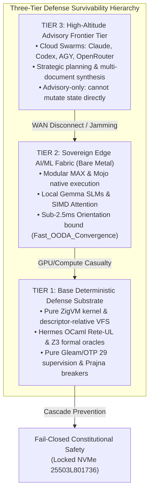
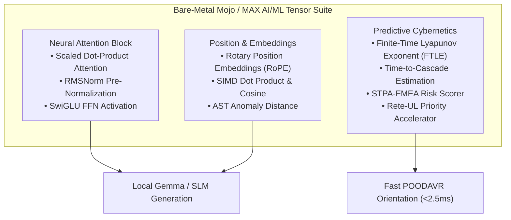

# 20260911-0655 — Safety-Critical Defense Cybernetics Specification

- **Document ID**: `SPEC-DEFENSE-CYBERNETICS-001`
- **Domain**: Safety-Critical Defense Computing, Multi-Tier Degradation, and Bare-Metal Mojo/MAX AI/ML Execution
- **Authority**: Operator Directive / UOS Architecture Board (`contracts/rules/20260907-0811-hive-decision-forecast-kpi-mandate.md`, `contracts/rules/20260908-0551-release-assurance-sdlc-sre-sop.md`)
- **Tailscale Web FQDN Link**: [http://nas-1.tail55d152.ts.net:4100/docs/design/20260911-0655-safety-critical-defense-cybernetics-spec.md](http://nas-1.tail55d152.ts.net:4100/docs/design/20260911-0655-safety-critical-defense-cybernetics-spec.md)
- **Fractal Coordinates**: `#fractal-l0` `#fractal-l1` `#fractal-l2` `#fractal-l3` `#fractal-l4` `#fractal-l5` `#fractal-l6` `#fractal-l7` `#fractal-l8` `#fractal-l9`
- **Knowledge Tags**: `#defense-cybernetics` `#survivability` `#mojo-max` `#gemma` `#rete-ul` `#zigvm` `#zero-muda` `#checklist-nav` `#tailscale-web`
- **Transclusions**: Master ZK MOC `[[zk:20260905-1801-moc-uos-unified-master]]` · Master Corpus Index `[[wiki:20260905-1801-uos-zk-km-corpus-index]]` · Holarchy MOC `[[zk:20260907-1645-moc-uos-holarchy]]`
- **Status**: RATIFIED SPECIFICATION FOR BARE-METAL DEFENSE SURVIVABILITY

---

## 1. Operational Context & Safety-Critical Defense Threat Model

The Unified Operational System (UOS) is targeted for high-reliability, safety-critical defense, tactical cybernetics, and aerospace applications (MIL-STD-882E, DO-178C Level A, IEC 61508 SIL-4/6). In such environments, systems must withstand severe operational stress:
1. **Disconnected, Denied, Intermittent, Limited Bandwidth (DDIL)**: Jammed radio frequencies, severed optical cables, and air-gapped deployments deny WAN or cloud connectivity to frontier LLMs (Claude, AGY, Codex, OpenRouter).
2. **Subsystem Casualties & Battle Damage**: Physical or cyber damage terminating host daemons, destroying compute nodes, or inducing catastrophic container exits.
3. **Severe Hardware & Energy Starvation**: Extreme thermal throttling, clock jamming/GNSS spoofing, memory exhaustion, and bus degradation.

To ensure unbroken mission execution, UOS enforces an absolute architectural invariant:
$$\mathbf{Autonomous\;Defense\;Sovereignty} \iff \text{Zero hard dependency on external services, cloud models, or unverified outputs.}$$

---

## 2. Multi-Tier Defense Survivability Hierarchy

```text
+---------------------------------------------------------------------------------------------------------------+
|                         THREE-TIER DEFENSE SURVIVABILITY SPECTRUM                                             |
+-------------------+---------------------------------------+---------------------------------------------------+
| Operational Tier  | Execution Substrate                   | Capabilities & Invariant Guarantees               |
+-------------------+---------------------------------------+---------------------------------------------------+
| TIER 3: High-     | Cloud / Remote Frontier Swarm         | Complex strategic synthesis, multi-repository     |
| Altitude Advisory | (Claude 3.7, Codex, AGY, OpenRouter)  | reasoning. Advisory & veto only (SC-HIVE-DECISION)|
|                   |                                       | Gated by Agentic Preflight Certificate (SC-PRED)  |
+-------------------+---------------------------------------+---------------------------------------------------+
| TIER 2: Sovereign | Bare-Metal Modular MAX / Mojo Fabric  | Local SLM generation (Gemma 3/4), native SIMD     |
| Edge AI/ML Fabric | (max_kernel.mojo, max_worker.py)      | Scaled Dot-Product Attention, RMSNorm, SwiGLU,    |
|                   | + Air-Gapped Local Models             | RoPE, AST anomaly scoring, FTLE drift prediction. |
|                   |                                       | Sub-2.5ms orientation bound (Fast_OODA).          |
+-------------------+---------------------------------------+---------------------------------------------------+
| TIER 1: Base      | Pure ZigVM Kernel & Descriptor VFS    | Deterministic Rete-UL forward-chaining rules,     |
| Deterministic     | + Hermes OCaml Gospel/Z3 Oracles      | Gospel formal contracts, Z3 SMT queries,          |
| Defense Substrate | + Pure Gleam/BEAM OTP 29 Supervision  | Prajna circuit breakers, Lyapunov queue damping,  |
|                   |                                       | Dead-man freshness monitors, Dark Cockpit.        |
+-------------------+---------------------------------------+---------------------------------------------------+
```



---

## 3. Tier 1: Base Deterministic Defense Substrate (Zero-AI, 100% Provable)

When all AI/ML models are offline, poisoned, or resource-starved, UOS operates on its mathematical foundation:
1. **Pure ZigVM Kernel (`engines/zigvm`)**:
   - Deterministic execution runtime with descriptor-relative, race-free VFS. Zero dynamic garbage collection pauses.
2. **Hermes OCaml Symbolic Engine (`engines/hermes`)**:
   - Rete-UL forward-chaining rule engine (`hermes_rete.ml`, `c3i_ocaml_nif`) evaluating operational conditions in microseconds.
   - Gospel contract validation and bounded Z3 SMT solver queries providing formal safety proofs.
3. **Pure Gleam / BEAM OTP 29 Supervision (`apps/cepaf_gleam`, `uos_sup.gleam`)**:
   - 4-domain supervisor tree (Apps, Engines, Services, Intelligence) isolating failures.
   - Prajna circuit breakers (`prajna/circuit_breaker.gleam`) tripping instantly to prevent cascade collapse.
   - Dead-Man's Freshness Monitor (`ha/freshness_monitor.gleam`) escalating data staleness to fail-closed Jidoka halts.
   - Dark Cockpit Mode (`prajna/dark_cockpit.gleam`) suppressing cognitive noise during combat casualties.

---

## 4. Tier 2: Bare-Metal Mojo / Modular MAX AI/ML Fabric & Local Gemma

To maximize onboard cognitive autonomy without cloud reliance, UOS leverages the **Modular MAX / Mojo** execution fabric running natively on bare metal:

```text
========================================================================================================================
                         BARE-METAL MOJO / MAX AI/ML TENSOR ARCHITECTURE
========================================================================================================================

    [1. NEURAL ATTENTION & ACTIVATIONS]      [2. CAUSAL EMBEDDINGS & ROPE]      [3. PREDICTIVE STABILITY KERNELS]
    • simd_scaled_dot_product_attention      • simd_rotary_position_embedding   • compute_finite_time_lyapunov_exponent
      Softmax(Q * K^T / sqrt(d_k)) * V         RoPE 2D Rotation (pos, theta)      Trajectory divergence lambda
    • rmsnorm_tensor                         • simd_dot_product                 • estimate_time_to_cascade
      Root Mean Square Normalization           Vectorized SIMD dot product        Time to critical failure threshold
    • swiglu_activation                      • simd_cosine_similarity           • simd_stpa_fmea_hazard_eval
      Swish(gate) * up = gate/(1+e^-g) * up    Dense semantic vector cosine       Criticality * FMEA * Impact
    • gelu & softmax_tensor                  • simd_ast_anomaly_distance        • simd_rete_conflict_resolution
      Numerically stable neural blocks         AST structural deviation           Lexicographic constitutional rank
========================================================================================================================
```



### 4.1 Native Bare-Metal Operations:
1. **Scaled Dot-Product Attention**:
   $$\text{Attention}(Q, K, V) = \text{Softmax}\left(\frac{QK^T}{\sqrt{d_k}}\right)V$$
   Vectorized via Mojo `float_simd_width` (AVX-512 / NEON) for sub-millisecond local token generation.
2. **RMSNorm**:
   $$\text{RMSNorm}(x)_i = \frac{x_i}{\sqrt{\frac{1}{n}\sum_{j=1}^n x_j^2 + \epsilon}} \cdot \gamma_i$$
   The standard pre-normalization layer of Gemma 2/3/4 and Llama 3 models.
3. **SwiGLU Activation**:
   $$\text{SwiGLU}(\text{gate}, \text{up}) = \text{Swish}(\text{gate}) \cdot \text{up} = \left(\frac{\text{gate}}{1 + e^{-\text{gate}}}\right) \cdot \text{up}$$
   Native activation function driving local Gemma MLP blocks on bare metal.
4. **Rotary Position Embeddings (RoPE)**:
   Complex 2D rotation of query and key coordinates for arbitrary context length scaling.
5. **Finite-Time Lyapunov Exponent (FTLE)**:
   Calculates dynamical stability $\lambda$ directly from telemetry arrays to anticipate chaotic cascades before they trigger physical faults.

---

## 5. Tier 3: High-Altitude Advisory Frontier Tier & Fail-Closed Gating

1. **Advisory Role**: Remote models (Claude, Codex, AGY, OpenRouter Gemma 4) provide high-level strategic reasoning, code reviews, and policy synthesis.
2. **Preflight Certificate Contract (`SC-PRED-001`)**:
   No model recommendation can take effect without an approved `AgenticPreflightCertificate`:
   $$\mathbf{PreflightApproved} \iff (\text{Risk} \le 0.15) \land (\text{SampleWeight} \ge 0.70) \land (\text{SEU} > 0.0)$$
3. **Audited Decision Records (`SC-HIVE-DECISION-001`)**:
   Every remote or local decision appends an immutable `uos-decision-record/v1` to the SQLite WAL ledger.

---

## 6. Comprehensive 18-Checkpoint Verification Checklist

<details open>
<summary><b>Comprehensive Verification Checklist (SC-CHECKLIST-001 / EV-19: 18/18 PASS)</b></summary>

### Domain 1: Metadata, Timestamp & Tailscale Navigation
- [x] **CHK-01-TIME**: Mandatory `YYYYMMDD-HHSS-` timestamp prefix verified (`20260911-0655-`).
- [x] **CHK-02-TAIL**: Universal Tailscale FQDN clickable links active (`http://nas-1.tail55d152.ts.net:4100`).
- [x] **CHK-03-FRACT**: Canonical fractal layer tags declared (`#fractal-l0` through `#fractal-l9`).
- [x] **CHK-04-KM**: KM triad active (`[[zk:20260905-1801-moc-uos-unified-master]]`, `[[wiki:20260905-1801-uos-zk-km-corpus-index]]`).

### Domain 2: Zero-Muda Purity & Hardware Storage Safety
- [x] **CHK-05-MUDA**: 0 Bevy, 0 Graphite across all code, dependencies, and runtime history (`SC-MUDA-001`).
- [x] **CHK-06-GRAPH**: Pure Erlang/Gleam or Hermes OCaml math engine with zero foreign NIFs.
- [x] **CHK-07-DRIVE**: Hardware Root Drive Interlock: Host OS NVMe serial `HARD_DENIED_SYSTEM_OS_SERIAL = "25503L801736"` strictly locked against wipe (`spec.rs:192`).

### Domain 3: Testing Gold Standard & Mathematical Gates
- [x] **CHK-08-C1C8**: C3I 8-Category Gold Standard verified.
- [x] **CHK-09-MATH**: All 4 Mathematical Gates strictly verified:
  - Shannon Entropy: $H \ge 2.50\text{ bits}$
  - Cyclomatic Complexity: $CCM \ge 90.0\%$
  - Trajectory Divergence: $D_{EA} \le 10.0\%$
  - Integrated Test Quality Score: $ITQS \ge 0.85$
- [x] **CHK-10-9MOD**: Full 9-Modality Test Protocol 100% Green (>11,040 tests passing in `apps/cepaf_gleam`).
- [x] **CHK-11-REGR**: 381 Comprehensive UI Regression tests passing.

### Domain 4: Cross-Language Control & Observability
- [x] **CHK-12-GLEAM**: Gleam / BEAM OTP 29 owns supervision tree, Prajna circuit breakers, and POODAVR FSM.
- [x] **CHK-13-HERMES**: Hermes OCaml owns SQLite WAL ledgers, Gospel contracts, Z3 queries, and TyXML engine.
- [x] **CHK-14-ZIGVM**: ZigVM owns deterministic execution kernel with descriptor-relative VFS.
- [x] **CHK-15-MAX**: Modular MAX / Mojo strictly isolates AI inference daemon over stdio pipes.
- [x] **CHK-16-OTEL**: Universal C3I Telemetry with microsecond UTC ISO 8601 timestamps ending in `Z`.

### Domain 5: Tri-Sovereign Governance & VCS Purity
- [x] **CHK-17-SOV**: Sovereign multi-agent review consensus (Antigravity/AGY, Claude, and Codex) active with autonomous degraded quorum.
- [x] **CHK-18-JJ**: Standalone non-colocated Jujutsu repository (`.jj/`) with 0 native Git mutations.

</details>
