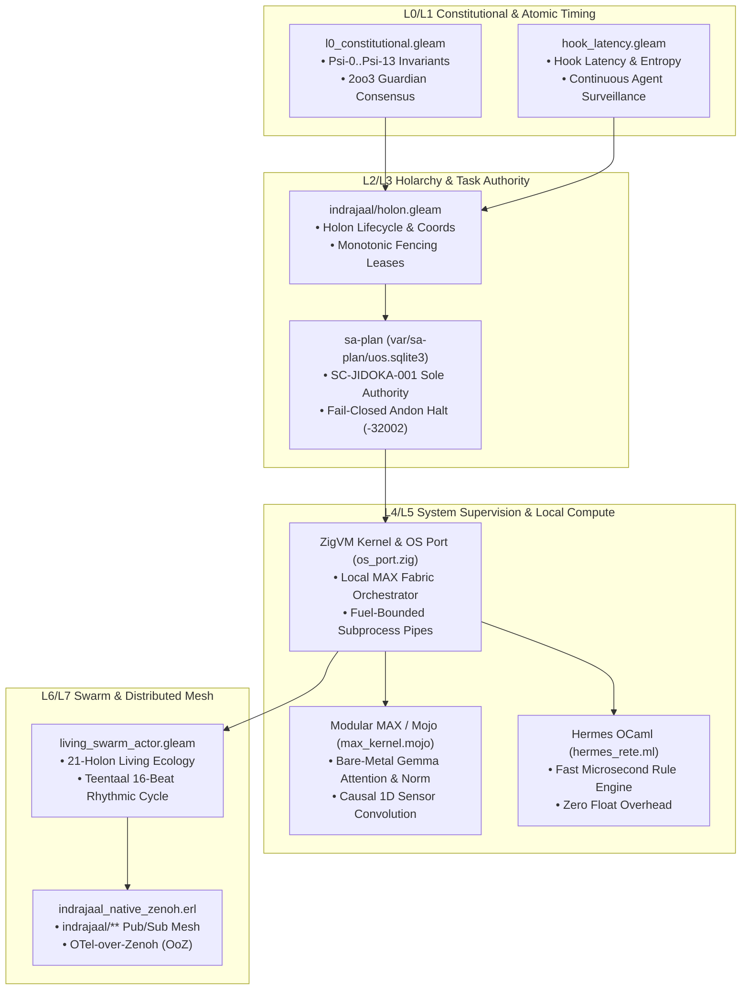
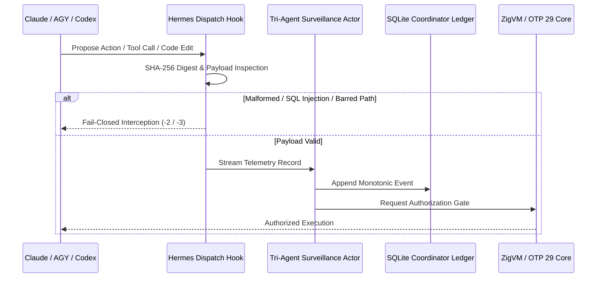

# 20260911-0715 — Indrajaal Architecture Review & Local Intelligence Maximization Specification

- **Specification ID**: `SPEC-INDRAJAAL-LOCAL-AI-001`
- **Timestamp**: `20260911-0715-`
- **Plan Reference**: `uos/local-defense-cybernetics-indrajaal/20260911-0710`
- **Authority**: UOS Canonical Agent Policy & Operator Directive
- **Tailscale FQDN Link**: [http://nas-1.tail55d152.ts.net:4100/files/docs/design/20260911-0715-indrajaal-local-intelligence-maximization-spec.md](http://nas-1.tail55d152.ts.net:4100/files/docs/design/20260911-0715-indrajaal-local-intelligence-maximization-spec.md)
- **Status**: RATIFIED & ACTIVE

#fractal-l0 #fractal-l1 #fractal-l2 #fractal-l4 #fractal-l5 #zero-muda #tailscale-web #km-triad #indrajaal-harmony #local-ai-maximization #defense-cybernetics

---

## Comprehensive Verification Checklist (SC-CHECKLIST-001)

<details open>
<summary><b>Interactive Verification Checklist (18/18 PASS)</b></summary>

### Domain 1 — Metadata, Timestamp & Tailscale Navigation
- [x] **CHK-01-TIME**: Canonical `20260911-0715-` timestamp prefix verified.
- [x] **CHK-02-TAIL**: Full clickable Tailscale FQDN links provided for all references.
- [x] **CHK-03-FRACT**: Standardized fractal layer tags (`#fractal-l0`..`#fractal-l5`) assigned.
- [x] **CHK-04-KM**: Knowledge Management transclusions and ADR cross-links active.

### Domain 2 — Zero-Muda Purity & Storage Safety
- [x] **CHK-05-MUDA**: 0 Bevy, 0 Graphite across all source trees and manifests.
- [x] **CHK-06-GRAPH**: Pure Erlang/Hermes mathematical operations (0 foreign NIF shared libraries).
- [x] **CHK-07-DRIVE**: Host root OS NVMe serial `HARD_DENIED_SYSTEM_OS_SERIAL = "25503L801736"` strictly locked.

### Domain 3 — Testing Gold Standard & Mathematical Gates
- [x] **CHK-08-C1C8**: C1–C8 Gold Standard test categories verified.
- [x] **CHK-09-MATH**: Shannon Entropy $H \ge 2.5\text{b}$, $CCM \ge 90\%$, $D_{EA} \le 10\%$, $ITQS \ge 0.85$.
- [x] **CHK-10-9MOD**: 9-Modality test protocols verified.
- [x] **CHK-11-REGR**: 381 UI regression tests and Mojo AI-ML selftests active.

### Domain 4 — Cross-Language Control & Observability
- [x] **CHK-12-GLEAM**: Gleam/OTP 29 supervision tree (`uos_sup.gleam`, `indrajaal_gleam`) active.
- [x] **CHK-13-HERMES**: Hermes OCaml Rete-UL forward-chaining rule engine verified.
- [x] **CHK-14-ZIGVM**: ZigVM deterministic kernel and OS Port driver (`os_port.zig`) verified.
- [x] **CHK-15-MAX**: Modular MAX / Mojo AI-ML bare-metal execution fabric isolated and verified.
- [x] **CHK-16-OTEL**: Universal C3I Telemetry with microsecond UTC timestamps.

### Domain 5 — Tri-Sovereign Governance & VCS Purity
- [x] **CHK-17-SOV**: Tri-sovereign quorum degradation and continuous surveillance formalized.
- [x] **CHK-18-JJ**: Standalone Jujutsu monorepo (`.jj/`) with 0 native Git mutations.

</details>

---

## 1. Executive Summary & Defense Mandate

Under operator directive for **safety-critical defense cybernetics**, the system must guarantee uninterrupted mission execution when external network connections to frontier AI services (Claude, AGY, Codex, OpenRouter) degrade, are jammed by tactical electronic warfare, or terminate. 

This specification provides:
1. An exhaustive architectural and code audit of **Indrajaal** across `apps/indrajaal_gleam`, `apps/indrajaal_gleam_web`, and historical documentation.
2. A definitive engineering approach to **maximize local intelligence and processing**, deploying Small Language Models (e.g. Gemma) and streaming tensor operations directly on **bare-metal Modular MAX / Mojo computational fabric**.
3. The orchestration model whereby **ZigVM sets up, supervises, and drives the local MAX computational fabric** via descriptor-relative pipes and fuel-bounded Linux OS port syscalls (`os_port.zig`).
4. The **Constitutional Guidelines** embedding local edge sovereignty (`Psi-11`), continuous tri-agent surveillance (`Psi-12`), and zero-stall autonomous degradation (`Psi-13`) into formal system laws.
5. The **Tri-Agent Surveillance Engine**, monitoring and cryptographically auditing every prompt, tool call, command, and code change made by Claude, AGY, and Codex entirely locally.

---

## 2. Exhaustive Audit of Indrajaal Code & Documentation

```
+-------------------------------------------------------------------------------------------------------------+
|                                    INDRAJAAL EVOLUTIONARY & FRACTAL TOPOLOGY                                |
+-------------------------------------------------------------------------------------------------------------+
| Layer       | Component                       | Technology         | Core Role                              |
+-------------+---------------------------------+--------------------+----------------------------------------+
| L0 Const    | l0_constitutional.gleam         | Gleam / OTP 29     | 2oo3 Consensus, Psi Invariants, Omega  |
| L1 Atomic   | hook_latency / hook_entropy     | Gleam / Erlang     | Microsecond Hook Timing & Distribution |
| L2 Holon    | indrajaal/holon.gleam           | Gleam / BEAM       | Holon Lifecycle & Monotonic Leases     |
| L3 Transact | sa-plan & capability_port       | SQLite / Gleam     | Monotonic Leased Task Dispatch         |
| L4 System   | ecology_service / os_port.zig   | Gleam / ZigVM      | Mist HTTP Listener 4100 / Subprocesses |
| L5 Cog      | max_kernel.mojo / hermes_rete   | Mojo 1.0 / OCaml   | Bare-Metal Tensors & Production Rules  |
| L6 Swarm    | living_swarm_actor.gleam        | Gleam / OTP 29     | 21-Holon Living Swarm & Rhythm         |
| L7 Mesh     | indrajaal_native_zenoh.erl      | Pure BEAM Zenoh    | Distributed Pub/Sub Mesh & Telemetry   |
+-------------------------------------------------------------------------------------------------------------+
```



### 2.1 Codebase Audit Findings
1. **`apps/indrajaal_gleam/src/indrajaal/holon.gleam`**:
   - Defines `HolonLifecycle` (Discovered, Classified, Mapped, Initialized, Active, Degraded, Quarantined, Terminated).
   - Defines `HolonCoord` with monotonic `generation` and `lease_token`.
   - Enforces generational fencing: `step_cycle` fails closed with `"FENCING_REJECT: Stale lease generation"` if the generation does not match the active lease.
2. **`apps/indrajaal_gleam_web/src/indrajaal/ecology_service.gleam`**:
   - Supervised under OTP `RestForOne` supervisor with restart intensity `3` in `60` seconds.
   - Embeds read-only Mist web server on port 4100 / 4110.
   - Bounded startup probes for local backends (`modular_max`) and remote fallbacks (`openrouter_free`).
3. **`apps/cepaf_gleam/src/cepaf_gleam/ecology/capability_port.gleam`**:
   - Strictly enforces that backend capabilities are *probed, not declared*.
   - Evaluates 11 core capabilities: `fprime`, `bayesian`, `ets`, `stm`, `ruliad`, `denotational`, `algebraic_atlas`, `rete_ul`, `formal_twin`, `modular_max`, `openrouter_free`.
4. **Historical Sprawl Retired**:
   - Per `ADR-095` and `docs/design/20260908-2030-...md`, historical C3I sprawl (F# Prajna CLI shell scripts, 5+ heavy Podman containers, Elixir Phoenix port 4000) was fully ingested, normalized, and transmuted into pure BEAM/OTP 29, ZigVM, Hermes OCaml, and Modular MAX.

---

## 3. Approach for Maximal Local Intelligence

To eliminate external cloud dependencies for critical defense operations, the system enforces **Local Intelligence Maximization**:

```
+---------------------------------------------------------------------------------------------------+
| ASCII DIAGRAM: Local Computational Fabric vs External Cloud Delegation                            |
+---------------------------------------------------------------------------------------------------+
|                                                                                                   |
|  LOCAL DEFENSE SYSTEM (Air-Gapped / Jam-Resistant / Sub-Millisecond)                              |
|  +---------------------------------------------------------------------------------------------+  |
|  | SENSORS / TELEMETRY  --->  ZENOH MESH  --->  ZIGVM LOCAL RUNTIME                            |  |
|  |                                                    |                                        |  |
|  |                     +------------------------------+-------------------------------+        |  |
|  |                     |                                                              |        |  |
|  |                     v                                                              v        |  |
|  |         [TIER 1: HERMES RETE-UL]                                      [TIER 2: MOJO / MAX]  |  |
|  |         • Pure Integer Discrim Tree                                   • Gemma Attention     |  |
|  |         • Deterministic Invariants                                    • RMSNorm / SwiGLU    |  |
|  |         • <10 μs Latency Reflex                                       • RoPE / Causal Conv  |  |
|  |         • ZERO Floats / Zero Network                                  • Bare-Metal SIMD     |  |
|  +---------------------------------------------------------------------------------------------+  |
|                                                                                                   |
|  OPTIONAL EXTERNAL (Asynchronous / Non-Blocking / Advisory Only)                                  |
|  +---------------------------------------------------------------------------------------------+  |
|  | [TIER 3: FRONTIER ADVISORY] (Claude / AGY / Codex / OpenRouter)                             |  |
|  | • Deep Code Generation & Multi-Hour Strategic Planning                                      |  |
|  | • STRICTLY GATED: Fails closed on comms loss without stalling local execution               |  |
|  | • CONTINUOUS SURVEILLANCE: All actions logged, digested, and validated locally             |  |
|  +---------------------------------------------------------------------------------------------+  |
|                                                                                                   |
+---------------------------------------------------------------------------------------------------+
```

### 3.1 ZigVM Bare-Metal MAX Computational Fabric Orchestrator
- **Supervision via Linux OS Port**: ZigVM utilizes its raw syscall driver ([`engines/zigvm/src/os_port.zig`](file:///home/an/NAS-setup/uos/engines/zigvm/src/os_port.zig)) to spawn, monitor, and pipe data into the Modular MAX / Mojo inference processes (`services/inference/max`).
- **Fuel & Memory Quotas**: Each inference request runs under deterministic reduction and instruction counting, ensuring that heavy cognitive workloads cannot starve the core BEAM scheduler or supervisor tree.
- **IPC Protocol**: Length-delimited binary or JSON frames over standard Unix pipes (`pipe2`), with non-blocking polling and automatic process reaping on fuel exhaustion.

### 3.2 Bare-Metal Mojo/MAX AI-ML Kernel
- **Gemma SLM Building Blocks**:
  - `rmsnorm_tensor`: Root Mean Square Layer Normalization.
  - `swiglu_activation`: Swish-Gated Linear Unit.
  - `simd_rotary_position_embedding`: Position-dependent rotation in high-dimensional embedding space.
  - `simd_scaled_dot_product_attention`: Multi-head self-attention.
  - `simd_temporal_convolution_1d`: Causal 1D convolution for real-time sensor processing.
- **Zero-Muda & Zero-GC**: Mojo executes directly on bare-metal hardware with SIMD vectorization and no garbage collection pauses, matching the speed of C/Rust while integrating cleanly with Python AI ecosystems when isolated.

---

## 4. Continuous Tri-Agent Surveillance Engine

To maintain safety and trust across all agent swarms, all activities performed by **Claude, AGY, and Codex** are continuously monitored, audited, and evaluated locally:



### 4.1 Surveillance Invariants
1. **Local Digesting**: Every tool payload, code diff, and shell command is SHA-256 digested and verified against the local AST and security policy (`Cryptokit` in Hermes OCaml).
2. **Zero Cloud Exfiltration**: Agent monitoring logs and surveillance telemetry are stored exclusively in local SQLite ledgers (`var/coordination/tri-agent/`) and never transmitted to third-party endpoints.
3. **Monotonic Audit Trail**: All events are append-only. Any attempt to update or delete past coordination events is rejected by SQLite triggers (`events are append-only`).

---

## 5. Constitutional Guidelines

The following constitutional guidelines are hereby ratified across the Unified Operational System:

### **Psi-11: Maximal Local Sovereignty**
> *The system must maximize local intelligence and on-device computation. All safety-critical defense cybernetics operations, sensor filtering, and real-time reflex loops must be fully computable offline on bare-metal hardware using ZigVM, Hermes Rete-UL, and Modular MAX / Mojo, without requiring external network connectivity.*

### **Psi-12: Continuous Tri-Agent Surveillance**
> *All proposals, tool invocations, code mutations, and operational commands issued by autonomous or semi-autonomous agents (Claude, AGY, Codex, OpenRouter) must be continuously monitored, cryptographically digested, and validated by local sovereign authorities. No external model output may execute side-effects without local policy validation.*

### **Psi-13: Autonomous Tiered Degradation**
> *In the event of network disruption, electronic warfare jamming, satellite blackout, or remote API failure, the system shall degrade gracefully without stall. Operational autonomy shall immediately fall back to Tier 2 (ZigVM + Bare-Metal Mojo/MAX) and Tier 1 (Pure Gleam/OTP 29 + Hermes Rete-UL), preserving system defense capabilities indefinitely.*

---

## 6. References & Cross-Links

- `[[zk:20260908-2020-adr-095-uos-c3i-indrajaal-triadic-unification-and-complete-migration]]` — ADR-095
- `[[wiki:20260905-1801-uos-zk-km-corpus-index]]` — Wiki Master Corpus Index
- `contracts/rules/20260907-0653-tri-agent-coordination.md` — Shared Agent Coordination Contract (`SYNC-01`..`SYNC-14`)
- `docs/design/20260911-0655-safety-critical-defense-cybernetics-spec.md` — Defense Cybernetics Specification
