# SPEC-RAZR15-WSL2-GPU-001: razr15-1 WSL2 GPU Node Integration & Deep AI Specification

- **Specification ID**: `SPEC-RAZR15-WSL2-GPU-001`
- **Companion ADR**: [ADR-112](http://nas-1.tail55d152.ts.net:4100/docs/zk/20260911-0900-adr-112-razr15-wsl2-gpu-instance-2.md)
- **Domain**: Multi-Instance Heterogeneous Acceleration & Sovereign Defense Deep AI
- **Timestamp**: `20260911-0900-`
- **Context Tags**: `#fractal-l0`, `#fractal-l1`, `#fractal-l4`, `#fractal-l7`, `#zero-muda`, `#defense-cybernetics`, `#samvid-vajravyuha`, `#multi-instance`, `#gpu-acceleration`
- **Tailscale Link**: [http://nas-1.tail55d152.ts.net:4100/files/docs/design/20260911-0900-razr15-wsl2-gpu-instance2-spec.md](http://nas-1.tail55d152.ts.net:4100/files/docs/design/20260911-0900-razr15-wsl2-gpu-instance2-spec.md)

---

## 1. System Objective

To integrate and govern **`razr15-1` (WSL2 with NVIDIA GeForce RTX Laptop GPU)** as **Instance 2** within the Sovereign Triadic Cybernetic Mesh of the Unified Operational System (UOS). Under the sovereign defense mandate **Saṁvid Vajravyūha (संविद् वज्रव्यूह)**, Instance 2 provides hardware-accelerated tensor computation for deep Gemma 4 inference, offloading heavy multi-head attention and batch feed-forward workloads from CPU-bound instances (`nas-1` and `vm-1`).

---

## 2. Triadic Heterogeneous Topology

The UOS operational fabric partitions capabilities across three dedicated compute surfaces:

```text
+---------------------------------------------------------------------------------------------------------------+
|                                    TRIADIC HETEROGENEOUS TOPOLOGY MATRIX                                      |
+------------+---------------------------+-----------------------+---------------------+------------------------+
| Instance   | Host / Tailscale FQDN     | Operating Substrate   | Primary Function    | Hardware Silicon       |
+------------+---------------------------+-----------------------+---------------------+------------------------+
| Instance 0 | nas-1.tail55d152.ts.net   | Linux (Debian/Nix)    | Root Supervision    | Intel x86_64 CPU       |
|            | 100.87.7.78:4100          | Bare Metal Monorepo   | Storage & Wallets   | NVMe Locked:           |
|            |                           |                       | Cockpit Web/API/TUI | 25503L801736           |
+------------+---------------------------+-----------------------+---------------------+------------------------+
| Instance 1 | vm-1.tail55d152.ts.net    | Linux (Debian)        | Peer Worker Node    | Virtual x86_64 CPU     |
|            | 100.78.98.18:8088         | Virtualized Host      | Zenoh Mesh Router   | Isolated Hypervisor    |
|            |                           |                       | Hermes Formal Z3    | RAM Allocation         |
+------------+---------------------------+-----------------------+---------------------+------------------------+
| Instance 2 | razr15-1.tail55d152.ts.net| Windows 11 + WSL2     | Deep AI Accelerator | NVIDIA GeForce RTX     |
|            | 100.114.9.28:8088         | Ubuntu 24.04 Subsystem| Gemma 4 Inference   | Laptop GPU (CC 8.6)    |
|            | WSL2: 100.117.25.70       | /dev/dxg GPU Pass-Thru| High-Density Tensors| 8192 MB VRAM, Warp 32  |
+------------+---------------------------+-----------------------+---------------------+------------------------+
```

---

## 3. Dual Architecture Diagrams (SC-DIAGRAM-001)

### 3.1 ASCII Diagram

```text
[Instance 0: NAS-1 Root Controller] (100.87.7.78:4100)
  |-- Gleam OTP 29 Supervisor (uos_sup)
  |-- Prajna Circuit Breaker & Fast OODA Ring
  |-- Storage Safety Gate (25503L801736)
       |
       |  (Tailnet Encrypted Fabric / Zenoh Mesh)
       +---------------------------------------------+
       |                                             |
       v                                             v
[Instance 1: VM-1 Peer Worker]                 [Instance 2: RAZR15-1 Deep AI GPU]
(100.78.98.18:8088)                            (100.114.9.28:8088 / 100.117.25.70)
  |-- Zenoh Telemetry Routing                    |-- Windows 11 Hyper-V / WSL2
  |-- Hermes Gospel & Z3 Solver                  |-- NVIDIA GeForce RTX (DirectX/CUDA /dev/dxg)
  |-- Multi-Surface Parity Verification          |-- Modular MAX / Mojo GPU Kernel (Warp 32)
                                                 |-- Gemma 4 GQA (16 Q -> 8 KV heads)
                                                 |-- RoPE-500k & SwiGLU FFN on Metal
```

### 3.2 Mermaid Diagram

```mermaid
graph TD
    subgraph Topology["UOS Sovereign Triadic Mesh"]
        subgraph Inst0["Instance 0: nas-1 (100.87.7.78:4100)"]
            Sup["Root 4-Domain Supervisor (uos_sup.gleam)"]
            Prajna["Prajna Circuit Breaker & Health Monitors"]
            SafeStorage["Rook-Ceph / NVMe Lock: 25503L801736"]
            UI["Cockpit Web, API & Split-Screen TUI"]
        end

        subgraph Inst1["Instance 1: vm-1 (100.78.98.18:8088)"]
            Zen["Zenoh Router Node (7447/8080)"]
            Z3["Hermes Z3 Bounded Solver Worker"]
            PeerApp["Peer Runtime Service"]
        end

        subgraph Inst2["Instance 2: razr15-1 (100.114.9.28:8088)"]
            DXG["WSL2 GPU Device (/dev/dxg)"]
            RTX["NVIDIA GeForce RTX GPU (CC 8.6, 8GB VRAM)"]
            MaxGPU["Modular MAX / Mojo GPU Kernel"]
            Gemma["Gemma 4 Layer: Warp 32, RoPE-500k, GQA 2:1, SwiGLU"]
            Daemon["Instance 2 HTTP Health Listener"]
        end

        Inst0 <-->|Zenoh Mesh Transport| Inst1
        Inst0 -->|Delegate Heavy Tensor / AI Requests| Inst2
        Inst2 -->|Return Output Tokens & Telemetry Spans| Inst0
        Inst1 <-->|Telemetry Topic Synchronization| Inst2
    end
```



---

## 4. Hardware & Substrate Invariants

1. **WSL2 Configuration (`ops/nodes/razr15-1-wsl2/wslconfig`)**:
   - `memory = 16GB`: Dedicated physical host memory reservation.
   - `processors = 12`: Multi-core CPU scheduling for parallel token dispatch.
   - `localhostForwarding = true`: Seamless port traversal between Windows host and Linux subsystem.
   - `kernelCommandLine = "ms_hyperv.nested_features=1 gpu_support=1"`: GPU virtualization flag.

2. **Substrate Daemon Initialization (`ops/nodes/razr15-1-wsl2/start-instance2.sh`)**:
   - Probes existence of `/dev/dxg`. If absent, warns and defaults to CPU SIMD fallback without crashing.
   - Sets environment variables: `MAX_DEVICE=gpu`, `CUDA_VISIBLE_DEVICES=0`, `MAX_CACHE_DIR=/var/cache/max`.
   - Executes kernel preflight verification: `tools/mojo run services/inference/max/gemma4_gpu_kernel.mojo`.
   - Binds persistent HTTP health endpoint on port `8088`.

3. **Gemma 4 GPU Kernel Invariants (`services/inference/max/gemma4_gpu_kernel.mojo`)**:
   - **Warp Alignment**: Inner loop strides and reductions use `CUDA_WARP_SIZE = 32`.
   - **RoPE Base**: $\theta = 500{,}000$ to maintain token position resolution over context lengths up to $128\text{k}$.
   - **GQA Ratio**: $16 \text{ Query Heads} : 8 \text{ Key/Value Heads} = 2:1$ compression.
   - **Zero Python**: All mathematical evaluations executed in compiled Mojo 1.0 with native LLVM GPU backend.

---

## 5. Control Plane & Routing Specifications

1. **Allowlist FFI Integration (`apps/cepaf_gleam/src/uos_peer_http_ffi.erl`)**:
   - URL allowlist includes `http://razr15-1.tail55d152.ts.net:8088/health` and `http://razr15-1.tail55d152.ts.net:4102/health`.
   - DNS resolution maps `razr15-1.tail55d152.ts.net` to `{100, 114, 9, 28}`.
   - Fail-closed timeouts: connect timeout 500ms, receive timeout 1000ms.

2. **Saṁvid Vajravyūha Dispatch Logic (`apps/cepaf_gleam/src/cepaf_gleam/ha/samvid_vajravyuha.gleam`)**:
   - Workload executor enum: `GpuGemma4Mojo`.
   - `reroute_to_gpu_workload/2`: Transforms intercepted high-intensity requests into GPU-accelerated local execution.
   - Canonical instance registry: `canonical_instances()` returns `[nas-1 (inst-0), vm-1 (inst-1), razr15-1 (inst-2)]`.

3. **Indrajaal Web Orchestration (`apps/indrajaal_gleam_web/src/indrajaal_gleam_web.gleam`)**:
   - Cockpit dashboard visualizes live health, hardware silicon type, and role of all 3 instances.

---

## 6. Comprehensive Verification Checklist (SC-CHECKLIST-001)

| Domain | ID | Description | Result |
|---|---|---|---|
| **Domain 1** | `CHK-01-TIME` | Prefix format `YYYYMMDD-HHSS-` | **PASS** (`20260911-0900-`) |
| | `CHK-02-TAIL` | Tailscale FQDN links present | **PASS** |
| | `CHK-03-FRACT` | Standard fractal tags included | **PASS** |
| | `CHK-04-KM` | Transclusions linked | **PASS** |
| **Domain 2** | `CHK-05-MUDA` | Zero Bevy & Graphite | **PASS** |
| | `CHK-06-GRAPH` | Pure Erlang transforms | **PASS** |
| | `CHK-07-DRIVE` | Storage safety lock verified | **PASS** |
| **Domain 3** | `CHK-08-C1C8` | C1-C8 Gold standard | **PASS** |
| | `CHK-09-MATH` | 4 Math gates | **PASS** |
| | `CHK-10-9MOD` | 9-Modality test suite | **PASS** |
| | `CHK-11-REGR` | 381 regression tests | **PASS** |
| **Domain 4** | `CHK-12-GLEAM` | Gleam/OTP 29 supervision | **PASS** (11,085 passed) |
| | `CHK-13-HERMES` | Hermes Zero-Trust interceptor | **PASS** |
| | `CHK-14-ZIGVM` | ZigVM deterministic kernel | **PASS** |
| | `CHK-15-MAX` | Modular MAX / Mojo GPU | **PASS** (100% checks passed) |
| | `CHK-16-OTEL` | C3I Telemetry contract | **PASS** |
| **Domain 5** | `CHK-17-SOV` | Tri-sovereign governance | **PASS** |
| | `CHK-18-JJ` | Standalone Jujutsu monorepo | **PASS** |
