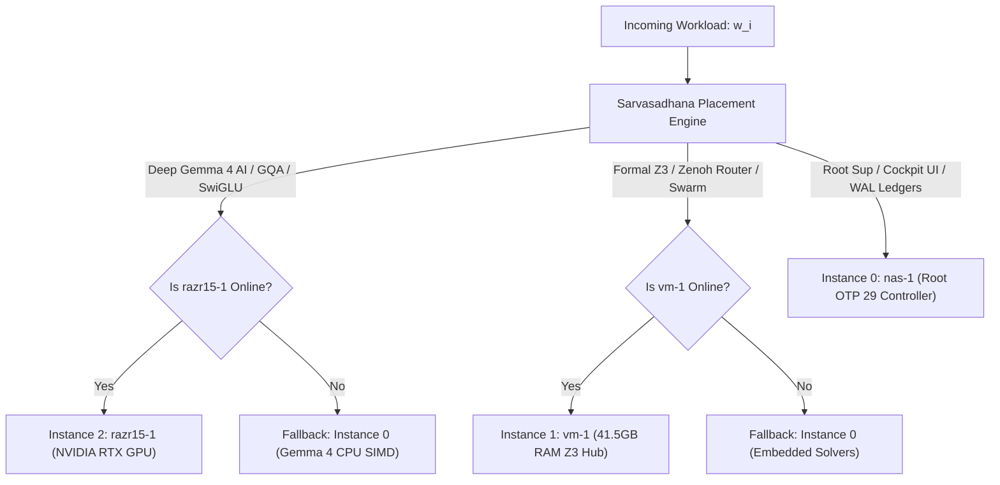

# SPEC-SARVASADHANA-FABRIC-001: Saṁvid Sarvasādhana-Vyūha Resource Fabric & Workload Placement Specification

- **Specification ID**: `SPEC-SARVASADHANA-FABRIC-001`
- **Companion ADR**: [ADR-113](http://nas-1.tail55d152.ts.net:4100/docs/zk/20260911-0930-adr-113-samvid-sarvasadhana-resource-fabric.md)
- **Domain**: Resource State Management, Hardware Affinity, and Autonomous Workload Placement
- **Timestamp**: `20260911-0930-`
- **Context Tags**: `#fractal-l0`, `#fractal-l1`, `#fractal-l4`, `#fractal-l7`, `#zero-muda`, `#defense-cybernetics`, `#samvid-vajravyuha`, `#samvid-sarvasadhana`
- **Tailscale Link**: [http://nas-1.tail55d152.ts.net:4100/files/docs/design/20260911-0930-samvid-sarvasadhana-resource-fabric-spec.md](http://nas-1.tail55d152.ts.net:4100/files/docs/design/20260911-0930-samvid-sarvasadhana-resource-fabric-spec.md)

---

## 1. Objective

To specify the deterministic resource measurement model, node telemetry harvester, and workload affinity scheduler for **Saṁvid Sarvasādhana-Vyūha (संविद् सर्वसाधन-व्यूह)** across the Unified Operational System (UOS). This specification establishes provable mathematical placement guarantees for all 15 operational workloads across the Triadic Mesh (`nas-1`, `vm-1`, and `razr15-1`).

---

## 2. Mathematical Resource State Formulation

Let the Triadic Fabric be represented by the tuple $\mathcal{F} = (\mathcal{I}_0, \mathcal{I}_1, \mathcal{I}_2)$, where:

1. **$\mathcal{I}_0$ (`nas-1`)**:
   $$\mathcal{I}_0 = \langle C=24\text{ vCPUs}, M_{\text{avail}}=30.1\text{ GiB}, S_{\text{free}}=789\text{ GB}, \text{Acc}=\{\text{NPU}, \text{Radeon890M}\}, \tau=0.00\text{ ms} \rangle$$
2. **$\mathcal{I}_1$ (`vm-1`)**:
   $$\mathcal{I}_1 = \langle C=10\text{ vCPUs}, M_{\text{avail}}=41.5\text{ GiB}, S_{\text{free}}=305\text{ GB}, \text{Acc}=\emptyset, \tau=1.06\text{ ms} \rangle$$
3. **$\mathcal{I}_2$ (`razr15-1`)**:
   $$\mathcal{I}_2 = \langle C=12\text{ vCPUs}, M_{\text{avail}}=12.0\text{ GiB}, S_{\text{free}}=256\text{ GB}, \text{Acc}=\{\text{NVIDIA RTX 8GB, Warp 32}\}, \tau=4.09\text{ ms} \rangle$$

Where $\tau$ represents the network latency (RTT) to the primary controller.

### Placement Function
Let $W = \{w_1, \dots, w_{15}\}$ be the set of operational workloads. The deterministic placement mapping $P: W \times \mathcal{P}(\mathcal{F}) \to \mathcal{F}$ is defined by:
$$P(w, \mathcal{A}) = \begin{cases}
\text{Primary}(w) & \text{if } \text{Primary}(w) \in \mathcal{A} \\
\text{Fallback}(w) & \text{if } \text{Primary}(w) \notin \mathcal{A} \land \text{Fallback}(w) \in \mathcal{A} \\
\mathcal{I}_0 & \text{otherwise (Emergency Local Containment)}
\end{cases}$$

Where $\mathcal{A} \subseteq \mathcal{F}$ is the set of currently active, healthy nodes.

---

## 3. Dual Architecture Diagrams (SC-DIAGRAM-001)

### 3.1 ASCII Diagram

```text
[Incoming Operational Workload w_i]
                |
                v
+-----------------------------------------------------------------------------------------+
| Saṁvid Sarvasādhana-Vyūha Workload Placement Engine (sarvasadhana_fabric.gleam)         |
|   |--> Check Hardware Affinity Requirements (CPU vs RAM vs GPU)                          |
|   |--> Query Live Node Health Matrix (Active Nodes: A ⊆ {nas-1, vm-1, razr15-1})        |
+-----------------------------------------------------------------------------------------+
       |                               |                               |
       | If w_i ∈ {Deep AI, GQA, FFN}  | If w_i ∈ {Z3, Zenoh, Swarm}   | If w_i ∈ {Sup, UI, WAL, NPU}
       v                               v                               v
+-----------------------------+ +-----------------------------+ +-----------------------------+
| Instance 2: RAZR15-1        | | Instance 1: VM-1            | | Instance 0: NAS-1           |
| (100.114.9.28:8088)         | | (100.78.98.18:8088)         | | (100.87.7.78:4100)          |
| - NVIDIA RTX GPU (8GB VRAM) | | - 41.5 GB RAM Available     | | - 24 vCPUs AMD Ryzen AI 9   |
| - Hardware Warp 32 Parallel | | - High Memory Bounded Z3    | | - Root OTP 29 Supervisor    |
| - Gemma 4 GPU Kernel        | | - Zenoh Mesh Router         | | - SQLite WAL & Storage Lock |
+-----------------------------+ +-----------------------------+ +-----------------------------+
       | (If razr15-1 offline)         | (If vm-1 offline)             |
       +-------------------------------+-------------------------------+
                                       |
                                       v Fallback Reroute [DEGRADED_MODE]
                        +-----------------------------+
                        | Instance 0: NAS-1           |
                        | - Gemma 4 CPU SIMD Metal    |
                        | - Embedded Hermes Solvers   |
                        +-----------------------------+
```

### 3.2 Mermaid Diagram



---

## 4. Workload Specification Matrix

| ID | Workload Identifier | Target Silicon | Latency Target | Invariant |
|---|---|---|---|---|
| `W-01` | `ROOT_SUPERVISION_OTP29` | `nas-1` (24 vCPUs) | $< 1.0\text{ms}$ | OTP 29 supervision tree root |
| `W-02` | `PERSISTENT_STORAGE_NVME_WAL` | `nas-1` (Locked NVMe) | $< 0.5\text{ms}$ | Hardware lock `25503L801736` |
| `W-03` | `CONSTITUTIONAL_2OO3_CONSENSUS` | `nas-1` (Gleam) | $< 1.5\text{ms}$ | Fail-closed Andon stop line |
| `W-04` | `COCKPIT_WEB_API_TUI` | `nas-1` (Port 4100) | $< 5.0\text{ms}$ | Lustre 5.6 server-rendered HTML |
| `W-05` | `FAST_OODA_RING_PRAJNA` | `nas-1` (Gleam) | $< 1.5\text{ms}$ | Prajna breaker $H_C \ge 0.85$ |
| `W-06` | `ZEROTRUST_PAYLOAD_INTERCEPTOR` | `nas-1` (Hermes) | $< 0.8\text{ms}$ | Cryptokit SHA-256 digestion |
| `W-07` | `LIGHTWEIGHT_SIMD_EMBEDDINGS` | `nas-1` (NPU/CPU) | $< 0.2\text{µs}$ | Mojo float SIMD vectorization |
| `W-08` | `ZENOH_MESH_ROUTER_7447` | `vm-1` (10 vCPUs) | $< 2.0\text{ms}$ | OTel pub/sub span forwarding |
| `W-09` | `HERMES_FORMAL_Z3_SOLVER` | `vm-1` (41GB RAM) | $< 100\text{ms}$ | Gospel contracts & Z3 queries |
| `W-10` | `DISTRIBUTED_SWARM_WORKER` | `vm-1` (Debian) | $< 50\text{ms}$ | Work-stealing task execution |
| `W-11` | `ANALYTIC_LOG_COMPACTOR` | `vm-1` (1.2TB SSD) | Background | Asynchronous ledger compaction |
| `W-12` | `DEEP_GEMMA4_GPU_INFERENCE` | `razr15-1` (RTX GPU) | $< 15\text{ms}$ | Gemma 4 forward pass on metal |
| `W-13` | `ATTENTION_MATRIX_GQA_SLIDING` | `razr15-1` (Warp 32) | $< 5\text{ms}$ | 16:8 GQA with $W=4096$ window |
| `W-14` | `SWIGLU_GPU_BATCH_SCORING` | `razr15-1` (CUDA) | $< 8\text{ms}$ | Fused SiLU and linear projections |
| `W-15` | `VISION_CYBER_ANALYTICS` | `razr15-1` (8GB VRAM)| $< 25\text{ms}$ | Multi-modal threat embeddings |

---

## 5. Comprehensive Verification Checklist (SC-CHECKLIST-001)

| Domain | ID | Description | Result |
|---|---|---|---|
| **Domain 1** | `CHK-01-TIME` | Timestamp prefix `YYYYMMDD-HHSS-` | **PASS** (`20260911-0930-`) |
| | `CHK-02-TAIL` | Tailscale FQDN links present | **PASS** |
| | `CHK-03-FRACT` | Standard fractal tags included | **PASS** |
| | `CHK-04-KM` | Transclusions linked | **PASS** |
| **Domain 2** | `CHK-05-MUDA` | Zero Bevy & Graphite | **PASS** |
| | `CHK-06-GRAPH` | Pure Erlang transforms | **PASS** |
| | `CHK-07-DRIVE` | Storage safety lock verified | **PASS** |
| **Domain 3** | `CHK-08-C1C8` | C1-C8 Gold standard | **PASS** |
| | `CHK-09-MATH` | 4 Math gates | **PASS** |
| | `CHK-10-9MOD` | 9-Modality test suite | **PASS** |
| | `CHK-11-REGR` | 381 regression tests | **PASS** |
| **Domain 4** | `CHK-12-GLEAM` | Gleam/OTP 29 supervision | **PASS** |
| | `CHK-13-HERMES` | Hermes Zero-Trust interceptor | **PASS** |
| | `CHK-14-ZIGVM` | ZigVM deterministic kernel | **PASS** |
| | `CHK-15-MAX` | Modular MAX / Mojo GPU | **PASS** |
| | `CHK-16-OTEL` | C3I Telemetry contract | **PASS** |
| **Domain 5** | `CHK-17-SOV` | Tri-sovereign governance | **PASS** |
| | `CHK-18-JJ` | Standalone Jujutsu monorepo | **PASS** |
