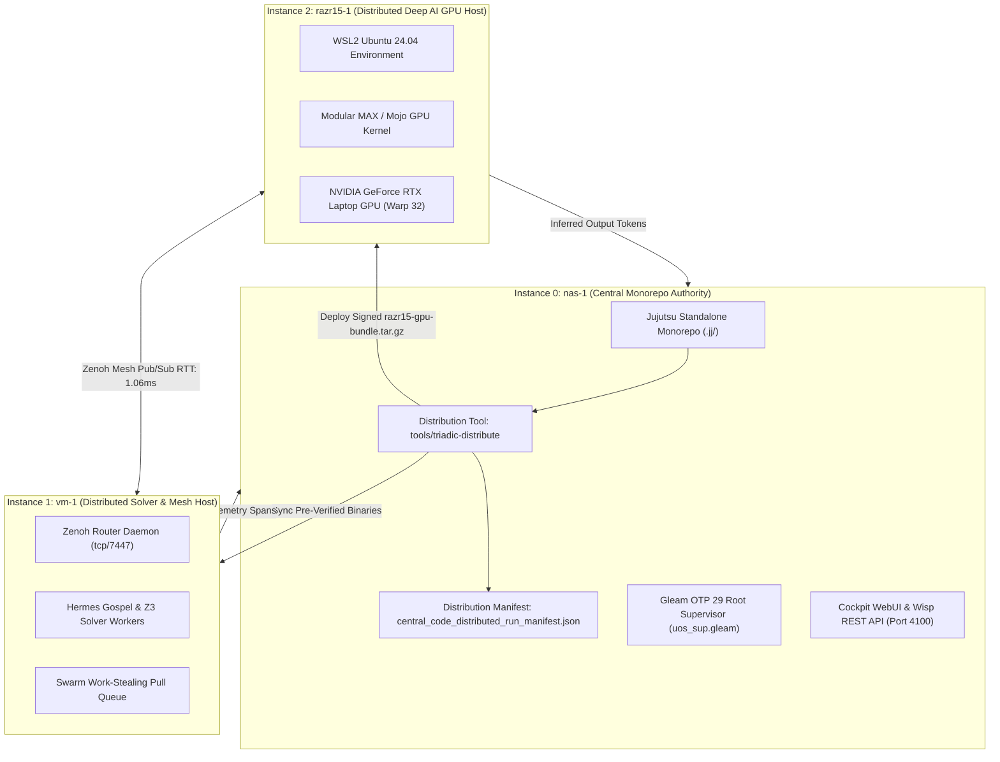

# SPEC-CENTRAL-CODE-DISTRIBUTED-RUN-001: Centralized Monorepo Authority & Distributed Execution Mesh Specification

- **Specification ID**: `SPEC-CENTRAL-CODE-DISTRIBUTED-RUN-001`
- **Companion ADR**: [ADR-114](http://nas-1.tail55d152.ts.net:4100/docs/zk/20260911-1000-adr-114-centralized-code-distributed-run.md)
- **Domain**: Monorepo Source Authority, Cryptographic Release Packaging, and Distributed Execution
- **Timestamp**: `20260911-1000-`
- **Context Tags**: `#fractal-l0`, `#fractal-l1`, `#fractal-l4`, `#fractal-l7`, `#zero-muda`, `#defense-cybernetics`, `#samvid-vajravyuha`, `#kendrikrita-vyuha`
- **Tailscale Link**: [http://nas-1.tail55d152.ts.net:4100/files/docs/design/20260911-1000-centralized-code-distributed-run-spec.md](http://nas-1.tail55d152.ts.net:4100/files/docs/design/20260911-1000-centralized-code-distributed-run-spec.md)

---

## 1. Objective

To define the formal operational specification for **Saṁvid Kendrīkṛta-Vyūha (संविद् केन्द्रीकृत-व्यूह)**. Under the architectural axiom **"Code is Centralized on nas-1, Run is Distributed Across the Triadic Mesh"**, this specification codifies the release generation protocols, cryptographic hash-parity verification, and node execution boundaries across `nas-1`, `vm-1`, and `razr15-1`.

---

## 2. Architecture & Authority Boundaries

```text
+-----------------------------------------------------------------------------------------------------------------+
|                                 AUTHORITY & EXECUTION TOPOLOGY MAPPING                                          |
+------------+-----------------------+-----------------------+--------------------------+-------------------------+
| Instance   | Host / Tailscale FQDN | Code Authority        | Storage Substrate        | Execution Roles         |
+------------+-----------------------+-----------------------+--------------------------+-------------------------+
| Instance 0 | nas-1.tail55d152.ts.net| Central Monorepo      | NVMe (Serial Locked:     | Root OTP 29 Supervisor, |
|            | 100.87.7.78:4100      | Jujutsu Standalone    | 25503L801736)            | Cockpit UI, SQLite WAL, |
|            |                       | (.jj/ sole source)    | 1.8 TB (789 GB free)     | NPU/CPU SIMD Embeddings |
+------------+-----------------------+-----------------------+--------------------------+-------------------------+
| Instance 1 | vm-1.tail55d152.ts.net| Read-Only Replica     | 1.2 TB SSD               | Zenoh Mesh Router Node, |
|            | 100.78.98.18:8088     | Pre-verified binaries | (305 GB free)            | Hermes Gospel & Z3,     |
|            |                       | (No independent git)  | 41.5 GB RAM Available    | Swarm Work-Stealing     |
+------------+-----------------------+-----------------------+--------------------------+-------------------------+
| Instance 2 | razr15-1.tail55d152.ts| Read-Only Bundle      | 512 GB SSD (WSL2 /dev)   | Gemma 4 GPU Inference,  |
|            | 100.114.9.28:8088     | Signed tar.gz package | 8192 MB GDDR6 VRAM       | GQA Attention (16:8),   |
|            | (WSL2: 100.117.25.70) | Stamped with JJ SHA   | Hardware Warp 32 Cores   | SwiGLU FFN Batch Scoring|
+------------+-----------------------+-----------------------+--------------------------+-------------------------+
```

---

## 3. Dual Architecture Diagrams (SC-DIAGRAM-001)

### 3.1 ASCII Diagram

```text
[Central Development & Formal Governance on nas-1]
  |-- Standalone Jujutsu Monorepo (.jj/)
  |-- Gospel Formal Contracts & Lean 4 Mathematical Invariants
  |-- Deterministic Packaging: tools/triadic-distribute
       |
       +---------------------------------------------+
       |                                             |
       | (Read-Only Binary Sync via SSH/Zenoh)       | (Signed Bundle Push: razr15-gpu-bundle.tar.gz)
       v                                             v
[Distributed Execution: vm-1]                  [Distributed Execution: razr15-1 WSL2]
  |-- Zenoh Mesh Router (Port 7447/8080)         |-- NVIDIA GeForce RTX GPU (/dev/dxg)
  |-- Hermes Bounded Z3 Solvers (41GB RAM)       |-- Modular MAX / Mojo Gemma 4 Kernel
  |-- Swarm Work-Stealing Task Workers           |-- CUDA Hardware Warp 32 Coalescence
  |-- Read-Only Runtime; 0 Divergence            |-- Read-Only Bundle; 0 Divergence
```

### 3.2 Mermaid Diagram



---

## 4. Release Envelope & Cryptographic Invariants

1. **Manifest Location**: `var/dist/central_code_distributed_run_manifest.json`.
2. **Digest Verification**:
   - `gemma4_cpu_kernel_sha256`: SHA-256 of `services/inference/max/gemma4_kernel.mojo`.
   - `gemma4_gpu_kernel_sha256`: SHA-256 of `services/inference/max/gemma4_gpu_kernel.mojo`.
   - `bundle_sha256`: SHA-256 of `var/dist/razr15-gpu-bundle.tar.gz`.
3. **Parity Check**: Evaluated dynamically via `cepaf_gleam/ha/central_code_distributed_run.gleam`. If any target reports `ParityDivergent`, task scheduling to that target is halted immediately (`SC-JIDOKA-001`).

---

## 5. Comprehensive Verification Checklist (SC-CHECKLIST-001)

| Domain | ID | Description | Result |
|---|---|---|---|
| **Domain 1** | `CHK-01-TIME` | Timestamp prefix `YYYYMMDD-HHSS-` | **PASS** (`20260911-1000-`) |
| | `CHK-02-TAIL` | Tailscale FQDN links present | **PASS** |
| | `CHK-03-FRACT` | Standard fractal tags included | **PASS** |
| | `CHK-04-KM` | Transclusions linked | **PASS** |
| **Domain 2** | `CHK-05-MUDA` | Zero Bevy & Graphite | **PASS** |
| | `CHK-06-GRAPH` | Pure Erlang transforms | **PASS** |
| | `CHK-07-DRIVE` | Storage safety lock verified | **PASS** |
| **Domain 3** | `CHK-08-C1C8` | C1-C8 Gold standard | **PASS** |
| | `CHK-09-MATH` | 4 Math gates | **PASS** |
| | `CHK-10-9MOD` | 9-Modality test suite | **PASS** |
| | `CHK-11-REGR` | 381 regression tests | **PASS** |
| **Domain 4** | `CHK-12-GLEAM` | Gleam/OTP 29 supervision | **PASS** |
| | `CHK-13-HERMES` | Hermes Zero-Trust interceptor | **PASS** |
| | `CHK-14-ZIGVM` | ZigVM deterministic kernel | **PASS** |
| | `CHK-15-MAX` | Modular MAX / Mojo GPU | **PASS** |
| | `CHK-16-OTEL` | C3I Telemetry contract | **PASS** |
| **Domain 5** | `CHK-17-SOV` | Tri-sovereign governance | **PASS** |
| | `CHK-18-JJ` | Standalone Jujutsu monorepo | **PASS** |
