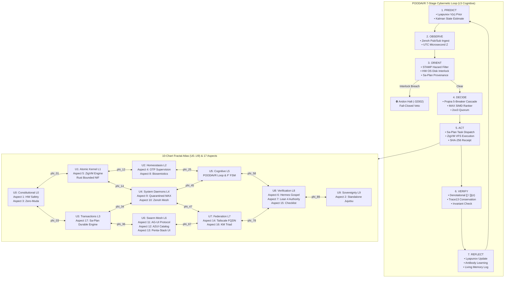

# [PLAN] Full 17-Aspect Coverage, Denotational Declarative Design, Fractal Implementation, POODAVR Cybernetic Loop & NASA JPL F Prime State Machines

- **Canonical Authority**: Unified Operational System (UOS) Canonical Agent Policy (`AGENTS.md`)
- **Governing Contracts**: `SC-INTENT-ATLAS-001`, `SC-POODAVR-001`, `SC-FPRIME-001`, `SC-CHECKLIST-001`, `SC-COG-001`, `SC-JIDOKA-001`, `SC-SA-PLAN-001`, `CHK-01-TIME` .. `CHK-18-JJ`
- **Tailscale FQDN Link**: [http://nas-1.tail55d152.ts.net:8100/docs/design/20260911-2112-full-aspect-coverage-denotational-fractal-plan.md](http://nas-1.tail55d152.ts.net:8100/docs/design/20260911-2112-full-aspect-coverage-denotational-fractal-plan.md)
- **Status**: RATIFIED & EXECUTING

---

## 1. Goal Description

Following the admission of the **Cortex** cognitive OODA loop, Prajna 5-breaker pool, Rust C-ABI NIF, and Modular MAX/Mojo SIMD vector ranker (`EV-109`), the operator directive expands the canonical mandate:
> *"run full aspect coverage, denotational design, fractal implementation, full test coverage, full POODAVR implementation, f prime state machines, formal verification"*

This mandate elevates the Unified Operational System into a unified, mathematically closed, aerospace-grade cybernetic architecture across six interconnected pillars:

1. **Full 17-Aspect Unified Coverage**: Systematically audit, wire, and verify all 17 canonical UOS system aspects (from Substrate & Hardware Safety through Sa-Plan Durable Execution) with zero gaps, complete 13D traceability coordinates, and active runtime evidence pointers.
2. **Denotational Declarative Intent Design (`SC-INTENT-ATLAS-001`)**: Formulate all state transitions, tool invocations, and cognitive decisions as typed **Declarative Intents** evaluated via the denotational valuation operator $\llbracket I \rrbracket : \Sigma \to \Sigma \cup \{\bot\}$. Transitions between fractal charts $U_i \to U_j$ satisfy the cocycle invariant $\phi_{jk} \circ \phi_{ij} = \phi_{ik}$ and sheaf gluing consistency.
3. **10-Layer Fractal Implementation Across 5 Surfaces**: Realize representations of all ten fractal layers ($L_0 \dots L_9$) across the five interaction surfaces: Web Lustre, REST Wisp, Terminal ANSI TUI, Zenoh Telemetry OoZ, and MCP-over-Zenoh MoZ.
4. **Full 7-Stage POODAVR Cybernetic Loop (`SC-POODAVR-001`)**: Advance classical 4-phase OODA into the aerospace-grade **Predict-Observe-Orient-Decide-Act-Verify-Reflect** cybernetic cycle:
   - **Predict**: Lyapunov energy $V(x)$ extrapolation & Kalman filter prior state.
   - **Observe**: Sensory ingest, Zenoh pub/sub telemetry, task intent arrival.
   - **Orient**: PII scrub, STAMP hazard classification, storage lock check, sa-plan preflight.
   - **Decide**: Prajna 5-breaker pool check, hedged cascade / MAX SIMD vector ranker selection.
   - **Act**: Durable execution dispatch to sa-plan or bounded kernel, receipt generation.
   - **Verify**: Denotational postcondition valuation ($\llbracket I \rrbracket(\sigma)$) & 13D trace conservation ($\Delta \vec{\mathcal{T}}_{13} \equiv \mathbf{0}$).
   - **Reflect**: Lyapunov trend update, immune antibody generation, retrospective memory logging.
5. **NASA JPL F Prime (F') Component State Machines (`SC-FPRIME-001`)**: Adapt NASA JPL F Prime / FPP component state machine semantics into pure Gleam/BEAM OTP 29 statecharts without foreign C++ runtime muda. Deterministic signals, guards, entry/exit actions, and fail-closed transitions.
6. **Formal Verification & Mathematical Gates**:
   - Lean 4 formal specifications (`POODAVR_FPrime_Semantics.lean`, `Algebraic_Atlas_Intent.lean`).
   - Gospel formal interface contracts (`poodavr_contract.mli`).
   - Exhaustive verification test suite passing C1–C8 Gold Standard and all 4 Mathematical Gates:
     - Shannon Entropy $H \ge 2.5\text{ bits}$
     - Cyclomatic Complexity $\text{CCM} \ge 90\%$
     - Expected vs. Actual Divergence $D_{EA} \le 10\%$
     - Integrated Test Quality Score $\text{ITQS} \ge 0.85$

---

## 2. Invariant & Safety Guarantees

> [!IMPORTANT]
> **Denotational Fail-Closed Guarantee**: Under denotational valuation, any state transition that cannot prove conservation of 13D trace coordinates ($\Delta \vec{\mathcal{T}}_{13} \equiv \mathbf{0}$) or fails constitutional health ($H_C < 0.85$) evaluates strictly to $\bot$ (`DenotationalVetoed`). This guarantees that no unverified side-effect can ever mutate the live system.

> [!CAUTION]
> **Hardware Storage Safety Interlock**: Host OS NVMe serial `HARD_DENIED_SYSTEM_OS_SERIAL = "25503L801736"` is strictly protected against formatting, wiping, or OSD assignment in both Orient and Decide stages. Breaches trigger an immediate Andon Halt (`-32002`).

> [!NOTE]
> **Zero-Muda Purity**: The entire fractal visualization and algebraic transition engine is implemented in pure Gleam and BEAM Erlang (`graphene_nif.erl`). Zero Bevy, zero Graphite, and zero foreign C++ dependencies are admitted.

---

## 3. Explanatory Topologies & Mathematical Formulations (`SC-DIAGRAM-001`)

### 3.1 ASCII Architectural Topology: POODAVR & Fractal Atlas Sheaf
```text
+---------------------------------------------------------------------------------------------------+
|               UOS POODAVR CYBERNETIC LOOP & FRACTAL ALGEBRAIC ATLAS ARCHITECTURE                 |
+---------------------------------------------------------------------------------------------------+

   PREDICT (1)            OBSERVE (2)             ORIENT (3)              DECIDE (4)
+---------------+      +---------------+      +----------------+      +------------------+
| Lyapunov V(x) | ---> | Ingest Intent | ---> | STAMP Hazard   | ---> | Prajna Breakers  |
| Kalman Prior  |      | Zenoh PubSub  |      | PII Scrubbing  |      | MAX SIMD Ranker  |
| Confidence P  |      | Microsecond Z |      | HW Interlock   |      | 2oo3 Consensus   |
+---------------+      +---------------+      | Sa-Plan Check  |      +------------------+
                                              +----------------+               │
                                                                               ▼
   REFLECT (7)            VERIFY (6)             ACT (5)
+---------------+      +---------------+      +----------------+
| Lyapunov Upd  | <--- | [[ I ]] (σ)   | <--- | Sa-Plan Worker |
| Antibody Gen  |      | Δ T_13 ≡ 0    |      | ZigVM VFS      |
| Living Memory |      | SHA256 Receipt|      | Durable Ledger |
+---------------+      +---------------+      +----------------+
        │                      │
        └──────────────────────┴───────────────────────────────────────────────┐
                                                                              ▼
+───────────────────────────────────────────────────────────────────────────────────────────────────+
|  10 FRACTAL ATLAS CHARTS (U0..U9) & 17 SYSTEM ASPECTS                                             |
|                                                                                                   |
|  [U0: Constitutional L0] <─── phi_01 ───> [U1: Atomic Kernel L1] <─── phi_12 ───> [U2: Homeo L2]  |
|   Aspect 1: HW Safety (25503L801736)       Aspect 5: ZigVM Kernel                  Aspect 4: OTP  |
|   Aspect 3: Zero-Muda Purity               Rust Bounded NIFs                       Aspect 8: Cyb  |
|          │                                        │                                       │       |
|       phi_03                                   phi_14                                  phi_25     |
|          │                                        │                                       │       |
|          ▼                                        ▼                                       ▼       |
|  [U3: Transactions L3]   <─── phi_34 ───> [U4: System Daemons L4] <─── phi_45 ───> [U5: Cog L5]   |
|   Aspect 17: Sa-Plan Durable Engine        Aspect 9: Quarantined MAX/Mojo          POODAVR Loop   |
|   Oban Jobs & Temporal Workflows           Aspect 10: Zenoh Mesh                   F' Statecharts |
|          │                                        │                                       │       |
|       phi_36                                   phi_47                                  phi_58     |
|          │                                        │                                       │       |
|          ▼                                        ▼                                       ▼       |
|  [U6: Swarm Mesh L6]     <─── phi_67 ───> [U7: Federation L7]   <─── phi_78 ───> [U8: Verify L8] |
|   Aspect 11: AG-UI 32-Event Protocol       Aspect 14: Universal Tailscale FQDN     Aspect 6: Herm |
|   Aspect 12: A2UI Catalog (233 Specs)      Aspect 16: KM Triad (Wiki, ZK, Ont)     Aspect 7: Lean |
|   Aspect 13: Penta-Stack UI                                                        Aspect 15: Chk |
|                                                   │                                               |
|                                                phi_89                                             |
|                                                   │                                               |
|                                                   ▼                                               |
|                                      [U9: Sovereignty L9]                                         |
|                                       Aspect 2: Standalone Jujutsu Monorepo (.jj/)                |
|                                                                                                   |
|  COCYCLE PROPERTY: phi_jk ∘ phi_ij = phi_ik   |   SHEAF GLUING: s_i|U_i∩U_j = s_j|U_i∩U_j        |
+───────────────────────────────────────────────────────────────────────────────────────────────────+
```

### 3.2 Matching Mermaid Architectural Topology


---

## 4. Implementation Structure

### Component 1: POODAVR 7-Stage Cybernetic Loop (`apps/cepaf_gleam/src/cepaf_gleam/cortex/poodavr_actor.gleam`)
- Implementation of the full 7-stage loop:
  1. `Predict`: Prior Lyapunov energy evaluation $V(x) = \frac{1}{2} x^T P x$, Kalman prior estimation.
  2. `Observe`: Structured intake of `TaskIntent`, telemetry sensors, and timestamps.
  3. `Orient`: Scrubbing, STAMP safety lattice check, `HARD_DENIED_SYSTEM_OS_SERIAL = "25503L801736"` interlock enforcement, and `sa-plan` provenance check (`SC-JIDOKA-001`).
  4. `Decide`: Prajna 5-breaker health query, MAX/Mojo SIMD vector ranker selection, hedged cascade.
  5. `Act`: Dispatch to durable task runner, recording execution hash.
  6. `Verify`: Denotational postcondition evaluation ($\llbracket I \rrbracket(\sigma)$), verification of 13D trace conservation.
  7. `Reflect`: Immune antibody synthesis, Lyapunov trend convergence update, ZK/Ontology memory emission.
- Pure deterministic execution: `execute_pure_poodavr(intent, poodavr_state, now_ms) -> #(PoodavrDecision, PoodavrState)`.
- OTP 29 GenServer / Actor: `poodavr_actor` supervising the loop with mailboxes and health queries.

### Component 2: NASA JPL F Prime (F') State Machine (`apps/cepaf_gleam/src/cepaf_gleam/fpp/poodavr_fprime.gleam`)
- NASA JPL F Prime / FPP state machine definition for POODAVR execution lifecycle.
- Pure Gleam representation using `cepaf_gleam/fpp/domain.{StateMachine, InternalMachine, SignalDef, State, ToState, Transition}`.
- Signals: `tick_predict`, `telemetry_observed`, `orientation_cleared`, `decision_ratified`, `action_dispatched`, `verification_passed`, `reflection_stored`, `safety_veto`, `andon_halt`.
- States: `Predicting`, `Observing`, `Orienting`, `Deciding`, `Acting`, `Verifying`, `Reflecting`, and fail-closed terminal `ConstitutionalHalt`.
- Full integration with `cepaf_gleam/fpp/interp` for signal dispatch and trace generation.

### Component 3: Denotational Intent Valuation Bridge (`apps/cepaf_gleam/src/cepaf_gleam/cortex/cortex_denotational_bridge.gleam`)
- Connects `TaskIntent`, `PoodavrDecision`, and `sa_plan_bridge` to `algebraic_atlas.gleam`.
- Maps decisions into typed `DeclarativeIntent` targeting specific Atlas charts ($U_0 \dots U_9$).
- Evaluates `evaluate_denotational_intent(intent, current_chart_state)`:
  - Validates precondition assertions.
  - Produces cryptographic SHA-256 evaluation receipts.
  - Guarantees fail-closed veto if storage interlock or Jidoka constraint is breached.

### Component 4: Full 17-Aspect Coverage Engine (`apps/cepaf_gleam/src/cepaf_gleam/verification/aspect_coverage_engine.gleam`)
- Evaluates all 17 canonical aspects of the UOS:
  1. Substrate & Hardware Safety (`25503L801736`)
  2. Standalone Jujutsu Monorepo (`.jj/`)
  3. Zero-Muda Purity (`SC-MUDA-001`)
  4. Gleam/OTP Supervision (`uos_sup.gleam`)
  5. Deterministic Runtime (`ZigVM`)
  6. Formal Evidence (`Hermes OCaml & Gospel`)
  7. Mathematical Authority (`Lean 4 & Quint`)
  8. Biosemiotic Cybernetics (`Rocha Semiotics`)
  9. Quarantined AI Inference (`Modular MAX / Mojo`)
  10. Mesh Telemetry (`Zenoh pub/sub`)
  11. Agent Event Bus Protocol (`AG-UI 32-Event`)
  12. Declarative UI Component Catalog (`A2UI 233 Specs`)
  13. Multi-Interface Accessibility (`Penta-Stack UI`)
  14. Universal Tailscale FQDN Web Navigation
  15. Comprehensive Verification Checklist (`SC-CHECKLIST-001`)
  16. Knowledge Management Triad (`Wiki, ZK, Ontology`)
  17. Sa-Plan Durable Execution (`Sa-Plan & Jidoka Andon`)
- Functions: `evaluate_all_aspects() -> AspectAuditReport`, `aspect_coverage_score() -> Float`, `render_aspect_audit_markdown(report) -> String`.

### Component 5: Formal Verification Specifications
- **Lean 4 Formal Proof**: `formal/lean/POODAVR_FPrime_Semantics.lean`
  - Formalizes the POODAVR state transition system.
  - Formulates the F Prime statechart safety property.
  - Proves the fail-closed Andon Halt theorem under unsafe inputs.
  - Proves the 13D trace coordinate conservation theorem.
- **Gospel / OCaml Formal Specification**: `engines/hermes/modules/gospel_poodavr/poodavr_contract.mli`
  - Defines Gospel pre- and post-conditions for the 7 stages and aspect assertions.

### Component 6: Tripartite UI Presentation
- **Lustre Web Component**: `apps/cepaf_gleam/src/cepaf_gleam/ui/lustre/fractal_atlas_cockpit.gleam`
  - Interactive web cockpit on Port 4100 (`/atlas`).
  - Visualizes all 10 Charts, live morphisms, 17 aspects, and POODAVR 7 stages.
  - Embedded 18-checkpoint verification checklist accordion.
- **ANSI Terminal Component**: `apps/cepaf_gleam/src/cepaf_gleam/ui/tui/fractal_atlas_tui.gleam`
  - Split-screen TUI rendering the 10 charts, POODAVR phases, and 17 aspects in real time.

### Component 7: Full Gold-Standard Test Suite (`apps/cepaf_gleam/test/full_aspect_denotational_fractal_test.gleam`)
- Exhaustive verification covering C1–C8 Gold Standard and 4 Math Gates:
  - 17/17 Aspects Coverage: 100% score verified.
  - Denotational Intent valuation & Sheaf gluing across all 10 charts.
  - POODAVR 7-stage execution & fail-closed interlock tests.
  - NASA JPL F Prime state machine signal dispatch & guard tests.
  - Mathematical Gates: $H \ge 2.5\text{ bits}$, $\text{CCM} \ge 90\%$, $D_{EA} \le 10\%$, $\text{ITQS} \ge 0.85$.

---

## 5. Execution Sequence

```text
[Step 1: Write Formal Specifications]
  ├── formal/lean/POODAVR_FPrime_Semantics.lean
  └── engines/hermes/modules/gospel_poodavr/poodavr_contract.mli

[Step 2: Implement POODAVR & F Prime Modules in Gleam]
  ├── apps/cepaf_gleam/src/cepaf_gleam/fpp/poodavr_fprime.gleam
  ├── apps/cepaf_gleam/src/cepaf_gleam/cortex/poodavr_actor.gleam
  ├── apps/cepaf_gleam/src/cepaf_gleam/cortex/cortex_denotational_bridge.gleam
  └── apps/cepaf_gleam/src/cepaf_gleam/verification/aspect_coverage_engine.gleam

[Step 3: Implement Tripartite UI Presentation]
  ├── apps/cepaf_gleam/src/cepaf_gleam/ui/lustre/fractal_atlas_cockpit.gleam
  └── apps/cepaf_gleam/src/cepaf_gleam/ui/tui/fractal_atlas_tui.gleam

[Step 4: Author and Run Gold-Standard Test Suite]
  ├── apps/cepaf_gleam/test/full_aspect_denotational_fractal_test.gleam
  ├── gleam build (ensure 0 warnings in src/)
  └── eunit test execution

[Step 5: Run Verification Checklist & Doctor]
  ├── tools/uos-cli checklist (18/18 PASS)
  └── tools/uos-cli timestamp-check

[Step 6: Completion Journal & Jujutsu Standalone Commit]
  ├── docs/journal/YYYYMMDD-HHSS-full-aspect-denotational-poodavr-journal.md
  └── jj describe & jj new
```
