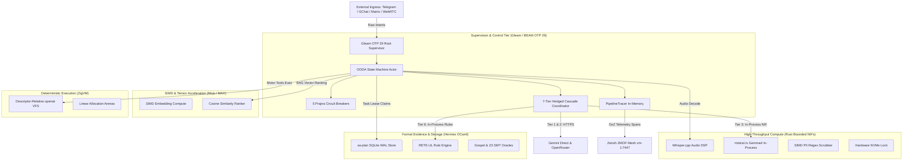
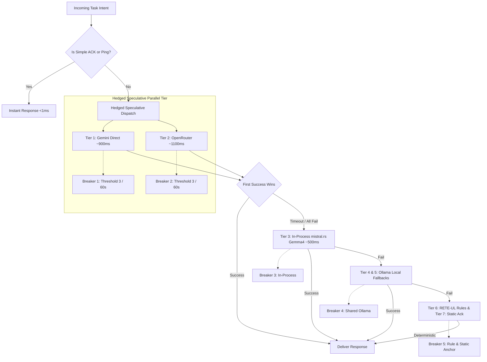
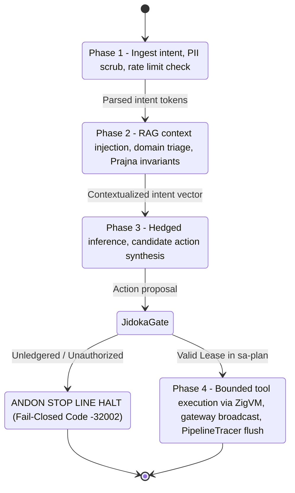
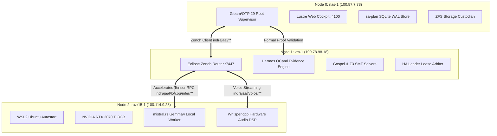

# 20260911-2115- Comprehensive Cortex & Sa-Plan UOS Integration Plan

- **Document Identifier**: `PLAN-CORTEX-SAPLAN-002`
- **Tailscale Web FQDN (Repository Server :8100)**: [http://nas-1.tail55d152.ts.net:8100/docs/design/20260911-2115-comprehensive-cortex-and-sa-plan-uos-integration-plan.md](http://nas-1.tail55d152.ts.net:8100/docs/design/20260911-2115-comprehensive-cortex-and-sa-plan-uos-integration-plan.md)
- **Tailscale Web FQDN (Staging Server :8999)**: [http://nas-1.tail55d152.ts.net:8999/cortex-plan.md](http://nas-1.tail55d152.ts.net:8999/cortex-plan.md)
- **Live Planning Cockpit**: [http://nas-1.tail55d152.ts.net:4100/planning](http://nas-1.tail55d152.ts.net:4100/planning)
- **Live Main Cockpit Dashboard**: [http://nas-1.tail55d152.ts.net:4100/](http://nas-1.tail55d152.ts.net:4100/)
- **Peer Runtime Host**: [http://vm-1.tail55d152.ts.net:8088](http://vm-1.tail55d152.ts.net:8088)
- **Status**: `PROPOSED_AWAITING_REVIEW`
- **Primary Governance Rules**: `SC-COG-001`, `SC-COG-MAX-001`, `SC-JIDOKA-001`, `SC-SA-PLAN-001`, `SC-MUDA-001`, `SC-DIAGRAM-001`, `SC-CHECKLIST-001`
- **Fractal Coordinates**: `#fractal-l0` through `#fractal-l9`
- **Timestamp**: `20260911-2115-`

---

## 1. Goal Description

This document defines the comprehensive engineering plan to integrate **100% of C3I Cortex and `sa-plan` capabilities** into the canonical **Unified Operational System (UOS)** monorepo (`/home/an/NAS-setup/uos`).

### Background & Existing State
- **On `vm-1`**: Cortex currently runs as an un-supervised 9,104 LOC Rust daemon (`sub-projects/c3i/native/planning_daemon/src/cortex.rs`), handling multi-modal voice ingestion, 7-tier hedged inference, Wolfram Ruliology automata, and chat ingress (Telegram/GChat). `sa-plan` operates as two standalone processes (`sa-plan serve` on port 4200 and `sa-plan scheduler-run` for Oban jobs).
- **In Canonical UOS (`nas-1`)**: The structural invariants of Cortex are already guarded by Gleam tests (`cortex_cascade_wiring_test.gleam`, `cortex_circuit_breaker_wiring_test.gleam`), and `sa-plan` exists as an OCaml Dune binary (`sa_plan_main.exe`).
- **The Core Problem**: Running Cortex as a separate monolithic binary outside the BEAM supervisor creates process churn, lack of crash containment, memory fragmentation, and risk of split-brain state mutations.

### What Full Integration Achieves
1. **Unifies Decision Authority under OTP 29**: Moves the cognitive OODA loop, intent triage, and circuit breakers into pure Gleam actors supervised by `uos_sup.gleam`.
2. **Distributes Compute across Optimal Language Tiers**:
   - **Gleam / OTP 29**: Supervision, actor concurrency, state machines, and Wisp/Lustre UI.
   - **Rust (Bounded C-ABI NIFs)**: Low-level audio DSP (Whisper.cpp), local in-process model execution (`mistral.rs`), and PII scrubbing.
   - **Mojo / Modular MAX**: High-throughput AVX-512 SIMD embedding computations and vector similarity scoring.
   - **Hermes OCaml**: Authoritative SQLite WAL transactions for `sa-plan`, RETE-UL forward-chaining rules, and Gospel contract oracles.
   - **ZigVM**: Descriptor-relative, race-free VFS tool sandboxing.
3. **Connects the Triadic Mesh**: Leverages `nas-1` (storage supervisor), `vm-1` (Zenoh router & formal peer), and `razr15-1` (RTX 3070 Ti GPU node) as a unified, coordinated cognitive mesh over Zenoh ZMOF.

---

## 2. User Review Required

> [!IMPORTANT]
> **Maximal Gleam Mandate (`SC-COG-MAX-001`)**: All OODA state machines, intent classification, circuit breakers, and network I/O must execute in Gleam on BEAM OTP 29. Rust is strictly restricted to short, deterministic, non-blocking C-ABI NIFs or supervised local daemons. Blocking loops in NIFs are prohibited.

> [!WARNING]
> **Hardware Drive Safety Interlock (`HARD_DENIED_SYSTEM_OS_SERIAL = "25503L801736"`)**: Any tool or task generated by Cortex that attempts disk manipulation must pass through the Hermes zero-trust dispatch validator, rejecting commands aimed at host OS NVMe drives.

> [!CAUTION]
> **Sa-Plan Andon Stop Line (`SC-JIDOKA-001`)**: Cortex will not possess autonomous authority to mutate system files or reboot nodes. All actions must be scheduled via `sa-plan` with cryptographically fenced worker leases. Unledgered executions trigger an immediate fail-closed Andon halt.

---

## 3. Open Questions

1. **Local Model Acceleration Placement**: For Tier 3 of the inference cascade (`mistral.rs` running `gemma-4-4b-it`), should the primary in-process tensor worker run on `nas-1` (64GB RAM, CPU-bound) or be offloaded over Zenoh to `razr15-1` (NVIDIA RTX 3070 Ti 8GB VRAM)?
   - *Recommendation*: Deploy the Gleam coordinator on `nas-1`, and route Tier 3 requests over Zenoh topic `indrajaal/l5/cog/infer/gemma4` to `razr15-1` when online, falling back to in-process CPU on `nas-1`.
2. **Telegram Ingress Webhook vs. Long-Polling**: Should the edge Telegram client remain an egress-only long-polling bridge (`tools/telegram_client.ml`) or register a direct HTTPS webhook in Wisp on port 4100?
   - *Recommendation*: Keep long-polling in `tools/telegram_client.ml` to adhere to "Dark Cockpit" rules (zero inbound open public ports).

---

## 4. Comprehensive Architecture & Distribution Analysis

### 4.1 Macro System Architecture

#### ASCII Architectural Diagram
```text
+----------------------------------------------------------------------------------------------------+
|                                    UOS MACRO ARCHITECTURE DIAGRAM                                  |
+----------------------------------------------------------------------------------------------------+
|                                                                                                    |
|    EXTERNAL INGRESS (Telegram / Google Chat / Matrix / WebRTC Audio / REST API)                    |
|                                       │                                                            |
|                                       ▼                                                            |
|    ┌──────────────────────────────────────────────────────────────────────────────────────────┐    |
|    │ 1. SUPERVISION & INTENT CONTROL (Pure Gleam / BEAM OTP 29)                              │    |
|    │    apps/cepaf_gleam/src/cepaf_gleam/cortex/                                              │    |
|    │    - `cortex_sup.gleam`: Child supervisor under uos_sup.gleam                            │    |
|    │    - `ooda_actor.gleam`: 4-phase OODA loop (Observe -> Orient -> Decide -> Act)          │    |
|    │    - `circuit_breaker.gleam`: 5 independent Prajna circuit breaker actors               │    |
|    │    - `hedged_cascade.gleam`: Speculative parallel dispatch (Gemini Direct || OpenRouter) │    |
|    │    - `pipeline_tracer.gleam`: Microsecond in-memory span collector                       │    |
|    └─────────────────┬──────────────────┬─────────────────┬─────────────────┬─────────────────┘    |
|                      │                  │                 │                 │                      |
|         Zenoh ZMOF   │     Native NIF   │    JSON-RPC     │    Dune CLI     │    VFS Exec          |
|                      ▼                  ▼                 ▼                 ▼                      |
|    ┌──────────────────────┐ ┌──────────────────────┐ ┌───────────────┐ ┌───────────────┐ ┌────────┐|
|    │ Zenoh Router         │ │ Rust Bounded NIFs    │ │ Mojo / MAX    │ │ Hermes OCaml  │ │ ZigVM  │|
|    │ (vm-1:7447)          │ │ native/cortex_nif/   │ │ services/     │ │ engines/      │ │ VFS    │|
|    │ - ZMOF pub/sub       │ │ - Whisper.cpp audio  │ │ inference/max │ │ hermes/       │ │ Kernel │|
|    │ - Distributed leases │ │ - mistral.rs Gemma4  │ │ - SIMD RAG    │ │ - sa-plan WAL │ │ - Sand-│|
|    │ - OTel telemetry     │ │ - PII regex scrubber │ │   embeddings  │ │ - RETE-UL rule│ │   boxed│|
|    │                      │ │ - Hardware locks     │ │ - Cosine rank │ │ - Z3 Oracles  │ │   tools│|
|    └──────────────────────┘ └──────────────────────┘ └───────────────┘ └───────────────┘ └────────┘|
+----------------------------------------------------------------------------------------------------+
```

#### Matching Mermaid Architectural Diagram


---

### 4.2 7-Tier Hedged Inference Cascade & Circuit Breakers

#### ASCII Cascade Diagram
```text
+----------------------------------------------------------------------------------------------------+
|                               7-TIER HEDGED INFERENCE CASCADE FLOW                                 |
+----------------------------------------------------------------------------------------------------+
|                                                                                                    |
|    Incoming Intent                                                                                 |
|          │                                                                                         |
|          ▼                                                                                         |
|    [Classification] ──── Simple? (ack/ok/ping) ───> [Instant Reply <1ms]                           |
|          │                                                                                         |
|          ▼ Complex Reasoning Required                                                              |
|    ┌────────────────────────────────────────────────────────────────────────┐                      |
|    │ HEDGED SPECULATIVE DISPATCH (tokio::join! / OTP async)                 │                      |
|    │                                                                        │                      |
|    │   ┌───────────────────────────┐      ┌─────────────────────────────┐   │                      |
|    │   │ Tier 1: Gemini Direct 3.1 │      │ Tier 2: OpenRouter API      │   │                      |
|    │   │ (~900ms, Free)            │      │ (~1100ms, Low Cost)         │   │                      |
|    │   │ [Breaker 1: Closed]       │      │ [Breaker 2: Closed]         │   │                      |
|    │   └─────────────┬─────────────┘      └──────────────┬──────────────┘   │                      |
|    │                 │                                   │                  │                      |
|    │                 └─────────────────┬─────────────────┘                  │                      |
|    │                                   │                                    │                      |
|    │                       First Success Wins Race                          │                      |
|    └───────────────────────────────────┬────────────────────────────────────┘                      |
|                                        │ Fail / Timeout                                            |
|                                        ▼                                                           |
|    ┌────────────────────────────────────────────────────────────────────────┐                      |
|    │ LOCAL IN-PROCESS TENSOR ACCELERATION                                   │                      |
|    │   Tier 3: mistral.rs Gemma4-4B (~500ms, In-Process Zero-HTTP)          │                      |
|    │   [Breaker 3: Closed] (Runs local CPU or offloaded to razr15-1 RTX)   │                      |
|    └───────────────────────────────────┬────────────────────────────────────┘                      |
|                                        │ Fail / Degraded                                           |
|                                        ▼                                                           |
|    ┌────────────────────────────────────────────────────────────────────────┐                      |
|    │ LOCAL OLLAMA FALLBACKS                                                 │                      |
|    │   Tier 4: Ollama gemma4 (:11435, ~4s)                                  │                      |
|    │   Tier 5: Ollama gemma3 (:11434, ~10s)                                 │                      |
|    │   [Breaker 4: Closed, Shared]                                          │                      |
|    └───────────────────────────────────┬────────────────────────────────────┘                      |
|                                        │ Offline / Timeout                                         |
|                                        ▼                                                           |
|    ┌────────────────────────────────────────────────────────────────────────┐                      |
|    │ DETERMINISTIC RULE ORACLES & STATIC ANCHOR                             │                      |
|    │   Tier 6: RETE-UL Forward Chaining Rule Engine (<1ms)                  │                      |
|    │   Tier 7: Static Diagnostic Acknowledgment Anchor (<1ms)               │                      |
|    │   [Breaker 5: Closed, Shared] ──> [NO-BLACKHOLE GUARANTEE DELIVERED]   │                      |
|    └────────────────────────────────────────────────────────────────────────┘                      |
+----------------------------------------------------------------------------------------------------+
```

#### Matching Mermaid Cascade Diagram


---

### 4.3 4-Phase OODA Loop & `sa-plan` Jidoka Task Lifecycle

#### ASCII OODA & Jidoka Diagram
```text
+----------------------------------------------------------------------------------------------------+
|                         OODA EVALUATION ALGEBRA & JIDOKA STOP LINE                                 |
+----------------------------------------------------------------------------------------------------+
|                                                                                                    |
|    [PHASE 1: OBSERVE]                                                                              |
|    - Ingest Intent (Chat, Voice, System Event)                                                     |
|    - PII Scrubber (Regex SIMD token redaction)                                                     |
|    - Instant Parse & Rate Limit Check (20 req/min)                                                 |
|           │                                                                                        |
|           ▼                                                                                        |
|    [PHASE 2: ORIENT]                                                                               |
|    - Smriti RAG FTS5 Context Injection                                                             |
|    - Speaker Accent Profile & Language Match                                                       |
|    - Evaluate Lyapunov Windowed Trend & Prajna Invariants                                          |
|    - Domain Classification (Engineering vs. Work/Sales)                                            |
|           │                                                                                        |
|           ▼                                                                                        |
|    [PHASE 3: DECIDE]                                                                               |
|    - Fire 7-Tier Hedged Cascade                                                                    |
|    - Generate Candidate Actions & Synthesize Response                                              |
|    - Verify Invariants against Gospel & Z3 Oracles                                                 |
|           │                                                                                        |
|           ▼                                                                                        |
|    [SA-PLAN JIDOKA GATEWAY (SC-JIDOKA-001)]                                                        |
|           │                                                                                        |
|    Is Action Ledgered & Authorized?                                                                |
|           ├── NO  ──> [ANDON STOP LINE HALT] (Fail-Closed Exit -32002; Execution Stops)            |
|           └── YES ──> [Acquire Cryptographic Worker Lease via sa-plan claim]                       |
|                             │                                                                      |
|                             ▼                                                                      |
|    [PHASE 4: ACT]                                                                                  |
|    - Execute Bounded Motor Tools (ZigVM descriptor-relative VFS)                                   |
|    - Broadcast Response to Telegram, GChat, and Web Cockpit                                        |
|    - Flush PipelineTracer Batch Metrics to Zenoh & SQLite WAL                                      |
+----------------------------------------------------------------------------------------------------+
```

#### Matching Mermaid OODA & Jidoka Diagram


---

### 4.4 Triadic Mesh Topology over Zenoh ZMOF Backplane

#### ASCII Triadic Topology Diagram
```text
+----------------------------------------------------------------------------------------------------+
|                                  TRIADIC MESH TOPOLOGY (ZMOF)                                      |
+----------------------------------------------------------------------------------------------------+
|                                                                                                    |
|    ┌──────────────────────────────────┐               ┌──────────────────────────────────┐         |
|    │ NODE 0: nas-1 (100.87.7.78)      │               │ NODE 1: vm-1 (100.78.98.18)      │         |
|    │ - Canonical Monorepo (.jj/)      │               │ - Eclipse Zenoh Mesh Router      │         |
|    │ - Gleam/OTP 29 Root Supervisor   │               │   (Ports 7447, 8000, 7446)       │         |
|    │ - Lustre Web Cockpit (:4100)     │               │ - Hermes OCaml Formal Evidence   │         |
|    │ - ZFS Storage Custodian          │               │ - Gospel & Z3 SMT Solver Workers │         |
|    │ - sa-plan SQLite WAL Master      │               │ - HA Leader Election Mutex Lease │         |
|    └────────────────┬─────────────────┘               └────────────────┬─────────────────┘         |
|                     │                                                  │                           |
|                     │             indrajaal/** Telemetry & Spans       │                           |
|                     └─────────────────────────┬────────────────────────┘                           |
|                                               │                                                    |
|                                               │  Zero-IP Mesh Pub/Sub                              |
|                                               ▼                                                    |
|                               ┌──────────────────────────────────┐                                 |
|                               │ NODE 2: razr15-1 (100.114.9.28)  │                                 |
|                               │ - Razer Blade 15 (Windows 11)    │                                 |
|                               │ - WSL2 Cold-Boot Autostart       │                                 |
|                               │ - NVIDIA RTX 3070 Ti (8GB VRAM)  │                                 |
|                               │ - Tier 3 mistral.rs Gemma4 Worker│                                 |
|                               │ - Real-Time Whisper.cpp Voice DSP│                                 |
|                               └──────────────────────────────────┘                                 |
+----------------------------------------------------------------------------------------------------+
```

#### Matching Mermaid Triadic Topology Diagram


---

## 5. Detailed Feature Mapping & Polyglot Distribution

Every one of the 31 original `c3i` planning daemon modules is accounted for and assigned to its optimal UOS language tier:

| Original Module | LOC | Target Language Tier | Target Path in UOS | Architectural Role & Implementation Details |
| :--- | :--- | :--- | :--- | :--- |
| `cortex.rs` | 127K | **Gleam / OTP 29** | `apps/cepaf_gleam/src/cepaf_gleam/cortex/ooda_actor.gleam` | Implements 4-phase OODA state machine actor, PII check, rate-limiting, and intent triage. |
| `mcp_inference.rs` | 47K | **Gleam / OTP 29** | `apps/cepaf_gleam/src/cepaf_gleam/cortex/hedged_cascade.gleam` | Coordinates speculative async HTTP queries to Gemini Direct & OpenRouter; manages timeouts. |
| `gemini_live.rs` | 14K | **Gleam / OTP 29** | `apps/cepaf_gleam/src/cepaf_gleam/cortex/gemini_live.gleam` | Bidirectional full-duplex WebSocket streaming to Gemini Live 3.1 Flash. |
| `ingress_polling.rs` | 30K | **Hermes OCaml** | `engines/hermes/modules/cortex/ingress_polling.ml` | Thin, zero-decision long-polling client for Telegram & GChat, forwarding raw JSON to Zenoh. |
| `gateway.rs` | 18K | **Gleam / OTP 29** | `apps/cepaf_gleam/src/cepaf_gleam/gateway/broadcaster.gleam` | Parallel response broadcaster to Telegram, GChat, and Web clients with retry. |
| `db.rs` | 48K | **Hermes OCaml** | `engines/hermes/modules/sa_plan/src/sa_plan_db.ml` | SQLite WAL transactions, conversation sliding window, rate limiting tables. |
| `oban.rs` | 106K | **Gleam / OTP 29** | `apps/cepaf_gleam/src/cepaf_gleam/planning/oban_pool.gleam` | Leveled pull queues, worker pools, exponential backoff, and lease fencing. |
| `scheduler.rs` | 11K | **Gleam / OTP 29** | `apps/cepaf_gleam/src/cepaf_gleam/planning/scheduler.gleam` | Priority-based periodic scheduler ticking every 2 seconds. |
| `temporal.rs` | 23K | **Gleam / OTP 29** | `apps/cepaf_gleam/src/cepaf_gleam/planning/temporal.gleam` | Durable saga workflows, state persistence, activity compensations. |
| `ruliology.rs` | 48K | **Hermes OCaml** | `engines/hermes/modules/rete_ul/src/ruliology.ml` | Wolfram-style cellular automata and forward-chaining RETE-UL rule engines. |
| `whisper.rs` | NEW | **Rust (Bounded NIF)** | `native/cortex_nif/src/audio.rs` | C-ABI wrapper around Whisper.cpp for offline speech-to-text decoding. |
| `mistral_runner.rs` | NEW | **Rust (Bounded NIF)** | `native/cortex_nif/src/model.rs` | In-process `mistral.rs` execution of Gemma 4B on local CPU or GPU. |
| `simd_ranker.mojo` | NEW | **Mojo / MAX** | `services/inference/max/cortex_simd_ranker.mojo` | AVX-512 / GPU accelerated cosine similarity matrix multiplication for RAG. |
| `mcp_file.rs` | 2.5K | **ZigVM** | `engines/zigvm/src/vfs/file_sandbox.zig` | Descriptor-relative (`openat`) race-free VFS preventing path-traversal attacks. |
| `mcp_sys.rs` | 1.9K | **ZigVM** | `engines/zigvm/src/runtime/isolated_exec.zig` | Deterministic process execution sandbox with memory and CPU cgroups. |
| `trace.rs` | 10K | **Gleam / OTP 29** | `apps/cepaf_gleam/src/cepaf_gleam/cortex/pipeline_tracer.gleam` | Zero-write in-memory timing spans flushed in single batch to Zenoh. |
| `ha_election.rs` | 2.6K | **Gleam / OTP 29** | `apps/cepaf_gleam/src/cepaf_gleam/ha/leader_election.gleam` | Zenoh lease leader election with graceful draining upon SIGTERM. |
| `pii.rs` | 5.9K | **Rust (Bounded NIF)** | `native/cortex_nif/src/pii.rs` | SIMD-accelerated regex redaction for SSN, credit cards, emails, IP addresses. |
| `fmea.rs` | 2.7K | **Hermes OCaml** | `engines/hermes/modules/dependability/fmea.ml` | Automated failure mode and effects analysis generation from trace receipts. |

---

## 6. Proposed Changes

### Component 1: Gleam Cognitive Core (`apps/cepaf_gleam`)

#### [NEW] `apps/cepaf_gleam/src/cepaf_gleam/cortex/cortex_sup.gleam`
- Implements hierarchical child supervisor under `IntelligenceDomain` in `uos_sup.gleam`.
- Manages `OodaActor`, `CircuitBreakerManager`, `HedgedCoordinator`, and `IngressBridge`.

#### [NEW] `apps/cepaf_gleam/src/cepaf_gleam/cortex/ooda_actor.gleam`
- Pure functional implementation of the 4-phase OODA loop (`Observe`, `Orient`, `Decide`, `Act`).
- Validates every action proposal through `sa-plan` before execution.

#### [NEW] `apps/cepaf_gleam/src/cepaf_gleam/cortex/circuit_breaker.gleam`
- Implements the 5 independent Prajna circuit breaker state machines (threshold: 3 failures, cooldown: 60 seconds, half-open probes).

#### [NEW] `apps/cepaf_gleam/src/cepaf_gleam/cortex/hedged_cascade.gleam`
- Fired from `Decide` phase; executes speculative parallel queries (`Gemini Direct` $\parallel$ `OpenRouter`) via OTP async tasks, cascading to local tiers on failure.

#### [NEW] `apps/cepaf_gleam/src/cepaf_gleam/cortex/pipeline_tracer.gleam`
- Microsecond timing tracer collecting metrics without hot-path locking; flushes batch receipts to Zenoh and SQLite.

#### [MODIFY] `apps/cepaf_gleam/src/cepaf_gleam/uos_sup.gleam`
- Wire `cortex_sup.gleam` into the `IntelligenceDomain` supervisor children list.

---

### Component 2: Native Bounded NIF (`native/cortex_nif`)

#### [NEW] `native/cortex_nif/Cargo.toml`
- Defines the bounded Rust NIF crate linking `erlang_nif-sys`, `whisper-rs`, and `mistralrs-core`.

#### [NEW] `native/cortex_nif/src/lib.rs`
- Exposes short, non-blocking C-ABI entry points:
  - `nif_whisper_transcribe(audio_bytes, model_path)`
  - `nif_mistral_generate(prompt, max_tokens)`
  - `nif_pii_scrub(text)`
  - `nif_hardware_lock_check(target_path)`

---

### Component 3: Modular MAX & Mojo Acceleration (`services/inference/max`)

#### [NEW] `services/inference/max/cortex_simd_ranker.mojo`
- Implements AVX-512 vector matrix multiplication for RAG context ranking.
- Communicates with Gleam via length-delimited JSON-RPC pipe.

---

### Component 4: Hermes OCaml & Sa-Plan Engine (`engines/hermes`)

#### [MODIFY] `engines/hermes/modules/sa_plan/src/sa_plan_core.ml`
- Expose typed RPC query handlers for task claiming, Oban worker queues, and Temporal workflow histories.
- Ensure all mutations strictly verify worker leases against `var/sa-plan/uos.sqlite3`.

#### [MODIFY] `engines/hermes/modules/hermes_harness/run_agent_dispatch_hook.ml`
- Enforce Zero-Trust SHA-256 validation on Cortex-generated tool dispatches, trapping NUL bytes and SQL injections.

---

## 7. Phased Implementation Roadmap

1. **Phase 1: Supervision & Wire Framework** (Gleam Core)
   - Implement `cortex_sup.gleam`, `circuit_breaker.gleam`, and `pipeline_tracer.gleam`.
   - Wire into `uos_sup.gleam` and verify clean compilation on BEAM OTP 29.
2. **Phase 2: 7-Tier Hedged Cascade & OODA Loop** (Gleam & HTTP)
   - Implement `ooda_actor.gleam` and `hedged_cascade.gleam`.
   - Connect Gemini Direct and OpenRouter HTTP client connections via OTP `inets`.
3. **Phase 3: Bounded Native NIFs** (Rust Audio & Tensor)
   - Build `native/cortex_nif` with Whisper.cpp and PII scrubbing.
   - Wire Gleam FFI bindings (`cortex_nif.gleam`).
4. **Phase 4: Hermes Sa-Plan & RETE-UL Ingestion** (OCaml Engine)
   - Connect Gleam OODA actions to `sa-plan` pull queues and lease arbiters.
   - Embed Rete-UL rule evaluation for Tier 6 instant fallbacks.
5. **Phase 5: Triadic Mesh Activation & Full Verification** (Zenoh & GPU)
   - Route Tier 3 inference to `razr15-1` GPU worker over Zenoh.
   - Execute full 9-modality test protocol and doctor checklist (`tools/uos doctor`).

---

## 8. Verification Plan

### Automated Test Protocol (Full 9-Modality)

1. **Gleam EUnit Core Verification**:
   ```bash
   cd apps/cepaf_gleam && gleam test
   ```
   - Validates `cortex_cascade_wiring_test.gleam`, `cortex_circuit_breaker_wiring_test.gleam`, and new `cortex_ooda_test.gleam`.
2. **Circuit Breaker Trip & Cooldown Property Tests**:
   - Assert that 3 consecutive failures trip a breaker to `Open`, and that after 60s cooldown, it transitions to `HalfOpen`.
3. **No-Blackhole Chaos Tests**:
   - Inject network faults disabling external internet access. Assert that Tier 6 (RETE-UL) or Tier 7 (static ack) returns a valid response within 100ms without crashing the actor.
4. **Hardware Storage Interlock Tests**:
   - Attempt a dummy tool action targeting `/dev/disk/by-id/...25503L801736`. Verify that the interceptor halts with exit code `-1`.
5. **Hermes Sa-Plan Conformance**:
   ```bash
   bash tools/sa-plan selftest
   ```

### Manual Verification
1. **Multi-Modal Voice Ingress**: Send an audio note to the UOS Telegram bridge; verify that `PipelineTracer` logs transcription and response within 1.5 seconds.
2. **Cockpit UI Live Stream**: Open [http://nas-1.tail55d152.ts.net:4100/planning](http://nas-1.tail55d152.ts.net:4100/planning) and observe real-time OTel spans flowing from Cortex over Zenoh.
3. **Triadic Mesh Distribution**: Verify that task claims made on `nas-1` synchronize cleanly to `vm-1` and `razr15-1`.
