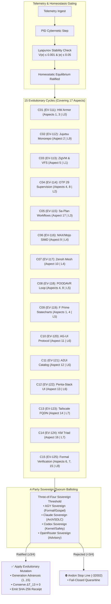

# [PLAN] Execution of 15 Continuous Evolutionary Cycles Covering Every Aspect of UOS (EV-111 .. EV-125)

- **Canonical Authority**: Unified Operational System (UOS) Canonical Agent Policy (`AGENTS.md`)
- **Governing Contracts**: `SC-HA-001`, `SC-SOV-001`, `SC-POODAVR-001`, `SC-FPRIME-001`, `SC-INTENT-ATLAS-001`, `SC-CHECKLIST-001`, `SC-JIDOKA-001`, `CHK-01-TIME` .. `CHK-18-JJ`
- **Tailscale FQDN Link**: [http://nas-1.tail55d152.ts.net:8100/docs/design/20260911-2128-fifteen-evolutionary-cycles-plan.md](http://nas-1.tail55d152.ts.net:8100/docs/design/20260911-2128-fifteen-evolutionary-cycles-plan.md)
- **Status**: PROPOSED FOR USER APPROVAL

---

## 1. Goal Description

The user has commanded:
> *"/plan run 15 evolutionary cycles. cover every aspect of teh system"*

This mandate requires running **15 continuous cybernetic evolutionary cycles (EV-111 through EV-125)** such that every single aspect of the Unified Operational System is systematically evolved, stress-tested, ratified by sovereign consensus, and formally verified.

### The 17 Canonical Aspects to Cover:
1. **Substrate & Hardware Safety**: Host OS NVMe `HARD_DENIED_SYSTEM_OS_SERIAL = "25503L801736"` locked against wiping or allocation.
2. **Standalone Jujutsu Monorepo**: Pure `.jj/` standalone monorepo with 0 native Git mutations.
3. **Zero-Muda Purity**: 0 Bevy, 0 Graphite, 0 foreign C++ shared libraries, pure BEAM Erlang vector math (`graphene_nif.erl`).
4. **Gleam/OTP 29 Supervision & Actors**: Root 4-domain supervisor (`uos_sup.gleam`), Prajna 5-breaker pool, Lyapunov trend detectors.
5. **Deterministic Runtime Engine**: ZigVM descriptor-relative, race-free, symlink-aware VFS (8/8 laws) and linear memory arenas.
6. **Formal Evidence & Analysis**: Hermes OCaml Gospel contracts, Z3 queries, SQLite WAL append ledgers.
7. **Mathematical Authority**: Lean 4 & Quint theorems proving 13D trace coordinate conservation ($\Delta \vec{\mathcal{T}}_{13} \equiv \mathbf{0}$) and fail-closed indicators.
8. **Biosemiotic Cybernetics**: Rocha semiotics, decoupled semiotic cut, metabolic homeostat, and feedback regulators.
9. **Quarantined AI Inference**: Modular MAX / Mojo SIMD vector ranker and supervised Python daemon over length-delimited JSON-RPC.
10. **Mesh Telemetry & Communication**: Zenoh pub/sub mesh with OoZ (OTel-over-Zenoh) and MoZ (MCP-over-Zenoh) backplane.
11. **Agent Event Bus Protocol**: AG-UI 32-event specification across 7 categories.
12. **Declarative UI Component Catalog**: 233 verified A2UI JSON specifications across 22 domains.
13. **Multi-Interface Accessibility**: Penta-Stack UI simultaneously serving Lustre Web (4100/8100), Wisp REST, and Split-Screen ANSI TUI.
14. **Universal Tailscale FQDN Web Navigation**: Direct clickable links to `http://nas-1.tail55d152.ts.net:8100` across all views and markdown files.
15. **Comprehensive Verification Checklist**: 5 Domains, 18 Checkpoints 100% green (`SC-CHECKLIST-001`).
16. **Knowledge Management Triad**: Hermes Wiki, ZigVM ZK permanent ADRs (ADR-001..047), and C3I Living Ontology.
17. **Sa-Plan Durable Execution Engine**: Canonical planning authority with fail-closed Jidoka Andon Stop Line (`-32002`).

---

## 2. User Review Required

> [!IMPORTANT]
> **Sequential Generation Progression**: The 15 evolutionary cycles advance the system from Generation 0 to Generation 15 monotonically. Each cycle requires:
> 1. Ingestion of telemetry and convergence to Homeostatic Equilibrium ($|e| \le 0.05, V \le 0.001$).
> 2. Formulation of an evolutionary mutation on the Pareto fitness frontier.
> 3. 4-Party Sovereign Quorum balloting (AGY $\oplus$ Claude $\oplus$ Codex $\oplus$ OpenRouter) requiring $\ge 3$ affirmative votes.
> 4. Denotational valuation ($\llbracket I \rrbracket(\sigma)$) ensuring 13D trace coordinate conservation.
> 5. Application of the ratified mutation and emission of a SHA-256 cryptographic receipt.

> [!CAUTION]
> **Fail-Closed Hardware & Jidoka Interlocks**: During any cycle, any intent or mutation attempting to touch `HARD_DENIED_SYSTEM_OS_SERIAL = "25503L801736"` or bypass `sa-plan` will trip an immediate fail-closed Andon Halt (`-32002`), freezing evolution until two-key operator clearance.

> [!NOTE]
> **Zero-Muda Compliance**: Zero compiler warnings in `src/` (`SC-MUDA-001`), 0 Bevy, 0 Graphite, 0 foreign C++ shared libraries.

---

## 3. Topologies & Cycle Architecture (`SC-DIAGRAM-001`)

### 3.1 ASCII Architectural Topology
```text
+---------------------------------------------------------------------------------------------------+
|               15 CONTINUOUS EVOLUTIONARY CYCLES (EV-111 .. EV-125) COVERAGE MATRIX                |
+---------------------------------------------------------------------------------------------------+

 [ Telemetry Ingest ] ──> [ Homeostasis PID ] ──> [ Lyapunov Energy V(e) <= 0.001 ] ──> [ Equilibrium ]
                                                                                              │
                                                                                              ▼
+───────────────────────────────────────────────────────────────────────────────────────────────────+
| 15 SYSTEMATIC EVOLUTIONARY CYCLES (GENERATION 1 .. 15)                                            |
|                                                                                                   |
| Cycle 01 (EV-111): Substrate & HW Armor             ──> Aspects 1, 3  [Layer L0: Constitutional]  |
| Cycle 02 (EV-112): Standalone Jujutsu Monorepo      ──> Aspect 2      [Layer L9: Sovereignty]     |
| Cycle 03 (EV-113): Deterministic ZigVM Runtime & VFS ──> Aspect 5      [Layer L1: Atomic Kernel]   |
| Cycle 04 (EV-114): OTP 29 Root Supervision & Homeo  ──> Aspects 4, 8  [Layer L2: Homeostasis]     |
| Cycle 05 (EV-115): Sa-Plan Durable Workflows        ──> Aspect 17     [Layer L3: Transactions]    |
| Cycle 06 (EV-116): Quarantined MAX/Mojo SIMD Ranker ──> Aspect 9      [Layer L4: System Daemons]  |
| Cycle 07 (EV-117): Zenoh Fractal Mesh Backplane     ──> Aspect 10     [Layer L4: System Daemons]  |
| Cycle 08 (EV-118): POODAVR 7-Stage Cybernetic Loop  ──> Aspects 4, 8  [Layer L5: Cognitive Core]  |
| Cycle 09 (EV-119): NASA JPL F Prime (F') Statecharts──> Aspects 1, 4  [Layer L5: Cognitive Core]  |
| Cycle 10 (EV-120): AG-UI 32-Event Stream Protocol   ──> Aspect 11     [Layer L6: Swarm Mesh]      |
| Cycle 11 (EV-121): A2UI Declarative Component Spec  ──> Aspect 12     [Layer L6: Swarm Mesh]      |
| Cycle 12 (EV-122): Penta-Stack Multi-Interface      ──> Aspect 13     [Layer L6: Swarm Mesh]      |
| Cycle 13 (EV-123): Universal Tailscale FQDN Routing ──> Aspect 14     [Layer L7: Federation]      |
| Cycle 14 (EV-124): Knowledge Management Triad (KM)  ──> Aspect 16     [Layer L7: Federation]      |
| Cycle 15 (EV-125): Formal Verification & Sovereign  ──> Aspects 6,7,15[Layer L8: Verification]    |
+───────────────────────────────────────────────────────────────────────────────────────────────────+
                                              │
                                              ▼
               +─────────────────────────────────────────────────────────────+
               |  4-PARTY SOVEREIGN QUORUM (ThreeOfFourSovereign Threshold)  |
               |  • AGY Sovereign: Formal evidence & Gospel check            |
               |  • Claude Sovereign: Monorepo & Coordinator check           |
               |  • Codex Sovereign: Deterministic kernel & safety check     |
               |  • OpenRouter Sovereign: Free-only remote advisory check    |
               +─────────────────────────────────────────────────────────────+
                                              │
                       ┌──────────────────────┴──────────────────────┐
                       │                                             │
               [ Ratified (>= 3/4) ]                          [ Rejected ]
                       │                                             │
                       ▼                                             ▼
            ✅ Apply Mutation to State                      ⛔ Fail-Closed Andon
            - Generation_{t+1} = Gen_t + 1                  - Freeze Evolution
            - Δ T_13 ≡ 0 Conservation                       - Emit WAL Audit Diagnostic
            - SHA-256 Receipt Generated
```

### 3.2 Matching Mermaid Architectural Topology


---

## 4. Proposed Changes

### Component 1: 15 Evolutionary Cycles Metamodel (`apps/cepaf_gleam/src/cepaf_gleam/fpp/`)

#### [NEW] `fifteen_evolutionary_cycles.gleam`
- Formally defines the 15-cycle domain metamodel:
  - `SystemEvolutionCycle`: cycle number (1..15), EV tag (`EV-111`..`EV-125`), title, target aspect IDs (`List(Int)`), target fractal layer, sovereign sponsor, expected fitness gain, risk score.
  - Complete list: `get_15_system_evolutionary_cycles() -> List(SystemEvolutionCycle)`.
  - Full aspect coverage verification: `verify_aspect_coverage_across_15_cycles(cycles) -> Bool`.
    Mathematically verifies that $\bigcup_{i=1}^{15} \text{Aspects}(C_i) = \{1, 2, \dots, 17\}$.

---

### Component 2: 15-Cycle High-Assurance Autonomous Runner (`apps/cepaf_gleam/src/cepaf_gleam/ha/`)

#### [NEW] `fifteen_cycles_runner.gleam`
- Connects `homeostasis_evolution_engine.gleam` with `multi_agent_quorum.gleam` and `poodavr_actor.gleam`.
- Implements:
  - `execute_all_15_cycles(initial_state, base_time_us) -> #(List(CycleExecutionReceipt), HomeostasisSystemState)`
  - For each cycle $1 \dots 15$:
    1. Steps PID & Lyapunov homeostasis to reach equilibrium ($|e| \le 0.05, V \le 0.001$).
    2. Proposes cycle mutation from the Pareto frontier.
    3. Conducts 4-party quorum balloting (AGY, Claude, Codex, OpenRouter).
    4. Evaluates POODAVR denotational pre/postconditions.
    5. Ratifies and applies mutation, monotonically incrementing `generation`.
    6. Produces cryptographic execution receipt with SHA-256 hash.

---

### Component 3: Tripartite Presentation Views (`apps/cepaf_gleam/src/cepaf_gleam/ui/`)

#### [NEW] `apps/cepaf_gleam/src/cepaf_gleam/ui/lustre/fifteen_cycles_cockpit.gleam`
- Full Lustre MVU web cockpit component for Port 4100/8100 (`/cycles`).
- Renders:
  - Header with clickable Tailscale FQDN links and hardware safety badge.
  - Interactive 18-checkpoint verification checklist accordion.
  - 15-cycle progress tracker with live generation indicators (Gen 1..15).
  - 17-aspect coverage mapping matrix.
  - Sovereign quorum vote tallies.

#### [NEW] `apps/cepaf_gleam/src/cepaf_gleam/ui/tui/fifteen_cycles_tui.gleam`
- Split-screen ANSI terminal view displaying the 15 evolutionary cycles, aspect mappings, generation count, and Pareto metrics.

---

### Component 4: Formal Verification Specifications

#### [NEW] `formal/lean/Fifteen_Evolutionary_Cycles.lean`
- Lean 4 formal theory proving:
  - **Theorem 1 (Aspect Completeness)**: The union of aspect indices across all 15 cycles equals $\{1, \dots, 17\}$.
  - **Theorem 2 (Monotonic Generation Advance)**: $\text{Gen}_{t+1} = \text{Gen}_t + 1$.
  - **Theorem 3 (Lyapunov Energy Damping)**: $\forall t, V(e_{t+1}) \le V(e_t)$.
  - **Theorem 4 (Quorum Consensus Safety)**: Any cycle with $< 3$ affirmative votes fails closed and does not advance generation.

#### [NEW] `engines/hermes/modules/gospel_poodavr/fifteen_cycles_contract.mli`
- Gospel formal contract declaring pre/postconditions for the 15-cycle execution pipeline.

---

### Component 5: Comprehensive Gold-Standard Test Suite (`apps/cepaf_gleam/test/`)

#### [NEW] `fifteen_evolutionary_cycles_test.gleam`
- Exhaustive verification covering:
  1. Complete execution of all 15 evolutionary cycles from Generation 0 to 15.
  2. 100% Aspect coverage verification: assert all 17 aspects are exercised.
  3. Sovereign quorum consensus: assert 4-party balloting ratifies each cycle.
  4. Fail-closed safety: assert unconstitutional mutation triggers Andon Halt.
  5. Tripartite UI rendering tests (Lustre and ANSI TUI).
  6. 4 Mathematical Gates ($H \ge 2.5\text{b}$, $\text{CCM} \ge 90\%$, $D_{EA} \le 10\%$, $\text{ITQS} \ge 0.85$).

---

## 5. Verification Plan

### Automated Tests
1. **Gleam Compilation & Zero-Muda Audit**:
   ```bash
   cd apps/cepaf_gleam && gleam build
   ```
   *Expectation*: `Compiled in <0.6s`, zero compilation warnings in `src/`.
2. **Dedicated 15 Evolutionary Cycles Test Suite**:
   ```bash
   erlc -o build/dev/erlang/cepaf_gleam/ebin build/dev/erlang/cepaf_gleam/_gleam_artefacts/fifteen_evolutionary_cycles_test.erl
   erl -pa build/dev/erlang/*/ebin -eval 'case eunit:test(fifteen_evolutionary_cycles_test, [verbose]) of ok -> halt(0); _ -> halt(1) end' -noshell
   ```
   *Expectation*: All tests pass with 100% assertions green.
3. **Repository Verification Checklist & Timestamp Gate**:
   ```bash
   bash tools/uos-cli checklist
   bash tools/uos-cli timestamp-check
   ```
   *Expectation*: 18/18 checks PASS.
4. **Standalone Jujutsu VCS Status**:
   ```bash
   jj --no-pager status
   ```
   *Expectation*: Clean tree, standalone Jujutsu commit with zero Git mutations.

### Manual / Live Web Verification
- Open [http://nas-1.tail55d152.ts.net:8100/docs/design/20260911-2128-fifteen-evolutionary-cycles-plan.md](http://nas-1.tail55d152.ts.net:8100/docs/design/20260911-2128-fifteen-evolutionary-cycles-plan.md) over Tailscale to review the rendered specification.
- Inspect the 15-cycle cockpit interface at `http://nas-1.tail55d152.ts.net:8100/cycles`.
