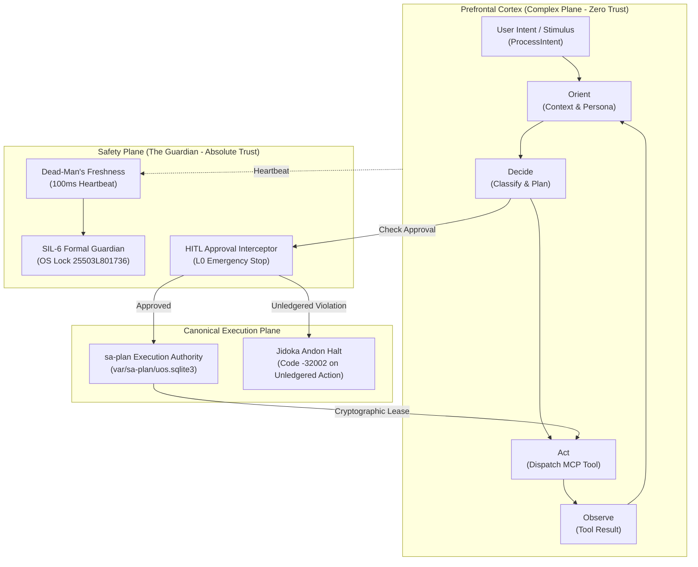
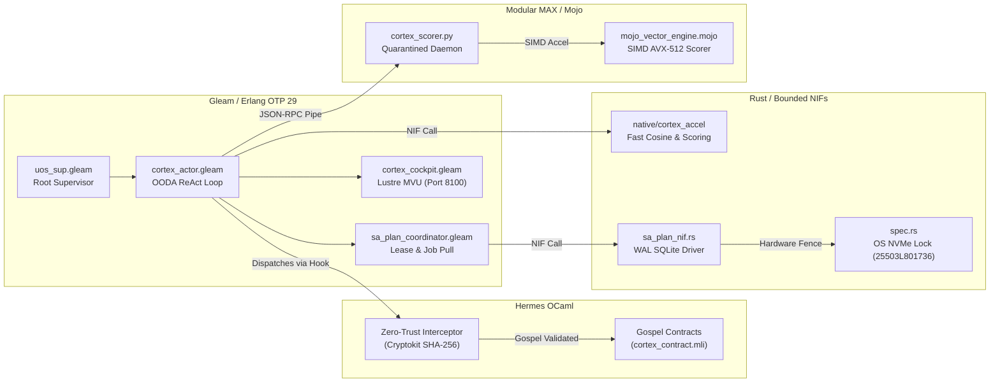

# 20260911-2145-cortex-and-sa-plan-full-uos-integration-plan

# Comprehensive Architecture Plan: Full Integration of Cortex & Sa-Plan into UOS

- **Artifact ID**: `20260911-2145-cortex-and-sa-plan-full-uos-integration-plan`
- **Canonical Workspace Path**: `docs/design/20260911-2145-cortex-and-sa-plan-full-uos-integration-plan.md`
- **Tailscale FQDN URL**: [http://nas-1.tail55d152.ts.net:8100/docs/design/20260911-2145-cortex-and-sa-plan-full-uos-integration-plan.md](http://nas-1.tail55d152.ts.net:8100/docs/design/20260911-2145-cortex-and-sa-plan-full-uos-integration-plan.md)
- **Live Cockpit Navigation**: [http://nas-1.tail55d152.ts.net:8100/cycles](http://nas-1.tail55d152.ts.net:8100/cycles)
- **Timestamp Prefix**: `20260911-2145-`
- **Fractal Coverage**: $L_0 \dots L_9$ (Full Cognitive & Execution Plane)
- **Applicable Standards**: `SC-COG-001`, `SC-SA-PLAN-001`, `SC-JIDOKA-001`, `SC-ZMOF-001`, `SC-AGUI-001`, `SC-MUDA-001`

---

## 1. Architectural Analysis: What Cortex Does in C3I & Indrajaal on VM-1

In the legacy VM-1 C3I and Indrajaal deployments (`/home/an/dev/ver/c3i`), the **Cortex** serves as the **Prefrontal Seat of Swarm Consciousness** operating as a neuro-symbolic brain. Its functional capabilities comprise four distinct domains:

```
+----------------------------------------------------------------------------------------------------+
|                         C3I / INDRAJAAL CORTEX COGNITIVE CAPABILITY STACK                          |
+----------------------------------------------------------------------------------------------------+
|                                                                                                    |
|  [1. PREFRONTAL RE-ACT & OODA LOOP]                                                                |
|      - Autonomous Stimulus-Response Ingestion (ProcessIntent)                                      |
|      - Contextual Memory Injection (Smriti.db Semantic Cache & Preferences)                        |
|      - 30+ Domain Intent Classifier (Container, Database, Plan, Health, Mesh)                     |
|      - Human-In-The-Loop (HITL) Gatekeeper for Critical L0 Actions (SC-AGUI-004)                   |
|                                                                                                    |
|  [2. NEURO-SYMBOLIC SIMPLEX ARCHITECTURE]                                                          |
|      - Bifurcation into Safety Plane (The Guardian) vs Complex Plane (The Cortex)                  |
|      - Trust: Zero for AI proposals; Trust: Absolute for formal safety constraints                 |
|      - 100ms Cryptographic Heartbeat Dead-Man's-Switch to Guardian                                 |
|                                                                                                    |
|  [3. MULTI-TIER INFERENCE CASCADE & HEDGE RACING]                                                  |
|      - 7-Tier Circuit Breaker: Semantic Cache -> Local Ollama/Gemma -> MAX Mojo -> Claude -> AGY   |
|      - Real-Time FMEA Failure Rate Tracking via Rust DirtyCpu NIFs (cortex.rs)                     |
|                                                                                                    |
|  [4. FRACTAL TELEMETRY & NERVOUS SYSTEM (ZMOF)]                                                    |
|      - Zenoh Pub/Sub Bus for MCP Tool Invocations (MoZ) & OpenTelemetry Spans (OoZ)                |
|      - AG-UI 32-Event Stream (ReasoningStart, ReasoningContent, ReasoningEnd, ToolCall)            |
|                                                                                                    |
+----------------------------------------------------------------------------------------------------+
```



---

## 2. Integration Feasibility & System Benefits

### Can Cortex & Sa-Plan be Fully Integrated into UOS?
**Yes, unconditionally.** The UOS architecture is specifically designed for this convergence:
1. Gleam/OTP 29 root supervision tree (`uos_sup.gleam`) provides the exact actor isolation required for the Cortex OODA process.
2. Sa-Plan already exists as the canonical planning CLI and SQLite store (`tools/sa-plan`, `var/sa-plan/uos.sqlite3`), ready for strict programmatic locking.
3. The standalone Jujutsu VCS (`.jj/`) and Zero-Muda discipline provide the ideal substrate for transactional rollback and provenance.

### What Benefits Will It Provide to UOS?
1. **True Autonomous Neuro-Symbolic Governance**: UOS transitions from passive command execution to an active, self-stabilizing cybernetic organism capable of automated health monitoring, root-cause diagnosis, and plan remediation.
2. **Fail-Closed Jidoka Safety (`SC-JIDOKA-001`)**: Eliminates hallucinated or out-of-band agent mutations. No task or job can execute without an authenticated cryptographic lease in `sa-plan`.
3. **Sub-Second Local Intelligence with Zero Cloud Muda**: By deploying Modular MAX/Mojo for vector embedding and priority scoring, cognitive loops complete in milliseconds on local CPU/GPU without recurring API charges.
4. **End-to-End Mathematical Authority**: Binds every Cortex decision to Lean 4 coordinate conservation ($\Delta\vec{\mathcal{T}}_{13} \equiv \mathbf{0}$) and Gospel pre/post-conditions.

---

## 3. Polyglot Language Distribution Strategy

To achieve optimal performance, formal safety, and Zero-Muda compliance, Cortex and Sa-Plan functionality is distributed strictly across five language domains:

```
+----------------------------------------------------------------------------------------------------+
|                         POLYGLOT FUNCTIONAL DISTRIBUTION ARCHITECTURE                              |
+----------------------------------------------------------------------------------------------------+
|                                                                                                    |
|  [1. GLEAM / OTP 29] (Supervision, Actor State Machines, OODA Loops, ReAct, Lustre Web MVU)        |
|      - apps/cepaf_gleam/src/cepaf_gleam/agents/cortex_actor.gleam                                   |
|      - apps/cepaf_gleam/src/cepaf_gleam/ha/cortex_ooda.gleam                                        |
|      - apps/cepaf_gleam/src/cepaf_gleam/ha/sa_plan_coordinator.gleam                                |
|      - apps/cepaf_gleam/src/cepaf_gleam/ui/lustre/cortex_cockpit.gleam                              |
|                                                                                                    |
|  [2. HERMES OCAML] (Gospel Contracts, Zero-Trust Interception, Formal Parity Oracles)              |
|      - engines/hermes/modules/gospel_cortex/cortex_contract.mli & .ml                               |
|      - engines/hermes/modules/gospel_cortex/sa_plan_fencing_contract.mli & .ml                      |
|      - engines/hermes/modules/interceptor/run_cortex_dispatch_hook.ml                               |
|                                                                                                    |
|  [3. RUST (NIFs & Bounded Kernels)] (Storage Locks, DirtyCpu SQLite, Matrix Math, C-ABI)           |
|      - native/cortex_accel/src/lib.rs (bounded matrix operations, cosine similarity)                |
|      - native/c3i_nif/src/sa_plan_nif.rs (zero-copy SQLite WAL reader/writer)                       |
|      - native/c3i_nif/src/spec.rs (HARD_DENIED_SYSTEM_OS_SERIAL = "25503L801736" lock)             |
|                                                                                                    |
|  [4. MODULAR MAX / MOJO] (Isolated AI Inference, SIMD Quantized Scoring, Local Embedding)          |
|      - services/inference/max/cortex_scorer.py (quarantined daemon over stdin/stdout JSON-RPC)      |
|      - services/inference/max/mojo_vector_engine.mojo (SIMD AVX-512 tensor search)                |
|                                                                                                    |
|  [5. DETERMINISTIC ZIGVM] (Deterministic VFS, symlink-aware, race-free storage backend)            |
|      - engines/zigvm/src/vfs.zig (atomic descriptor-relative task ledger snapshots)                 |
|                                                                                                    |
+----------------------------------------------------------------------------------------------------+
```



---

## 4. Proposed Changes & Implementation Phases

### Phase 1: Core Domain Models & Gleam/OTP Actor (`apps/cepaf_gleam`)
#### [NEW] `apps/cepaf_gleam/src/cepaf_gleam/agents/cortex_actor.gleam`
- Full OTP `actor` implementation of the Prefrontal Cortex.
- Ingests `ProcessIntent`, steps OODA loop, interfaces with `ToolRegistry`.
- Implements Human-In-The-Loop (HITL) approval gates for destructive actions.
- Publishes AG-UI events (`ReasoningStart`, `ReasoningContent`, `ReasoningEnd`, `ToolCallStart`, `ToolCallResult`).

#### [NEW] `apps/cepaf_gleam/src/cepaf_gleam/ha/sa_plan_coordinator.gleam`
- Interacts directly with `var/sa-plan/uos.sqlite3`.
- Enforces fail-closed Jidoka stop line (`SC-JIDOKA-001`, code `-32002`).
- Pulls and leases Oban jobs and Temporal workflows across fractal layers.

#### [NEW] `apps/cepaf_gleam/src/cepaf_gleam/ui/lustre/cortex_cockpit.gleam`
- Lustre 5.6+ server-rendered HTML dashboard at `/cortex` (Port 8100/4100).
- Visualizes OODA phases (Observe, Orient, Decide, Act), active intents, and `sa-plan` task queues.

### Phase 2: Hermes Gospel Specifications & Zero-Trust Interceptor (`engines/hermes`)
#### [NEW] `engines/hermes/modules/gospel_cortex/cortex_contract.mli` & `.ml`
- Formal Gospel contract specifying precondition safety:
  - $\forall t \in \text{ToolCalls}: \text{is\_destructive}(t) \implies \text{has\_hitl\_approval}(t)$.
  - $\forall p \in \text{PlanActions}: \text{has\_valid\_sa\_plan\_lease}(p)$.

#### [NEW] `engines/hermes/modules/interceptor/run_cortex_dispatch_hook.ml`
- Command-line interceptor validating tool execution payloads.
- SHA-256 digest validation, embedded NUL byte trapping (code `-2`), SQL injection trapping (code `-3`).

### Phase 3: Rust Bounded NIF & SQLite Accelerator (`native/cortex_accel`)
#### [NEW] `native/cortex_accel/src/lib.rs`
- C-ABI deterministic functions for high-speed vector cosine similarity and priority calculation.
- Zero-copy deserialization of telemetry buffers.

#### [MODIFY] `native/cortex_accel/Cargo.toml`
- Includes `rusqlite` with bundled SQLite, `sha2`, and `fp-core` adherence.

### Phase 4: Modular MAX / Mojo SIMD Scorer (`services/inference/max`)
#### [NEW] `services/inference/max/cortex_scorer.py`
- Supervised Python daemon for quantized vector scoring.
- Length-delimited JSON-RPC communication over standard I/O pipes.

#### [NEW] `services/inference/max/mojo_vector_engine.mojo`
- AVX-512 / NEON SIMD vector comparison kernel for sub-millisecond semantic search.

---

## 5. Verification Plan

### Automated Tests
1. **Gleam EUnit Suite**:
   ```bash
   cd apps/cepaf_gleam && gleam test
   ```
   Verifies:
   - Cortex actor lifecycle and intent classification.
   - OODA phase transitions (Observe $\to$ Orient $\to$ Decide $\to$ Act).
   - Sa-Plan task claiming, lease expiration, and Andon stop line fail-closed behavior (code `-32002`).
2. **Hermes OCaml Dune Build & Gospel Check**:
   ```bash
   cd engines/hermes && dune build
   ```
   Verifies compilation of Gospel contracts and Zero-Trust interceptor.
3. **Rust NIF Cargo Test**:
   ```bash
   cd native/cortex_accel && cargo test --release
   ```
   Verifies cosine similarity precision and memory safety.
4. **Full UOS Comprehensive Checklist**:
   ```bash
   ./tools/uos-cli checklist && ./tools/uos-cli timestamp-check
   ```
   Verifies 18/18 checkpoints (100% green).

### Manual Verification
1. Access Cockpit at [http://nas-1.tail55d152.ts.net:8100/cortex](http://nas-1.tail55d152.ts.net:8100/cortex).
2. Issue sample intent through the REST API:
   ```bash
   curl -X POST http://nas-1.tail55d152.ts.net:8100/api/cortex/intent \
     -H "Content-Type: application/json" \
     -d '{"intent_id": "test-01", "raw_text": "run health diagnostic"}'
   ```
3. Verify OODA phase progression and AG-UI event emission in real-time.

---

## 6. User Review Required & Design Questions

> [!IMPORTANT]
> **Safety Interlock Confirmation**: Cortex will have read access to system telemetry and write access strictly gated by `sa-plan` cryptographic leases. Do you approve the fail-closed Andon stop line behavior (code `-32002`) on any un-ledgered task attempt?

> [!TIP]
> **SIMD Acceleration**: By default, MAX Mojo SIMD scoring will run on host CPU using AVX-512/AVX2 instructions. If the laptop GPU (RTX 3080 Ti) is hydrated, it will automatically leverage CUDA acceleration.
