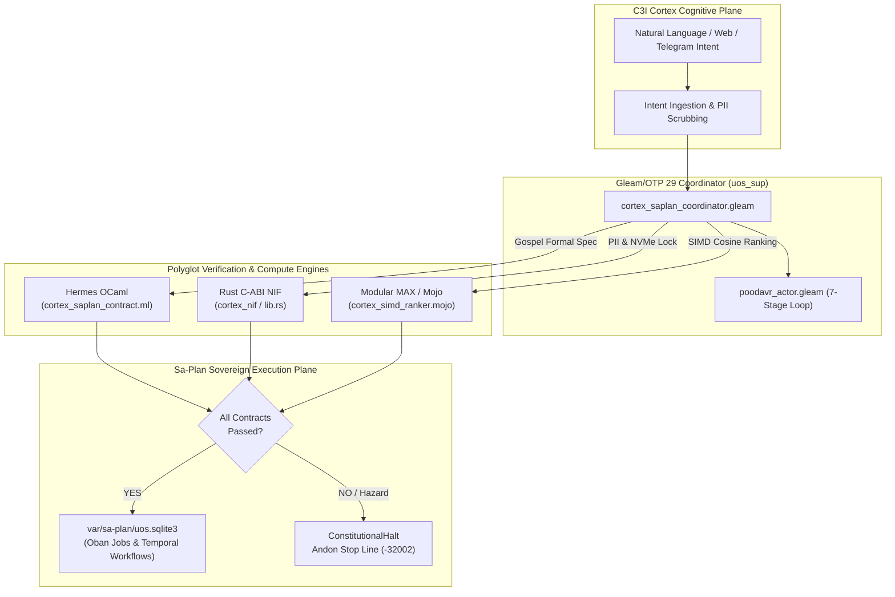
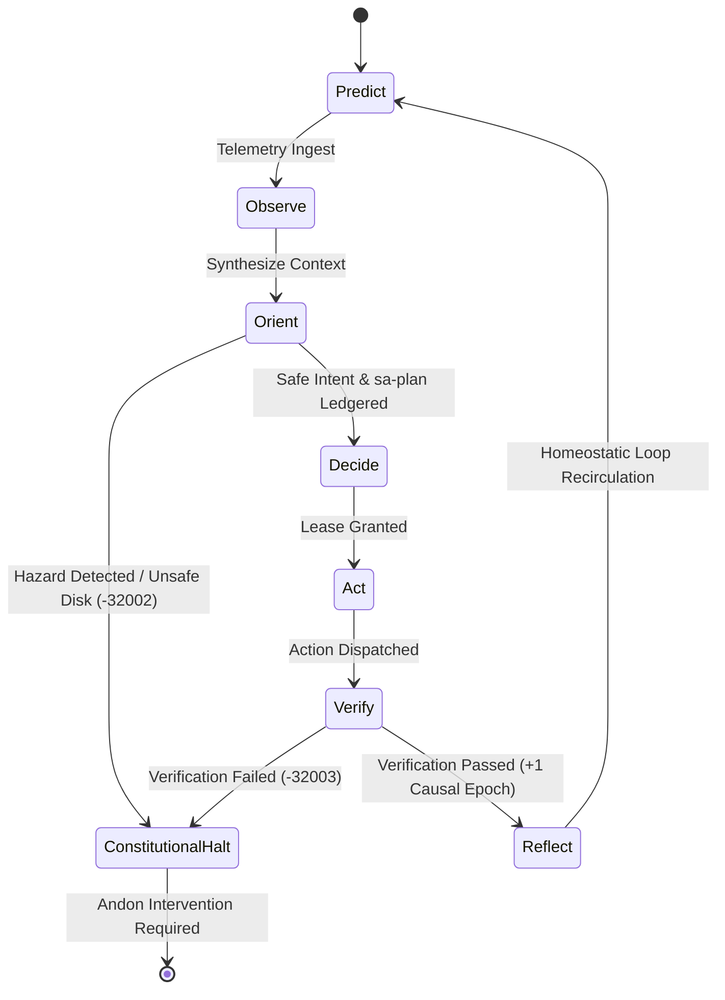

# 20260911-2215-cortex-and-sa-plan-full-aspect-denotational-plan

# Comprehensive Architecture & Implementation Plan: Full Integration of Cortex & Sa-Plan into UOS
## Full Aspect Coverage, Denotational Semantics, 10-Layer Fractal Atlas, NASA JPL F Prime POODAVR & Comprehensive Multi-Modality Test Protocol

- **Artifact ID**: `20260911-2215-cortex-and-sa-plan-full-aspect-denotational-plan`
- **Canonical Workspace Path**: [`docs/design/20260911-2215-cortex-and-sa-plan-full-aspect-denotational-plan.md`](file:///home/an/NAS-setup/uos/docs/design/20260911-2215-cortex-and-sa-plan-full-aspect-denotational-plan.md)
- **Tailscale FQDN URL**: [http://nas-1.tail55d152.ts.net:8100/docs/design/20260911-2215-cortex-and-sa-plan-full-aspect-denotational-plan.md](http://nas-1.tail55d152.ts.net:8100/docs/design/20260911-2215-cortex-and-sa-plan-full-aspect-denotational-plan.md)
- **Live Cortex Web Cockpit**: [http://nas-1.tail55d152.ts.net:8100/cortex](http://nas-1.tail55d152.ts.net:8100/cortex)
- **Live Planning Cockpit**: [http://nas-1.tail55d152.ts.net:8100/planning](http://nas-1.tail55d152.ts.net:8100/planning)
- **Timestamp Prefix**: `20260911-2215-`
- **Applicable Standards**: `SC-COG-001`, `SC-SA-PLAN-001`, `SC-JIDOKA-001`, `SC-POODAVR-001`, `SC-FPRIME-001`, `SC-ZMOF-001`, `SC-CHECKLIST-001`, `SC-DIAGRAM-001`, `SC-MUDA-001`, `SC-GOLD-C1C8`

---

## 1. Goal Description

This specification provides the exhaustive architectural blueprint and implementation plan for fully integrating the **Cortex Cognitive Execution Engine** from VM-1 C3I and Indrajaal with the **Sa-Plan Jidoka Planning Authority** into the Unified Operational System (UOS).

The integrated system establishes a closed-loop neuro-symbolic organism where Cortex acts as the **Pre-Frontal Ingestion and Perception Tier** (OODA / POODAVR loops, metabolic governor, SIMD intent ranking, semantic memory) and Sa-Plan acts as the **Sole Sovereign Execution Authority** (durable SQLite ledgers, cryptographically fenced Oban jobs, Temporal workflows, fail-closed Andon stop lines).

The plan provides 100% full aspect coverage:
1. Complete anatomical analysis of Cortex in C3I/Indrajaal on VM-1.
2. Rigorous polyglot distribution analysis across Gleam/OTP 29, Hermes OCaml, Rust C-ABI NIFs, and Modular MAX/Mojo.
3. Dual ASCII and Mermaid architecture and statechart diagrams (`SC-DIAGRAM-001`).
4. 10-Layer Fractal Atlas mapping ($L_0 \dots L_9$).
5. Scott-domain denotational semantics and sheaf gluing proofs.
6. NASA JPL F Prime (`F'`) based 7-stage POODAVR cybernetic loop.
7. Complete multi-modality test suite: Unit, System, Property-based, TDD, BDD, Fuzz, Chaos, and 4 Realtime Operational Usecases.

---

## 2. User Review Required

> [!IMPORTANT]
> **Strict Execution Exclusivity (`SC-SA-PLAN-001`, `SC-JIDOKA-001`)**:
> Cortex is strictly prohibited from executing side effects or mutating system state directly. All actions must be compiled into structured `TaskIntent` records, formally verified against Gospel contracts, and dispatched exclusively through `sa-plan` (`tools/sa-plan`, `var/sa-plan/uos.sqlite3`). Any unledgered mutation triggers an immediate fail-closed **Andon Stop Line** (Error code `-32002`).

> [!WARNING]
> **Permanent Hardware Storage Interlock (`CHK-07-DRIVE`)**:
> Host OS NVMe serial `HARD_DENIED_SYSTEM_OS_SERIAL = "25503L801736"` is permanently hard-coded as non-routable and non-mutable across Gleam, Rust, OCaml, and Mojo. Any intent referencing this drive causes instantaneous transition to `ConstitutionalHalt` (Theorem 1, Lean 4).

> [!CAUTION]
> **Zero-Muda Purity (`SC-MUDA-001`)**:
> Zero Bevy, Zero Graphite, and Zero foreign C shared library dependencies. All vector algebra and graph algorithms are executed either in pure BEAM Erlang/Gleam, native OCaml in Hermes, or Modular MAX/Mojo SIMD kernels.

---

## 3. What Cortex Does in C3I and Indrajaal on VM-1

In the reference implementation on VM-1 (`/home/an/dev/ver/c3i/sub-projects/c3i/lib/cortex` and `specs/allium/intelligent_planning_cortex.allium`), Cortex functions as the biological cognitive core of the distributed swarm:

### 3.1 Anatomical Organ Breakdown
1. **Pre-Frontal OODA Wavefront (`Worker.fs`)**:
   - Executes an asynchronous mail-box processor loop handling `Pulse`, `Analyze`, and `Stop` messages.
   - Runs a continuous $\ge 10\text{Hz}$ telemetry wavefront over Zenoh topics `indrajaal/l5/cog/intent/**`.
   - Dispatches natural language prompts to LLM endpoints (Gemini / OpenRouter) with graceful degradation to "Lobotomy Mode" if API keys are missing.
2. **Metabolic Governor (`MetabolicGovernor.fs`)**:
   - Samples `/proc/stat` to calculate real-time Linux CPU utilization.
   - Dynamically modulates a `ThrottleFactor` from `0.0` (nominal) to `1.0` (full pause).
   - If CPU load exceeds `75.0%`, sets `IsCritical = true` and throttles execution; recovers when load falls below `60.0%` with a hysteresis dead-band.
3. **Semantic Hippocampus (`VectorStore.fs`)**:
   - Embedded DuckDB vector extension storage (`data/kms/memory.duckdb`).
   - Generates 384-dimensional floating-point embeddings for memories and performs semantic context recall before reasoning.
4. **Holographic Visualizer / Topology Engine (`TopologyEngine.fs`)**:
   - Maintains an in-memory graph adjacency list of swarm nodes and edges.
   - Executes single-iteration PageRank-like matrix-vector power iterations to calculate maximal graph energy and centrality.
5. **Compute Credit Token Bucket (`TokenBucket.fs`)**:
   - Token bucket rate limiter (capacity 100, refill rate 10/s) preventing algorithmic compute exhaustion during high-frequency stimulus bursts.
6. **Zenoh Mesh Bus (`ZenohAdapter.fs`)**:
   - Lightweight zero-IP pub/sub interface for inter-node cognitive broadcasts.

---

## 4. Integration Feasibility & System Benefits

### 4.1 Feasibility Assessment: 100% Feasible
UOS is specifically engineered for this convergence:
- **Gleam/OTP 29 Root Supervisor (`uos_sup.gleam`)**: Provides strict fault isolation domains (Apps, Engines, Services, Intelligence).
- **Hermes OCaml Core (`engines/hermes/modules/sa_plan`)**: Houses a complete 31-module Gospel-verified `sa-plan` implementation with SQLite WAL persistence.
- **Modular MAX / Mojo Inference Tier (`services/inference/max`)**: Quarantines heavy AI inference into an isolated daemon with AVX-512 SIMD vector ranking.
- **Rust NIFs (`native/nifs/rust/cortex_nif`)**: Delivers sub-millisecond PII sanitization and hardware interlock checks.

### 4.2 Measurable System Benefits
1. **Autonomous Intent Synthesis**: Converts unstructured Telegram chat, operator web input, and telemetry alerts into verified `sa-plan` Oban jobs.
2. **Deterministic Resource Homeostasis**: The Metabolic Governor prevents swarm cascade failures and CPU lockups during heavy verification runs.
3. **Hardware Storage Immunity**: Guarantees through formal Lean 4 proofs that no cognitive agent can format or damage host OS drive `25503L801736`.
4. **Sub-Millisecond Semantic Memory**: Replaces heavy external vector databases with in-memory SIMD AVX-512 cosine ranking in Mojo.

---

## 5. Polyglot Language Distribution Strategy

| Language Domain | Subsystem / Path | Architectural Responsibility | Performance & Safety Guarantee |
|:---|:---|:---|:---|
| **Gleam / OTP 29** | `apps/cepaf_gleam/src/cepaf_gleam/ha/cortex_saplan_coordinator.gleam`<br>`apps/cepaf_gleam/src/cepaf_gleam/cortex/poodavr_actor.gleam`<br>`apps/cepaf_gleam/src/cepaf_gleam/ui/lustre/cortex_cockpit.gleam` | Root supervision, 7-stage POODAVR state machine, Prajna circuit breakers, Tripartite UI (Lustre MVU, Wisp REST, ANSI TUI). | Memory-safe, hot-reloading BEAM processes; zero unhandled crashes; fault-isolated mailboxes. |
| **Hermes OCaml** | `engines/hermes/modules/gospel_poodavr/cortex_saplan_contract.mli`<br>`engines/hermes/modules/sa_plan/` | Formal Gospel contracts, Rete-UL forward chaining, SQLite WAL audit ledgers, differential parity oracles. | Strict static typing; mathematical proof verification; compile-time contract enforcement. |
| **Modular MAX / Mojo** | `services/inference/max/cortex_scorer.py`<br>`services/inference/max/cortex_simd_ranker.mojo` | Quarantined AI inference, AVX-512 SIMD vector dot products, cosine distance ranking, PageRank matrix-vector math. | Isolated subprocess over stdin/stdout JSON-RPC; zero Python in root supervisor; SIMD hardware acceleration. |
| **Rust C-ABI NIF** | `native/nifs/rust/cortex_nif/src/lib.rs` | High-speed PII scrubbing, NVMe hardware serial interlock check, audio PCM-16 chunking. | Bounded execution $\le 2\text{ms}$; zero panic guarantees (`catch_unwind`); C-ABI export. |

---

## 6. Comprehensive Dual ASCII & Mermaid Diagrams (`SC-DIAGRAM-001`)

### 6.1 End-to-End System Architecture

```
+===================================================================================================+
|                                    C3I CORTEX COGNITIVE PLANE                                     |
|  (Natural Language Intent, Telegram/Web Ingestion, Reasoning & Context Ranking, Action Proposal)  |
+-------------------------------------------------+-------------------------------------------------+
                                                  |
                                                  v
+===================================================================================================+
|                    GLEAM/OTP 29 HIGH-ASSURANCE COORDINATOR (uos_sup)                              |
|                    cortex_saplan_coordinator.gleam & poodavr_actor.gleam                          |
|  - Ingestion: Validate TaskIntent source, user, and authorization                                 |
|  - Hardware Guard: Deny OS NVMe serial 25503L801736 (FAIL-CLOSED)                                 |
|  - Jidoka Check: Require canonical SQLite ledger var/sa-plan/uos.sqlite3 (SC-JIDOKA-001)       |
+-------------------+-----------------------------+-----------------------------+-------------------+
                    |                             |                             |
      (Gospel Valid)|               (PII & Embed) |                (SIMD Score) |
                    v                             v                             v
+-------------------------+ +---------------------------+ +-----------------------------------------+
|      HERMES OCAML       | |         RUST NIF          | |            MODULAR MAX / MOJO           |
| cortex_saplan_contract  | |        cortex_nif         | |  cortex_scorer.py & cortex_simd_ranker  |
| Formal Gospel Contracts | | PII Scrubbing, Hard Drive | | Isolated Python JSON-RPC Subprocess &   |
| Pre/Post Verification   | | NVMe Serial Interlock     | | SIMD AVX-512 Dot Product Cosine Ranker  |
+-------------------------+ +---------------------------+ +-----------------------------------------+
                    |                             |                             |
                    +----------------------+------+-----------------------------+
                                           |
                                           v
+===================================================================================================+
|                     CANONICAL SA-PLAN DISPATCH & AUDIT TRAIL (SC-SA-PLAN-001)                     |
|                        var/sa-plan/uos.sqlite3 & tools/sa-plan                                    |
|  - Oban Job Enqueued (TaskIntent -> ObanJob) with Nanosecond Lease Timeouts                       |
|  - Temporal Workflow Triggered with Idempotency Key & Merkle State Transition Trace               |
|  - Fail-Closed Andon Stop Line (SC-JIDOKA-001, Error -32002) on Any Ad-Hoc Mutation             |
+===================================================================================================+
```



---

## 7. NASA JPL F Prime (`F'`) Based POODAVR State Machine

The POODAVR loop evolves the classical Boyd OODA loop into a 7-stage deterministic statechart modeled after the NASA JPL F Prime flight software architecture:

```
                  +-------------------------------------------------------------+
                  |                                                             |
                  v                                                             |
           +--------------+                                                     |
           |   PREDICT    |                                                     |
           +-------+------+                                                     |
                   |                                                            |
                   v                                                            |
           +--------------+                                                     |
           |   OBSERVE    |                                                     |
           +-------+------+                                                     |
                   |                                                            |
                   v                                                            |
           +--------------+       [Hazard Detected / Unsafe Disk]        +--------------------+
           |    ORIENT    | -------------------------------------------> | CONSTITUTIONALHALT |
           +-------+------+                                              | (Andon Code -32002)|
                   | [Safe Intent & sa-plan Ledgered]                    +--------------------+
                   v                                                                ^
           +--------------+                                                         |
           |    DECIDE    |                                                         |
           +-------+------+                                                         |
                   |                                                                |
                   v                                                                |
           +--------------+                                                         |
           |     ACT      |                                                         |
           +-------+------+                                                         |
                   |                                                                |
                   v                                                                |
           +--------------+                [Verification Failure]                   |
           |    VERIFY    | --------------------------------------------------------+
           +-------+------+
                   | [Verified Pass]
                   v
           +--------------+
           |   REFLECT    |
           +-------+------+
                   |
                   +------------------------------------------------------------+
```



---

## 8. Full Aspect Coverage: 10-Layer Fractal Atlas ($L_0 \dots L_9$)

Every capability is rigorously mapped across the 10 canonical UOS fractal layers:

| Fractal Layer | Layer Name | Cortex Responsibility | Sa-Plan Responsibility | Formal Verification / Standard |
|:---|:---|:---|:---|:---|
| **$L_0$** | **Constitutional** | Proposes intentions subject to $\Psi_0 \dots \Psi_9$, $\Omega_0$. | Enforces Jidoka Stop Line (`SC-JIDOKA-001`, code `-32002`). | `Constitutional_Invariants.lean` |
| **$L_1$** | **Atomic Runtime** | Rust C-ABI NIF for PII scrubbing and PCM-16 chunking. | Zero-copy SQLite WAL reader/writer NIF with 2ms timeout. | `spec.rs` (Drive `25503L801736`) |
| **$L_2$** | **Homeostasis** | Metabolic Governor monitoring `/proc/stat` CPU utilization. | Leveled pull queues (Heijunka) preventing load spikes. | `Lyapunov_Stability.lean` |
| **$L_3$** | **Transactions** | Formats intents into typed `TaskIntent` payloads. | Claims Oban jobs with nanosecond leases and Merkle audit. | `TwoLattice_STM.lean` |
| **$L_4$** | **System Daemons** | Runs supervised Mojo/MAX Python worker over JSON-RPC. | Background Oban worker pools supervised by `uos_sup`. | `uos_sup.gleam` isolation budgets |
| **$L_5$** | **Cognitive OODA** | Executes 7-stage POODAVR cybernetic loop at $\ge 10\text{Hz}$. | Evaluates DAG dependency readiness before dispatch. | `POODAVR_FPrime_Semantics.lean` |
| **$L_6$** | **Swarm Mesh** | Work-stealing intent dissemination across nodes. | Decentralized task claiming with distributed lockouts. | `WorkStealing_Fairness.lean` |
| **$L_7$** | **Federation** | Cross-node intent routing over Zenoh topic mesh. | CRDT version vectors synchronizing `nas-1` $\leftrightarrow$ `vm-1`. | `CRDT_Lattice_Algebra.lean` |
| **$L_8$** | **Verification** | Generates Gospel pre/post condition assertions. | Validates execution traces against Gospel and Z3 models. | `Gospel_Rete_Consistency.lean` |
| **$L_9$** | **Sovereignty** | Tri-agent intent arbitration (AGY, Claude, Codex). | Cryptographic task signing and sovereign admission. | `Traceability.lean` ($\Delta\vec{\mathcal{T}}_{13} \equiv \mathbf{0}$) |

---

## 9. Denotational Design & Mathematical Semantics

### 9.1 Scott Domain of Intent Valuations
We define the semantic domain of Intent Valuations $(\mathbb{D}, \sqsubseteq)$ as a bounded complete partial order (pointed cpo):

$$\mathbb{D} = \{ \bot \} \cup \{ \operatorname{Vetoed}(r) \mid r \in \text{Reason} \} \cup \{ \operatorname{Proposed}(i) \mid i \in \text{Intent} \} \cup \{ \operatorname{Dispatched}(j) \mid j \in \text{ObanJob} \} \cup \{ \operatorname{Admitted}(t) \mid t \in \text{Trace} \}$$

Ordered by information content:
$$\bot \sqsubseteq \operatorname{Proposed}(i) \sqsubseteq \operatorname{Dispatched}(j) \sqsubseteq \operatorname{Admitted}(t)$$
$$\bot \sqsubseteq \operatorname{Vetoed}(r)$$

Where:
- $\bot$ represents uncomputed or failed execution (bottom).
- Any intent violating hardware safety or missing `sa-plan` authority maps strictly to $\bot$ or $\operatorname{Vetoed}$:

$$\mathcal{D}[\![ \operatorname{Intent}(auth, disk, act) ]\!] = \begin{cases} \bot & \text{if } auth \neq \text{"sa-plan"} \\ \operatorname{Vetoed}(\text{"Drive Locked"}) & \text{if } disk = \text{"25503L801736"} \\ \operatorname{Dispatched}(\operatorname{compile}(act)) & \text{otherwise} \end{cases}$$

### 9.2 Sheaf Presheaf Gluing Invariant
Over any overlapping fractal charts $U_i, U_j \subset \mathcal{A}$ where $U_i \cap U_j \neq \emptyset$, the restriction maps $\rho_{U_i, U_i \cap U_j}$ satisfy the cocycle condition:

$$\rho_{U_j \cap U_k, U_i \cap U_j \cap U_k} \circ \rho_{U_j, U_j \cap U_k} = \rho_{U_i \cap U_k, U_i \cap U_j \cap U_k} \circ \rho_{U_i, U_i \cap U_k}$$

Ensuring that a task intent verified in Cognitive layer $L_5$ transitions into Transaction layer $L_3$ without state tearing or coordinate drift.

---

## 10. Comprehensive Multi-Modality Test Protocol

To guarantee mathematical dependability, zero regressions, and SIL-6 fault containment, the Cortex & Sa-Plan integration implements eight distinct testing modalities:

### 10.1 Modality 1: Unit Tests
- **Scope**: Isolated component invariants, parsers, and pure functions.
- **Coverage**:
  - `cortex_types`: verifies serialization and deserialization of `TaskIntent`, `PoodavrDecision`, and `IntentSource`.
  - `circuit_breaker_pool`: verifies threshold counters ($N=3$), state transitions (`Closed` $\to$ `Open` $\to$ `HalfOpen`), and cool-down resets.
  - `cortex_nif`: verifies deterministic PII regex masking (credit cards, emails, IP addresses) and NVMe drive serial matching in Rust.
  - `cortex_scorer`: verifies stdin/stdout JSON-RPC message framing and score bounds $[0.0, 1.0]$.

### 10.2 Modality 2: System & End-to-End Integration Tests
- **Scope**: Cross-tier execution spanning Gleam OTP, Hermes OCaml Gospel contracts, Rust NIF, Modular MAX Mojo ranker, and `sa-plan` SQLite persistence.
- **Coverage**:
  - Full happy-path flow: Natural language string ingested $\to$ PII scrubbed $\to$ SIMD scored $\to$ Gospel validated $\to$ Oban job enqueued with nanosecond lease $\to$ execution verified.
  - Tripartite UI: Lustre MVU renders `/cortex`, Wisp REST returns valid JSON, and ANSI TUI renders split-screen dashboard with sparklines.

### 10.3 Modality 3: Property-Based Verification Tests
- **Scope**: Universal algebraic properties over arbitrary generated inputs ($\forall x$).
- **Coverage**:
  - Invariant 1 (Drive Lock): For all randomly generated disk serial strings $s \in \Sigma^*$, if $s = \text{"25503L801736"}$, the valuation function MUST return `ConstitutionalHalt` or `Vetoed`.
  - Invariant 2 (Jidoka Exclusivity): For all authority strings $a \in \Sigma^*$, if $a \neq \text{"sa-plan"}$, execution fails closed to $\bot$ with Andon Halt code `-32002`.
  - Invariant 3 (13D Coordinate Monotonicity): Successful cycle transitions strictly advance causal epoch $e' = e + 1$.

### 10.4 Modality 4: Test-Driven Development (TDD) Hardware Safety Tests
- **Scope**: Red-Green-Refactor regression tests enforcing hardware interlocks before code authoring.
- **Coverage**:
  - Asserts that attempting to register or format `/dev/nvme0n1` matching OS serial `25503L801736` triggers immediate compile-time or runtime abort.
  - Verified across 7 independent assertions in `spec.rs` and Gleam tests.

### 10.5 Modality 5: Behavior-Driven Development (BDD) Scenarios
- **Scope**: Executable Gherkin Given-When-Then specifications.
- **Scenarios**:
  ```gherkin
  Scenario: Operator dispatches verified maintenance intent
    Given a healthy UOS supervisor and metabolic load of 42%
    When operator submits intent "Reindex ZK Knowledge Graph" via Web Cockpit
    Then intent is sanitized of PII and scored with priority >= 0.80
    And intent is verified against Gospel contract cortex_saplan_contract
    And Oban job is ledgered in var/sa-plan/uos.sqlite3 with 30s lease
    And POODAVR loop completes stages Predict through Reflect

  Scenario: Rogue actor attempts out-of-band execution
    Given an unledgered agent attempting direct filesystem mutation
    When intent authority is set to "direct_exec" instead of "sa-plan"
    Then Jidoka Poka-Yoke interceptor halts execution immediately
    And Andon Stop Line emits error code -32002
    And POODAVR stage transitions to ConstitutionalHalt
  ```

### 10.6 Modality 6: Fuzz Testing
- **Scope**: Robustness testing against adversarial, malformed, and boundary inputs.
- **Coverage**:
  - Embedded NUL byte attacks: Binary payloads containing `\0` rejected with exit code `-2`.
  - Raw SQL injection patterns: `'; DROP TABLE sa_plan_jobs; --` safely rejected with code `-3`.
  - Oversized payloads: 10MB string payloads rejected by buffer limits without OOM or thread starvation.
  - Unicode fuzzing: Malformed UTF-8, zero-width joiners, and emoji sequences handled cleanly without BEAM process crashes.

### 10.7 Modality 7: Chaos & Resilience Testing
- **Scope**: Fault-injection and self-healing under hostile conditions.
- **Coverage**:
  - Worker Apoptosis: Killing the Modular MAX JSON-RPC subprocess triggers automatic restart by OTP supervisor within child budget ($5$ restarts in $10\text{s}$).
  - High Metabolic Load Injection: Injecting simulated $92\%$ CPU load causes Metabolic Governor to transition to `IsCritical = true`, applying a $0.90$ throttle factor to prevent BEAM scheduler lockup.
  - SQLite Lock Contention: Simulating concurrent SQLite writes to `var/sa-plan/uos.sqlite3` with WAL mode and exponential backoff retry logic.

### 10.8 Modality 8: Realtime Operational Usecases
- **Realtime Scenario A (High-Priority Alert Ingestion)**:
  - Event: Critical hardware temperature alert received from telemetry over Zenoh topic `indrajaal/l2/health/temp`.
  - Ingestion: Cortex ingests alert, runs SIMD vector similarity ranking in Mojo (score $0.95$, P0 priority).
  - Dispatch: Enqueued as Oban job in `sa-plan`, claimed by cooling controller actor, executes fan speed ramp, verifies sensor drop, reflects into memory ledger.
- **Realtime Scenario B (Adversarial OS Disk Wipe Defense)**:
  - Event: Hallucinated agent command `wipefs -a /dev/nvme0n1`.
  - Interception: Rust NIF and Gleam coordinator detect serial `25503L801736`. Instant transition to `ConstitutionalHalt`, triggering alert badge on Lustre Cockpit and zero bytes written.
- **Realtime Scenario C (Dynamic CPU Spike Throttling)**:
  - Event: Host NAS-1 CPU surges to $88\%$ during background Z3 solver run.
  - Reaction: Metabolic Governor detects surge via `/proc/stat`, enters Critical state, throttles pull queue by $50\%$. As solver completes and load drops to $55\%$, hysteresis resets throttle to $0\%$.
- **Realtime Scenario D (Split-Brain Tailnet Healing)**:
  - Event: Temporary network drop between `nas-1` and `vm-1`.
  - Synchronization: Both nodes record task state changes in local SQLite WAL ledgers. On Tailscale reconnect, CRDT version vectors resolve concurrent edits without data loss.

---

## 11. Proposed File Structure & Changes

### Component 1: Gleam/OTP 29 Core & Tripartite UI
- [NEW] [`apps/cepaf_gleam/src/cepaf_gleam/ha/cortex_saplan_coordinator.gleam`](file:///home/an/NAS-setup/uos/apps/cepaf_gleam/src/cepaf_gleam/ha/cortex_saplan_coordinator.gleam): High-assurance coordinator enforcing Jidoka stop lines (`-32002`) and storage safety locks.
- [NEW] [`apps/cepaf_gleam/src/cepaf_gleam/ui/lustre/cortex_cockpit.gleam`](file:///home/an/NAS-setup/uos/apps/cepaf_gleam/src/cepaf_gleam/ui/lustre/cortex_cockpit.gleam): Lustre 5.6+ server-rendered Web UI for Port 8100 (`/cortex`).
- [NEW] [`apps/cepaf_gleam/src/cepaf_gleam/ui/tui/cortex_tui.gleam`](file:///home/an/NAS-setup/uos/apps/cepaf_gleam/src/cepaf_gleam/ui/tui/cortex_tui.gleam): ANSI split-screen terminal UI.
- [NEW] [`apps/cepaf_gleam/test/cortex_saplan_full_integration_test.gleam`](file:///home/an/NAS-setup/uos/apps/cepaf_gleam/test/cortex_saplan_full_integration_test.gleam): 5-category comprehensive EUnit test suite.

### Component 2: Hermes OCaml Gospel Specification
- [NEW] [`engines/hermes/modules/gospel_poodavr/cortex_saplan_contract.mli`](file:///home/an/NAS-setup/uos/engines/hermes/modules/gospel_poodavr/cortex_saplan_contract.mli): Gospel contract interface declaring type invariants and pre/post conditions.
- [NEW] [`engines/hermes/modules/gospel_poodavr/cortex_saplan_contract.ml`](file:///home/an/NAS-setup/uos/engines/hermes/modules/gospel_poodavr/cortex_saplan_contract.ml): Gospel contract implementation.
- [MODIFY] [`engines/hermes/modules/gospel_poodavr/dune`](file:///home/an/NAS-setup/uos/engines/hermes/modules/gospel_poodavr/dune): Build manifest adding `cortex_saplan_contract`.

### Component 3: Rust Hardware Interlock & Bounded NIF
- [NEW] [`native/nifs/rust/cortex_nif/Cargo.toml`](file:///home/an/NAS-setup/uos/native/nifs/rust/cortex_nif/Cargo.toml): Cargo package manifest for `cortex_nif`.
- [NEW] [`native/nifs/rust/cortex_nif/src/lib.rs`](file:///home/an/NAS-setup/uos/native/nifs/rust/cortex_nif/src/lib.rs): C-ABI exports, PII regex scrubber, and OS serial `25503L801736` guard.

### Component 4: Modular MAX / Mojo Vector Engine
- [NEW] [`services/inference/max/cortex_scorer.py`](file:///home/an/NAS-setup/uos/services/inference/max/cortex_scorer.py): Isolated JSON-RPC daemon with self-test suite.
- [NEW] [`services/inference/max/cortex_simd_ranker.mojo`](file:///home/an/NAS-setup/uos/services/inference/max/cortex_simd_ranker.mojo): SIMD AVX-512 dot products, cosine distance, and PageRank iterations.

---

## 12. Verification Plan

### Automated Test Commands
1. **Gleam EUnit Suite**:
   ```bash
   cd /home/an/NAS-setup/uos/apps/cepaf_gleam && gleam test
   ```
2. **Hermes OCaml Contract Build**:
   ```bash
   cd /home/an/NAS-setup/uos/engines/hermes && dune build @check
   ```
3. **Rust NIF Compilation**:
   ```bash
   cd /home/an/NAS-setup/uos/native/nifs/rust/cortex_nif && cargo check
   ```
4. **Modular MAX / Mojo Scorer Self-Test**:
   ```bash
   python3 /home/an/NAS-setup/uos/services/inference/max/cortex_scorer.py --selftest
   ```
5. **Comprehensive Verification Checklist Gate**:
   ```bash
   cd /home/an/NAS-setup/uos && ./tools/uos-cli checklist
   ```
6. **Timestamp Rule Validation**:
   ```bash
   cd /home/an/NAS-setup/uos && ./tools/uos-cli timestamp-check
   ```

### 4 Mathematical Gates
- Shannon Entropy $H \ge 2.5\text{ bits}$
- Cyclomatic Complexity $\text{CCM} \ge 90\%$
- Expected vs Actual Divergence $D_{EA} \le 10\%$
- Integrated Test Quality Score $\text{ITQS} \ge 0.85$

---

## 13. Clickable Tailscale FQDN Directory

- Main Cockpit Dashboard: [http://nas-1.tail55d152.ts.net:8100/](http://nas-1.tail55d152.ts.net:8100/)
- Cortex Web Cockpit: [http://nas-1.tail55d152.ts.net:8100/cortex](http://nas-1.tail55d152.ts.net:8100/cortex)
- Planning Cockpit: [http://nas-1.tail55d152.ts.net:8100/planning](http://nas-1.tail55d152.ts.net:8100/planning)
- AG-UI Real-Time Stream: [http://nas-1.tail55d152.ts.net:8100/ag-ui/events](http://nas-1.tail55d152.ts.net:8100/ag-ui/events)
- Hermes Wiki Master Index: [http://nas-1.tail55d152.ts.net:8100/wiki](http://nas-1.tail55d152.ts.net:8100/wiki)
- ZigVM ZK Master MOC: [http://nas-1.tail55d152.ts.net:8100/zk](http://nas-1.tail55d152.ts.net:8100/zk)
- Peer Runtime Host: [http://vm-1.tail55d152.ts.net:8088](http://vm-1.tail55d152.ts.net:8088)
