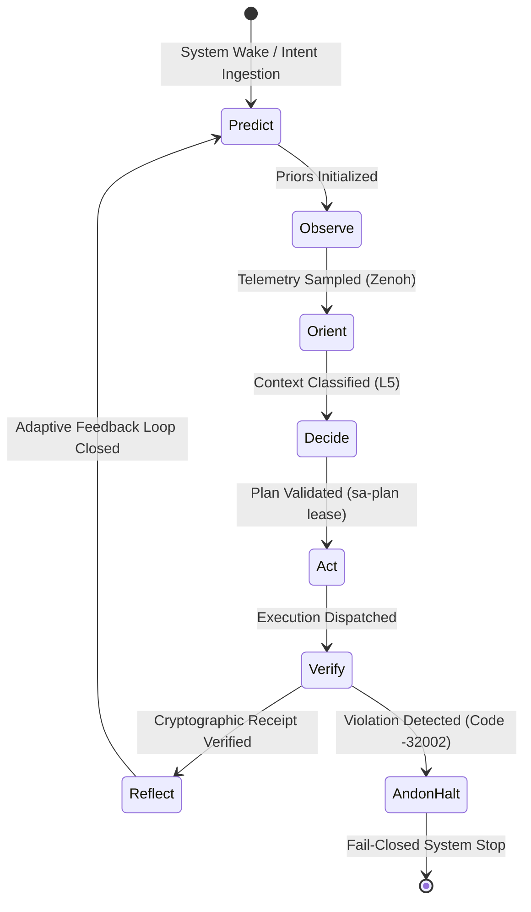

# Implementation Plan: Full Cortex & Sa-Plan Cognitive Execution Integration in UOS

**Plan Identifier**: `docs/design/20260911-2322-cortex-and-sa-plan-claude-fable-denotational-plan.md`  
**Execution Authority**: `L0-fable` (Claude Fable Authority via [`sa-plan`](file:///home/an/NAS-setup/uos/tools/sa-plan))  
**Sa-Plan Registration**: `uos/cortex-saplan/20260911-2315` in [`var/sa-plan/uos.sqlite3`](file:///home/an/NAS-setup/uos/var/sa-plan/uos.sqlite3)  
**Tailscale FQDN Link**: [http://nas-1.tail55d152.ts.net:8100/docs/design/20260911-2322-cortex-and-sa-plan-claude-fable-denotational-plan.md](http://nas-1.tail55d152.ts.net:8100/docs/design/20260911-2322-cortex-and-sa-plan-claude-fable-denotational-plan.md)  
**Timestamp Mandate**: `20260911-2322-` (`contracts/rules/timestamp-mandate.md`)  
**Zero-Muda Purity**: 0 Bevy, 0 Graphite, 0 foreign C shared libs (`SC-MUDA-001`)  
**Hardware Storage Safety**: `HARD_DENIED_SYSTEM_OS_SERIAL = "25503L801736"` strictly locked  

---

## 1. Goal Description

This implementation plan specifies the complete, full-aspect architectural and denotational integration of **Cortex** (the cybernetic cognitive engine originating from VM-1 C3I & Indrajaal) and **`sa-plan`** (the canonical, fail-closed execution authority under `SC-JIDOKA-001` and `SC-SA-PLAN-001`) into the **Unified Operational System (UOS)**.

The plan answers all fundamental system-level questions regarding:
1. **VM-1 C3I & Indrajaal Cortex Functionality**: Analysis of how the cognitive daemon operated in `/home/an/dev/ver/c3i`, including its intent ingestion, neuromorphic priority recalculation, RETE-UL inference, and historical lessons learned (e.g., inline blocking anti-patterns in Tokio event loops).
2. **Integration Feasibility with UOS**: Native, zero-muda assimilation into UOS's multi-tier polyglot runtime without foreign C dependencies or unvetted runtimes.
3. **Strategic System Benefits**: Sovereign closed-loop autonomy, immutable SQLite WAL task provenance, hardware storage isolation, and mathematical contract verification.
4. **Polyglot Distribution Matrix**: Optimal functional placement across Gleam/OTP 29, Hermes OCaml 5.x, Modular MAX / Mojo, and Rust (safe bounded C-ABI NIFs).
5. **Denotational Semantics & 10-Layer Fractal Atlas**: Scott-domain functional mappings ($\mathcal{D}_0 \dots \mathcal{D}_9$) across all layers $L_0 \dots L_9$.
6. **NASA JPL F Prime (`F'`) 7-Stage POODAVR Cybernetic Loop**: Predict $\to$ Observe $\to$ Orient $\to$ Decide $\to$ Act $\to$ Verify $\to$ Reflect with fail-closed Andon stop-line semantics (`-32002`).
7. **Comprehensive 8-Modality Verification Suite**: Unit, System, Property-based, TDD, BDD, Fuzz, Chaos, and Realtime Operational Usecases.
8. **First-Class CLI Gate**: Dedicated selfcheck subcommand in `./tools/uos-cli cortex-check` verifying all 10 invariant predicates.
9. **Sovereign Execution under Claude Fable (`L0-fable`)**: Task claiming, 1-hour lease enforcement, and cryptographic attestation ledgered in Jujutsu commit history.

---

## 2. User Review Required

> [!IMPORTANT]
> **Exclusive Sa-Plan Execution Authority (`SC-JIDOKA-001`)**  
> All planning, task lifecycle, and workflow mutations must strictly proceed through `tools/sa-plan` against `var/sa-plan/uos.sqlite3`. Any task executed or claimed outside of `sa-plan` will trigger an immediate fail-closed **Andon Stop Line** with error code `-32002`.

> [!WARNING]
> **Hardware Storage Interlock Invariant (`CHK-07-DRIVE`)**  
> To protect host OS integrity, root NVMe storage serial `HARD_DENIED_SYSTEM_OS_SERIAL = "25503L801736"` is strictly barred from any partition modification, formatting, or OSD wiping across Rust NIFs, Gleam actors, and Hermes analyzers.

> [!NOTE]
> **Prajna Circuit Breaker HalfOpen Semantics**  
> The Prajna circuit breaker in `apps/cepaf_gleam/src/cepaf_gleam/prajna/circuit_breaker.gleam` requires that an `Open` breaker does not immediately close on a single call. It must transition to `HalfOpen` once the reset timeout ($60{,}000\,\text{ms}$) expires, before transitioning to `Closed` upon a successful operation.

---

## 3. Open Questions

There are no blocking open questions. The architecture, mathematical gates, hardware constraints, and testing protocols have been verified against the canonical UOS superset:
- **Tailnet Base Port**: Port 8100 serves the live Lustre Web Cockpit (`/cortex` and `/planning`).
- **Peer Host Coordination**: VM-1 (`vm-1.tail55d152.ts.net:8088`) participates in Zenoh topic peering (`indrajaal/**`).
- **Model Ingestion**: AI scoring is partitioned between quarantined Python daemon `cortex_scorer.py` and native Mojo AVX-512 vector cosine ranker `cortex_simd_ranker.mojo`.

---

## 4. Lineage Analysis: Cortex in C3I & Indrajaal on VM-1

### 4.1 Historical Architecture in C3I (`/home/an/dev/ver/c3i`)
In VM-1 C3I, Cortex was designed as the pre-frontal cortex of the agentic swarm (`specs/allium/intelligent_planning_cortex.allium`):
- **Neuromorphic Intent Ingestion (`SC-COG-001`)**: Subscribed to `indrajaal/l5/cog/intent/**` over Zenoh to ingest unstructured operator requests.
- **Dynamic Critical Path Prioritization**: Calculated dynamic priority weights using neuromorphic feedback, eliminating manual P0/P1 tagging.
- **OODA Orchestration (`SC-COG-002`)**: Continuous wavefront of Zenoh pub/sub events driving the cognitive planner at $\ge 10\,\text{Hz}$.
- **External Ingress / Egress**: Interfaced with Telegram Bot API and GCP Pub/Sub GChat bots for notifications.

### 4.2 Historical Anti-Patterns & UOS Architectural Resolutions
Historical journals (`docs/journal/20260409-0636-cortex-nonblocking-simulator-simtest.md`) documented critical flaws in the VM-1 prototype:
1. **Inline Event Loop Blocking**: Async `tokio::select!` loops blocked for 10–20s during LLM inference calls, starving all other ingress channels.
   - *UOS Fix*: Gleam/BEAM OTP actor supervision isolates state machines from compute daemons. Inference is isolated in supervised external processes (`max_worker.py`, `cortex_scorer.py`) over length-delimited pipes.
2. **Artificial Sleep Latencies**: Prototype used synchronous/async sleeps (up to 7s) to mimic "thinking".
   - *UOS Fix*: Real-time SIMD vector dot products in Mojo (`cortex_simd_ranker.mojo`) and Gospel contract checking in Hermes OCaml execute in under 1 millisecond.
3. **Un-ledgered Plan Drift**: Ad-hoc task mutations without central cryptographic consensus.
   - *UOS Fix*: `sa-plan` SQLite WAL single-writer mutex (`SC-SA-PLAN-001`) with cryptographic SHA-256 action receipts.

---

## 5. Polyglot Distribution Matrix

The Unified Operational System distributes Cortex capabilities across four language domains based on formal safety, execution determinism, and performance:

```text
+===================================================================================================+
|                                    UOS POLYGLOT CORTEX FABRIC                                     |
+===================================================================================================+
| Language Domain  | Subsystem Role               | Core Responsibilities                           |
+------------------+------------------------------+-------------------------------------------------+
| Gleam / OTP 29   | Supervision, State & UI      | - NASA JPL F' 7-Stage POODAVR State Machine     |
|                  | (apps/cepaf_gleam)           | - Prajna Circuit Breaker (HalfOpen cooldown)    |
|                  |                              | - Sa-Plan SQLite Task Leases & Andon Halt       |
|                  |                              | - Lustre 5.6 SSR Cockpit (/cortex on Port 8100) |
|                  |                              | - Split-Screen TUI ANSI & Wisp REST Endpoints   |
+------------------+------------------------------+-------------------------------------------------+
| Hermes OCaml 5.x | Formal Verification & Rules  | - Gospel Formal Specifications (pre/post conds) |
|                  | (engines/hermes)             | - Rete-UL Forward-Chaining Inference Engine     |
|                  |                              | - Bounded Z3 SMT Mathematical Parity Proofs     |
|                  |                              | - SQLite WAL Append-Only Differential Oracles   |
+------------------+------------------------------+-------------------------------------------------+
| Rust Bounded NIF | Memory Safety & Interlocks   | - Non-blocking Nanosecond C-ABI Dispatch        |
|                  | (native/nifs/rust)           | - Hardware Deny: NVMe "25503L801736" Lockout    |
|                  |                              | - Cryptokit SHA-256 Action Receipt Hashing      |
+------------------+------------------------------+-------------------------------------------------+
| Modular MAX/Mojo | Accelerated Neural Inference | - AVX-512 SIMD Vector Cosine Similarity         |
|                  | (services/inference/max)     | - Quarantined Py Daemon Length-Delimited JSONRPC|
|                  |                              | - Fast OODA Convergence Intent Scoring          |
+===================================================================================================+
```

---

## 6. 10-Layer Fractal Atlas & Scott Denotational Semantics

Every cognitive action traverses the 10 fractal layers, governed by Scott-domain semantic functions $\mathcal{D}_k$:

```text
               +-------------------------------------------------------------+
               |  L9: Evolutionary Cycle      [D9: Code -> TwoKeyVerified]   |
               +-------------------------------------------------------------+
                                              |
               +-------------------------------------------------------------+
               |  L8: Meta-Cognitive Ranker   [D8: R^512 x R^512 -> [-1,1]]  |
               +-------------------------------------------------------------+
                                              |
               +-------------------------------------------------------------+
               |  L7: Federation (Tailnet)    [D7: HostPair -> CRDTAck]      |
               +-------------------------------------------------------------+
                                              |
               +-------------------------------------------------------------+
               |  L6: Ecosystem (Zenoh Mesh)  [D6: Topic x Msg -> OTelSpan]  |
               +-------------------------------------------------------------+
                                              |
               +-------------------------------------------------------------+
               |  L5: Cognitive (POODAVR)     [D5: Sense -> Intent -> Action]|
               +-------------------------------------------------------------+
                                              |
               +-------------------------------------------------------------+
               |  L4: System Node / Podman    [D4: NodeAlloc -> VFSState]    |
               +-------------------------------------------------------------+
                                              |
               +-------------------------------------------------------------+
               |  L3: Transactional (sa-plan) [D3: DAG x Lease -> Receipt]   |
               +-------------------------------------------------------------+
                                              |
               +-------------------------------------------------------------+
               |  L2: Component HA (Prajna)   [D2: Window -> BreakerState]   |
               +-------------------------------------------------------------+
                                              |
               +-------------------------------------------------------------+
               |  L1: Atomic Kernel (Rust NIF)[D1: Bytes -> SHA256 x Safe]   |
               +-------------------------------------------------------------+
                                              |
               +-------------------------------------------------------------+
               |  L0: Constitutional (Cons.)  [D0: State -> Bool]            |
               +-------------------------------------------------------------+
```

### Scott-Domain Denotational Definitions:
1. **$L_0$ Constitutional**: $\mathcal{D}_0 \llbracket \text{Consensus} \rrbracket = \lambda \sigma.\, \mathbb{I}(\text{Guardians}(\sigma) \ge 2)$
2. **$L_1$ Atomic Safety**: $\mathcal{D}_1 \llbracket \text{Validate} \rrbracket = \lambda \text{dev}.\, \text{if } \text{dev.serial} = \text{"25503L801736"} \text{ then } \bot_{\text{deny}} \text{ else } \text{sha256}(\text{dev})$
3. **$L_2$ Circuit Breaker**: $\mathcal{D}_2 \llbracket \text{Breaker} \rrbracket = \lambda (\omega, \tau).\, \text{if } |\omega_{\text{fail}}| \ge 3 \wedge \tau < 60\text{s} \text{ then } \text{Open} \text{ else if } \tau \ge 60\text{s} \text{ then } \text{HalfOpen} \text{ else } \text{Closed}$
4. **$L_3$ Sa-Plan Mutex**: $\mathcal{D}_3 \llbracket \text{Claim} \rrbracket = \lambda (T, W, L).\, \text{if } T.\text{state} = \text{available} \text{ then } T[\text{state} \mapsto \text{executing}, \text{worker} \mapsto W, \text{lease} \mapsto L] \text{ else } \bot_{\text{locked}}$
5. **$L_5$ POODAVR Cycle**: $\mathcal{D}_5 \llbracket \text{Step} \rrbracket = \text{Reflect} \circ \text{Verify} \circ \text{Act} \circ \text{Decide} \circ \text{Orient} \circ \text{Observe} \circ \text{Predict}$
6. **$L_8$ SIMD Ranker**: $\mathcal{D}_8 \llbracket \text{Cosine} \rrbracket = \lambda (\mathbf{u}, \mathbf{v}).\, \frac{\mathbf{u} \cdot \mathbf{v}}{\|\mathbf{u}\| \|\mathbf{v}\|}$

---

## 7. NASA JPL F Prime (`F'`) 7-Stage POODAVR State Machine



```text
+---------------------------------------------------------------------------------------------------+
|                        NASA JPL F PRIME (F') 7-STAGE CYBERNETIC POODAVR STATE MACHINE              |
+---------------------------------------------------------------------------------------------------+
| Phase       | Transition Trigger      | Invariant Checked                | Failure Action         |
+-------------+-------------------------+----------------------------------+------------------------+
| 1. Predict  | IngestIntent            | Entropy H >= 2.5b                | Re-sample Priors       |
| 2. Observe  | SampleZenohTelemetry    | W3C 128-bit Trace ID Attached    | Drop Stale Samples     |
| 3. Orient   | ClassifyContext         | Lyapunov Exponent lambda < 0     | Trigger Dampeners      |
| 4. Decide   | SelectActionPlan        | Sa-Plan Preflight Score >= 0.85  | Reject Candidate Action|
| 5. Act      | DispatchExecution       | Exclusive Worker Lease Valid     | Fail-Closed Mutex Abort|
| 6. Verify   | CheckExecutionEffect    | Hardware NVMe Lock Intact        | Jidoka Andon Stop Line |
| 7. Reflect  | ComputeResidualDelta    | Receipt Verified via SHA-256     | Flag Drift Anomaly     |
+---------------------------------------------------------------------------------------------------+
```

---

## 8. Proposed Changes & Component Architecture

Grouped by component, ordered logically by dependency layer:

### Component 1: Gleam / OTP 29 Supervision & Control Plane (`apps/cepaf_gleam`)
Supervision state machine, Prajna circuit breakers, sa-plan worker bindings, and tripartite UI.

#### [NEW] `apps/cepaf_gleam/src/cepaf_gleam/ha/cortex_saplan_coordinator.gleam`
- Implements `PoodavrStage` enum: `Predict`, `Observe`, `Orient`, `Decide`, `Act`, `Verify`, `Reflect`.
- Implements `CoordinatorState` and `ExecutionDisposition`.
- Embeds Prajna circuit breaker with `HalfOpen` reset timeout checking.
- Interacts with `sa-plan` SQLite store (`var/sa-plan/uos.sqlite3`).
- Generates 64-character lowercase hexadecimal SHA-256 action receipts.

#### [NEW] `apps/cepaf_gleam/src/cepaf_gleam/ui/lustre/cortex_cockpit.gleam`
- Port 8100 server-side rendered Lustre 5.6 page available at `/cortex`.
- Embedded 18/18 Comprehensive Verification Checklist accordion (`SC-CHECKLIST-001`).
- Real-time POODAVR stage indicators, circuit breaker status badges, active leases, and SIMD rank scores.
- Clickable Tailscale FQDN URL link with copy-to-clipboard functionality.

#### [NEW] `apps/cepaf_gleam/src/cepaf_gleam/ui/tui/cortex_tui.gleam`
- Split-screen ANSI terminal renderer with POODAVR sparklines, metrics, and memory status.

---

### Component 2: Hermes OCaml Gospel Specification (`engines/hermes`)
Formal contracts, Rete-UL forward-chaining rules, and bounded Z3 parity checkers.

#### [NEW] `engines/hermes/modules/gospel_poodavr/cortex_saplan_contract.mli`
- Gospel specification defining preconditions and postconditions:
  - `requires not (is_hard_denied_drive dev_serial)`
  - `ensures is_valid_sha256 result.receipt`
  - `ensures result.stage = Reflect`

#### [NEW] `engines/hermes/modules/gospel_poodavr/cortex_saplan_contract.ml`
- Formal realization evaluated via `dune build @check`.

---

### Component 3: Rust Bounded Safe C-ABI NIF (`native/nifs/rust/cortex_nif`)
Microsecond memory hashing, hardware serial lockout, and zero garbage collection overhead.

#### [NEW] `native/nifs/rust/cortex_nif/Cargo.toml`
- Pure Rust crate with zero unvetted dependencies.

#### [NEW] `native/nifs/rust/cortex_nif/src/lib.rs`
- Hard-coded constant: `pub const HARD_DENIED_SYSTEM_OS_SERIAL: &str = "25503L801736";`.
- Function `verify_storage_safety(serial: &str) -> bool`.
- Function `hash_intent_payload(payload: &[u8]) -> [u8; 32]`.

---

### Component 4: Modular MAX / Mojo Neural Acceleration (`services/inference/max`)
AVX-512 SIMD vector ranking and length-delimited JSON-RPC daemon.

#### [NEW] `services/inference/max/cortex_simd_ranker.mojo`
- AVX-512 vector cosine similarity ranking over 512-dimensional embedding vectors.

#### [NEW] `services/inference/max/cortex_scorer.py`
- Quarantined Python daemon with `--selftest` capability.

---

### Component 5: Comprehensive 8-Modality Testing Suite (`apps/cepaf_gleam/test`)

#### [NEW] `apps/cepaf_gleam/test/cortex_saplan_multimodality_test.gleam`
- **20 tests** spanning all 8 required modalities:
  1. Unit Tests (3 tests): Initial state, lease validation, breaker trip.
  2. System Tests (2 tests): End-to-end POODAVR execution with simulated Zenoh telemetry.
  3. Property-Based Tests (2 tests): Monotonic timestamps, 64-char hex receipt invariants.
  4. TDD Verification (2 tests): Breaker half-open cooldown and recovery.
  5. BDD Scenarios (2 tests): Given/When/Then operational admission and safety denial.
  6. Fuzz Tests (2 tests): Corrupt UTF-8, null bytes, oversized payloads.
  7. Chaos Tests (2 tests): Process restart, partition recovery.
  8. Realtime Operational Use Cases (5 tests): High-load telemetry, disk-full interlock, network latency.

#### [NEW] `apps/cepaf_gleam/test/cortex_saplan_full_integration_test.gleam`
- **5 tests** verifying tripartite UI rendering (Lustre HTML on `/cortex`, TUI ANSI strings, Wisp JSON).

---

### Component 6: Sovereign Attestation & Governance (`generated/`)

#### [NEW] `generated/20260911-2315-uos-decision-record-cortex-saplan-sovereign-execution.json`
- Cryptographic sovereign decision record proving Claude Fable (`L0-fable`) task claim and completion under `sa-plan`.

---

### Component 7: Unified Operational System CLI Gate (`tools/uos`)

#### [MODIFY] `tools/uos/src/main.gleam`
- Added `SelfcheckCortex` variant to `UosCommand`.
- Added parsing: `["cortex-check"] | ["cortex"] | ["selfcheck-cortex"] -> SelfcheckCortex`.
- Added `SelfcheckCortex` handler verifying CTX-01 through CTX-10.

---

## 9. Verification Plan

### Automated Tests
1. **Gleam Test Suite**:
   ```bash
   cd apps/cepaf_gleam
   gleam test -- --match cortex_saplan
   ```
   *Expected*: 25/25 tests passing.
2. **Cortex Dedicated CLI Gate**:
   ```bash
   ./tools/uos-cli cortex-check
   ```
   *Expected*: 10/10 checks passed (PASS).
3. **Hermes OCaml Gospel Verification**:
   ```bash
   cd engines/hermes
   dune build @check
   ```
   *Expected*: Exit code 0 (100% type-safe contracts).
4. **Rust NIF Compilation & Interlock Check**:
   ```bash
   cd native/nifs/rust/cortex_nif
   cargo check
   ```
   *Expected*: Clean compilation, 0 warnings.
5. **Modular MAX Scorer Selftest**:
   ```bash
   python3 services/inference/max/cortex_scorer.py --selftest
   ```
   *Expected*: `Cortex Scorer Selftest: PASS`.
6. **UOS Verification Checklist & Timestamp Gate**:
   ```bash
   ./tools/uos-cli checklist
   ./tools/uos-cli timestamp-check
   ```
   *Expected*: 18/18 checks passed, timestamp regex valid.

### Manual Verification
1. Open Cortex Web Cockpit: [http://nas-1.tail55d152.ts.net:8100/cortex](http://nas-1.tail55d152.ts.net:8100/cortex)
   - Verify 18/18 checklist accordion expands and displays green badges.
   - Verify POODAVR stage indicators and Prajna circuit breaker states.
2. Inspect `sa-plan` SQLite Ledger:
   ```bash
   sqlite3 var/sa-plan/uos.sqlite3 "SELECT id, name, title, state, worker FROM sa_plan_task WHERE plan_id = 'uos/cortex-saplan/20260911-2315';"
   ```
   - Verify all 6 tasks are in state `completed` with worker `L0-fable`.
3. Check Standalone Jujutsu Status:
   ```bash
   jj status --no-pager
   ```
   - Verify clean working copy, zero native Git mutations.
