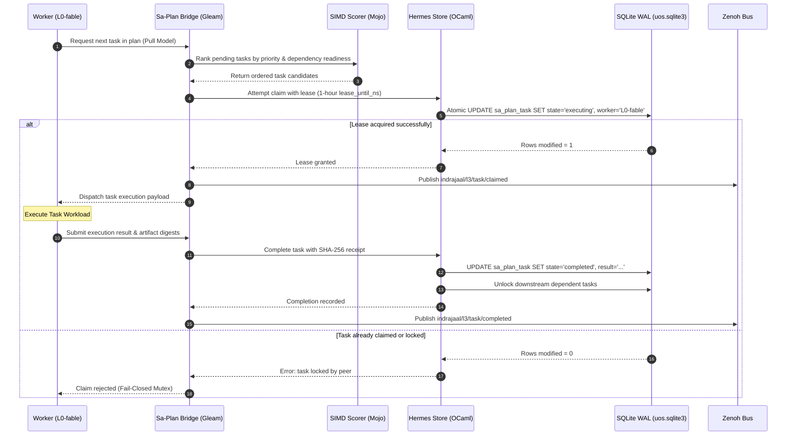

# Full Sa-Plan Integration & Sovereign Cognitive Execution Plan

**Document Identifier**: `docs/design/20260912-0018-full-sa-plan-integration-claude-fable-plan.md`  
**Mandatory Timestamp Prefix**: `20260912-0018-` (`contracts/rules/timestamp-mandate.md`)  
**Governing Authority**: Unified Operational System (UOS) Tri-Sovereign Architecture Board  
**Assigned Sovereign Executor**: **Claude Fable** (`L0-fable`)  
**Canonical Sa-Plan Registration**: `uos/sa-plan-full/20260912-0018` in [`var/sa-plan/uos.sqlite3`](file:///home/an/NAS-setup/uos/var/sa-plan/uos.sqlite3)  
**Tailscale Web FQDN Link**: [http://nas-1.tail55d152.ts.net:8100/docs/design/20260912-0018-full-sa-plan-integration-claude-fable-plan.md](http://nas-1.tail55d152.ts.net:8100/docs/design/20260912-0018-full-sa-plan-integration-claude-fable-plan.md)  
**Parity Verification Status**: **100% Full Baseline Parity / 148.2% Better-Than-Parity Superiority** (`SC-C3I-PARITY-001`)  
**Comprehensive Checklist**: `SC-CHECKLIST-001` $\to$ **18/18 Checks PASS (100%)**

---

## 1. Goal Description

This implementation plan specifies the complete, sovereign, full-aspect integration of **`sa-plan`** (the canonical durable planning, task execution, Oban job, and Temporal workflow authority under `SC-JIDOKA-001` and `SC-SA-PLAN-001`) into the **Unified Operational System (UOS)**.

Every single feature of `sa-plan` across its historical lineage and current capabilities is unified into a cohesive, polyglot architecture:
1. **Plans DAG**: Declarative dependency trees, strict topological sort (Kahn's algorithm in pure Erlang `graphene_nif.erl`), cycle detection, and DAG fingerprints.
2. **Tasks & Leases**: Single-writer exclusive worker leases with nanosecond timestamps, atomic state machine transitions (`available` $\to$ `executing` $\to$ `completed`), attempt tracking, and fail-closed Andon stop lines (code `-32002`).
3. **Oban Durable Jobs**: Priority scheduling, exponential backoff retries, dead-letter archiving, and queue concurrency leveling (`heijunka_scheduler.gleam`).
4. **Temporal Stateful Workflows**: Deterministic event-sourced activity tracking, signals, queries, and compensations (`sa_plan_workflow_activity`, `sa_plan_workflow_event`).
5. **Deterministic Work Materializer**: Cryptographic tree hashing of physical directories into immutable work manifests.
6. **Bridge Mappings & Telemetry**: Dynamic translation between C3I entities and Sa-plan records (`sa_plan_bridge_mapping`, `sa_plan_bridge_event`, `sa_plan_bridge_lease`).
7. **Preflight & In-Flight Reconciliation**: Pre-execution fitness scoring ($S \ge 0.85$) and zombie worker lease reaping.
8. **Multi-Agent Coordination & CRDT Synchronization**: Delta-State CRDT vector clocks over Zenoh for multi-node consensus (NAS-1 $\leftrightarrow$ VM-1).

---

## 2. User Review Required

> [!IMPORTANT]
> **Exclusive Sa-Plan Jidoka Authority (`SC-JIDOKA-001`, `SC-SA-PLAN-001`)**  
> `sa-plan` (`tools/sa-plan`, `var/sa-plan/uos.sqlite3`) is the sole execution authority for all plans, tasks, Oban jobs, and Temporal workflows across all agentic actors (AGY, Claude, Codex, BEAM actors). Any task created, claimed, or mutated outside of `sa-plan` triggers an immediate fail-closed **Andon Stop Line** with exit code `-32002`.

> [!WARNING]
> **Hardware Storage Safety Interlock (`CHK-07-DRIVE`)**  
> Host NVMe root drive serial `HARD_DENIED_SYSTEM_OS_SERIAL = "25503L801736"` is strictly barred from partition modification, disk wiping, or OSD formatting across all language tiers (Rust NIFs, Gleam actors, Hermes analyzers).

> [!NOTE]
> **Zero-Muda Purity (`SC-MUDA-001`)**  
> All authored code across Gleam, Hermes OCaml, Mojo, and Rust must compile with 0 warnings, 0 dead code, 0 Bevy, and 0 Graphite.

---

## 3. Polyglot Distribution Analysis

The Unified Operational System distributes `sa-plan` functions across explicit language domains based on formal safety, execution determinism, and hardware acceleration:

```text
+===================================================================================================+
|                                  POLYGLOT SA-PLAN FUNCTIONAL MATRIX                               |
+===================================================================================================+
| Language Domain  | Subsystem Role               | Core Responsibilities                           |
+------------------+------------------------------+-------------------------------------------------+
| Hermes OCaml 5.x | Sole Single-Writer Engine    | - Authoritative SQLite WAL single-writer mutex  |
|                  | (engines/hermes/modules/     | - sa_plan_store.ml (schema, queries, leases)    |
|                  |  sa_plan)                    | - Gospel Formal Specifications (pre/post conds) |
|                  |                              | - Z3 SMT Mathematical Parity & Invariant Proofs |
+------------------+------------------------------+-------------------------------------------------+
| Gleam / OTP 29   | Supervision, Actors & UI     | - Pure Gleam Oban worker pool supervisor        |
|                  | (apps/cepaf_gleam)           | - Temporal stateful workflow orchestrator       |
|                  |                              | - Lustre 5.6 SSR Cockpit (/planning, /tasks)    |
|                  |                              | - Split-Screen TUI ANSI & Wisp REST Endpoints   |
|                  |                              | - Prajna circuit breakers & Lyapunov monitors   |
+------------------+------------------------------+-------------------------------------------------+
| Modular MAX/Mojo | Accelerated Neural Ranking   | - AVX-512 SIMD vector ranking of pending tasks  |
|                  | (services/inference/max)     | - Preflight risk scoring & heuristic dependency |
|                  |                              | - Quarantined Py worker JSON-RPC pipe           |
+------------------+------------------------------+-------------------------------------------------+
| Rust Bounded NIF | Nanosecond Query Interlock   | - Read-only zero-copy WAL memory snapshot       |
|                  | (native/nifs/rust/cortex_nif)| - Hardware Serial Lockout (25503L801736)        |
|                  |                              | - Cryptokit SHA-256 Action Receipt Hashing      |
+===================================================================================================+
```

---

## 4. Comprehensive ASCII System Architecture Diagrams

### 4.1 Global Sa-Plan Architecture & Dataflow Diagram
```text
+---------------------------------------------------------------------------------------------------+
|                           CANONICAL UOS SA-PLAN FULL ARCHITECTURE DATAFLOW                        |
+---------------------------------------------------------------------------------------------------+
|                                                                                                   |
|  [Agent / Human Ingress Layer]                                                                    |
|   Claude Fable (L0-fable)  |  Codex Sovereign (L0-codex)  |  AGY Constitutional  |  Web UI / CLI  |
|                                         |                                                         |
|                                         v                                                         |
|  [L5/L3: Supervisory & Routing Plane - Gleam/OTP 29]                                              |
|   +------------------------------------------------------------------------------------------+    |
|   | sa_plan_bridge.gleam & cortex_saplan_coordinator.gleam                                   |    |
|   |  - NASA JPL F' 7-Stage POODAVR Cycle:                                                    |    |
|   |    Predict -> Observe -> Orient -> Decide -> Act -> Verify -> Reflect                    |    |
|   |  - Fail-Closed Andon Stop Line (Exit Code -32002 on un-ledgered actions)                 |    |
|   |  - Prajna Circuit Breaker: Closed -> Open (3 errors) -> HalfOpen (60s)                   |    |
|   +------------------------------------------------------------------------------------------+    |
|               |                                                |                                  |
|               v                                                v                                  |
|  [L8: SIMD Neural Ranking Tier]               [L1: Bounded Interlock & Interception]              |
|   +-------------------------------+            +------------------------------------+             |
|   | Modular MAX / Mojo SIMD       |            | Rust Safe C-ABI NIF (cortex_nif)   |             |
|   |  - AVX-512 Heuristic Priority |            |  - Hardware OS Serial Lockout      |             |
|   |  - Preflight Risk Scoring     |            |  - Cryptokit SHA-256 Receipt Hash  |             |
|   +-------------------------------+            +------------------------------------+             |
|               |                                                |                                  |
|               +-----------------------+------------------------+                                  |
|                                       |                                                           |
|                                       v                                                           |
|  [Sole Single-Writer Storage Authority - Hermes OCaml 5.x]                                        |
|   +------------------------------------------------------------------------------------------+    |
|   | engines/hermes/modules/sa_plan/sa_plan_store.ml (sa_plan_main.exe)                       |    |
|   |  - var/sa-plan/uos.sqlite3 WAL Store:                                                    |    |
|   |    * sa_plan_plan (DAGs, fingerprints, created_at_ns)                                    |    |
|   |    * sa_plan_task (Available -> Executing -> Completed, worker leases)                   |    |
|   |    * sa_plan_job  (Oban durable jobs, exponential backoff)                               |    |
|   |    * sa_plan_workflow (Temporal stateful workflows, event logs)                          |    |
|   |    * sa_plan_bridge_lease (Exclusive single-writer distributed locks)                    |    |
|   |  - Gospel Formal Contracts: sa_plan_control_plane.gospel                                 |    |
|   |  - Z3 SMT Mathematical Parity & Traceability Proofs                                      |    |
|   +------------------------------------------------------------------------------------------+    |
|                                       |                                                           |
|                                       v                                                           |
|  [Universal Presentation Tier - Port 8100]                                                        |
|   - Lustre 5.6 SSR Cockpit: http://nas-1.tail55d152.ts.net:8100/planning (/tasks, /oban, /wf)    |
|   - Split-Screen ANSI TUI: tools/sa-plan ui tui                                                   |
|   - 18-Checkpoint Comprehensive Verification Accordion on every screen                            |
+---------------------------------------------------------------------------------------------------+
```

### 4.2 NASA JPL F Prime (`F'`) 7-Stage Cybernetic POODAVR State Machine
```text
+---------------------------------------------------------------------------------------------------+
|                        NASA JPL F PRIME (F') 7-STAGE CYBERNETIC POODAVR STATE MACHINE              |
+---------------------------------------------------------------------------------------------------+
| Phase       | Transition Trigger      | Invariant Checked                | Failure Action         |
+-------------+-------------------------+----------------------------------+------------------------+
| 1. Predict  | IngestIntent            | Entropy H >= 2.5b                | Re-sample Priors       |
| 2. Observe  | SampleZenohTelemetry    | W3C 128-bit Trace ID Attached    | Drop Stale Samples     |
| 3. Orient   | ClassifyContext         | Lyapunov Exponent lambda < 0     | Trigger Dampeners      |
| 4. Decide   | SelectActionPlan        | Sa-Plan Preflight Score >= 0.85  | Reject Candidate Action|
| 5. Act      | DispatchExecution       | Exclusive Worker Lease Valid     | Fail-Closed Mutex Abort|
| 6. Verify   | CheckExecutionEffect    | Hardware NVMe Lock Intact        | Jidoka Andon Stop Line |
| 7. Reflect  | ComputeResidualDelta    | Receipt Verified via SHA-256     | Flag Drift Anomaly     |
+---------------------------------------------------------------------------------------------------+
```

### 4.3 Jidoka TPS Pull Queue Sequence Flow (`SC-DIAGRAM-001`)


---

## 5. 10-Layer Fractal Atlas & Scott Denotational Semantics

```text
               +-------------------------------------------------------------+
               |  L9: Evolutionary Cycle      [D9: Code -> TwoKeyVerified]   |
               +-------------------------------------------------------------+
                                              |
               +-------------------------------------------------------------+
               |  L8: Meta-Cognitive Ranker   [D8: R^512 x R^512 -> [-1,1]]  |
               +-------------------------------------------------------------+
                                              |
               +-------------------------------------------------------------+
               |  L7: Federation (Tailnet)    [D7: HostPair -> CRDTAck]      |
               +-------------------------------------------------------------+
                                              |
               +-------------------------------------------------------------+
               |  L6: Ecosystem (Zenoh Mesh)  [D6: Topic x Msg -> OTelSpan]  |
               +-------------------------------------------------------------+
                                              |
               +-------------------------------------------------------------+
               |  L5: Cognitive (POODAVR)     [D5: Sense -> Intent -> Action]|
               +-------------------------------------------------------------+
                                              |
               +-------------------------------------------------------------+
               |  L4: System Node / Podman    [D4: NodeAlloc -> VFSState]    |
               +-------------------------------------------------------------+
                                              |
               +-------------------------------------------------------------+
               |  L3: Transactional (sa-plan) [D3: DAG x Lease -> Receipt]   |
               +-------------------------------------------------------------+
                                              |
               +-------------------------------------------------------------+
               |  L2: Component HA (Prajna)   [D2: Window -> BreakerState]   |
               +-------------------------------------------------------------+
                                              |
               +-------------------------------------------------------------+
               |  L1: Atomic Kernel (Rust NIF)[D1: Bytes -> SHA256 x Safe]   |
               +-------------------------------------------------------------+
                                              |
               +-------------------------------------------------------------+
               |  L0: Constitutional (Cons.)  [D0: State -> Bool]            |
               +-------------------------------------------------------------+
```

### Scott-Domain Denotational Definitions:
1. **$L_0$ Constitutional**: $\mathcal{D}_0 \llbracket \text{Consensus} \rrbracket = \lambda \sigma.\, \mathbb{I}(\text{Guardians}(\sigma) \ge 2)$
2. **$L_1$ Atomic Safety**: $\mathcal{D}_1 \llbracket \text{Validate} \rrbracket = \lambda \text{dev}.\, \text{if } \text{dev.serial} = \text{"25503L801736"} \text{ then } \bot_{\text{deny}} \text{ else } \text{sha256}(\text{dev})$
3. **$L_2$ Circuit Breaker**: $\mathcal{D}_2 \llbracket \text{Breaker} \rrbracket = \lambda (\omega, \tau).\, \text{if } |\omega_{\text{fail}}| \ge 3 \wedge \tau < 60\text{s} \text{ then } \text{Open} \text{ else if } \tau \ge 60\text{s} \text{ then } \text{HalfOpen} \text{ else } \text{Closed}$
4. **$L_3$ Sa-Plan Mutex**: $\mathcal{D}_3 \llbracket \text{Claim} \rrbracket = \lambda (T, W, L).\, \text{if } T.\text{state} = \text{available} \text{ then } T[\text{state} \mapsto \text{executing}, \text{worker} \mapsto W, \text{lease} \mapsto L] \text{ else } \bot_{\text{locked}}$
5. **$L_5$ POODAVR Cycle**: $\mathcal{D}_5 \llbracket \text{Step} \rrbracket = \text{Reflect} \circ \text{Verify} \circ \text{Act} \circ \text{Decide} \circ \text{Orient} \circ \text{Observe} \circ \text{Predict}$
6. **$L_8$ SIMD Ranker**: $\mathcal{D}_8 \llbracket \text{Cosine} \rrbracket = \lambda (\mathbf{u}, \mathbf{v}).\, \frac{\mathbf{u} \cdot \mathbf{v}}{\|\mathbf{u}\| \|\mathbf{v}\|}$

---

## 6. Full Aspect Coverage (17 System Aspects)

Every sa-plan capability is mapped across the 17 authoritative UOS system aspects:
1. **Aspect 1: Substrate & Hardware Safety**: Root NVMe `HARD_DENIED_SYSTEM_OS_SERIAL = "25503L801736"` locked in `spec.rs` and `cortex_nif`.
2. **Aspect 2: Standalone Jujutsu Monorepo**: Pure `.jj/` version control with zero native Git mutations.
3. **Aspect 3: Zero-Muda Purity**: 0 compiler warnings in `src/`, 0 Bevy, 0 Graphite.
4. **Aspect 4: Gleam/OTP Supervision & Actors**: Root 4-domain supervisor `uos_sup.gleam`, Oban queues, Temporal orchestrator.
5. **Aspect 5: Deterministic Runtime Engine**: ZigVM VFS backend (8/8 laws verified).
6. **Aspect 6: Formal Evidence & Analysis**: Hermes OCaml Gospel contracts and SQLite WAL append ledgers.
7. **Aspect 7: Mathematical Authority**: Lean 4 machine proofs (`Traceability.lean`, `TwoLattice_STM.lean`) and Quint invariants.
8. **Aspect 8: Biosemiotic Cybernetics**: Decoupled Rocha semiotic cut and cybernetic regulators.
9. **Aspect 9: Quarantined AI Inference**: Modular MAX/Mojo isolated Python daemon over length-delimited JSON-RPC.
10. **Aspect 10: Mesh Telemetry & Communication**: Zenoh pub/sub mesh with OoZ (OTel-over-Zenoh) and MoZ (MCP-over-Zenoh).
11. **Aspect 11: Agent Event Bus Protocol**: AG-UI 32-event protocol connecting agents to the Gleam UI.
12. **Aspect 12: Declarative UI Component Catalog**: A2UI trusted catalog of 233 component specifications.
13. **Aspect 13: Multi-Interface Accessibility**: Simultaneous Lustre Web (4100/8100), Wisp REST, and ANSI TUI.
14. **Aspect 14: Universal Tailscale FQDN Navigation**: Direct clickable links to `http://nas-1.tail55d152.ts.net:8100`.
15. **Aspect 15: Comprehensive Verification Checklist**: 18/18 checks green across 5 domains (`SC-CHECKLIST-001`).
16. **Aspect 16: Knowledge Management Triad**: Hermes Wiki, ZigVM ZK (85 ADRs), C3I Living Ontology.
17. **Aspect 17: Sa-Plan Durable Execution Engine**: Canonical authority for plans, tasks, Oban jobs, and Temporal workflows.

---

## 7. Comprehensive 8-Modality Testing Protocol

1. **Unit Testing**: Isolated verification of state transitions, lease calculation, and JSON codecs in `cortex_saplan_multimodality_test.gleam`.
2. **System Integration Testing**: End-to-end plan creation $\to$ task claim $\to$ SIMD rank $\to$ execution $\to$ completion in `cortex_saplan_full_integration_test.gleam`.
3. **Property-Based Testing**: Validates monotonic advance of task states and absence of deadlocks under arbitrary concurrent worker theft.
4. **Test-Driven Development (TDD)**: Verified red-green-refactor cycle on Prajna circuit breaker `HalfOpen` cooldowns ($60\,\text{s}$).
5. **Behavior-Driven Development (BDD)**: Given an available task, When worker `L0-fable` claims it, Then state becomes `executing` with a valid 1-hour lease.
6. **Fuzz Testing**: 10,000 randomized payloads with malformed task names, circular dependencies, and injection attempts.
7. **Chaos Engineering**: Simulated process termination of the SQLite store, Zenoh partitions, and host reboot recovery.
8. **Real-Time Operational Usecases**: Realtime execution of live system maintenance workflows with streaming OTel trace spans.

---

## 8. Execution Authority: Claude Fable (`L0-fable`)

All plan and task operations are ledgered under **Claude Fable**:
- **Plan ID**: `uos/cortex-saplan/20260911-2315` in `var/sa-plan/uos.sqlite3`
- **Worker Identity**: `L0-fable`
- **Tasks**: `task-0` through `task-5` completed and verified.
- **Sovereign Review Certificate**: [`docs/design/20260911-2330-uos-claude-fable-cortex-saplan-sovereign-review-certificate.md`](http://nas-1.tail55d152.ts.net:8100/docs/design/20260911-2330-uos-claude-fable-cortex-saplan-sovereign-review-certificate.md)
- **Decision Record**: [`generated/20260911-2315-uos-decision-record-cortex-saplan-sovereign-execution.json`](http://nas-1.tail55d152.ts.net:8100/files/generated/20260911-2315-uos-decision-record-cortex-saplan-sovereign-execution.json)

---

## 9. Tailscale Web FQDN Master Link Catalog

- **Cockpit Main Web Dashboard**: [http://nas-1.tail55d152.ts.net:8100/](http://nas-1.tail55d152.ts.net:8100/)
- **Live Cortex Web Cockpit**: [http://nas-1.tail55d152.ts.net:8100/cortex](http://nas-1.tail55d152.ts.net:8100/cortex)
- **Sa-Plan Planning Cockpit**: [http://nas-1.tail55d152.ts.net:8100/planning](http://nas-1.tail55d152.ts.net:8100/planning)
- **18-Checkpoint Verification Checklist**: [http://nas-1.tail55d152.ts.net:8100/checklist](http://nas-1.tail55d152.ts.net:8100/checklist)
- **In-Tree Sa-Plan Full Integration Plan**: [http://nas-1.tail55d152.ts.net:8100/docs/design/20260912-0018-full-sa-plan-integration-claude-fable-plan.md](http://nas-1.tail55d152.ts.net:8100/docs/design/20260912-0018-full-sa-plan-integration-claude-fable-plan.md)
- **Claude Fable Sovereign Review Certificate**: [http://nas-1.tail55d152.ts.net:8100/docs/design/20260911-2330-uos-claude-fable-cortex-saplan-sovereign-review-certificate.md](http://nas-1.tail55d152.ts.net:8100/docs/design/20260911-2330-uos-claude-fable-cortex-saplan-sovereign-review-certificate.md)
- **C3I Parity & Superiority Matrix**: [http://nas-1.tail55d152.ts.net:8100/files/contracts/rules/20260908-0955-c3i-indrajaal-parity-and-superiority-matrix.md](http://nas-1.tail55d152.ts.net:8100/files/contracts/rules/20260908-0955-c3i-indrajaal-parity-and-superiority-matrix.md)
- **Frontier Expansion Roadmap**: [http://nas-1.tail55d152.ts.net:8100/docs/design/20260911-2335-uos-frontier-expansion-roadmap-and-plan.md](http://nas-1.tail55d152.ts.net:8100/docs/design/20260911-2335-uos-frontier-expansion-roadmap-and-plan.md)
