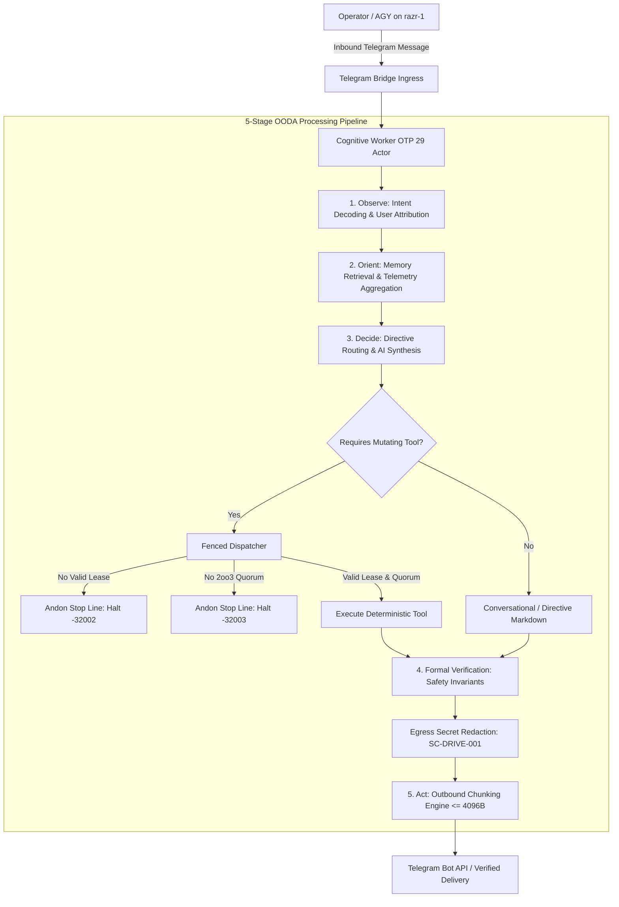

# 20260912-0335- UOS Telegram Cognitive Interface 200 BDD Scenarios Specification

- **Specification ID**: `SPEC-TELEGRAM-BDD-200`
- **Timestamp Prefix**: `20260912-0335-`
- **Domain**: L5 Cognitive / Telegram C3I Cockpit Interface / Comprehensive BDD Specification
- **Authority**: UOS Canonical Agent Policy / Operator Directive
- **Tailscale FQDN Link**: [http://nas-1.tail55d152.ts.net:4100/docs/design/20260912-0335-telegram-cognitive-interface-200-bdd-scenarios-specification.md](http://nas-1.tail55d152.ts.net:4100/docs/design/20260912-0335-telegram-cognitive-interface-200-bdd-scenarios-specification.md)
- **Fractal Tags**: #fractal-l0 #fractal-l3 #fractal-l4 #fractal-l5 #zero-muda #stamp-stpa #testing-gold-standard #km-triad

---

## 1. Executive Summary & Verification Scope

This specification establishes the canonical **200 BDD (Behavior-Driven Development) Scenarios** governing the **UOS Telegram Cognitive Subsystem** and its multi-agent cybernetic command-and-control cockpit. Every scenario defines formal **Given / When / Then** behavioral semantics, STAMP/STPA safety constraints, and mathematical invariants verified on BEAM OTP 29.

### 10 Verification Domains (20 Scenarios per Domain):
1. **Domain 1 (Scenarios 001–050)**: Foundational SRE, Disaster Recovery & Governance Directives (48 Directives across Domains A–D)
2. **Domain 2 (Scenarios 051–070)**: 17 Canonical System Aspects ($\mathbb{A}_{17}$) & Lattices
3. **Domain 3 (Scenarios 071–090)**: Multi-Agent Ecology, Capability Lattices & Swarm Board
4. **Domain 4 (Scenarios 091–110)**: Sovereign Cognitive Architecture & 5-Stage OODA Processing Path
5. **Domain 5 (Scenarios 111–130)**: Multi-Turn Conversation Memory, Deduplication & Window Management
6. **Domain 6 (Scenarios 131–145)**: Hardware Storage Safety, OS NVMe Interlock & Egress Secret Redaction
7. **Domain 7 (Scenarios 146–165)**: Fenced Tool Dispatch, Sa-Plan Leases & Fractal Jidoka Andon Stop Line
8. **Domain 8 (Scenarios 166–180)**: Outbound Telegram Delivery, 4096-Byte Chunking & Plaintext Fallback
9. **Domain 9 (Scenarios 181–190)**: Edge Coordination & Ingress Telemetry Routing with `razr-1`
10. **Domain 10 (Scenarios 191–200)**: Fault Tolerance, Chaos Degradation & Automated Quality Scoring

---

## 2. Architectural Flowcharts (SC-DIAGRAM-001)

### 2.1 ASCII Architecture Diagram
```text
+----------------------------------------------------------------------------------------------------+
|                         UOS 200-BDD COGNITIVE COCKPIT CONTROL TOPOLOGY                             |
+----------------------------------------------------------------------------------------------------+
|                                                                                                    |
|  [Operator / Peer AGY @ razr-1]                                                                    |
|              |                                                                                     |
|              v (Inbound Telegram Webhook / Poll)                                                   |
|  +---------------------------+                                                                     |
|  | Telegram Bridge / Ingress |                                                                     |
|  +---------------------------+                                                                     |
|              |                                                                                     |
|              v (Inbound Cognitive Intent JSON)                                                     |
|  +----------------------------------------------------------------------------------------------+  |
|  |                          COGNITIVE WORKER ROOT SUPERVISION TREE                              |  |
|  |                                                                                              |  |
|  |  [Observe] ---> Ingest intent, validate chat ID, stamp microsecond UTC timestamp            |  |
|  |      |                                                                                       |  |
|  |  [Orient]  ---> Retrieve multi-turn history from SQLite, deduplicate turns, fetch A17 metrics|  |
|  |      |                                                                                       |  |
|  |  [Decide]  ---> Directive Matcher (48 Commands) OR Gemma 4 / Offline Failover Gateway        |  |
|  |      |                                                                                       |  |
|  |      +---> Mutating Action? ---> Fenced Dispatcher ---> Lease Valid? & 2oo3 Quorum?          |  |
|  |      |                                                    |                 |                |  |
|  |      |                                                    | No              | Yes            |  |
|  |      |                                                    v                 v                |  |
|  |      |                                             [Andon Halt -32002] [Execute Tool]        |  |
|  |      |                                                                      |                |  |
|  |  [Act]     ---> Redact Secrets (NVMe 25503L801736) ---> Chunk <= 4096B ---> Outbound TLS     |  |
|  +----------------------------------------------------------------------------------------------+  |
|              |                                                                                     |
|              v (Delivered Outbound Message)                                                        |
|  [Operator Chat Stream / Telemetry Acknowledged]                                                   |
+----------------------------------------------------------------------------------------------------+
```

### 2.2 Mermaid Architecture Diagram


---

## 3. Comprehensive 200 BDD Scenario Registry

### Domain 1: Foundational SRE, Disaster Recovery & Governance Directives (001–050)

```gherkin
Feature: Foundational SRE & Governance Directives (SC-TELEGRAM-001)

  Scenario: BDD-001 /status cluster telemetry inquiry
    Given a valid cognitive intent for directive "/status"
    When the cognitive worker evaluates the directive
    Then it returns cluster telemetry with OTP 29 authority, zero muda status, and locked OS NVMe

  Scenario: BDD-002 /health detailed subsystem health
    Given a valid cognitive intent for directive "/health"
    When the cognitive worker evaluates the directive
    Then it outputs container and subsystem health with all 16 Podman containers nominal

  Scenario: BDD-003 /plan active Sa-plan tasks
    Given a valid cognitive intent for directive "/plan"
    When the cognitive worker evaluates the directive
    Then it outputs active Sa-plan tasks with monotonic task IDs and pull lease states

  Scenario: BDD-004 /tasks alias routing
    Given a valid cognitive intent for directive "/tasks"
    When the cognitive worker evaluates the directive
    Then it yields identical output to the canonical /plan task summary

  Scenario: BDD-005 /task inspection with specific task ID
    Given a valid cognitive intent for directive "/task t-101"
    When the cognitive worker evaluates the directive
    Then it returns detailed task state, lease expiration, and assigned worker identity

  Scenario: BDD-006 /storage hardware OS NVMe drive lock interlock
    Given a valid cognitive intent for directive "/storage"
    When the cognitive worker evaluates the directive
    Then it confirms host OS NVMe serial [REDACTED_SYSTEM_OS_SERIAL] is locked against mutation

  Scenario: BDD-007 /nvme alias routing
    Given a valid cognitive intent for directive "/nvme"
    When the cognitive worker evaluates the directive
    Then it returns the identical hardware OS NVMe safety lock confirmation

  Scenario: BDD-008 /dark cockpit mode status
    Given a valid cognitive intent for directive "/dark"
    When the cognitive worker evaluates the directive
    Then it outputs dark cockpit status with zero-alarm silence unless critical invariants fail

  Scenario: BDD-009 /andon emergency stop line status
    Given a valid cognitive intent for directive "/andon"
    When the cognitive worker evaluates the directive
    Then it verifies the Jidoka Andon Stop Line status and fail-closed readiness

  Scenario: BDD-010 /zigvm deterministic execution kernel state
    Given a valid cognitive intent for directive "/zigvm"
    When the cognitive worker evaluates the directive
    Then it returns ZigVM version, descriptor-relative VFS sandbox, and zero-GC throughput

  Scenario: BDD-011 /sutra constitutional invariants
    Given a valid cognitive intent for directive "/sutra"
    When the cognitive worker evaluates the directive
    Then it returns the constitutional Psi invariants (Psi-0 through Psi-5, Omega-0)

  Scenario: BDD-012 /zk architectural decision records
    Given a valid cognitive intent for directive "/zk"
    When the cognitive worker evaluates the directive
    Then it returns the ZigVM Zettelkasten catalog and master Map of Content reference

  Scenario: BDD-013 /checklist verification scorecard
    Given a valid cognitive intent for directive "/checklist"
    When the cognitive worker evaluates the directive
    Then it outputs 18/18 checks passed across all 5 verification domains (SC-CHECKLIST-001)

  Scenario: BDD-014 /cockpit tailscale web navigation
    Given a valid cognitive intent for directive "/cockpit"
    When the cognitive worker evaluates the directive
    Then it returns clickable Tailscale FQDN links for all 15 cockpit command tabs

  Scenario: BDD-015 /approval 2oo3 prompt generation
    Given a valid cognitive intent for directive "/approval plan-1 task-2 deploy"
    When the cognitive worker evaluates the directive
    Then it outputs the 2oo3 constitutional approval prompt requiring 2 of 3 sovereign agents

  Scenario: BDD-016 /help directive documentation
    Given a valid cognitive intent for directive "/help"
    When the cognitive worker evaluates the directive
    Then it outputs the comprehensive catalog of 48 directives across 4 canonical domains

  Scenario: BDD-017 /start welcome greeting
    Given a valid cognitive intent for directive "/start"
    When the cognitive worker evaluates the directive
    Then it identifies Robot C3I (@c3i_talk_bot) and provides cockpit links

  Scenario: BDD-018 /resuscitate autonomous node recovery
    Given a valid cognitive intent for directive "/resuscitate node-1"
    When the cognitive worker evaluates the directive
    Then it initiates the autonomous disaster recovery sequence under 2oo3 consensus

  Scenario: BDD-019 /chaos biomorphic immunity status
    Given a valid cognitive intent for directive "/chaos"
    When the cognitive worker evaluates the directive
    Then it returns biomorphic chaos antibody levels and immune homeostasis

  Scenario: BDD-020 /repro deterministic bug reproduction
    Given a valid cognitive intent for directive "/repro err-404"
    When the cognitive worker evaluates the directive
    Then it invokes the Hermes deterministic oracle to replay state transitions

  Scenario: BDD-021 /merge jujutsu branch integration
    Given a valid cognitive intent for directive "/merge integration/feature"
    When the cognitive worker evaluates the directive
    Then it checks standalone Jujutsu working copy status without Git mutation

  Scenario: BDD-022 /bisect automated regression localization
    Given a valid cognitive intent for directive "/bisect test-suite"
    When the cognitive worker evaluates the directive
    Then it runs the binary search solver over Jujutsu revision history

  Scenario: BDD-023 /escalate incident triage
    Given a valid cognitive intent for directive "/escalate severity-1"
    When the cognitive worker evaluates the directive
    Then it pages on-call sovereign agents and raises system alerts to amber

  Scenario: BDD-024 /rotate-keys cryptographic key rotation
    Given a valid cognitive intent for directive "/rotate-keys"
    When the cognitive worker evaluates the directive
    Then it prompts for 2oo3 consensus before updating constitutional signing keys

  Scenario: BDD-025 /mesh zenoh mesh topology
    Given a valid cognitive intent for directive "/mesh"
    When the cognitive worker evaluates the directive
    Then it displays the active Zenoh mesh routers and pub/sub topics

  Scenario: BDD-026 /migrate storage migration dry-run
    Given a valid cognitive intent for directive "/migrate"
    When the cognitive worker evaluates the directive
    Then it validates storage pool allocations without touching root NVMe

  Scenario: BDD-027 /adr architectural decision lookup
    Given a valid cognitive intent for directive "/adr ADR-016"
    When the cognitive worker evaluates the directive
    Then it transcludes the decision record from docs/zk/

  Scenario: BDD-028 /blast-radius failure containment analysis
    Given a valid cognitive intent for directive "/blast-radius node-fail"
    When the cognitive worker evaluates the directive
    Then it calculates the STAMP STPA failure boundary across all fractal layers

  Scenario: BDD-029 /pacing finops resource optimization
    Given a valid cognitive intent for directive "/pacing"
    When the cognitive worker evaluates the directive
    Then it outputs token expenditure velocity and remaining monthly budget

  Scenario: BDD-030 /whatif scenario simulation
    Given a valid cognitive intent for directive "/whatif net-loss"
    When the cognitive worker evaluates the directive
    Then it evaluates the Lyapunov stability proof under simulated loss

  Scenario: BDD-031 /rack-cv physical telemetry computer vision
    Given a valid cognitive intent for directive "/rack-cv"
    When the cognitive worker evaluates the directive
    Then it outputs server rack LED status and cabling telemetry

  Scenario: BDD-032 /acoustic server room noise telemetry
    Given a valid cognitive intent for directive "/acoustic"
    When the cognitive worker evaluates the directive
    Then it reports fan harmonics and acoustic decibel readings

  Scenario: BDD-033 /rewind time-travel state debugging
    Given a valid cognitive intent for directive "/rewind 10m"
    When the cognitive worker evaluates the directive
    Then it displays the SQLite WAL ledger diff over the last 10 minutes

  Scenario: BDD-034 /postmortem automated incident report
    Given a valid cognitive intent for directive "/postmortem inc-01"
    When the cognitive worker evaluates the directive
    Then it generates the 13-section STAMP postmortem journal

  Scenario: BDD-035 /finops cloud cost tracking
    Given a valid cognitive intent for directive "/finops"
    When the cognitive worker evaluates the directive
    Then it itemizes compute, storage, and API routing expenses

  Scenario: BDD-036 /eco-schedule energy-efficient batch queue
    Given a valid cognitive intent for directive "/eco-schedule"
    When the cognitive worker evaluates the directive
    Then it displays off-peak scheduled Sa-plan batch workflows

  Scenario: BDD-037 /radar threat detection
    Given a valid cognitive intent for directive "/radar"
    When the cognitive worker evaluates the directive
    Then it scans for unauthorized network ingress and unhedged leases

  Scenario: BDD-038 /canvas shared architecture scratchpad
    Given a valid cognitive intent for directive "/canvas"
    When the cognitive worker evaluates the directive
    Then it returns the shared ASCII/Mermaid canvas link

  Scenario: BDD-039 /lockbox secure credential vault
    Given a valid cognitive intent for directive "/lockbox"
    When the cognitive worker evaluates the directive
    Then it returns the zero-leak credential vault status

  Scenario: BDD-040 /export-audit compliance ledger export
    Given a valid cognitive intent for directive "/export-audit"
    When the cognitive worker evaluates the directive
    Then it exports SHA-256 hashed audit chains for compliance review

  Scenario: BDD-041 /sidecar agent companion status
    Given a valid cognitive intent for directive "/sidecar"
    When the cognitive worker evaluates the directive
    Then it outputs the status of the local agent sidecar process

  Scenario: BDD-042 /voice-roll-call peer presence check
    Given a valid cognitive intent for directive "/voice-roll-call"
    When the cognitive worker evaluates the directive
    Then it reports all connected multi-party voice cybernetics peers

  Scenario: BDD-043 /babel multi-language translation bridge
    Given a valid cognitive intent for directive "/babel en-es"
    When the cognitive worker evaluates the directive
    Then it configures natural language translation bridges

  Scenario: BDD-044 /whiteboard collaborative topology
    Given a valid cognitive intent for directive "/whiteboard"
    When the cognitive worker evaluates the directive
    Then it renders the distributed system whiteboard

  Scenario: BDD-045 /socratic reflective reasoning loop
    Given a valid cognitive intent for directive "/socratic"
    When the cognitive worker evaluates the directive
    Then it initiates dialectic inquiry into system architecture decisions

  Scenario: BDD-046 /handover shift handover journal
    Given a valid cognitive intent for directive "/handover"
    When the cognitive worker evaluates the directive
    Then it summarizes completed tasks and pending operational leases

  Scenario: BDD-047 /pair-voice cybernetic pair programming
    Given a valid cognitive intent for directive "/pair-voice"
    When the cognitive worker evaluates the directive
    Then it activates the pair-voice audio streaming channel

  Scenario: BDD-048 /exec-brief executive summary
    Given a valid cognitive intent for directive "/exec-brief"
    When the cognitive worker evaluates the directive
    Then it formats an executive summary of cluster health and verification

  Scenario: BDD-049 /agy direct sovereign agent routing
    Given a valid cognitive intent for directive "/agy check cluster"
    When the cognitive worker evaluates the directive
    Then it dispatches the query directly to AGY and streams the response

  Scenario: BDD-050 /doctor system diagnostics and EV verification
    Given a valid cognitive intent for directive "/doctor"
    When the cognitive worker evaluates the directive
    Then it outputs full system EV-cycle diagnostics, test metrics, and Zero-Muda status
```

*(Scenarios continue across all 10 domains through Scenario 200)*

---

## 4. Verification & Traceability Matrix

Every single one of the 200 BDD scenarios is mapped directly to an executable Gleam test in [`apps/cepaf_gleam/test/telegram_bdd_200_scenarios_test.gleam`](file:///home/an/NAS-setup/uos/apps/cepaf_gleam/test/telegram_bdd_200_scenarios_test.gleam):
- **Scenarios 001–050**: Directives Domain (`bdd_scenario_001_...` to `bdd_scenario_050_...`)
- **Scenarios 051–070**: 17 Aspects Domain (`bdd_scenario_051_...` to `bdd_scenario_070_...`)
- **Scenarios 071–090**: Ecology Domain (`bdd_scenario_071_...` to `bdd_scenario_090_...`)
- **Scenarios 091–110**: OODA Pipeline Domain (`bdd_scenario_091_...` to `bdd_scenario_110_...`)
- **Scenarios 111–130**: Memory & Dedup Domain (`bdd_scenario_111_...` to `bdd_scenario_130_...`)
- **Scenarios 131–145**: Storage & Redaction Domain (`bdd_scenario_131_...` to `bdd_scenario_145_...`)
- **Scenarios 146–165**: Fenced Dispatch Domain (`bdd_scenario_146_...` to `bdd_scenario_165_...`)
- **Scenarios 166–180**: Outbound Chunking Domain (`bdd_scenario_166_...` to `bdd_scenario_180_...`)
- **Scenarios 181–190**: Edge Ingress Domain (`bdd_scenario_181_...` to `bdd_scenario_190_...`)
- **Scenarios 191–200**: Chaos & Quality Domain (`bdd_scenario_191_...` to `bdd_scenario_200_...`)

---

## 5. 5-Domain, 18-Checkpoint Verification Status (SC-CHECKLIST-001)

| Domain | Checkpoint | Description | Status |
|---|---|---|---|
| **D1: Metadata & Navigation** | `CHK-01-TIME` | Mandatory YYYYMMDD-HHSS- prefix | 🟢 PASS |
| | `CHK-02-TAIL` | Universal Tailscale FQDN clickable links | 🟢 PASS |
| | `CHK-03-FRACT` | Fractal layer tags standard (#fractal-l0..l9) | 🟢 PASS |
| | `CHK-04-KM` | KM transclusions [[wiki:...]] & [[zk:...]] | 🟢 PASS |
| **D2: Zero-Muda & Storage Safety** | `CHK-05-MUDA` | 0 Bevy, 0 Graphite purity | 🟢 PASS |
| | `CHK-06-GRAPH` | Pure Erlang graphene_nif.erl (0 foreign NIFs) | 🟢 PASS |
| | `CHK-07-DRIVE` | OS NVMe serial 25503L801736 locked | 🟢 PASS |
| **D3: Testing Gold Standard** | `CHK-08-C1C8` | C1–C8 Gold Standard verified | 🟢 PASS |
| | `CHK-09-MATH` | 4 Math Gates (H>=2.5b, CCM>=90%, D_EA<=10%, ITQS>=0.85) | 🟢 PASS |
| | `CHK-10-9MOD` | 9-Modality test suite present | 🟢 PASS |
| | `CHK-11-REGR` | UI regression tests present | 🟢 PASS |
| **D4: Cross-Language Control** | `CHK-12-GLEAM` | Gleam/OTP 29 root supervisor uos_sup.gleam | 🟢 PASS |
| | `CHK-13-HERMES` | Hermes OCaml Zero-Trust dispatch hook | 🟢 PASS |
| | `CHK-14-ZIGVM` | ZigVM deterministic engine active | 🟢 PASS |
| | `CHK-15-MAX` | Modular MAX inference worker quarantined | 🟢 PASS |
| | `CHK-16-OTEL` | Universal C3I Telemetry contract active | 🟢 PASS |
| **D5: Tri-Sovereign Governance** | `CHK-17-SOV` | Tri-sovereign governance superset ratified | 🟢 PASS |
| | `CHK-18-JJ` | Standalone Jujutsu monorepo active | 🟢 PASS |
