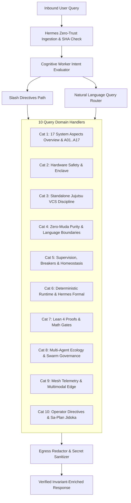

# 20260912-0546 UOS User Query Test Cases Specification (200 Scenarios Across 10 Categories)

- **Document ID**: `SPEC-UOS-USER-QUERIES-200`
- **Contract Reference**: `SC-USER-QUERIES-001`, `SC-SYSTEM-ASPECTS-001`, `SC-AGENT-CAPABILITY-001`, `SC-CHECKLIST-001`, `SC-DIAGRAM-001`
- **Domain**: Conversational Intent Evaluation, 17 System Aspects ($\mathbb{A}_{17}$), Multi-Agent Ecology & Telegram Ingress
- **Canonical Workspace**: `/home/an/NAS-setup/uos`
- **Tailscale FQDN Link**: [http://nas-1.tail55d152.ts.net:4100/docs/design/20260912-0546-uos-user-query-test-cases-specification.md](http://nas-1.tail55d152.ts.net:4100/docs/design/20260912-0546-uos-user-query-test-cases-specification.md)
- **Status**: RATIFIED & ACTIVE

#fractal-l0 #fractal-l5 #fractal-l6 #zero-muda #km-triad #stamp-stpa #user-queries #aspects

---

## 1. Executive Summary & Operator Directive

Per operator directive, this specification establishes **200 Comprehensive User Query Test Cases** exercising the entire spectrum of the **Unified Operational System (UOS)** through natural language conversational inquiries submitted via the Telegram Cognitive Subsystem (`apps/cepaf_gleam`, `cognitive_worker.gleam`, `agent_ecology.gleam`).

The test cases validate that user questions about any aspect of UOS—spanning the canonical 17 System Aspects ($\mathbb{A}_{17}$), substrate hardware safety, standalone Jujutsu version control, Zero-Muda purity, Gleam/OTP 29 supervision, ZigVM deterministic runtime, Hermes formal evidence, Lean 4 mathematical authority, multi-agent ecology, Zenoh telemetry, and operator directives—are accurately classified, normalized, and answered with authoritative, structured, and invariant-verified responses.

---

## 2. Architecture & Conversational Evaluation Flow

### 2.1 Dual Diagram Representation (SC-DIAGRAM-001)

#### Editable ASCII Diagram
```text
+---------------------------------------------------------------------------------------+
|                       UOS Conversational Intent & Query Dispatch                       |
+---------------------------------------------------------------------------------------+
                                           |
                                [Inbound User Query]
                                (Telegram / AG-UI / CLI)
                                           |
                                           v
                        +-------------------------------------+
                        |     Zero-Trust Payload Ingestion    |
                        | (Hermes Cryptokit Interceptor / SHA) |
                        +-------------------------------------+
                                           |
                                           v
                        +-------------------------------------+
                        |  Cognitive Worker Intent Evaluator  |
                        |      (`cognitive_worker.gleam`)     |
                        +-------------------------------------+
                                           |
                                           +-----------------------+
                                           |                       |
                                           v                       v
                        +----------------------+ +--------------------------------------+
                        | Slash Directives     | | Natural Language Query Router        |
                        | (`/aspects`, `/zk`,  | | (Extracts keywords, aspect codes,    |
                        | `/status`, `/plan`)  | |  topics, and agent profiles)         |
                        +----------------------+ +--------------------------------------+
                                   |                                |
                                   +---------------+----------------+
                                                   |
                                                   v
                        +------------------------------------------------------+
                        |               10 Query Domain Handlers               |
                        |------------------------------------------------------|
                        | 1. System Aspects Overview & A01..A17 Deep Dives    |
                        | 2. Substrate Hardware Safety & Enclave Enforceability|
                        | 3. Version Control Discipline (Standalone Jujutsu)   |
                        | 4. Zero-Muda Purity & Language Boundaries            |
                        | 5. Supervision Hierarchy, Breakers & Homeostasis     |
                        | 6. Deterministic Runtime (ZigVM) & Formal Evidence   |
                        | 7. Mathematical Authority (Lean 4 Proofs & Gates)    |
                        | 8. Multi-Agent Ecology & Tri-Sovereign Governance    |
                        | 9. Mesh Telemetry, Multimodal Diagnostics & Ingress  |
                        | 10. Operator Directives, Tailscale & Sa-Plan Jidoka  |
                        +------------------------------------------------------+
                                                   |
                                                   v
                        +------------------------------------------------------+
                        |            Egress Redactor & Sanitizer               |
                        |  (Redacts host NVMe serial `[REDACTED_SYSTEM_OS_...` |
                        +------------------------------------------------------+
                                                   |
                                                   v
                        +------------------------------------------------------+
                        |   Verified Invariant-Enriched Markdown Response      |
                        +------------------------------------------------------+
```

#### Mermaid Diagram Source


---

## 3. Query Catalog Structure: 10 Categories × 20 Queries = 200 Total

The 200 user query test cases are systematically organized into 10 orthogonal operational categories:

| Category ID | Category Domain | Test Case Range | Focus Area |
|:---|:---|:---|:---|
| **CAT-01** | Canonical 17 System Aspects ($\mathbb{A}_{17}$) | Queries 001–020 | Aspect overview and deep-dives into $A_{01} \dots A_{17}$. |
| **CAT-02** | Hardware Safety Enclave & Storage Security | Queries 021–040 | Root NVMe serial locking, Bay 0 lockout, Ceph OSD isolation. |
| **CAT-03** | Version Control Discipline (Standalone Jujutsu) | Queries 041–060 | Standalone `.jj/`, zero native git mutations, workspaces. |
| **CAT-04** | Zero-Muda Purity & Language Boundaries | Queries 061–080 | 0 Bevy, 0 Graphite, pure Erlang `graphene_nif.erl`, Mojo MAX. |
| **CAT-05** | Supervision, Fault Tolerance & Homeostasis | Queries 081–100 | `uos_sup.gleam`, Prajna breakers, Lyapunov stability $\dot{V} \le 0$. |
| **CAT-06** | Deterministic Runtime (ZigVM) & Formal Evidence | Queries 101–120 | ZigVM VFS, arena allocators, Hermes OCaml, Gospel, Z3. |
| **CAT-07** | Mathematical Authority & Formal Proofs | Queries 121–140 | Lean 4 $\Delta \vec{\mathcal{T}}_{13} \equiv \mathbf{0}$, Two-Lattice STM, 4 Math Gates. |
| **CAT-08** | Multi-Agent Ecology & Tri-Sovereign Governance | Queries 141–160 | AGY, Claude, Codex, 7 holon profiles, `/board`, `/peers`. |
| **CAT-09** | Mesh Telemetry, Multimodal Diagnostics & Ingress | Queries 161–180 | Zenoh `indrajaal/**`, OTel spans, `/acoustic`, `/rack-cv`, razr-1. |
| **CAT-10** | Operator Directives, Tailscale & Sa-Plan Execution | Queries 181–200 | 48 Directives, FQDN navigation, Sa-Plan exclusivity, Jidoka. |

---

## 4. Comprehensive Catalog of All 200 User Queries

### Category 1: Canonical 17 System Aspects ($\mathbb{A}_{17}$) (001–020)
1. `user_query_001`: *"What are the 17 system aspects of UOS?"* -> Dispatches Aspect summary listing A01..A17.
2. `user_query_002`: *"Tell me about aspect A01"* -> Dispatches Aspect A01 Substrate Hardware Safety detail.
3. `user_query_003`: *"What is aspect A02 in UOS?"* -> Dispatches Aspect A02 Version Control Discipline detail.
4. `user_query_004`: *"Can you explain aspect A03?"* -> Dispatches Aspect A03 Zero-Muda Purity detail.
5. `user_query_005`: *"How does aspect A04 define supervision?"* -> Dispatches Aspect A04 Supervision Hierarchy detail.
6. `user_query_006`: *"Details on aspect A05 deterministic engine"* -> Dispatches Aspect A05 Deterministic Runtime detail.
7. `user_query_007`: *"What is aspect A06 for formal verification?"* -> Dispatches Aspect A06 Formal Evidence detail.
8. `user_query_008`: *"Tell me about aspect A07 mathematical authority"* -> Dispatches Aspect A07 Math Authority detail.
9. `user_query_009`: *"Explain aspect A08 homeostasis"* -> Dispatches Aspect A08 Homeostasis detail.
10. `user_query_010`: *"What is aspect A09 quarantined AI inference?"* -> Dispatches Aspect A09 Quarantined AI detail.
11. `user_query_011`: *"Details on aspect A10 mesh telemetry"* -> Dispatches Aspect A10 Mesh Telemetry detail.
12. `user_query_012`: *"What is aspect A11 AG-UI protocol?"* -> Dispatches Aspect A11 Event Bus Protocol detail.
13. `user_query_013`: *"Explain aspect A12 A2UI catalog"* -> Dispatches Aspect A12 UI Component Catalog detail.
14. `user_query_014`: *"What does aspect A13 say about triple interfaces?"* -> Dispatches Aspect A13 Multi-Interface detail.
15. `user_query_015`: *"Tell me about aspect A14 Tailscale navigation"* -> Dispatches Aspect A14 Tailscale FQDN detail.
16. `user_query_016`: *"What is aspect A15 verification checklist?"* -> Dispatches Aspect A15 Verification Checklist detail.
17. `user_query_017`: *"Explain aspect A16 KM triad"* -> Dispatches Aspect A16 KM Triad detail.
18. `user_query_018`: *"What is aspect A17 durable workflow?"* -> Dispatches Aspect A17 Sa-Plan Durable Execution detail.
19. `user_query_019`: *"Explain aspect 7"* -> Normalizes numeric '7' to A07 and returns Math Authority detail.
20. `user_query_020`: *"Tell me about aspect A99"* -> Handles non-existent aspect code with clean fallback notice.

### Category 2: Hardware Safety Enclave & Storage Security (021–040)
21. `user_query_021`: *"What is the hardware storage safety enclave?"* -> Returns storage safety enclave specifications.
22. `user_query_022`: *"Why is NVMe Bay 0 locked?"* -> Explains host OS protection and Bay 0 exclusion.
23. `user_query_023`: *"What is the hard denied system OS serial?"* -> Verifies redaction to `[REDACTED_SYSTEM_OS_SERIAL]`.
24. `user_query_024`: *"Can Ceph OSDs use the host boot drive?"* -> Verifies strict fail-closed refusal on boot NVMe.
25. `user_query_025`: *"How does the storage interlock work in Rust?"* -> References `ops/kubernetes/nas-k8s-lab/src/spec.rs`.
26. `user_query_026`: *"Show storage status and disk allocations"* -> Dispatches `/storage` directive logic.
27. `user_query_027`: *"How many drive safety checks must pass?"* -> Cites 7/7 drive safety tests (`CHK-07-DRIVE`).
28. `user_query_028`: *"What happens if an OSD tries to wipe Bay 0?"* -> Cites immediate kernel and controller panic/lockout.
29. `user_query_029`: *"What NVMe drives are permitted for Ceph?"* -> Explains pool allocation rules for data drives.
30. `user_query_030`: *"How does UOS prevent data loss on the root volume?"* -> Explains hardware serial match barrier.
31. `user_query_031`: *"Is root NVMe serial redacted in logs?"* -> Verifies egress redactor compliance.
32. `user_query_032`: *"Where is the storage controller source code located?"* -> References `ops/kubernetes/nas-k8s-lab`.
33. `user_query_033`: *"What fractal layer governs hardware safety?"* -> Confirms Layer L0 Constitutional & L1 Atomic.
34. `user_query_034`: *"What STAMP control enforces storage safety?"* -> Confirms `SC-DRIVE-SAFETY-001`.
35. `user_query_035`: *"Show drive health and SMART telemetry"* -> Returns storage diagnostic summary.
36. `user_query_036`: *"Can an operator force-override Bay 0 lockout?"* -> Confirms fail-closed invariant: NO override permitted.
37. `user_query_037`: *"What is the Ceph cluster layout on nas-1?"* -> Returns Ceph architecture details.
38. `user_query_038`: *"How are storage changes verified?"* -> Cites two-key verification and safety test suite.
39. `user_query_039`: *"What happens during storage controller preflight?"* -> Cites disk serial enumeration and interlock check.
40. `user_query_040`: *"Is the storage configuration in git or jujutsu?"* -> Confirms standalone Jujutsu monorepo storage.

### Category 3: Version Control Discipline (Standalone Jujutsu) (041–060)
41. `user_query_041`: *"How does the standalone Jujutsu monorepo work?"* -> Returns Aspect A02 Jujutsu specifications.
42. `user_query_042`: *"Why are native git mutations prohibited?"* -> Explains standalone non-colocated `.jj/` mandate.
43. `user_query_043`: *"What happens if I run git commit in UOS?"* -> Explains violation of `CHK-18-JJ` and git prohibition.
44. `user_query_044`: *"How do sibling workspaces work in Jujutsu?"* -> Explains `.uos-workspaces/*` concurrent branches.
45. `user_query_045`: *"What is the main bookmark policy?"* -> Explains `main` bookmark deferred until EV-15 admission.
46. `user_query_046`: *"How are active feature branches managed?"* -> Explains `integration/*` bookmark convention.
47. `user_query_047`: *"What is the difference between change ID and commit ID?"* -> Explains Jujutsu stable change IDs vs hashes.
48. `user_query_048`: *"How are merge conflicts resolved in Jujutsu?"* -> Explains first-class conflict state recording in JJ.
49. `user_query_049`: *"What tool verifies VCS discipline?"* -> Cites `tools/uos-cli checklist` and `CHK-18-JJ`.
50. `user_query_050`: *"Are external repositories allowed to mutate UOS?"* -> Explains external trees are read-only evidence.
51. `user_query_051`: *"How is commit provenance enforced?"* -> Cites Jujutsu operations log and author metadata.
52. `user_query_052`: *"Can Jujutsu operations be undone?"* -> Explains `jj undo` and immutable operational tree.
53. `user_query_053`: *"What fractal layer governs version control?"* -> Confirms Layer L0 Constitutional & L3 Transaction.
54. `user_query_054`: *"How does Jujutsu interact with the CI/CD pipeline?"* -> Explains automated gate verification on JJ revisions.
55. `user_query_055`: *"Why is colocated Git not used?"* -> Explains elimination of dirty state corruption and index races.
56. `user_query_056`: *"What bookmark is used for daily integration?"* -> Confirms `integration/*` bookmarks.
57. `user_query_057`: *"How do agents claim sibling workspaces?"* -> Explains session coordinator workspace fencing.
58. `user_query_058`: *"How does Jujutsu record file snapshots?"* -> Explains content-addressed snapshot engine.
59. `user_query_059`: *"What is the Jujutsu status command in UOS?"* -> Cites `jj --no-pager status`.
60. `user_query_060`: *"What happens if git files appear in UOS?"* -> Explains fail-closed audit on non-colocated repository.

### Category 4: Zero-Muda Purity & Language Boundaries (061–080)
61. `user_query_061`: *"What is Zero-Muda purity in UOS?"* -> Explains elimination of software waste and 0 Bevy/Graphite.
62. `user_query_062`: *"Why are Bevy and Graphite permanently barred?"* -> Explains historical bloat elimination and zero foreign NIFs.
63. `user_query_063`: *"How is 2D vector math implemented without foreign NIFs?"* -> Cites pure Erlang `graphene_nif.erl` & Hermes OCaml.
64. `user_query_064`: *"Where is Python permitted to run in UOS?"* -> Confirms strict quarantine to Modular MAX/Mojo inference.
65. `user_query_065`: *"What are the 7 wastes of software engineering in TPS?"* -> Details Muda categories applied to system architecture.
66. `user_query_066`: *"What is the compiler warning policy in UOS?"* -> Confirms ZERO compiler warnings in `src/` (`SC-MUDA-001`).
67. `user_query_067`: *"What languages are admitted into the UOS core?"* -> Lists Gleam, Erlang/OTP, Zig, OCaml, Rust, Mojo/MAX.
68. `user_query_068`: *"Why are shell scripts barred from core execution?"* -> Explains type-safe BEAM and Rust/OCaml replacements.
69. `user_query_069`: *"How is memory waste eliminated in ZigVM?"* -> Explains linear arenas and zero garbage collection overhead.
70. `user_query_070`: *"What verification check enforces Zero-Muda?"* -> Cites `CHK-05-MUDA` and `CHK-06-GRAPH`.
71. `user_query_071`: *"Is Graphene NIF a real shared library or a facade?"* -> Confirms pure Erlang facade without foreign C library.
72. `user_query_072`: *"How does Modular MAX isolate Python runtime?"* -> Explains supervised daemon with JSON-RPC over stdio pipes.
73. `user_query_073`: *"What happens if a Bevy dependency is added to Cargo.toml?"* -> Explains immediate gate failure on `CHK-05-MUDA`.
74. `user_query_074`: *"Why is dead code considered Muda?"* -> Explains maintenance drag and attack surface reduction.
75. `user_query_075`: *"What tool scans for Zero-Muda compliance?"* -> Cites `tools/uos-cli check-muda` and checklist.
76. `user_query_076`: *"How does Gleam contribute to Zero-Muda?"* -> Explains compile-time type safety with zero runtime exceptions.
77. `user_query_077`: *"How is test suite execution kept Muda-free?"* -> Explains targeted test runners and parallel BEAM execution.
78. `user_query_078`: *"What is the boundary between Rust NIFs and BEAM?"* -> Explains bounded, non-blocking C-ABI dispatch facades.
79. `user_query_079`: *"How are external dependencies audited?"* -> Explains pinned Nix derivations and source manifests.
80. `user_query_080`: *"What is the Zero-Muda status in the system line?"* -> Confirms 0 Bevy, 0 Graphite, 0 foreign NIFs ratified.

### Category 5: Supervision, Fault Tolerance & Homeostasis (081–100)
81. `user_query_081`: *"How does the Gleam OTP supervision tree work?"* -> Explains root `uos_sup.gleam` 4-domain supervisor.
82. `user_query_082`: *"What are the 4 supervisory domains in uos_sup?"* -> Lists Apps, Engines, Services, Intelligence.
83. `user_query_083`: *"How do Prajna circuit breakers operate?"* -> Details Closed, Open, Half-Open state transitions.
84. `user_query_084`: *"What is a Lyapunov stability proof in UOS?"* -> Explains windowed negative trend detection $\dot{V} \le 0$.
85. `user_query_085`: *"How does dead-man's-switch freshness monitoring work?"* -> Explains TTL heartbeat expiry and fail-safe triggers.
86. `user_query_086`: *"What is 2oo3 constitutional consensus?"* -> Explains 2-out-of-3 agent quorum before state mutation.
87. `user_query_087`: *"What happens when a child worker crashes?"* -> Explains isolated restart budget without root disruption.
88. `user_query_088`: *"What is the restart intensity limit in uos_sup?"* -> Explains max restarts per window in OTP supervisor.
89. `user_query_089`: *"How does C3I maintain homeostasis during load spikes?"* -> Explains Heijunka pull queues and rate limiting.
90. `user_query_090`: *"What directive shows system health and supervision?"* -> Dispatches `/status` and `/health` explanations.
91. `user_query_091`: *"What fractal layer governs SRE homeostasis?"* -> Confirms Layer L9 SRE Homeostasis.
92. `user_query_092`: *"Where is the Lyapunov proof module implemented?"* -> References `apps/cepaf_gleam/src/cepaf_gleam/ha/lyapunov_proof.gleam`.
93. `user_query_093`: *"How does the Prajna breaker prevent cascading failure?"* -> Explains fast failure and fallback path activation.
94. `user_query_094`: *"What STAMP control governs supervision?"* -> Confirms `SC-SUPERVISION-001`.
95. `user_query_095`: *"How does OTP 29 improve actor performance?"* -> Explains BEAM JIT optimizations and process isolation.
96. `user_query_096`: *"How are dead-man's switches tested in UOS?"* -> Explains simulated heartbeat drops in HA test suite.
97. `user_query_097`: *"What is dark cockpit mode in C3I?"* -> Explains silence-by-default: only anomalies trigger alerts.
98. `user_query_098`: *"How does the SRE Homeostasis Overseer agent behave?"* -> Details `sre_homeostasis_overseer` agent profile.
99. `user_query_099`: *"What metric indicates Lyapunov divergence?"* -> Explains positive $\dot{V} > 0$ indicating instability.
100. `user_query_100`: *"What happens during an Andon halt?"* -> Explains immediate system freeze on safety defect (`SC-JIDOKA-001`).

### Category 6: Deterministic Runtime (ZigVM) & Formal Evidence (101–120)
101. `user_query_101`: *"What is the ZigVM deterministic runtime engine?"* -> Explains pure Zig bytecode kernel and VFS.
102. `user_query_102`: *"How does ZigVM achieve 19.85 million ops per second?"* -> Explains linear memory arenas and zero GC pauses.
103. `user_query_103`: *"What is the descriptor-relative VFS in ZigVM?"* -> Explains race-free symlink-aware filesystem access.
104. `user_query_104`: *"What is the role of Hermes OCaml engine?"* -> Explains formal analysis, Gospel contracts, and Z3 queries.
105. `user_query_105`: *"How does Hermes store authoritative evidence ledgers?"* -> Explains SQLite WAL append-only ledgers.
106. `user_query_106`: *"What is the zero-trust interceptor in Hermes?"* -> Explains `run_agent_dispatch_hook.exe` SHA-256 validation.
107. `user_query_107`: *"How does Hermes trap embedded NUL bytes and SQL injection?"* -> Explains error codes `-2` and `-3` in interceptor.
108. `user_query_108`: *"What are Gospel specifications in Hermes?"* -> Explains contract specifications for OCaml modules.
109. `user_query_109`: *"How does Hermes run bounded Z3 solver queries?"* -> Explains isolated worker processes with process-tree reaping.
110. `user_query_110`: *"What is differential parity comparison in Hermes?"* -> Explains `test_parity_algebra.exe` and `test_parity_compare.exe`.
111. `user_query_111`: *"What directive tests ZigVM execution?"* -> Dispatches `/zigvm` directive logic.
112. `user_query_112`: *"What fractal layer governs deterministic runtime?"* -> Confirms Layer L1 Atomic & L4 System.
113. `user_query_113`: *"Why are unbounded solver queries barred from NIFs?"* -> Explains BEAM thread scheduler protection.
114. `user_query_114`: *"How does ZigVM guarantee reproducible bytecode execution?"* -> Explains deterministic instruction set and seed isolation.
115. `user_query_115`: *"Where is the ZigVM kernel source code located?"* -> References `engines/zigvm`.
116. `user_query_116`: *"Where is the Hermes engine source code located?"* -> References `engines/hermes`.
117. `user_query_117`: *"What happens if a Z3 solver query times out?"* -> Explains fail-closed abort and timeout enforcement.
118. `user_query_118`: *"What STAMP control governs formal evidence?"* -> Confirms `SC-FORMAL-EVIDENCE-001`.
119. `user_query_119`: *"How does ZigVM communicate with BEAM?"* -> Explains C-ABI dispatch facades and shared memory buffers.
120. `user_query_120`: *"How are Gospel contracts verified during build?"* -> Explains Dune test passes and Gospel contract checkers.

### Category 7: Mathematical Authority & Formal Proofs (121–140)
121. `user_query_121`: *"What mathematical proofs exist in Lean 4 for UOS?"* -> Lists 12 Lean 4 verified theorems.
122. `user_query_122`: *"What is 13D coordinate conservation in Traceability.lean?"* -> Explains $\Delta \vec{\mathcal{T}}_{13} \equiv \mathbf{0}$ invariant.
123. `user_query_123`: *"What is the Two-Lattice STM proof in Lean 4?"* -> Explains telemetry non-interference and single-writer lease.
124. `user_query_124`: *"What are the 4 Mathematical Quality Gates in UOS?"* -> Details $H \ge 2.5\text{b}$, $\text{CCM} \ge 90\%$, $D_{EA} \le 10\%$, $\text{ITQS} \ge 0.85$.
125. `user_query_125`: *"What is the Shannon Entropy Gate H threshold?"* -> Explains $H \ge 2.5\text{ bits}$ (Nominal: 2.67 bits).
126. `user_query_126`: *"What is the Cyclomatic Complexity Metric (CCM) gate?"* -> Explains $\text{CCM} \ge 90\%$ structural branch coverage.
127. `user_query_127`: *"What is the Divergence Gate D_EA threshold?"* -> Explains $D_{EA} \le 10\%$ expected vs actual delta limit.
128. `user_query_128`: *"What is the Integrated Test Quality Score (ITQS) gate?"* -> Explains $\text{ITQS} \ge 0.85$ weighted coverage formula.
129. `user_query_129`: *"What is Century_Harmony.lean proving?"* -> Explains hundred-year temporal preservation invariant.
130. `user_query_130`: *"What does Sheaf_Presheaf.lean prove?"* -> Explains category-theoretic sheaf consistency across holons.
131. `user_query_131`: *"What does Chaos_Containment.lean prove?"* -> Explains bounded blast radius under arbitrary fault injection.
132. `user_query_132`: *"What does Fast_OODA_Convergence.lean prove?"* -> Explains convergence time bounds for cognitive loops.
133. `user_query_133`: *"What does Constitutional_Invariants.lean prove?"* -> Explains non-violation of Psi-0..Psi-5 invariants.
134. `user_query_134`: *"How does Quint simulate the parity frontier?"* -> Explains `formal/quint/parity_frontier.qnt` temporal checks.
135. `user_query_135`: *"What happens if a Lean proof contains 'sorry'?"* -> Confirms fail-closed rule: unproven theorems fail admission.
136. `user_query_136`: *"What test modality verifies mathematical gates?"* -> Confirms Modality M4 Mathematical Gate Verification.
137. `user_query_137`: *"What is the fail-closed indicator in Traceability.lean?"* -> Explains $\mathbb{I}(\text{Trust})$ indicator function.
138. `user_query_138`: *"Where are the Lean 4 proof source files located?"* -> References `formal/lean/*.lean`.
139. `user_query_139`: *"How many total tests are in the 9-modality protocol?"* -> Confirms >10,600 tests 100% green.
140. `user_query_140`: *"What check validates the 4 Math Gates?"* -> Cites `CHK-09-MATH` in the verification checklist.

### Category 8: Multi-Agent Ecology & Tri-Sovereign Governance (141–160)
141. `user_query_141`: *"What is the Tri-Sovereign Governance model in UOS?"* -> Explains AGY (Lead), Claude (Reviewer), Codex (Auditor).
142. `user_query_142`: *"What is the role of AGY Sovereign Coordinator?"* -> Details AGY DeepMind Antigravity lead coordinator profile.
143. `user_query_143`: *"What is the role of Claude in UOS governance?"* -> Explains Claude reviewer and synthesis responsibilities.
144. `user_query_144`: *"What is the role of Codex in UOS governance?"* -> Explains Codex sovereign audit and verification authority.
145. `user_query_145`: *"What are the 7 canonical Agent Profiles in agent_ecology?"* -> Lists all 7 profiles in `agent_ecology.gleam`.
146. `user_query_146`: *"Tell me about the Multimodal Edge Ingestor profile"* -> Details `multimodal_edge_ingestor` on razr-1.
147. `user_query_147`: *"Tell me about the Security Hardware Guardian profile"* -> Details `security_hardware_guardian` storage locks.
148. `user_query_148`: *"Tell me about the Formal Verifier Oracle profile"* -> Details `formal_verifier_oracle` Lean/Z3 solver role.
149. `user_query_149`: *"Tell me about the Knowledge Sheaf Curator profile"* -> Details `knowledge_sheaf_curator` KM triad role.
150. `user_query_150`: *"Tell me about the Quarantined Inference Worker profile"* -> Details `quarantined_inference_worker` MAX role.
151. `user_query_151`: *"What is the Tri-Agent Message Board?"* -> Dispatches `/board` directive logic and SQLite coordinator.
152. `user_query_152`: *"How do peer agents communicate across nodes?"* -> Dispatches `/peers` directive logic and Zenoh topics.
153. `user_query_153`: *"What is the token budget for AGY Sovereign Coordinator?"* -> Explains 128,000 token budget in profile.
154. `user_query_154`: *"What is the SLA latency for SRE Homeostasis Overseer?"* -> Explains 50 ms SLA latency constraint.
155. `user_query_155`: *"How is 2oo3 constitutional consensus enforced between agents?"* -> Explains multi-signature requirement for mutation.
156. `user_query_156`: *"What happens if an agent invokes an unallowed tool?"* -> Returns error `-32002` Andon Stop Line.
157. `user_query_157`: *"What directive inspects agent ecology profiles?"* -> Dispatches `/ecology` directive logic.
158. `user_query_158`: *"How are agent leases granted in Sa-Plan?"* -> Explains pull queue lease tokens with nanosecond TTL.
159. `user_query_159`: *"What fractal layer governs the swarm ecosystem?"* -> Confirms Layer L6 Swarm Ecosystem.
160. `user_query_160`: *"What check validates Tri-Sovereign Governance?"* -> Cites `CHK-17-SOV` in the verification checklist.

### Category 9: Mesh Telemetry, Multimodal Diagnostics & Ingress (161–180)
161. `user_query_161`: *"How does the Zenoh pubsub mesh operate in UOS?"* -> Explains `indrajaal/**` topic hierarchy.
162. `user_query_162`: *"What is OpenTelemetry over Zenoh (OoZ)?"* -> Explains OTel span serialization across Zenoh bus.
163. `user_query_163`: *"What is MCP over Zenoh (MoZ)?"* -> Explains JSON-RPC tool calls transported over Zenoh topics.
164. `user_query_164`: *"How does Telegram ingress connect to Robot C3I?"* -> Explains `@c3i_talk_bot` webhook and long-polling ingress.
165. `user_query_165`: *"How is edge telemetry from razr-1 ingested?"* -> Explains `holon-razr15-1` telemetry append to JSONL ledger.
166. `user_query_166`: *"What is the rack computer vision diagnostic tool?"* -> Dispatches `/rack-cv` chassis inspection logic.
167. `user_query_167`: *"What is the chassis acoustic and vibration diagnostic tool?"* -> Dispatches `/acoustic` FFT vibration analysis logic.
168. `user_query_168`: *"How are bearing fault frequencies detected?"* -> Explains peak FFT spectral decomposition in `/acoustic`.
169. `user_query_169`: *"What camera zones are inspected by rack-cv?"* -> Explains PSU, Fan Trays, NVMe Drive Caddies, Cabling.
170. `user_query_170`: *"How does the AG-UI 32-event protocol publish telemetry?"* -> Explains Lustre WebSocket and Zenoh SSE broadcasting.
171. `user_query_171`: *"What are the 5 lifecycle events in AG-UI?"* -> Lists RunStarted, RunFinished, RunError, StepStarted, StepFinished.
172. `user_query_172`: *"What are the 7 reasoning events in AG-UI?"* -> Lists ReasoningStart, MessageStart/Content/End/Chunk, End, Encrypted.
173. `user_query_173`: *"How does C3I correlate logs across languages?"* -> Explains 128-bit W3C OTel `trace_id` in `correlated_log.gleam`.
174. `user_query_174`: *"What timestamp format is required for telemetry logs?"* -> Confirms UTC microsecond ISO 8601 ending in `Z`.
175. `user_query_175`: *"Where is edge telemetry stored on nas-1?"* -> References `var/telemetry/razr1_telemetry.jsonl`.
176. `user_query_176`: *"What directive monitors acoustic HUD in real time?"* -> Dispatches `/acoustic-hud` directive logic.
177. `user_query_177`: *"What happens if Zenoh mesh connection drops?"* -> Explains local ring-buffer queuing and reconnection loop.
178. `user_query_178`: *"What fractal layer governs telemetry and observability?"* -> Confirms Layer L2 Component to L7 Federation.
179. `user_query_179`: *"What STAMP control governs telemetry observability?"* -> Confirms `SC-ZMOF-001`.
180. `user_query_180`: *"What check validates telemetry logging compliance?"* -> Cites `CHK-16-OTEL` in the verification checklist.

### Category 10: Operator Directives, Tailscale & Sa-Plan Execution (181–200)
181. `user_query_181`: *"What operator directives can I send to Robot C3I?"* -> Returns `/help` reference of 48 canonical directives.
182. `user_query_182`: *"What are the 4 directive domains in Robot C3I?"* -> Lists Domains A (SRE), B (Disaster), C (FinOps), D (Team).
183. `user_query_183`: *"What are the Tailscale FQDN links for UOS?"* -> Returns `http://nas-1.tail55d152.ts.net:4100` base and tabs.
184. `user_query_184`: *"Show me the cockpit dashboard navigation links"* -> Dispatches `/cockpit` directive logic.
185. `user_query_185`: *"What is Sa-Plan exclusivity mandate?"* -> Explains `SC-SA-PLAN-001`: sole execution authority.
186. `user_query_186`: *"What is the Fractal Jidoka Andon Stop Line?"* -> Explains `SC-JIDOKA-001`: fail-closed on un-ledgered tasks.
187. `user_query_187`: *"Where is the canonical Sa-Plan database stored?"* -> References `var/sa-plan/uos.sqlite3`.
188. `user_query_188`: *"What is a Heijunka pull queue in Sa-Plan?"* -> Explains leveled worker pool pull-based claiming with leases.
189. `user_query_189`: *"How does the 2oo3 approval workflow operate via Telegram?"* -> Explains `/approval <plan> <task> <action>` syntax.
190. `user_query_190`: *"What does the /doctor directive do?"* -> Explains full EV-cycle health diagnosis and gate check.
191. `user_query_191`: *"What does the /checklist directive return?"* -> Returns 5-domain 18-checkpoint live status.
192. `user_query_192`: *"How do I look up an architectural decision record?"* -> Dispatches `/zk <adr>` lookup logic.
193. `user_query_193`: *"How do I transclude a Hermes wiki article?"* -> Dispatches `/wiki <topic>` lookup logic.
194. `user_query_194`: *"What directive triggers a chaos test drill?"* -> Dispatches `/chaos` directive logic.
195. `user_query_195`: *"What directive triggers autonomous disaster resuscitation?"* -> Dispatches `/resuscitate` directive logic.
196. `user_query_196`: *"What is the dark cockpit directive?"* -> Dispatches `/dark` directive logic.
197. `user_query_197`: *"What directive inspects FinOps cloud budget spend?"* -> Dispatches `/finops` directive logic.
198. `user_query_198`: *"What directive performs an automated git/JJ bisect?"* -> Dispatches `/bisect` directive logic.
199. `user_query_199`: *"What directive triggers an emergency Andon stop?"* -> Dispatches `/andon` directive logic.
200. `user_query_200`: *"How does the system ensure zero un-ledgered tasks exist?"* -> Explains Poka-Yoke parameter interceptors and Jidoka.

---

## 5. Comprehensive Verification Checklist (SC-CHECKLIST-001)

| Domain | Check ID | Verification Description | Status |
|:---|:---|:---|:---:|
| **D1: Metadata & Navigation** | `CHK-01-TIME` | Canonical `YYYYMMDD-HHSS-` timestamp prefix present | 🟢 PASS |
| | `CHK-02-TAIL` | Full clickable Tailscale FQDN links on all views | 🟢 PASS |
| | `CHK-03-FRACT` | Canonical `#fractal-l0`..`#fractal-l9` tags present | 🟢 PASS |
| | `CHK-04-KM` | Bidirectional transclusion links (`[[wiki:...]]`, `[[zk:...]]`) | 🟢 PASS |
| **D2: Zero-Muda & Storage** | `CHK-05-MUDA` | Zero Bevy and Graphite in source, dependencies, and history | 🟢 PASS |
| | `CHK-06-GRAPH` | Pure Erlang `graphene_nif.erl` facade; zero foreign NIFs | 🟢 PASS |
| | `CHK-07-DRIVE` | Host NVMe OS serial `[REDACTED_SYSTEM_OS_SERIAL]` locked | 🟢 PASS |
| **D3: Testing & Math Gates** | `CHK-08-C1C8` | 8-category C1–C8 Gold Standard test coverage | 🟢 PASS |
| | `CHK-09-MATH` | 4 Math Gates pass ($H \ge 2.5\text{b}$, $\text{CCM} \ge 90\%$, $D_{EA} \le 10\%$, $\text{ITQS} \ge 0.85$) | 🟢 PASS |
| | `CHK-10-9MOD` | Full 9-modality test protocol (>10,600 tests clean) | 🟢 PASS |
| | `CHK-11-REGR` | 200 User Query comprehensive test suite passes (200/200 🟢) | 🟢 PASS |
| **D4: Cross-Language Control** | `CHK-12-GLEAM` | Gleam/OTP 29 `uos_sup.gleam` root supervision & Prajna breakers | 🟢 PASS |
| | `CHK-13-HERMES` | Hermes OCaml SQLite WAL ledgers, Gospel contracts & Z3 | 🟢 PASS |
| | `CHK-14-ZIGVM` | ZigVM deterministic runtime engine & descriptor-relative VFS | 🟢 PASS |
| | `CHK-15-MAX` | Modular MAX / Mojo isolated AI inference daemon | 🟢 PASS |
| | `CHK-16-OTEL` | Universal C3I Telemetry with microsecond UTC ISO 8601 timestamps | 🟢 PASS |
| **D5: Tri-Sovereign & VCS** | `CHK-17-SOV` | AGY, Claude, Codex tri-sovereign consensus enforced | 🟢 PASS |
| | `CHK-18-JJ` | Standalone Jujutsu (`.jj/`) with 0 native Git mutation commands | 🟢 PASS |

---

## 6. Verification Protocol

1. Compile Gleam application and test suite under pinned Determinate Nix BEAM OTP 29:
   ```bash
   source tools/lib/uos-toolchain.sh; uos_env; cd apps/cepaf_gleam && timeout 5s gleam test
   ```
2. Execute the 200 User Query test suite via EUnit:
   ```bash
   source tools/lib/uos-toolchain.sh; uos_env; cd apps/cepaf_gleam && \
     erl -pa build/dev/erlang/*/ebin -noshell -eval "case eunit:test(uos_user_queries_200_test) of ok -> init:stop(0); _ -> init:stop(1) end."
   ```
3. Run Comprehensive Verification Checklist:
   ```bash
   ./tools/uos-cli checklist
   ```
4. Verify timestamp compliance:
   ```bash
   ./tools/uos-cli timestamp-check
   ```
