```mermaid
flowchart TD
    subgraph S["Journal Ingestion & Parsing"]
        J1["Section 1: Scope & Trigger"]
        J2["Section 2: Pre-State Assessment"]
        J3["Section 3: Execution Detail"]
        J4["Section 4: Root Cause Analysis"]
        J5["Section 5: Fix Taxonomy"]
        J6["Section 6: Patterns & Anti-Patterns"]
        J7["Section 7: Verification Matrix"]
        J8["Section 8: Files Modified"]
        J9["Section 9: Architectural Obs"]
        J10["Section 10: Remaining Gaps"]
        J11["Section 11: Metrics Summary"]
        J12["Section 12: STAMP Alignment"]
        J13["Section 13: Conclusion & Forecast"]
    end

    subgraph Engines["The 7 Formal & Cognitive Engines"]
        E1["Engine 1: ACH Matrix Disconfirmation"]
        E2["Engine 2: Admiralty Protocol >= B2"]
        E3["Engine 3: Bayesian Beta-Binomial & Decay"]
        E4["Engine 4: Devil's Advocate & Red Team"]
        E5["Engine 5: Formal Lean 4 & Gospel Gate"]
        E6["Engine 6: Rete-UL Production Rules"]
        E7["Engine 7: Predictive Kalman & Brier Horizon"]
    end

    J1 --> E5
    J2 --> E7
    J3 --> E6
    J4 --> E1
    J5 --> E6
    J6 --> E4
    J7 --> E2
    J8 --> E6
    J9 --> E5
    J10 --> E4
    J11 --> E3
    J12 --> E6
    J13 --> E7
```

# SC-JOURNAL-v3 Anticipatory Epistemic Ledger Formal Specification

- **Specification ID**: `SPEC-JOURNAL-003` (Universal Designation: `SC-JOURNAL-v3-SPEC`)
- **Companion Contract**: [`contracts/rules/20260912-0745-sc-journal-v3-anticipatory-contract.md`](http://nas-1.tail55d152.ts.net:4100/files/contracts/rules/20260912-0745-sc-journal-v3-anticipatory-contract.md)
- **Domain**: Cognitive Architecture, Post-Task Epistemic Ledgers, Multi-Agent Swarm Verification
- **Authority**: UOS Canonical Policy / Operator Directive (`contracts/rules/timestamp-mandate.md`)
- **Tailscale FQDN Link**: [http://nas-1.tail55d152.ts.net:4100/files/docs/design/20260912-0745-sc-journal-v3-anticipatory-spec.md](http://nas-1.tail55d152.ts.net:4100/files/docs/design/20260912-0745-sc-journal-v3-anticipatory-spec.md)
- **Sa-plan authority**: `uos/sc-journal-v3/20260912-0745` (`SC-JIDOKA-001`, `SC-SA-PLAN-001`)
- **Status**: RATIFIED SPECIFICATION

#fractal-l0 #fractal-l1 #fractal-l2 #fractal-l3 #fractal-l4 #fractal-l5 #fractal-l6 #fractal-l7 #zero-muda #km-triad #stamp-stpa #zk-adr

---

## 1. System Architecture & Information Flow

The Anticipatory Epistemic Ledger converts historical narrative reporting into an active cybernetic feedback loop. By constraining journal generation through 7 mathematical and formal verification engines, the journal functions simultaneously as:
1. An empirical evidence ledger.
2. An active diagnostic tool for swarm self-healing.
3. A predictive state observer calibrated against reality.

```text
+---------------------------------------------------------------------------------------------------+
|                        SC-JOURNAL-v3 CYBERNETIC VERIFICATION DATA PIPELINE                        |
+---------------------------------------------------------------------------------------------------+
|                                                                                                   |
|   Task Input / Trigger                                                                            |
|          │                                                                                        |
|          ▼                                                                                        |
|   ┌──────────────┐     Lean 4 / Gospel       ┌──────────────────────┐                             |
|   │ 1. Scope     │ ────────────────────────> │ Engine 5: Formal     │                             |
|   └──────────────┘                           └──────────────────────┘                             |
|          │                                              │                                         |
|          ▼                                              ▼                                         |
|   ┌──────────────┐     Bayesian Prior        ┌──────────────────────┐                             |
|   │ 2. Pre-State │ ────────────────────────> │ Engine 3: Bayesian   │                             |
|   └──────────────┘                           │ & Kalman Tracker     │                             |
|          │                                   └──────────────────────┘                             |
|          ▼                                              │                                         |
|   ┌──────────────┐     Rete-UL Production    ┌──────────────────────┐                             |
|   │ 3. Execution │ ────────────────────────> │ Engine 6: Rete-UL    │                             |
|   └──────────────┘                           │ Invariant Network    │                             |
|          │                                   └──────────────────────┘                             |
|          ▼                                              │                                         |
|   ┌──────────────┐     Disconfirmation Matrix ┌─────────────────────┐                             |
|   │ 4. RCA       │ ────────────────────────> │ Engine 1: ACH Matrix │                             |
|   └──────────────┘                           └──────────────────────┘                             |
|          │                                              │                                         |
|          ▼                                              ▼                                         |
|   ┌──────────────┐     Counter-factual       ┌──────────────────────┐                             |
|   │ 6. Patterns  │ ────────────────────────> │ Engine 4: Devil's    │                             |
|   └──────────────┘     Popperian Falsify     │ Advocate Red Team    │                             |
|          │                                   └──────────────────────┘                             |
|          ▼                                              │                                         |
|   ┌──────────────┐     NATO STANAG 2017      ┌──────────────────────┐                             |
|   │ 7. Verify    │ ────────────────────────> │ Engine 2: Admiralty  │                             |
|   └──────────────┘     Gate >= B2 Required   │ Protocol Engine      │                             |
|          │                                   └──────────────────────┘                             |
|          ▼                                              │                                         |
|   ┌──────────────┐     Lyapunov & Brier      ┌──────────────────────┐                             |
|   │ 11-13. Concl │ ────────────────────────> │ Engine 7: Predictive │                             |
|   └──────────────┘                           │ & Calibration Engine │                             |
|                                              └──────────────────────┘                             |
+---------------------------------------------------------------------------------------------------+
```



---

## 2. Mathematical Formalization of the 7 Engines

### 2.1 Engine 1: Analysis of Competing Hypotheses (ACH)
Root cause determination evaluates a set of mutually exclusive hypotheses $\mathcal{H} = \{H_1, H_2, \dots, H_m\}$ against observed diagnostic evidence items $\mathcal{E} = \{E_1, E_2, \dots, E_n\}$.
For each pair $(E_i, H_j)$, an assessment value $L(E_i, H_j) \in \{-2, -1, 0, +1, +2\}$ is assigned:
- $+2$: Highly Consistent
- $+1$: Consistent
- $0$: Neutral / Irrelevant
- $-1$: Inconsistent
- $-2$: Highly Inconsistent / Disconfirming

**Diagnostic Value Calculation**:
The diagnostic weight $W(E_i)$ of evidence $E_i$ measures its power to differentiate between hypotheses:
$$W(E_i) = \text{Var}_{j} (L(E_i, H_j)) = \frac{1}{m} \sum_{j=1}^m \left( L(E_i, H_j) - \bar{L}_i \right)^2$$
**Hypothesis Refutation Score**:
In strict Popperian epistemology, hypotheses are eliminated by disconfirming evidence rather than confirmed by positive evidence:
$$R(H_j) = \sum_{i=1}^n \mathbb{I}(L(E_i, H_j) < 0) \cdot |L(E_i, H_j)| \cdot W(E_i)$$
The admitted root cause $H^*$ is that which minimizes the refutation score:
$$H^* = \arg\min_{H_j \in \mathcal{H}} R(H_j)$$

### 2.2 Engine 2: NATO STANAG 2017 Admiralty Protocol
Every verification row $v \in \text{Section 7}$ is mapped to a 2D credibility coordinate:
$$\text{Grade}(v) = (R(v), C(v)) \in \{A, B, C, D, E, F\} \times \{1, 2, 3, 4, 5, 6\}$$

Numerical weights are assigned:
$$\begin{array}{c|c}
\text{Source Reliability } R & \text{Weight } w_R \\
\hline
A \text{ (Completely reliable: deterministic machine binary / proof)} & 1.00 \\
B \text{ (Usually reliable: supervised OTP actor / compiler)} & 0.85 \\
C \text{ (Fairly reliable: automated heuristic script)} & 0.60 \\
D \text{ (Not usually reliable: unmonitored agent)} & 0.35 \\
E \text{ (Unreliable: hallucinatory model)} & 0.10 \\
F \text{ (Reliability cannot be judged)} & 0.00 \\
\end{array}$$

$$\begin{array}{c|c}
\text{Information Credibility } C & \text{Weight } w_C \\
\hline
1 \text{ (Confirmed by independent oracles / multi-surface)} & 1.00 \\
2 \text{ (Probably true: single fresh machine receipt)} & 0.85 \\
3 \text{ (Possibly true: plausible test output)} & 0.60 \\
4 \text{ (Doubtful: inconsistent log)} & 0.35 \\
5 \text{ (Improbable: contradictory assert)} & 0.10 \\
6 \text{ (Credibility cannot be judged)} & 0.00 \\
\end{array}$$

**Composite Admissibility Score**:
$$S_{\text{adm}}(v) = w_R(v) \times w_C(v)$$
$$\text{Admissible}(v) \iff S_{\text{adm}}(v) \ge 0.85 \times 0.85 = 0.7225 \iff \text{Grade}(v) \in \{A1, A2, B1, B2\}$$

### 2.3 Engine 3: Bayesian Belief Updating with Half-Life Decay
System trust parameters $\theta$ (e.g., test pass rate, invariant stability) are modeled as Beta distributions $\theta \sim \text{Beta}(\alpha, \beta)$.
Given $k$ positive verification passes out of $n$ trials:
$$\alpha_{\text{post}} = \alpha_{\text{prior}} + k$$
$$\beta_{\text{post}} = \beta_{\text{prior}} + (n - k)$$
$$\mathbb{E}[\theta] = \frac{\alpha_{\text{post}}}{\alpha_{\text{post}} + \beta_{\text{post}}}$$

**Temporal Half-Life Depreciation**:
Evidence ages over time $\Delta t = t_{\text{current}} - t_{\text{receipt}}$. The effective observation count decays exponentially:
$$n_{\text{eff}}(\Delta t) = 1 + (n - 1) \cdot 2^{-\frac{\Delta t}{\tau_{1/2}}}$$
$$\alpha(\Delta t) = 1 + (\alpha_{\text{post}} - 1) \cdot 2^{-\frac{\Delta t}{\tau_{1/2}}}$$
$$\beta(\Delta t) = 1 + (\beta_{\text{post}} - 1) \cdot 2^{-\frac{\Delta t}{\tau_{1/2}}}$$
For machine-certified proofs, $\tau_{1/2} = 604,800\text{ s}$ (7 days). For ephemeral telemetry observations, $\tau_{1/2} = 86,400\text{ s}$ (24 hours).

### 2.4 Engine 4: Devil's Advocate & Red Team Falsification
Every architectural pattern claimed in Section 6 and gap in Section 10 must undergo Popperian falsification testing:
$$\mathcal{P}_{\text{test}} = \langle \text{Assertion } \phi, \text{Falsifier } \psi, \text{Injection Probe } \tau \rangle$$
Where:
$$\phi \implies \neg \psi \quad \text{under nominal operations}$$
A test fails if the red team injection probe $\tau$ successfully instantiates $\psi$ without triggering an immediate fail-closed circuit breaker.

### 2.5 Engine 5: Formal Lean 4 Gateways & Invariant Conservation
Section 1 and Section 9 verify coordinate conservation:
$$\Delta \vec{\mathcal{T}}_{13} = \vec{\mathcal{T}}_{13}(t_{\text{post}}) - \vec{\mathcal{T}}_{13}(t_{\text{pre}}) \equiv \mathbf{0}$$
Proved via `formal/lean/Traceability.lean` and Gospel interface contracts (`engines/hermes/`).

### 2.6 Engine 6: Rete-UL Multi-Aspect Invariant Production Network
The journal content is parsed into Working Memory Elements (WMEs):
```text
(WME ^type Section ^id 1 ^title "Scope & Trigger" ^empty false)
(WME ^type Section ^id 4 ^title "Root Cause Analysis" ^has_ach_matrix true)
(WME ^type Section ^id 7 ^title "Verification Matrix" ^admiralty_min "B2")
(WME ^type Section ^id 8 ^title "Files Modified" ^count 6)
(WME ^type Section ^id 13 ^title "Conclusion" ^has_forecast true ^brier_horizon "2026-09-15T00:00:00Z")
```
Rete-UL Production Rules evaluate invariants:
- **`RULE-EMPTY-SECTION`**: If any of the 13 sections is empty or absent, raise `LINTER_ERROR_EMPTY_SECTION`.
- **`RULE-ADMIRALTY-FLOOR`**: If any passing check in Section 7 has grade $< B2$, raise `LINTER_ERROR_ADMIRALTY_DEFECT`.
- **`RULE-ACH-MISSING`**: If Section 4 lacks hypothesis disconfirmation, raise `LINTER_ERROR_ACH_ABSENT`.
- **`RULE-FORECAST-MISSING`**: If Section 13 lacks precommitted Brier forecast, raise `LINTER_ERROR_FORECAST_ABSENT`.
- **`RULE-REDACTION-FAIL`**: If host NVMe serial is present, raise `LINTER_ERROR_STORAGE_LEAK`.

### 2.7 Engine 7: Predictive Forecasting, Brier Scoring & Lyapunov Energy
**Brier Calibration**:
For precommitted forecasts $f_i \in [0.0, 1.0]$ with binary outcome $o_i \in \{0, 1\}$:
$$B = \frac{1}{N} \sum_{i=1}^N (f_i - o_i)^2$$
Swarm calibration requires $B \le 0.10$.

**1D Kalman Innovation Tracking**:
State variable $x_k$ (e.g. system latency, error rate):
$$\hat{x}_{k|k-1} = A \hat{x}_{k-1|k-1}$$
$$P_{k|k-1} = A P_{k-1|k-1} A^T + Q$$
$$\text{Innovation Residual } y_k = z_k - H \hat{x}_{k|k-1}$$
$$S_k = H P_{k|k-1} H^T + R$$
A journal records innovation residual $y_k$. Outliers ($|y_k| > 3\sqrt{S_k}$) signal epistemic surprise requiring deep architectural investigation.

**Lyapunov Stability Energy**:
Energy candidate $V(x)$:
$$V(x) = \frac{1}{2} x^T P x$$
$$\dot{V}(x) = \frac{\partial V}{\partial x} \dot{x} = - x^T Q x < 0$$
Section 11 computes the discrete derivative $\frac{\Delta V}{\Delta t}$. If $\frac{\Delta V}{\Delta t} > 0$, the system is diverging, halting release.

---

## 3. The 13 Canonical Section AST Schema

| Index | Section Title | Mandatory Subsections / Tables | Verification Engine |
|-------|---------------|--------------------------------|---------------------|
| `01` | Scope & Trigger | Operational trigger, sa-plan ID, fractal layer | Engine 5 (Formal) |
| `02` | Pre-State Assessment | Pre-commit SHA, environment health, Kalman prior | Engine 7 (Predictive) |
| `03` | Execution Detail | Step-by-step CLI commands and tool outputs | Engine 6 (Rete-UL) |
| `04` | Root Cause Analysis | ACH Truth Matrix ($H_1, H_2, H_3$), refutation scores | Engine 1 (ACH) |
| `05` | Fix Taxonomy | Structural classification (Poka-Yoke, Jidoka, Muda) | Engine 6 (Rete-UL) |
| `06` | Patterns & Anti-Patterns | Discovered patterns, Devil's Advocate Popperian test | Engine 4 (Red Team) |
| `07` | Verification Matrix | Admiralty Table: Test, Command, Result, Grade ($\ge B2$) | Engine 2 (Admiralty) |
| `08` | Files Modified | Table of relative paths, lines changed, diff nature | Engine 6 (Rete-UL) |
| `09` | Architectural Observations | Sheaf-presheaf consistency, category transformations | Engine 5 (Formal) |
| `10` | Remaining Gaps | Residual risks, unaddressed edge cases, follow-up plans | Engine 4 (Red Team) |
| `11` | Metrics Summary | Tests run, pass rate, Bayesian trust $\theta$, Lyapunov $\Delta V$ | Engine 3 (Bayesian) |
| `12` | STAMP & Constitutional Alignment | Control loop hazard analysis, UCA prevention | Engine 6 (Rete-UL) |
| `13` | Conclusion & Forecast | Final disposition, Precommitted Brier Forecast, Horizon | Engine 7 (Predictive) |

---

## 4. Mechanical Implementation & Tooling

The mechanical linter is implemented in native OCaml:
- Path: `tools/journal_linter.ml` (Compiled to `tools/journal_linter`)
- CLI dispatch: `tools/uos-cli journal-check <path-to-journal.md>`
- Integration: Wired into `tools/uos-cli verify-all` and doctor gate `EV-20`.

