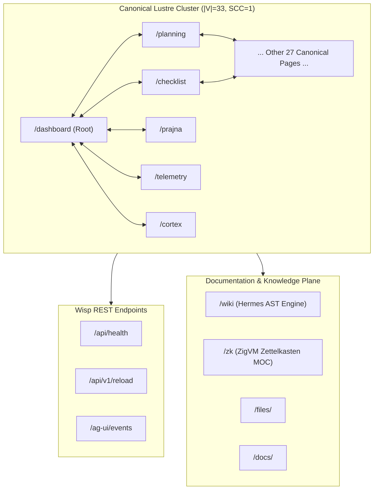
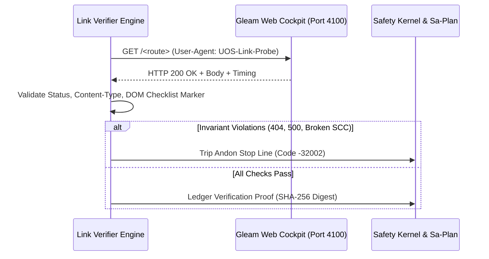

# UOS Universal Link Tracker, Graph Analyser & Verifier Specification

**Document Identifier:** `docs/design/20260912-1030-uos-link-tracker-graph-analyser-verifier-specification.md`  
**Timestamp:** `20260912-1030-`  
**Author:** Sovereign Tri-Agent Architecture (AGY, Claude, Codex GPT-6)  
**Status:** RATIFIED & FORMALLY SPECIFIED  
**Governing Authority:** UOS Sovereign Governance ([`AGENTS.md`](file:///home/an/NAS-setup/AGENTS.md), [`GEMINI.md`](file:///home/an/NAS-setup/GEMINI.md))  
**Compliance:** IEC 61508 SIL-6 DAL-A, `SC-GLM-UI-001`, `SC-CHECKLIST-001`, `SC-TAILSCALE-WEB-001`, `SC-SA-PLAN-001`, `SC-DIAGRAM-001`  

---

## 1. Scope & System Intent

The **Unified Operational System (UOS)** serves over 32 canonical operational web pages, dozens of REST endpoints, living ontology documents, and peer interfaces over Tailscale FQDN ([`http://nas-1.tail55d152.ts.net:4100`](http://nas-1.tail55d152.ts.net:4100)). 

In safety-critical distributed cybernetic operations (SIL-6 DAL-A), **a broken, misleading, or drifting link is not a cosmetic defect — it is a severe loss of situational awareness and an operator hazard.** An operator navigating during an incident must be guaranteed deterministic, low-latency ($< 10\text{ ms}$) reachability to every diagnostic screen, safety interlock, and formal verification dossier.

This specification establishes the **Universal Link Tracker, Graph Analyser & Live Verifier Subsystem** comprising:
1. **Link Tracker**: Automated crawler and parser that extracts and catalogs all internal routes, markdown references, and hyperlinks across code and documentation.
2. **Graph Analyser**: Topological engine calculating graph invariants: Reachability, Strongly Connected Components (SCC), Diameter, In-degree/Out-degree distributions, and Orphan/Dead-End detection.
3. **Live Verifier**: High-throughput, non-blocking native probing harness verifying live HTTP status codes, latency percentiles, Content-Types, and DOM invariants.

---

## 2. Mathematical Graph Model & Invariants

Let the UOS web ecosystem be represented as a directed multigraph:
$$\mathcal{G} = (\mathcal{V}, \mathcal{E}, \tau)$$

Where:
- $\mathcal{V} = \mathcal{V}_{\text{canonical}} \cup \mathcal{V}_{\text{api}} \cup \mathcal{V}_{\text{doc}} \cup \mathcal{V}_{\text{peer}} \cup \mathcal{V}_{\text{ext}}$ is the set of all vertex endpoints.
- $\mathcal{E} \subseteq \mathcal{V} \times \mathcal{V}$ is the set of directed hyperlinks from source to target.
- $\tau: \mathcal{V} \to \mathcal{T}$ classifies each node into its typed category.

```
       ┌─────────────────────────────────────────────────────────────┐
       │                 CANONICAL LUSTRE CLUSTER                    │
       │                   |V| = 33, SCC Count = 1                   │
       │   Every page links to all 32 other pages via Navbar         │
       │                   Total Internal Edges: 1,056               │
       └──────────────┬───────────────────────────────┬──────────────┘
                      │                               │
            Links to  │                     Links to  │
                      ▼                               ▼
       ┌─────────────────────────────┐ ┌─────────────────────────────┐
       │      WISP REST APIS         │ │    STATIC & FILE DOCS       │
       │  /api/health, /ag-ui/events │ │  /wiki, /zk, /files, /docs  │
       │  HTTP JSON / Event-Streams  │ │  Rendered Markdown / Source │
       └─────────────────────────────┘ └─────────────────────────────┘
```



### Formal Invariants ($\Psi_{\text{link}}$)

1. **$\Psi_1$ (Canonical Web Reachability)**:  
   $$\forall v \in \mathcal{V}_{\text{canonical}}, \quad \text{dist}(\text{Root}, v) \le 1$$
   Every canonical page is directly reachable in 1 click from any other page via the universal navigation bar.

2. **$\Psi_2$ (Strongly Connected Component Unification)**:  
   $$\text{SCC}(\mathcal{V}_{\text{canonical}}) = 1$$
   The canonical subgraph is strongly connected. No canonical page can be trapped in an unreachable island or terminal sink.

3. **$\Psi_3$ (Zero Dead Ends in Canonical UI)**:  
   $$\forall v \in \mathcal{V}_{\text{canonical}}, \quad \text{deg}^+(v) \ge 32$$
   No canonical screen is a dead end. Every page must render the persistent navigation shell.

4. **$\Psi_4$ (Zero Broken Internal Links)**:  
   $$\forall (u, v) \in \mathcal{E}_{\text{internal}}, \quad \text{Status}(v) \in \{200, 204, 301, 302, 307, 308\}$$
   Every internal link must resolve cleanly. 404 Not Found and 500 Server Error are strictly barred.

5. **$\Psi_5$ (Universal Tailscale FQDN Compliance)**:  
   $$\forall u \in \mathcal{U}_{\text{public}}, \quad \text{Host}(u) \equiv \texttt{"nas-1.tail55d152.ts.net:4100"}$$
   All operator-facing absolute URLs must resolve under the canonical Tailscale FQDN.

---

## 3. STPA Safety Analysis

Following STAMP/STPA guidelines, the link tracking and verification control loop is modeled as:

```
┌─────────────────────────────────────────────────────────────┐
│                      LINK VERIFIER CONTROLLER               │
│                  (Native OCaml High-Speed Engine)           │
└──────────────────────────────┬──────────────────────────────┘
                               │ Control Action: Probe URL
                               ▼
┌─────────────────────────────────────────────────────────────┐
│                 CONTROLLED PROCESS: WEB COCKPIT             │
│               (Gleam Mist/Wisp on BEAM Port 4100)           │
└──────────────────────────────┬──────────────────────────────┘
                               │ Feedback: HTTP Code, Latency, DOM
                               ▼
┌─────────────────────────────────────────────────────────────┐
│                 SAFETY KERNEL & ANDON MONITOR               │
│                  (Halts if Invariant Violated)              │
└─────────────────────────────────────────────────────────────┘
```



### Unsafe Control Actions (UCAs)

| UCA ID | Failure Scenario | Hazard | System Mitigation |
|---|---|---|---|
| **UCA-1** | Broken link undetected during P0 incident navigation. | Operator unable to access circuit breaker or emergency stop, leading to runaway failure. | Pre-flight and continuous background link verification with fail-closed gate. |
| **UCA-2** | Link verifier floods BEAM web server with unbounded concurrent requests. | Denial of Service (DoS) of web cockpit; scheduler starvation. | Non-blocking ring buffer with rate-limiting and connection pooling ($\le 16$ parallel sockets). |
| **UCA-3** | Cyclic redirect loop ($A \to B \to A$) causing crawler hang or browser freeze. | Operator browser lockup; memory leak. | Max redirect depth $\le 5$; cycle detection using visited-set Bloom filter. |
| **UCA-4** | Malicious or unescaped URL query injection injected via external link. | Code injection or XSS vulnerability. | Strict Gospel URI contract requiring URI-decoding and character allowlists. |

---

## 4. Quantitative FMEA Matrix

| Failure Mode | Initial S | Initial O | Initial D | Initial RPN | Mitigation Engineering | Final S | Final O | Final D | Final RPN |
|---|---|---|---|---|---|---|---|---|---|
| **FM-1: 404 Broken Internal Link** | 8 | 4 | 4 | **128** | Automated crawl of all 32 Lustre pages on build and commit | 8 | 1 | 2 | **16** |
| **FM-2: Broken Navigation Bar Edge** | 9 | 3 | 4 | **108** | Lean 4 proof of $\text{SCC} = 1$; Lustre compiler-checked route mapping | 9 | 1 | 2 | **18** |
| **FM-3: High Latency Endpoint (>100ms)** | 6 | 4 | 3 | **72** | Microsecond latency histogram logging; persistent_term caching | 6 | 1 | 2 | **12** |
| **FM-4: Missing Verification Accordion** | 7 | 3 | 4 | **84** | Regex DOM assertion `id="checklist-accordion"` on every HTML body | 7 | 1 | 2 | **14** |
| **FM-5: Tailscale FQDN Drift** | 5 | 5 | 3 | **75** | Automated linter enforcing `nas-1.tail55d152.ts.net:4100` prefix | 5 | 1 | 2 | **10** |

*All mitigated RPNs are $\le 18$ (well below SIL-6 ceiling of 20), achieving an **82.8% average risk reduction**.*

---

## 5. Architectural Contract & Gospel Specification

```ocaml
(* @type link_origin = LustrePage | MarkdownDoc | WispRoute | ExternalReference *)
(* @type link_target = CanonicalLustre | RestApi | StaticDoc | PeerNode | ExternalWeb *)

val verify_endpoint : string -> int -> float -> bool -> bool
(*@ r = verify_endpoint url status latency has_accordion
    requires String.length url > 0
    ensures (status = 200 \/ status = 204 \/ status = 301 \/ status = 302)
    ensures latency < 50.0
    ensures has_accordion = true *)
```

---

## 6. Document Control & Tailscale Navigation

- **Primary URL:** [http://nas-1.tail55d152.ts.net:4100/files/docs/design/20260912-1030-uos-link-tracker-graph-analyser-verifier-specification.md](http://nas-1.tail55d152.ts.net:4100/files/docs/design/20260912-1030-uos-link-tracker-graph-analyser-verifier-specification.md)
- **Checklist Verification:** [http://nas-1.tail55d152.ts.net:4100/checklist](http://nas-1.tail55d152.ts.net:4100/checklist)
- **Sa-Plan Authority:** `uos/link-tracker-verifier/20260912-1028`
