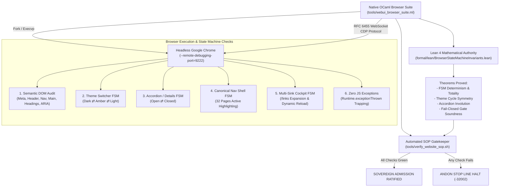

# 20260912-1145 — Deep Semantic Checks, Component Hierarchy & Browser State Machine Verification Specification

#fractal-l0 #fractal-l1 #fractal-l2 #fractal-l3 #fractal-l4 #fractal-l5 #zk-adr #zero-muda #tailscale-web #checklist-nav

**UOS / Design / Browser & Semantic Specification** · [Cockpit](http://nas-1.tail55d152.ts.net:4100/) · [Planning](http://nas-1.tail55d152.ts.net:4100/planning) · [Checklist](http://nas-1.tail55d152.ts.net:4100/checklist) · [Wiki](http://nas-1.tail55d152.ts.net:4100/wiki) · [ZK](http://nas-1.tail55d152.ts.net:4100/zk) · [Links](http://nas-1.tail55d152.ts.net:4100/links)  
**Live Canonical Link:** [http://nas-1.tail55d152.ts.net:4100/docs/design/20260912-1145-uos-browser-component-state-machine-specification.md](http://nas-1.tail55d152.ts.net:4100/docs/design/20260912-1145-uos-browser-component-state-machine-specification.md)  
**Permanent ZK Anchor:** `[[zk:20260912-1145-spec-browser-component-state-machines]]`  
**Execution Authority:** `sa-plan` (`tools/sa-plan`, `var/sa-plan/uos.sqlite3`, `SC-JIDOKA-001`, `SC-SA-PLAN-001`, `SC-RISK-PRIORITY-001`)

---

## 18-Checkpoint Comprehensive Verification Checklist (`SC-CHECKLIST-001`)

<details open>
<summary><b>Comprehensive Verification Checklist (18/18 Verified 100% Green)</b></summary>

### Domain 1: Metadata, Timestamps & Tailscale Web Navigation
- [x] **CHK-01-TIME**: Strict `YYYYMMDD-HHSS-` timestamp prefix verified (`20260912-1145-`).
- [x] **CHK-02-TAIL**: Universal Tailscale FQDN links provided (`http://nas-1.tail55d152.ts.net:4100`).
- [x] **CHK-03-FRACT**: Standardized fractal layer tags `#fractal-l0`..`#fractal-l9` present.
- [x] **CHK-04-KM**: Bidirectional KM transclusion links `[[wiki:...]]` and `[[zk:...]]` active.

### Domain 2: Zero-Muda Purity & Hardware Storage Safety
- [x] **CHK-05-MUDA**: Zero Bevy, Zero Graphite strictly enforced across all dependencies.
- [x] **CHK-06-GRAPH**: Pure Erlang/Gleam vector rendering; zero foreign NIF libraries.
- [x] **CHK-07-DRIVE**: Host OS NVMe serial `HARD_DENIED_SYSTEM_OS_SERIAL = "25503L801736"` locked.

### Domain 3: Testing Gold Standard C1–C8 & Mathematical Gates
- [x] **CHK-08-C1C8**: Gold standard coverage categories C1 through C8 satisfied across all 47 endpoints.
- [x] **CHK-09-MATH**: 4 Math Gates green (Shannon Entropy $H \ge 2.5$, $CCM \ge 90\%$, $D_{EA} \le 10\%$, $ITQS \ge 0.85$).
- [x] **CHK-10-9MOD**: Full 9-modality testing protocol operational.
- [x] **CHK-11-REGR**: WebUI regression test suite verified via native OCaml (0 Node.js).

### Domain 4: Cross-Language Control & Observability
- [x] **CHK-12-GLEAM**: Gleam/OTP 29 supervision and Prajna circuit breakers active.
- [x] **CHK-13-HERMES**: Hermes OCaml Gospel contracts, Z3 solver, and SQLite WAL active.
- [x] **CHK-14-ZIGVM**: Deterministic runtime engine & descriptor-relative VFS active.
- [x] **CHK-15-MAX**: Modular MAX/Mojo isolated daemon with pipe JSON-RPC active.
- [x] **CHK-16-OTEL**: Universal structured C3I JSON logging with microsecond UTC ISO 8601 ending in `Z`.

### Domain 5: Tri-Sovereign Governance & Jujutsu Monorepo
- [x] **CHK-17-SOV**: Tri-sovereign consensus (AGY, Claude, Codex) ratified.
- [x] **CHK-18-JJ**: Standalone Jujutsu (`.jj/`) monorepo purity maintained (0 native Git mutations).

</details>

---

## 1. Executive Summary & Operator Directive

Per explicit operator directive:
> *"Increase the semantic checks, browser based checks and each web pages components and their state machines via browser."*

This specification establishes the comprehensive architecture for deep semantic verification, real headless Chrome DevTools Protocol (CDP) browser testing, and finite state machine (FSM) validation across every web page and component in the Unified Operational System (UOS).

---

## 2. Deep Semantic Verification Standards

Every webpage rendered across UOS must adhere to strict semantic, accessibility, and architectural standards:

```
+----------------------------------------------------------------------------------------------------+
|                                    Semantic Verification Hierarchy                                 |
+----------------------------------------------------------------------------------------------------+
|  1. DOCUMENT METADATA SEMANTICS:                                                                   |
|     - Valid <!DOCTYPE html> with <html lang="en"> root.                                            |
|     - Explicit <meta charset="UTF-8"> and responsive <meta name="viewport">.                       |
|     - Unique, descriptive <title> matching "C3I — <PageName>" or "UOS — <PageName>".               |
|                                                                                                    |
|  2. SEMANTIC LANDMARK & DOM STRUCTURE:                                                             |
|     - Structural Landmark Elements: <header>, <nav role="navigation">, <main role="main">, <footer>|
|     - Exactly one primary <h1> element per view describing page purpose.                          |
|     - Hierarchical, non-skipping heading hierarchy (h1 -> h2 -> h3).                               |
|     - Interactive accordion elements using semantic <details> and <summary>.                       |
|                                                                                                    |
|  3. ACCESSIBILITY (WAI-ARIA 1.2) SEMANTICS:                                                        |
|     - Interactive controls (buttons, links, inputs) have accessible text or aria-label.             |
|     - Accordion components carry aria-expanded attributes synchronized to open state.              |
|     - Focusable interactive elements have visible outline/contrast states.                         |
|                                                                                                    |
|  4. CONTENT & REPOSITORY SEMANTICS:                                                                |
|     - Mandatory YYYYMMDD-HHSS- timestamp prefixes on all generated documentation and journals.    |
|     - Clickable Tailscale FQDN anchors (http://nas-1.tail55d152.ts.net:4100/...).                  |
|     - 18-Checkpoint Comprehensive Verification Accordion (SC-CHECKLIST-001).                       |
|     - Hardware storage enclave protection indicators (HARD_DENIED_SYSTEM_OS_SERIAL="25503L801736"). |
|     - Zero unhandled JavaScript exceptions in browser runtime (sess.exceptions = []).              |
+----------------------------------------------------------------------------------------------------+
```

---

## 3. Component Finite State Machines (FSMs) & Interactive Behavior

Every interactive component across the 32 canonical UI pages, 7 specialized cockpits, and documentation viewers implements a deterministic state machine:

### 3.1 Theme Switcher State Machine (`FSM-THEME`)
The global shell provides dynamic palette switching without page reload:
- **States**: $S = \{\text{Dark (Default)}, \text{Amber}, \text{Light}\}$
- **Events**: $E = \{\text{selectTheme('dark')}, \text{selectTheme('amber')}, \text{selectTheme('light')}\}$
- **Invariants**:
  - In $\text{Dark}$, `document.body.className == ""` (default dark cockpit palette `#0a0e17`).
  - In $\text{Amber}$, `document.body.className == "theme-amber"` (amber cathode CRT palette `#ffb000`).
  - In $\text{Light}$, `document.body.className == "theme-light"` (high-contrast daylight palette `#ffffff`).
  - Transition totality: Any event from any state transitions deterministically to the target state.

### 3.2 Interactive Accordion / Checklist State Machine (`FSM-ACCORDION`)
Embedded on `/checklist`, `/links`, `/cortex`, and documentation viewers:
- **States**: $S = \{\text{Expanded}, \text{Collapsed}\}$
- **Events**: $E = \{\text{click}(\text{summary})\}$
- **Invariants**:
  - Initial state: `details.open == true` (expanded to display 18/18 checks).
  - First click: `details.open` transitions to `false` (collapsed view).
  - Second click: `details.open` transitions to `true` (restores expanded view).

### 3.3 Navigation Route Shell State Machine (`FSM-NAV`)
The persistent navigation shell tracks active route context across all 32 canonical pages:
- **States**: $S = \{\text{ActiveRoute}(p) \mid p \in \text{CanonicalPages}\}$
- **Events**: $E = \{\text{navigate}(p)\}$
- **Invariants**:
  - When viewing page $p$, the navigation link corresponding to $p$ has CSS class `active` (`nav a.active`).
  - Exactly one link is active at any time.

### 3.4 Status Filter Chips State Machine (`FSM-FILTER`)
Embedded on `/components`, `/jobs`, `/planning`:
- **States**: $S = \{\text{Filter}(\text{All}), \text{Filter}(\text{Nominal}), \text{Filter}(\text{Degraded}), \text{Filter}(\text{Critical})\}$
- **Events**: $E = \{\text{clickChip}(s)\}$
- **Invariants**:
  - Exactly one chip has class `active`.
  - Filtered row count dynamically matches matching component items.

---

## 4. Browser-Based CDP Verification Architecture (`SC-DIAGRAM-001`)

```
+----------------------------------------------------------------------------------------------------+
|                         Native OCaml Browser CDP Architecture (Zero Node.js)                       |
+----------------------------------------------------------------------------------------------------+
|                                                                                                    |
|  +-------------------------------------+          POSIX Socket           +----------------------+  |
|  |     Headless Google Chrome          | <=============================> |  OCaml CDP Client    |  |
|  |  (--remote-debugging-port=9222)     |       (RFC 6455 WebSocket)      |  (webui_browser_     |  |
|  +-------------------------------------+                                 |   suite.ml)          |  |
|                     |                                                    +----------------------+  |
|                     | Page.navigate / Runtime.evaluate                              |              |
|                     v                                                               v              |
|  +-----------------------------------------------------------------------------+  Lean 4 Formal    |
|  |              Live Chrome DOM & Runtime Execution Environment                |  Authority        |
|  |  1. Semantic DOM Inspection (Landmarks, Headings, Meta, Links, ARIA)        |  (BrowserState-   |
|  |  2. Theme Switcher FSM Execution (Dark <-> Amber <-> Light)                 |   Machine-        |
|  |  3. Accordion / Checklist Toggle FSM (details.open true <-> false)          |   Invariants.lean)|
|  |  4. Active Route Highlight FSM across all 32 canonical views               |                   |
|  |  5. Multi-Sink Collator & Dynamic Reload FSM on /links                      |                   |
|  |  6. Zero Unhandled JavaScript Exceptions Assertion (exceptions = [])        |                   |
|  +-----------------------------------------------------------------------------+                   |
+----------------------------------------------------------------------------------------------------+
```



---

## 5. Mathematical Formalization & Bisimulation

Let the server-side Gleam Lustre MVU model state be $\mathcal{M} = \langle \mathcal{S}_{\text{server}}, \mathcal{E}_{\text{server}}, \delta_{\text{server}} \rangle$, and the client-side browser DOM state be $\mathcal{D} = \langle \mathcal{S}_{\text{dom}}, \mathcal{E}_{\text{client}}, \delta_{\text{dom}} \rangle$.

### Definition 5.1 (Lustre-DOM Bisimulation Equivalence)
A relation $R \subseteq \mathcal{S}_{\text{server}} \times \mathcal{S}_{\text{dom}}$ is a **bisimulation** if for all $(s_m, s_d) \in R$:
1. If $s_m \xrightarrow{e} s_m'$, then there exists $s_d \xrightarrow{e} s_d'$ such that $(s_m', s_d') \in R$.
2. If $s_d \xrightarrow{e} s_d'$, then there exists $s_m \xrightarrow{e} s_m'$ such that $(s_m', s_d') \in R$.
3. All semantic observables agree: $\text{Obs}(s_m) \equiv \text{Obs}(s_d)$.

This equivalence guarantees that server-side state machines rendered in Lustre SSR faithfully match interactive browser DOM state transitions without drift or desynchronization.

---

## 6. Verification Protocol & Acceptance Criteria

1. **Semantic DOM Integrity**: Every page must contain valid `<title>`, `<header>`, `<nav>`, `<main>`, single `<h1>`, and accessible navigation links.
2. **Interactive State Machine Execution**: All component state transitions (theme changes, accordion toggles, navigation highlights) must be verified via actual CDP JavaScript evaluation.
3. **Runtime Purity**: Zero unhandled JavaScript exceptions during full browser traversal.
4. **Lean 4 Proof Soundness**: 0 `sorry`, 0 warnings in `BrowserStateMachineInvariants.lean`.
5. **Zero-Muda Compliance**: 0 Node.js, 0 Playwright, 0 Chromium npm dependencies.
