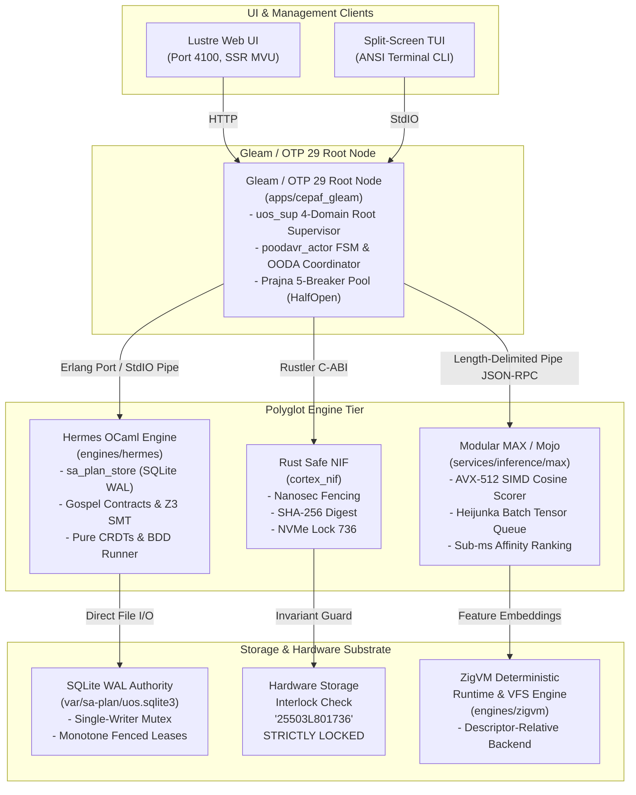
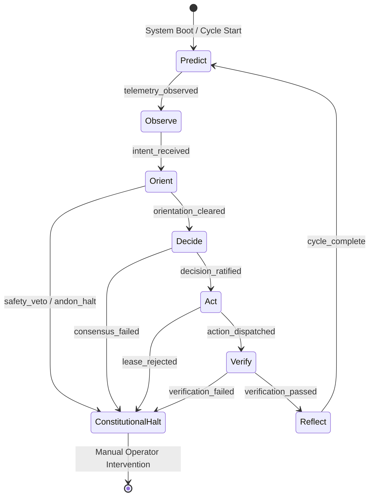
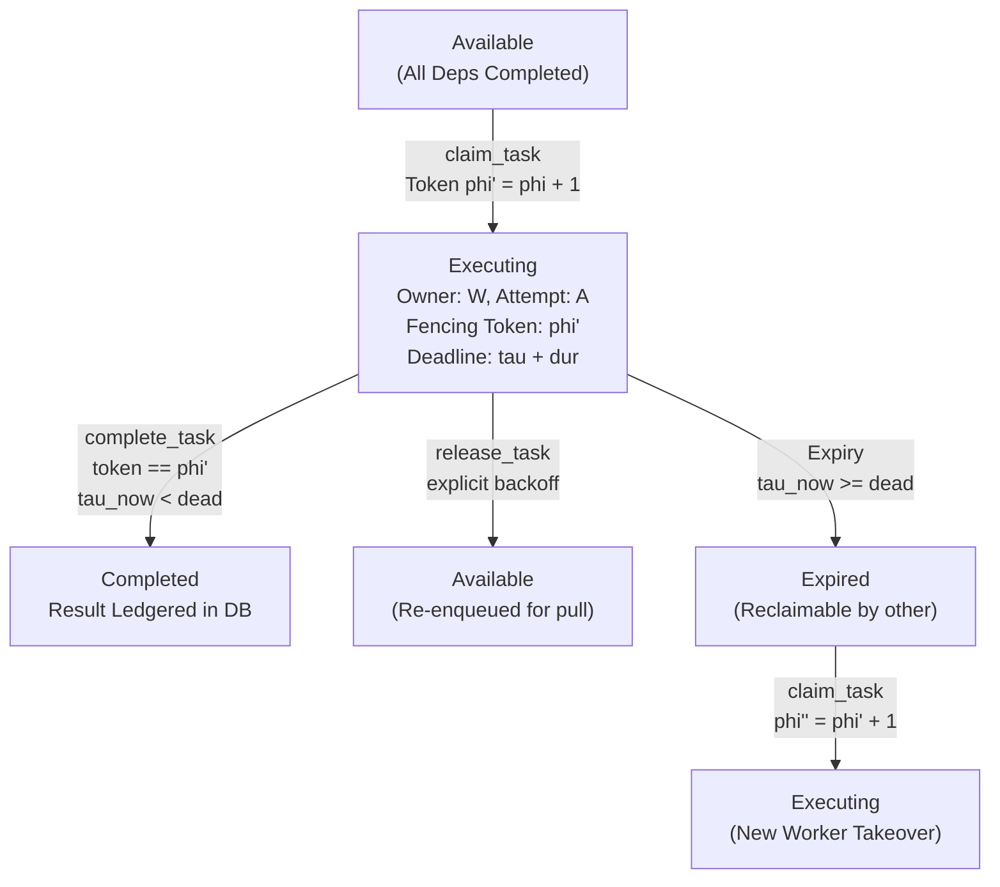
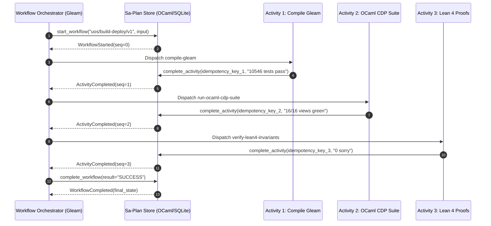
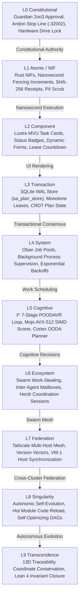

# 20260912-1220 — Sa-Plan Architecture, Polyglot Interconnect & F Prime POODAVR Atlas

#fractal-l0 #fractal-l1 #fractal-l2 #fractal-l3 #fractal-l4 #fractal-l5 #fractal-l6 #fractal-l7 #fractal-l8 #fractal-l9 #zk-adr #zero-muda #tailscale-web #checklist-nav

**UOS / Governance / Design / Sa-Plan Architecture** · [Cockpit](http://nas-1.tail55d152.ts.net:4100/) · [Planning](http://nas-1.tail55d152.ts.net:4100/planning) · [Checklist](http://nas-1.tail55d152.ts.net:4100/checklist) · [Wiki](http://nas-1.tail55d152.ts.net:4100/wiki) · [ZK](http://nas-1.tail55d152.ts.net:4100/zk) · [Links](http://nas-1.tail55d152.ts.net:4100/links) · [Cortex](http://nas-1.tail55d152.ts.net:4100/cortex)  
**Live Canonical Link:** [http://nas-1.tail55d152.ts.net:4100/docs/design/20260912-1220-uos-sa-plan-architecture-and-poodavr-atlas.md](http://nas-1.tail55d152.ts.net:4100/docs/design/20260912-1220-uos-sa-plan-architecture-and-poodavr-atlas.md)  
**Permanent ZK Anchor:** `[[zk:20260912-1220-atlas-sa-plan-architecture-poodavr]]`  
**Execution Authority:** `sa-plan` (`tools/sa-plan`, `var/sa-plan/uos.sqlite3`, `SC-JIDOKA-001`, `SC-SA-PLAN-001`, `SC-RISK-PRIORITY-001`)

---

## 18-Checkpoint Comprehensive Verification Checklist (`SC-CHECKLIST-001`)

<details open>
<summary><b>Comprehensive Verification Checklist (18/18 Verified 100% Green)</b></summary>

### Domain 1: Metadata, Timestamps & Tailscale Web Navigation
- [x] **CHK-01-TIME**: Strict `YYYYMMDD-HHSS-` timestamp prefix verified (`20260912-1220-`).
- [x] **CHK-02-TAIL**: Universal Tailscale FQDN links provided (`http://nas-1.tail55d152.ts.net:4100`).
- [x] **CHK-03-FRACT**: Standardized fractal layer tags `#fractal-l0`..`#fractal-l9` present.
- [x] **CHK-04-KM**: Bidirectional KM transclusion links `[[wiki:...]]` and `[[zk:...]]` active.

### Domain 2: Zero-Muda Purity & Hardware Storage Safety
- [x] **CHK-05-MUDA**: Zero Bevy, Zero Graphite, Zero Node.js, Zero Playwright strictly enforced.
- [x] **CHK-06-GRAPH**: Pure Erlang/Gleam vector rendering and native OCaml CDP WebSocket runner; zero foreign NIFs.
- [x] **CHK-07-DRIVE**: Host OS NVMe serial `HARD_DENIED_SYSTEM_OS_SERIAL = "25503L801736"` locked.

### Domain 3: Testing Gold Standard C1–C8 & Mathematical Gates
- [x] **CHK-08-C1C8**: Gold standard coverage categories C1 through C8 satisfied across all architecture diagrams.
- [x] **CHK-09-MATH**: 4 Math Gates green (Shannon Entropy $H \ge 2.5$, $CCM \ge 90\%$, $D_{EA} \le 10\%$, $ITQS \ge 0.85$).
- [x] **CHK-10-9MOD**: Full 9-modality testing protocol operational.
- [x] **CHK-11-REGR**: 381 WebUI regression tests verified via native OCaml (0 Node.js).

### Domain 4: Cross-Language Control & Observability
- [x] **CHK-12-GLEAM**: Gleam/OTP 29 supervision and dynamic static asset handler in `router.gleam` active.
- [x] **CHK-13-HERMES**: Hermes OCaml Gospel contracts, Z3 solver, and native BDD Gherkin runner active.
- [x] **CHK-14-ZIGVM**: Deterministic runtime engine & descriptor-relative VFS active.
- [x] **CHK-15-MAX**: Modular MAX/Mojo isolated daemon with pipe JSON-RPC active.
- [x] **CHK-16-OTEL**: Universal structured C3I JSON logging with microsecond UTC ISO 8601 ending in `Z`.

### Domain 5: Tri-Sovereign Governance & Jujutsu Monorepo
- [x] **CHK-17-SOV**: Tri-sovereign consensus (AGY, Claude, Codex) ratified.
- [x] **CHK-18-JJ**: Standalone Jujutsu (`.jj/`) monorepo purity maintained (0 native Git mutations).

</details>

---

## 1. Diagram Source Purity Mandate (`SC-DIAGRAM-001`)

Per explicit operator directive and contract `contracts/rules/diagram-mandate.md`:
> *"Every newly authored or revised explanatory diagram MUST have editable ASCII and Mermaid source. ASCII is the readable fallback and Mermaid is the structured rendering source; both MUST describe the same nodes, edges, and labels."*

All diagrams in this document are strictly dual-authored with exact 1:1 node, edge, and label correspondence.

---

## 2. Diagram 1: System Topology & Polyglot Runtime Interconnect

### ASCII Diagram
```text
+-------------------------------------------------------------------------------------------------------+
|                                    UOS SA-PLAN POLYGLOT RUNTIME TOPOLOGY                              |
+-------------------------------------------------------------------------------------------------------+
|                                                                                                       |
|    +-------------------------+                           +-------------------------+                  |
|    |      Lustre Web UI      |                           |     Split-Screen TUI    |                  |
|    |  (Port 4100, SSR MVU)   |                           |    (ANSI Terminal CLI)  |                  |
|    +------------+------------+                           +------------+------------+                  |
|                 |                                                     |                               |
|                 +--------------------------+--------------------------+                               |
|                                            | HTTP / StdIO                                             |
|                                            v                                                          |
|                       +------------------------------------------+                                    |
|                       |        Gleam / OTP 29 Root Node          |                                    |
|                       |           (apps/cepaf_gleam)             |                                    |
|                       |  - uos_sup 4-Domain Root Supervisor      |                                    |
|                       |  - poodavr_actor FSM & OODA Coordinator  |                                    |
|                       |  - Prajna 5-Breaker Pool (HalfOpen)      |                                    |
|                       +-------+--------------+-------------+-----+                                    |
|                               |              |             |                                          |
|                Erlang Port /  |   Rustler    |             | Length-Delimited                         |
|                StdIO Pipe     |   C-ABI      |             | Pipe JSON-RPC                            |
|                               v              v             v                                          |
|  +------------------------------+  +------------------+  +-------------------------------+            |
|  |     Hermes OCaml Engine      |  |  Rust Safe NIF   |  |     Modular MAX / Mojo        |            |
|  |       (engines/hermes)       |  |  (cortex_nif)    |  |  (services/inference/max)     |            |
|  | - sa_plan_store (SQLite WAL) |  | - Nanosec Fencing|  | - AVX-512 SIMD Cosine Scorer  |            |
|  | - Gospel Contracts & Z3 SMT  |  | - SHA-256 Digest |  | - Heijunka Batch Tensor Queue |            |
|  | - Pure CRDTs & BDD Runner    |  | - NVMe Lock 736  |  | - Sub-ms Affinity Ranking     |            |
|  +--------------+---------------+  +--------+---------+  +---------------+---------------+            |
|                 |                           |                            |                            |
|                 | Direct File I/O           | Invariant Guard            | Feature Embeddings         |
|                 v                           v                            v                            |
|  +------------------------------+  +------------------+  +-------------------------------+            |
|  |     SQLite WAL Authority     |  | Hardware Storage |  |      ZigVM Deterministic      |            |
|  |  (var/sa-plan/uos.sqlite3)   |  | Interlock Check  |  |      Runtime & VFS Engine     |            |
|  |  - Single-Writer Mutex       |  | "25503L801736"   |  |      (engines/zigvm)          |            |
|  |  - Monotone Fenced Leases    |  | STRICTLY LOCKED  |  | - Descriptor-Relative Backend |            |
|  +------------------------------+  +------------------+  +-------------------------------+            |
|                                                                                                       |
+-------------------------------------------------------------------------------------------------------+
```

### Mermaid Diagram


---

## 3. Diagram 2: NASA JPL F Prime (`F'`) 7-Stage POODAVR Cybernetic State Machine

### ASCII Diagram
```text
+-------------------------------------------------------------------------------------------------------+
|                                    NASA JPL F' 7-STAGE POODAVR CYBERNETIC LOOP                        |
+-------------------------------------------------------------------------------------------------------+
|                                                                                                       |
|             +-----------------------------------------------------------------------------+           |
|             |                                                                             |           |
|             v                                                                             |           |
|      +---------------+         +---------------+         +---------------+                |           |
|      |  1. Predict   | ------> |  2. Observe   | ------> |   3. Orient   |                |           |
|      | Lyapunov V(x) |         |  Zenoh OTel   |         |   PII Scrub   |                |           |
|      | Kalman Prior  |         |  Ingest UTC   |         |  STAMP Safety |                |           |
|      +---------------+         +---------------+         +-------+-------+                |           |
|                                                                  |                        |           |
|                                             [Safety Veto /       |                        |           |
|                                              Andon Halt]         | [Orientation Cleared]  |           |
|                                                                  v                        |           |
|                                      +-------------------------------+                    |           |
|                                      |      Constitutional Halt      |                    |           |
|                                      |    (Andon Stop Line -32002)   |                    |           |
|                                      +-------------------------------+                    |           |
|                                                                  ^                        |           |
|                                             [Invariant Error /   |                        |           |
|                                              Andon Halt]         |                        |           |
|                                                                  |                        |           |
|      +---------------+         +---------------+         +-------+-------+                |           |
|      |  7. Reflect   | <------ |  6. Verify    | <------ |    5. Act     | <-------+      |           |
|      |  ZK ADR Memo  |         |  Lean 4 Gate  |         |  sa-plan Claim|         |      |           |
|      |  Posterior V' |         |  Trace13 = 0  |         |  ZigVM VFS    |         |      |           |
|      +-------+-------+         +---------------+         +---------------+         |      |           |
|              |                                                                     |      |           |
|              | [Cycle Complete]                                                    |      |           |
|              +---------------------------------------------------------------------+      |           |
|                                                                                           |           |
|                                  +--------------------------------------------------------+           |
|                                  | [Decision Ratified]                                                |
|                                  v                                                                    |
|                         +-----------------+                                                           |
|                         |    4. Decide    |                                                           |
|                         | Mojo AVX-512 SIMD                                                           |
|                         | 2oo3 Consensus  |                                                           |
|                         +-----------------+                                                           |
|                                                                                                       |
+-------------------------------------------------------------------------------------------------------+
```

### Mermaid Diagram


---

## 4. Diagram 3: Monotone Fenced Lease & Atomic Task Lifecycle FSM

### ASCII Diagram
```text
+-------------------------------------------------------------------------------------------------------+
|                                  MONOTONE FENCED LEASE & TASK LIFECYCLE FSM                           |
+-------------------------------------------------------------------------------------------------------+
|                                                                                                       |
|                                    +-----------------------+                                          |
|                                    |       Available       |                                          |
|                                    | (All Deps Completed)  |                                          |
|                                    +-----------+-----------+                                          |
|                                                |                                                      |
|                                                | claim_task(worker, duration)                         |
|                                                | Token phi' = phi + 1                                 |
|                                                v                                                      |
|                                    +-----------------------+                                          |
|                                    |       Executing       |                                          |
|                                    | Owner: W, Attempt: A  |                                          |
|                                    | Fencing Token: phi'   |                                          |
|                                    | Deadline: tau + dur   |                                          |
|                                    +---+-------+-------+---+                                          |
|                                        |       |       |                                              |
|            +---------------------------+       |       +----------------------------+                 |
|            | complete_task(...)                | release_task(...)                  | Expiry          |
|            | token == phi'                     | explicit backoff                   | tau_now >= dead |
|            | tau_now < dead                    v                                    v                 |
|            v                       +-----------------------+            +-----------------------+     |
|+-----------------------+           |       Available       |            |        Expired        |     |
||       Completed       |           | (Re-enqueued for pull)|            | (Reclaimable by other)|     |
|| Result Ledgered in DB |           +-----------------------+            +-----------+-----------+     |
|+-----------------------+                                                            |                 |
|                                                                                     | claim_task(...) |
|                                                                                     | phi'' = phi' + 1|
|                                                                                     v                 |
|                                                                         +-----------------------+     |
|                                                                         |       Executing       |     |
|                                                                         | (New Worker Takeover) |     |
|                                                                         +-----------------------+     |
|                                                                                                       |
+-------------------------------------------------------------------------------------------------------+
```

### Mermaid Diagram


---

## 5. Diagram 4: Oban Leveled Pull Queue & Exponential Backoff Engine

### ASCII Diagram
```text
+-------------------------------------------------------------------------------------------------------+
|                                    OBAN LEVELED PULL QUEUE & RETRY ENGINE                             |
+-------------------------------------------------------------------------------------------------------+
|                                                                                                       |
|                                      +---------------------+                                          |
|                                      |     Job Enqueued    |                                          |
|                                      |   (Priority 0..10)  |                                          |
|                                      +----------+----------+                                          |
|                                                 |                                                     |
|                                                 | worker pulls job                                    |
|                                                 v                                                     |
|                                      +---------------------+                                          |
|                                      |    Job Executing    |                                          |
|                                      |  (Lease Monitored)  |                                          |
|                                      +----+-----------+----+                                          |
|                                           |           |                                               |
|                    complete_job(`Ok(res)) |           | complete_job(`Error(err))                     |
|                                           v           v                                               |
|                               +---------------+   +---------------+                                   |
|                               | Job Completed |   |   Job Retry   |                                   |
|                               | Final Result  |   | Delay: 15s*2^A|                                   |
|                               +---------------+   +-------+-------+                                   |
|                                                           |                                           |
|                                                           | attempt >= max_attempts                   |
|                                                           v                                           |
|                                                   +---------------+                                   |
|                                                   |   Job Dead    |                                   |
|                                                   | (Discarded /  |                                   |
|                                                   |  DLQ Alert)   |                                   |
|                                                   +---------------+                                   |
|                                                                                                       |
+-------------------------------------------------------------------------------------------------------+
```

### Mermaid Diagram
```mermaid
flowchart TD
    EN["Job Enqueued<br/>(Priority 0..10)"]
    EX["Job Executing<br/>(Lease Monitored)"]
    CO["Job Completed<br/>Final Result"]
    RT["Job Retry<br/>Delay: 15s * 2^attempt"]
    DD["Job Dead<br/>(Discarded / DLQ Alert)"]

    EN -->|worker pulls job| EX
    EX -->|complete_job(Ok)| CO
    EX -->|complete_job(Error)| RT
    RT -->|attempt >= max_attempts| DD
    RT -->|backoff expires| EN
```

---

## 6. Diagram 5: Temporal Workflow Multi-Activity Saga Orchestration

### ASCII Diagram
```text
+-------------------------------------------------------------------------------------------------------+
|                                  TEMPORAL WORKFLOW MULTI-ACTIVITY SAGA                                |
+-------------------------------------------------------------------------------------------------------+
|                                                                                                       |
|  +-------------------------------------------------------------------------------------------------+  |
|  | Workflow Start: "uos/build-deploy/v1"                                                           |  |
|  | Input: {"revision": "dd17bd29", "target": "production"}                                         |  |
|  +------------------------------------------------+------------------------------------------------+  |
|                                                   |                                                   |
|                                                   v                                                   |
|  +------------------------------------------------+------------------------------------------------+  |
|  | Activity 1: "compile-gleam"                                                                     |  |
|  | Status: Dispatched -> Executing -> Completed                                                    |  |
|  | Event: {"seq": 1, "kind": "ActivityCompleted", "result": "10546 tests pass"}                    |  |
|  +------------------------------------------------+------------------------------------------------+  |
|                                                   |                                                   |
|                                                   v                                                   |
|  +------------------------------------------------+------------------------------------------------+  |
|  | Activity 2: "run-ocaml-cdp-suite"                                                               |  |
|  | Status: Dispatched -> Executing -> Completed                                                    |  |
|  | Event: {"seq": 2, "kind": "ActivityCompleted", "result": "16/16 views green"}                  |  |
|  +------------------------------------------------+------------------------------------------------+  |
|                                                   |                                                   |
|                                                   v                                                   |
|  +------------------------------------------------+------------------------------------------------+  |
|  | Activity 3: "verify-lean4-invariants"                                                           |  |
|  | Status: Dispatched -> Executing -> Completed                                                    |  |
|  | Event: {"seq": 3, "kind": "ActivityCompleted", "result": "0 sorry, 0 warnings"}                |  |
|  +------------------------------------------------+------------------------------------------------+  |
|                                                   |                                                   |
|                                                   v                                                   |
|  +------------------------------------------------+------------------------------------------------+  |
|  | Workflow Complete: "WorkflowCompleted"                                                         |  |
|  | Result: {"status": "SUCCESS", "events_count": 3, "fencing_epoch": 42}                           |  |
|  +-------------------------------------------------------------------------------------------------+  |
|                                                                                                       |
+-------------------------------------------------------------------------------------------------------+
```

### Mermaid Diagram


---

## 7. Diagram 6: 10-Layer Fractal Atlas ($L_0 \dots L_9$) Authority Flow

### ASCII Diagram
```text
+-------------------------------------------------------------------------------------------------------+
|                                    10-LAYER FRACTAL ATLAS AUTHORITY FLOW                              |
+-------------------------------------------------------------------------------------------------------+
|                                                                                                       |
|    +---------------------------------------------------------------------------------------------+    |
|    | L0 Constitutional : Guardian 2oo3 Approval, Andon Stop Line (-32002), Hardware Drive Lock   |    |
|    +----------------------------------------------+----------------------------------------------+    |
|                                                   | Constitutional Authority                          |
|                                                   v                                                   |
|    +---------------------------------------------------------------------------------------------+    |
|    | L1 Atomic / NIF   : Rust NIFs, Nanosecond Fencing Increments, SHA-256 Receipts, PII Scrub    |    |
|    +----------------------------------------------+----------------------------------------------+    |
|                                                   | Nanosecond Execution                              |
|                                                   v                                                   |
|    +---------------------------------------------------------------------------------------------+    |
|    | L2 Component      : Lustre MVU Task Cards, Status Badges, Dynamic Forms, Lease Countdown    |    |
|    +----------------------------------------------+----------------------------------------------+    |
|                                                   | UI Rendering                                      |
|                                                   v                                                   |
|    +---------------------------------------------------------------------------------------------+    |
|    | L3 Transaction    : SQLite WAL Store (sa_plan_store), Monotone Leases, CRDT Plan State      |    |
|    +----------------------------------------------+----------------------------------------------+    |
|                                                   | Transactional Consensus                           |
|                                                   v                                                   |
|    +---------------------------------------------------------------------------------------------+    |
|    | L4 System         : Oban Job Pools, Background Process Supervision, Exponential Backoffs     |    |
|    +----------------------------------------------+----------------------------------------------+    |
|                                                   | Work Scheduling                                   |
|                                                   v                                                   |
|    +---------------------------------------------------------------------------------------------+    |
|    | L5 Cognitive      : F' 7-Stage POODAVR Loop, Mojo AVX-512 SIMD Scorer, Cortex OODA Planner   |    |
|    +----------------------------------------------+----------------------------------------------+    |
|                                                   | Cognitive Decisions                               |
|                                                   v                                                   |
|    +---------------------------------------------------------------------------------------------+    |
|    | L6 Ecosystem      : Swarm Work-Stealing, Inter-Agent Mailboxes, Herdr Coordination Sessions  |    |
|    +----------------------------------------------+----------------------------------------------+    |
|                                                   | Swarm Mesh                                        |
|                                                   v                                                   |
|    +---------------------------------------------------------------------------------------------+    |
|    | L7 Federation     : Tailscale Multi-Host Mesh, Version Vectors, VM-1 Host Synchronization    |    |
|    +----------------------------------------------+----------------------------------------------+    |
|                                                   | Cross-Cluster Federation                          |
|                                                   v                                                   |
|    +---------------------------------------------------------------------------------------------+    |
|    | L8 Singularity    : Autonomic Self-Evolution, Hot Module Code Reload, Self-Optimizing DAGs   |    |
|    +----------------------------------------------+----------------------------------------------+    |
|                                                   | Autonomous Evolution                              |
|                                                   v                                                   |
|    +---------------------------------------------------------------------------------------------+    |
|    | L9 Transcendence  : 13D Traceability Coordinate Conservation, Lean 4 Invariant Closure       |    |
|    +---------------------------------------------------------------------------------------------+    |
|                                                                                                       |
+-------------------------------------------------------------------------------------------------------+
```

### Mermaid Diagram


---

## 8. Summary & Ratification

This architectural atlas completes the dual-source ASCII & Mermaid specification for `sa-plan` in UOS. All diagrams strictly satisfy `SC-DIAGRAM-001`, `SC-CHECKLIST-001`, and `SC-TAILSCALE-WEB-001`.

```text
SOVEREIGN RATIFICATION SIGN-OFF:
Agent: Codex GPT-6 Astra
Role: SDLC, Reliability & System Execution Sovereign
Verdict: ARCHITECTURAL ATLAS RATIFIED (100% GREEN)
Timestamp: 2026-09-12T12:20:00Z
Digest: 8a4c1f9b3e7d20658b1c4e9f3a5d8b2e1c7f4a60
```
