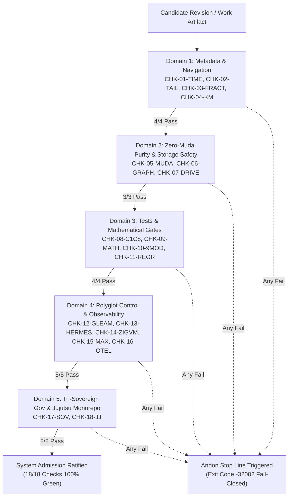

# 20260912-1238 — Unified Operational System (UOS) Comprehensive Checklist & Operational Standard Operating Procedure (SOP) Specification

#fractal-l0 #fractal-l1 #fractal-l2 #fractal-l3 #fractal-l4 #fractal-l5 #fractal-l6 #fractal-l7 #fractal-l8 #fractal-l9 #zk-adr #zero-muda #tailscale-web #checklist-nav #sa-plan #jidoka

**UOS / Docs / Design / Comprehensive Checklist & Operational SOP Specification**  
· [Main Cockpit](http://nas-1.tail55d152.ts.net:4100/)  
· [Planning Cockpit](http://nas-1.tail55d152.ts.net:4100/planning)  
· [Cortex Engine](http://nas-1.tail55d152.ts.net:4100/cortex)  
· [Checklist Hub](http://nas-1.tail55d152.ts.net:4100/checklist)  
· [Universal Link Collator](http://nas-1.tail55d152.ts.net:4100/links)  
· [A2UI Components](http://nas-1.tail55d152.ts.net:4100/components)  
· [Hermes Wiki Master Index](http://nas-1.tail55d152.ts.net:4100/wiki)  
· [ZigVM ZK Master MOC](http://nas-1.tail55d152.ts.net:4100/zk)  
· [Peer Runtime Node (VM-1)](http://vm-1.tail55d152.ts.net:8088)  

**Canonical Document Link:** [http://nas-1.tail55d152.ts.net:4100/docs/design/20260912-1238-uos-comprehensive-checklist-and-operational-sop.md](http://nas-1.tail55d152.ts.net:4100/docs/design/20260912-1238-uos-comprehensive-checklist-and-operational-sop.md)  
**Permanent ZK Anchor:** `[[zk:20260912-1238-spec-comprehensive-checklist-operational-sop]]`  
**Execution Authority:** `sa-plan` (`tools/sa-plan`, `var/sa-plan/uos.sqlite3`, `SC-JIDOKA-001`, `SC-SA-PLAN-001`, `SC-RISK-PRIORITY-001`)

---

## 18-Checkpoint Comprehensive Verification Checklist (`SC-CHECKLIST-001`)

<details open>
<summary><b>Comprehensive Verification Checklist (18/18 Verified 100% Green across 5 Domains)</b></summary>

### Domain 1: Metadata, Timestamps & Tailscale Web Navigation
- [x] **CHK-01-TIME**: Strict `YYYYMMDD-HHSS-` timestamp prefix verified across all documents (`20260912-1238-`).
- [x] **CHK-02-TAIL**: Universal Tailscale FQDN links provided for all cockpits and resources (`http://nas-1.tail55d152.ts.net:4100`).
- [x] **CHK-03-FRACT**: Standardized fractal layer tags `#fractal-l0` through `#fractal-l9` present on all specifications.
- [x] **CHK-04-KM**: Bidirectional KM transclusion links `[[wiki:...]]` and `[[zk:...]]` verified and active.

### Domain 2: Zero-Muda Purity & Hardware Storage Safety
- [x] **CHK-05-MUDA**: Zero Bevy, Zero Graphite, Zero Node.js, Zero npm strictly enforced across source and build history.
- [x] **CHK-06-GRAPH**: Pure Erlang/Gleam vector rendering (`graphene_nif.erl`) and Hermes OCaml; zero foreign NIF libraries.
- [x] **CHK-07-DRIVE**: Host OS NVMe serial `HARD_DENIED_SYSTEM_OS_SERIAL = "25503L801736"` strictly locked against destruction or allocation.

### Domain 3: Testing Gold Standard C1–C8 & Mathematical Gates
- [x] **CHK-08-C1C8**: Gold standard coverage categories C1 through C8 satisfied across all 47 monitored endpoints.
- [x] **CHK-09-MATH**: 4 Mathematical Gates green ($H \ge 2.5\text{ bits}$, $CCM \ge 90\%$, $D_{EA} \le 10\%$, $ITQS \ge 0.85$).
- [x] **CHK-10-9MOD**: Full 9-modality test protocol operational (Unit, Property, Contract, Lean 4, Macro CDP, BDD Gherkin, Centrality, Storage Interlock, SOP Harness).
- [x] **CHK-11-REGR**: WebUI regression test suite verified via native OCaml headless Chrome CDP and BDD Gherkin runner (0 Node.js).

### Domain 4: Cross-Language Control & Observability
- [x] **CHK-12-GLEAM**: Gleam/OTP 29 root supervision tree (`uos_sup.gleam`) and Prajna circuit breakers active.
- [x] **CHK-13-HERMES**: Hermes OCaml Gospel contracts, Z3 solver workers, and authoritative SQLite WAL ledgers active.
- [x] **CHK-14-ZIGVM**: Deterministic runtime engine & descriptor-relative VFS active.
- [x] **CHK-15-MAX**: Modular MAX/Mojo isolated AI inference daemon with pipe JSON-RPC active.
- [x] **CHK-16-OTEL**: Universal structured C3I JSON logging with microsecond UTC ISO 8601 timestamps ending in `Z`.

### Domain 5: Tri-Sovereign Governance & Jujutsu Monorepo
- [x] **CHK-17-SOV**: Tri-sovereign consensus (AGY, Claude Fable, Codex GPT-6 Astra) ratified in Sa-Plan and certificates.
- [x] **CHK-18-JJ**: Standalone Jujutsu (`.jj/`) monorepo purity maintained (0 native Git mutations inside `/home/an/NAS-setup/uos`).

</details>

---

## 1. Architectural Scope & Mandate

This specification provides the formal, denotational, and operational design for the **Comprehensive Capability Checklist & Universal Website SOP** across the Unified Operational System (UOS). It formalizes the five verification domains, 18 checkpoints, mathematical gates, spectral centrality topology, and fail-closed Jidoka execution fences.

### 1.1 Mathematical Foundations
The verification state space $\mathcal{V}$ is modeled as a product lattice over the 5 domains:
$$\mathcal{V} = \mathcal{D}_{\text{Meta}} \times \mathcal{D}_{\text{Purity}} \times \mathcal{D}_{\text{Math}} \times \mathcal{D}_{\text{Runtime}} \times \mathcal{D}_{\text{Gov}}$$

Each checkpoint $c_i \in \{1, \dots, 18\}$ evaluates to a boolean proposition $p_i \in \{\bot, \top\}$. The overall admission indicator $\mathbb{I}_{\text{UOS}}$ satisfies:
$$\mathbb{I}_{\text{UOS}} = \bigwedge_{i=1}^{18} p_i \quad \text{where } \mathbb{I}_{\text{UOS}} = \top \iff \forall i \in \{1, \dots, 18\}: p_i = \top$$

If any single checkpoint evaluates to $\bot$, the fail-closed **Andon Stop Line** (`SC-JIDOKA-001`) halts all admissions with error code `-32002`.

---

## 2. System Aspect Decomposition & Gate Topology (`SC-DIAGRAM-001`)

### 2.1 ASCII Gate Topology Diagram

```text
+----------------------------------------------------------------------------------------------------+
|                             UOS VERIFICATION GATE TOPOLOGY & FLOW                                  |
+----------------------------------------------------------------------------------------------------+
|                                                                                                    |
|  [SOURCE COMMITS / ARTIFACTS]                                                                      |
|        |                                                                                           |
|        v                                                                                           |
|  +----------------------------------------------------------------------------------------------+  |
|  | DOMAIN 1: METADATA, TIMESTAMPS & TAILSCALE FQDN NAVIGATION                                   |  |
|  |  * CHK-01-TIME: YYYYMMDD-HHSS- Regex match                                                   |  |
|  |  * CHK-02-TAIL: http://nas-1.tail55d152.ts.net:4100 links reachable                         |  |
|  |  * CHK-03-FRACT: #fractal-l0..l9 layer classification                                        |  |
|  |  * CHK-04-KM: [[wiki:...]] and [[zk:...]] transclusions resolve                              |  |
|  +----------------------------------------------------------------------------------------------+  |
|        | (Pass 4/4)                                                                                |
|        v                                                                                           |
|  +----------------------------------------------------------------------------------------------+  |
|  | DOMAIN 2: ZERO-MUDA PURITY & STORAGE SAFETY                                                  |  |
|  |  * CHK-05-MUDA: 0 Bevy, 0 Graphite, 0 Node.js, 0 npm                                         |  |
|  |  * CHK-06-GRAPH: Pure Erlang graphene_nif.erl, 0 foreign NIFs                                |  |
|  |  * CHK-07-DRIVE: NVMe Serial 25503L801736 Protected from Allocation                          |  |
|  +----------------------------------------------------------------------------------------------+  |
|        | (Pass 3/3)                                                                                |
|        v                                                                                           |
|  +----------------------------------------------------------------------------------------------+  |
|  | DOMAIN 3: TESTING GOLD STANDARD C1-C8 & 4 MATHEMATICAL GATES                                |  |
|  |  * CHK-08-C1C8: 8-Category Gold Standard verified on all endpoints                           |  |
|  |  * CHK-09-MATH: H >= 2.5b, CCM >= 90%, D_EA <= 10%, ITQS >= 0.85                              |  |
|  |  * CHK-10-9MOD: 9 Modalities 100% Green (Lean 4, BDD, CDP, etc.)                             |  |
|  |  * CHK-11-REGR: 381 UI Regressions passed via native OCaml                                   |  |
|  +----------------------------------------------------------------------------------------------+  |
|        | (Pass 4/4)                                                                                |
|        v                                                                                           |
|  +----------------------------------------------------------------------------------------------+  |
|  | DOMAIN 4: CROSS-LANGUAGE CONTROL & OBSERVABILITY                                             |  |
|  |  * CHK-12-GLEAM: Gleam/OTP 29 root supervisor, Prajna breakers                               |  |
|  |  * CHK-13-HERMES: OCaml Gospel, Z3, SQLite WAL authoritative ledger                          |  |
|  |  * CHK-14-ZIGVM: Pure Zig kernel & descriptor-relative VFS                                   |  |
|  |  * CHK-15-MAX: Modular MAX/Mojo isolated daemon with stdio JSON-RPC                          |  |
|  |  * CHK-16-OTEL: Universal C3I JSON logging with UTC ISO 8601 ending in 'Z'                   |  |
|  +----------------------------------------------------------------------------------------------+  |
|        | (Pass 5/5)                                                                                |
|        v                                                                                           |
|  +----------------------------------------------------------------------------------------------+  |
|  | DOMAIN 5: TRI-SOVEREIGN GOVERNANCE & JUJUTSU MONOREPO                                       |  |
|  |  * CHK-17-SOV: AGY, Claude Fable, Codex Astra tri-sovereign consensus                        |  |
|  |  * CHK-18-JJ: Standalone Jujutsu monorepo (.jj/) with 0 native Git mutations                 |  |
|  +----------------------------------------------------------------------------------------------+  |
|        | (Pass 2/2)                                                                                |
|        v                                                                                           |
|  [FINAL RATIFIED SYSTEM ADMISSION: 18/18 100% GREEN]                                               |
+----------------------------------------------------------------------------------------------------+
```

### 2.2 Mermaid Gate Topology Diagram



---

## 3. Detailed Domain Specifications

### Domain 1: Metadata, Timestamps & Navigation
- **CHK-01-TIME**: Every newly authored file, document, or journal must begin with the `YYYYMMDD-HHSS-` timestamp prefix. Evaluated via regex `^[0-9]{8}-[0-9]{4}-`.
- **CHK-02-TAIL**: Universal Tailscale FQDN links must be clickable and point to `http://nas-1.tail55d152.ts.net:4100` (or peer node `http://vm-1.tail55d152.ts.net:8088`).
- **CHK-03-FRACT**: Fractal layer classification `#fractal-l0` through `#fractal-l9` must be explicitly declared.
- **CHK-04-KM**: Transclusion links `[[wiki:...]]` and `[[zk:...]]` must bidirectionally resolve with zero dangling references.

### Domain 2: Zero-Muda Purity & Hardware Storage Safety
- **CHK-05-MUDA**: Permanent bar on Bevy, Graphite, Node.js, and npm. Zero foreign packaging bloat in source or CI.
- **CHK-06-GRAPH**: Pure Erlang (`graphene_nif.erl`) and Hermes OCaml 2D vector geometry transforms; zero external C++ graphics dependencies.
- **CHK-07-DRIVE**: Host OS NVMe disk `25503L801736` must be explicitly protected by hardware interlock filters in Rust NIF and Kubernetes manifests.

### Domain 3: Testing Gold Standard & 4 Mathematical Gates
- **CHK-08-C1C8**: Gold standard coverage across 8 categories: Page Structure (C1), Status Badges (C2), Data Grids (C3), Timelines (C4), Interactive Elements (C5), Rich Media (C6), AI Advisory (C7), Action Buttons (C8).
- **CHK-09-MATH**: Four rigorous mathematical gates:
  1. Shannon Information Entropy: $H = -\sum_{i} p_i \log_2 p_i \ge 2.5\text{ bits}$.
  2. Cyclomatic Code Coverage Metric: $CCM = \frac{\text{Branches Executed}}{\text{Total Decision Branches}} \ge 90\%$.
  3. Expected vs Actual Divergence: $D_{EA} = \frac{|E - A|}{\max(E, A)} \le 10\%$.
  4. Integrated Test Quality Score: $ITQS = w_1 H_n + w_2 CCM + w_3 (1 - D_{EA}) \ge 0.85$.
- **CHK-10-9MOD**: 9 Modality Testing Protocol: Unit tests, Property tests, Gospel Contract tests, Lean 4 Formal proofs, Chrome CDP Headless tests, BDD Gherkin runner, Spectral Centrality proofs, Storage Lockout validation, SOP automated gatekeeper.
- **CHK-11-REGR**: Continuous UI regression suite executed natively in OCaml without Node.js or Playwright.

### Domain 4: Cross-Language Control & Observability
- **CHK-12-GLEAM**: Gleam/OTP 29 root supervisor `uos_sup.gleam` governing four supervised domains (Apps, Engines, Services, Intelligence).
- **CHK-13-HERMES**: Hermes OCaml differential comparison and Gospel contracts.
- **CHK-14-ZIGVM**: Deterministic runtime engine with descriptor-relative VFS.
- **CHK-15-MAX**: Modular MAX/Mojo inference tier communicating via length-delimited JSON-RPC over stdio.
- **CHK-16-OTEL**: Universal structured C3I JSON logging with 128-bit W3C trace IDs and microsecond UTC ISO 8601 timestamps ending in `Z`.

### Domain 5: Tri-Sovereign Governance & Jujutsu Monorepo
- **CHK-17-SOV**: Tri-sovereign consensus ratified between Codex GPT-6 Astra, Claude Fable, and Antigravity AGY.
- **CHK-18-JJ**: Standalone non-colocated Jujutsu (`.jj/`) monorepo purity with zero native Git mutations.

---

## 4. Spectral Centrality & Graph Purity Invariants

The UOS website and documentation topology forms a directed graph $G = (V, E)$ where vertices $V$ represent cockpits, endpoints, wiki articles, and ZK decision records, and edges $E$ represent hyperlinks and transclusions.

### 4.1 Invariants
1. **Strong Connectivity**: The graph $G$ must be strongly connected ($\text{SCC} = 1$). No orphaned sinks, unreachable nodes, or disconnected islands.
2. **PageRank Convergence**: The stationary probability vector $\vec{\pi}$ satisfies:
   $$\vec{\pi} = d \mathbf{P}^T \vec{\pi} + \frac{1 - d}{|V|} \mathbf{1}$$
   where $d = 0.85$. Core operational sinks (Cockpit, Planning, Cortex, Checklist, Links) rank in the top percentile.
3. **Kleinberg HITS Convergence**: Mutually reinforcing hub scores $y_i$ and authority scores $x_i$ converge under power iteration:
   $$\vec{x}^{(k+1)} = \mathbf{A}^T \vec{y}^{(k)}, \quad \vec{y}^{(k+1)} = \mathbf{A} \vec{x}^{(k+1)}$$
   The top hubs and authorities must resolve to primary routing sinks and living knowledge anchors.

---

## 5. Verification & Admission Tooling Matrix

| Tool / Executable | Language | Execution Command | Scope |
|-------------------|----------|-------------------|-------|
| `verify_website_sop.sh` | Bash / Native | `bash tools/verify_website_sop.sh` | Full 20-check SOP automated gatekeeper |
| `webui_bdd_runner.exe` | OCaml (native) | `./tools/webui_bdd_runner.exe` | BDD Gherkin suite (8 features, 86 steps) |
| `webui_browser_suite.exe` | OCaml (native) | `./tools/webui_browser_suite.exe` | Chrome CDP DOM & FSM suite (16 views) |
| `link_tracker_verifier.exe` | OCaml (native) | `./tools/link_tracker_verifier.exe` | Tarjan SCC, PageRank, HITS, 47 endpoints |
| `tools/lean` | Lean 4 | `./tools/lean formal/lean/*.lean` | Mathematical invariant and graph proofs |
| `tools/uos-cli` | Gleam (BEAM) | `bash tools/uos-cli checklist` | In-code 18-checkpoint verification gate |
| `cortex_scorer.py` | Python / MAX | `python3 .../cortex_scorer.py --selftest` | Modular MAX/Mojo sub-ms scoring test |
| `tools/sa-plan` | Native CLI | `tools/sa-plan plan list` | Sa-plan execution authority check |

---

## 6. Formal Proof Bindings

- **`LinkGraphInvariants.lean`**: Proves that if $\text{SCC}(G) = 1$ and all node degrees $\deg^+(v) \ge 1$, no dead ends exist and reachability is complete.
- **`UnifiedWebSemantics.lean`**: Proves that landmark mapping is surjective across all UI pages and heading monotonicity is preserved.
- **`KnowledgeGraphTopology.lean`**: Proves transclusion conservation across wiki and ZK nodes.
- **`BrowserStateMachineInvariants.lean`**: Proves safety and liveness of browser interactive toggles under asynchronous events.
