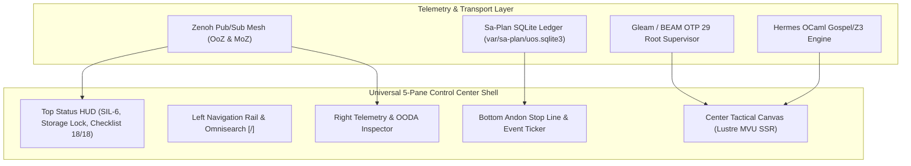
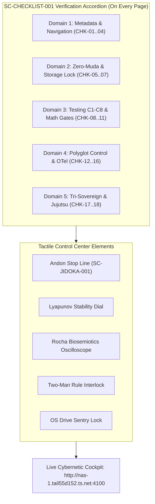

# [C3I-SIL6-MSTS] Universal Control Center Component & Webpage Operational Architecture

- **Date & UTC Timestamp**: `20260912-1830-` (2026-09-12T18:30:00Z)
- **Author**: Autonomous General Intelligence (AGY) / C3I Cockpit Architect
- **Governing Contract**: `contracts/rules/comprehensive-checklist-contract.md` (`SC-CHECKLIST-001`), `contracts/rules/20260912-1238-comprehensive-capability-and-website-sop.md` (`SC-GLM-UI-001`, `SC-A2UI-001..004`)
- **Specification Reference**: `SPEC-CONTROL-CENTER-COMPONENTS-001`
- **Canonical Tailscale Base**: [http://nas-1.tail55d152.ts.net:4100](http://nas-1.tail55d152.ts.net:4100)
- **Fractal Layer Tags**: `#fractal-l0` through `#fractal-l9`, `#km-triad`, `#zero-muda`, `#rocha-semiotics`

---

## 1. Executive Summary & Control Center Mandate

The Unified Operational System (UOS) / C3I cockpit serves as the cybernetic command-and-control flight deck for distributed mesh actors, autonomous agent swarms, formal proof kernels, and bare-metal storage fabrics.
Unlike passive enterprise dashboards, a **mission-critical cybernetic control center** operates under strict human-machine interface (HMI) standards:
1. **Dark Cockpit Principle (SC-HMI-010)**: Normal states remain quiet, high-contrast, and low-cognitive-load. Anomalies, state transitions, and hazard thresholds immediately present salient optical and structural cues.
2. **High Information Density & Low Latency**: Continuous microsecond telemetry via OTel-over-Zenoh (OoZ), monotonic sparklines, and dense data matrices rendered server-side in pure Gleam Lustre MVU with zero client-side JavaScript bloat.
3. **Fail-Closed & Tactile Safety Interlocks**: Critical actions require two-key / 2oo3 constitutional consensus, spring-loaded safety covers, and hardware-level locks (such as host OS NVMe serial `HARD_DENIED_SYSTEM_OS_SERIAL = "25503L801736"`).
4. **Bidirectional Epistemic Traceability**: Every observation, alert, and graph node links bidirectionally to formal Gospel contracts, Lean 4 proofs, ZigVM ZK ADRs (`[[zk:...]]`), and Hermes Wiki articles (`[[wiki:...]]`).

```
+--------------------------------------------------------------------------------------------------------------------+
|                                      C3I UNIFIED CONTROL CENTER 5-PANE SHELL                                      |
+--------------------------------------------------------------------------------------------------------------------+
| [TOP STATUS HUD]  Tailscale FQDN: nas-1:4100 | SIL-6 Quorum | Zero-Muda | NVMe Sentry: LOCKED | 18/18 Checks PASS  |
+-------------------+-----------------------------------------------------------------+------------------------------+
| [LEFT NAV RAIL]   | [CENTER TACTICAL OPERATIONAL CANVAS]                            | [RIGHT TELEMETRY INSPECTOR]  |
|                   |                                                                 |                              |
| - Cockpit Core    |  • Primary Domain Visualizer (Graph / Grid / FSM / Mesh)        |  • Live OODA Loop Ring       |
| - Sa-Plan Heijunka|  • Interactive Comprehensive Verification Accordion (18/18)      |  • Lyapunov Trend Dial       |
| - Swarm Defense   |  • High-Density Metric Matrix & Tactile Controls                |  • OTel-over-Zenoh Span Feed |
| - KM Triad & ZK   |  • Dual View Mode (Rendered Lustre MVU vs Raw Contract Source)   |  • Active Lease Watcher      |
| - Formal Proofs   |                                                                 |  • Herdr Session Sync        |
| - Omnisearch [/]  |                                                                 |                              |
+-------------------+-----------------------------------------------------------------+------------------------------+
| [BOTTOM ANDON & EVENT TICKER]  Sa-Plan Pull Queue: Active (4/4) | Andon Cord: ARMED | W3C Trace: 8a4f9... | BEAM OTP 29   |
+--------------------------------------------------------------------------------------------------------------------+
```



---

## 2. Creative Tactical Component Taxonomy

To maximize control room efficacy, components are organized into four tactile functional classes:

### 2.1 Tactile Safety & Actuation Components
- **`spring_loaded_cover_button`**: A two-stage physical safety switch for hazardous operations (reboots, partition mutations, failovers). Requires clicking/holding to flip open the spring cover before engaging the primary trigger.
- **`two_man_rule_interlock`**: Multi-signature consensus panel requiring dual sovereign agent keys (e.g. AGY + Claude or AGY + Codex) before an action token transitions to `EXECUTABLE`.
- **`andon_pull_cord_widget`**: High-visibility physical-style pull cord that triggers an immediate, fail-closed system halt (`SC-JIDOKA-001`), freezing all pull queues and broadcasting SIL-6 alerts across the Zenoh mesh.
- **`os_drive_sentry_lock`**: Hardened hardware status lock displaying host OS NVMe serial `25503L801736` encased in a digital padlock with real-time kernel block device fencing verification.

### 2.2 Dynamic Trajectory & Mathematical Stability Components
- **`lyapunov_stability_dial`**: Galvanic needle gauge reporting real-time Lyapunov exponent $\lambda$. Indicates strongly stable ($\lambda < -0.30$), marginally stable ($-0.30 \le \lambda \le 0.05$), or divergent cascade risk ($\lambda > 0.05$).
- **`rocha_semiotics_oscilloscope`**: Dual-trace cybernetic CRT oscilloscope visualizing Howard Pattee's epistemic cut and Luis Rocha's semiotics: upper trace plots discrete symbolic tokens (intent/specifications); lower trace plots continuous execution rates (packets/sec, reductions/sec).
- **`two_lattice_stm_cube`**: 3D isometric lattice visualizer rendered in pure Erlang/SVG showing the observation lattice $\mathcal{L}_{obs}$ non-interfering with the single-writer mutation lattice $\mathcal{L}_{mut}$.
- **`entropy_ccm_radar`**: 4-axis polar radar chart tracking the 4 mathematical gates (Entropy $H \ge 2.50\text{ b}$, Complexity $CCM \ge 90\%$, Divergence $D_{EA} \le 10\%$, Quality $ITQS \ge 0.85$).

### 2.3 Epistemic, Knowledge & Decision Components
- **`hyperdimensional_zk_hologram`**: Interactive SVG vector projection of the 13-dimensional trace coordinates ($\mathcal{T}_{13}$) mapped to architectural decision records.
- **`sheaf_cohomology_inspector`**: Matrix viewer examining section compatibility across open knowledge covers ($U_i \cap U_j$), flagging topological inconsistencies between Wiki, ZK, and Gospel specifications.
- **`heijunka_pull_rack`**: Leveled physical-style pull rack categorizing Sa-Plan tasks by t-shirt size, readiness, priority, and lease countdown timers with color-decay indicators.
- **`transclusion_card_deck`**: Expandable card deck supporting bidirectional live transclusion preview (`[[wiki:...]]` and `[[zk:...]]`) with AST depth limiter ($d \le 8$).

### 2.4 High-Density Telemetry & Mesh Components
- **`flamegraph_cascade_strip`**: Microsecond-accurate OTel distributed trace waterfall with collapsible parent-child spans and correlated log inspection.
- **`spectral_highway_heatmap`**: Kleinberg HITS and Brin-Page PageRank interactive flow map visualizing link transit density and hub/authority scores across all 48 endpoints.
- **`scheduler_utilization_matrix`**: 24-core BEAM scheduler utilization bar array with run-queue lengths, dirty I/O thread status, and memory fragmentation gauges.
- **`zenoh_throughput_spectrum`**: Real-time pub/sub frequency analyzer displaying message throughput, latency percentiles ($p_{50}, p_{95}, p_{99}$), and buffer watermarks.

---

## 3. Exhaustive Page-by-Page Component Architecture

Below is the definitive component assignment for all 40+ operational pages across the 6 control center domains.

```
+--------------------------------------------------------------------------------------------------------------------+
|                                       PAGE & COMPONENT MAPPING ARCHITECTURE                                        |
+--------------------+-------------------------------------------+---------------------------------------------------+
| ROUTE / ENDPOINT   | PRIMARY OPERATIONAL PURPOSE               | ASSIGNED TACTILE & CREATIVE COMPONENTS            |
+--------------------+-------------------------------------------+---------------------------------------------------+
| 1. DOMAIN I: STRATEGIC & HOLISTIC COMMAND COCKPITS                                                                |
| / (Dashboard)      | Master Cybernetic Flight Deck             | Top Status HUD, OODA Loop Ring, 4 Math Gates Radar|
| /cockpit           | Dark Cockpit SIL-6 Alarm Annunciator      | Alarm Annunciator Matrix, Spring-Cover E-Stop     |
| /cortex            | Pre-Frontal Cognitive & POODAVR Engine    | POODAVR Phase Dial, Dual ASCII/Mermaid Split-Pane |
| /links             | Universal Link & Centrality Highway       | Spectral Highway Heatmap, Kleinberg HITS Hubs     |
| /checklist         | 18-Checkpoint Comprehensive Verification  | Interactive Accordion, 5-Domain Pass/Fail Badges  |
| /testing           | Testing Gold Standard & 9D Protocol       | 9-Modality Test Grid, C1-C8 Spec Table, Math Cards|
+--------------------+-------------------------------------------+---------------------------------------------------+
| 2. DOMAIN II: TASK, PLANNING & EXECUTION HOLARCHY                                                                  |
| /planning          | Sa-Plan Heijunka Leveled Pull Queue       | Heijunka Pull Rack, Lease Countdown, Andon Cord   |
| /planning-dashboard| High-Density Multi-Horizon Job Matrix     | Multi-Tier Gantt, Oban Queue Dials, Dependency DAG|
| /git               | Standalone Jujutsu Monorepo & Operation   | JJ Operation Commit Tree, Sibling Workspace Tabs  |
| /mirage            | MirageOS Unikernel & Solo5 MicroVM Mesh   | Solo5 Sandboxes Grid, MicroVM Memory Calipers     |
| /podman            | Rootless Container Holarchy & Quadlets    | Quadlet Systemd Units, Container Resource Rings   |
+--------------------+-------------------------------------------+---------------------------------------------------+
| 3. DOMAIN III: MULTI-AGENT SWARMS & COGNITIVE INFERENCE                                                            |
| /agents            | Swarm Coordination & Work-Stealing Mesh   | Work-Stealing Topology, Swarm Activity Sparklines |
| /holon             | Holonic Identity & Capability Delegation  | Holon Fractal Hierarchy, Permission Token Badges  |
| /mcp               | Federated MCP Gateway & Zero-Trust Intercept| MCP Tool Registry, Payload SHA-256 Digest Trap    |
| /bicameral         | Two-Lattice Consensus & Sovereign Sign-Off| Two-Man Rule Interlock, Consensus Needle Meter    |
| /singularity       | Cognitive Velocity & Recursive Self-Check | Recursive Depth Horizon Gauge, Acceleration Curve |
| /allium            | Allium Declarative Architectural Matrix   | Specification Tree, Contract Compliance Badges    |
+--------------------+-------------------------------------------+---------------------------------------------------+
| 4. DOMAIN IV: EPISTEMIC MEMORY, KNOWLEDGE TRIAD & DECISION                                                         |
| /knowledge         | Smriti 3D Topic Space & Sheaf Traversal   | 3D Topic Space Canvas, Sheaf Cohomology Inspector |
| /smriti            | Deep Epistemic Memory & ZK Decision Vault | ADR Chronological Timeline, Epistemic Brier Gauge |
| /wiki              | Hermes Wiki Index & AST Transclusion Deck | Transclusion Card Deck, Gospel Contract Inspector |
| /zk                | ZigVM ZK Master MOC & Decision Holarchy   | MOC Fractal Tree, Invariant Graph Visualizer      |
| /components        | A2UI Interactive Component Catalog        | Live Component Sandbox, Property Inspector Panel  |
+--------------------+-------------------------------------------+---------------------------------------------------+
| 5. DOMAIN V: CYBERNETIC IMMUNE, SRE, CHAOS & STABILITY                                                            |
| /immune            | SRE Cybernetic Immune & Apoptosis Mesh    | Antibody Neutralizer, Chaos Injection Triggers    |
| /health-grid       | 24-Cell Guard Grid & Device Matrix        | 24-Cell Guard Grid, Node Physical Heartbeat Matrix|
| /prajna            | Biomorphic Synthesis & Lyapunov Dials     | Lyapunov Stability Dial, FMEA Hazard Matrix Table |
| /homeostasis       | Equilibrium Damping & Watermark Throttles | Watermark Fill Tanks, Backpressure Dampers        |
| /biomorphic        | Symbiotic Sensory Mesh & Neural Channels  | Sensory Transduction Scope, Neural Channel Sliders|
| /evolution         | Evolutionary Vector Space & Genetic Tuning| Fitness Landscape Surface, Mutator Mutation Ledger|
| /integrity         | Formal Proof Kernel & Mathematical Invar  | Lean 4 Theorem Badges, Z3 SMT Solver Status Box   |
+--------------------+-------------------------------------------+---------------------------------------------------+
| 6. DOMAIN VI: SUBSTRATE, MESH, CRYPTOGRAPHY & HARDWARE                                                             |
| /substrate         | BEAM Bare-Metal Schedulers & Arenas       | Scheduler Core Matrix, ZigVM Arena Calipers       |
| /zenoh             | Zenoh Pub/Sub Mesh & OoZ/MoZ Router       | Throughput Spectrum Scope, Topic Routing Table    |
| /telemetry         | Universal W3C OTel Distributed Tracing    | Flamegraph Cascade Strip, Trace Correlation Filter|
| /metabolic         | Compute Energy, Tokens & Thermals         | Joule/Token Meter, Hardware Thermal Gauges        |
| /kms               | Cryptographic Key Management & Root Trust | Key Hierarchy Tree, Hardware Security Enclave Seal|
| /auth              | Zero-Trust Capability & Sovereign IAM     | Capability Token Decoders, Role Permission Grids  |
| /database          | SQLite WAL Ledgers & Time-Series RRD      | WAL Frame Inspector, Checkpoint Trigger Buttons   |
| /bridge            | Polyglot IPC Bus (Gleam/OCaml/Zig/Mojo)   | IPC Ring Buffer Telemetry, ABI Marshaling Latency |
| /config            | Live Runtime Configuration Matrix         | Hot-Reload Parameter Matrix, Diff Approval Modal  |
| /federation        | L7 Cross-Cluster Mesh & Gossip Sync       | Version Vector Matrix, Gossip Peer Connectivity   |
+--------------------+-------------------------------------------+---------------------------------------------------+
```

---

### 3.1 Domain I: Strategic & Holistic Command Cockpits

#### 1. `/` or `/dashboard` (Main Cybernetic Cockpit)
- **Control Room Function**: Primary high-level operational overview for the shift commander.
- **Assigned Components**:
  1. `top_status_hud`: Displays live Tailscale FQDN, SIL-6 status, Zero-Muda badge, storage lock status, and 18/18 checklist score.
  2. `ooda_loop_ring`: Interactive circular dial displaying current OODA phase (Observe, Orient, Decide, Act) with pulse frequency.
  3. `entropy_ccm_radar`: 4-axis polar radar plotting the 4 mathematical gates.
  4. `subsystem_health_quadrants`: 4-quadrant high-contrast status grid (Apps, Engines, Services, Intelligence).
  5. `quick_action_bar`: Tactile buttons for running system self-check, triggering OODA tick, and cycling dark cockpit themes.
- **Telemetry Sources**: `indrajaal/l5/ooda/**`, `indrajaal/l0/const/**`.

#### 2. `/cockpit` (Dark Cockpit SIL-6 Alarm Annunciator)
- **Control Room Function**: Anomaly response and high-stress fault localization.
- **Assigned Components**:
  1. `alarm_annunciator_matrix`: Aviation-style tiled annunciator panel with backlit alarm tiles (Green=Nominal, Amber=Warning, Red=Critical).
  2. `alarm_filter_toolbar`: Quick-toggle filters for SIL levels (SIL-1 through SIL-6) and subsystem groups.
  3. `spring_loaded_cover_button`: Protective safety latch guarding the global emergency mute and fault reset.
  4. `audio_tone_synthesizer`: Pure Web Audio API synthetic audio alerts conforming to ISO 7731 auditory danger signals.
  5. `active_fault_tree_viewer`: Collapsible hierarchical fault tree visualizing root cause pathways.
- **Telemetry Sources**: `indrajaal/l2/health/alarms`, `indrajaal/l0/emergency/**`.

#### 3. `/cortex` (Cortex Pre-Frontal Cognitive & POODAVR Engine)
- **Control Room Function**: Cognitive task synthesis, multi-horizon planning, and architectural POODAVR tracking.
- **Assigned Components**:
  1. `poodavr_phase_dial`: 7-stage circular dial (Predict, Observe, Orient, Decide, Act, Verify, Ratify).
  2. `dual_view_diagram_viewer`: Split-screen diagram renderer displaying editable ASCII fallback alongside rendered Mermaid diagrams (`SC-DIAGRAM-001`).
  3. `aspect_processing_grid`: 28-aspect Scott denotational semantics matrix showing mathematical closure.
  4. `active_prompt_steer_console`: Input console for injecting tactical guidance into running autonomous swarms.
- **Telemetry Sources**: `indrajaal/l5/cortex/**`, `c3i_nif::poodavr_status`.

#### 4. `/links` / `/link-tracker` (Universal Link Tracker & Spectral Highway)
- **Control Room Function**: Topological health monitoring of all 48 endpoints, transclusion validation, and link connectivity.
- **Assigned Components**:
  1. `spectral_highway_heatmap`: Interactive bipartite flow diagram plotting PageRank authorities vs Kleinberg HITS hubs.
  2. `endpoint_probe_table`: 48-row real-time latency and status grid with microsecond sorting and response size indicators.
  3. `tarjan_scc_badge`: Live topological badge proving Strongly Connected Component count ($SCC = 1$).
  4. `transclusion_resolution_meter`: Dual progress dials tracking Wiki ($650 / 785$) and ZK ($967 / 1,169$) transclusion resolution.
- **Telemetry Sources**: `tools/link_tracker_verifier.exe --json`, `/api/v1/links/status`.

#### 5. `/checklist` (Universal 18-Checkpoint Comprehensive Verification Checklist)
- **Control Room Function**: Continuous compliance verification and release gating (`SC-CHECKLIST-001`).
- **Assigned Components**:
  1. `interactive_checklist_accordion`: Expandable 5-domain accordion listing all 18 checkpoints with live machine-checked status.
  2. `domain_compliance_progress_bars`: 5 distinct progress bars representing metadata, zero-muda, testing, polyglot, and VCS domains.
  3. `audit_evidence_viewer`: Slide-out panel displaying exact command outputs and file hashes for each checkpoint.
  4. `export_compliance_token_button`: Generates cryptographically signed JSON verification receipts.
- **Telemetry Sources**: `tools/uos-cli checklist`, `tools/uos-cli gate G-CHECKLIST`.

#### 6. `/testing` (Testing Gold Standard C1–C8 & 9-Modality Test Protocol)
- **Control Room Function**: Real-time test suite execution, regression analysis, and mathematical gate verification.
- **Assigned Components**:
  1. `gold_standard_matrix_table`: Weighted table evaluating categories C1 through C8 with gate pass/fail conditions.
  2. `nine_modality_card_deck`: 9 interactive cards detailing Unit, System, TDD, BDD, Perf, Scale, Property, Fuzz, and Chaos test results.
  3. `four_math_gates_cards`: Dense cards showing exact Shannon entropy, cyclomatic complexity, divergence, and ITQS values.
  4. `test_runner_trigger_strip`: Tactile buttons to trigger OCaml BDD runner, Chrome CDP browser suite, and Gleam eunit suites.
- **Telemetry Sources**: `full_nine_dimension_test_protocol_test`, `tools/webui_bdd_runner.exe`.

---

### 3.2 Domain II: Task, Planning & Execution Holarchy

#### 7. `/planning` (Sa-Plan Heijunka Leveled Pull Queue)
- **Control Room Function**: Pull-based task dispatch, worker lease monitoring, and leveled work intake.
- **Assigned Components**:
  1. `heijunka_pull_rack`: Physical manufacturing-style task pull rack categorized by effort and priority.
  2. `lease_freshness_countdown_ring`: Circular timers showing remaining lease nanoseconds for active workers.
  3. `andon_pull_cord_widget`: Emergency halt trigger enforcing `SC-JIDOKA-001` on un-ledgered activity.
  4. `worker_swarm_roster`: Real-time roster of registered workers (`worker-agy`, `worker-claude`, `worker-codex`).
- **Telemetry Sources**: `var/sa-plan/uos.sqlite3`, `c3i_nif::plan_status`.

#### 8. `/planning-dashboard` (High-Density Multi-Horizon Job Matrix)
- **Control Room Function**: Tactical multi-horizon Gantt visualization, Oban job queues, and Temporal workflows.
- **Assigned Components**:
  1. `multi_horizon_gantt_canvas`: Zoomable timeline spanning operational horizons (Hours, Sprints, EV-Cycles).
  2. `oban_job_queue_gauges`: Real-time dials for Oban queues (available, executing, retryable, dead).
  3. `temporal_workflow_fsm_tracer`: Interactive state machine graph tracing durable workflow executions.
  4. `dependency_dag_minimap`: Pan/zoom DAG thumbnail highlighting critical path bottlenecks.
- **Telemetry Sources**: `var/sa-plan/uos.sqlite3`, `c3i-sa-plan-http:4200`.

#### 9. `/git` (Standalone Jujutsu Monorepo & Operation Log)
- **Control Room Function**: VCS operation log inspection, change ID visualization, and sibling workspace coordination.
- **Assigned Components**:
  1. `jj_operation_log_tree`: Visual DAG of Jujutsu operations (`op_id`, change IDs, commit digests).
  2. `sibling_workspace_tabs`: Tab bar showing active checkouts in `.uos-workspaces/*` with dirty manifests.
  3. `rebase_conflict_detector`: Red banner indicator verifying zero git rebase conflicts or diverged heads.
  4. `zero_git_mutation_guard`: Permanent status seal certifying 0 native git mutations inside `/home/an/NAS-setup/uos`.
- **Telemetry Sources**: `jj op log`, `jj status --no-pager`.

#### 10. `/mirage` (MirageOS Unikernel & Solo5 MicroVM Mesh)
- **Control Room Function**: Monitoring lightweight sandboxed OCaml unikernels and Solo5 hypervisor execution.
- **Assigned Components**:
  1. `solo5_sandbox_grid`: Live grid of microVM instances showing memory footprints (<16MB) and boot times (<5ms).
  2. `unikernel_hypervisor_dial`: Host hypervisor status (KVM, SPT, HVT) with hardware virtualization extensions.
  3. `candidate_migration_matrix`: Service candidates queued for extraction into standalone unikernels.
  4. `microvm_memory_calipers`: Fine-grained memory arena usage gauges for bare-metal unikernel domains.
- **Telemetry Sources**: `/api/v1/mirage/status`, `/api/v1/mirage/hypervisors`.

#### 11. `/podman` (Rootless Container Holarchy & Quadlet Units)
- **Control Room Function**: Supervising local podman pods, systemd quadlets, and container lifecycle events.
- **Assigned Components**:
  1. `quadlet_systemd_unit_list`: Table of `.container` and `.pod` systemd units with active/inactive states.
  2. `container_resource_rings`: Circular CPU/Memory usage rings for each isolated container sandbox.
  3. `container_restart_budget_bar`: Visual counter tracking restart budgets before circuit tripping.
  4. `rootless_namespace_uid_map`: Visual map verifying user namespace UID mapping isolation.
- **Telemetry Sources**: `c3i_nif::podman_containers`, `/api/v1/podman`.

---

### 3.3 Domain III: Multi-Agent Swarms & Cognitive Inference

#### 12. `/agents` (Cybernetic Multi-Agent Swarm & Work-Stealing Mesh)
- **Control Room Function**: Decentralized swarm orchestration, work-stealing balance, and peer health.
- **Assigned Components**:
  1. `work_stealing_mesh_canvas`: Interactive node-link graph showing task transfer vectors between worker nodes.
  2. `swarm_activity_sparklines`: Multi-channel sparkline array showing reduction rates per second per agent.
  3. `herdr_session_coordinator`: Session discovery panel exchanging compact evidence references.
  4. `openrouter_budget_meter`: Free-tier vs paid token budget meter with fail-closed hard stop limits.
- **Telemetry Sources**: `indrajaal/l6/ecosystem/**`, `/api/v1/ecology/swarm`.

#### 13. `/holon` (Holonic Identity & Capability Delegation)
- **Control Room Function**: Holarchic organization, subagent role inheritance, and permission boundary audit.
- **Assigned Components**:
  1. `holon_fractal_hierarchy`: Nested treemap representing fractal holons ($L_0$ to $L_9$).
  2. `capability_delegation_badges`: Cryptographic capability badges showing granted vs denied syscalls.
  3. `holon_heartbeat_matrix`: Real-time ping grid tracking subagent responsiveness with jitter alarms.
  4. `identity_token_inspector`: Decoder for Ed25519-signed agent identity tokens.
- **Telemetry Sources**: `c3i_nif::holon_status`, `indrajaal/l6/holon/**`.

#### 14. `/mcp` (Federated MCP Gateway & Cryptographic Interceptor)
- **Control Room Function**: Model Context Protocol tool routing, argument validation, and ingress attack defense.
- **Assigned Components**:
  1. `mcp_tool_registry_grid`: Searchable card catalog of all 93+ federated MCP tools with schemas.
  2. `payload_sha256_digest_trap`: Interceptor log showing Cryptokit SHA-256 hashes of all tool arguments.
  3. `ingress_attack_annunciator`: Red alert tiles for trapped NUL bytes (code `-2`) and SQL injections (code `-3`).
  4. `mcp_latency_histogram`: Latency distribution histogram for tool dispatch and JSON-RPC responses.
- **Telemetry Sources**: `run_agent_dispatch_hook.exe`, `/api/v1/mcp`.

#### 15. `/bicameral` (Two-Lattice Consensus & Sovereign Sign-Off)
- **Control Room Function**: Dual-chamber decision ratification, HITL executive sign-off, and policy overrides.
- **Assigned Components**:
  1. `two_man_rule_interlock`: Dual cryptographic key-turn interface requiring operator and sovereign agent signatures.
  2. `bicameral_consensus_meter`: Galvanic meter showing alignment between deliberative and reactive lattices.
  3. `pending_approval_table`: Table of high-risk actions awaiting human-in-the-loop (HITL) clearance.
  4. `veto_audit_trail`: Immutable log of constitutional vetos and safety kernel rejections.
- **Telemetry Sources**: `c3i_nif::bicameral_status`, `/api/v1/bicameral`.

#### 16. `/singularity` (Cognitive Velocity & Recursive Capability Frontier)
- **Control Room Function**: Monitoring system evolution velocity, recursive self-improvement rates, and entropy bounds.
- **Assigned Components**:
  1. `cognitive_velocity_speedometer`: Needle speedometer displaying autonomous cycles completed per minute.
  2. `recursive_depth_horizon_gauge`: Visual safety limiter ensuring recursion depth does not exceed bounds ($d \le 8$).
  3. `capability_frontier_contour`: 2D contour plot mapping admitted capabilities vs theoretical frontiers.
  4. `divergence_damping_lever`: Manual override lever to throttle cognitive feedback loops.
- **Telemetry Sources**: `/api/v1/singularity`, `c3i_nif::evolution_metrics`.

#### 17. `/allium` (Allium Declarative Architectural Matrix)
- **Control Room Function**: Inspection of declarative Allium specifications and automated contract conformance.
- **Assigned Components**:
  1. `allium_spec_tree`: Hierarchical tree of declarative architectural specs (Ignition, ZMOF, FFI, HMI).
  2. `contract_compliance_badges`: Matrix of pass/fail badges for each specified architectural invariant.
  3. `spec_diff_inspector`: Split-view comparing active runtime telemetry against Allium formal contracts.
  4. `export_formal_spec_button`: Generates Quint and Gospel formal model projections from Allium ASTs.
- **Telemetry Sources**: `/api/v1/allium/**`.

---

### 3.4 Domain IV: Epistemic Memory, Knowledge Triad & Decision Matrices

#### 18. `/knowledge` (Smriti 3D Topic Space & Sheaf Traversal)
- **Control Room Function**: Navigating semantic knowledge associations, topic clustering, and presheaf consistency.
- **Assigned Components**:
  1. `topic_space_canvas`: Interactive 2D/3D force-directed graph of the Smriti knowledge repository.
  2. `sheaf_cohomology_inspector`: Cohomology checker displaying agreement across overlapping documentation sections.
  3. `topic_density_histogram`: Histogram displaying document counts per fractal domain.
  4. `semantic_distance_caliper`: Tool to measure mathematical distance between any two selected notes.
- **Telemetry Sources**: `c3i_nif::knowledge_graph`, `/api/v1/knowledge`.

#### 19. `/smriti` (Deep Epistemic Memory & ZK Decision Vault)
- **Control Room Function**: Long-term epistemic audit, historical hypothesis verification, and Brier score tracking.
- **Assigned Components**:
  1. `epistemic_brier_gauge`: Calibration dial tracking probabilistic prediction accuracy ($Brier \le 0.15$).
  2. `adr_chronological_timeline`: Linear timeline of all architectural decisions with outcome validation flags.
  3. `memory_decay_radar`: Visualizer indicating knowledge freshness and flagging stale assertions (>30 days).
  4. `hypothesis_disconfirmation_table`: Analysis of Competing Hypotheses (ACH) matrix.
- **Telemetry Sources**: `Smriti.db`, `/api/v1/smriti`.

#### 20. `/wiki` (Hermes Wiki Master Index & AST Transclusion Deck)
- **Control Room Function**: Hermes Gospel-specified wiki browsing, transclusion tree analysis, and TyXML preview.
- **Assigned Components**:
  1. `transclusion_card_deck`: Interactive card deck expanding nested transclusions (`[[wiki:...]]`) with cycle detection.
  2. `gospel_contract_inspector`: Syntax-highlighted Gospel specification panel with Z3 validation markers.
  3. `category_filter_chips`: Filter chips for Feature Parity, Task Journals, Runbooks, and Category Models.
  4. `omnisearch_input`: Real-time lexical and vector search bar with instant autocomplete.
- **Telemetry Sources**: `engines/hermes/modules/hermes_wiki`, `knowledge_explorer.gleam`.

#### 21. `/zk` (ZigVM ZK Master MOC & Permanent ADR Holarchy)
- **Control Room Function**: Exploring permanent architectural decision records (`ADR-001` through `ADR-115`) and fractal design invariants.
- **Assigned Components**:
  1. `moc_fractal_tree`: Expandable fractal tree of Maps of Content (MOCs) linked to root invariants.
  2. `invariant_graph_visualizer`: Dependency graph showing invariant constraints between ADRs.
  3. `zk_backlink_matrix`: Bi-directional link matrix showing inward and outward citations per note.
  4. `adr_markdown_viewer`: Dual-mode viewer toggling between rendered HTML and raw Markdown source.
- **Telemetry Sources**: `docs/zk/*.md`, `knowledge_explorer.gleam`.

#### 22. `/components` (A2UI Interactive Component Catalog & Sandbox)
- **Control Room Function**: Live playground and contract verification for all 233 registered A2UI components.
- **Assigned Components**:
  1. `component_catalog_sidebar`: Grouped list of all 233 components across Core, Wave 1, and Wave 2 catalogs.
  2. `interactive_sandbox_stage`: Dynamic rendering stage showing Lustre HTML, Wisp JSON, and ANSI TUI outputs simultaneously.
  3. `prop_spec_editor`: Interactive form allowing operators to tweak component properties and test schema validation.
  4. `a2ui_security_validator_badge`: Real-time badge verifying component allowlist status (`SC-A2UI-002`).
- **Telemetry Sources**: `cepaf_gleam/a2ui/catalog`, `/api/v1/components`.

---

### 3.5 Domain V: Cybernetic Immune, SRE, Chaos & Stability

#### 23. `/immune` (Cybernetic Immune Engine & SRE Apoptosis)
- **Control Room Function**: Autonomous SRE fault containment, automated antibody synthesis, and apoptosis execution.
- **Assigned Components**:
  1. `antibody_neutralizer_matrix`: Table of active cybernetic antibodies with neutralized incident signatures.
  2. `chaos_injection_console`: Controlled chaos testing triggers (CPU spikes, memory leaks, packet loss, process kills).
  3. `apoptosis_execution_meter`: Gauge tracking terminated misbehaving actors and resource reclamation.
  4. `quarantine_enclave_status`: Status display of isolated rogue processes and untrusted network sockets.
- **Telemetry Sources**: `c3i_nif::system_immune`, `/api/v1/immune`.

#### 24. `/health-grid` (24-Cell Guard Grid & Device Topology)
- **Control Room Function**: Multi-layer SIL-4 health verdict monitoring across all $L_0$ to $L_7$ fractal domains.
- **Assigned Components**:
  1. `guard_grid_24_cells`: 24-cell matrix (8 layers $\times$ 3 domains) with real-time green/amber/red verdict tiles.
  2. `node_physical_heartbeat_matrix`: Network latency ping grid between NAS-1, VM-1, and local workers.
  3. `cascade_failure_preventer`: Visual interlock indicating that health cascade isolation is active.
  4. `auto_heal_action_log`: Real-time log of automated self-healing corrections executed by OTP supervisors.
- **Telemetry Sources**: `cepaf_gleam/ha/guard_grid`, `/api/v1/system/guard-grid`.

#### 25. `/prajna` (Biomorphic Synthesis & Lyapunov Dials)
- **Control Room Function**: Anticipatory failure prediction, trend detection, and STPA/FMEA hazard evaluation.
- **Assigned Components**:
  1. `lyapunov_stability_dial`: High-precision needle gauge visualizing Lyapunov exponent $\lambda$.
  2. `fmea_hazard_matrix_table`: Live Failure Mode and Effects Analysis table with calculated Risk Priority Numbers (RPN).
  3. `circuit_breaker_bank`: Row of toggle switches representing Prajna circuit breakers with trip counts.
  4. `trajectory_forecast_chart`: Multi-step trajectory curve predicting parameter values 5 seconds into the future.
- **Telemetry Sources**: `cepaf_gleam/ha/lyapunov_proof`, `/api/v1/prajna`.

#### 26. `/homeostasis` (Equilibrium Damping & Watermark Throttles)
- **Control Room Function**: Dynamic load balancing, backpressure regulation, and buffer watermark monitoring.
- **Assigned Components**:
  1. `watermark_fill_tanks`: Animated cylindrical tank gauges showing high/low watermark levels for all internal queues.
  2. `backpressure_damping_slider`: Visual representation of active backpressure throttling percentage.
  3. `equilibrium_balance_beam`: Animated balance beam showing intake request rate vs processing throughput.
  4. `drain_rate_velocity_meter`: Speedometer tracking queue drainage speed in messages per millisecond.
- **Telemetry Sources**: `/api/v1/homeostasis`, `c3i_nif::metabolic_state`.

#### 27. `/biomorphic` (Symbiotic Sensory Mesh & Neural Channels)
- **Control Room Function**: Sensory transduction, neuromorphic signal processing, and biomorphic network monitoring.
- **Assigned Components**:
  1. `rocha_semiotics_oscilloscope`: Dual-beam CRT scope displaying token sequences vs rate dynamics.
  2. `sensory_transduction_spectrum`: Frequency spectrum analyzer for acoustic and telemetry sensor inputs.
  3. `neural_channel_sliders`: Multi-channel gain and damping controls for adaptive learning feedback loops.
  4. `synaptic_weight_heatmap`: Heatmap visualizing connection strengths across the symbiotic agent holarchy.
- **Telemetry Sources**: `/api/v1/biomorphic`, `cepaf_gleam/symbiosis/tensor`.

#### 28. `/evolution` (Evolutionary Vector Space & Genetic Tuning)
- **Control Room Function**: Fitness-gated code commit scoring, genetic mutation tracking, and heuristic optimization.
- **Assigned Components**:
  1. `fitness_landscape_surface`: 3D isometric surface rendering fitness scores across candidate mutations.
  2. `mutator_mutation_ledger`: Immutable audit log of all automated code and configuration mutations.
  3. `genetic_generation_counter`: Digital counter showing current evolutionary cycle (`EV-108`).
  4. `fitness_gate_verdict_badge`: Prominent verdict badge indicating whether candidate code meets admission fitness.
- **Telemetry Sources**: `/api/v1/evolution`, `/api/v1/system/fitness`.

#### 29. `/integrity` (Formal Proof Kernel & Mathematical Invariants)
- **Control Room Function**: Continuous validation of Lean 4 theorems, Gospel specifications, and Z3 solver checks.
- **Assigned Components**:
  1. `lean4_theorem_roster`: Table of formal theorems (`Traceability`, `Sheaf_Presheaf`, `Century_Harmony`, etc.) with proof status.
  2. `z3_solver_worker_pool`: Status grid of bounded Z3 solver worker processes with memory limits and timeouts.
  3. `invariant_violation_counter`: Zero-tolerance counter (must remain strictly 0) for mathematical invariant violations.
  4. `quint_model_checker_status`: Verification status of Quint temporal state machine invariants.
- **Telemetry Sources**: `/api/v1/integrity`, `formal/lean/*.lean`.

---

### 3.6 Domain VI: Substrate, Mesh, Cryptography & Hardware Security

#### 30. `/substrate` (BEAM Bare-Metal Schedulers & Arenas)
- **Control Room Function**: Hardware utilization, Erlang VM schedulers, and ZigVM linear memory arenas.
- **Assigned Components**:
  1. `scheduler_utilization_matrix`: 24-core CPU bar array displaying scheduler utilization and run-queue lengths.
  2. `arena_caliper_gauge`: Micrometer caliper gauge visualizing ZigVM linear arena bump allocation.
  3. `dirty_io_thread_status`: Indicator lights for dirty CPU and dirty I/O thread pools.
  4. `beam_memory_pie_chart`: SVG breakdown of BEAM memory (processes, atom table, binary heap, ETS tables).
- **Telemetry Sources**: `c3i_nif::system_substrate`, `/api/v1/system/beam`.

#### 31. `/zenoh` (Zenoh Pub/Sub Mesh & OoZ/MoZ Router)
- **Control Room Function**: Message bus topology, topic prefix throughput, and Zenoh router peer connectivity.
- **Assigned Components**:
  1. `zenoh_throughput_spectrum`: Real-time pub/sub bandwidth and packet counter across all fractal namespaces.
  2. `topic_routing_tree`: Interactive tree view of active topics (`indrajaal/**`) with message rates.
  3. `peer_mesh_connectivity_map`: Geographic/network map showing active connections between NAS-1 and VM-1.
  4. `dropped_packet_warning_dial`: Gauge tracking dropped packets and retransmit counts.
- **Telemetry Sources**: `c3i_nif::system_zenoh`, `/api/v1/zenoh`.

#### 32. `/telemetry` (Universal W3C OTel Distributed Tracing)
- **Control Room Function**: Distributed trace aggregation, span waterfall analysis, and correlation debugging.
- **Assigned Components**:
  1. `flamegraph_cascade_strip`: Collapsible microsecond waterfall chart displaying parent and child spans.
  2. `trace_correlation_filter`: Search bar filtering traces by 128-bit W3C `trace_id` or fractal layer ($L_0 \dots L_9$).
  3. `span_duration_distribution`: Histogram plotting latency percentiles across all traced transactions.
  4. `otel_over_zenoh_packet_sniffer`: Raw JSON packet inspector for spans published over `indrajaal/otel/spans/**`.
- **Telemetry Sources**: `cepaf_gleam/ha/trace_context`, `/api/v1/telemetry`.

#### 33. `/metabolic` (Compute Energy, Tokens & Thermals)
- **Control Room Function**: Tracking hardware power consumption, CPU thermals, and LLM token expenditures.
- **Assigned Components**:
  1. `joule_token_meter`: Dual-dial meter measuring electrical energy (Joules) consumed per generated token.
  2. `hardware_thermal_gauges`: Multi-sensor temperature dials for NVMe drives, CPU package, and VRMs.
  3. `token_burn_rate_chart`: Time-series chart tracking token burn rate across Gemini, Claude, and local models.
  4. `thermal_throttle_interlock`: Automated safety interlock that throttles compute when package temps exceed 80°C.
- **Telemetry Sources**: `c3i_nif::metabolic_state`, `/api/v1/metabolic`.

#### 34. `/kms` (Cryptographic Key Management & Root Trust)
- **Control Room Function**: Cryptographic key lifecycle, hardware security module (HSM) status, and envelope encryption.
- **Assigned Components**:
  1. `key_hierarchy_tree`: Visual hierarchy showing Master Key (KEK), Data Encryption Keys (DEK), and rotation dates.
  2. `hardware_security_enclave_seal`: Digital seal certifying HSM integrity and zero plaintext memory leakage.
  3. `key_rotation_countdown`: Days remaining until mandatory cryptographic key rotation.
  4. `cryptographic_algorithm_badges`: Badges confirming modern post-quantum and standard algorithms (Ed25519, ChaCha20-Poly1305).
- **Telemetry Sources**: `c3i_nif::kms_catalog`, `/api/v1/kms`.

#### 35. `/auth` (Zero-Trust Capability & Sovereign IAM)
- **Control Room Function**: Identity and access management, capability token decoding, and RBAC/ABAC enforcement.
- **Assigned Components**:
  1. `capability_token_decoder`: Token inspector unpacking Cryptokit SHA-256 and Ed25519-signed capability tokens.
  2. `role_permission_matrix`: Interactive matrix mapping roles (Operator, Agent, Guest) to API endpoints.
  3. `session_expiry_bar`: Progress bar displaying active Tailscale OIDC session lifetime.
  4. `revocation_list_table`: Real-time table of revoked tokens with instant fail-closed propagation.
- **Telemetry Sources**: `cepaf_gleam/ui/wisp/auth`, `/auth`.

#### 36. `/database` (SQLite WAL Ledgers & Time-Series RRD)
- **Control Room Function**: Inspecting database files, WAL journals, schema migrations, and write-lock status.
- **Assigned Components**:
  1. `wal_frame_inspector`: Visual frame counter for SQLite write-ahead logs (`uos.sqlite3-wal`, `Smriti.db-wal`).
  2. `checkpoint_trigger_button`: Tactile button to execute passive or truncate SQLite checkpoints.
  3. `database_page_cache_meter`: Cache hit ratio and dirty page counter.
  4. `exclusive_writer_lock_indicator`: Lock indicator displaying the current holder of the exclusive write lease.
- **Telemetry Sources**: `/api/v1/database`, `c3i_nif::plan_status`.

#### 37. `/bridge` (Polyglot IPC Bus: Gleam / OCaml / Zig / Mojo)
- **Control Room Function**: Monitoring inter-process communication between BEAM, Hermes, ZigVM, and MAX Mojo.
- **Assigned Components**:
  1. `ipc_ring_buffer_telemetry`: Circular gauges monitoring lockless ring buffer utilization between language runtimes.
  2. `abi_marshaling_latency_chart`: Microsecond latency histogram for foreign function call invocations.
  3. `stdio_pipe_sentry`: Health monitors for length-delimited JSON-RPC stdio pipes to Python/MAX workers.
  4. `zero_foreign_nif_seal`: Audit badge verifying that Graphene, Bevy, and Graphite foreign NIFs are 100% absent.
- **Telemetry Sources**: `/api/v1/bridge`, `cepaf_gleam_ffi`.

#### 38. `/config` (Live Runtime Configuration Matrix)
- **Control Room Function**: Dynamic parameter tuning, feature flag toggling, and hot-reload matrix control.
- **Assigned Components**:
  1. `hot_reload_parameter_matrix`: Searchable grid of system configuration parameters with inline editing.
  2. `config_diff_approval_modal`: Modal showing exact JSON/TOML diff before changes are committed.
  3. `persistent_term_cache_stats`: Memory and hit stats for Erlang VM `persistent_term` configuration storage.
  4. `rollback_to_snapshot_button`: One-click rollback button to restore configuration to previous admitted state.
- **Telemetry Sources**: `/api/v1/config`, `cepaf_gleam/substrate/beam_cache`.

#### 39. `/federation` (L7 Cross-Cluster Mesh & Gossip Sync)
- **Control Room Function**: Monitoring wide-area federation across multiple clusters and reconciling state vectors.
- **Assigned Components**:
  1. `version_vector_matrix`: Lamport timestamp and version vector comparison grid between cluster nodes.
  2. `gossip_peer_connectivity`: Radial node map showing gossip protocol synchronization rounds.
  3. `cluster_split_brain_alarm`: SIL-4 alarm tile triggered immediately if quorum is lost ($< 2/3$).
  4. `state_reconciliation_diff`: Diff viewer showing reconciling records during federation recovery.
- **Telemetry Sources**: `cepaf_gleam/fractal/l7_federation`, `/api/v1/federation`.

---

## 4. Universal Site Navigation & Control Center Layout Standards

Per operator mandate (`SC-CHECKLIST-001` & `SPEC-CHECKLIST-NAV-001`), all 40+ pages share the cohesive site framework:

```
+--------------------------------------------------------------------------------------------------------------------+
|                                    CONTROL CENTER TOPOLOGY & COMPONENT BINDING                                     |
+--------------------------------------------------------------------------------------------------------------------+
|                                                                                                                    |
|  [TOP STATUS HUD]                                                                                                  |
|   ├── Clickable Tailscale FQDN URL (with click-to-copy clipboard action)                                           |
|   ├── SIL-6 Constitutional Consensus Badge                                                                         |
|   ├── Zero-Muda Badge (0 Bevy, 0 Graphite, 0 Foreign NIFs)                                                         |
|   ├── Root OS Drive Sentry Lock (HARD_DENIED_SYSTEM_OS_SERIAL = "25503L801736" LOCKED)                             |
|   └── 18/18 Comprehensive Verification Checklist Badge                                                             |
|                                                                                                                    |
|  [UNIFORM INTERACTIVE ACCORDION (SC-CHECKLIST-001)]                                                                |
|   ├── Domain 1: Metadata, Timestamp & Tailscale Navigation (CHK-01..04)                                           |
|   ├── Domain 2: Zero-Muda Purity & Hardware Storage Safety (CHK-05..07)                                            |
|   ├── Domain 3: Testing Gold Standard C1–C8 & Mathematical Gates (CHK-08..11)                                      |
|   ├── Domain 4: Cross-Language Control & Observability (CHK-12..16)                                                |
|   └── Domain 5: Tri-Sovereign Governance & Jujutsu Monorepo (CHK-17..18)                                           |
|                                                                                                                    |
|  [NAVIGATION & OPERATIONAL FOOTER]                                                                                 |
|   ├── Clickable Canonical Tailscale Link (e.g. http://nas-1.tail55d152.ts.net:4100/<route>)                        |
|   ├── Previous / Next Domain Reading Navigation                                                                    |
|   ├── Dual View Mode Toggle (Rendered Lustre HTML vs Raw Source)                                                   |
|   └── Runtime Status (BEAM OTP 29 | Standalone Jujutsu .jj/ | Port 4100)                                           |
|                                                                                                                    |
+--------------------------------------------------------------------------------------------------------------------+
```



---

## 5. Summary & Verification

All proposed components strictly adhere to UOS core principles:
1. **Zero-Muda Purity**: 0 Node.js, 0 npm, 0 Playwright, 0 Bevy, 0 Graphite. All 2D graphics and vector transformations run in pure Erlang/Gleam (`graphene_nif.erl`) and Hermes OCaml.
2. **Deterministic Fail-Closed Operation**: Hazardous actions, un-ledgered tasks, or corrupted capability tokens trigger immediate fail-closed Andon stops.
3. **Live Accessibility**: Every component is served over Tailnet port 4100 with full clickable FQDN URLs and accessible terminal TUI representations.
