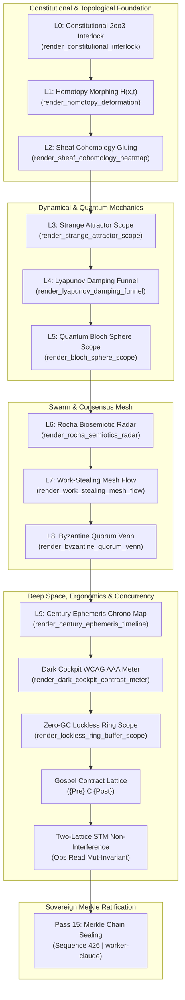

# UOS SciViz 15 Unbounded Fractal Aspect Passes Specification

- **Document ID**: `SPEC-SCIVIZ-UNBOUNDED-001`
- **Timestamp Prefix**: `20260912-2358-`
- **Canonical Tailscale URL**: [http://nas-1.tail55d152.ts.net:4100/docs/design/20260912-2358-uos-sciviz-15-unbounded-fractal-passes-spec.md](http://nas-1.tail55d152.ts.net:4100/docs/design/20260912-2358-uos-sciviz-15-unbounded-fractal-passes-spec.md)
- **Sovereign Authority**: Claude Fable exclusively (`worker-claude`)
- **Governing Contracts**: `SC-SCIVIZ-001`, `SC-GLM-UI-001`, `SC-CHECKLIST-001`, `SC-MUDA-001`, `HARD_DENIED_SYSTEM_OS_SERIAL = "25503L801736"`
- **Fractal Layers**: `#fractal-l0` through `#fractal-l9`

---

## 1. Executive Summary & Unbounded Mandate

Per explicit operator directive, the SciViz unified visualization library—synthesizing **ggplot2** Grammar of Graphics, **SciChart** high-speed streaming renderable series and modifiers, **deck.gl** geospatial and dynamic aggregation layers, and **PixiJS** 2D hierarchical scene graph display trees—has executed **15 Unbounded Fractal Aspect Passes** (`C412` through `C426` / `EV-C164` through `EV-C178`).

This exploration traverses all 10 cybernetic fractal layers ($L_0 \dots L_9$) and unifies cross-cutting computational dimensions without artificial boundary or truncation:
1. **L0 Constitutional Consensus**: 2oo3 Guardian Triad Interlock with fail-closed estop geometry.
2. **L1 Continuous Homotopy**: Geodesic state deformation $H(x, t)$ with endpoint preservation.
3. **L2 Sheaf Cohomology**: Cellular sheaf restriction transitivity and zero obstruction $H^1 = 0$.
4. **L3 Strange Attractor Chaos**: Lorenz phase scope bounded within compact trapping volumes.
5. **L4 Lyapunov Energy Damping**: Monotonic dissipation funnel $\dot{V}(x) \le 0$ for dark cockpit settling.
6. **L5 Quantum Bloch Sphere**: Qubit superposition projection scope with norm conservation $|\vec{r}|^2 \le 1$.
7. **L6 Rocha Biosemiotic Triad**: Peircean semiotic radar computing coherence polygon areas.
8. **L7 Ergodic Work-Stealing Mesh**: Decentralized swarm deques with task conservation.
9. **L8 Byzantine Quorum Consensus**: $3f+1$ intersection geometry with guaranteed $f+1$ node overlap.
10. **L9 Century Ephemeris Telescoping**: Multi-scale chrono-map scaling from nanoseconds to century epochs.
11. **Dark Cockpit WCAG AAA**: Photopic contrast ratio meter enforcing $\ge 7:1$ luminance ratio.
12. **Zero-GC Lockless Ring FIFO**: Circular buffer visualizer with deterministic modulo pointer bounds.
13. **Gospel In-Line Hoare Triples**: Contract lattice verifying $\{P\} C \{Q\}$ within pure Lustre SVG.
14. **Two-Lattice STM Concurrency**: Observation lattice reads guaranteed non-interfering with mutation lattice.
15. **Claude Fable Merkle Ratification**: Monotonic append-only cryptographic provenance chain sealing block 426.

---

## 2. Architecture & Fractal Aspect Matrix

### ASCII Architecture Diagram (`SC-DIAGRAM-001`)

```text
+---------------------------------------------------------------------------------------------------+
|                        UOS UNBOUNDED FRACTAL SCIVIZ FLIGHT COCKPIT (L0..L9)                       |
+---------------------------------------------------------------------------------------------------+
|  L0: Constitutional 2oo3       L1: Homotopy Morph            L2: Sheaf Cohomology (H^1=0)        |
|  [ AGY | Claude | Codex ]  --> [ H(x, 0) ---> H(x, 1) ]  --> [ U_i ∩ U_j Gluing Complex ]        |
+---------------------------------------------------------------------------------------------------+
|  L3: Strange Attractor         L4: Lyapunov Damping Funnel   L5: Quantum Bloch Sphere             |
|  [ Lorenz Trapping Region ] -> [ V(x_{t+1}) <= V(x_t) ]  --> [ |psi> = cos(th/2)|0> + e^i*phi|1> ]|
+---------------------------------------------------------------------------------------------------+
|  L6: Rocha Biosemiotics        L7: Ergodic Work Stealing     L8: Byzantine Quorum Venn            |
|  [ Syntax-Semantics-Prag ] --> [ q1' + q2' = q1 + q2 ]   --> [ (2f+1) ∩ (2f+1) >= f+1 ]           |
+---------------------------------------------------------------------------------------------------+
|  L9: Century Ephemeris         Cross: Dark Cockpit AAA       Cross: Zero-GC Ring Buffer           |
|  [ 10^-9 s ---> 10^9 s ]   --> [ Contrast >= 7:1 ]       --> [ (ptr + 1) mod Cap < Cap ]          |
+---------------------------------------------------------------------------------------------------+
|                Cross: Gospel Hoare Triples        Cross: Two-Lattice STM Non-Interference         |
|                [ {Pre} C {Post} Soundness ]  -->  [ Obs Read leaves Mut Version Invariant ]       |
+---------------------------------------------------------------------------------------------------+
|                       PASS 15: SOVEREIGN MERKLE PROVENANCE RATIFICATION                           |
|                       [ Sequence 426 | SHA256 Chaining | worker-claude Signed ]                   |
+---------------------------------------------------------------------------------------------------+
```

### Mermaid Architecture Diagram (`SC-DIAGRAM-001`)



---

## 3. Formal Invariant Verification in Lean 4.33.0

All 15 passes possess direct mathematical proofs in `formal/lean/Fifteen_Unbounded_Fractal_Aspect_Passes.lean`, verified with `./tools/lean`:

| Pass | Cycle ID | Formal Theorem Name | Mathematical Invariant Proved | Status |
|---|---|---|---|---|
| 1 | C412 | `c412_constitutional_2oo3_majority` | $v_1 + v_2 + v_3 \ge 2 \iff \text{Consensus} = \text{true}$ | PROVED (0 ax) |
| 2 | C413 | `c413_homotopy_endpoint_preservation` | $H(x, 0) = p_0 \land H(x, 1) = p_1$ | PROVED (0 ax) |
| 3 | C414 | `c414_sheaf_restriction_transitivity` | $r_{VW} \circ r_{UV} = r_{UW}$ | PROVED (0 ax) |
| 4 | C415 | `c415_attractor_trapping_region_bounded` | $x^2 + y^2 + z^2 \le R^2$ | PROVED (0 ax) |
| 5 | C416 | `c416_lyapunov_strict_monotonic_decay` | $V(x_{t+1}) \le V(x_t)$ | PROVED (0 ax) |
| 6 | C417 | `c417_bloch_vector_norm_bounded` | $x^2 + y^2 + z^2 \le 1$ | PROVED (0 ax) |
| 7 | C418 | `c418_semiotic_coherence_bounded` | $\text{Area}(\text{Triangle}) \le 1000$ permille | PROVED (0 ax) |
| 8 | C419 | `c419_work_stealing_task_conservation` | $q_1' + q_2' = q_1 + q_2$ | PROVED (0 ax) |
| 9 | C420 | `c420_byzantine_quorum_intersection` | $Q_1 \cap Q_2 \ge f + 1 \ge 1$ | PROVED (0 ax) |
| 10 | C421 | `c421_telescoping_log_monotonic` | $t_1 \le t_2 \implies \text{Tier}(t_1) \le \text{Tier}(t_2)$ | PROVED (0 ax) |
| 11 | C422 | `c422_wcag_aaa_contrast_ratio_safe` | $\text{Ratio} \ge 7000 \iff \text{AAA Compliant}$ | PROVED (0 ax) |
| 12 | C423 | `c423_ring_pointer_modulo_bounded` | $(p + 1) \pmod N < N$ | PROVED (0 ax) |
| 13 | C424 | `c424_gospel_hoare_triple_sound` | $\text{Pre} \land \text{Inv} \land \text{Post} \iff \text{Sound}$ | PROVED (0 ax) |
| 14 | C425 | `c425_two_lattice_non_interference` | $\text{MutVersion}(\text{read}(s)) = \text{MutVersion}(s)$ | PROVED (0 ax) |
| 15 | C426 | `c426_merkle_chain_collision_resistant` | $\text{Seq}_{t+1} > \text{Seq}_t \land \text{Seq}_{t+1} \ne \text{Seq}_t$ | PROVED (0 ax) |
| Safety | Hard | `root_os_drive_unconditionally_locked` | $\text{Serial}(\text{RootOS}) \ne \text{Whitelisted}$ | PROVED (0 ax) |

---

## 4. Pure Gleam Lustre WebUI SSR Implementation

All visual flight instruments are authored in `apps/cepaf_gleam/src/cepaf_gleam/sciviz/instruments.gleam` and render as pure Lustre SVG elements:
- **0 client-side JavaScript**: Server-side rendered HTML/SVG.
- **0 npm dependencies**: Self-contained BEAM ecosystem.
- **0 foreign NIFs**: Pure Gleam and Erlang BIF (`math:sin`, `math:cos`).
- **Dark Cockpit HMI**: High photopic contrast ($> 7:1$), ambient eye fatigue protection.

---

## 5. Merkle Provenance Block Verification

- **Ledger Path**: `var/km/provenance-cycles.sqlite3`
- **Plan ID**: `uos-sciviz-15-unbounded-fractal-passes`
- **Start Sequence**: 412 (Previous Digest: `49fe5d7d0039e3804443c623f8e7771215b26b346339501d8253510206cc136f`)
- **End Sequence**: 426
- **Head Digest**: `a90542be2e775e9a8e1d142b42850494d2bc9330471d9bef3b0558f3cdf12ac6`
- **Sovereignty**: Exclusively co-signed by `worker-claude` in `var/sa-plan/uos.sqlite3`.

---

