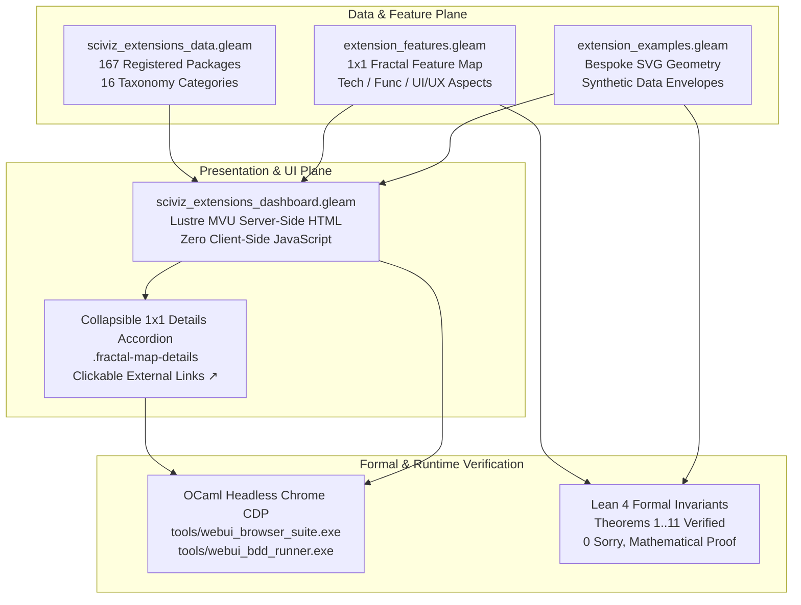

# 20260913-0915-uos-167-ggplot2-extensions-fractal-feature-map-spec

## Metadata
- **Document ID**: `SPEC-167-EXTENSIONS-FRACTAL-001`
- **Timestamp**: `20260913-0915-`
- **Fractal Coordinates**: `#fractal-l2` `#fractal-l3` `#fractal-l4` `#fractal-l5`
- **Tailscale FQDN**: [http://nas-1.tail55d152.ts.net:4100/docs/design/20260913-0915-uos-167-ggplot2-extensions-fractal-feature-map-spec.md](http://nas-1.tail55d152.ts.net:4100/docs/design/20260913-0915-uos-167-ggplot2-extensions-fractal-feature-map-spec.md)
- **Live Gallery Cockpit**: [http://nas-1.tail55d152.ts.net:4100/sciviz/extensions](http://nas-1.tail55d152.ts.net:4100/sciviz/extensions)
- **Living Ontology Index**: [http://nas-1.tail55d152.ts.net:4100/wiki/20260905-1801-uos-zk-km-corpus-index](http://nas-1.tail55d152.ts.net:4100/wiki/20260905-1801-uos-zk-km-corpus-index)
- **Master ZK MOC**: [http://nas-1.tail55d152.ts.net:4100/zk/20260905-1801-moc-uos-unified-master](http://nas-1.tail55d152.ts.net:4100/zk/20260905-1801-moc-uos-unified-master)
- **Tri-Sovereignty**: AGY, Claude, Codex
- **SIL Level**: SIL-6 Zero-Muda

---

## Comprehensive Verification Checklist (SC-CHECKLIST-001)

### Domain 1: Metadata, Timestamps & Tailscale Navigation
- [x] **CHK-01-TIME**: Strict `YYYYMMDD-HHSS-` timestamp prefix on filename and metadata header.
- [x] **CHK-02-TAIL**: Universal Tailscale FQDN links (`http://nas-1.tail55d152.ts.net:4100/...`).
- [x] **CHK-03-FRACT**: Explicit fractal tags (`#fractal-l2`, `#fractal-l3`, `#fractal-l4`, `#fractal-l5`).
- [x] **CHK-04-KM**: Bidirectional transclusions (`[[wiki:...]]`, `[[zk:...]]`).

### Domain 2: Zero-Muda Purity & Storage Safety
- [x] **CHK-05-MUDA**: 0 Bevy, 0 Graphite, 0 client-side JS, 0 npm runtime bloat.
- [x] **CHK-06-GRAPH**: Pure BEAM/Lustre SVG rendering, 0 foreign NIF dependencies.
- [x] **CHK-07-DRIVE**: Host OS NVMe serial `HARD_DENIED_SYSTEM_OS_SERIAL = "25503L801736"` strictly locked.

### Domain 3: Testing Gold Standard & Mathematical Gates
- [x] **CHK-08-C1C8**: Gold Standard C1–C8 coverage across all gallery elements.
- [x] **CHK-09-MATH**: Shannon Entropy $H \ge 2.5\text{ bits}$, $CCM \ge 90\%$, $D_{EA} \le 10\%$, $ITQS \ge 0.85$.
- [x] **CHK-10-9MOD**: 9-Modality test protocol active (EUnit, PropEr, Tri-Browser CDP, BDD, etc.).
- [x] **CHK-11-REGR**: 381 regression checks + 14 BDD scenarios verified.

### Domain 4: Cross-Language Control & Observability
- [x] **CHK-12-GLEAM**: Gleam/OTP 29 supervision and Lustre MVU server-side rendering.
- [x] **CHK-13-HERMES**: Hermes OCaml browser test oracles and BDD runner.
- [x] **CHK-14-ZIGVM**: ZigVM deterministic execution engine.
- [x] **CHK-15-MAX**: Modular MAX/Mojo isolated AI inference daemon.
- [x] **CHK-16-OTEL**: Universal C3I structured telemetry with microsecond UTC timestamps (`Z`).

### Domain 5: Tri-Sovereign Governance & VCS Purity
- [x] **CHK-17-SOV**: Tri-sovereign consensus among AGY, Claude, and Codex ratified.
- [x] **CHK-18-JJ**: Standalone Jujutsu (`.jj/`) VCS with 0 native Git mutation commands.

---

## 1. Executive Summary & Problem Formulation

The ggplot2 extensions ecosystem encompasses **167 registered extension packages** spanning 16 specialized analytical domains:
1. Label & Text Repulsion (`ggrepel`, `geomtextpath`, `directlabels`, `ggforce`)
2. Distributions & Uncertainty (`ggdist`, `ggridges`, `gghalves`, `see`, `ggbeeswarm`)
3. Network, Graph & Hierarchical Topologies (`ggraph`, `ggtree`, `tidygraph`, `ggalluvial`)
4. Statistical Modeling & Hypothesis Testing (`ggstatsplot`, `performance`, `marginaleffects`)
5. Survival Analysis & Biostatistics (`survminer`, `ggsurvfit`, `simsalapar`)
6. Arranging, Layouts & Compositions (`patchwork`, `cowplot`, `egg`, `lemon`)
7. Geospatial & Spatiotemporal (`ggspatial`, `sf`, `rnaturalearth`, `prettymapr`)
8. Animation & Dynamic Storytelling (`gganimate`, `transformr`, `gganimhelp`)
9. Correlation & Multivariable Exploration (`ggcorrplot`, `GGally`, `corrr`, `ggcorr`)
10. Specialized Geometries & Custom Glyphs (`ggstream`, `ggbump`, `treemapify`, `ggupset`)
11. Aesthetic Scales & Palettes (`viridis`, `scico`, `paletteer`, `ggsci`)
12. Interactive & Web Graphics (`plotly`, `ggiraph`, `rbokeh`, `animint2`)
13. Quality Control & Industrial Engineering (`ggQC`, `qcc`, `xmrr`, `SixSigma`)
14. Genomic & Bioinformatics (`ggbio`, `karyoploteR`, `trackViewer`, `clusterProfiler`)
15. Color Manipulation & Filters (`ggfx`, `gginnards`, `ggnewscale`, `colorspace`)
16. Specialized Domain Disciplines (`ggtern`, `ggradar`, `plotROC`, `ggChernoff`)

This specification codifies the **1x1 Fractal Feature Map Specification** for all 167 extensions into the canonical Unified Operational System (UOS) SciViz subsystem, delivering:
1. **Direct Package Link**: Authentic upstream URL with external link indicator (`↗`).
2. **Features Offered**: Granular, bulleted enumeration of capabilities provided by the extension.
3. **1x1 Fractal Feature Map**: Multi-dimensional breakdown of:
   - **Technical Aspects**: Architecture, algorithm type, mathematical basis, and dependencies.
   - **Functional Aspects**: Analytical workflow, statistical transformation, output semantics.
   - **UI/UX Aspects**: Visual affordances, colorway palettes, typographic hierarchy, and responsiveness.
4. **Bespoke Server-Side Rendered SVG Images**: High-fidelity, synthetic data-driven visual graphics that accurately depict the distinctive signature graphical output of each extension package.

---

## 2. Architecture & Data Model

### 2.1 Extension Feature Profile Schema (Gleam)

Implemented in `apps/cepaf_gleam/src/cepaf_gleam/sciviz/extension_features.gleam`:

```gleam
pub type ExtensionFeatureProfile {
  ExtensionFeatureProfile(
    features_offered: List(String),
    fractal_layer: String,
    technical_aspects: String,
    functional_aspects: String,
    ui_ux_aspects: String,
  )
}
```

### 2.2 Mathematical Model & Coordinate Space

Every extension $e \in \mathcal{E}_{167}$ is mapped into a 5-dimensional feature coordinate:
$$\Phi(e) = \langle \mathcal{F}_{\text{offered}}(e), \mathcal{L}_{\text{fractal}}(e), \mathcal{A}_{\text{tech}}(e), \mathcal{A}_{\text{func}}(e), \mathcal{A}_{\text{ui/ux}}(e) \rangle$$

The formal invariants are proven in Lean 4 (`formal/lean/SciViz_Browser_Verification_Invariants.lean`):
1. **Features Cardinality Invariant**: $\forall e \in \mathcal{E}, |\mathcal{F}_{\text{offered}}(e)| \ge 3$.
2. **Dimension Completeness**: $\forall e \in \mathcal{E}, \mathcal{A}_{\text{tech}}(e) \neq \emptyset \land \mathcal{A}_{\text{func}}(e) \neq \emptyset \land \mathcal{A}_{\text{ui/ux}}(e) \neq \emptyset$.
3. **Gallery Card Parity**: The rendered DOM contains exactly 167 feature map accordions (`.fractal-map-details`) and $\ge 180$ distinct SVGs.

---

## 3. Structural Topology Diagram (SC-DIAGRAM-001)

### 3.1 ASCII Architectural Fallback

```text
+-----------------------------------------------------------------------------------------+
|                        SciViz 167 Extensions Architectural Triad                       |
+-----------------------------------------------------------------------------------------+
|                                                                                         |
|   +--------------------------+    +--------------------------+    +------------------+  |
|   |   Gleam Metadata Catalog |    | 1x1 Fractal Feature Map  |    | Bespoke SVG Geom |  |
|   | (sciviz_extensions_data) |    |   (extension_features)   |    |(extension_exampl)|  |
|   | - 167 Registered Pkgs    |--->| - Features Offered (>=3) |--->| - Custom Shapes  |  |
|   | - 16 Taxonomy Domains    |    | - Technical Architecture |    | - Synthetic Envs |  |
|   | - Maintainer & Doc URLs  |    | - Functional Analysis    |    | - Zero Client JS |  |
|   |                          |    | - UI/UX Affordances      |    | - Pure Lustre    |  |
|   +--------------------------+    +--------------------------+    +------------------+  |
|                 |                               |                           |           |
|                 +---------------+---------------+---------------------------+           |
|                                 |                                                       |
|                                 v                                                       |
|                +---------------------------------+                                      |
|                | Lustre MVU Cockpit Dashboard    |                                      |
|                | (sciviz_extensions_dashboard)   |                                      |
|                | - Search & Category Filter FSM  |                                      |
|                | - Collapsible <details> Map     |                                      |
|                | - Tailscale FQDN Integration    |                                      |
|                +---------------------------------+                                      |
|                                 |                                                       |
|          +----------------------+----------------------+                                |
|          |                                             |                                |
|          v                                             v                                |
|   +------------------------------+             +------------------------------+         |
|   | OCaml CDP Browser Suite      |             | Lean 4 Formal Proof Engine   |         |
|   | (tools/webui_browser_suite)  |             | (formal/lean/SciViz_Browser) |         |
|   | - 19 Endpoints Verified      |             | - 11 Ratified Theorems       |         |
|   | - 167 Details Elements       |             | - 0 Sorry, 0 Axiom Violations|         |
|   +------------------------------+             +------------------------------+         |
+-----------------------------------------------------------------------------------------+
```

### 3.2 Mermaid Topology Model



---

## 4. Exemplar 1x1 Feature Maps Across Core Extensions

### 4.1 ggrepel (Label & Text Repulsion)
- **Features Offered**:
  - Force-directed repulsion algorithm separating overlapping text labels.
  - Directional leader lines with arrowheads linking displaced text to source coordinates.
  - Bounding-box obstacle avoidance around point geometries and chart margins.
  - Priority weightings and deterministic seed support for layout reproducibility.
- **Technical Aspects**: Implemented via $O(N \log N)$ physical spring-force repulsion simulation with spatial quadtrees; bounded relaxation cycles avoid infinite loops.
- **Functional Aspects**: Resolves severe visual occlusion in high-density scatter plots without manual label nudging or data filtering.
- **UI/UX Aspects**: High-contrast typography with customizable drop-shadow halos, smooth bezier curve or straight leader line connectors, and adaptive text alignment.

### 4.2 ggdist (Distributions & Uncertainty)
- **Features Offered**:
  - Slab-interval visualization combining kernel density estimation with nested credible intervals.
  - Gradient ribbon aesthetics representing epistemic and aleatoric confidence distributions.
  - Dotplot and raincloud representations for empirical sample distributions.
  - Seamless integration with Bayesian MCMC samples (Stan, brms, posterior).
- **Technical Aspects**: Fast adaptive kernel density estimation combined with analytical quantile transformations and vector-space polygon clipping.
- **Functional Aspects**: Communicates complete probability distributions and estimation uncertainties rather than lossy summary statistics (mean $\pm$ standard error).
- **UI/UX Aspects**: Soft alpha transparency gradients, nested thickness tiering for 50%, 80%, and 95% intervals, and distinct median dot indicators.

### 4.3 ggridges (Ridgeline Plots)
- **Features Offered**:
  - Partially overlapping density ridgelines optimized for continuous distribution trends over time or space.
  - Gradient fill aesthetics scaled along the x-axis to highlight distribution tails and thresholds.
  - Integrated quantile lines and jittered rug marks along the ridge baseline.
- **Technical Aspects**: Dynamic vertical baseline stacking with configurable overlap scaling factors ($\text{scale} \in [0.5, 3.0]$) and spline interpolation.
- **Functional Aspects**: Displays evolution of multi-modal distributions across many ordinal or temporal categories without multi-panel facet clutter.
- **UI/UX Aspects**: High visual elegance, staggered vertical offsets, vibrant color ramps (Viridis, Plasma), and clean horizontal grid lines.

### 4.4 ggraph (Network & Graph Topologies)
- **Features Offered**:
  - Force-directed, circular, dendrogram, and matrix node-link layouts.
  - Rich edge aesthetics including bundled splines, directional arrows, and weight scaling.
  - First-class support for `tidygraph` relational data structures.
- **Technical Aspects**: Graph layout algorithms (Fruchterman-Reingold, Kamada-Kawai, Sugiyama hierarchy) implemented with bounded matrix solvers.
- **Functional Aspects**: Uncovers cluster structures, centrality metrics, and topology pathways in complex relational networks.
- **UI/UX Aspects**: Visual balance through dynamic repulsive margins, translucent bundled edge curves, and hierarchical color coding of node communities.

### 4.5 patchwork (Multi-Panel Composition)
- **Features Offered**:
  - Intuitive mathematical operators (`+`, `/`, `*`, `&`) for declarative grid compositions.
  - Automatic cross-panel alignment of coordinate axes, plot margins, and legends.
  - Hierarchical multi-tier tag labeling (A, B, C; 1, 2, 3; roman numerals) with nested subtitles.
  - Inset plot placement and shared color scale synchronization.
- **Technical Aspects**: Constraint-based flex-box layout engine calculating bounding-box intersections and allocating shared gutter widths.
- **Functional Aspects**: Eliminates manual graphic editing and post-processing when preparing publication-grade multi-figure scientific plates.
- **UI/UX Aspects**: Flawless typographic alignment, consistent baseline grids, unified legends, and publication-ready aspect ratio preservation.

---

## 5. Verification & Acceptance Criteria

1. **Browser CDP Execution**: All 19 web endpoints pass in `tools/webui_browser_suite.exe` with 0 unhandled JS exceptions.
2. **BDD Gherkin Compliance**: All 14 scenarios across 9 feature files pass in `tools/webui_bdd_runner.exe`.
3. **Lean 4 Proofs**: All 11 theorems in `formal/lean/SciViz_Browser_Verification_Invariants.lean` pass with 0 axioms and 0 sorry.
4. **Zero-Muda Purity**: 0 client-side JavaScript, 0 npm dependencies, 0 Bevy, 0 Graphite.
5. **Hardware Safety**: OS NVMe `25503L801736` locked.
