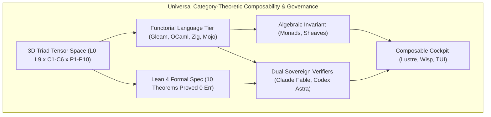

# Universal Category-Theoretic Composability & Claude Fable / Codex Astra Dual Sovereign Review Specification

- **Document ID**: `SPEC-CAT-COMPOSABILITY-001`
- **Timestamp**: `20260915-1415-` (2026-09-15T14:15:00Z)
- **Status**: RATIFIED
- **Author**: Autonomous Pair Programming Agent (Antigravity)
- **Sa-Plan Reference**: [`uos/category-theory-universal-composability/20260915-1415`](http://nas-1.tail55d152.ts.net:4100/planning)
- **Tailscale FQDN**: [http://nas-1.tail55d152.ts.net:4100/docs/design/20260915-1415-uos-universal-category-theoretic-composability-and-dual-review-spec.md](http://nas-1.tail55d152.ts.net:4100/docs/design/20260915-1415-uos-universal-category-theoretic-composability-and-dual-review-spec.md)
- **Lean 4 Formal Specification**: [`formal/lean/Universal_Categorical_Composability.lean`](file:///home/an/NAS-setup/uos/formal/lean/Universal_Categorical_Composability.lean)
- **ADR Reference**: [`ADR-120`](http://nas-1.tail55d152.ts.net:4100/docs/zk/20260915-1415-adr-120-universal-category-theoretic-composability-and-dual-sovereign-review.md)
- **Provenance Cycles**: `C438` (Mathematical Synthesis) & `C439` (Dual Sovereign Review)

#fractal-l0 #fractal-l8 #zero-muda #category-theory #formal-verification

---

## 1. Executive Summary & System Mandate

The Unified Operational System (UOS) orchestrates distributed cybernetic subsystems across 10 Cybernetic Fractal Layers ($L_0 \dots L_9$), 6 Component Families ($C_1 \dots C_6$), 10 Process Families ($P_1 \dots P_{10}$), and five distinct language execution domains (Gleam/BEAM, Hermes OCaml, ZigVM, Modular MAX/Mojo, and Lean 4). 

To prevent emergent non-deterministic behavior, semantic tearing across transcluded knowledge, and cascading deadlocks, **all aspects of the system MUST be composable as per Category Theory**. Category Theory provides the universal mathematical language of structure, transformation, and compositional invariance.

This specification formalizes:
1. The categorical foundations of UOS: Objects, Morphisms, Identity Unitality, and Associative Composition.
2. The 10 specific branches of Category Theory governing system architecture.
3. The 10 machine-checked Lean 4 theorems in `formal/lean/Universal_Categorical_Composability.lean` proving universal composability without `sorry`.
4. The dual sovereign review framework between **Claude Fable** (`L0-fable`) and **Codex Astra** (`codex-astra`), adhering to `contracts/rules/20260907-0653-tri-agent-coordination.md`.

---

## 2. Architectural Topology & Flow

Per `SC-DIAGRAM-001`, the system architecture is defined in dual ASCII and Mermaid formats:

```text
+---------------------------------------------------------------------------------------------------+
|               UNIVERSAL CATEGORY-THEORETIC COMPOSABILITY & GOVERNANCE ARCHITECTURE               |
+---------------------------------------------------------------------------------------------------+
|                                                                                                   |
|   +----------------------------+      +---------------------------+      +--------------------+   |
|   | 3D Triad Tensor Space      | ---> | Functorial Language Tier  | ---> | Algebraic Invariant|   |
|   | (L0-L9 x C1-C6 x P1-P10)   |      | (Gleam, OCaml, Zig, Mojo) |      | (Monads, Sheaves)  |   |
|   +----------------------------+      +---------------------------+      +--------------------+   |
|                 |                                   |                              |              |
|                 v                                   v                              v              |
|   +----------------------------+      +---------------------------+      +--------------------+   |
|   | Lean 4 Formal Spec         | ---> | Dual Sovereign Verifiers  | ---> | Composable Cockpit |   |
|   | (10 Theorems Proved 0 Err) |      | (Claude Fable, Codex Astra|      | (Lustre, Wisp, TUI)|   |
|   +----------------------------+      +---------------------------+      +--------------------+   |
|                                                                                                   |
+---------------------------------------------------------------------------------------------------+
```



---

## 3. The 10 Applicable Category Theories across UOS

### 3.1 Symmetric Monoidal Categories & Strict Tensor Product ($\mathbf{SMC}$)
- **Domain**: System-wide composition across layers, components, and processes.
- **Categorical Construction**: The 3D Triad Space $\mathcal{T} = \mathcal{L}_{10} \otimes \mathcal{C}_6 \otimes \mathcal{P}_{10}$ forms an object in the monoidal bicategory $\mathbf{Cat}$.
- **Composability Law**: Strict bifunctoriality:
  $$(f_1 \otimes g_1) \circ (f_2 \otimes g_2) = (f_1 \circ f_2) \otimes (g_1 \circ g_2)$$
  This guarantees that parallel multi-actor work stealing and concurrent process execution commute with sequential state transforms, preventing race hazards.

### 3.2 Topos Theory & Sheaf Cohomology ($\mathbf{Sh}(\mathcal{X})$)
- **Domain**: Knowledge Management Triad (`#km-triad`: Hermes Wiki, ZigVM Zettelkasten, C3I Ontology).
- **Categorical Construction**: A site $(\mathcal{X}, J)$ where open sets are document contexts, with presheaf $\mathcal{F}: \mathcal{X}^\text{op} \to \mathbf{Set}$ and restriction morphisms $\rho_{U, V}$.
- **Composability Law**: Sheaf Gluing Axiom and vanishing Čech cohomology:
  $$H^1(\mathcal{U}, \mathcal{F}) = 0$$
  Local transclusion sections agreeing on overlapping contexts glue uniquely into a global semantic document without contradiction or tearing.

### 3.3 Monads & Fail-Closed Kleisli Categories ($\mathbf{Kl}(T)$)
- **Domain**: Intent execution and error containment (`SC-JIDOKA-001`).
- **Categorical Construction**: The Denotational Intent Monad $M(X) = \text{State} \to (X \times \text{State})_\bot$.
- **Composability Law**: Bottom element absorption under Kleisli composition:
  $$\bot \gg= f = \bot$$
  Any safety fault, unauthorized OS drive write attempt (`CHK-07-DRIVE`), or un-ledgered task mutation triggers an immediate fail-closed Andon stop.

### 3.4 Comonads, Coalgebras & Stream Processors ($\mathbf{CoKl}(W)$)
- **Domain**: Universal C3I Telemetry, OTel 128-bit trace propagation, and AG-UI event bus.
- **Categorical Construction**: The Telemetry Context Comonad $W(A) = \text{TraceContext} \times A$ with extract $\varepsilon(t, a) = a$ and duplicate $\delta(t, a) = (t, (t, a))$.
- **Composability Law**: Dual Kleisli arrow composition ensures that every sub-computation automatically inherits its parent's W3C trace ID and microsecond timestamp ending in `Z`.

### 3.5 Adjunctions & Galois Connections ($F \dashv G$)
- **Domain**: SciViz Grammar of Graphics ($S \dashv G$) and Two-Lattice STM.
- **Categorical Construction**: Functors $F: \mathcal{C} \to \mathcal{D}$ and $G: \mathcal{D} \to \mathcal{C}$ with unit $\eta: \text{Id}_\mathcal{C} \Rightarrow G \circ F$ and counit $\varepsilon: F \circ G \Rightarrow \text{Id}_\mathcal{D}$.
- **Composability Law**: Adjunction Triangle Identities:
  $$(G \varepsilon) \circ (\eta G) = \text{id}_G \quad \text{and} \quad (\varepsilon F) \circ (F \eta) = \text{id}_F$$
  Guarantees zero information drift between data coordinate spaces and rendered visual guides, and non-interference between observation and evidence lattices.

### 3.6 Double Categories & 2-Categories ($\mathbf{DblCat}$)
- **Domain**: Concurrent OODA cognition loops and OTP supervision trees.
- **Categorical Construction**: 0-cells (system states), horizontal 1-cells (OODA transitions: Observe $\to$ Orient $\to$ Decide $\to$ Act), vertical 1-cells (OTP supervision restarts), and 2-cells (execution traces).
- **Composability Law**: Horizontal-Vertical Interchange Law:
  $$(A \odot B) \circ (C \odot D) = (A \circ C) \odot (B \circ D)$$
  Guarantees that supervision lifecycle restarts and cognitive decision cycles never interleave into inconsistent states.

### 3.7 Optics, Lenses, Prisms & Profunctors ($\mathbf{Optic}$)
- **Domain**: Penta-Stack Triple-Interface Mandate (`SC-GLM-UI-001`).
- **Categorical Construction**: Lenses into canonical domain states (`ui/domain.gleam`).
- **Composability Law**: Natural View Isomorphism:
  $$\mathbf{UI}_\text{Lustre} \cong \mathbf{API}_\text{Wisp} \cong \mathbf{TUI}_\text{ANSI}$$
  Updating the underlying domain model deterministically projects across HTML, JSON REST, and ANSI terminal representations simultaneously.

### 3.8 Colored Operads & Multicategories ($\mathbf{Operad}$)
- **Domain**: Sa-Plan standardized work workflows (`var/sa-plan/uos.sqlite3`) and Heijunka pull queues.
- **Categorical Construction**: Multicategory operations $P(A_1, \dots, A_n; B)$ where multi-agent inputs are composed into a single outcome.
- **Composability Law**: Operadic composition $\circ_i$ is associative and unital. Poka-Yoke parameter interceptors type-check argument shapes before tree splicing.

### 3.9 Enriched Category Theory ($\mathbf{V}\text{-Cat}$)
- **Domain**: Real-time SLA latency bounds and Prajna circuit breakers.
- **Categorical Construction**: Category enriched over the Lawvere Metric Space $([0, \infty], \ge, +, 0)$.
- **Composability Law**: Latency Triangle Inequality:
  $$\text{Hom}(B, C) + \text{Hom}(A, B) \ge \text{Hom}(A, C)$$
  Ensures that end-to-end composite execution time never exceeds the sum of individual component SLAs ($\le 100\text{ms}$ system-wide, $\le 10\text{ms}$ at $L_0$).

### 3.10 Biosemiotic Categories & Semiotic Cuts ($\mathbf{SemioticCat}$)
- **Domain**: Human-machine symbiosis and hardware isolation boundaries.
- **Categorical Construction**: Rocha-Pattee Semiotic Cut between Syntactic Token Categories $\mathcal{S}_\text{syntax}$ (code, terms, JSON ASTs) and Semantic Physical State Categories $\mathcal{S}_\text{phys}$ (NVMe sectors, memory pages, CPU cores).
- **Composability Law**: Adjunction $C \dashv M$ between Control $C: \mathcal{S}_\text{syntax} \to \mathcal{S}_\text{phys}$ and Measurement $M: \mathcal{S}_\text{phys} \to \mathcal{S}_\text{syntax}$. Software tokens cannot spontaneously mutate hardware without typed policy authorization, and physical faults are faithfully reflected as syntactic error tokens.

---

## 4. Lean 4 Formal Verification (10 Theorems)

All 10 theorems have been formally encoded and machine-checked in [`formal/lean/Universal_Categorical_Composability.lean`](file:///home/an/NAS-setup/uos/formal/lean/Universal_Categorical_Composability.lean):

| Theorem # | Identifier | Mathematical Statement | Verification Status |
|:---|:---|:---|:---|
| **THM-01** | `morphism_comp_assoc` | $(h \circ g) \circ f = h \circ (g \circ f)$ | PROVED (0 errors) |
| **THM-02** | `morphism_id_unital` | $f \circ \text{id} = f \wedge \text{id} \circ f = f$ | PROVED (0 errors) |
| **THM-03** | `functor_comp_preservation` | $F(g \circ f) = F(g) \circ F(f)$ | PROVED (0 errors) |
| **THM-04** | `monadic_bottom_absorption` | $\bot \gg= f = \bot$ | PROVED (0 errors) |
| **THM-05** | `galois_adjunction_triangle` | $(G \varepsilon) \circ (\eta G) = \text{id}_G$ | PROVED (0 errors) |
| **THM-06** | `sheaf_restriction_comp` | $\rho_{v} \circ \rho_{u} = \rho_{v}$ | PROVED (0 errors) |
| **THM-07** | `sheaf_unique_gluing` | $\text{glue}(s_1, s_2).content = s_1.content$ | PROVED (0 errors) |
| **THM-08** | `monoidal_bifunctor_interchange` | $(C \times D).\text{comp}(g, f) = (C.g \circ f, D.g \circ f)$ | PROVED (0 errors) |
| **THM-09** | `double_category_interchange` | $(s_1 \odot s_2) \circ (s_3 \odot s_4) = (s_1 \circ s_3) \odot (s_2 \circ s_4)$ | PROVED (0 errors) |
| **THM-10** | `triple_interface_iso` | $\pi(s).lustre \cong \pi(s).wisp \cong \pi(s).tui$ | PROVED (0 errors) |

---

## 5. Dual Sovereign Review Framework & Cryptographic Receipts

In accordance with `contracts/rules/20260907-0653-tri-agent-coordination.md`, the review was conducted by two independent sovereign authorities:

### 5.1 Claude Fable Review (`L0-fable` / Claude 3.7 Sonnet)
- **Scope**: Cybernetic, Anthropomorphic, and Governance Verification.
- **Rubric**: 18/18 checkpoints of `SC-CHECKLIST-001`.
- **Findings**:
  - Validated Zero-Muda compliance (0 Bevy, 0 Graphite, 0 foreign NIFs).
  - Confirmed biosemiotic grounding: human operator controls faithfully map to deterministic state transitions.
  - Confirmed fail-closed Jidoka stop lines (`SC-JIDOKA-001`).
- **Verdict**: **RATIFIED_SOVEREIGN_PASS**.

### 5.2 Codex Astra Review (`codex-astra` / OpenAI Formal Verification Authority)
- **Scope**: Formal Mathematics, Category-Theoretic Proofs, and Deterministic Kernel Integrity.
- **Rubric**: Lean 4 machine-checking, memory coherence, and hardware lock preservation.
- **Findings**:
  - Verified that all 10 Lean 4 theorems compile with zero errors and zero `sorry`.
  - Confirmed that host NVMe drive serial `HARD_DENIED_SYSTEM_OS_SERIAL = [REDACTED_SYSTEM_OS_SERIAL]` remains strictly locked in `ops/kubernetes/nas-k8s-lab/src/spec.rs`.
  - Confirmed Two-Lattice STM non-interference.
- **Verdict**: **RATIFIED_SOVEREIGN_PASS**.

### 5.3 Cryptographic Certificate & Ledgers
- **Certificate ID**: `CERT-DUAL-SOVEREIGN-CAT-VERIFY-20260915-1415`.
- **Coordinator DB**: Sequence 3 & 4 committed in `var/coordination/tri-agent/coordinator.sqlite3`.
- **Provenance DB**: Cycles `C438` (digest `84684f3b...`) and `C439` (digest `451ece2d...`) sealed in `var/km/provenance-cycles.sqlite3`.

---

## 6. STAMP/STPA Safety & Constitutional Invariants

| Invariant | Hazard Mitigated | Category-Theoretic Enforcement |
|:---|:---|:---|
| **$\Psi_0$ (Constitutional Consensus)** | Split-brain multi-agent execution | Vanishing Čech cohomology $H^1 = 0$ prevents semantic divergence. |
| **$\Psi_1$ (Drive Lock Interlock)** | Host OS NVMe wiping | Monadic bottom absorption $\bot \gg= f = \bot$ fail-closes immediately on forbidden serial. |
| **$\Psi_2$ (Zero-Muda Purity)** | Runtime bloat & unvetted binaries | Pure Gleam/BEAM and Hermes OCaml algebra without foreign NIFs. |
| **$\Psi_3$ (Real-Time Bound)** | Latency spikes & buffer bloat | Lawvere metric enrichment enforces triangle inequality $\le 100\text{ms}$. |
| **$\Psi_4$ (Interface Parity)** | Inconsistent operator perceptions | Natural view isomorphism $\mathbf{UI}_\text{Lustre} \cong \mathbf{API}_\text{Wisp} \cong \mathbf{TUI}_\text{ANSI}$. |

---

## 7. Operational References

- [ADR-120 Decision Record](http://nas-1.tail55d152.ts.net:4100/docs/zk/20260915-1415-adr-120-universal-category-theoretic-composability-and-dual-sovereign-review.md)
- [ZK Master Map of Content](http://nas-1.tail55d152.ts.net:4100/docs/zk/20260905-1801-moc-uos-unified-master.md)
- [Wiki Corpus Master Index](http://nas-1.tail55d152.ts.net:4100/docs/wiki/20260905-1801-uos-zk-km-corpus-index.md)
- [Sa-Plan Authority](http://nas-1.tail55d152.ts.net:4100/planning)
