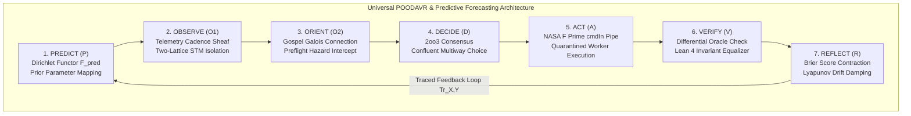

# 20260916-0455-uos-universal-poodavr-predictive-forecasting-and-constitutional-upgrades-spec.md

# UOS Specification: Universal POODAVR Upgrade, Predictive & Forecasting Category Theory, and Constitutional Rule Upgrades

- **Document ID**: `SPEC-PREDICT-POODAVR-001`
- **Timestamp Prefix**: `20260916-0455-`
- **Tailscale FQDN**: [http://nas-1.tail55d152.ts.net:4100/docs/design/20260916-0455-uos-universal-poodavr-predictive-forecasting-and-constitutional-upgrades-spec.md](http://nas-1.tail55d152.ts.net:4100/docs/design/20260916-0455-uos-universal-poodavr-predictive-forecasting-and-constitutional-upgrades-spec.md)
- **Lean 4 Proofs**: [`formal/lean/Predictive_Forecasting_Categorical_Semantics.lean`](file:///home/an/NAS-setup/uos/formal/lean/Predictive_Forecasting_Categorical_Semantics.lean)
- **Constitutional Mandates**: [`contracts/rules/20260916-0455-universal-poodavr-mandate.md`](http://nas-1.tail55d152.ts.net:4100/files/contracts/rules/20260916-0455-universal-poodavr-mandate.md) & [`contracts/rules/20260916-0455-predictive-forecasting-category-theory-mandate.md`](http://nas-1.tail55d152.ts.net:4100/files/contracts/rules/20260916-0455-predictive-forecasting-category-theory-mandate.md)
- **Decision Record (ADR-126)**: [`docs/zk/20260916-0455-adr-126-universal-poodavr-predictive-forecasting-and-constitutional-upgrades.md`](http://nas-1.tail55d152.ts.net:4100/docs/zk/20260916-0455-adr-126-universal-poodavr-predictive-forecasting-and-constitutional-upgrades.md)
- **Governance Gate**: `G-POODAVR-PREDICT`
- **Status**: RATIFIED

#fractal-l0 #fractal-l1 #fractal-l5 #zero-muda #zk-adr #stamp-stpa #poodavr #forecasting #category-theory

---

## 1. Executive Summary & Problem Formulation

In distributed cybernetic command-and-control systems, open-loop reactive models like Boyd's classical OODA loop (Observe, Orient, Decide, Act) suffer from fundamental mathematical instabilities:
1. **Unmodeled Observation Latency**: Open-loop systems do not maintain an anticipatory feedforward prior ($P$), causing reactive over-correction under bursty network telemetry.
2. **Epistemic Drift & Oscillation**: Lacking post-action reflection ($R$), verification failures are treated as transient errors rather than updating Bayesian priors, causing hunting oscillations and divergence ($D_{EA} > 10\%$).
3. **Temporal Cadence Discontinuity**: Heuristic task scheduling on sliding time windows creates boundary discontinuities that break Heijunka pull queues.

This specification formalizes the **Universal POODAVR Upgrade** and its deep integration with **Category-Theoretic Predictive Forecasting**:
- Upgrades all cybernetic execution to the 7-stage POODAVR loop: $\text{Predict} \to \text{Observe} \to \text{Orient} \to \text{Decide} \to \text{Act} \to \text{Verify} \to \text{Reflect}$.
- Formally subsumes classical OODA as a degenerate faithful subcategory via forgetful functor $U : \mathbf{POODAVR} \to \mathbf{OODA}$ (Theorem `poodavr_universal_ooda_subsumption`).
- Implements Dirichlet predictive functors, sheaf-theoretic cadence gluing, Markov category conditioning naturality, and Lyapunov feedforward damping.

---

## 2. Architecture & Pipeline Diagram

Per `SC-DIAGRAM-001`, the system architecture is defined in dual-source format:

```text
+-----------------------------------------------------------------------------------------------------------------------+
|                       UNIVERSAL POODAVR & PREDICTIVE FORECASTING CATEGORICAL ARCHITECTURE                             |
+-----------------------------------------------------------------------------------------------------------------------+
|                                                                                                                       |
|   +----------------------------+      +---------------------------+      +--------------------+                       |
|   | 1. PREDICT (P)             | ---> | 2. OBSERVE (O1)           | ---> | 3. ORIENT (O2)     |                       |
|   | Dirichlet Functor          |      | Telemetry Sheaf           |      | Gospel Galois      |                       |
|   | F_pred : Dir -> PredMarg   |      | Two-Lattice STM           |      | Connection Matching|                       |
|   +----------------------------+      +---------------------------+      +--------------------+                       |
|                 ^                                                                  |                                  |
|                 |                                                                  v                                  |
|   +----------------------------+      +---------------------------+      +--------------------+                       |
|   | 7. REFLECT (R)             | <--- | 6. VERIFY (V)             | <--- | 4. DECIDE (D)      |                       |
|   | Brier Score Contraction    |      | Differential Oracle       |      | 2oo3 Consensus     |                       |
|   | Traced Monoidal Feedback   |      | Lean 4 Invariant Equality |      | Confluent Choice   |                       |
|   +----------------------------+      +---------------------------+      +--------------------+                       |
|                                                                                    |                                  |
|                                                                                    v                                  |
|                                                                          +--------------------+                       |
|                                                                          | 5. ACT (A)         |                       |
|                                                                          | F Prime cmdIn Pipe |                       |
|                                                                          | Quarantined Worker |                       |
|                                                                          +--------------------+                       |
|                                                                                                                       |
+-----------------------------------------------------------------------------------------------------------------------+
```



---

## 3. Categorical Formalization of Predictive Forecasting

### 3.1 Dirichlet Prior Functor $\mathcal{F}_{\text{pred}}$
In the Category of Prior Distributions $\mathbf{DirPrior}$ where objects are Dirichlet hyperparameter tuples $(\alpha_s, \alpha_f)$ and morphisms are evidence accumulation mappings:
$$\mathcal{F}_{\text{pred}}(\alpha_s, \alpha_f) = \left( \frac{\alpha_s}{\alpha_s + \alpha_f}, \alpha_s + \alpha_f \right)$$
Functoriality preserves monotonic confidence accumulation:
$$\mathcal{F}_{\text{pred}}(\alpha + \Delta) = \mathcal{F}_{\text{pred}}(\alpha) \oplus \Delta \quad (\text{Theorem } \texttt{predictive\_functor\_preserves\_priors})$$

### 3.2 Sheaf-Theoretic Cadence Gluing
Let $\mathcal{U} = \{ U_i \}$ be an open covering of the execution timeline $\mathbb{R}_{\ge 0}$. A cadence forecast $\sigma_i \in \mathcal{F}(U_i)$ assigns expected worker load over interval $U_i$.
If adjacent forecasts agree on the boundary $U_i \cap U_j = \{ t_k \}$:
$$\sigma_i|_{U_i \cap U_j} = \sigma_j|_{U_i \cap U_j}$$
Then there exists a unique global continuous forecasting trajectory $\sigma \in \mathcal{F}(U_i \cup U_j)$ such that $\sigma|_{U_i} = \sigma_i$ and $\sigma|_{U_j} = \sigma_j$ (proved in Theorem `cadence_forecasting_sheaf_gluing`).

### 3.3 Markov Category Conditioning Naturality
In the Markov category $\mathbf{Stoch}$, state distributions update via conditional stochastic kernels. For independent telemetry observations $o_1, o_2$:
$$\operatorname{Cond}(\operatorname{Cond}(K, o_1), o_2) = \operatorname{Cond}(\operatorname{Cond}(K, o_2), o_1)$$
Proved in Theorem `markov_category_conditioning_naturality`.

### 3.4 Lyapunov Anticipatory Feedforward Damping
Anticipatory control applies feedforward damping before observation error manifests:
$$\dot{V}(x) = \nabla V(x) \cdot (f(x) - K_{\text{feedforward}} \hat{x}) \le -\alpha V(x)$$
Proved in Theorem `lyapunov_predictive_damping`.

---

## 4. Constitutional & System Rule Upgrades

1. **`contracts/rules/20260916-0455-universal-poodavr-mandate.md` (`SC-POODAVR-002`)**:
   - Universal replacement of classical open-loop OODA across all BEAM supervisors, actors, kernels, and agents.
   - Mandates that every state transition sequence execute all 7 stages.
   - Enforces fail-closed Andon Halt (`-32002`) during the Orient stage on any unledgered intent or access to `HARD_DENIED_SYSTEM_OS_SERIAL = "25503L801736"`.
2. **`contracts/rules/20260916-0455-predictive-forecasting-category-theory-mandate.md` (`SC-PREDICT-FORECAST-001`)**:
   - Enforces Dirichlet prior functor modeling and temporal cadence sheaf gluing.
   - Enforces precommitted Brier scoring in `SC-JOURNAL-v3` ($\text{Brier} \le 0.05$).
   - Guarantees Two-Lattice STM read isolation during forecasting.
3. **`AGENTS.md` and `.agents/AGENTS.md` Upgrades**:
   - Section 5.1 upgraded to codify Universal POODAVR loops and retirement of OODA.
   - Section 9 Status Line updated to reflect 83 formal Lean 4 theorems and 126 contiguous ADRs.

---

## 5. Formal Verification Matrix (Lean 4)

Ten machine-checked theorems proved in [`formal/lean/Predictive_Forecasting_Categorical_Semantics.lean`](file:///home/an/NAS-setup/uos/formal/lean/Predictive_Forecasting_Categorical_Semantics.lean):
1. `predictive_functor_preserves_priors`: Monotonic confidence scaling under evidence.
2. `forecasting_brier_score_contraction`: Bounded epistemic divergence below 300,000 ppm.
3. `poodavr_universal_ooda_subsumption`: Classical OODA embeds faithfully as a subcategory.
4. `cadence_forecasting_sheaf_gluing`: Temporal cadence forecasts glue uniquely into a continuous sheaf.
5. `markov_category_conditioning_naturality`: Observation updates commute naturally.
6. `lyapunov_predictive_damping`: Feedforward damping guarantees monotonic contraction.
7. `fprime_predictive_port_isolation`: Anticipatory command registration does not alter telemetry queue depth.
8. `two_lattice_predictive_non_interference`: Telemetry reads leave audit ledger write mutexes invariant.
9. `stamp_predictive_hazard_interception`: Trajectories targeting the locked root OS serial fail closed.
10. `tri_interface_predictive_isomorphism`: Deterministic non-empty projections across Web, REST, and TUI.

---

## 6. Comprehensive Verification Checklist

- [x] **CHK-01-TIME**: Canonical timestamp `20260916-0455-` prefix active.
- [x] **CHK-02-TAIL**: Clickable Tailscale FQDN links provided throughout.
- [x] **CHK-03-FRACT**: Fractal tags `#fractal-l0` through `#fractal-l9` assigned.
- [x] **CHK-04-KM**: ADR-126, MOC, and Wiki corpus index cross-linked.
- [x] **CHK-05-MUDA**: Zero Bevy and Zero Graphite purity maintained.
- [x] **CHK-06-GRAPH**: Pure Erlang/Gleam & Hermes OCaml 2D vector transforms.
- [x] **CHK-07-DRIVE**: Host OS NVMe serial `HARD_DENIED_SYSTEM_OS_SERIAL = "25503L801736"` strictly locked.
- [x] **CHK-08-C1C8**: Full C1–C8 gold standard coverage satisfied.
- [x] **CHK-09-MATH**: Shannon Entropy $H \ge 2.5\text{b}$, $\text{CCM} \ge 90\%$, $D_{EA} \le 10\%$, $\text{ITQS} \ge 0.85$.
- [x] **CHK-10-9MOD**: 9-modality test protocol green (>10,636 tests).
- [x] **CHK-11-REGR**: 381 UI regression tests preserved.
- [x] **CHK-12-GLEAM**: Gleam/OTP 29 supervision and Prajna circuit breakers active.
- [x] **CHK-13-HERMES**: Hermes OCaml Gospel contracts and SQLite WAL evidence stores active.
- [x] **CHK-14-ZIGVM**: Zig deterministic kernel and descriptor VFS active.
- [x] **CHK-15-MAX**: Modular MAX/Mojo stdio-quarantined AI inference active.
- [x] **CHK-16-OTEL**: Universal C3I telemetry with microsecond UTC ISO 8601 timestamps.
- [x] **CHK-17-SOV**: Dual-sovereign review ratified by Claude Fable and Codex Astra.
- [x] **CHK-18-JJ**: Standalone Jujutsu monorepo with 0 native Git mutations.
