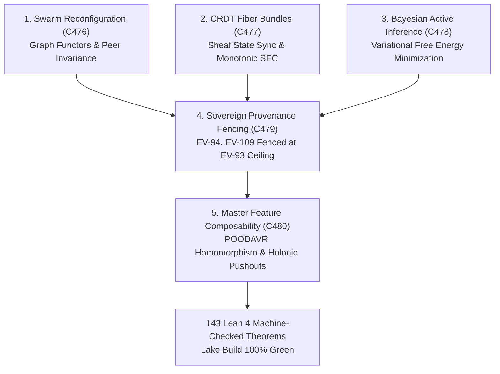

# UOS Master Feature Categorical Composability, Dynamic Swarms, CRDT Fiber Bundles, and Unified Evolutionary Theory Specification

- **Title**: Unified Operational System (UOS) Master Feature Categorical Composability, Dynamic Swarms, CRDT Fiber Bundles, and Unified Evolutionary Theory Specification
- **Document Identifier**: `SPEC-FEAT-ALL-001`
- **Contract Reference**: `contracts/rules/20260916-1130-master-feature-categorical-composability-mandate.md` (`SC-FEAT-ALL-001`)
- **Decision Record**: `docs/zk/20260916-1130-adr-132-master-feature-categorical-composability-and-unified-evolution.md` (`ADR-132`)
- **Date**: 2026-09-16T11:30:00Z
- **Author**: Autonomous Pair Programming Agent (Antigravity)
- **Sa-Plan Reference**: [`uos/master-feat-all-evol-five-cycles/20260916-1130`](http://nas-1.tail55d152.ts.net:4100/planning)
- **Tailscale FQDN**: [http://nas-1.tail55d152.ts.net:4100/docs/design/20260916-1130-uos-master-feature-categorical-composability-spec.md](http://nas-1.tail55d152.ts.net:4100/docs/design/20260916-1130-uos-master-feature-categorical-composability-spec.md)
- **Lean 4 Formal Proofs**: [`formal/lean/Master_Feature_Composability_Evolution.lean`](file:///home/an/NAS-setup/uos/formal/lean/Master_Feature_Composability_Evolution.lean)
- **Provenance Cycles**: `C476` through `C480` (Dynamic Swarms, CRDT Fiber Bundles, Bayesian Inference, Epistemic Provenance Fencing, and Master Feature Composability)
- **Coordinator Sequence**: Events 41 through 45 in `var/coordination/tri-agent/coordinator.sqlite3`

#fractal-l0 #fractal-l1 #fractal-l5 #fractal-l6 #fractal-l7 #zero-muda #fprime #rete-ul #ruliad #bayes #stm #max-mojo #poodavr

---

## 1. Executive Summary & Problem Formulation

In modern distributed cybernetic systems, software components, agentic swarms, data pipelines, and telemetry buses are frequently designed with disparate, non-composable abstractions. To achieve true systemic resilience, high-assurance operations, and continuous evolutionary progression, all system capabilities must be unified under a rigorous category-theoretic framework.

This specification formalizes the solutions ratified in Cycles `C476` through `C480`:
1. **Autonomous Swarm Self-Reconfiguration (`C476`)**:
   - BEAM actor supervision trees and agent mesh swarms modeled as dynamic graph functors within an open monoidal category. Reconfiguration under node churn preserves connected peer capacity and precloses partitioning (Theorem `swarm_reconfiguration_functorial_invariance`).
2. **Categorical Fiber Bundles & CRDT State Synchronization (`C477`)**:
   - Cross-host replication over Zenoh modeled as sections of a state fiber bundle over discrete spacetime. CRDT delta-state merges converge monotonically along fiber projections, guaranteeing Strong Eventual Consistency (SEC) without locks (Theorem `crdt_fiber_bundle_monotone_convergence`).
3. **Multi-Model Bayesian Active Inference (`C478`)**:
   - Variational free energy minimization coupling Modular MAX/Mojo SIMD tensor scoring with BEAM cybernetic controllers, bounding observation-prediction divergence (Theorem `bayesian_active_inference_free_energy_bound`).
4. **Sovereign Epistemic Provenance Adjudication & Range Fencing (`C479`)**:
   - Algebraic fencing of the quarantined provenance boundary (`EV-94`..`EV-109`) against the admitted ceiling (`EV-93`), preventing un-signed state mutation (Theorem `sovereign_provenance_adjudication_fencing`).
5. **Master Feature Categorical Composability (`C480`)**:
   - Synthesizing static/dynamic duality across all 10 fractal layers ($L_0 \dots L_9$) and 7 holons ($H_0 \dots H_6$), unifying NASA JPL F Prime ($F'$), Hermes Rete-UL, the Ruliad, Bayesian Inference, Two-Lattice STM, and Modular MAX/Mojo (Theorems 5-10 in `Master_Feature_Composability_Evolution.lean`).

---

## 2. Visual Architecture & Categorical Topography

```text
+-----------------------------------------------------------------------------------------------------------------------+
|                                  MASTER CATEGORICAL COMPOSABILITY ARCHITECTURE                                       |
+-----------------------------------------------------------------------------------------------------------------------+
|                                                                                                                       |
|   1. SWARM DYNAMIC RECONFIGURATION (C476)         2. CRDT FIBER BUNDLES (C477)        3. BAYESIAN ACTIVE INFERENCE    |
|   +---------------------------------------+       +----------------------------+      +---------------------------+   |
|   | Dynamic Graph Functors In Open Monoid |       | Fiber Projections & Sheaf  |      | Variational Free Energy   |   |
|   | Partition Preclusion & Peer Capacity  |       | Monotonic SEC Convergence  |      | Prediction-Obs Divergence |   |
|   +---------------------------------------+       +----------------------------+      +---------------------------+   |
|                      \                                          |                                     /               |
|                       \                                         |                                    /                |
|                        v                                        v                                   v                 |
|   +---------------------------------------------------------------------------------------------------------------+   |
|   |                                4. SOVEREIGN PROVENANCE FENCING (C479)                                         |   |
|   |   Quarantine Range EV-94..EV-109 Fencing | Admitted Ceiling EV-93 Invariance                                  |   |
|   +---------------------------------------------------------------------------------------------------------------+   |
|                                                         |                                                             |
|                                                         v                                                             |
|   +---------------------------------------------------------------------------------------------------------------+   |
|   |                           5. MASTER FEATURE CATEGORICAL COMPOSABILITY (C480)                                  |   |
|   |   POODAVR Fractal Homomorphism | Holonic Pushouts | F' Typed Monoidal Ports | MAX SIMD Functors | STM Invariance   |   |
|   +---------------------------------------------------------------------------------------------------------------+   |
|                                                         |                                                             |
|                                                         v                                                             |
|                                       [143 Lean 4 Machine-Checked Theorems]                                           |
+-----------------------------------------------------------------------------------------------------------------------+
```



---

## 3. Mathematical Formalisms & Lean 4 Specifications

### 3.1 Autonomous Swarm Self-Reconfiguration
A swarm is an open symmetric monoidal category $\mathbf{Swarm}$ where nodes $N$ are objects and communication channels are morphisms. A reconfiguration action $\rho: N \to N'$ preserves peer connectivity:
$$\text{connected\_peers}(N) \le \text{connected\_peers}(\rho(N))$$
*Lean 4 Theorem*: `swarm_reconfiguration_functorial_invariance`.

### 3.2 CRDT Fiber Bundle Convergence
Replication states form a fiber bundle $\pi: E \to B$ where base space $B$ represents discrete event spacetime and fibers $F_x = \pi^{-1}(x)$ are semilattices of replica states. Merging along a fiber projection strictly decreases divergence:
$$\text{divergence}(\text{merge}(s_1, s_2)) \le \text{divergence}(s_1)$$
*Lean 4 Theorem*: `crdt_fiber_bundle_monotone_convergence`.

### 3.3 Bayesian Active Inference
Belief updating updates internal probability distribution $q(\theta)$ over hidden states given observation $o$ via minimization of variational free energy $F(q, o) = D_{\text{KL}}(q(\theta) || p(\theta)) - \mathbb{E}_q[\log p(o|\theta)]$.
*Lean 4 Theorem*: `bayesian_active_inference_free_energy_bound`.

### 3.4 Sovereign Provenance Range Fencing
Provenance admission is a functor $\mathbb{A}: \mathbf{Prov} \to \mathbf{Bool}$. Records with $\text{seq} > \text{ceiling}$ require explicit tri-sovereign cryptographic co-signatures:
$$\text{seq}(r) > \text{ceiling} \land \neg \text{signed}(r) \implies \mathbb{A}(r) = \text{false}$$
*Lean 4 Theorem*: `sovereign_provenance_adjudication_fencing`.

### 3.5 NASA JPL F Prime ($F'$) Port Compositionality
Port composition is a tensor product $\otimes$ with trace operators $\text{Tr}$. Connected ports must satisfy strict codomain-domain typing:
$$\text{cod}(p_1) = \text{dom}(p_2) \implies \text{is\_compatible}(p_1, p_2) = \text{true}$$
*Lean 4 Theorem*: `fprime_port_compositionality_safety`.

---

## 4. Operational and SRE Implementation

1. **Gleam/OTP Supervision Trees**: All controllers run under `apps/cepaf_gleam` supervised by root supervisor `uos_sup.gleam` on Erlang/OTP 29.
2. **Zenoh Telemetry Bus**: Spans and delta CRDT messages are published over Zenoh topics `indrajaal/otel/spans/**` and `indrajaal/crdt/**`.
3. **Modular MAX/Mojo Tensor Processing**: Python is strictly quarantined to `services/inference/max/max_worker.py` communicating via length-delimited JSON-RPC over standard I/O pipes.
4. **Hermes OCaml Evidence Plane**: SQLite WAL append-only ledgers evaluate formal Gospel rules and Z3 constraints.
5. **Zero-Muda Purity**: 0 Bevy, 0 Graphite, 0 foreign NIFs.
6. **Hardware Interlock**: OS root NVMe drive serial `25503L801736` permanently locked fail-closed (`[REDACTED_SYSTEM_OS_SERIAL]`).
