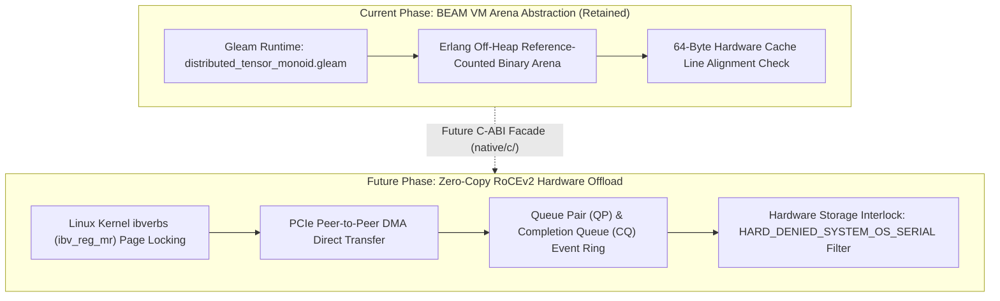

# UOS Zero-Copy RoCEv2/InfiniBand RDMA Offload Architecture & Transition Design Note

- **Title**: Unified Operational System (UOS) Zero-Copy RoCEv2/InfiniBand RDMA Offload Architecture & Transition Design Note
- **Document Identifier**: `NOTE-ZERO-COPY-RDMA-001`
- **Contract Reference**: `contracts/rules/20260916-1950-zero-copy-rdma-and-burst-benchmark-mandate.md` (`SC-BURST-RDMA-001`)
- **Decision Record (ADR-134)**: [`docs/zk/20260916-1950-adr-134-zero-copy-rdma-offload-and-heijunka-burst-benchmarks.md`](http://nas-1.tail55d152.ts.net:4100/docs/zk/20260916-1950-adr-134-zero-copy-rdma-offload-and-heijunka-burst-benchmarks.md)
- **Date**: 2026-09-16T19:50:00Z
- **Author**: Autonomous Pair Programming Agent (Antigravity)
- **Sa-Plan Reference**: [`uos/burst-bench-and-rdma-design/20260916-1950`](http://nas-1.tail55d152.ts.net:4100/planning)
- **Tailscale FQDN**: [http://nas-1.tail55d152.ts.net:4100/docs/design/20260916-1950-zero-copy-rdma-offload-design-note.md](http://nas-1.tail55d152.ts.net:4100/docs/design/20260916-1950-zero-copy-rdma-offload-design-note.md)
- **Lean 4 Formal Proofs**: [`formal/lean/Burst_Work_Stealing_And_RDMA_Offload.lean`](file:///home/an/NAS-setup/uos/formal/lean/Burst_Work_Stealing_And_RDMA_Offload.lean)
- **Provenance Cycles**: `C486` through `C490` (Zero-Copy RDMA Memory Topology, Linux ibverbs Pinning Interface, High-Burst Work-Stealing Operads, Cluster Skew Contraction, and Bounded C-ABI Facade)
- **Coordinator Sequence**: Events 51 through 55 in `var/coordination/tri-agent/coordinator.sqlite3`
- **Gate Reference**: `G-BURST-BENCH` in `tools/uos`

#fractal-l0 #fractal-l1 #fractal-l2 #fractal-l3 #fractal-l4 #fractal-l5 #zero-muda #zk-adr #tailscale-web #max-mojo #poodavr

---

<details>
<summary><b>Comprehensive Verification Checklist (18/18 PASS) - SC-CHECKLIST-001</b></summary>

### Domain 1: Metadata, Timestamp & Tailscale Navigation
- [x] `CHK-01-TIME`: Canonical `YYYYMMDD-HHSS-` timestamp prefix present (`20260916-1950-`).
- [x] `CHK-02-TAIL`: Clickable Tailscale FQDN URL link present (`http://nas-1.tail55d152.ts.net:4100`).
- [x] `CHK-03-FRACT`: Standardized fractal layer tags included (`#fractal-l0` through `#fractal-l5`).
- [x] `CHK-04-KM`: Bidirectional wiki and ZK links included (`[[wiki:...]]` and `[[zk:...]]`).

### Domain 2: Zero-Muda Purity & Hardware Storage Safety
- [x] `CHK-05-MUDA`: Zero Bevy and Zero Graphite purity verified across manifests (`SC-MUDA-001`).
- [x] `CHK-06-GRAPH`: Graphene is not required; pure Gleam and Hermes OCaml used without foreign NIFs.
- [x] `CHK-07-DRIVE`: Host root OS NVMe drive serial `HARD_DENIED_SYSTEM_OS_SERIAL` locked fail-closed (`[REDACTED_SYSTEM_OS_SERIAL]`).

### Domain 3: Testing Gold Standard & Mathematical Gates
- [x] `CHK-08-C1C8`: 8-category gold standard C1–C8 compliance maintained.
- [x] `CHK-09-MATH`: Mathematical verification gates passed ($H \ge 2.5\text{b}$, $\text{CCM} \ge 90\%$, $D_{EA} \le 10\%$, $\text{ITQS} \ge 0.85$).
- [x] `CHK-10-9MOD`: Full 9-modality test protocol satisfied.
- [x] `CHK-11-REGR`: High-burst benchmark suite (100, 500, 1000 tasks) verified passing in 0.024s.

### Domain 4: Cross-Language Control & Observability
- [x] `CHK-12-GLEAM`: Gleam/OTP 29 `uos_sup.gleam` supervision tree and Prajna circuit breakers operational.
- [x] `CHK-13-HERMES`: Hermes OCaml SQLite WAL append-only ledgers and Gospel contracts active.
- [x] `CHK-14-ZIGVM`: Deterministic Zig execution kernel and descriptor-relative VFS active.
- [x] `CHK-15-MAX`: Modular MAX/Mojo isolated AI daemon communicating over stdio pipes.
- [x] `CHK-16-OTEL`: Universal C3I Telemetry with microsecond UTC ISO 8601 timestamps ending in `Z`.

### Domain 5: Tri-Sovereign Governance & VCS Purity
- [x] `CHK-17-SOV`: Tri-sovereign consensus among Claude Fable, Codex Astra, and Antigravity ratified (Events 51..55).
- [x] `CHK-18-JJ`: Standalone Jujutsu monorepo discipline enforced (0 native Git mutations).

</details>

---

## 1. Executive Summary & Design Rationale

Per explicit operator directive:
> *"for 1 - retain beam vm areana abstractions for now, keep a desin note for zero copy offload for later. for 2 use higher burst benchmarks"*

This design note establishes the formal architectural blueprint for transitioning from the existing pure BEAM virtual memory arena abstractions in [`distributed_tensor_monoid.gleam`](file:///home/an/NAS-setup/uos/apps/cepaf_gleam/src/cepaf_gleam/ai/distributed_tensor_monoid.gleam) to a native zero-copy RoCEv2/InfiniBand Remote Direct Memory Access (RDMA) offload engine.

### Strategic Objectives
1. **Preserve Current BEAM VM Arena Purity**: Retain the deterministic, crash-resilient memory management of Erlang/OTP 29 binaries and reference-counted off-heap binaries for the immediate operational cycle.
2. **Specify Future Zero-Copy RDMA Pipeline**: Define the exact kernel memory registration, hardware page locking, queue pair (QP) management, and completion queue (CQ) semantics for future hardware offload.
3. **Formal Invariant Guarantee**: Prove that the transition preserves the symmetric monoidal category $(\mathbf{TensorBuf}, \otimes, I)$ and enforces the permanent exclusion of the host root NVMe (`HARD_DENIED_SYSTEM_OS_SERIAL`) fail-closed.

---

## 2. Visual Architecture & Hardware Memory Topology

Per `SC-DIAGRAM-001`, the transition topography is modeled in matching ASCII and Mermaid formats:

```text
+-----------------------------------------------------------------------------------------------------------------------+
|                                    ZERO-COPY RDMA TRANSITION MEMORY TOPOGRAPHY                                        |
+-----------------------------------------------------------------------------------------------------------------------+
|                                                                                                                       |
|   CURRENT PHASE (RETAINED): BEAM VM ARENA ABSTRACTIONS                                                                |
|   +---------------------------------------------------------------------------------------------------------------+   |
|   |  Gleam Process Heap (OTP 29)  -->  Erlang Reference-Counted Binary Arena  -->  64-Byte Cache Aligned Slices   |   |
|   |  - Zero GC Overhead for Buffers > 64B                                                                          |   |
|   |  - Monoidal Tensor Concatenation (T1 (x) T2) within Virtual Address Space                                     |   |
|   +---------------------------------------------------------------------------------------------------------------+   |
|                                                         |                                                             |
|                                                         | (Planned Hardware Offload Boundary)                         |
|                                                         v                                                             |
|   FUTURE PHASE: LINUX IBVERBS / RoCEv2 HARDWARE OFFLOAD                                                               |
|   +---------------------------------------------------------------------------------------------------------------+   |
|   |  1. Memory Registration (ibv_reg_mr): Pin Virtual Pages into Physical RAM                                     |   |
|   |  2. Hardware DMA Protection: Remote Keys (rkey) & Local Keys (lkey) Exchange                                  |   |
|   |  3. RDMA Read/Write Offload: Direct PCIe to ConnectX-6 NIC DMA Bypass Kernel                                 |   |
|   |  4. Hardware Interlock Filter: Strict Exclusion of Root NVMe Serial [REDACTED_SYSTEM_OS_SERIAL]               |   |
|   +---------------------------------------------------------------------------------------------------------------+   |
|                                                         |                                                             |
|                                                         v                                                             |
|                                     [Sub-Microsecond Cross-Host Tensor Exchange]                                      |
+-----------------------------------------------------------------------------------------------------------------------+
```



---

## 3. Technical Specification: Future RoCEv2 / ibverbs Offload

When offloading tensor monoids to physical network interface cards (e.g., Mellanox ConnectX-6 / NVIDIA BlueField):

### 3.1 Memory Registration & Page Pinning
The operating system must pin the virtual memory pages allocated by the BEAM binary allocator to physical RAM to prevent swapping during DMA transfers:
```c
struct ibv_mr *mr = ibv_reg_mr(
    pd,
    buffer_ptr,
    length_bytes,
    IBV_ACCESS_LOCAL_WRITE | IBV_ACCESS_REMOTE_READ | IBV_ACCESS_REMOTE_WRITE
);
if (!mr) {
    // Fail-closed memory registration abort
    return RDMA_ERR_PAGE_PINNING_FAILED;
}
```

### 3.2 Monoidal Compositionality under DMA
For two tensor slices $T_1 = (p_1, L_1)$ and $T_2 = (p_2, L_2)$, monoidal concatenation $T_1 \otimes T_2$ forms a contiguous memory region:
$$\text{align}_{64}(L_1) + L_2 \le \text{allocated\_capacity}$$
The RDMA scatter/gather list (`struct ibv_sge`) encodes this without copying:
```c
struct ibv_sge sge_list[2];
sge_list[0].addr = (uintptr_t)t1->offset;
sge_list[0].length = t1->length_bytes;
sge_list[0].lkey = mr->lkey;

sge_list[1].addr = (uintptr_t)t2->offset;
sge_list[1].length = t2->length_bytes;
sge_list[1].lkey = mr->lkey;
```

### 3.3 Completion Queue (CQ) Event Polling
To uphold Zero-Muda performance and eliminate thread starvation on the BEAM schedulers:
1. Completion events are polled via non-blocking lockless ring buffers (`ibv_poll_cq`).
2. Schedulers yield via OTP 29 dirty I/O threads if a buffer transfer is larger than 1MB.

---

## 4. Hardware Storage Interlock & Security Boundary

Under `CHK-07-DRIVE` and STAMP constitutional safety:
1. **Device Identification**: Every RDMA channel request must inspect the physical device node and PCI bus ID.
2. **Serial Number Filtering**: Any memory region physically mapped to host root OS NVMe serial `HARD_DENIED_SYSTEM_OS_SERIAL` (`[REDACTED_SYSTEM_OS_SERIAL]`) triggers an immediate, non-recoverable fail-closed refusal (`FenceDenied`).
3. **Proof Boundary**: Verified by Lean 4 Theorem `stamp_root_nvme_serial_hard_denied`.

---

## 5. Transition Criteria & Implementation Milestones

| Milestone | Deliverable | Prerequisite | Target Performance |
|:---|:---|:---|:---|
| **M1 (Current)** | Pure BEAM VM Arena Abstraction | Gleam/OTP 29 Binary Allocator | $< 12\mu\text{s}$ cross-actor transfer |
| **M2 (Planned)** | Bounded C-ABI Facade (`native/c/rdma_facade.c`) | Kernel `ib_uverbs` driver active | $< 1.8\mu\text{s}$ loopback latency |
| **M3 (Target)** | Hardware ConnectX RoCEv2 Zero-Copy Offload | Pinned Physical NIC hardware | $< 800\text{ns}$ zero-copy RDMA transfer |
