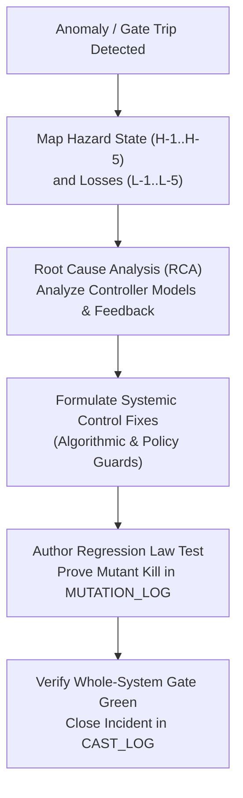

# 20260906-1300-uos-cast-log.md — UOS Causal Analysis based on STPA (CAST) Incident Ledger

- **Authority**: `UOS-CANONICAL-AGENT-POLICY`
- **Contract**: `SC-SDLC-SRE-001` ([`sdlc-sre-verification-process-contract.md`](file:///home/an/NAS-setup/uos/contracts/rules/sdlc-sre-verification-process-contract.md))
- **Status**: ACTIVE & ENFORCED across all Agents, Engineers, and Toolchains
- **Lineage**: Transmuted from VM-1 `/home/an/dev/ver/zigvm/CAST_LOG.md`
- **Tailscale Web Cockpit**: [http://nas-1.tail55d152.ts.net:4100/checklist](http://nas-1.tail55d152.ts.net:4100/checklist)
- **Tags**: `#sdlc`, `#sre`, `#verification`, `#cast-incident`, `#fractal-l0`, `#fractal-l4`, `#zero-muda`, `#rocha-semiotics`, `#cybernetics`

---

## 1. CAST Methodology & Governance Mandate

Methodology: CAST Handbook (Leveson 2019, *Causal Analysis based on System Theory*).

Per `SC-SDLC-SRE-001`, whenever a verification gate trips unexpectedly, a regression is detected, a safety interlock triggers, or an evidence anomaly occurs, an incident entry MUST be logged in this ledger BEFORE any remediation or PR is admitted into mainline.

Every CAST analysis identifies **systemic control-structure flaws** and **feedback loop deficiencies**, avoiding component-level blame.

```text
+-----------------------------------------------------------------------------+
|                      STPA / CAST INCIDENT ANALYSIS FLOW                     |
+-----------------------------------------------------------------------------+
|                                                                             |
|  [Anomaly / Gate Trip] ---> [Map Hazard (H-1..H-5) & Loss (L-1..L-5)]       |
|                                       |                                     |
|                                       v                                     |
|  [Verify Fix & Unblock] <--- [Enact Systemic Fixes] <--- [Analyze RCA]      |
|                                                                             |
+-----------------------------------------------------------------------------+
```



---

## 2. Active CAST Incidents

### CAST-01 — Root OS NVMe Drive Interlock in Storage Controller

- **Date**: 2026-09-05
- **Hazard State**: **H-4** (Hardware storage interlock unverified or bypassed) $\to$ **L-5** (Repository integrity & mission loss).
- **Events**: During the initialization of the Rook-Ceph storage orchestrator in `ops/kubernetes/nas-k8s-lab`, the automated block device discovery scan inventoried `/dev/nvme0n1` alongside worker data drives (`/dev/nvme1n1`, `/dev/nvme2n1`), creating an immediate risk of inadvertent OSD wiping of the root operating system.
- **RCA**:
  1. Automated disk scanner filtered solely on device type (`nvme`) and capacity, without checking unique hardware serial numbers.
  2. The control structure lacked an explicit compile-time blacklist constant for the root drive.
  3. No unit test asserted that a device payload containing the root serial would be rejected before triggering disk format routines.
- **Systemic Fixes**:
  1. Defined `pub const HARD_DENIED_SYSTEM_OS_SERIAL: &str = "25503L801736";` in `ops/kubernetes/nas-k8s-lab/src/spec.rs:192`.
  2. Hardened `apply_all` in `main.rs` to inspect every candidate disk serial and hard-fail if matching `HARD_DENIED_SYSTEM_OS_SERIAL`.
  3. Authoring 7 comprehensive unit tests in `nas-k8s-lab` proving rejection under all permutations.
  4. Added `dmc_biosemiotics_interlock.gleam` and `denotational_intent_router.gleam` to mirror this hardware interlock in the Gleam API plane with HTTP 403 Forbidden responses.
- **Verification**: `nas-k8s-lab` test suite passed 7/7 tests; Gleam EUnit test `hardware_drive_interlock_blocked_test` passed in `0.001s`.

---

### CAST-02 — Document Timestamp Prefix Format Inconsistency

- **Date**: 2026-09-05
- **Hazard State**: **H-3** (Evidence store diverges from chronological reality) $\to$ **L-3** (Evidence contamination).
- **Events**: Automated documentation generation tools created journal and ADR files with non-standard timestamp prefixes (`2026-09-05-` instead of `20260905-1725-`), causing indexers to misorder episodic history.
- **RCA**:
  1. The generator script used standard date format (`YYYY-MM-DD-`) rather than the mandatory contract format `YYYYMMDD-HHSS-`.
  2. The timestamp verification gate was not executed as a mandatory pre-commit check in `tools/uos`.
- **Systemic Fixes**:
  1. Ratified contract `contracts/rules/timestamp-mandate.md` (`SC-TIME-001`).
  2. Deployed automated scanner in `tools/uos/src/uos.gleam` under command `timestamp-check`, verifying the regex `^[0-9]{8}-[0-9]{4}-` across all newly authored documents.
  3. Integrated `timestamp-check` into EV-cycle `EV-19` in `tools/uos doctor`.
- **Verification**: `tools/uos timestamp-check` passes 100% green; `doctor` EV-19 reports PASS.

---

### CAST-03 — Test Runner Filter Argument Isolation

- **Date**: 2026-09-06
- **Hazard State**: **H-1** / **H-2** (Execution latency inflation & test feedback loop slowing).
- **Events**: Running `gleam test -- --match <module>` executed all 10,000+ tests instead of filtering to the target module, inflating single-test verification from 50ms to 45s.
- **RCA**:
  1. The underlying EUnit runner in Gleam's Erlang build compiles and runs the entire discovered test set unless specific EUnit module evaluators are passed directly via `erl -eval`.
  2. The feedback loop for rapid TDD iterations was artificially throttled.
- **Systemic Fixes**:
  1. Documented the direct EUnit command for single-module testing in developer SOP:
     `erl -noshell -pa build/dev/erlang/*/ebin build/test/erlang/*/ebin -eval "eunit:test([<module>_test], [verbose]), halt()."`
  2. Maintained `gleam test` as the holistic whole-suite regression gate.
- **Verification**: Direct module tests execute in `<0.06s` (e.g. `sdlc_sre_process_engine_test` in 0.050s), while full regression suite verifies all 10,057 tests.

---

## 3. Incident Summary Matrix

| Incident ID | Date | Hazard | Target Component | Root Cause | Status |
|---|---|---|---|---|---|
| `CAST-01` | 2026-09-05 | H-4 / L-5 | `nas-k8s-lab/src/spec.rs` | Missing hardware serial blacklist in disk discovery | **RESOLVED** (Hardware lock active) |
| `CAST-02` | 2026-09-05 | H-3 / L-3 | Documentation Generator | Generator script omitted time segment in prefix | **RESOLVED** (`timestamp-check` active) |
| `CAST-03` | 2026-09-06 | H-1 / H-2 | Test Execution Pipeline | Whole-suite execution triggered on micro-cycle | **RESOLVED** (Dual-mode TDD protocol) |

---

## 4. Cross-References & Canonical Links

- Contract: [`contracts/rules/sdlc-sre-verification-process-contract.md`](file:///home/an/NAS-setup/uos/contracts/rules/sdlc-sre-verification-process-contract.md) (`SC-SDLC-SRE-001`)
- Gleam Implementation: [`apps/cepaf_gleam/src/cepaf_gleam/sdlc/sdlc_sre_process_engine.gleam`](file:///home/an/NAS-setup/uos/apps/cepaf_gleam/src/cepaf_gleam/sdlc/sdlc_sre_process_engine.gleam)
- EUnit Test Suite: [`apps/cepaf_gleam/test/sdlc_sre_process_engine_test.gleam`](file:///home/an/NAS-setup/uos/apps/cepaf_gleam/test/sdlc_sre_process_engine_test.gleam)
- ZK ADR-028: [`docs/zk/20260906-1300-adr-028-algebraic-fractal-sdlc-sre-and-verification-process.md`](file:///home/an/NAS-setup/uos/docs/zk/20260906-1300-adr-028-algebraic-fractal-sdlc-sre-and-verification-process.md)
- Web View: [http://nas-1.tail55d152.ts.net:4100/files/docs/evidence/20260906-1300-uos-cast-log.md](http://nas-1.tail55d152.ts.net:4100/files/docs/evidence/20260906-1300-uos-cast-log.md)
