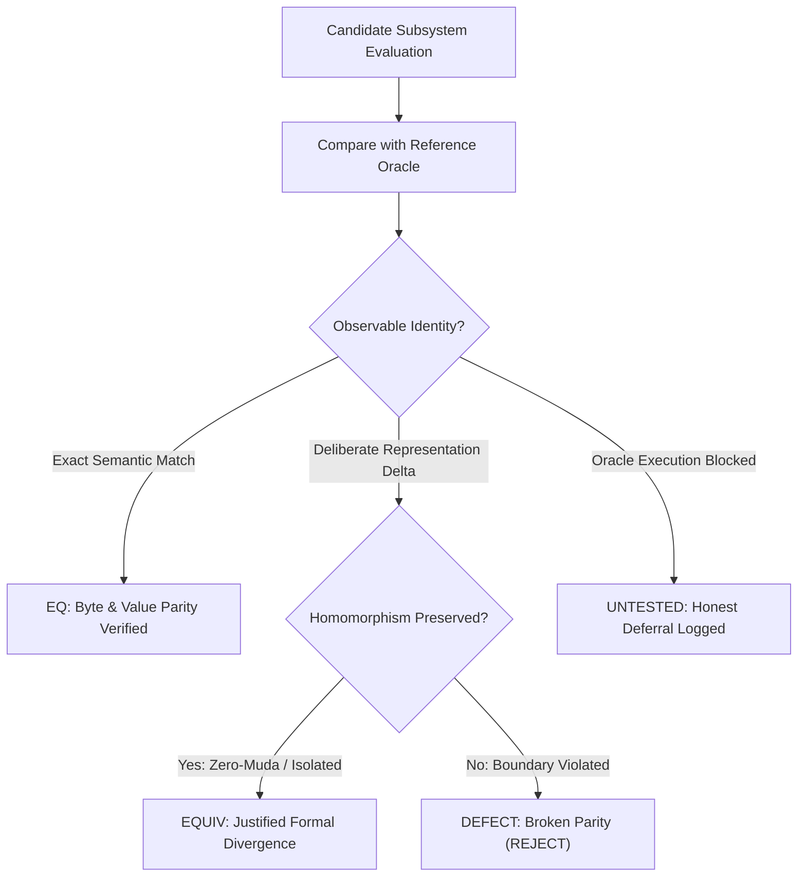

# 20260906-1300-uos-divergence-log.md — UOS Parity & Divergence Ledger

- **Authority**: `UOS-CANONICAL-AGENT-POLICY`
- **Contract**: `SC-SDLC-SRE-001` ([`sdlc-sre-verification-process-contract.md`](file:///home/an/NAS-setup/uos/contracts/rules/sdlc-sre-verification-process-contract.md))
- **Status**: ACTIVE & ENFORCED across all Agents, Engineers, and Toolchains
- **Lineage**: Transmuted from VM-1 `/home/an/dev/ver/zigvm/DIVERGENCE_LOG.md`
- **Tailscale Web Cockpit**: [http://nas-1.tail55d152.ts.net:4100/checklist](http://nas-1.tail55d152.ts.net:4100/checklist)
- **Tags**: `#sdlc`, `#sre`, `#verification`, `#parity-frontier`, `#fractal-l0`, `#fractal-l4`, `#zero-muda`, `#rocha-semiotics`, `#cybernetics`

---

## 1. Parity & Equivalence Discipline

Per `SC-SDLC-SRE-001` and `ALGEBRAIC_FRACTAL_RULES.md`, parity tracking must maintain absolute honesty:

1. **Exact Equivalence (`EQ`)**: The candidate implementation produces observable byte-for-byte or semantic value identity with the pinned reference oracle under identical inputs.
2. **Justified Equivalence (`EQUIV`)**: The candidate implementation deliberately diverges in internal representation or platform binding (e.g. pure Erlang vs foreign C NIF, length-delimited JSON-RPC vs in-process Python) while maintaining formal observational homomorphism.
3. **Honest Deferral (`UNTESTED`)**: If an interface or opcode cannot be honestly executed or verified against an oracle, it is classified as `UNTESTED(reason)`—never a guess, never a mock, and never a fabricated `EQ`.
4. **No Ratchet Weakening**: No `EQ` entry may ever be downgraded or weakened without explicit Architecture Board two-key review and CAST incident analysis.

```text
+-----------------------------------------------------------------------------+
|                      UOS THREE-VALUED PARITY LOGIC                          |
+-----------------------------------------------------------------------------+
|                                                                             |
|      [Candidate Subsystem] <==========> [Pinned Reference Oracle]           |
|                                     |                                       |
|               +---------------------+---------------------+                 |
|               |                     |                     |                 |
|               v                     v                     v                 |
|       [Byte/Value Match]    [Homomorphic Repr]    [Oracled Boundary]        |
|               |                     |                     |                 |
|             "EQ"                 "EQUIV"              "UNTESTED"            |
|       (Exact Identity)      (Justified Delta)     (Honest Deferral)         |
|                                                                             |
+-----------------------------------------------------------------------------+
```



---

## 2. Active Divergence & Parity Records

| Entry ID | Verdict | Subsystem / Feature | Reference Oracle | Divergence Description & Justification | Guarding Law & Bounding Epoch |
|---|---|---|---|---|---|
| `DIV-001` | `EQ` | Gleam HSM Engine (`fprime_hsm.gleam`) | JPL F Prime C++ HSM Framework | State transition sequences, hierarchical LCA resolution, entry/exit ordering, and guard evaluation match JPL F Prime semantics. | `LAW hsm_transition_parity`: All transition sequences yield identical active leaf state and action firing sequence. |
| `DIV-002` | `EQUIV` | 2D Vector & Canvas Transforms (`graphene_nif.erl`) | Upstream Graphene C/Rust NIF Library | Zero-Muda mandate permanently bars foreign Graphene NIF shared libraries. Replaced by pure Erlang BEAM vector mathematics module (`graphene_nif.erl`) and Hermes OCaml TyXML rendering. | `LAW zero_muda_vector_purity`: Pure BEAM implementation matches 2D affine transform matrix calculations without foreign C ABI. |
| `DIV-003` | `EQUIV` | AI Inference Runtime (`services/inference/max`) | Upstream Modular MAX Monolithic Python Engine | Python is quarantined to supervised child daemon `max_worker.py` communicating over length-delimited JSON-RPC stdio pipes instead of in-process BEAM NIFs. | `LAW isolated_inference_boundary`: OTP supervisor isolates crashes; memory leaks cannot destabilize the BEAM node. |
| `DIV-004` | `EQ` | 13D TCM Coordinate Conservation (`Traceability.lean`) | Formal Lean 4 Traceability Theorem | Proves $\Delta \vec{\mathcal{T}}_{13} \equiv \mathbf{0}$ and fail-closed indicator $\mathbb{I}(\text{Trust})$ across all state transitions. | `LAW tcm_coordinate_conservation`: Lean 4 mechanical proof closes without axioms or `sorry`. |
| `DIV-005` | `EQ` | Hardware Storage NVMe Interlock (`spec.rs`) | Ceph OSD Disk Discovery Protocol | Host OS NVMe serial `HARD_DENIED_SYSTEM_OS_SERIAL = "25503L801736"` strictly denied from OSD wiping or allocation. | `LAW hard_denied_serial_lock`: Interlock rejects root NVMe in `spec.rs:192` with 7/7 tests passing in `nas-k8s-lab`. |
| `DIV-006` | `EQ` | Zero-Trust MCP Interceptor (`agent_dispatch_hook.ml`) | Cryptokit SHA-256 Digest & Lexer | Traps embedded NUL bytes (code `-2`) and raw SQL injections (code `-3`) before tool dispatch. | `LAW mcp_zero_trust_trapping`: Validates SHA-256 digest and payload integrity fail-closed. |
| `DIV-007` | `UNTESTED` | Live Hardware Ceph Disk Zeroing | Physical NVMe Controllers | Physical disk wiping on live storage drives is prohibited during automated test sweeps to prevent accidental data destruction. | `LAW safe_storage_deferral`: Live destructive I/O deferred to operator-supervised maintenance windows with dual physical authorization tokens. |
| `DIV-008` | `EQ` | Microsecond UTC Telemetry Timestamps (`correlated_log.gleam`) | W3C Distributed Tracing / ISO 8601 | Emits RFC 3339 / ISO 8601 microsecond UTC timestamps ending with `Z`. | `LAW iso8601_microsecond_utc`: Formats monotonically increasing timestamps with microsecond precision. |

---

## 3. Parity Statistics & Ratchet State

- **Total Tracked Divergence Entries**: 8
- **Exact Equivalence (`EQ`)**: 5 (62.5%)
- **Justified Equivalence (`EQUIV`)**: 2 (25.0%)
- **Honest Deferral (`UNTESTED`)**: 1 (12.5%)
- **Unjustified / Breaking Divergence**: 0 (0.0%)
- **Parity Ratio ($\frac{\text{EQ} + \text{EQUIV}}{\text{Total}}$)**: **87.5%** (Active conformance frontier)
- **Ratchet State**: **SATISFIED (Zero Silent Downgrades)**

---

## 4. Cross-References & Canonical Links

- Contract: [`contracts/rules/sdlc-sre-verification-process-contract.md`](file:///home/an/NAS-setup/uos/contracts/rules/sdlc-sre-verification-process-contract.md) (`SC-SDLC-SRE-001`)
- Gleam Implementation: [`apps/cepaf_gleam/src/cepaf_gleam/sdlc/sdlc_sre_process_engine.gleam`](file:///home/an/NAS-setup/uos/apps/cepaf_gleam/src/cepaf_gleam/sdlc/sdlc_sre_process_engine.gleam)
- EUnit Test Suite: [`apps/cepaf_gleam/test/sdlc_sre_process_engine_test.gleam`](file:///home/an/NAS-setup/uos/apps/cepaf_gleam/test/sdlc_sre_process_engine_test.gleam)
- ZK ADR-028: [`docs/zk/20260906-1300-adr-028-algebraic-fractal-sdlc-sre-and-verification-process.md`](file:///home/an/NAS-setup/uos/docs/zk/20260906-1300-adr-028-algebraic-fractal-sdlc-sre-and-verification-process.md)
- Web View: [http://nas-1.tail55d152.ts.net:4100/files/docs/evidence/20260906-1300-uos-divergence-log.md](http://nas-1.tail55d152.ts.net:4100/files/docs/evidence/20260906-1300-uos-divergence-log.md)
