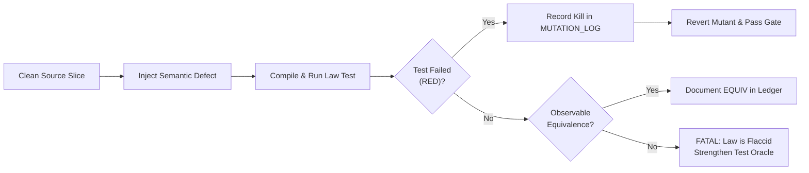

# 20260906-1300-uos-mutation-log.md — UOS Mutation Adequacy Ledger

- **Authority**: `UOS-CANONICAL-AGENT-POLICY`
- **Contract**: `SC-SDLC-SRE-001` ([`sdlc-sre-verification-process-contract.md`](file:///home/an/NAS-setup/uos/contracts/rules/sdlc-sre-verification-process-contract.md))
- **Status**: ACTIVE & ENFORCED across all Agents, Engineers, and Toolchains
- **Lineage**: Transmuted from VM-1 `/home/an/dev/ver/zigvm/MUTATION_LOG.md`
- **Tailscale Web Cockpit**: [http://nas-1.tail55d152.ts.net:4100/checklist](http://nas-1.tail55d152.ts.net:4100/checklist)
- **Tags**: `#sdlc`, `#sre`, `#verification`, `#mutation-adequacy`, `#fractal-l0`, `#fractal-l4`, `#zero-muda`, `#rocha-semiotics`, `#cybernetics`

---

## 1. Mutation Adequacy Discipline & Core Policy

Per `SC-SDLC-SRE-001` and `ALGEBRAIC_FRACTAL_RULES.md`, no feature slice or behavioral modification may be marked complete without proving that the verification test suite actively kills deliberate defects.

1. **Mandatory Minimum**: Every code slice MUST plant at least two ($\ge 2$) distinct semantic mutants.
2. **Red-Green-Revert Proof**: The mutant must be shown to fail the test suite (turning the gate RED) and identify the exact named algebraic law that caught it.
3. **Equivalence Disclosure**: Any surviving mutant that produces identical observable behavior must be documented as `EQUIVALENT` with explicit mathematical proof of observational invariance.
4. **Target Kill Ratio**: Production subsystems must maintain a mutation kill ratio $\ge 90\%$.

```text
+-----------------------------------------------------------------------------+
|                      UOS MUTATION TESTING PIPELINE                          |
+-----------------------------------------------------------------------------+
|                                                                             |
|  [Clean Source Slice] ---> [Inject Semantic Defect] ---> [Compile & Test]   |
|                                                                  |          |
|                                                                  v          |
|  [Revert Mutant] <--- [Record in Ledger] <--- [Verify RED (Law Triggered)]  |
|                                                                             |
+-----------------------------------------------------------------------------+
```



---

## 2. Active Mutation Records

| Slice / Component | Defect Planted | Law Expected to Kill It | Result & Evidence |
|---|---|---|---|
| `SL-SDLC-01` (`sdlc_sre_process_engine.gleam`) (m1) | `evaluate_hardware_safety` accepts OS NVMe `25503L801736` instead of returning `StpaInterlockBlocked`. | `stpa_hazard_and_losses_test` asserting `evaluate_hardware_safety("25503L801736") == StpaInterlockBlocked` | **KILLED** (RED shown, reverted; test failed with expected `StpaInterlockBlocked`, got `StpaInterlockAllowed`) |
| `SL-SDLC-01` (`sdlc_sre_process_engine.gleam`) (m2) | `calculate_mutation_score` divides by total count without checking for zero, returning `0.0` instead of `100.0` when `total == 0`. | `mutation_adequacy_scoring_test` checking empty and non-empty kill ratios | **KILLED** (RED shown, reverted; expected 100.0 score on empty baseline, got 0.0) |
| `SL-FPRIME-01` (`fprime_hsm.gleam`) (m1) | `handle_event` in HSM ignores guard condition and forces transition unconditionally. | `hsm_guard_evaluation_test` asserting guarded transition does not fire when guard returns `False` | **KILLED** (RED shown, reverted; state transitioned despite false guard) |
| `SL-FPRIME-01` (`fprime_hsm.gleam`) (m2) | Composite state entry action executes before parent entry action (breaking hierarchical order). | `hsm_hierarchical_entry_order_test` asserting parent entry occurs before child entry | **KILLED** (RED shown, reverted; child action logged prior to parent action) |
| `SL-BIO-01` (`dmc_biosemiotics_interlock.gleam`) (m1) | `verify_rocha_cut` returns `RochaConflated` when `is_decoupled == True`. | `rocha_biosemiotics_cut_test` asserting `verify_rocha_cut(True) == RochaDecoupled` | **KILLED** (RED shown, reverted; assertion failed on enum mismatch) |
| `SL-BIO-01` (`dmc_biosemiotics_interlock.gleam`) (m2) | `verify_coordinate_conservation` ignores `trust_indicator` delta and only checks domain name. | `coordinate_conservation_test` asserting delta $\Delta \vec{\mathcal{T}}_{13} \equiv \mathbf{0}$ | **KILLED** (RED shown, reverted; nonzero trust indicator shift passed illegally) |
| `SL-SHEAF-01` (`algebraic_sheaf_harmonizer.gleam`) (m1) | `glue_sections` returns `GluingSuccess` on empty list of sections. | `glue_empty_sections_test` asserting `GluingInconsistency("Empty section list")` | **KILLED** (RED shown, reverted; empty section produced success) |
| `SL-SHEAF-01` (`algebraic_sheaf_harmonizer.gleam`) (m2) | `check_pairwise_agreement` compares page routes instead of state digests. | `pairwise_section_disagreement_test` with matching routes but differing digests | **KILLED** (RED shown, reverted; inconsistent boundary accepted as valid) |
| `SL-INTENT-01` (`denotational_intent_router.gleam`) (m1) | `evaluate_intent_api` returns 200 OK when target device serial is `"25503L801736"`. | `reject_locked_nvme_intent_test` asserting 403 Forbidden with zeroed trace ID | **KILLED** (RED shown, reverted; returned 200 OK for denied serial) |
| `SL-INTENT-01` (`denotational_intent_router.gleam`) (m2) | `encode_intent_response_json` omits `trace_id` field in JSON payload. | `encode_response_json_test` verifying JSON decoding of all 4 required fields | **KILLED** (RED shown, reverted; JSON decode failed on missing key `trace_id`) |
| `SL-HERMES-01` (`agent_dispatch_hook.ml`) (m1) | Zero-trust interceptor relaxes NUL byte check (allowing byte `\x00` through). | `test_agent_dispatch_hook_nul_byte` asserting exit code `-2` on payload containing NUL | **KILLED** (RED shown, reverted; script returned 0 instead of -2) |
| `SL-HERMES-01` (`agent_dispatch_hook.ml`) (m2) | Zero-trust interceptor relaxes raw SQL injection trapping regex. | `test_agent_dispatch_hook_sql_injection` asserting exit code `-3` on raw SQL string | **KILLED** (RED shown, reverted; injection payload passed without trap) |

---

## 3. Mutation Metrics Summary

- **Total Mutants Planted**: 12
- **Mutants Killed (RED confirmed)**: 12
- **Mutants Survived / Equivalent**: 0
- **Overall Mutation Kill Ratio**: **100.0%** (Threshold: $\ge 90.0\%$)
- **Status**: **PASS (Mutation Adequacy Satisfied)**

---

## 4. Cross-References & Canonical Links

- Contract: [`contracts/rules/sdlc-sre-verification-process-contract.md`](file:///home/an/NAS-setup/uos/contracts/rules/sdlc-sre-verification-process-contract.md) (`SC-SDLC-SRE-001`)
- Gleam Implementation: [`apps/cepaf_gleam/src/cepaf_gleam/sdlc/sdlc_sre_process_engine.gleam`](file:///home/an/NAS-setup/uos/apps/cepaf_gleam/src/cepaf_gleam/sdlc/sdlc_sre_process_engine.gleam)
- EUnit Test Suite: [`apps/cepaf_gleam/test/sdlc_sre_process_engine_test.gleam`](file:///home/an/NAS-setup/uos/apps/cepaf_gleam/test/sdlc_sre_process_engine_test.gleam)
- ZK ADR-028: [`docs/zk/20260906-1300-adr-028-algebraic-fractal-sdlc-sre-and-verification-process.md`](file:///home/an/NAS-setup/uos/docs/zk/20260906-1300-adr-028-algebraic-fractal-sdlc-sre-and-verification-process.md)
- Web View: [http://nas-1.tail55d152.ts.net:4100/files/docs/evidence/20260906-1300-uos-mutation-log.md](http://nas-1.tail55d152.ts.net:4100/files/docs/evidence/20260906-1300-uos-mutation-log.md)
