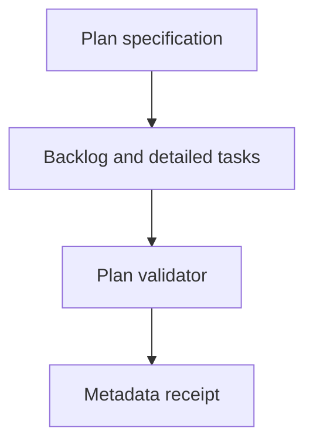

# 20260906-0817- Full UOS implementation planning journal

Generated from synchronized host observation 2026-09-06T08:04:17Z. This journal completes plan creation, not implementation or system admission.

[Master plan](http://nas-1.tail55d152.ts.net:4100/files/docs/design/20260906-0817-uos-full-implementation-plan.md) · [Backlog](http://nas-1.tail55d152.ts.net:4100/files/governance/planning/20260906-0817-uos-full-implementation-backlog.json) · [Plan receipt](http://nas-1.tail55d152.ts.net:4100/files/governance/sources/20260906-0817-uos-full-implementation-plan-receipt.json) · [Planning](http://nas-1.tail55d152.ts.net:4100/planning) · [Home](http://nas-1.tail55d152.ts.net:4100/)

#fractal-l0 #fractal-l1 #fractal-l2 #fractal-l3 #fractal-l4 #fractal-l5 #fractal-l6 #fractal-l7 #fractal-l8 #fractal-l9 #zk-adr #km-triad #zero-muda #tailscale-web

## 1. Scope & Trigger

The operator requested “create plan for full implementation” after accepting a unified AGY handover/specification. This work produces one master execution plan, eight subsystem plans, a machine-readable sixty-item backlog with thirty-five requirement mappings, and reproducible plan validation. The complete earlier requirement set remains controlling, including preserved OCaml, full DMC/TCM/atlas, FPP/SysML actors, all Zenoh features, four recursive browser cycles per page/component and truthful admission.

The writing-plans skill was applied with UOS timestamp/location/Jujutsu rules and inline execution defaults. Its generic Git/worktree/agent-choice examples do not override repository authority or trigger subagent execution. No subagents were dispatched.

## 2. Pre-State Assessment

The earlier handover contained seventeen coarse tasks and a targeted three-candidate Zenoh review. Existing inventories and scoped runtime receipts were available. Shared-workspace FPP, actor, intent, atlas, agent-role and evolutionary-cycle work had advanced; the current plan therefore reconciles actual files instead of recreating the old gap list.

Initial candidate: knnsqvkk 9fb22fe9; parent nursokmr f55f864c. Later observation: ozmsxutn 9bc0e8ec; parent kmtpzqlk 9a921cda with main bookmark created by another writer; not an admission performed by this plan.. Other writers' changes and bookmarks were preserved. No new runtime certification is inherited from their commit descriptions or certificates.

## 3. Execution Detail

Read the canonical agent policy, writing-plans skill, timestamp/DMC rules, handover specification and targeted current code. Checked host clock and chrony; the initial receipt reported Normal leap status and system time 0.000000003 seconds slow of NTP.

Created sixty work items across evidence/migration (8), semantics/atlas (8), models/actors (10), Zenoh (12), web/knowledge (9), verification (7), skills/agents/DX (3), release/admission (3). Each has explicit files, dependency/requirement mappings, a namespaced acceptance operation, concrete fixture/expected observations, implementation actions, replay interface and exit gate.

Added a complete requirement matrix, the earlier H01-H17 mapping, twenty-five dependency eligibility waves, a machine-derived dependency chain, conformance-parent decomposition, browser/artifact protocol, risk/cutover gates, exact existing package commands and proposed runner contract. The diagrams derive from one node/edge model.

```text
[P Plan specification] --> [B Backlog and detailed tasks]
[B Backlog and detailed tasks] --> [V Plan validator]
[V Plan validator] --> [R Metadata receipt]
```



## 4. Root Cause Analysis

The prior plan was intentionally a handover outline. It lacked execution-level file ownership, detailed test fixtures and complete dependency/requirement mapping. Concurrent implementation also changed the baseline, so a full plan needed explicit reconciliation before deciding what to create versus extend.

Targeted source inspection found remaining reasons to prioritize truthfulness and contracts: partial trace checks, fixed timestamps, caller-controlled overlap metadata, constant verification metrics and file-presence gates. These are source observations and proposed regression cases; this planning task did not execute their runtime counterexamples.

## 5. Fix Taxonomy

- Planning decomposition: master plus eight independently navigable detailed plans.
- Traceability: thirty-five requirements, all seventeen old tasks and sixteen Zenoh feature families mapped to concrete work.
- Verification design: strict acceptance fixture/observation separation, positive/negative controls and source/candidate-bound receipts.
- Governance: standalone Jujutsu, preserved external sources, timestamped artifacts, no invented signatures/admission.
- Continuity: handover/MOC links and a reusable metadata validator.

## 6. Patterns & Anti-Patterns Discovered

Useful patterns are current-source reconciliation, namespaced semantic domains, generated dependency/requirement views, independently observed tests, explicit conformance denominators and paired diagrams from one graph.

Avoid presenting export counts as performance, a queue data structure as a bounded BEAM mailbox, a model enum as a running actor, a fixed metric as measurement, a certificate label as a review signature, or a plan fixture as an executed test. Code-source observations are linked below rather than silently promoted to runtime failures or passes.

- apps/cepaf_gleam/src/cepaf_gleam/fpp/actor.gleam: Real actor.start exists; command handler updates modeled queue; verify drain/execution/ingress bounds and initialization failure semantics. Tasks: A05.
- apps/cepaf_gleam/src/cepaf_gleam/fpp/dmc_tcm.gleam: DMC also names memory coherence; Trace13 check covers only a subset; fixed canonical timestamp and calendar prefix remain in inspected source. Tasks: M01, M04, M05.
- apps/cepaf_gleam/src/cepaf_gleam/fpp/intent.gleam: Typed verbs exist; precondition and generated same-state traces do not establish actor/action/target authorization. Tasks: M02, M03.
- apps/cepaf_gleam/src/cepaf_gleam/fpp/algebraic_atlas.gleam: Restriction and merging code exist; caller-selected overlaps can omit conflicts; report preservation booleans remain constant. Tasks: M06, M07.
- apps/cepaf_gleam/src/cepaf_gleam/fpp/agent_factory.gleam: Agent records and callbacks exist with fixed timestamp strings; bind them to live subjects and clock evidence. Tasks: M05, A06.
- apps/cepaf_gleam/src/cepaf_gleam/fpp/evolutionary_cycles.gleam: Some alleged cycle verifications and quality metrics are constants; replace with actual observations and provenance. Tasks: E03, V05, V07.
- tools/uos/src/main.gleam: Some gates use file presence or unconditional pass; verify command process exit propagation. Tasks: E03.
- tools/uos/src/uos.gleam: main.execute returns an Int; entry point does not explicitly propagate it to OS exit in this source. Tasks: E03.
- docs/design/20260906-1015-uos-tri-sovereign-15-cycle-ratification-certificate.md: Historical/current author claims; not independent verification from this planning task. Tasks: E01, R02.
- docs/design/20260906-0955-uos-fprime-agent-architecture-spec.md: Additional agent architecture to reconcile with actual model/process/transport behavior. Tasks: A06, A09.
- apps/indrajaal_gleam_web/src/indrajaal_gleam_web.gleam: Real /fpp-topology, /fpp-atlas, /fpp-agents, /features, /knowledge-explorer, /zk-matrix and /zk-graph routes located; current responses serialize initial Lustre views. Verify actual hydration/event behavior. Tasks: W01, W08, V02.

## 7. Verification Matrix

| Check | Required plan evidence | Scope limitation |
|---|---|---|
| Backlog structure | Sixty unique task IDs and acceptance operation IDs, eight workstreams | Task specification, not task execution |
| Requirements | Thirty-five requirements all covered; no unknown IDs | Coverage of requested scope, not implementation coverage |
| Dependencies | No missing/cyclic dependencies; all tasks lead to R03 | Eligibility order, not staffing/calendar estimates |
| File ownership | Existing paths checked; proposed create/modify dependencies reconciled | No implementation files generated by this plan |
| Fixtures | Every detailed-plan JSON case equals its backlog case | Oracles specified; future adapters still require implementation |
| Diagrams | ASCII/Mermaid nodes, edges and labels match | Diagram parity does not prove runtime topology |
| Documentation | Timestamp prefixes, links and eighteen checkpoints per document; exact thirteen journal sections | Static document integrity, not four browser cycles |
| Source preservation | Compare selected original OCaml with prior receipt and record current source metadata | No external source/code/binary admission |
| HTTP document publication | Retrieve master/detail/backlog through Tailnet and inspect document markers | HTTP retrieval is not browser/UX certification |

The generated plan receipt is the authority for which metadata checks actually passed and their observed time/candidate. No historical system test suite was rerun solely to validate prose.

## 8. Files Modified

- docs/design/20260906-0817-uos-full-implementation-plan.md
- docs/design/20260906-0817-uos-implementation-01-evidence-and-migration.md
- docs/design/20260906-0817-uos-implementation-02-semantics-and-atlas.md
- docs/design/20260906-0817-uos-implementation-03-models-and-actors.md
- docs/design/20260906-0817-uos-implementation-04-zenoh-native-and-ecosystem.md
- docs/design/20260906-0817-uos-implementation-05-web-and-knowledge.md
- docs/design/20260906-0817-uos-implementation-06-verification-and-experience.md
- docs/design/20260906-0817-uos-implementation-07-skills-agents-and-dx.md
- docs/design/20260906-0817-uos-implementation-08-release-and-admission.md
- governance/planning/20260906-0817-uos-full-implementation-backlog.json
- docs/journal/20260906-0817-uos-full-implementation-planning-journal.md
- governance/sources/20260906-0817-uos-full-implementation-plan-receipt.json
- tools/validate_implementation_plan.ml
- HANDOVER_TO_CODEX.md
- docs/zk/moc-agent-handover.md

All implementation source/test filenames inside the backlog are proposed work destinations, not files changed by plan creation. The only executable authored in this phase is the OCaml plan validator.

## 9. Architectural Observations

The full implementation shares a pure denotational reference, typed authorization, actual trace/time/lease semantics and a provenance ledger. Existing model/actor/web code is extended through tests; the C3I-derived Zenoh layer owns application/domain communication with explicit browser/API and runtime-mechanics boundaries.

Full FPP/SysML/Zenoh claims require versioned clause/API/feature/target denominators. The plan does not reduce “full” to a convenient subset; unsupported or unavailable rows remain visible and block full admission. Source selection and benchmark conclusions remain contingent on actual corrected native execution.

## 10. Remaining Gaps

All sixty implementation work items remain PLANNED/UNRUN. Planned acceptance adapters, formal/native/browser fixtures, conformance leaf enumeration, full source close reading, user/field observations and release gates still need execution.

The workspace continues to change under other writers. E01 binds the actual execution candidate and supersedes stale baseline assumptions. Protected credential/home writes, external source quiescence, target hardware and deployment approval are handled only when the corresponding concrete task requires them; no permission was needed to create these plans.

## 11. Metrics Summary

- 1 master plan and 8 detailed subsystem plans.
- 60 dependency-linked work items with 60 concrete regression fixtures.
- 35 requested-scope requirements and 17 prior handover tasks mapped.
- 16 Zenoh feature families mapped; the exact API/flag/target census is a Z01 implementation obligation.
- 25 eligibility waves; these are not elapsed-time estimates.
- 21 explicit route seeds plus mandatory dynamic/protocol frontier discovery.
- 0 production implementation tasks claimed complete by this planning phase.
- 0 subagents dispatched, external sources modified, external binaries executed, deployments or third-party messages.

## 12. STAMP & Constitutional Alignment

The plan preserves single-writer/fenced authority, telemetry non-interference, the protected storage serial, read-only external evidence, solver/process bounds and language domains. STPA/FMEA tasks connect hazards/unsafe control actions to concrete observations and residual risk; fixed scores do not establish risk reduction.

Admission remains runtime AND formal evidence at the same candidate, with authentic review and complete required denominators. Deployment work is prepared with canary/rollback criteria before any required approval. Historical claims remain available as history.

## 13. Conclusion

The requested full implementation plan is delivered as an actionable linked package and machine-readable backlog. It preserves the complete mission, incorporates current-code findings and provides a concrete first sequence: E01 candidate reconciliation, E02 truthful acceptance harness, E03 verification repair, then source and semantic foundations.

Implementation completion, full browser coverage, native performance leadership and system admission are not asserted by this journal.

<details>
<summary>Five domains and eighteen verification checkpoints — plan status</summary>

| Domain | Checkpoint | Evidence or required gate |
|---|---|---|
| Metadata/navigation | CHK-01-TIME | Synchronized birth timestamp 2026-09-06T08:04:17Z; document prefix uses UTC hour and seconds. |
| Metadata/navigation | CHK-02-NAV | Full Tailnet document links; link validation is recorded separately from browser behavior. |
| Metadata/navigation | CHK-03-FRACT | All L0-L9 obligations mapped; implementation remains PLANNED. |
| Metadata/navigation | CHK-04-WIKI | Wiki/ZK/KM source and handover links retained. |
| Purity/storage | CHK-05-PURE | Gleam/OTP control, Hermes formal workers, Zig runtime; authorized C3I-derived bounded native transport. |
| Purity/storage | CHK-06-BANNED | No Bevy/Graphite ingestion authorized; provenance exclusions retained. |
| Purity/storage | CHK-07-STORAGE | Protected serial 25503L801736 remains denied; no physical destructive tests planned. |
| Testing/math | CHK-08-TEST | Concrete acceptance cases and TDD/BDD loop; none executed by writing this plan. |
| Testing/math | CHK-09-MATH | Compiler/formal/property/mutation tasks required; constants and labels do not prove laws. |
| Testing/math | CHK-10-BROWSER | Four final-candidate semantic cycles per page and component required; planning is not browser admission. |
| Testing/math | CHK-11-PARITY | External OCaml preserved; differential execution guarded and separately recorded. |
| Control/observability | CHK-12-GLEAM | Real actors already located; lifecycle and effect correspondence require verification. |
| Control/observability | CHK-13-HERMES | Bounded isolated solver/oracle workers; no direct observer writes. |
| Control/observability | CHK-14-ZIGVM | Read-only source evidence; deterministic Zig boundary preserved. |
| Control/observability | CHK-15-OTEL | Typed trace and receive/apply/commit evidence required across all domain edges. |
| Governance/Jujutsu | CHK-16-SOV | No independent signature or system admission invented. |
| Governance/Jujutsu | CHK-17-JJ | Standalone Jujutsu; concurrent work preserved; serialized integration. |
| Governance/Jujutsu | CHK-18-DOCS | Timestamped plans, machine backlog, thirteen-section journal and handover continuity. |

</details>


