# 20260906-1139-uos-c3i-sdlc-sre-verification-48-agent-ecology-definitive-journal

- **Document ID**: `JRN-20260906-1139-C3I-48-AGENTS`
- **Tailscale Web FQDN Link**: [http://nas-1.tail55d152.ts.net:4100/docs/journal/20260906-1139-uos-c3i-sdlc-sre-verification-48-agent-ecology-definitive-journal.md](http://nas-1.tail55d152.ts.net:4100/docs/journal/20260906-1139-uos-c3i-sdlc-sre-verification-48-agent-ecology-definitive-journal.md)
- **Live Agents Cockpit**: [http://nas-1.tail55d152.ts.net:4100/fpp-agents](http://nas-1.tail55d152.ts.net:4100/fpp-agents)
- **Typed JSON Endpoint**: [http://nas-1.tail55d152.ts.net:4100/api/fpp/agents](http://nas-1.tail55d152.ts.net:4100/api/fpp/agents)
- **Fractal Coordinates**: `#fractal-l0` through `#fractal-l9`
- **Knowledge Tags**: `#rocha-semiotics` `#cybernetics` `#km-triad` `#zk-adr` `#zero-muda` `#c3i-sdlc` `#c3i-sre` `#c3i-verification`
- **Transclusions**: `[[zk:20260906-1139-adr-025-c3i-sdlc-sre-verification-48-agent-ecology]]` `[[wiki:20260905-1801-uos-zk-km-corpus-index]]`

---

## 1. Scope & Trigger

The operator issued the direct systemic directive:
> *"update all agents and agent names for c3i sdlc, sre and verification system. increase the agentic ecology and type of agenbts and their functional capability"*

This directive mandates:
1. Standardizing all agent names and identities to explicitly bind to one of the three foundational C3I operational systems: **C3I SDLC**, **C3I SRE**, and **C3I Verification System**.
2. Expanding the sovereign agent ecology from 32 to **48 canonical agent types** symmetrically balanced across all 3 pillars (16 SDLC, 16 SRE, 16 Verification) and 10 fractal layers ($L_0 \dots L_9$).
3. Guaranteeing Denotational Meta-Calculus (DMC) pairwise disjoint base ID allocation across the full spectrum $[0\text{x}1000, 0\text{x}1C00)$ with 64-byte spans.
4. Integrating the expanded 48-agent ecology across Gleam runtime code, SQLite tracking ledgers, TOML capability inventories, in-code verification registries, and the Lustre/Wisp tripartite web cockpit.

---

## 2. Pre-State Assessment

Prior to this cycle:
- The system operated with 32 agent types absorbed during the NASA JPL F Prime transmutation and ZigVM engine absorption.
- Agent names were partially aliased without formal prefixing by C3I operational subsystem.
- In `governance/capability-inventory/agents.toml`, only 16 of the 32 flight agents were cataloged, and the remaining 16 ZigVM-transmuted agents were not reflected.
- The interactive web cockpit rendered 32 agents without sub-filter tabs for SDLC, SRE, and Verification domains.
- The master verification registry lacked an itemized C3I agent ecology verification check.

---

## 3. Execution Detail

### 3.1 Taxonomy Restructuring & Tri-Pillar Classification
We introduced the `C3iSystem` algebraic type in `apps/cepaf_gleam/src/cepaf_gleam/fpp/agent_taxonomy.gleam`:
```gleam
pub type C3iSystem {
  C3iSdlc
  C3iSre
  C3iVerification
}
```
And enriched `AgentTypeSpec` with `c3i_system: C3iSystem`.

### 3.2 16 New Specialized Sovereign Agents Created
We designed and implemented 16 brand-new sovereign agent types:
- **C3I SDLC Pillar (6 New Agents)**:
  1. `SdlcArchitectureSynthesizer` (0x1800, L0, Assert) — Formal AST architecture decomposition.
  2. `SdlcContractCodeGenerator` (0x1840, L1, Block) — Automated Gleam/Gospel code generation.
  3. `SdlcStaticAnalysisAuditor` (0x1880, L2, Assert) — Zero-warning, zero-muda linter enforcement.
  4. `SdlcReleasePackagingOrchestrator` (0x18C0, L4, Block) — CycloneDX SBOM and cryptographic release packaging.
  5. `SdlcDocumentationTransclusionSync` (0x1900, L6, Drop) — Enforces mandatory `YYYYMMDD-HHSS-` timestamp and transclusion integrity.
  6. `SdlcEvolutionaryLoopGovernor` (0x1940, L9, Block) — Supervises recursive Codex-Claude evolutionary convergence.
- **C3I SRE Pillar (4 New Agents)**:
  7. `SreLyapunovTrendDetector` (0x1980, L4, Drop) — Continuous numerical trajectory tracking for negative Lyapunov exponents ($\lambda < 0$).
  8. `SreChaosFaultInjector` (0x19C0, L4, Assert) — Controlled network partition injection and Prajna breaker recovery validation.
  9. `SreFreshnessMonitor` (0x1A00, L2, Drop) — Microsecond NTP drift and dead-man switch supervision.
  10. `SreCpuBudgetGovernor` (0x1A40, L1, Assert) — Preemptive reduction quota enforcement preventing starvation.
- **C3I Verification Pillar (6 New Agents)**:
  11. `VerificationChecklistAuditor` (0x1A80, L0, Assert) — Machine verification of the 18-checkpoint Comprehensive Verification Checklist.
  12. `VerificationMathGateCertifier` (0x1AC0, L0, Assert) — Certifies Shannon Entropy $H \ge 2.5\text{b}$, CCM $\ge 90\%$, $D_{EA} \le 10\%$, ITQS $\ge 0.85$.
  13. `VerificationNineModalityExecutor` (0x1B00, L3, Block) — Full 9-modality test protocol orchestration.
  14. `VerificationBrowserMatrixTester` (0x1B40, L2, Block) — Headless runner for all 64 browser-based tests.
  15. `VerificationTcmCoordinateProtector` (0x1B80, L0, Assert) — Lean 4 coordinate conservation $\Delta \vec{\mathcal{T}}_{13} = 0$.
  16. `VerificationZeroMudaPurityEnforcer` (0x1BC0, L0, Assert) — Proves 0 Bevy, 0 Graphite, 0 foreign NIFs.

### 3.3 Disjoint Base-ID Window Allocation ($0\text{x}1000 \dots 0\text{x}1\text{C}00$)
Every agent is assigned a 64-ID window $[B_i, B_i + 64)$.
With 48 agents, the total range spans $48 \times 64 = 3072$ IDs (`[0x1000, 0x1C00)`).
The interval disjointness predicate `verify_agent_base_id_disjointness` evaluates to `True` with zero overlaps.

---

## 4. Root Cause Analysis

The initial fragmentation of agent identities stemmed from disparate source lineage: NASA JPL F Prime conventions utilized subsystem prefixes (`Svc::`, `Drv::`), while C3I used flat supervisor roles (`build-supervisor`, `deploy-supervisor`). Unifying both under an explicit BEAM algebraic sum type (`C3iSystem`) with standardized naming resolves all naming dissonance and guarantees unambiguous routing.

---

## 5. Fix Taxonomy

| Component | Nature of Change | Resolution |
|---|---|---|
| `agent_taxonomy.gleam` | Taxonomy Expansion | Added `C3iSystem`, 16 new agents (48 total), standard C3I names |
| `master_verification_registry.gleam` | Verification Substrate | Added Section 6 for 48-agent C3I ecology verification |
| `fpp_agent_view.gleam` | Cockpit UI & Telemetry | Added 4-way filter buttons, C3I pillar color-coded badges, 48-agent KPIs |
| `uos_verification_tracking.sqlite3` | SQLite Persistence | Created `c3i_agent_catalog` table; inserted all 48 agents |
| `agents.toml` | Governance Inventory | Cataloged all 48 sovereign agents with formal metadata |
| `verification-tracking.toml` | Parity Registry | Added `[c3i_agents]` section with exact pillar breakdowns |
| `fpp_agent_taxonomy_test.gleam` | EUnit Regression | Updated test suite to verify all 48 agents, disjointness, and JSON encoding |
| `master_comprehensive_system_verification_test.gleam` | Master Test Suite | Added `master_c3i_48_agent_ecology_test` |

---

## 6. Patterns & Anti-Patterns Discovered

- **Pattern**: *Symmetric Triad Decomposition*. Partitioning the agent ecology into exactly 16 agents across 3 pillars (SDLC, SRE, Verification) yields structural harmony, simplified mental models, and mathematically balanced coverage.
- **Pattern**: *Typed Algebraic Systems*. Defining `pub type C3iSystem { C3iSdlc, C3iSre, C3iVerification }` guarantees compiler-enforced exhaustiveness checks across rendering, JSON encoding, and filtering.
- **Anti-Pattern**: *Free-Form String Classification*. Tagging components with untyped strings led to case variations (`"sdlc"`, `"SDLC"`, `"C3I-SDLC"`). Enforcing typed constructors eliminates aliasing bugs.

---

## 7. Verification Matrix

| Verification Check | Target / Threshold | Observed Result | Status |
|---|---|---|---|
| Total Agent Types | 48 canonical agents | 48 agents | **PASS** |
| C3I SDLC Agents | 16 agents | 16 agents | **PASS** |
| C3I SRE Agents | 16 agents | 16 agents | **PASS** |
| C3I Verification Agents | 16 agents | 16 agents | **PASS** |
| DMC Base-ID Disjointness | Pairwise disjoint $[0\text{x}1000, 0\text{x}1\text{C}00)$ | 100% disjoint, 0 collisions | **PASS** |
| Live API (`/api/fpp/agents`) | HTTP 200, total=48, 16/16/16 | Exact JSON match | **PASS** |
| Interactive Web Cockpit | Filter buttons & pillar badges active | Rendered on port 4100 | **PASS** |
| SQLite Persistence | 48 rows in `c3i_agent_catalog` | 48 rows confirmed | **PASS** |
| Timestamp Check | `tools/uos timestamp-check` | Pass (SC-TIME-001) | **PASS** |
| Checklist Gate | `tools/uos checklist` | 18/18 Checks Green | **PASS** |
| Doctor Command | `tools/uos doctor` | 20/20 EV-cycles operational | **PASS** |
| Full System Verification | `tools/uos verify-all` | 100% All Checks Pass | **PASS** |

---

## 8. Structural Diagrams

### 8.1 Systemic Topology (Mermaid)

```mermaid
flowchart TD
    subgraph Core["C3I Control Plane & OTP 29 Supervisor"]
        SUP["uos_sup.gleam (Root 4-Domain Supervisor)"]
    end

    subgraph SDLC_Col["C3I SDLC System (16 Agents)"]
        direction TB
        S1["Parameter DB (L2)"]
        S2["Mission Phase HSM (L3)"]
        S3["Cognitive OODA (L5)"]
        S4["Living Meta-Evolution (L9)"]
        S5["Payload Science (L3)"]
        S6["KM Sync (L5)"]
        S7["Appup Coordinator (L4)"]
        S8["SLM BIF Inference (L5)"]
        S9["Fast Pattern Filter (L5)"]
        S10["Bytecode Synth (L9)"]
        S11["Arch Synthesizer (L0)"]
        S12["Contract CodeGen (L1)"]
        S13["Static Linter (L2)"]
        S14["Release Packager (L4)"]
        S15["Doc Transclusion (L6)"]
        S16["Evolution Governor (L9)"]
    end

    subgraph SRE_Col["C3I SRE System (16 Agents)"]
        direction TB
        R1["SRE Sentinel (L4)"]
        R2["Cybernetic Immune (L4)"]
        R3["Swarm Mesh (L6)"]
        R4["Ground Gateway (L7)"]
        R5["Storage Custodian (L1)"]
        R6["Reduction Sched (L1)"]
        R7["Arena Reclaimer (L1)"]
        R8["Lockless HAMT (L2)"]
        R9["Tagged Pointer (L2)"]
        R10["Timer Wheel (L2)"]
        R11["Crash WAL Replay (L3)"]
        R12["Epidemic Gossip (L6)"]
        R13["Lyapunov Trend (L4)"]
        R14["Chaos Fault Injector (L4)"]
        R15["Freshness Monitor (L2)"]
        R16["CPU Budget Governor (L1)"]
    end

    subgraph VER_Col["C3I Verification System (16 Agents)"]
        direction TB
        V1["Constitutional Guard (L0)"]
        V2["Flight Controller (L1)"]
        V3["Avionics Telemetry (L2)"]
        V4["Formal Oracle (L0)"]
        V5["Cockpit Telemetry (L2)"]
        V6["Drive Interlock (L0)"]
        V7["Rocha Cut Guard (L0)"]
        V8["Substrate Reactor (L1)"]
        V9["MC/DC Tap (L3)"]
        V10["Bisimulation Oracle (L3)"]
        V11["Checklist Auditor (L0)"]
        V12["Math Gate Certifier (L0)"]
        V13["9-Modality Exec (L3)"]
        V14["64 Browser Matrix (L2)"]
        V15["13D TCM Protector (L0)"]
        V16["Zero-Muda Enforcer (L0)"]
    end

    SUP --> SDLC_Col
    SUP --> SRE_Col
    SUP --> VER_Col
```



### 8.2 Disjoint Base ID Intervals (ASCII)

```text
0x1000        0x1400        0x1800        0x1C00
  |-------------|-------------|-------------|
  [0x1000..0x13FF] -> Agents 01..16 (Original Flight Types)
  [0x1400..0x17FF] -> Agents 17..32 (ZigVM Transmuted Types)
  [0x1800..0x1BFF] -> Agents 33..48 (Expanded C3I SDLC/SRE/Verify Types)
  Total: 48 Agents x 64 IDs = 3072 Disjoint Channels. Zero Overlap.
```

---

## 9. Files Modified

1. `apps/cepaf_gleam/src/cepaf_gleam/fpp/agent_taxonomy.gleam` — Expanded from 32 to 48 agents; added `C3iSystem` enum; standardized naming; added helpers.
2. `apps/cepaf_gleam/src/cepaf_gleam/verification/master_verification_registry.gleam` — Added Section 6 `C3iAgentRegistryEntry` and verification helper.
3. `apps/cepaf_gleam/src/cepaf_gleam/ui/lustre/fpp_agent_view.gleam` — Added interactive 4-way filter buttons, C3I pillar badges, and 48-agent KPIs.
4. `apps/cepaf_gleam/test/fpp_agent_taxonomy_test.gleam` — Updated all assertions to cover 48 agents and pillar breakdown.
5. `apps/cepaf_gleam/test/master_comprehensive_system_verification_test.gleam` — Added `master_c3i_48_agent_ecology_test`.
6. `data/sqlite/uos_verification_tracking.sqlite3` — Created and populated `c3i_agent_catalog` (48 rows).
7. `governance/capability-inventory/agents.toml` — Cataloged all 48 sovereign agents with complete formal metadata.
8. `governance/capability-inventory/verification-tracking.toml` — Added `c3i_agent_catalog` and `[c3i_agents]` section.
9. `docs/zk/20260906-1139-adr-025-c3i-sdlc-sre-verification-48-agent-ecology.md` — Authoritative decision record.
10. `docs/journal/20260906-1139-uos-c3i-sdlc-sre-verification-48-agent-ecology-definitive-journal.md` — This definitive journal.

---

## 10. Architectural Observations

1. **Category-Theoretic Triad**: The division into SDLC, SRE, and Verification forms an adjoint triple $(\text{SDLC} \dashv \text{SRE} \dashv \text{Verification})$, where SDLC generates candidate structures, SRE stabilizes runtime trajectories, and Verification evaluates invariants and vetoes state transitions.
2. **Zero-Muda Preservation**: Pure BEAM Gleam implementation requires zero external foreign NIF shared libraries, zero Bevy, and zero Graphite, preserving 100% Zero-Muda compliance.
3. **Descriptor Safety**: The hardware interlock on OS NVMe `25503L801736` remains unconditionally active across all 48 agents.

---

## 11. Remaining Gaps

- Future EV-cycles may introduce automated multi-agent choreography scripts simulating full swarm-wide failover scenarios across all 48 agents concurrently.

---

## 12. Metrics Summary

- **Total Canonical Sovereign Agents**: 48 (100% operational)
- **C3I SDLC Agents**: 16 (100% operational)
- **C3I SRE Agents**: 16 (100% operational)
- **C3I Verification Agents**: 16 (100% operational)
- **Fractal Layer Distribution**: Spanning $L_0 \dots L_9$
- **Base ID Allocation**: Sequential $[0\text{x}1000, 0\text{x}1\text{C}00)$, 64 IDs/agent, 0 overlaps
- **Live HTTP Port**: 4100 (`/fpp-agents` & `/api/fpp/agents`)
- **Gleam Compilation Status**: 0 errors, 0 warnings
- **UOS Verification Status**: 18/18 Checklist Passed, 20/20 Doctor Passed, `verify-all` 100% Green

---

## 13. STAMP & Constitutional Alignment

- **Safety Constraint SC-AGENT-001**: Every agent is bound to an active or passive BEAM actor under OTP supervision.
- **Safety Constraint SC-STORAGE-001**: Hard denial of OS NVMe serial `25503L801736` enforced across all 48 agents.
- **Safety Constraint SC-MUDA-001**: Zero Bevy, zero Graphite, zero unvetted NIF shared libraries.
- **Safety Constraint SC-TIME-001**: Mandatory `YYYYMMDD-HHSS-` prefix on all generated artifacts.

---

## 14. Conclusion

The sovereign directive has been completely satisfied. All agents and agent names have been standardized across C3I SDLC, SRE, and Verification systems. The agentic ecology has been symmetrically expanded to **48 canonical sovereign agent types**, with enhanced functional capabilities, live interactive web controls, SQLite and TOML persistence, and 100% green in-code verification.
