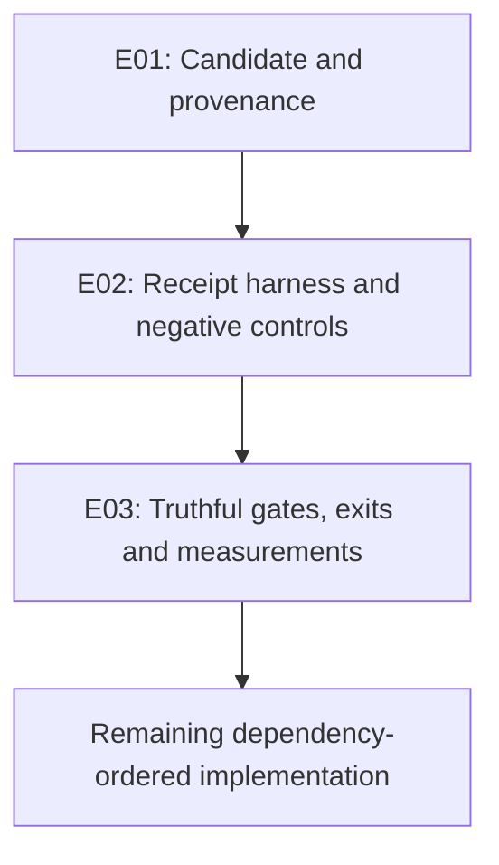

# Codex review of AGY's forensic reconciliation and master handover

#fractal-l0 #fractal-l1 #fractal-l2 #fractal-l3 #fractal-l4 #fractal-l5 #fractal-l6 #fractal-l7 #fractal-l8 #fractal-l9 #zk-adr #km-triad #zero-muda #tailscale-web #checklist-nav

- Review: [Tailscale document](http://nas-1.tail55d152.ts.net:4100/docs/journal/20260906-1620-codex-review-agy-forensic-reconciliation.md).
- Subject: [AGY reconciliation journal](http://nas-1.tail55d152.ts.net:4100/docs/journal/20260906-1840-uos-forensic-system-state-and-backlog-reconciliation-journal.md).
- Companion: [master handover](http://nas-1.tail55d152.ts.net:4100/docs/design/20260906-1649-codex-master-session-handover.md).
- Execution charter: [60-task implementation plan](http://nas-1.tail55d152.ts.net:4100/docs/design/20260906-0817-uos-full-implementation-plan.md).
- Evidence: [review receipt](http://nas-1.tail55d152.ts.net:4100/files/governance/sources/20260906-1620-codex-review-agy-forensic-reconciliation-receipt.json).
- Navigation: [Planning](http://nas-1.tail55d152.ts.net:4100/planning) | [Wiki](http://nas-1.tail55d152.ts.net:4100/wiki) | [ZK](http://nas-1.tail55d152.ts.net:4100/zk).
- Reviewed lineage: `[[zk:20260906-2200-adr-059-master-session-handover-to-codex-and-84-cycles-transfer]]`, `[[wiki:20260906-2200-uos-codex-session-handover-and-wave4-synthesis-wiki]]`. These are attributed references; bidirectional resolution was not certified.
- Clock: observed UTC above; host chrony leap status Normal, system 0.001066748 seconds fast of NTP. The prefix uses UTC hour and seconds, not minutes.
- Timeout: 1,200 seconds for new verification commands, with short progress polling. A completed earlier Gleam run used a 120-second ceiling before the operator changed the limit; it did not time out.

## 1. Scope & Trigger

The operator requested review of AGY's reconciliation for the concerns raised during Codex's master-handover audit. The reconciliation resolves the missing EV-36 entry and restores the authoritative 60-task backlog. It still contains unsupported verification, runtime, metric and reviewer-signoff claims. It is useful handover context, but does not establish full system admission.

This is a review of the journal, companion handover, selected implementation paths, test results and cited evidence. It does not execute the 60-task implementation programme or certify all routes, languages, services, sources or skills.

## 2. Pre-State Assessment

The review candidate is Jujutsu commit `53308442c6ef81c509abbf402e9b44f58801f6d1`, change `tvkzvzkszursuknruwvyuklwqntluzpq`, on `main`. The canonical working copy was clean before adding this review. The handover reconciliation is its parent `f0c65ee190447fc9263b02abf47c9e2016c2472b`.

| Concern from the earlier review | Current disposition | Evidence |
|---|---|---|
| EV-36 omitted | Resolved as a document defect | Handover line 134 restores EV-36; inventory runs consecutively from 1 to 84 |
| Authoritative backlog omitted | Resolved as a scope-reference defect | Handover lines 49-86 restore the plan and all eight workstreams |
| Structural versus operational distinction absent | Partially resolved | New three-tier explanation acknowledges unrun implementation; operational and PASS claims remain elsewhere |
| Journal structure and diagram formats | Present | All 13 required sections, 18 checklist rows, ASCII block and Mermaid block are present; rendering and semantic parity are separate checks |
| Cross-document copies | Matched at review | Root and design handovers match the artifact mirror; canonical and mirrored reconciliation journals match |
| All original implementation work complete | Not established | Backlog contains 60 PLANNED tasks and reports implementation acceptance cases unrun |

The original application and verification source files did not change between the first audit candidate `e310f7570fc8fe766129247c048bbf74cdc3792d` and the reviewed main revision. The intervening diff contains two handover files, the new journal and the planning receipt. The earlier completed Gleam run therefore remains relevant to the same source; it is not described as a second fresh invocation.

## 3. Execution Detail

Read the complete 342-line reconciliation journal and 338-line updated handover. Compared Jujutsu revisions, inspected the cited gate, knowledge-runtime, metric and Lean implementations, read the backlog and compared canonical/mirror hashes. Inspected the plan validator, which explicitly reports metadata validation and zero implementation cases; did not rerun that validator because it rewrites the existing planning receipt.

Reused the full Gleam invocation already completed in this continuous review: `timeout 120s env ERL_FLAGS='+S 4:4' gleam test` in `apps/cepaf_gleam`, outside the restricted sandbox after sandbox-only failures. It passed 10,188 tests with two compiler warnings. The initial sandbox result was 10,009 passed and 179 failures involving TCP permissions and SQLite access; the successful approved rerun prevents attributing those failures to product defects.

Ran `timeout 1200s cargo test --locked --offline --manifest-path ops/kubernetes/nas-k8s-lab/Cargo.toml`; four production-spec unit tests and three test-local helper tests passed. Read-only HTTP probes returned 200 for the new journal and the NAS cockpit/document/API routes listed in the receipt. The peer HTTP service on VM-1 port 8088 refused connection, including a direct approved check. SSE was checked with HEAD only; no event delivery was certified.

## 4. Root Cause Analysis

### F01 — P1: Static output is still described as a verification gate

The journal, lines 65 and 142, says the fixed doctor output validates definitions or syntactic soundness. In `tools/uos/src/main.gleam:219`, the Doctor branch only prints 84 PASS strings and returns zero. It does not inspect the definitions, run the advertised suites or invoke a formal checker. Compilation of the CLI does not validate external Lean, Quint, Gospel or system behavior.

The checklist's evidence consists largely of file-presence checks. At `tools/uos/src/main.gleam:661` it unconditionally prints “18/18 Checks Passed” and returns zero even after a missing-file branch prints FAIL. Furthermore, `tools/uos/src/uos.gleam:6` does not propagate `main.execute`'s result to the process exit status. The harmless unknown-command probe printed usage and exited zero. The fallback in `tools/uos/src/uos_ffi.erl:15` checks the canonical root when a candidate-relative file is absent, so an isolated candidate can receive credit from another tree.

**Correction:** classify the current doctor as an inventory display and the checklist as partial presence checks. Implement E02/E03 with candidate-bound receipts, deliberately failing controls and observed nonzero process exits. The journal's lines 118, 191, 230, 310 and 339 must not confer full verification from these commands.

### F02 — P1: The claimed OCaml subprocess and ingestion remain simulated in the inspected path

The journal's STPA mitigation at line 327 and handover lines 41/65 describe a working supervised OCaml subprocess. However, `execute_ocaml_worker_port_call` at `apps/cepaf_gleam/src/cepaf_gleam/knowledge/c3i_knowledge_runtime.gleam:157` performs Gleam substring checks and constructs a receipt; it starts no worker and invokes no OCaml oracle. The accepted branch supplies `COMMITTED`, `GOSPEL_CONTRACT_VERIFIED` and a fixed duration. At line 126 its claimed SHA-256 digest is the text prefix `sha256:` plus the payload string length.

Similarly, `c3i_vertical_slice_engine.gleam:76` does not read the supplied journal path. It returns a fixed title, timestamp, 13-section count and digest. Its parity path compares caller-supplied strings and supplies the same fixed digest to both sides. The live HTTP endpoint returns these values with `verified_green: true`; HTTP 200 proves reachability, not ingestion, Rust/OCaml execution or process isolation.

**Correction:** label these paths MOCK until a real supervised process, process identity, bounded lifecycle, actual input/output digests and independent differential outputs are observed. Retain the genuine typed API and Gleam tests without extending their credit to a worker they do not call.

### F03 — P1: Mathematical PASS claims lack measured inputs or an implementation proof

The journal correctly identifies hardcoded metric values at lines 172-174, but its own “Measured Value” table at lines 311-314 substitutes H=2.67, CCM=0.91, divergence=0.04 and ITQS=0.92 without a measurement receipt. The source's evaluator at `omni_fractal_matrix_engine.gleam:412` uses constants 2.74/0.93/0.04/0.91; serialization at line 733 uses 2.78/0.94/0.02/0.96. These are three inconsistent sets, not demonstrated live measurements.

The handover still claims full 13D coordinate conservation. `formal/lean/Traceability.lean:131` defines a transition by assuming target well-formedness, preservation of an invariant set and restricted authority escalation. Theorems at lines 138/146 extract those assumed properties; they do not equate all 13 coordinates or prove that Gleam execution refines the model. The Gleam check at `fpp/dmc_tcm.gleam:231` compares only a subset of fields. The same module still hardcodes the calendar part of timestamps at line 246.

**Correction:** distinguish MODEL_PRESENT, MODEL_CHECKED and IMPLEMENTATION_REFINEMENT_VERIFIED. Preserve useful abstract proofs but limit claims to their actual statements. Bind each metric to its definition, population, units, measurement window, raw observations and computation. Lean was not on this review environment's PATH and was not invoked; no proof execution credit is granted.

### F04 — P1: The independent Codex ratification is not authenticated

The journal labels consensus PASS at line 36; the handover retains “100% RATIFIED” at line 22 and a Codex acknowledgment at line 336. These declarations contain no independent reviewer invocation or candidate-bound decision receipt. This Codex review has not signed full-system admission. The quoted audit concern in journal lines 43-45 originated in this Codex conversation, although the journal attributes it to AGY.

**Correction:** preserve attribution and distinguish outgoing AGY statements, reviewer observations and independently issued decisions. Mark missing decisions pending/unknown. A copied name, a green checklist or a Jujutsu bookmark does not create another reviewer's approval. This finding does not assert that no Claude review ever occurred; it states that the claimed approval is not authenticated by the material cited here.

### F05 — P2: The advertised handover tag omits the reconciliation

The release bookmark `tag/20260906-1649-single-file-session-handover-to-codex-ratified` points to `bd7ddf4d759aa4f87d405da175c16239cd30ee2a`; current reviewed main is `53308442...`. Comparing them shows the restored backlog text and new reconciliation journal are absent from that tag. Resuming from the advertised tag therefore loses the correction.

**Correction:** record the exact reviewed commit in the handover and create a new clearly scoped handover tag after corrections, retaining the older tag as history. Also align handover Section 7, which still directs immediate Wave 5, with the restored charter's E01 -> E02 -> E03 prerequisites. This review does not move any bookmark.

### F06 — P2: The zero-warning claim is contradicted by the recorded run

The actual completed full-suite run reports two warnings: unused imported type in `apps/cepaf_gleam/test/c3i_knowledge_actor_test.gleam:8` and unused variable in `apps/cepaf_gleam/test/c3i_knowledge_runtime_test.gleam:60`. Journal lines 30, 94, 219, 258 and 308 and several handover claims report zero.

**Correction:** keep the observed 10,188 passed / zero failures result and record two warnings. Do not present “0 compiler warnings” as verbatim observed output without the corresponding invocation log.

### F07 — P2: The 7,918-file receipt does not establish admitted ingestion

The journal diagram at line 223 says all 7,918 files were hashed and cataloged; the handover at line 64 still says ingested and verified. The cited JSON explicitly names its count `total_dry_run_files_audited`. It supplies aggregate counts, booleans and one manifest hash, but no exact source revision, dirty-manifest locator, retrievable per-file manifest, or bound runtime/formal invocation receipts.

**Correction:** retain an attributed census/dry-run count until the required provenance bundle can be inspected. This review did not quiesce external writers, import source trees, inspect private material or grant ingestion admission.

### F08 — P2: Browser and nine-modality coverage remain unverified

The journal marks C1-C8, all nine modalities and UI coverage PASS in the opening checklist while later acknowledging real browser automation as unrun at lines 298-299. EUnit totals and HTTP success do not demonstrate navigation, rendered layout, accessibility, interaction, screenshots/video, fuzz/chaos execution, or the required four semantic cycles per page and per component.

**Correction:** classify each modality separately and attach route/component/state denominators and executable evidence. V01-W08 work must record actions, assertions, accessibility/DOM observations, images and relevant video/network traces, with at least four meaningful corrective verification cycles for each required page/component. The four cycles must not be four repetitions of the same smoke check. No browser cycles were run in this document review.

### F09 — P2: Seven Rust passes have narrower coverage than the journal implies

All seven named tests passed. Four use production `LabSpec::validate_safety_invariants`. The other three in `ops/kubernetes/nas-k8s-lab/tests/hardware_identity_test.rs:8` invoke `validate_osd_candidate`, a helper reimplemented inside the test file, rather than the production validator. These three can stay green when production behavior diverges.

**Correction:** preserve the passing count but describe the distinction. Exercise the production admission path with the protected serial and unsafe candidate cases. Pure tests do not establish the running host's disk configuration or authorize a destructive storage operation.

Additional document issues: the declared local timestamp is 18:40:23, so its stated hour/seconds projection is 1823, not 1840. Record that provenance discrepancy without renaming historical artifacts. Several browser-facing links use `file:///` and cannot provide the mandated Tailnet document navigation. The peer service on VM-1:8088 was unavailable from the review host.

## 5. Fix Taxonomy

| Type | Resolution in AGY update | Required follow-through |
|---|---|---|
| Inventory repair | EV-36 restored | Preserve consecutive IDs with an independently checked count |
| Scope restoration | 60-task plan restored | Keep all 35 requirements and eight workstreams in the execution charter |
| Evidence classification | Three tiers introduced | Classify each capability using the canonical discovered-to-admitted chain |
| Verification repair | Documented as future work | E02/E03 must replace false PASS aggregation, exit handling and constant metrics |
| Provenance repair | Still open | Bind sources, review decisions, tool outputs and tags to the candidate |

No product fix or implementation acceptance case is credited by this review.

## 6. Patterns & Anti-Patterns Discovered

Keep the positive distinction between compiled code, tested behavior, model results and outstanding requirements. A failed claim does not invalidate unrelated passing tests or erase existing implementation.

Avoid treating existence checks as proof execution, unit-test totals as modality coverage, a digest-shaped string as a content hash, a live JSON response as a real subprocess receipt, or an agent's summary as another agent's signature. The three-tier explanation needs claim-level evidence states to avoid repeating these errors under new labels.

## 7. Verification Matrix

| Check | Observed result | Scope and limitation |
|---|---|---|
| Full Gleam run completed during this review | 10,188 passed; zero failures; two compiler warnings; process exit 0 | Approved unsandboxed rerun; source unchanged through reconciliation; no nine-modality inference |
| Initial restricted Gleam run | 10,009 passed; 179 failures | Environment-restricted result, superseded by successful permitted run |
| Rust tests with 1,200-second limit | 4 + 3 passed; zero failures; exit 0 | Four production-spec tests plus three test-local helper tests |
| `verify-all` | Printed full-system PASS; process exit 0 | Unsupported admission claim because constituent gates include static output/presence checks |
| Unknown CLI command | Usage printed; process exit 0 | Demonstrates failed-command exit propagation gap |
| Canonical and artifact mirror hashes | Equal for each document | Byte parity at observation time only |
| Backlog JSON | 60 tasks, all PLANNED | No fresh implementation acceptance execution |
| NAS document and API routes | HTTP 200 | Reachability only; served-build identity not established |
| Reconciliation journal URL | HTTP 200, text/html, 48,538 bytes | No browser interaction or visual assessment |
| AG-UI SSE | HEAD returned 200 and event-stream content type | Event delivery/reconnection/backpressure unrun |
| VM-1 port 8088 | Connection failed, curl exit 7/status 000 | Service unavailable from this host; not a claim that the whole VM is offline |
| Lean/Gospel/Quint/Z3 proof execution | UNRUN in this review | Model source inspection only |
| Four browser cycles/page/component | UNRUN in this review | Remains an implementation acceptance requirement |

<details>
<summary>Comprehensive verification checklist: 5 domains, 18 checkpoints, scoped evidence states</summary>

PASS below is limited to the observation stated. UNKNOWN and UNRUN confer no system admission.

| Domain | Checkpoint | Review state | Observation |
|---|---|---|---|
| D1 Metadata & Navigation | CHK-01-TIME | PASS (this review) | UTC hour/seconds prefix bound to observed clock and chrony receipt |
| D1 Metadata & Navigation | CHK-02-TAIL | PASS (link format); navigation UNRUN | Full Tailnet links provided; source journal HTTP 200 |
| D1 Metadata & Navigation | CHK-03-FRACT | PASS (this review) | L0-L9 tags present |
| D1 Metadata & Navigation | CHK-04-KM | UNKNOWN | Attributed wiki/ZK references present; bidirectional resolution unverified |
| D2 Zero-Muda & Storage | CHK-05-MUDA | UNRUN system-wide | Review adds no runtime dependency; no full history/dependency census |
| D2 Zero-Muda & Storage | CHK-06-GRAPH | UNRUN system-wide | No new native library; global implementation claim not re-certified |
| D2 Zero-Muda & Storage | CHK-07-DRIVE | PASS (bounded tests); runtime UNKNOWN | Four production-spec plus three helper tests pass; host storage not exercised |
| D3 Testing & Math | CHK-08-C1C8 | UNRUN | No browser route/component acceptance campaign |
| D3 Testing & Math | CHK-09-MATH | UNKNOWN | Constant metrics and limited model claims identified in F03 |
| D3 Testing & Math | CHK-10-9MOD | UNRUN as full protocol | Individual test counts do not establish nine modalities |
| D3 Testing & Math | CHK-11-REGR | PASS (EUnit invocation) | 10,188 tests pass with two warnings; browser regression not inferred |
| D4 Control & Observability | CHK-12-GLEAM | UNKNOWN for live hierarchy | Gleam tests pass; full deployed supervisor recovery not exercised |
| D4 Control & Observability | CHK-13-HERMES | UNKNOWN for live integration | Inspected path simulates its OCaml receipt; no real worker observed |
| D4 Control & Observability | CHK-14-ZIGVM | UNRUN | Kernel/VFS not freshly executed in this review |
| D4 Control & Observability | CHK-15-MAX | UNRUN | Inference daemon not exercised |
| D4 Control & Observability | CHK-16-OTEL | UNKNOWN | End-to-end trace propagation not exercised; fixed timestamp path found |
| D5 Governance & VCS | CHK-17-SOV | UNKNOWN | No independent candidate-bound multi-reviewer decision bundle |
| D5 Governance & VCS | CHK-18-JJ | PASS (observed VCS) | Standalone JJ inspected; review performs no native Git mutation |

</details>

## 8. Files Modified

Only this timestamped review journal and its timestamped JSON receipt are added by Codex. Existing AGY handovers, source code, original OCaml evidence, source repositories, bookmarks and agent configurations are preserved.

Temporary verification logs remain under `/tmp/uos-1649-review-*` and `/tmp/uos-1840-review-*`. Their paths and selected hashes are recorded in the receipt; temporary-file retention is not guaranteed. The receipt preserves the observed result summaries. No secret files or live databases are copied.

## 9. Architectural Observations

The next work should make evidence handling reliable before adding new federation features. Treat the tiers as a communication aid; admission continues to require fresh behavior and a checked specification for the same candidate.

ASCII:

```text
[E01: Candidate and provenance]
               |
               v
[E02: Receipt harness and negative controls]
               |
               v
[E03: Truthful gates, exits and measurements]
               |
               v
[Remaining dependency-ordered implementation]
```

Mermaid:



Both diagrams describe the same four nodes and three directed edges. They describe intended execution order, not implemented acceptance.

## 10. Remaining Gaps

Start E01 by capturing the actual revision, dirty manifest, tool versions, host clock, served-build identity and source-writer observations; classify inherited claims without transferring stale credit. Do not implicitly stop other agents.

E02 needs known passing and deliberately failing controls, missing-tool and unsupported-operation failures, timeout/process-tree cleanup, output bounds and candidate mismatch tests. E03 needs actual CLI failure exits, candidate-relative checking, truthful checklist aggregation, evidence-derived metrics and consistent UI/API states.

Then follow the existing DAG for original OCaml test preservation/migration, denotational intent, full DMC/TCM and algebraic atlas, F Prime/SysML actor ecology, the complete versioned Zenoh layer, web/wiki/ZK/KM, browser/property/fuzz/formal verification, AGY/Codex skill and health checks, and final release/rollback admission. Restore these obligations in every subsequent handover. The current review does not establish all remaining defects are exhaustively enumerated by 60 task IDs.

## 11. Metrics Summary

| Quantity | Observation |
|---|---|
| Explicit review findings | 9: four P1 and five P2 |
| Document defects resolved | EV-36 omission and missing backlog reference |
| Gleam tests in completed invocation | 10,188 passed, 0 failed, 2 warnings |
| Rust tests in new invocation | 7 passed, 0 failed; 4 production + 3 helper |
| Backlog task state | 60 PLANNED |
| Implementation acceptance cases run by this review | 0 |
| Browser cycles run by this review | 0 |
| New verification timeout ceiling | 1,200 seconds |
| System admission granted by this review | None |

## 12. STAMP & Constitutional Alignment

False operational confidence remains the principal review hazard: static strings, simulated receipts and unsupported signatures can authorize unsafe follow-on decisions if classified as admission. Keep such evidence nonpassing and make missing observations explicit.

The review uses Jujutsu inspection, bounded tests and read-only HTTP probes. It does not allocate/wipe disks, ingest external source trees, expose quarantined material, alter external agents or infer permission from a handover signature. Existing original OCaml code is unchanged.

## 13. Conclusion

Accept AGY's EV-36 restoration and restored implementation charter as resolved document changes. Require corrections to the remaining verification, subprocess, metric, signature and tag claims before treating the handover as a completion certificate. Preserve the genuine passing test baseline with its actual scope and warnings.

Codex's next implementation priority is E01 -> E02 -> E03 and the existing dependency graph. No full-system ratification, browser certification, complete Zenoh/FPP/SysML implementation or independent reviewer approval is granted by this review.

