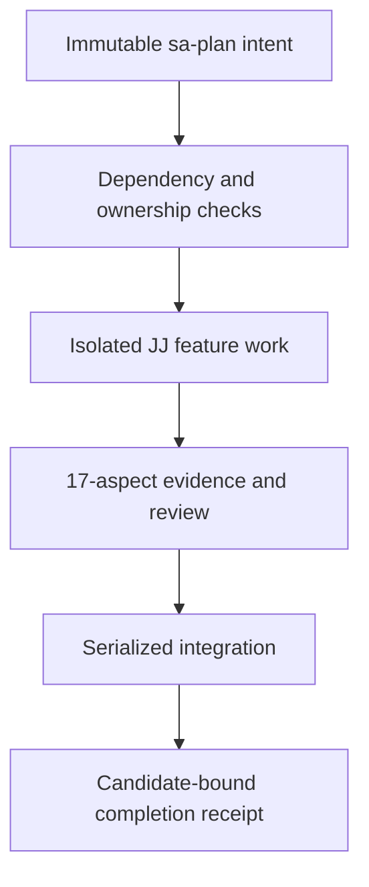

# UOS autonomous swarm execution journal

Status: EXECUTING; no system admission. Created from observed UTC 2026-09-06T18:38:03Z.

#fractal-l0 #fractal-l1 #fractal-l2 #fractal-l3 #fractal-l4 #fractal-l5 #fractal-l6 #fractal-l7 #fractal-l8 #fractal-l9 #zk-adr #km-triad #zero-muda #tailscale-web

[Execution overlay](http://nas-1.tail55d152.ts.net:4100/files/governance/planning/20260906-1803-uos-swarm-execution-overlay.json) | [Master plan](http://nas-1.tail55d152.ts.net:4100/files/docs/design/20260906-1655-uos-sa-plan-execution-plan.md) | [Task audit](http://nas-1.tail55d152.ts.net:4100/files/docs/design/20260906-1957-execution-audit-task-metadata.md) | [Planning cockpit](http://nas-1.tail55d152.ts.net:4100/planning)

## 1. Scope & Trigger

The operator authorized execution of the registered programme through completion, maximum available parallel agents, the 17-aspect cycle per feature, autonomous OODA, cheaper agents for routine processing, and full Jujutsu use. The scope remains 71 master tasks and 75 linked legacy tasks, including the already completed PLAN00 registration task. This journal records ongoing work; its presence is not a completion certificate.

## 2. Pre-State Assessment

At execution start `main` was `c5c048dda1facf4aafa1891659f001a2f4262320`; the root workspace was clean and E01 was the sole ready implementation task. The canonical Store contained 71 master tasks, 71 jobs and 13 open workflows. PLAN00 was completed; zero implementation tasks were complete. Host observations showed 24 CPUs, approximately 34.45 GB available memory, 17 GB free temporary storage and 854 GB free workspace storage. These are bootstrap observations, not an operational Resource_envelope receipt.

## 3. Execution Detail

Four dedicated workspaces were created from the planning candidate. Root coordinates integration; a Sol implementer handles E01, Terra implements the bounded tracker, and Luna performs routine task metadata/17-aspect mapping. Their S00-S03 support tasks and dedicated jobs were registered and claimed through native Store APIs before delegation. E01 was claimed in the master plan. S04 subsequently registered an independent review of incoming E01-E03 changes.

An elapsed host-tool approval wait outlasted initial leases. S00/S01/S03 were reclaimed explicitly; stale ownership was not used to complete work. The Store still reported one completed master task and zero completed implementation tasks after concurrent changes arrived.

S02 completed after coordinator verification of all four source digests, 71 exact task/file/dependency rows and 17 canonical names. S04 completed its independent review with a rejection receipt for incoming `6eadde49`; actual probes showed an ignored timeout, uncapped output, an unreaped background child (subsequently killed), fixture-alias admission and false CLI passes. [The review receipt](http://nas-1.tail55d152.ts.net:4100/files/governance/sources/20260906-2043-incoming-main-6eadde49-review-receipt.json) preserves those observations. S05 reviews the E01 repair independently. E01 and S01 remain under substantive code review, not completed based on initial test counts.

S06 reread nine primary references and recorded source-to-UOS technique mappings in the [research refresh](http://nas-1.tail55d152.ts.net:4100/files/governance/sources/20260906-1856-uos-primary-testing-research-refresh.json). These support later E05 adoption work: browser traces, rendering reference tests, Parsoid AST/DOM mutations, measured user experience, graph constraints, provenance and link validation. No upstream code or fixture bytes were imported; full per-file license and revision review remains open.

S07 completed read-only E02 contract and negative-control preparation. E01 round three passed 13 existing cases but a new closed-output descendant fixture proved that normal exit skipped process-group cleanup. S08 assigns a fresh stronger implementer to that fourth repair round. The tracker passed 19 scratch checks; S09 repairs the remaining separate hash/parse reads and FIFO-open boundedness before any live use. E01 was reclaimed as master attempt three after expiry. These additional repairs do not grant implementation credit.

E01 and tracker repairs were integrated at `88d07b35e80d3e81456cd89f693a39799e6abd6b`. Fresh coordinator verification passed 14 snapshot cases and 44 tracker scratch assertions. The exact E01 CLI fixture also passed its specified observations while the snapshot correctly retained `SNAPSHOT_CAPTURED_NONPASSING`, `STALE` inherited credit, and no signature/system admission. E01 completed in sa-plan from that reviewed receipt; E02 was claimed as attempt one. S11 implements the acceptance harness in an isolated workspace, with bounded module delegation permitted.

S10 verified all 36 checked-in corpus/catalogue part hashes and counts: 8,047 corpus records, 770 selected file records, and 161 OCaml file records. These are existing static inventories, not newly executed source tests. The OCaml JSON contains 1,479 raw site rows while an older narrative reports 1,478; uniqueness and registration reconciliation remains explicit E04 work. Root performed this preparation when additional agent threads were refused by actual tool capacity.

The reviewed foundation and receipts were merged to `main` at `05cfb07d3b9d5346c2b61fcbee740b3595cc6c1c`, preserving incoming ancestry. E02 delegated S12 process supervision; its owner handles S13 contracts after another thread allocation was refused. Coordinator review found that process-group emptiness alone cannot prove cleanup of descendants that create new sessions, and requested containment plus additional negative controls. S14 mapped the real E03 CLI/API/checklist paths. S15 authenticated to VM-1, confirmed no listener on8088, and identified the responding C3I process on4100; this does not complete N01 or identify its deployed candidate.

E02 was reclaimed as master attempt two after lease expiry. Its further review identified expectation-derived results, empty assertion objects, descriptor-read races, incomplete revision binding and incorrectly labeled timing/limit fields; the owner is repairing these before independent acceptance. S12 is implementing an isolated Linux subreaper using the installed OCaml ctypes binding. The [Linux subreaper contract](https://man7.org/linux/man-pages/man2/PR_SET_CHILD_SUBREAPER.2const.html), [attribute observation](https://man7.org/linux/man-pages/man2/PR_GET_CHILD_SUBREAPER.2const.html), and [wait/reap semantics](https://man7.org/linux/man-pages/man2/waitpid.2.html) guide that bounded worker; a successful missing-adapter regression alone does not close E02.

S16 reuses an existing agent slot for read-only H01/H02 preparation after the runtime refused a new lower-cost thread. S17 completed the [Zenoh source and compatibility preparation](http://nas-1.tail55d152.ts.net:4100/files/governance/sources/20260906-1943-zenoh-source-compatibility-preparation.json): seven selected UOS source/facade files, five exports, absent adjacent lockfile, concrete fallback/lifecycle/serialization defects, and exact public 1.9.0 tag-to-commit metadata. The release remains unselected for UOS; other candidates, full upstream API inventory, compatibility and runtime benchmarks remain open.

S18 completed the [semantic browser-controller review](http://nas-1.tail55d152.ts.net:4100/files/governance/sources/20260906-1958-browser-semantic-preparation.json). Twelve findings distinguish useful fixture assertions from broad-click safety assumptions, non-discriminating accordion state, separate HTTP requests, zero exit despite false recorded checks, stale fixture paths and unclosed page/component/cycle denominators. No browser was launched by this read-only preparation, and no four-cycle or whole-site credit was assigned.

## 4. Root Cause Analysis

The original reserved queue does not enforce task dependencies, and its claim operation cannot select a task ID. Dispatching it directly would allow jobs before prerequisites. Dedicated support queues therefore track supervised work until P01 proves production scheduling. Source metadata and planning state were also being confused with executed results: the incoming E01 implementation substitutes plausible clock and version strings when probes fail and grants signature credit when candidate strings match.

## 5. Fix Taxonomy

The work applies candidate-bound evidence, fail-closed observations, bounded process capture, independent review, immutable intent with separate execution history, and serialized shared-file integration. Audit source hashes are rechecked by the coordinator; one malformed copied digest was corrected against actual file bytes before accepting the audit.

## 6. Patterns & Anti-Patterns Discovered

The task audit accounts for 71 rows, 19 shared paths and 33 pairwise file relationships. M05/A02, A04/A02 and K03/K02 need serialized shared-file integration. Eleven added tasks omit a redundant `interfaces` object but retain exact `given/when/expect` contracts; the overlay defines how typed adapters must derive those schemas without changing the immutable manifest. R03 uses the shared acceptance runner and release receipts; add an explicit release-summary oracle during R03 implementation if that coverage is insufficient.

Rulings RUL-001 through RUL-007 are recorded in the overlay. In particular, historical 15-container Rust swarm instructions do not override four available agent slots or Gleam ownership. The canonical 17 names are retained; their hardcoded `True` values confer no evidence.

Later rulings record stronger fourth-round implementers, withdrawal of an incorrectly attributed timing observation, freezing parents before branching, and E03's actual web call-path refinement. A late parent documentation update temporarily made E02 stale; its owner recovered edits from JJ operation history before continuing. Future coordinator work uses a fresh change after a parent is handed to another workspace.

## 7. Verification Matrix

| Check | Observation | Credit |
|---|---|---|
| Planning graph | Immutable digest b706f9a99dfaf6018772b2a819084ea3373a3ee720ed774b57e7f92792d8ee02 retained | Planning metadata |
| Initial E01 implementation | Three local cases passed; review identified output quota, snapshot stability and historical-claim binding gaps | Repair required |
| Initial tracker | Twelve scratch checks passed; review identified lease unit, evidence and test-isolation gaps | Repair required |
| Integrated E01 | 14 cases and exact manifest fixture pass at 88d07b35; normal-exit descendants covered | E01 VERIFIED_SCOPED and completed in sa-plan |
| Integrated tracker | 44 scratch assertions pass at 88d07b35, including descriptor races/FIFO/lease ownership | Manual support feature VERIFIED_SCOPED; no automatic-dispatch admission |
| Source inventory preparation | 36 part digests/counts verified; 161 OCaml records remain UNRUN | Metadata preparation only |
| Live health | HTTP response reports version 1.0.0 and zenoh_connected=false; no candidate revision field | Reachability only; build identity UNKNOWN |
| Live verification API | Reports 18 checks and 20 EV cycles without invocation-bound receipts | No admission |
| Host clock | Chrony reference 2026-09-06 18:59:19 UTC, Normal, system 0.000386633 seconds slow | Scoped synchronized clock observation |
| Concurrent main | 6eadde49 introduced 16 files and three source modifications while branches remained isolated | Incoming review required |
| Source preservation | Feature changes occur in isolated UOS workspaces; no source ingestion or live DB copying | Scoped operational discipline |

<details>
<summary>5 domains and 18 verification checkpoints</summary>

| Domain | Checkpoint | State and scope |
|---|---|---|
| D1 | CHK-01-TIME | VERIFIED_SCOPED: observed host UTC and Chrony receipt |
| D1 | CHK-02-TAIL | UNRUN: full links supplied; browser navigation awaits W/V |
| D1 | CHK-03-FRACT | VERIFIED_SCOPED: L0-L9 tags |
| D1 | CHK-04-KM | UNRUN: full bidirectional knowledge closure |
| D2 | CHK-05-MUDA | UNRUN: final dependency/history census |
| D2 | CHK-06-GRAPH | UNRUN: final graph/native implementation checks |
| D2 | CHK-07-DRIVE | UNRUN: Q02 production validator; physical storage untouched |
| D3 | CHK-08-C1C8 | UNRUN: page/component campaign |
| D3 | CHK-09-MATH | UNRUN: measured gates and full formal implementation |
| D3 | CHK-10-9MOD | UNRUN: modality-specific execution |
| D3 | CHK-11-REGR | UNRUN: final integrated candidate regression |
| D4 | CHK-12-GLEAM | UNRUN: full deployed supervisor behavior |
| D4 | CHK-13-HERMES | UNRUN: actual bounded production worker integration |
| D4 | CHK-14-ZIGVM | UNRUN: deterministic engine and VFS |
| D4 | CHK-15-MAX | UNRUN: isolated inference daemon |
| D4 | CHK-16-OTEL | UNRUN: full end-to-end lineage |
| D5 | CHK-17-SOV | UNKNOWN: independent release decisions not yet obtained |
| D5 | CHK-18-JJ | VERIFIED_SCOPED: isolated JJ changes and incoming ancestry preserved |

</details>

## 8. Files Modified

This integration adds the execution overlay and journal, integrates the two audit artifacts, corrects the audit's malformed source hash, and integrates E01's snapshot/tool tests and the bounded manual tracker/tests. The [E01 acceptance receipt](http://nas-1.tail55d152.ts.net:4100/files/governance/sources/20260906-1929-e01-integrated-acceptance-receipt.json) and [tracker acceptance receipt](http://nas-1.tail55d152.ts.net:4100/files/governance/sources/20260906-1929-manual-tracker-acceptance-receipt.json) bind their source hashes and all 17 scoped aspect records to the tested candidate. Incoming main files remain in ancestry; original external OCaml sources, fixtures and build files remain read-only.

## 9. Architectural Observations

```text
[Immutable sa-plan intent] --> [Dependency and ownership checks]
[Dependency and ownership checks] --> [Isolated JJ feature work]
[Isolated JJ feature work] --> [17-aspect evidence and review]
[17-aspect evidence and review] --> [Serialized integration]
[Serialized integration] --> [Candidate-bound completion receipt]
```



The two diagrams have identical nodes and edges. Each feature's cycle records observe, orient, decision, action and verification for all 17 aspects. Unaffected aspects carry a reason and no global passing credit. Four distinct browser cycles remain mandatory for every page and component in the finite census.

## 10. Remaining Gaps

E01 and the manual tracker now passed their scoped gates; E02 is implementing strict contracts, generic assertions, bounded adapter execution and atomic receipts. E02/E03 incoming receipts remain insufficient. Production Resource_envelope sensing is unavailable. P01 must reconcile reserved intents with supervised execution history. All other tasks retain their original acceptance gates and linked dependencies.

E01 review round 1 identified output capture, revision stability, source binding and HTTP/build identity gaps. Scoped re-review found a missing nested JSON-field crash, inaccurate cleanup/metadata fields and a source-side-effect regression; the implementer is fixing these before the acceptance gate. Tracker round 2 addresses evidence-path traversal/symlinks and bounded hashing. The manual tracker must explicitly refuse external-store dependencies until P03 supplies the admitted federation adapter.

Round-four scope is now specific: kill the established process group after a probe's normal exit as well as timeout; parse exactly the bounded file bytes whose digest was checked. The review's earlier 30.1-second timing claim was withdrawn because it described tool yielding; the directly observed live descendant is the valid cleanup evidence. All repair evidence remains tied to its exact reviewed revision.

## 11. Metrics Summary

The active tool capacity is four agents including root. No API token prices, token savings, OODA speedup, browser coverage or final completion percentage have been measured. The selected models reduce routine review context and reserve root judgment for integration and admission. Programme completion remains read from sa-plan rather than inferred from file counts.

## 12. STAMP & Constitutional Alignment

The controller cannot use advisory source claims or model outputs to authorize implementation admission. Ownership is reacquired after expiry; independent incoming changes are preserved and reviewed. No destructive disk operations, external source mutations, unvetted containers, live database copies or secret-material reads are authorized by this journal. Existing operator authorization covers reversible implementation and integration; enforced tool restrictions remain active.

## 13. Conclusion

Execution is active. PLAN00 and E01 are complete; E02 is executing, leaving 69 master implementation tasks including E02 unfinished. The linked legacy programme remains open. Jujutsu preserves incoming history and reviewed repairs, while immutable programme intent and truthful runtime history remain distinct. No full-system, browser, actor ecology, DMC/TCM or final admission claim follows from this foundation work.
