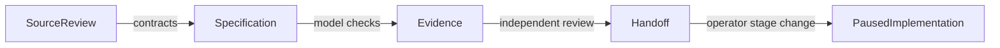

# 20260907-0550 — UOS agentic infrastructure, coordination and design checkpoint journal

#fractal-l0 #fractal-l1 #fractal-l2 #fractal-l3 #fractal-l4 #fractal-l5 #fractal-l6 #fractal-l7 #fractal-l8 #fractal-l9 #zk-adr #zero-muda #km-triad

**Live:** [Journal](http://nas-1.tail55d152.ts.net:4100/docs/journal/20260907-0550-uos-agentic-infrastructure-formal-spec-journal.md) · [Source](http://nas-1.tail55d152.ts.net:4100/files/docs/journal/20260907-0550-uos-agentic-infrastructure-formal-spec-journal.md) · [Cockpit](http://nas-1.tail55d152.ts.net:4100/) · [Planning](http://nas-1.tail55d152.ts.net:4100/planning) · [Wiki](http://nas-1.tail55d152.ts.net:4100/wiki) · [ZK](http://nas-1.tail55d152.ts.net:4100/zk) · [Checklist](http://nas-1.tail55d152.ts.net:4100/checklist)

Package timestamp:2026-09-07T05:54:50Z. Stage:**ANALYSIS / PLAN / DESIGN COMPLETE; IMPLEMENTATION PAUSED BY OPERATOR**.
[Infrastructure specification](http://nas-1.tail55d152.ts.net:4100/docs/design/20260907-0550-uos-agentic-infrastructure-17-aspect-formal-spec.md) · [Implementation handoff](http://nas-1.tail55d152.ts.net:4100/docs/plans/20260907-0653-uos-tri-agent-cheaper-mode-implementation-plan.md) · [17-aspect verification receipt](http://nas-1.tail55d152.ts.net:4100/files/docs/reviews/20260907-0653-uos-tri-agent-17-aspect-verification.json).

## 1. Scope & Trigger

The operator requested an enterprise agent-infrastructure specification using UOS native building blocks and the canonical17 aspects, with C3I/Indrajaal code/docs/wiki/ZK review. Subsequent steering requested local mainline synchronization, real Claude/Codex/AGY coordination through a message board, SDLC/SRE swarms, Herdr integration, executable Lean/Quint models, and economical OpenRouter workers.

The final instruction was to finish analysis, planning and design using Astra at max reasoning, then defer implementation to a cheaper phase. Active workers and peers received that pause. Prototype work begun under the earlier instruction was preserved.

## 2. Pre-State Assessment

The original TUI integration and main histories diverged from common ancestor `6eadde491681265dde692054d81118594a0b5443`. The TUI branch had8commits not in main; main had the reviewed execution/acceptance wave absent from that branch. Local main was `ca3c0503834ed625b417ee85329ab8fb962850ce`.

Existing TUI, board, source receipts and other sessions' work were already present. Local C3I revision `47f9322329fcda2fdbd7061988f586c65db00d17` differed from observed VM-1 `0683c0f8c5fe4bcbd65011662596638855147729`; external sources remained read-only.

## 3. Execution Detail

### Specification and formal design

Authored21 service contracts,18 invariants,63 required service cases,357 service/aspect pairs,8 parent work packages, typed request/authority/context/budget/effect contracts, and paired ASCII/Mermaid architecture/lifecycle sources. Added source review, wiki, ADR and MOC links.

A bounded formal worker produced a26 theorem Lean model and a Quint model with9 scenarios,400 seeded traces and2 unsafe-mutant controls. An explicitly routed `gpt-6-astra` / `max` reviewer independently checked the design. Its three clarifications were incorporated: one Hermes dispatch transaction and explicit rejection ordering; local session metadata separated from workflow authority; narrower formal-model claims.

### Live cooperation and preserved prototypes

Discovered actual Claude, Codex and AGY Herdr sessions and sent bounded work handoffs. Claude emitted a real ACK; AGY emitted a review report. New native session, Herdr and OpenRouter prototypes were authored before the pause. A peer fixed a storage parsing failure and integrated the preserved candidates. Root subsequently observed448 TUI tests passing. The source snapshot at `bc9c663d26e99ca39af9ac6f6a3bf7741e4aa6cb` is the code checkpoint; document edits are a later checkpoint.

One sanitized OpenRouter advisory invocation reported125 prompt and234 completion tokens,USD 0.0001061, model `openai/gpt-4.1-nano`, provider Azure. Free routes were denied under account data policies. No remote request was initiated by root after the implementation pause.

### VCS and artifact synchronization

A peer created preserving merge `wozwmxyy/bdeacf06` during observation. Root preserved it with `integration/pre-tri-agent-sync-20260907` and created a further preserving integration change. Later peer operations advanced main to the code checkpoint above. This exposed that single-writer coordination was still cooperative, not mechanically enforced. No history was force-rewritten or remotely pushed.

A live `state/sa_plan.sqlite3` had been tracked. It was ignored and untracked without deleting the local file; history was preserved and no database digest or contents were copied into these artifacts. Sa-plan plan `tri-agent-sync-20260907` records the work. Final design documents and receipts are synchronized separately with local mainline.

## 4. Root Cause Analysis

The original vendor list lacked UOS ownership and testable contracts. Selected sources contained declaration/execution gaps: empty root startup, synthetic MAX output, literal matrix/VFS passes, in-memory temporal history and incomplete identity/tenant boundaries.

A second operational issue was demonstrated: legacy board regeneration erased a peer message in both the ledger projection and shared Zenoh namespace. Claude recorded the loss and an Andon. Repair must preserve causality and cannot fabricate the lost sender event. Concurrent bookmark mutation despite a handoff showed why action consumers need fencing beyond conversational agreement.

The initial179 cepaf failures were environment-sensitive: sandbox restrictions prevented local sockets/database operations. A host-access rerun passed all10,196 tests. This supersedes that broad baseline failure for the tested code; it does not establish the production obligations.

## 5. Fix Taxonomy

Specification: native contracts, transaction boundaries and complete17 aspect obligations.
Formal design: executable bounded models with positive/negative controls.
Coordination: actual peer handoff plus preserved native prototypes.
Planning: ordered cheaper-mode slices and enterprise WP dependencies.
Artifact hygiene: correct live doc URLs, source drift receipt, and preserved/untracked live DB.
VCS: preserving local integration, without deployment or history deletion.

## 6. Patterns & Anti-Patterns Discovered

Distinguish delivered messages, peer ACKs, review agreement, task completion and effect authorization. Keep workflow money/approval/outcome authority in one Hermes transaction domain. A local session log is a cooperative coordination aid, not another workflow engine.

Use local deterministic tools first; send compact source/evidence references to remote workers. Preserve original source hashes and mark later changes STALE. Static green flags, a model's opinion, passing file-presence checks and sampled traces are not production proof.

ASCII/Mermaid sources for the design flow:

```text
SourceReview --contracts--> Specification
Specification --model checks--> Evidence
Evidence --independent review--> Handoff
Handoff --operator stage change--> PausedImplementation
```



## 7. Verification Matrix

| Check | Observed scope | Result |
|---|---|---|
| Clock | chrony reference2026-09-07T05:42:10Z; system0.001250984s slow; leapNormal | OBSERVED; model/context deltaUNKNOWN |
| Structural analysis |21 services,17 aspects,357pairs,63cases,18 invariants,8WPs; paired diagrams | Independent count checkPASS; final document validator receipt retained |
| Native TUI checkpoint | Actual package suite |448 passed,0 failures,exit0 |
| cepaf host checkpoint | Actual package suite with required host access |10,196passed,0 failures,exit0 |
| cepaf sandbox control | Same broad suite in restricted sandbox |10,017passed,179 failures; environment restricted |
| Hardware interlock | Rust hardware_identity_test |3 passed,0 failed |
| Hermes wiki/Sa-plan | dune runtest scoped directories |exit0; cached execution possible; no fresh count claimed |
| Lean | Abstract coordination model |26 named theorems compile; no custom axioms or incomplete proofs |
| Quint |9 scenarios and400 traces, maximum60 steps |PASS within declared bounds;2 unsafe mutants detected |
| Herdr and peers | Actual discovery and peer-created board messages |OBSERVED; atomic session fence absent |
| OpenRouter | One sanitized advisory request |OBSERVED;359 tokens;reportedUSD 0.0001061; no execution authority |
| Enterprise services |63 planned acceptance cases and17 operational semantics |UNRUN / NOT_PROVED / NOT_ADMITTED |
| Source drift |80 selected review-time hashes |72 match;8 STALE after concurrent changes; original hashes retained |
| Tailnet | Correct /docs/design URL returned200; doubled /docs/docs returned404 |Corrected links; final bundle probes recorded separately |

Source/test observations have explicit limits. The full [verification receipt](http://nas-1.tail55d152.ts.net:4100/files/docs/reviews/20260907-0653-uos-tri-agent-17-aspect-verification.json) and [formal receipt](http://nas-1.tail55d152.ts.net:4100/files/docs/design/20260907-0620-uos-tri-agent-formal-verification.json) contain the evidence classes.

## 8. Files Modified

Design package: [Markdown specification](http://nas-1.tail55d152.ts.net:4100/docs/design/20260907-0550-uos-agentic-infrastructure-17-aspect-formal-spec.md), [JSON companion](http://nas-1.tail55d152.ts.net:4100/files/docs/design/20260907-0550-uos-agentic-infrastructure-17-aspect-formal-spec.json), [source review](http://nas-1.tail55d152.ts.net:4100/docs/reviews/20260907-0550-uos-c3i-indrajaal-17-aspect-infrastructure-source-review.md), [wiki](http://nas-1.tail55d152.ts.net:4100/docs/wiki/20260907-0550-uos-agentic-infrastructure-building-blocks.md), [ADR](http://nas-1.tail55d152.ts.net:4100/docs/zk/20260907-0550-adr-uos-agentic-infrastructure-native-building-blocks.md), this journal and the [master MOC](http://nas-1.tail55d152.ts.net:4100/docs/zk/20260905-1801-moc-uos-unified-master.md).

Coordination handoff: [system design](http://nas-1.tail55d152.ts.net:4100/docs/design/20260907-0653-uos-tri-agent-sdlc-sre-herdr-spec.md), [contract](http://nas-1.tail55d152.ts.net:4100/files/contracts/rules/20260907-0653-tri-agent-coordination.md), [implementation plan](http://nas-1.tail55d152.ts.net:4100/docs/plans/20260907-0653-uos-tri-agent-cheaper-mode-implementation-plan.md), [runbook](http://nas-1.tail55d152.ts.net:4100/docs/wiki/20260907-0653-uos-tri-agent-swarm-operations.md), [Astra review](http://nas-1.tail55d152.ts.net:4100/docs/reviews/20260907-0653-astra-max-agentic-system-design-review.md) and [17-aspect receipt](http://nas-1.tail55d152.ts.net:4100/files/docs/reviews/20260907-0653-uos-tri-agent-17-aspect-verification.json). Canonical AGENTS.md points to the new contract; .gitignore excludes the live Sa-plan database.

Formal sources: `formal/lean/AgenticCoordination.lean`, `formal/quint/agentic_coordination.qnt` and timestamped formal receipt.

Preserved prototype groups under apps/uos_tui: `session_sync*`, `herdr*`/`uos_herdr_ffi.erl`, `openrouter_worker*`/`uos_openrouter_ffi.erl` and corresponding tests. Existing peer-owned board/coord/TUI/generated/source artifacts were preserved; the mainline merge did not transfer their authorship.

## 9. Architectural Observations

Reuse actual Gleam/OTP actors and algebra, Sa-plan/Hermes persistence, Zenoh routing, wiki graph/TF-IDF, ZigVM boundaries and AG-UI/A2UI/TUI contracts. Herdr is the session/tool integration surface. OpenRouter supplies limited advisory computation. Neither supplies the production authorization authority.

The formal models prove gate structure and selected abstract invariants. They have one resource per instance and three abstract agent kinds; concrete sessions, persistence, multiple resources and reservation-per-dispatch correspondence require refinement.

## 10. Remaining Gaps

Implementation is deferred. Close63 enterprise cases, mandatory effect fencing, session identity binding, canonical workspace exclusion, board causal repair, cross-process/crash tests, the typed Hermes observation bridge and atomic paid fleet budgeting. MAX, tenant isolation, sandbox containment, UI accessibility, live root supervision and complete operational recovery require fresh evidence.

The legacy MOC's historical Mermaid-only diagram remains unchanged; its nonconformance is recorded rather than rewriting history. New/revised explanatory diagrams have both sources. No production deployment or system admission was performed.

## 11. Metrics Summary

21 services;17 aspects;357 base obligations;18 invariants;63 acceptance cases;8 enterprise WPs;9 ordered coordination implementation slices;80 review source bindings with8 stale;26 Lean theorems;9 Quint scenarios;400 bounded traces;2 negative controls. Test baseline448 TUI+10,196 cepaf+3 hardware cases passed. One remote advisory costUSD 0.0001061; total session/model cost is not inferred from that one call.

## 12. STAMP & Constitutional Alignment

Preserved native language ownership, source quarantine, Zero-Muda exclusions, OS serial interlock and standalone JJ. Approval, money and side effects remain typed policy obligations. Formal tools and model advice cannot grant authority. Every prototype and receipt is distinguished from production admission.

## 13. Conclusion

The analysis, plan and design are complete, including all 17 aspects, executable formal models, Herdr/three-agent coordination, OpenRouter economy and the cheaper-mode implementation sequence. Astra/max review clarifications are incorporated. Prototype code and private state are preserved; further implementation is paused for the operator's mode change.


## Comprehensive verification checklist

Document checks and production gates have different evidence scopes. Checked
items below refer only to this document package. All infrastructure runtime,
formal-proof and sovereign-admission obligations remain **UNRUN**.

<details>
<summary>Domain 1 — Metadata, timestamp and Tailscale navigation</summary>

- [x] **CHK-01-TIME** — Host-clock timestamp prefix and chrony receipt recorded.
- [x] **CHK-02-TAIL** — Full clickable Tailscale FQDN references provided; serving status is reported in the journal.
- [x] **CHK-03-FRACT** — Canonical L0–L9 fractal tags assigned.
- [x] **CHK-04-KM** — Specification, wiki, ADR, source review and journal cross-linked.

</details>

<details>
<summary>Domain 2 — Zero-Muda purity and storage safety</summary>

- [ ] **CHK-05-MUDA** — Production dependency/exclusion scan required.
- [ ] **CHK-06-GRAPH** — Pure BEAM/Hermes graph boundary must pass runtime checks.
- [ ] **CHK-07-DRIVE** — Denied OS serial `25503L801736` must pass real interlock tests.

</details>

<details>
<summary>Domain 3 — Testing Gold Standard and mathematical gates</summary>

- [ ] **CHK-08-C1C8** — Structure, health badges, data grids, timeline, interactions, dark cockpit, advisory and action interlock.
- [ ] **CHK-09-MATH** — H ≥ 2.50 bits, CCM ≥ 90.0%, D_EA ≤ 10.0%, ITQS ≥ 0.85 require declared metrics and fresh measurements.
- [ ] **CHK-10-9MOD** — Unit, system, TDD, BDD, performance, scalability, property, fuzz and chaos.
- [ ] **CHK-11-REGR** — Relevant UI regression suite and 30-second monitoring require execution.

</details>

<details>
<summary>Domain 4 — Cross-language control and observability</summary>

- [ ] **CHK-12-GLEAM** — Real OTP domain/actor supervision and restart evidence.
- [ ] **CHK-13-HERMES** — Authoritative WAL, bounded formal checks and evidence receipts.
- [ ] **CHK-14-ZIGVM** — Deterministic execution and descriptor-relative VFS evidence.
- [ ] **CHK-15-MAX** — Real inference through the isolated MAX boundary.
- [ ] **CHK-16-OTEL** — UTC microsecond timestamps and nonzero W3C trace/span IDs.

</details>

<details>
<summary>Domain 5 — Sovereign governance and standalone Jujutsu</summary>

- [ ] **CHK-17-SOV** — Tri-sovereign candidate review and authorized admission are outstanding.
- [x] **CHK-18-JJ** — Documentation authored in UOS using its standalone JJ discipline; no native Git mutations in UOS.

</details>


**Previous:** [Astra/max review](http://nas-1.tail55d152.ts.net:4100/docs/reviews/20260907-0653-astra-max-agentic-system-design-review.md) · **Next:** [Implementation handoff](http://nas-1.tail55d152.ts.net:4100/docs/plans/20260907-0653-uos-tri-agent-cheaper-mode-implementation-plan.md)  
**UOS footer:** Design complete; implementation deferred; production NOT_ADMITTED.
