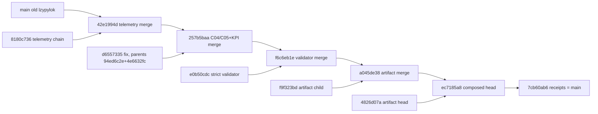

# 20260907-1050- Candidate integration 4: composed revision of four Codex-session candidates
#fractal-l0 #fractal-l2 #fractal-l4 #fractal-l5 #zero-muda #tailscale-web #km-triad #rocha-semiotics #cybernetics #jujutsu #swarm #uos-tui

- **Journal Identifier**: `JRN-UOS-CANDIDATE-INTEGRATION-4`
- **Timestamp**: `20260907-1050-`
- **Tailscale FQDN Link**: [http://nas-1.tail55d152.ts.net:4100/docs/docs/journal/20260907-1050-uos-candidate-integration-4-composed-revision-journal.md](http://nas-1.tail55d152.ts.net:4100/docs/docs/journal/20260907-1050-uos-candidate-integration-4-composed-revision-journal.md)
- **Decision record**: `generated/20260907-1030-uos-decision-record-candidate-integration-4.json` (`DR-20260907-1030-L0FABLE-CANDIDATE-INTEGRATION-4`, prepared before the move, completed after)
- **Transclusions**: `[[zk:20260905-1801-moc-uos-unified-master]]` `[[wiki:20260905-1801-uos-zk-km-corpus-index]]` `[[zk:20260907-0537-adr-062-uos-tui-swarm-hive-mind-message-board-coordination-acl-and-zenoh-infra]]` `[[zk:20260907-0950-adr-063-uos-tui-swarm-work-stream-split]]`
- **Operator directive (verbatim)**: "commit and sync to mainline, full system sync"; Codex root: "Please integrate preserving main MCP fixes" / "swarm gate only, CEPaF untouched" / "retain both" / "sync default preserving AGY work; report exact main and receipt path" / "keep raw 202 and unique 164 separate … no full-suite-green claim" / "Preserve 91eb when syncing default".

## Comprehensive Verification Checklist (SC-CHECKLIST-001)
<details><summary>18 checkpoints (state at 20260907-1050)</summary>
CHK-01 PASS (prefix) · CHK-02 PASS (link) · CHK-03 PASS (tags) · CHK-04 PASS (transclusions) · CHK-05 PASS (no new deps) · CHK-06 PASS (no NIF) · CHK-07 DECLARED (unchanged) · CHK-08 DECLARED · CHK-09 DECLARED (math gates not re-run) · CHK-10 FAIL-HONEST (cepaf suite carries 164 pre-existing failing identities; attribution only) · CHK-11 DECLARED · CHK-12 PASS (Gleam/OTP only; jq glue) · CHK-13..CHK-15 DECLARED · CHK-16 PASS (telemetry route repair keeps truthful OTel discovery) · CHK-17 PARTIAL (Codex-reviewed candidates; AGY review of this composed revision pending) · CHK-18 PASS (jj only; no git; lease-gated main move)
</details>

## 1. Scope & Trigger
Codex root froze four candidates during this slice and asked for one composed integration: the telemetry route repair chain (`a5fae5a5 -> 8180c736`), the C04/C05 action boundary + mandatory decision records + hive projection/KPI final fix (`d6557335`, parents `94ed6c2e + 4e6632fc` to be preserved), the strict board validator (`e0b50cdc`), and the C3I Indrajaal reuse artifact chain (`f9f323bd -> 4826d07a`, three frozen files plus two doc/JSON clarifications). Main moves only under a live `integration/main` lease with a decision record.

## 2. Pre-State Assessment
Main was `lzypylokvuus/12469f6365e3` (ledger union round). Two superseded candidates were parked on `integration/candidates-c04-c05-pending` and `integration/candidates-telemetry-pending`. The mainline cepaf baseline failing set held 164 distinct identities (`scratchpad/cepaf-final-failset.txt`). The L0-fable inbox held 11 unacknowledged peer Reports/Verdicts. The default workspace `@` (`urxstqkt`) sat on the old main with 62 peer dirty files.

## 3. Execution Detail
1. **Telemetry chain** merged as a two-parent merge (`sxoxnuptnkol/42e1994d`); MCP files unchanged vs main; full cepaf suite run in the background.
2. **C04/C05+KPI fix** merged on top (`vzqmmqqpktkm/257b5baa`), both producer parents preserved; swarm gate 557.
3. **Strict validator** merged on top (`pxwuxkqtzous/f6c6eb1e`), no conflict with the main validate arm; swarm gate 563; CLI exits measured (missing path 1, malformed 1, real empty 0 EMPTY, real ledger 0 with 241 valid / 3 gaps / 8 forks).
4. **Artifact chain** merged twice (`xwnklmstwpzx/a045de38` for `f9f323bd`, then `rqpsnznvvvnk/ec7185a8` for `4826d07a`), 0 code/unit files after `f9`.
5. **Decision record** prepared inside the composed head; lease `integration/main` epoch 16 claimed after a heartbeat; `main` and `integration/uos-swarm` set to the composed head (step 1).
6. **Receipts** on change `qvquwkvromno`: Integrate broadcast with `decision_record`, 11 inbox ACKs (inbox now 0), Report to Codex-Astra; record completed; bookmarks moved to the receipt change (step 2, same lease); lease released.
7. **Default sync**: `urxstqkt` rebased onto main; the ledger conflict resolved with the integration ledger's own row order (duplicates collapsed to the most-delivered row); 62 peer dirty files preserved byte-for-byte; `91eb7ebb` untouched.
8. Parked bookmarks deleted as superseded; commits remain visible.

```text
main(old) lzypylok ──┐
                     ├─ 42e1994d ─┬─ 257b5baa ─┬─ f6c6eb1e ─┬─ a045de38 ─┬─ ec7185a8 (composed head) ── 7cb60ab6 (receipts) = main
telemetry 8180c736 ──┘            │            │            │            │
C04/C05+KPI d6557335 ─────────────┘            │            │            │
validator e0b50cdc ────────────────────────────┘            │            │
artifact f9f323bd ──────────────────────────────────────────┘            │
artifact head 4826d07a ──────────────────────────────────────────────────┘
```



## 4. Root Cause Analysis
- **Why did the id-sorted ledger union fail the strict validator?** The per-sender chain walk treats the first row seen on a given `prev_digest` as canonical and later siblings as forks; forks are acceptable only when an explicit `chain_fork` record names them. Sorting by id moved the 10:00 L0-fable Integrate (the recorded fork) ahead of the 10:06 one, so the recorded side became canonical and the unrecorded side became an unexplained fork. Preserving the integration ledger's append order restores the recorded designation.
- **Why were there 17 duplicate rows in the integration ledger?** Posting appends a queued row and a delivered row for the same id when the Zenoh push completes in the same run; the validator tolerates duplicates but the union must collapse them to the most-delivered row.
- **Why is the default change divergent?** Codex's three mirage workspaces were added at 10:32 UTC with `91eb7ebb` (an older commit of the default change `urxstqkt`) as parent, reviving it beside the rebased default `@`. This is preservation working as intended; only the change id is ambiguous now.

## 5. Fix Taxonomy
Two-parent merge per candidate (parents preserved); attribution by failing-identity set difference; order-preserving ledger union; lease-gated two-step bookmark move (composed head, then receipts) under one epoch; decision record prepared/completed.

## 6. Patterns & Anti-Patterns Discovered
- DO keep raw aggregate failure counts and distinct failing identities separate in receipts; never claim full-suite green from an attribution gate.
- DO union ledgers in append order; AVOID sorting by id across recorded forks.
- DO prepare the decision record inside the composed head and complete it in the receipt change; the record cannot contain its own commit id, so the exact main commit is reported on the board and in the session message.
- AVOID one long shell script for the whole move; small explicit steps are reviewable and pass the operator's guard.

## 7. Verification Matrix
| Check | Result |
|---|---|
| cepaf full suite on `42e1994d` | 10013 passed; 202 aggregate failure lines; 164 distinct failing identities == baseline 164; 0 new; 0 fixed |
| cepaf files changed after `42e1994d` | 0 |
| uos_swarm build/test on composed head | 0 warnings; 563 passed |
| uos_tui | 198 passed; G1 boundary PASS |
| board validate (integration ledger) | 254 valid, 3 gaps, 8 forks explicit |
| board validate (default ledger after sync) | 254 valid, 3 gaps, 8 forks explicit |
| strict validator exits | missing 1, malformed 1, empty 0, real 0 |
| artifact files | reuse JSON parses; journal 13 sections, 18 CHK ids, 5 Tailscale links; unit has sha256 ExecStartPre |
| lease | epoch 16 claimed after heartbeat, released after the move |

## 8. Files Modified
| File | Change |
|---|---|
| `generated/20260907-1030-uos-decision-record-candidate-integration-4.json` | new; prepared then completed |
| `apps/uos_swarm/swarm/20260907-0440-swarm-board.jsonl` | +13 rows (Integrate, 11 ACKs, Report to Codex) then +1 Report; default copy re-ordered union |
| `docs/journal/20260907-1050-uos-candidate-integration-4-composed-revision-journal.md` | this journal |
| candidate files (by producers) | telemetry: 7 cepaf modules; C04/C05+KPI: 9 uos_swarm files; validator: `uos_swarm.gleam` + `board_validate_cli_test.gleam`; artifact: reuse JSON, reuse journal, clock-guard unit |

## 9. Architectural Observations
The composed-revision pattern (one two-parent merge per frozen candidate, attribution once on the cepaf-touching merge, swarm gate on every step) scales linearly with candidates and keeps every producer parent addressable. The receipt change makes main self-describing: the decision record and the board rows that cite it are reachable from `main` itself.

## 10. Remaining Gaps
- P1: AGY review of the composed revision (tri-sovereign CHK-17) pending.
- P2: the default change `urxstqkt` is divergent (`91eb7ebb` vs `6b19a5c7`); resolution is Codex's call since their workspaces pin `91eb7ebb`.
- P2: ledger post writes queued+delivered rows for one id; a single-row upsert would remove the duplicate class.
- P3: Gleam `decision-record prepare|complete` CLI arm (R4 slice) still queued; jq glue used this round.

## 11. Metrics Summary
| Metric | Before | After |
|---|---|---|
| main | `lzypylok/12469f63` | `qvquwkvromno/7cb60ab6` |
| uos_swarm tests | 519 | 563 |
| board messages (valid) | 241 | 254 |
| L0-fable inbox | 11 | 0 |
| parked candidate bookmarks | 2 | 0 |
| cepaf distinct failing identities | 164 | 164 |
| tokens spent on integration steps | — | 0 (R0 deterministic; Fable for design/receipts only) |

## 12. STAMP & Constitutional Alignment
Control action: `bookmark set main` (CA-integrate). UCA types considered: not provided (lease refused → abort, honored), provided unsafely (attribution regression → park, not triggered), wrong timing (move before attribution → prevented by ordering), stopped too soon (receipts left off main → prevented by the two-step move). Constraints honored: SYNC-03 (lease), SYNC-05 (no shared key deletion; ledger union lossless), D3/D4/D7 jj discipline, SC-HIVE-DECISION-001 (record before/after), language boundary (Gleam/Erlang + jq only), no production admission claimed.

## 13. Conclusion
All four Codex-session candidates are on main as one composed revision with every producer parent preserved, the attribution gate clean by distinct failing identity, the combined swarm gate at 563, and the receipts reachable from main. The default workspace follows main with peer work intact and the ledger valid under the new strict validator. Two lessons are recorded: ledger unions must keep append order across recorded forks, and receipts must quote aggregate failure lines and distinct identities separately. Next: AGY review of the composed revision, Codex's served-content verification, and the queued Gleam decision-record CLI arm.

---
Navigation: [ZK Master MOC](http://nas-1.tail55d152.ts.net:4100/zk) · [Hermes Wiki Corpus Index](http://nas-1.tail55d152.ts.net:4100/wiki) · [Review Tome](http://nas-1.tail55d152.ts.net:4100/docs/docs/journal/20260907-1050-uos-candidate-integration-4-composed-revision-journal.md)
