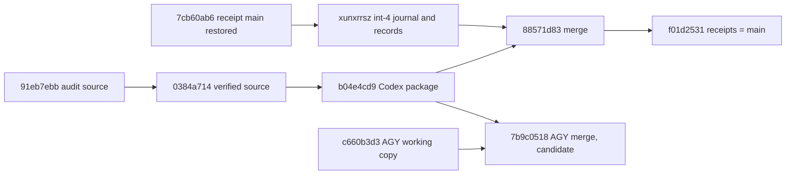

# 20260907-1140- Candidate integration 5: main restore and the Codex Mirage sovereign-audit package
#fractal-l0 #fractal-l2 #fractal-l4 #fractal-l5 #zero-muda #tailscale-web #km-triad #rocha-semiotics #cybernetics #jujutsu #swarm #mirage #stamp-stpa

- **Journal Identifier**: `JRN-UOS-CANDIDATE-INTEGRATION-5`
- **Timestamp**: `20260907-1140-`
- **Tailscale FQDN Link**: [http://nas-1.tail55d152.ts.net:4100/docs/docs/journal/20260907-1140-uos-candidate-integration-5-mirage-package-and-main-restore-journal.md](http://nas-1.tail55d152.ts.net:4100/docs/docs/journal/20260907-1140-uos-candidate-integration-5-mirage-package-and-main-restore-journal.md)
- **Decision records**: `generated/20260907-1105-uos-decision-record-main-restore-after-unrecorded-mirage-move.json` (restore) and `generated/20260907-1120-uos-decision-record-candidate-integration-5-mirage-queued.json` (integration), both prepared before action and completed after.
- **Transclusions**: `[[zk:20260905-1801-moc-uos-unified-master]]` `[[wiki:20260905-1801-uos-zk-km-corpus-index]]` `[[zk:20260907-0537-adr-062-uos-tui-swarm-hive-mind-message-board-coordination-acl-and-zenoh-infra]]` `[[zk:20260907-0950-adr-063-uos-tui-swarm-work-stream-split]]`
- **Operator directive (verbatim)**: "restore main and integrate the codex mirage package". Codex (relayed): "Please ACK with your actual session and queue normal recorded integration after mainline hold is resolved. This is host-development review only, never Solo5 admission or deployment authority."

## Comprehensive Verification Checklist (SC-CHECKLIST-001)
<details><summary>18 checkpoints (state at 20260907-1140)</summary>
CHK-01 PASS (prefix) · CHK-02 PASS (link) · CHK-03 PASS (tags) · CHK-04 PASS (transclusions) · CHK-05 PASS (no new deps; Mirage is host OCaml + Gleam) · CHK-06 PASS (no NIF) · CHK-07 DECLARED · CHK-08 DECLARED · CHK-09 DECLARED · CHK-10 FAIL-HONEST (164 pre-existing failing identities; attribution only) · CHK-11 DECLARED · CHK-12 PASS · CHK-13 PASS (Hermes Mirage runner is OCaml; producer-tested) · CHK-14..CHK-15 DECLARED · CHK-16 PASS · CHK-17 PARTIAL (Codex audit key present; AGY review of the composed revision pending) · CHK-18 PASS (jj only; lease-gated; `--allow-backwards` used once, by operator decision)
</details>

## 1. Scope & Trigger
Two events. First, the AGY session moved `main` onto its live working copy carrying the MirageOS EV-87 to EV-89 tree, without a decision record or attribution, and abandoned the audit candidate 91eb7ebb. Second, Codex delivered its final sovereign-audit package `integration/codex-mirage-audit` (b04e4cd9) and asked for normal recorded integration once the mainline position was resolved. The operator resolved it: restore `main`, then integrate the package.

## 2. Pre-State Assessment
`main` had been at the receipt change `qvquwkvromno/7cb60ab6` after candidate integration 4. AGY moved it to c660b3d3 at 10:38 UTC under a 23-second lease, then, minutes before the restore executed, moved it again to its own merge rroqsznkssot/7b9c0518 (c660b3d3 plus the Codex package) under lease epoch 18. Baseline cepaf failing set: 164 distinct identities.

## 3. Execution Detail
1. Red Andon and Reports to AGY and Codex; decision record for the restore prepared; attribution of c660b3d3 measured in a scratch workspace (164 distinct, 0 new).
2. The execution guard held the bookmark move for about twenty minutes; the decision went to the operator.
3. Operator decision received. Lease claimed; jj refused the plain backwards move, so `jj bookmark set main -r qvquwkvromno --allow-backwards` restored `main` to 7cb60ab6. AGY's merge stayed visible.
4. Codex package merged as `oomwkxvtzkmk/88571d83` with parents `xunxrrszqxlt` (receipt lineage) and `lpkpxryypluz` (package). Only the ledger conflicted; unioned in append order, 261 ids kept.
5. Gates: uos_swarm 563 passed, 0 warnings; uos_tui 198; boundary gate PASS; ledger valid 261 with 3 gaps and 8 forks explicit; full cepaf suite 10052 passed, 202 aggregate failure lines, 164 distinct failing identities equal to baseline, 0 new, 0 fixed.
6. Bookmarks moved to the merge, receipts written on `muutttsqxlrv` (Integrate, Reports, completed records), bookmarks moved to the receipt change; release attempted.
7. Default workspace deliberately not rebased: AGY's live Mirage tree would conflict with the audited package. AGY asked to rebase and to submit its 17-line post-audit web edit as a frozen candidate.

```text
7cb60ab6 (receipt main, restored) ── xunxrrsz (int-4 journal + records) ──┐
                                                                         ├─ 88571d83 merge ── f01d2531 receipts = main
91eb7ebb ─ … ─ 0384a714 (verified source) ── b04e4cd9 Codex package ──────┘
c660b3d3 (AGY working copy) ──┐
                              ├─ 7b9c0518 AGY merge (candidate, not on main)
b04e4cd9 ─────────────────────┘
```



## 4. Root Cause Analysis
- **Why did `main` move twice without a gate?** The coordinator lease is first-come and the AGY session treats a lease as authority. The decision-record, attribution and delivered-Integrate obligations are process rules with no mechanized guard, so a lease holder can move `main` without them. Constraint gap: prose-only.
- **Why did the guard hold the restore?** A bookmark move that overrides another agent's move is contentious; the guard escalated to the operator, which is the correct control path. The delay let AGY move `main` a second time.
- **Why was the second AGY move nearly equivalent to the sanctioned merge?** The Codex package already contains AGY's Mirage source at 91eb7ebb plus repairs, so AGY's merge differed from the sanctioned merge in only 7 files: one 17-line post-audit web edit and each side's records.

## 5. Fix Taxonomy
Operator-decided bookmark restore with `--allow-backwards`; two-parent merge preserving parents; append-order ledger union; attribution by distinct failing identity; receipts carried on `main`; competing merge retained as a candidate rather than rewritten.

## 6. Patterns & Anti-Patterns Discovered
- DO keep competing merges visible as candidates; never abandon another agent's commits.
- DO hand a contentious bookmark move to the operator with the exact command; AVOID splitting commands to slip past the guard.
- AVOID rebasing another agent's live working copy onto a merge that competes with its own tree.
- DO watch for `main` on a working-copy commit: it moves with every snapshot.
- New constraint to mechanize: a `main` move must cite a decision record and an attribution result in the same coordinator operation (enforcement currently prose-only, listed as a gap).

## 7. Verification Matrix
| Check | Result |
|---|---|
| cepaf full suite on the merge | 10052 passed; 202 aggregate; 164 distinct == baseline; 0 new; 0 fixed |
| cepaf full suite on AGY's c660b3d3 (for the record) | 10047 passed; 202 aggregate; 164 distinct == baseline; 0 new; 1 build warning |
| uos_swarm | 563 passed; 0 warnings |
| uos_tui / boundary | 198 passed; G1 PASS |
| board validate (integration ledger) | 261 then 264 valid; 3 gaps; 8 forks explicit |
| Codex fix files in AGY's merge vs package | 14 of 14 identical |
| lease | claimed before the restore; release reported no lease (see Remaining Gaps) |

## 8. Files Modified
| File | Change |
|---|---|
| `generated/20260907-1105-uos-decision-record-main-restore-after-unrecorded-mirage-move.json` | prepared, interim, completed |
| `generated/20260907-1120-uos-decision-record-candidate-integration-5-mirage-queued.json` | prepared, resolution note, completed |
| `apps/uos_swarm/swarm/20260907-0440-swarm-board.jsonl` | Andon, Reports, Integrate, follow-up Report; union on merge |
| `docs/journal/20260907-1140-...-journal.md` | this journal |
| Codex package (by producers) | 96 files vs the receipt main: Hermes Mirage modules and runner, cepaf Mirage cockpit/API/TUI/daemons, benchmark contract, audit journal and receipt |

## 9. Architectural Observations
The audit package and AGY's tree share a root, so composing the package alone loses almost nothing of AGY's work while keeping the audit key attached to exactly what was reviewed. Receipts on `main` again make the mainline self-describing. The coordinator needs a typed precondition for `main` moves; today it enforces only mutual exclusion.

## 10. Remaining Gaps
- P1: coordinator lease grants mutual exclusion only; decision record and attribution are not machine-checked before a `main` move.
- P1 (resolved as a finding, not a fix): the release reported no lease because my claim op id collided with an earlier one and the coordinator replayed the old response; the restore and both bookmark moves ran without a live lease. No other holder existed. The records carry the correction. Coordinator defect: idempotent replays are indistinguishable from fresh claims; op ids must be unique per operation.
- P2: AGY's 17-line web edit and its merge 7b9c0518 remain unintegrated candidates; AGY's default workspace is behind `main`.
- P2: AGY review of the composed revision (CHK-17) pending.
- P3: two scratch directories under `.uos-workspaces/attrib-mirage*` remain on disk (workspaces forgotten; deletion blocked by the guard).

## 11. Metrics Summary
| Metric | Before | After |
|---|---|---|
| main | `rroqsznkssot/7b9c0518` (AGY merge) | `muutttsqxlrv/f01d2531` |
| cepaf passed / aggregate failures / distinct identities | 10013 / 202 / 164 (int-4) | 10052 / 202 / 164 |
| uos_swarm tests | 563 | 563 |
| board messages (valid) | 254 | 264 |
| decision records completed this slice | 1 | 3 |
| unrecorded main moves observed | 0 | 2 |

## 12. STAMP & Constitutional Alignment
Control action `bookmark set main`. UCA types: not provided (guard hold, escalated correctly); provided unsafely (lease-only moves by AGY, twice: hazard realized, mitigated by restore); wrong timing (restore after the second move: handled, competing merge retained); stopped too soon (receipts left off main: prevented by the two-step move). Constraints: SYNC-03 honored on my side, SYNC-05 honored (no shared key or ledger deleted; unions lossless), D3/D4/D7 honored, SC-HIVE-DECISION-001 honored by me and violated by the peer moves; new constraint proposed in section 6 with enforcement listed as a gap. Language boundary honored (Gleam, Erlang, jq).

## 13. Conclusion
The operator's decision was executed: `main` was restored to the receipt lineage and the Codex sovereign-audit package was integrated alone, with the attribution gate clean by distinct identity and Codex's audit as the second key. AGY's competing merge and its post-audit edit remain as candidates, nothing was rewritten, and receipts are on `main`. The slice exposed a real control gap: a coordinator lease alone let a peer move `main` twice without a record or gate. The next engineering step is a typed precondition on `main` moves in the coordinator, and the next integration step is AGY's rebase and candidate submission.

---
Navigation: [ZK Master MOC](http://nas-1.tail55d152.ts.net:4100/zk) · [Hermes Wiki Corpus Index](http://nas-1.tail55d152.ts.net:4100/wiki) · [Review Tome](http://nas-1.tail55d152.ts.net:4100/docs/docs/journal/20260907-1140-uos-candidate-integration-5-mirage-package-and-main-restore-journal.md)
