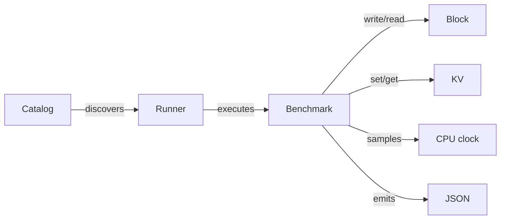

# Mirage sovereign audit and bounded host benchmark

#fractal-l0 #fractal-l3 #fractal-l4 #fractal-l5 #zk-adr #zero-muda #tailscale-web #checklist-nav

Created from observed host time 2026-09-07T11:03:50Z. Filename uses the mandated hour/seconds prefix. Audit source: `91eb7ebba529f7506369dc5d82738722579deac4`. Verdict: **host implementation tested; Mirage/Solo5 production admission NOT_VERIFIED**. Final source composition and handoff are recorded in the companion receipt. This journal is an audit result, not a new EV admission.

[UOS](http://nas-1.tail55d152.ts.net:4100/) · [Mirage](http://nas-1.tail55d152.ts.net:4100/mirage) · [Wiki](http://nas-1.tail55d152.ts.net:4100/wiki) · [ZK](http://nas-1.tail55d152.ts.net:4100/zk) · [Checklist](http://nas-1.tail55d152.ts.net:4100/checklist) · [Journal source](http://nas-1.tail55d152.ts.net:4100/files/docs/journal/20260907-1150-mirage-sovereign-audit-and-benchmark.md) · [Machine receipt](http://nas-1.tail55d152.ts.net:4100/files/docs/reviews/20260907-1150-mirage-sovereign-audit-receipt.json)

## 1. Scope & Trigger

The operator requested a detailed independent check of every listed Mirage module, actor, interface, contract, test and live link, plus a useful new feature. The supplied assertions—EV-87..89 admitted, 89/89 doctor, 1092 MB saved and SIL-6 cutover—were treated as claims to test. Three independent workers audited native code, actors/presentation, and governance while the root added a bounded benchmark using existing UOS building blocks.

The new feature is `hermes_mirage_runner benchmark [1..10000]`. It measures real host OCaml block and key/value operations. It does not install another service, invoke a model, build a Solo5 image or infer production savings. [Executable-law contract](http://nas-1.tail55d152.ts.net:4100/files/docs/design/20260907-1037-mirage-benchmark-contract.md).

## 2. Pre-State Assessment

### Native implementation and coverage

Paths below are relative to `engines/hermes/modules/hermes_mirage/`; each `.mli` was reviewed with its implementation where present.

| Asset | Observed implementation and coverage | Audit disposition |
|---|---|---|
| `mirage_signatures` | OCaml module signatures and error variants compile with host implementations | Interface conformance, not an installed MirageOS platform |
| `mirage_memory_block` | Sparse in-memory sectors; baseline accepted negative offsets, invalid buffer geometry and partially mutated failed requests | Reproduced and fixed; full-request validation and no mutation on validation failure |
| `mirage_merkle_kv` | Immutable map with SHA-256 hashing and two-way conflict detection; slash-joined path encoding collided | Canonical segment/byte-length encoding fixed the collision; remains a nonpersistent map, not Irmin/DAG/three-way merge |
| `mirage_solo5_tender` | JSON configuration predicates and `8.5 + 0.15 * MB` cold-start formula | No tender launched, seccomp observed, physical RAM cap enforced or boot time measured; negative memory validation remains a gap |
| `mirage_interceptor` | NUL/SQL-substring filter, real Digestif hash and mirage-crypto Ed25519 | Signing verified with tamper/malformed controls; no caller/tool authorization, replay binding or schema validation |
| `mirage_migration_catalog` | Seven static candidate records; 1092 and 95.8 literals; two static Admitted labels | All current migration stages reduced to Mapped; JSON v2 separates projections from null measurements and NOT_VERIFIED admission |
| `mirage_dns_resolver` | Fixed records, synthetic Tailnet answers and Hashtbl cache using wall time | Host model tests pass; no DNS transport, recursion or DoT; case normalization, cache bound, timeout and clock-jump behavior remain open |
| `mirage_tls_ingress` | Request policy evaluator with selected SNI/path/body checks | No TLS handshake/listener/proxy; header-size and ALPN controls ignored, duplicate forwarded headers retained in adversarial probe |
| `hermes_mirage_runner` | Host CLI for catalog, DNS model, ingress model, tender proposal and five model checks | Exact argument arity, truthful model output and bounded benchmark added |

The original Dune alias ran **three executables**, one of which contained five self-check assertions. That is not five independent runtime integrations. Existing dependency metadata includes mirage-crypto-ec, but no admitted Mirage/Solo5 source snapshot, configured cross-build or unikernel artifact was found. [Native entry point](http://nas-1.tail55d152.ts.net:4100/files/engines/hermes/modules/hermes_mirage/hermes_mirage_runner.ml).

### Actors, interfaces and contracts

| Asset | Finding and correction |
|---|---|
| `services/mirage_unikernel_daemon.gleam` | Pure immutable state transformations, no OTP actor/start/port/supervisor; simulated boot and fake digest formerly looked live. Now explicitly simulation-only, unknown observations, no fake admission receipt, correct running/terminated counts |
| `services/mirage_migration_engine.gleam` | Literal benefits and unsupported progression to admission. Now configured projections; evidence-dependent stages unavailable |
| `ui/lustre/mirage_cockpit.gleam` | Former conserved-RAM, deployed-Solo5 and all-green claims replaced with projected/unknown/unverified labels and benchmark link |
| `ui/wisp/mirage_api.gleam` | Fresh zero state was presented as runtime status. Fields now identify simulation, missing observation, projected savings and null measurements |
| `ui/tui/mirage_view.gleam` | Uses the same projection and unverified admission semantics as API/HTML |
| `ui/wisp/router.gleam` | Candidate source has Mirage routes but constructs fresh model state per status request; no live actor binding exists |
| `indrajaal_gleam_web.gleam` | Initial live Mirage paths fell through to generic HTML/not_found JSON. A peer subsequently activated the routes; later content probes succeeded. This does not establish Solo5 execution |
| `mirage-unikernel-contract.md`, `mirage-migration-policy.md`, `mirage-production-integration-contract.md` | Assertions exceed available evidence; filenames lack mandatory timestamps. Static 18 checked boxes are not verification receipts. Historical files retained; nonconformance recorded |

The three contracts are reachable at [core](http://nas-1.tail55d152.ts.net:4100/files/contracts/rules/mirage-unikernel-contract.md), [migration](http://nas-1.tail55d152.ts.net:4100/files/contracts/rules/mirage-migration-policy.md) and [production](http://nas-1.tail55d152.ts.net:4100/files/contracts/rules/mirage-production-integration-contract.md). Their production claims remain unverified despite HTTP success.

## 3. Execution Detail

### Benchmark implementation

The specification, private types, bounded configuration and independent list/fold oracle preceded the native loop. For each workload, iteration `i` writes then reads 512 copies of byte `i mod 251` using slot `i mod 16`. Each actual read must equal the expected payload. Wrappers count the actual write/read or set/get invocations. An additive unsigned-byte sum is checked against the independent oracle; it is not a cryptographic digest.

At `n=10000`, each workload returns 10000 verified roundtrips, 20000 counted I/O calls and checksum 637839360. Retained test payload is bounded to 16 slots per workload; this is not an OCaml heap or RSS bound. `Sys.time` measures process CPU time around setup, operations, verification, checksum and block disconnect. Garbage collection occurs only naturally. Wall time, Lamport order and process CPU time are different measurements.

From a checkout of the candidate:

```text
dune exec --root engines/hermes modules/hermes_mirage/hermes_mirage_runner.exe -- benchmark 10000
dune runtest --root engines/hermes modules/hermes_mirage --force
```

Editable ASCII source:

```text
Catalog --discovers--> Runner --executes--> Benchmark
Benchmark --write/read--> Block
Benchmark --set/get----> KV
Benchmark --samples---> CPU clock
Benchmark --emits-----> JSON
```

Editable Mermaid source, same nodes, edges and labels:



### Independent review and integration discipline

The native repair was frozen separately from the feature, UI and governance changes. Exact parents were preserved in isolated JJ compositions. The independent review of `b4c01105` found no correctness blocker and requested stronger JSON checks, real call counters, accurate measurement labels and cryptographic negative tests. These were implemented and re-reviewed at `abb7d417` with fresh focused tests.

Claude reported a separate unrecorded move of `main` to `c660b3d3` by AGY and a prepared restoration awaiting its execution gate/operator decision. The root acknowledged messages in coordinator sequences 138–140, retained the source candidate, and did not move main or restart any service. A development review of this host feature is not a second key admitting a Solo5 deployment.

## 4. Root Cause Analysis

The evidence path conflated four different things: source-file presence, model evaluation, measured runtime behavior and production admission. `tools/uos doctor` printed 89 PASS lines unconditionally. All three Mirage gates and selfchecks relied on `file_exists` yet printed behavioral, security and performance conclusions. Catalog constants, comments and model states then propagated to user interfaces as operational facts.

The storage bugs were independent correctness defects: validating a block request during mutation allowed partial effects; joining path segments with a delimiter erased key boundaries. Neither defect was covered by the original happy-path tests.

## 5. Fix Taxonomy

| Class | Implemented change | Compatibility consideration |
|---|---|---|
| Correctness | Validate complete block range and exact sector geometry before I/O | Callers passing malformed buffers now get errors |
| Integrity | Length-prefix every key segment and encoded entry in root hashing | All nonempty legacy roots change; external golden hashes must be versioned/recomputed |
| New capability | Bounded benchmark, oracle/native laws and JSON CLI | Host-library feature only; no MIG-08 deployment invented |
| Evidence | Explicit projection, simulation, null measurement and NOT_VERIFIED fields | Catalog JSON is version 2; old ambiguous field consumers require adaptation |
| Governance | Mirage gates/selfchecks and Doctor exit 1 while evidence is unavailable | Automation relying on unconditional success now fails closed |
| Coverage | Geometry/atomicity/hash tests, crypto negative controls, clock failures, CLI schema/oracle checks, mutations | Scope is tested behavior, not universal formal proof |

## 6. Patterns & Anti-Patterns Discovered

Reviewable decision summary: reuse the existing Hermes kernels, CLI/catalog, Gleam presentations and coordinator; avoid new daemons, inference calls or imported external trees. Choose algebraic laws and an independent oracle for the bounded operation workload. CPU timing samples are not a concurrency model, so Lean/Quint were not added merely to label timing as formal.

The anti-pattern is a report certifying its own literal assertions. A model result, valid signature, board acknowledgement or lease does not establish deployment authority. The benchmark JSON explicitly says it is not a durable evidence receipt; persistence must bind candidate, host, observed wall time and artifact digest. Private model reasoning is not required or recorded.

Forecast: with both kernels functioning, every valid invocation should return two verified result objects within the configured iteration bound. This is a correctness expectation, not a wall-time SLO. No performance threshold or calibrated probability is claimed. Independent testing and injected faults subsequently supported the bounded correctness expectation; production performance remains unknown.

## 7. Verification Matrix

| Check | Observed result | Bound or limitation |
|---|---|---|
| Pinned baseline OCaml | Three original executable checks passed | Host model behavior only |
| Storage RED/GREEN | Negative write originally accepted; ambiguous roots equal; repaired versions reject/diverge | Exact invalid geometry, partial-effect and key-encoding regression cases |
| New native composition | Four Dune runtest actions pass, including benchmark | No Solo5 process or network integration |
| Laws MB-01..10 | Oracle/native shared laws and twin seeds pass; 12 actual CLI probes | Seeds 87/89/20260907, twin seeds 87 and 20260907 with 89; n at most 10000 |
| Mutation controls | Call-count and checksum mutants exit 2 on distinct laws; corrupted read payload rejected | Mutants restored; final source tested again |
| Negative conformance | Valid config client compiles; forged private summary fails compilation with exit 2 | Confirms interface privacy under actual compiler |
| Ed25519 | Valid signature accepted; changed message, short signature, malformed public key and short seed rejected | Fixture keys only; no authorization/replay authority |
| Final UI composition | 23 focused Mirage tests; Indrajaal 8 tests on UI parent; both builds pass | Five named checklist domains and malicious HTML escaping covered |
| Full CEPAF comparison | Final UI worker: 10042 pass, 202 failure events versus pinned baseline 10037/202 | Suite is not green. Claude independently reports 164 distinct baseline failing identities on c660; do not equate events and identities |
| tools/uos | 14 tests pass; Doctor and Mirage gates/selfchecks deliberately exit 1 | Other EV rows are inventory metadata, not rerun gates |
| Zero-Muda | Existing current-tree gate exit 0 | Does not verify all imported history |
| Jujutsu | `.jj/repo/store/git_target` is internal `git`; no native Git command used | Root `.git` is an empty placeholder, so a simple directory-absence check fails; it contains no Git repository metadata |
| OTP runtime | OTP 27 / ERTS 15.2.7.4; same executable used by 4100 and both clock observers | OTP29 requirement FAIL; no upgrade performed |

### Link observations

At 2026-09-07T10:54:05Z, the three requested Tailnet paths returned 200 with Mirage content. Earlier independent probes had returned generic HTML and `not_found` JSON. The changed live PID was 2802968. Source and process revision could not be established from these responses, so they are host observations, not candidate-bound deployment receipts.

| Link | Later observed response | Semantic finding |
|---|---|---|
| [Mirage cockpit](http://nas-1.tail55d152.ts.net:4100/mirage) | 200, 31365 bytes | Mirage page present; live version still claimed conserved RAM, SIL6 and admission |
| [Candidates](http://nas-1.tail55d152.ts.net:4100/api/v1/mirage/candidates) | 200, 1979 bytes | Seven records, unmeasured 1092 and static admitted count 2 |
| [Status](http://nas-1.tail55d152.ts.net:4100/api/v1/mirage/status) | 200, 96 bytes | Fresh empty model state, no evidence source |
| [UOS](http://nas-1.tail55d152.ts.net:4100/), [Wiki](http://nas-1.tail55d152.ts.net:4100/wiki), [ZK](http://nas-1.tail55d152.ts.net:4100/zk), [Checklist](http://nas-1.tail55d152.ts.net:4100/checklist), three contract links above | 200 | Navigation/content reachable; no claim that every target's assertions are verified |
| [VM-1 peer](http://vm-1.tail55d152.ts.net:8088/) | Connection refused, curl exit 7 | Broken live link from cockpit; peer service not restarted |

All extracted hyperlink URLs in the observed Mirage HTML used full Tailnet FQDNs. New audit/benchmark document serving and corrected UI deployment await the recorded integration gate.

## 8. Files Modified

Native: `mirage_benchmark.ml/.mli`, `test_mirage_benchmark.ml`, `hermes_mirage_runner.ml`, `mirage_migration_catalog.ml`, `mirage_memory_block.ml/.mli`, `mirage_merkle_kv.ml/.mli`, `test_mirage_core.ml`, `test_mirage_migration.ml`, and local `dune` under the Hermes Mirage module.

Gleam: the two Mirage service modules, Mirage Lustre/API/TUI modules and their three focused test modules. Governance: `tools/uos/src/main.gleam` and `tools/uos/test/exit_status_test.gleam`. Artifacts: the timestamped benchmark contract, this 13-section journal and its machine receipt. Shared routers, source authorities, clock units and runtime processes were not modified by this slice.

## 9. Architectural Observations

The canonical aspect taxonomy is preserved from the [UOS specification](http://nas-1.tail55d152.ts.net:4100/docs/design/20260907-0550-uos-agentic-infrastructure-17-aspect-formal-spec.md).

| Aspect | Mirage evidence and remaining obligation |
|---|---|
| A01 Substrate & Hardware Storage Interlock | In-memory benchmark only; OS disk untouched; production storage interlock not rerun |
| A02 Standalone Jujutsu Monorepo Discipline | Exact revisions and sibling workspaces retained; mainline lineage incident tracked separately |
| A03 Zero-Muda Purity & Waste Elimination | Existing carriers reused; current-tree gate passes; no new dependency/runtime stack |
| A04 Gleam/OTP 29 4-Domain Root Supervisor | Simulation models tested; root supervisor still lacks Mirage wiring; observed OTP27 contradicts requirement |
| A05 ZigVM Deterministic Engine & 8 VFS Laws | No ZigVM or VFS change; no new ZigVM admission evidence |
| A06 Hermes Formal Evidence, Gospel & Z3 | Native laws, private types, independent oracle and crypto controls executed; Mirage Gospel/Z3 integration absent |
| A07 Mathematical Authority & Conservation | Seeded algebraic equivalence tested; no Mirage Lean/Quint theorem or universal savings proof |
| A08 Biosemiotic Cybernetics & Rocha Cut | Reports/models explicitly lack deployment and admission authority |
| A09 Quarantined Modular MAX/Mojo Inference | No inference needed; MAX remains outside migration |
| A10 Zenoh OoZ & MoZ Mesh Telemetry Backplane | Existing 8080 PID1689715 retained; Mirage forwarder/ACL/tenant behavior unverified |
| A11 AG-UI 32-Event SSE Stream Protocol | Existing stream unchanged; Mirage event lifecycle binding not implemented |
| A12 A2UI 233-Component Declarative Catalog | Existing presentation stack reused; no full 233-component conformance claim |
| A13 Penta-Stack Multi-Interface Accessibility | HTML/JSON/TUI semantics aligned; five-interface parity and accessibility unverified |
| A14 Universal Tailscale FQDN Web Navigation | Three Mirage links reachable later; VM-1 peer refused; corrected source not yet deployed |
| A15 Comprehensive Verification Checklist | Eighteen scoped checks below; Doctor no longer conflates inventory with passing evidence |
| A16 Knowledge Management Triad (Wiki/ZK/Ont) | Timestamped linked contract/journal/receipt; full ontology/index propagation pending integration |
| A17 Sa-Plan & Bionic Durable Workflows | Durable coordinator acknowledgements used; no direct report-to-deployment transition |

## 10. Remaining Gaps

1. Actual Mirage configuration, locked toolchain/source provenance, cross-build artifact, manifest inspection and Solo5 execution must precede deployment claims. Official Mirage documentation describes the configure/cross-compiler/build/launch path; this host Unix-linked library is a different build product. [Mirage build documentation](https://mirage.io/docs/mirage-4).
2. TLS handshake/certificate validation, DNS transport/DoT, bounded solver isolation and live actor/supervisor wiring are absent. The model's duplicate forwarding headers, ignored header/ALPN limits, negative tender memory and permissive substring interceptor are open findings, not production controls.
3. RAM savings and boot performance require artifact-bound measurements and baseline methodology. The catalog's seven listed speedup percentages average about 96.9571%, whereas its aggregate literal is 95.8%; no derivation is validated.
4. SIL-6 has no defined UOS scale or certification evidence here. It must not imply IEC 61508 certification: IEC describes SIL1–4. Solo5's current architecture describes seven possible SPT syscalls with all devices configured, so a six-syscall claim needs a pinned configuration and observation. [IEC functional safety](https://assets.iec.ch/public/acos/IEC%2061508%20%26%20Functional%20Safety-2022.pdf), [Solo5 architecture](https://github.com/Solo5/solo5/blob/main/docs/architecture.md).
5. OTP29, the VM-1 peer link, legacy timestamp violations, remaining generic static gates and full CEPAF failures need separate remediation. Tests here do not repair those claims.
6. Admission remains unavailable until candidate-bound behavior and machine-verifiable Mirage-specific formal evidence are evaluated by an authority-aware gate. The new gates deliberately cannot pass merely because an arbitrary receipt filename appears.

## 11. Metrics Summary

At 2026-09-07T11:05:05Z on nas-1, native composition `abb7d4178bfa44c2a99a0f144c058d221f9535eb` produced a 10000-round sample: block CPU 0.019494s and KV CPU 0.018394s; both 20000 I/O calls and checksum 637839360. Runner SHA-256 `08e912bef580b9e614d6e3405a9acfa787227baf5e2f7113c4394d937046728b`; output SHA-256 `eb5d7da279c952c7ad0cc19daca06ecaadc198e401b06fa7a43ef92f5a213c71`. This is one host sample, not a latency distribution, boot benchmark, SLA or memory-saving result.

Toolchain observed: OCaml5.5.0, Dune3.23.1, Digestif1.3.1, Yojson3.0.0, mirage-crypto and mirage-crypto-ec2.2.0; Gleam tests used OTP27. No paid OpenRouter request or new inference runtime was used. Aggregate model cost and global cheapest-model optimality were not measured.

Chrony at10:54:05Z reported normal leap status and system time16.487 microseconds slow of NTP. This is one local host receipt, not a fleet synchronization proof. Both clock observers remained active with zero automatic restarts, PIDs2678887/2670150. No clock or Lamport counter was reset or numerically equated with another clock domain.

## 12. STAMP & Constitutional Alignment

Model evaluation, signature validation, board acknowledgement, runtime ownership and system admission remain separate authorities. No hidden model reasoning or consciousness score is collected. Forecasts and decision summaries remain reviewable advisory evidence. External source trees stayed read-only and no source ingestion was performed.

<details><summary>Domain 1 — Metadata, timestamp and Tailscale navigation</summary>

- [x] CHK-01-TIME — Host UTC and local chrony receipt recorded; CPU and Lamport domains distinguished.
- [ ] CHK-02-TAIL — Core Mirage links reachable; peer refused and new artifact deployment pending.
- [x] CHK-03-FRACT — Canonical aspect/fractal tags retained.
- [x] CHK-04-KM — Specification, wiki, ZK and receipt links provided; propagation not claimed.

</details>
<details><summary>Domain 2 — Zero-Muda purity and storage safety</summary>

- [x] CHK-05-MUDA — Existing current-tree gate passed; no duplicate runtime introduced.
- [x] CHK-06-GRAPH — Dependency set unchanged; no new graphical/native dependency.
- [x] CHK-07-DRIVE — In-memory operations; protected system drive untouched.

</details>
<details><summary>Domain 3 — Testing and mathematical gates</summary>

- [ ] CHK-08-C1C8 — Focused checks pass; universal UI/accessibility criteria unverified.
- [ ] CHK-09-MATH — No new universal theorem or mathematical safety classification claimed.
- [ ] CHK-10-9MOD — Executable laws/negative/mutation tests pass; all nine modalities not executed.
- [ ] CHK-11-REGR — Scoped regressions pass; full CEPAF retains baseline failures.

</details>
<details><summary>Domain 4 — Control and observability</summary>

- [ ] CHK-12-GLEAM — Model tests pass; OTP29/live Mirage supervision absent.
- [x] CHK-13-HERMES — Real bounded benchmark and crypto/storage controls executed.
- [ ] CHK-14-ZIGVM — Unchanged and not re-admitted by this slice.
- [ ] CHK-15-MAX — Unchanged; inference not exercised.
- [ ] CHK-16-OTEL — Host JSON evidence exists; no collector delivery claimed.

</details>
<details><summary>Domain 5 — Tri-sovereign governance and Jujutsu</summary>

- [ ] CHK-17-SOV — Independent reviews and coordinator ACKs recorded; system admission and main integration held.
- [x] CHK-18-JJ — Standalone internal JJ store and candidate-preserving compositions used.

</details>

## 13. Conclusion

The audit and new bounded host benchmark are implemented at source candidate `0384a714bf5fe469b9c37accc58a11e98ba016a6`. Storage correctness, test coverage and evidence reporting improved. MirageOS/Solo5 production capability, OTP29 compliance and EV87–89 admission remain **NOT_VERIFIED**. Completion was broadcast through session_sync as `codex-mirage-audit-complete-1115`, sequence143. Peer completion ACK and main integration remain pending; integration/deployment requires the normal recorded gate. The coordinator accepted the task claim but rejected the unsupported workspace resource namespace; the separate JJ workspace retained filesystem isolation.

Previous: [Benchmark contract](http://nas-1.tail55d152.ts.net:4100/files/docs/design/20260907-1037-mirage-benchmark-contract.md) · Next: [Audit receipt](http://nas-1.tail55d152.ts.net:4100/files/docs/reviews/20260907-1150-mirage-sovereign-audit-receipt.json)

UOS footer: verified host behavior and unverified deployment are distinct evidence states; unknown observations are not zero or healthy.
