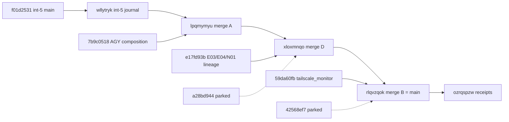

# 20260907-1210- Candidate integration 6: merge all created functionality
#fractal-l0 #fractal-l2 #fractal-l4 #fractal-l5 #zero-muda #tailscale-web #km-triad #rocha-semiotics #cybernetics #jujutsu #swarm #mirage #stamp-stpa

- **Journal Identifier**: `JRN-UOS-CANDIDATE-INTEGRATION-6`
- **Timestamp**: `20260907-1210-`
- **Tailscale FQDN Link**: [http://nas-1.tail55d152.ts.net:4100/docs/docs/journal/20260907-1210-uos-candidate-integration-6-merge-all-created-functionality-journal.md](http://nas-1.tail55d152.ts.net:4100/docs/docs/journal/20260907-1210-uos-candidate-integration-6-merge-all-created-functionality-journal.md)
- **Decision record**: `generated/20260907-1205-uos-decision-record-candidate-integration-6-merge-all-created.json` (prepared before the move, completed after)
- **Transclusions**: `[[zk:20260905-1801-moc-uos-unified-master]]` `[[wiki:20260905-1801-uos-zk-km-corpus-index]]` `[[zk:20260907-0537-adr-062-uos-tui-swarm-hive-mind-message-board-coordination-acl-and-zenoh-infra]]` `[[zk:20260907-0950-adr-063-uos-tui-swarm-work-stream-split]]`
- **Operator directive (verbatim)**: "continue, merge all functionality created"

## Comprehensive Verification Checklist (SC-CHECKLIST-001)
<details><summary>18 checkpoints (state at 20260907-1210)</summary>
CHK-01 PASS · CHK-02 PASS · CHK-03 PASS · CHK-04 PASS · CHK-05 PASS (no new deps; tailscale_monitor uses existing Hermes libraries) · CHK-06 PASS · CHK-07 DECLARED · CHK-08 DECLARED · CHK-09 DECLARED · CHK-10 FAIL-HONEST (164 pre-existing cepaf failing identities; unchanged) · CHK-11 DECLARED · CHK-12 PASS · CHK-13 PASS (Hermes OCaml executable built with dune) · CHK-14..CHK-15 DECLARED · CHK-16 PASS · CHK-17 PARTIAL (Codex key on the Mirage package; AGY and Codex review of this composition pending) · CHK-18 PASS (jj only; lease verified by coordinator event before the move)
</details>

## 1. Scope & Trigger
The operator asked for every piece of created functionality to be merged. Thirty-four visible heads sat off `main`. Most were empty working copies or superseded merges; six carried content.

## 2. Pre-State Assessment
`main` was `muutttsqxlrv/f01d2531` (Codex Mirage package on the restored receipt lineage). Off `main`: AGY's competing Mirage composition, an execution-stream lineage from 2026-09-06 (E03, E04, N01), an undescribed Hermes tailscale monitor, an acceptance-harness orphan, a dormant e03-evidence working copy, and Codex's restored 91eb child.

## 3. Execution Detail
1. Lease claimed with a unique op id and verified by reading the newest coordinator event (165, epoch 19, TTL 3600 s).
2. Heads enumerated and classified by ancestry, author time, and diff against `main`.
3. Merged, one two-parent merge each: AGY composition 7b9c0518 (ledger union 267 ids, all kept), E03/E04/N01 lineage e17fd93b (11 files, no conflicts), tailscale_monitor 59da60fb (2 files).
4. Parked with exact reasons: a28bd944 (older copy of the E04 acceptance files, conflicts in all five) and 42568ef7 (its tools/uos change deletes 1210 lines that `main` has since extended; two conflicts).
5. Gates: swarm 563, boundary PASS, web app builds and tests, ledger valid, tailscale_monitor built by dune after the vendored zenoh-c archive was supplied as an untracked artifact, E04 OCaml scripts 8 + 72 + 66 checks, inventory tool 11 of 11 with its required scratch-root variable, 0 cepaf files changed.
6. Bookmarks moved to the composed head, then to the receipt change; release; reports.

```text
main(int-5) f01d2531 ── wllytryk (int-5 journal) ──┐
AGY composition 7b9c0518 ───────────────────────────┴─ A lpqmymyu ─┐
E03/E04/N01 lineage e17fd93b ──────────────────────────────────────┴─ D xloxmnqo ─┐
tailscale_monitor 59da60fb ────────────────────────────────────────────────────────┴─ B rlqvzqok (=main after gates) ── receipts
parked: a28bd944 (acceptance orphan), 42568ef7 (e03-evidence wc), 986ec4b7 (superseded doc)
```



## 4. Root Cause Analysis
- **Why two parks?** Both parked heads are older snapshots of work that later moved on elsewhere: the acceptance orphan predates the reviewed E04 lineage by ten hours, and the e03-evidence working copy predates 480 lines of tools/uos growth. Merging either would regress `main`.
- **Why did the tailscale build fail first?** Hermes depends on a vendored zenoh-c static archive that jj ignores; the integration workspace had no copy. Supplying the artifact from the default workspace made the build real.
- **Why did the inventory tests fail first?** Three of them require `UOS_INVENTORY_TEST_ROOT`; two already fail at `main` without it. Environment, not code.

## 5. Fix Taxonomy
Per-candidate two-parent merges; append-order ledger union; park-by-abandoning-my-own-merge (candidate commits untouched); build-artifact provisioning for a real dune gate; environment-variable provisioning for env-dependent tests; attribution by comparing against `main` in a scratch workspace.

## 6. Patterns & Anti-Patterns Discovered
- DO verify a lease by reading the newest coordinator event, not by trusting the CLI response (op-id replay lesson from integration 5).
- DO run env-dependent tests at `main` too before calling a failure new.
- AVOID `${PIPESTATUS[0]}` under zsh with `set -u`; capture exit codes with a file and `$?`.
- DO keep parked candidates' commits untouched; only my own merge changes are abandoned.

## 7. Verification Matrix
| Check | Result |
|---|---|
| uos_swarm / uos_tui / boundary | 563 passed, 0 warnings / 198 / G1 PASS |
| indrajaal_gleam_web | builds; 8 tests pass |
| board validate | 267 valid; 3 gaps; 8 forks explicit |
| tailscale_monitor dune build | exit 0; 25,281,792-byte executable |
| e04_adapter_test / runner_test / census_test | 8 / 72 / 66 checks passed |
| ocaml_test_inventory | 11 passed with UOS_INVENTORY_TEST_ROOT (main: 5 passed, 2 failures without it) |
| cepaf | 0 files changed vs main; integration-5 attribution stands (164 distinct == baseline) |
| lease | epoch 19, verified by coordinator event 165 before the move |

## 8. Files Modified
| File | Change |
|---|---|
| `generated/20260907-1205-uos-decision-record-candidate-integration-6-merge-all-created.json` | prepared, completed |
| `apps/uos_swarm/swarm/20260907-0440-swarm-board.jsonl` | union (267), Integrate, ACK, Reports |
| `docs/journal/20260907-1210-...-journal.md` | this journal |
| merged by producers | AGY: `apps/indrajaal_gleam_web/src/indrajaal_gleam_web.gleam` (+17), record 1150, journal 1330, `engines/hermes/modules/tailscale_monitor/{dune,tailscale_monitor.ml}`; execution stream: `tests/acceptance/{e04_adapter.ml,e04_adapter_test.ml,registry.ml,run.ml,golden/receipt.schema.json}`, `tools/ocaml_test_inventory/*`, `tools/source_review/{census.ml,census_test.ml}`, `governance/sources/20260907-0513-e04-census-reproducibility-index.json` |

## 9. Architectural Observations
The head census is a cheap, repeatable way to answer "what is created but not merged". Classifying by fork point and author time separated live work from stale copies quickly. Untracked build artifacts remain the main obstacle to building Hermes in sibling workspaces.

## 10. Remaining Gaps
- P2: parked a28bd944 and 42568ef7; their authors should rebase the still-valuable parts (evidence_truth cepaf module) onto `main`.
- P2: AGY's default workspace is behind `main` and must be rebased by AGY.
- P2: AGY and Codex review of this composition (CHK-17).
- P3: three scratch directories under `.uos-workspaces/` await deletion by the operator.
- P3: the inventory tool tests should create their own scratch root instead of requiring an environment variable.

## 11. Metrics Summary
| Metric | Before | After |
|---|---|---|
| main | `muutttsqxlrv/f01d2531` | `rlqvzqokqltz/302e34b3` then receipts |
| heads off main with content | 6 | 2 parked + 1 superseded |
| board messages (valid) | 266 | 267 plus receipts |
| new failing test identities introduced | — | 0 |
| tokens on integration steps | — | 0 (R0); Fable for design and receipts |

## 12. STAMP & Constitutional Alignment
Control action `bookmark set main`. UCA types: not provided (lease refused: not triggered), provided unsafely (unverified lease: prevented by reading event 165), wrong timing (move before gates: prevented), stopped too soon (parked items silently dropped: prevented by explicit park records on the board and in this journal). Constraints honored: SYNC-03 (verified), SYNC-05 (unions lossless; no shared key deleted), D3/D4/D7, SC-HIVE-DECISION-001, language boundary.

## 13. Conclusion
Everything created that does not regress `main` is now on `main`: AGY's Mirage composition and tailscale monitor, and the execution stream's E03, E04 and N01 work, each with a real build or test gate. Two stale heads are parked with exact conflict lists so their authors can rebase what is still valuable. The lease was verified from the coordinator journal this time, closing the op-id replay lesson from the previous round.

---
Navigation: [ZK Master MOC](http://nas-1.tail55d152.ts.net:4100/zk) · [Hermes Wiki Corpus Index](http://nas-1.tail55d152.ts.net:4100/wiki) · [Review Tome](http://nas-1.tail55d152.ts.net:4100/docs/docs/journal/20260907-1210-uos-candidate-integration-6-merge-all-created-functionality-journal.md)
