# 20260907-1225- Candidate integration 7: merge all created functionality, reaffirmed
#fractal-l0 #fractal-l2 #fractal-l4 #fractal-l5 #zero-muda #tailscale-web #km-triad #rocha-semiotics #cybernetics #jujutsu #swarm #mirage #stamp-stpa

- **Journal Identifier**: `JRN-UOS-CANDIDATE-INTEGRATION-7`
- **Timestamp**: `20260907-1225-`
- **Tailscale FQDN Link**: [http://nas-1.tail55d152.ts.net:4100/docs/docs/journal/20260907-1225-uos-candidate-integration-7-merge-all-created-reaffirmed-journal.md](http://nas-1.tail55d152.ts.net:4100/docs/docs/journal/20260907-1225-uos-candidate-integration-7-merge-all-created-reaffirmed-journal.md)
- **Decision record**: `generated/20260907-1215-uos-decision-record-candidate-integration-7-merge-all-created-reaffirmed.json` (prepared before the move, lost once to a concurrent rewrite, re-created, completed after)
- **Transclusions**: `[[zk:20260905-1801-moc-uos-unified-master]]` `[[wiki:20260905-1801-uos-zk-km-corpus-index]]` `[[zk:20260907-0537-adr-062-uos-tui-swarm-hive-mind-message-board-coordination-acl-and-zenoh-infra]]` `[[zk:20260907-0950-adr-063-uos-tui-swarm-work-stream-split]]`
- **Operator directive (verbatim, twice)**: "continue, merge all functionality crweated"

## Comprehensive Verification Checklist (SC-CHECKLIST-001)
<details><summary>18 checkpoints (state at 20260907-1225)</summary>
CHK-01 PASS · CHK-02 PASS · CHK-03 PASS · CHK-04 PASS · CHK-05 PASS (no new deps) · CHK-06 PASS · CHK-07 DECLARED · CHK-08 DECLARED · CHK-09 DECLARED · CHK-10 FAIL-HONEST (164 pre-existing cepaf failing identities, unchanged) · CHK-11 DECLARED · CHK-12 PASS · CHK-13 PASS (hermes_mirage built with dune) · CHK-14..CHK-15 DECLARED · CHK-16 PASS · CHK-17 PARTIAL (Codex key on the Mirage package; peer review of this composition pending) · CHK-18 PASS (jj only; lease verified from the coordinator journal)
</details>

## 1. Scope & Trigger
The operator repeated the instruction to merge all created functionality after two items had been parked. This round therefore merges the two parked items with their stale parts resolved toward `main`, plus everything the peers created since the previous census.

## 2. Pre-State Assessment
`main` was `ozrqspzwtmqw/7009b1b7`. Off `main`: the two parked heads, Codex's restored 91eb child, N01 and S24 from the execution stream, AGY's new chain (Mirage web cockpit, KVM/QEMU hypervisor probe with forecasting, verification report, journal), and Codex's agentic-infrastructure design docs. The lease was claimed with a unique op id and verified as coordinator event 184, epoch 20.

## 3. Execution Detail
1. Merged N01, S24, AGY web, Codex docs, e03-evidence, the acceptance orphan and the 91eb child in sequence. Stale files were restored from `main`: two uos-tool files from e03-evidence, all five acceptance files from the orphan, the benchmark contract from the 91eb child. The two superseded telemetry merges conflicted only on old record files and were left as historical merges.
2. During gating AGY squashed commits under my two AGY merges. jj swapped their parents for the fork point, the working copy went stale, my composed change diverged, and the record file vanished. I kept the working-copy commit, abandoned my own stray copy, re-created the record, and merged AGY's current frozen head 699979bc instead.
3. The uos tool test for gate exit codes failed; `main` passes it. The cause was e03-evidence's remaining tool files, so they were restored from `main` as well.
4. The ledger union imported an AGY row whose digest does not verify. It is quarantined verbatim in a sidecar and excluded from the validated ledger. My earlier reconcile had already pushed it to the router, which has no digest check on the push path.
5. Gates passed on the final head; bookmarks moved to it and then to the receipt change.

```text
main(int-6) 7009b1b7 ─ work ─┬ N01 ─┬ S24 ─┬ AGYweb* ─┬ Codex docs ─┬ e03-evidence ─┬ orphan ─┬ 91eb child ─┬ AGY head 699979bc ─ 7da9070e (=main) ─ receipts
                              │      │      │(parent    │             │(tools/uos     │(5 files │(contract    │
                              │      │      │ rewritten)│             │ from main)    │ from main)│ from main)│
```

```mermaid
graph LR
  M6[7009b1b7 int-6 main] --> N01[N01 merge]
  N01 --> S24[S24 merge]
  S24 --> AW[AGY web merge, parent rewritten]
  AW --> CD[Codex docs merge]
  CD --> E3[e03-evidence merge, tools/uos from main]
  E3 --> OR[acceptance orphan, files from main]
  OR --> C91[Codex 91eb child, contract from main]
  C91 --> AH[AGY head 699979bc merge = main 7da9070e]
  AH --> RC[receipts]
```



## 4. Root Cause Analysis
- **Why did content vanish mid-gate?** A peer rewrote commits that were parents of in-flight merges. jj rebased the merges and replaced the abandoned parents with the fork point. Constraint gap: no VCS quiescence protocol during an announced integration; requested on the board this round.
- **Why did an invalid row enter the ledger?** The union trusts whatever the peer's ledger copy contains, and the reconcile push path does not apply the digest check that the pull path applies. Two fixes: validate before reconciling, and add the check to the push path.
- **Why did the uos test fail?** e03-evidence changed the tool's FFI and manifest against an older tool; only the two conflicting files had been restored the first time.

## 5. Fix Taxonomy
Toward-main restores for stale files; divergence resolution by abandoning only my own copy; re-merge of the peer's current head; sidecar quarantine for digest-invalid rows; attribution against `main` in a scratch workspace.

## 6. Patterns & Anti-Patterns Discovered
- DO request VCS quiescence from peers before a multi-merge gate; DO re-census after any peer rewrite.
- DO validate the ledger before reconciling after a union; AVOID pushing unions blindly.
- DO restore every file a stale candidate touches in a subsystem, not only the ones that conflicted, when the subsystem's tests say so.
- AVOID hand-shaped board rows; rows must be produced by the library so ids, digests and signatures verify.

## 7. Verification Matrix
| Check | Result |
|---|---|
| cepaf full suite on the final head | 10074 passed; 202 aggregate; 164 distinct == baseline; 0 new; 0 fixed |
| hermes_mirage (hypervisor probe, runner, test) | dune build exit 0 |
| indrajaal_gleam_web | builds; 12 tests pass |
| tools/uos | builds; 14 tests pass (main baseline 14) |
| uos_swarm / uos_tui / boundary | 563 with 0 warnings / 198 / G1 PASS |
| board validate | 273 valid; 3 gaps; 8 forks explicit; 1 row quarantined |
| N01 peer_http_service_test | passed |
| lease | epoch 20, verified as coordinator event 184 |

## 8. Files Modified
| File | Change |
|---|---|
| `generated/20260907-1215-...-integration-7-...json` | prepared, re-created, completed |
| `apps/uos_swarm/swarm/20260907-0440-swarm-board.jsonl` | unions; Integrate; ACK; Reports |
| `apps/uos_swarm/swarm/20260907-0440-swarm-board.jsonl.digest-rejected.jsonl` | new sidecar; 1 quarantined row with reason |
| `docs/journal/20260907-1225-...-journal.md` | this journal |
| merged by producers | AGY chain 953f6d36..699979bc (web, hermes_mirage hypervisor probe, cepaf forecasting, swarm report, journal); N01 tool/test/web; S24 review JSON; Codex ainf-design docs; e03-evidence cepaf evidence_truth and web evidence surface |

## 9. Architectural Observations
Peers now produce work faster than a single serialized integrator can gate it, and they rewrite history under in-flight merges. The integration protocol needs two mechanized guards: a quiescence flag on the coordinator that peers honor while `integration/main` is leased, and digest and signature validation on the board's push path.

## 10. Remaining Gaps
- P1: reconcile push path lacks digest validation (reported to Codex with a proposed fix).
- P1: no mechanized VCS quiescence during a leased integration.
- P2: AGY's default workspace must be rebased by AGY; AGY's quiescence ACK pending.
- P2: peer review of this composition (CHK-17).
- P3: scratch directories attrib-mirage, attrib-mirage-2, gate-main, gate-main-2 await deletion by the operator.

## 11. Metrics Summary
| Metric | Before | After |
|---|---|---|
| main | `ozrqspzwtmqw/7009b1b7` | `pxvuyxwwvrkr/7da9070e` then receipts |
| non-empty heads off main with functionality | 8 | 0 (2 lineage-only historical merges remain) |
| cepaf passed / aggregate / distinct | 10052 / 202 / 164 | 10074 / 202 / 164 |
| board messages (valid) | 267 | 273 plus receipts |
| quarantined rows | 0 | 1 |
| merges dropped for gate failure | — | 0 |

## 12. STAMP & Constitutional Alignment
Control action `bookmark set main`. UCA types: not provided (none), provided unsafely (invalid ledger row: caught by the strict validator before the move), wrong timing (peer rewrite during gate: recovered, quiescence requested), stopped too soon (parked items left off: closed by the operator's reaffirmation). Constraints honored: SYNC-03 verified, SYNC-05 honored (router key left; sidecar instead of deletion), D3/D4/D7, SC-HIVE-DECISION-001, language boundary.

## 13. Conclusion
All created functionality is on `main`: the execution stream's N01 and S24, AGY's complete Mirage and hypervisor forecasting chain, Codex's design docs, and the evidence-truth work, with stale parts of old candidates resolved toward `main` and every subsystem gate green including a clean cepaf attribution. The round surfaced two protocol defects worth fixing next: unchecked pushes on the board and no quiescence during leased integrations.

---
Navigation: [ZK Master MOC](http://nas-1.tail55d152.ts.net:4100/zk) · [Hermes Wiki Corpus Index](http://nas-1.tail55d152.ts.net:4100/wiki) · [Review Tome](http://nas-1.tail55d152.ts.net:4100/docs/docs/journal/20260907-1225-uos-candidate-integration-7-merge-all-created-reaffirmed-journal.md)
