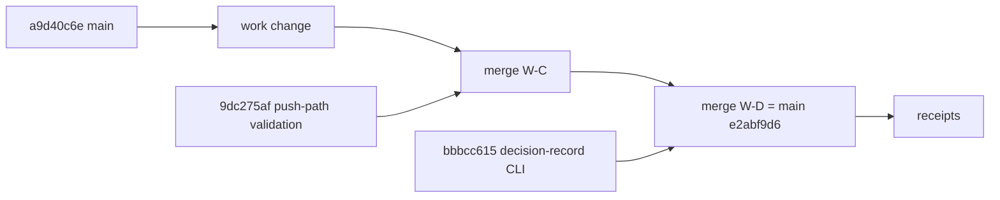

# 20260907-1250- R4 slices: reconcile push-path validation and the decision-record CLI
#fractal-l0 #fractal-l2 #fractal-l3 #fractal-l4 #zero-muda #tailscale-web #km-triad #rocha-semiotics #cybernetics #jujutsu #swarm #routing #stamp-stpa

- **Journal Identifier**: `JRN-UOS-R4-PUSH-CHECK-AND-DECISION-RECORD-CLI`
- **Timestamp**: `20260907-1250-`
- **Tailscale FQDN Link**: [http://nas-1.tail55d152.ts.net:4100/docs/docs/journal/20260907-1250-uos-r4-slices-push-path-validation-and-decision-record-cli-journal.md](http://nas-1.tail55d152.ts.net:4100/docs/docs/journal/20260907-1250-uos-r4-slices-push-path-validation-and-decision-record-cli-journal.md)
- **Decision record**: `generated/20260907-1230-uos-decision-record-r4-dispatch-push-check-and-decision-record-cli.json` (prepared before dispatch; completed by the new `decision-record complete` arm after the move)
- **Transclusions**: `[[zk:20260905-1801-moc-uos-unified-master]]` `[[wiki:20260905-1801-uos-zk-km-corpus-index]]` `[[zk:20260907-0537-adr-062-uos-tui-swarm-hive-mind-message-board-coordination-acl-and-zenoh-infra]]` `[[wiki:20260907-0930-intelligence-routing-rule]]`
- **Operator directive (verbatim)**: "continue"

## Comprehensive Verification Checklist (SC-CHECKLIST-001)
<details><summary>18 checkpoints (state at 20260907-1250)</summary>
CHK-01 PASS · CHK-02 PASS · CHK-03 PASS · CHK-04 PASS · CHK-05 PASS (no new deps; two small Erlang FFI helpers) · CHK-06 PASS · CHK-07 DECLARED · CHK-08 DECLARED · CHK-09 DECLARED · CHK-10 FAIL-HONEST (cepaf untouched this round; 164 pre-existing identities unchanged) · CHK-11 DECLARED · CHK-12 PASS (Gleam/OTP; Erlang FFI) · CHK-13..CHK-15 DECLARED · CHK-16 PASS · CHK-17 PARTIAL (Fable gate; peer review pending) · CHK-18 PASS (jj only; lease verified from the coordinator journal)
</details>

## 1. Scope & Trigger
Two defects surfaced by integration 7 sat in modules owned by this stream: the board's reconcile pushed local rows without the digest and signature checks the pull path applies, and decision records were still written with jq glue instead of Gleam. The operator said "continue"; the routing rule sends bounded implementation to Sonnet.

## 2. Pre-State Assessment
`main` at `wtzmuuzpwyqn/a9d40c6e`. uos_swarm 563 tests. One digest-invalid AGY row on the router, rejected on pull, pushed there by the unchecked push path. Records for six integration rounds hand-written.

## 3. Execution Detail
1. Prepared the dispatch record; posted two Dispatch messages with route class R4, tier Sonnet, cost estimate and reason.
2. Two Sonnet workers in fresh sibling workspaces on `main`.
   - W-C added `coord.filter_pushable` applying digest, policy and, when keyed, signature checks before any `zenoh_put`, added `SyncReport.push_rejected`, printed it in the CLI, and added two tests. 565 tests.
   - W-D added `decision_record_cli.gleam`, a thin adapter on the canonical wire shape, with `decision-record prepare` and `complete` arms, two total FFI helpers, and twelve tests. 575 tests.
3. Each candidate re-verified by me in its workspace: format clean, zero warnings, tests as reported; the CLI exercised end to end with prepare, complete, forecast unchanged, and a refused second completion.
4. Two two-parent merges on the integration head; 577 tests, split gate PASS, ledger valid 279; a live reconcile shows push_rejected 0 and the router's invalid row still rejected on pull.
5. Lease claimed with a unique op id and verified as coordinator event 238; bookmarks to the head, receipts, bookmarks to the receipt change, release.
6. The dispatch record was completed by the new CLI arm.

```text
main a9d40c6e ─ work ─┬─ merge W-C (9dc275af) ─┬─ merge W-D (bbbcc615) = e2abf9d6 (main) ─ receipts
                      │ push-path validation   │ decision-record CLI
```



## 4. Root Cause Analysis
- **Why did the push path lack checks?** The board was built pull-first: forgery defence was placed where remote rows enter. Local rows were trusted because they were produced by the library, until a peer edited its ledger copy by hand.
- **Why jq glue for records?** The peer's `decision_record.gleam` encodes a different schema (action-boundary records); the integration records grew separately. The adapter keeps one canonical file shape and reuses only the schema constant.

## 5. Fix Taxonomy
Pure-function extraction with the same predicates as the pull path; report field addition with every constructor updated; adapter module over a canonical wire format; immutable-forecast invariant tested by byte comparison.

## 6. Patterns & Anti-Patterns Discovered
- DO route bounded, well-specified slices to Sonnet with an exact brief, then re-verify in the worker's workspace before merging.
- DO test push filters as pure functions; AVOID network fakes for reconcile.
- AVOID trusting locally produced rows: every row crossing to the shared store is checked identically in both directions.
- Both workers reformatted one unrelated test file as a side effect of the mandated `gleam format`; identical output, so the merges did not conflict.

## 7. Verification Matrix
| Check | Result |
|---|---|
| W-C in its workspace | format clean; 0 warnings; 565 passed |
| W-D in its workspace | format clean; 0 warnings; 575 passed; end-to-end prepare/complete/refuse |
| composed head | 0 warnings; 577 passed; split gate PASS; board valid 279 |
| live reconcile after the fix | pushed 0; push_rejected 0; digest_rejected 1 (router-side invalid row) |
| lease | epoch 21, verified as coordinator event 238 |
| transient | one swarm test failed once right after the W-C merge; two reruns 565/565; name not captured |

## 8. Files Modified
| File | Change |
|---|---|
| `apps/uos_swarm/src/uos_swarm/coord.gleam` | `filter_pushable`; `SyncReport.push_rejected` |
| `apps/uos_swarm/src/uos_swarm/decision_record_cli.gleam` | new adapter + CLI logic |
| `apps/uos_swarm/src/uos_swarm.gleam` | reconcile output; two new arms; usage |
| `apps/uos_swarm/src/uos_swarm_ffi.erl` | `getenv/2`, `ensure_dir/1` |
| `apps/uos_swarm/test/coord_test.gleam`, `test/decision_record_cli_test.gleam` | 2 + 12 tests |
| `apps/uos_swarm/test/session_observation_test.gleam` | formatter whitespace only |
| `generated/20260907-1230-...json` | prepared; completed by the CLI |
| `apps/uos_swarm/swarm/20260907-0440-swarm-board.jsonl` | Dispatch x2; Integrate; Reports |
| `docs/journal/20260907-1250-...journal.md` | this journal |

## 9. Architectural Observations
The cheapest-tier rule worked as designed on this package: two first-try deliveries, each re-verifiable in minutes, with Fable spending its tokens on the brief, the review and the gate. The board is now symmetric in trust; the remaining asymmetry is the coordinator's lease, which still grants mutual exclusion only.

## 10. Remaining Gaps
- P1: coordinator-side quiescence flag (proposed to Codex, owner of session_sync).
- P2: the router still holds one digest-invalid AGY row; left per SYNC-05; rejected on every pull.
- P2: AGY quiescence ACK and default-workspace rebase pending.
- P3: worker workspace directories `w-push-check` and `w-dr-cli` and four scratch directories await deletion by the operator.
- P3: older records in `generated/` keep `phase: prepared` while carrying a `completed` block; the CLI writes `completed`; a one-time normalization is a candidate for a later slice.

## 11. Metrics Summary
| Metric | Before | After |
|---|---|---|
| main | `wtzmuuzpwyqn/a9d40c6e` | `tzmnqxwrnxvy/e2abf9d6` then receipts |
| uos_swarm tests | 563 | 577 |
| reconcile checks on push | none | digest + policy + signature |
| records written by Gleam | 0 | 1 (this round's completion) |
| worker cost (harness-reported) | — | 606,021 Sonnet tokens; 0 USD attributed |
| Fable tokens on integration steps | — | 0 (R0); design and gate only |

## 12. STAMP & Constitutional Alignment
Control actions: `zenoh_put` on reconcile (CA-push) and `bookmark set main`. UCA for CA-push: provided unsafely (unverified row pushed) — now constrained by `filter_pushable`, enforced in code and tested (constraint SC-BOARD-PUSH-001, mechanized). UCA for the main move: provided without a verified lease — prevented by reading the coordinator event before the move. SYNC-03, SYNC-05, D3/D4/D7, SC-HIVE-DECISION-001 and the routing rule honored.

## 13. Conclusion
The board now refuses to push what it would refuse to pull, and integration decisions are recorded by a Gleam CLI that keeps forecasts immutable. Both slices came from Sonnet workers on first attempt and were re-verified before merging under a verified lease. The next protocol step is on the coordinator side: a quiescence flag while `integration/main` is leased.

---
Navigation: [ZK Master MOC](http://nas-1.tail55d152.ts.net:4100/zk) · [Hermes Wiki Corpus Index](http://nas-1.tail55d152.ts.net:4100/wiki) · [Review Tome](http://nas-1.tail55d152.ts.net:4100/docs/docs/journal/20260907-1250-uos-r4-slices-push-path-validation-and-decision-record-cli-journal.md)
