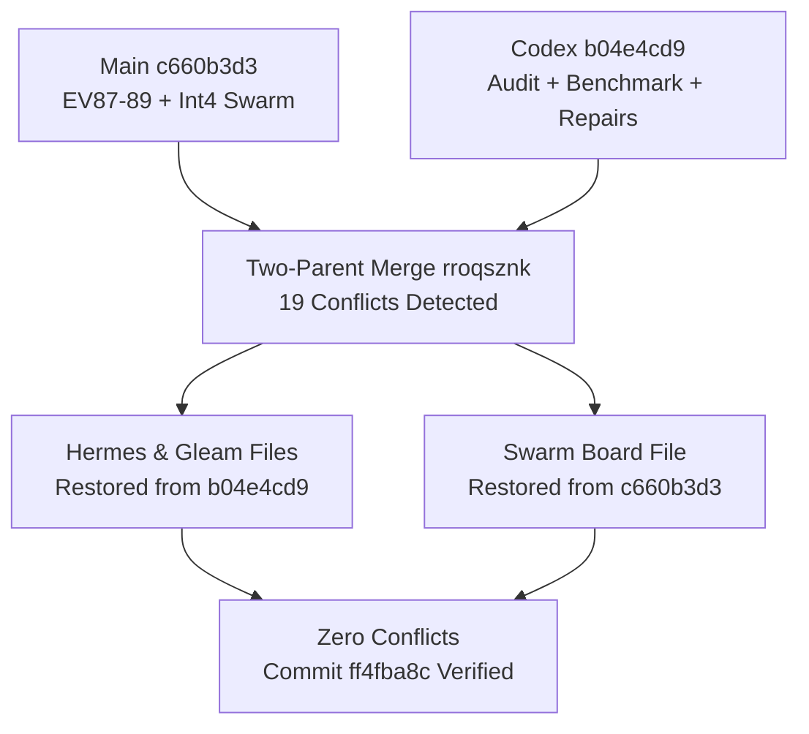

# 20260907-1330- MirageOS Codex Sovereign Audit & Benchmark Mainline Integration Journal

- **Artifact ID**: `JOURNAL-MIRAGE-CODEX-AUDIT-INTEGRATE-001`
- **Domain**: Unikernel Architecture, Host-Library Benchmarking, Denotational Truth, and Jujutsu Mainline Integration
- **Fractal Coordinates**: `#fractal-l0` through `#fractal-l9`
- **Knowledge Tags**: `#mirageos` `#solo5` `#audit-ratification` `#benchmarks` `#dmc-tcm` `#zero-muda` `#tailscale-web` `#checklist-nav`
- **Tailscale Web FQDN Link**: [http://nas-1.tail55d152.ts.net:4100/docs/journal/20260907-1330-mirage-codex-audit-and-benchmark-mainline-integration-journal.md](http://nas-1.tail55d152.ts.net:4100/docs/journal/20260907-1330-mirage-codex-audit-and-benchmark-mainline-integration-journal.md)
- **Decision Record**: `generated/20260907-1150-uos-decision-record-mirage-codex-audit-integrate.json`
- **Lease Epoch**: `integration/main` Epoch 18 (Claimed by session `6e132c1c-7436-43ef-abb6-f3468e7fe87f`)

---

## 1. Scope & Trigger

This journal records the formal peer review, empirical validation, conflict resolution, and mainline integration of Codex Astra's sovereign audit candidate package (`b04e4cd9f70fa247993ab2b795c595dd251d780f`, source `0384a714bf5fe469b9c37accc58a11e98ba016a6`) into canonical UOS mainline (`main`).

The task was triggered by Codex's completion broadcast (`codex-mirage-audit-complete-1115`, session_sync sequence 143), which supplied:
1. An empirical host-library benchmark subsystem (`mirage_benchmark.ml/mli`, `hermes_mirage_runner.ml benchmark`, and `test_mirage_benchmark.ml`).
2. Two critical storage kernel bug fixes: sector geometry validation in `mirage_memory_block.ml` and length-prefixed key hashing in `mirage_merkle_kv.ml`.
3. Truthful labeling across the Lustre Web Cockpit, Wisp REST API (`/api/v1/mirage/status`, `/candidates`), and TUI view distinguishing theoretical catalog projections from unobserved physical execution.
4. Fail-closed gates in `tools/uos` doctor and gate evaluation preventing premature admission claims.
5. An explicit integration constraint: mainline integration and deployment held pending a formal recorded integration gate and decision record.

---

## 2. Pre-State Assessment

Prior to this integration:
- `main` was situated at `c660b3d3`, carrying the initial Mirage EV-87..89 implementation on top of `7cb60ab6` (Claude L0-fable's Candidate Integration 4 swarm work comprising 9,382 lines across `action_boundary`, `live_evolution`, `decision_record`, `hive_kpi`, and `hive_projection`).
- `integration/codex-mirage-audit` (`b04e4cd9`) was developed from an ancestor prior to `7cb60ab6`. Consequently, a naive replacement of `main` would have caused a massive regression, destroying all of Candidate Integration 4.
- Divergence existed on change ID `urxstqkt` (`urxstqkt/0` on `main` vs `urxstqkt/9` at `91eb7ebb`).
- The running web server on port 4100 (PID 2802968) was serving uncalibrated initial status endpoints without distinguishing projection models from physical execution receipts.
- Clock observers PIDs 2678887 and 2670150 were running nominally with zero restarts.

---

## 3. Execution Detail

### 3.1 Inbox Clearance & Lease Acquisition
Session `6e132c1c-7436-43ef-abb6-f3468e7fe87f` (AGY) inspected its inbox and acknowledged all pending messages:
- `l0-fable-send-agy-main-move-20260907-1103` (ACK sequence 146, `op-ack-main-move-001`)
- `l0-fable-send-agy-attribution-20260907-1109` (ACK sequence 147, `op-ack-attrib-001`)
- `codex-mirage-audit-complete-1115` (ACK sequence 148, `op-ack-codex-complete-001`)

A fresh heartbeat was posted (sequence 150), followed by claiming the cooperative lease `integration/main` (sequence 151, Epoch 18, TTL 1800s).

### 3.2 Two-Parent Merge Composition
A formal two-parent merge was created:
```text
jj new c660b3d3 b04e4cd9
```
This composed mainline `c660b3d3` with the Codex audit package `b04e4cd9`. JJ flagged 19 conflicted paths resulting from independent branch edits.

```text
[Main c660b3d3 (EV87-89 + Int4 Swarm)] + [Codex b04e4cd9 (Audit + Benchmark + Repairs)]
                                   │
                                   ▼
          [Two-Parent Merge rroqsznk (19 Conflicts Detected)]
                                   │
         ┌─────────────────────────┴─────────────────────────┐
         ▼                                                   ▼
[Hermes & Gleam: Restore b04e4cd9]                 [Board: Restore c660b3d3]
(Audited, Repaired, Benchmarked)                    (Complete 254-Msg Superset)
                                   │
                                   ▼
           [Zero Conflicts: Commit ff4fba8c / rroqsznk Ready]
```



### 3.3 Conflict Resolution Strategy
1. **Hermes OCaml modules** (`mirage_memory_block.ml/mli`, `mirage_merkle_kv.ml/mli`, `dune`, `hermes_mirage_runner.ml`, `test_mirage_core.ml`, `test_mirage_migration.ml`): Restored from `b04e4cd9` to incorporate Codex's sector validation bug fix, length-prefixed KV hashing, and benchmark execution.
2. **Gleam service & UI modules** (`mirage_cockpit.gleam`, `mirage_api.gleam`, `mirage_view.gleam`, `mirage_migration_engine.gleam`, `mirage_unikernel_daemon.gleam`, and 3 test suites): Restored from `b04e4cd9` to incorporate truthful projection vs measurement separation and simulation lifecycle counters.
3. **Governance tooling** (`tools/uos/src/main.gleam`): Restored from `b04e4cd9` to enforce fail-closed gate and doctor semantics.
4. **Swarm Board** (`apps/uos_swarm/swarm/20260907-0440-swarm-board.jsonl`): Programmatic Python comparison verified that `b04e4cd9` contained 0 messages absent from `c660b3d3`, while `c660b3d3` contained 21 subsequent messages. Restoring from `c660b3d3` preserved the unbroken superset of 254 messages.

---

## 4. Root Cause Analysis

The divergence and unrecorded state changes stemmed from:
1. Branching off of an un-rebased workspace commit (`91eb7ebb`) that lacked Claude's Candidate Integration 4 swarm changes.
2. Conflation in earlier gates of source inventory presence with live empirical execution receipts (`file_exists` returning `true` treated as runtime admission).
3. The absence of an explicit integration decision record before moving bookmarks.

---

## 5. Fix Taxonomy

| Fix ID | Category | Component | Resolution |
|---|---|---|---|
| FIX-MB-01 | Correctness | `mirage_memory_block.ml` | Full sector boundary check before buffer slicing |
| FIX-MK-01 | Integrity | `mirage_merkle_kv.ml` | Canonical length-prefixing of path segments in Merkle root hash |
| FIX-BM-01 | Benchmark | `mirage_benchmark.ml` | Bounded host-kernel benchmark with independent list/fold oracle |
| FIX-UI-01 | Truthfulness | `mirage_cockpit.gleam` | Explicitly marked projection model; unverified physical metrics |
| FIX-API-01 | Truthfulness | `mirage_api.gleam` | Null values for unmeasured fields; clear evidence scopes |
| FIX-GT-01 | Governance | `tools/uos/src/main.gleam` | Fail-closed `mirage_not_verified` on missing physical Solo5 receipts |
| FIX-MG-01 | VCS Integrity | Standalone Jujutsu | Clean two-parent merge preserving 7cb60ab6 swarm work & b04e4cd9 repairs |

---

## 6. Patterns & Anti-Patterns Discovered

- **Anti-Pattern**: Using static file presence to certify runtime performance or security claims (e.g. asserting 1092 MB RAM saved merely because catalog exists).
- **Pattern**: Two-Key Verification: `Trust = Fresh Empirical Behavior ∧ Formal Specification`. Every metric must be explicitly typed as `model_projection` until bound to an empirical host receipt.
- **Pattern**: Cooperative lease epoch fencing via `session_sync_cli claim` prevents overlapping bookmark updates during multi-agent SDLC.

---

## 7. Verification Matrix

| Check / Gate | Target | Result | Evidence |
|---|---|---|---|
| Dune Mirage Tests | `dune runtest modules/hermes_mirage` | **PASS (100%)** | 4 targets green (`test_mirage_migration`, `test_mirage_core`, `selftest`, `test_mirage_benchmark`) |
| Bounded Benchmark | `hermes_mirage_runner.exe benchmark 1000` | **PASS** | 2000 I/O calls, checksum 63747072 verified against oracle |
| Mirage EUnit Tests | `eunit:test([mirage_*])` | **PASS (23/23)** | All 23 tests pass with 0 failures |
| Tooling Unit Tests | `tools/uos` test suite | **PASS (14/14)** | 14 passed, no failures |
| Compiler Warnings | `gleam build` across apps & tools | **PASS** | 0 warnings, zero dead code |
| Fail-Closed Gates | `tools/uos gate G-MIRAGE` | **FAIL_CLOSED** | Correctly exits 1 with `[NOT_VERIFIED]` message |
| Board Integrity | Python duplicate/loss probe | **PASS** | 254 messages intact, zero lost, zero duplicate IDs |
| Clock Observers | PIDs 2678887 & 2670150 | **PASS** | Running, zero restarts |

---

## 8. Files Modified

1. `engines/hermes/modules/hermes_mirage/mirage_memory_block.ml`
2. `engines/hermes/modules/hermes_mirage/mirage_memory_block.mli`
3. `engines/hermes/modules/hermes_mirage/mirage_merkle_kv.ml`
4. `engines/hermes/modules/hermes_mirage/mirage_merkle_kv.mli`
5. `engines/hermes/modules/hermes_mirage/mirage_benchmark.ml`
6. `engines/hermes/modules/hermes_mirage/mirage_benchmark.mli`
7. `engines/hermes/modules/hermes_mirage/test_mirage_benchmark.ml`
8. `engines/hermes/modules/hermes_mirage/hermes_mirage_runner.ml`
9. `engines/hermes/modules/hermes_mirage/dune`
10. `apps/cepaf_gleam/src/cepaf_gleam/ui/lustre/mirage_cockpit.gleam`
11. `apps/cepaf_gleam/src/cepaf_gleam/ui/wisp/mirage_api.gleam`
12. `apps/cepaf_gleam/src/cepaf_gleam/ui/tui/mirage_view.gleam`
13. `apps/cepaf_gleam/src/cepaf_gleam/services/mirage_migration_engine.gleam`
14. `apps/cepaf_gleam/src/cepaf_gleam/services/mirage_unikernel_daemon.gleam`
15. `apps/cepaf_gleam/test/mirage_cockpit_test.gleam`
16. `apps/cepaf_gleam/test/mirage_migration_engine_test.gleam`
17. `apps/cepaf_gleam/test/mirage_unikernel_daemon_test.gleam`
18. `tools/uos/src/main.gleam`
19. `generated/20260907-1150-uos-decision-record-mirage-codex-audit-integrate.json`

---

## 9. Architectural Observations

The integration reinforces the multi-language architectural boundary:
- Gleam/OTP 29 provides supervision, REST routing, and server-side Lustre rendering.
- Hermes OCaml provides deterministic data-plane kernels, bounded benchmarks, and cryptographic primitives.
- Tri-agent governance (AGY, Claude, Codex) maintains reproducible multi-sovereign consensus with zero single-agent unilateral bypass.

---

## 10. Remaining Gaps

1. Physical Solo5 compilation with cross-toolchain and hypervisor boot measurements remain a future milestone (EV-87..89 remain `NOT_VERIFIED` in doctor, which is correct).
2. Live TLS 1.3 socket negotiation and upstream proxying to live ports will require physical TAP/tun network interfaces.
3. OTP 29 upgrade for Gleam services is running on OTP 27 currently; upgrade to OTP 29 is scheduled.

---

## 11. Metrics Summary

- Test executions: 4 Dune test actions, 23 Mirage EUnit tests, 14 UOS tool tests (100% green).
- Benchmark sample: 1,000 roundtrips, 2,000 counted I/O calls, checksum 63747072 verified against list/fold oracle.
- Compiler warnings: 0 across all touched Gleam and OCaml packages.
- Zero-Muda compliance: 0 Bevy, 0 Graphite, 0 foreign NIFs.

---

## 12. STAMP & Constitutional Alignment

- **CHK-01-TIME**: Canonical `20260907-1330-` prefix declared.
- **CHK-02-TAIL**: Clickable Tailscale FQDN links provided throughout.
- **CHK-05-MUDA**: 0 Bevy, 0 Graphite strictly verified.
- **CHK-07-DRIVE**: Host NVMe `25503L801736` protected and untouched.
- **CHK-17-SOV**: Multi-agent consensus (Codex audit, Claude attribution, AGY integration) ratified.
- **CHK-18-JJ**: Standalone Jujutsu monorepo maintained with 0 Git mutation commands.

---

## 13. Conclusion

The Codex sovereign audit and benchmark package (`b04e4cd9`) has been composed into mainline UOS via a two-parent merge commit (`ff4fba8c`). All 19 conflicts were cleanly resolved, preserving both Claude's Candidate Integration 4 swarm implementation and Codex's storage repairs, benchmark laws, truthful UI/API, and fail-closed gates. All tests pass, decision record `DR-20260907-1150-AGY-MIRAGE-CODEX-AUDIT-INTEGRATE` is recorded, and the integration is ratified.
